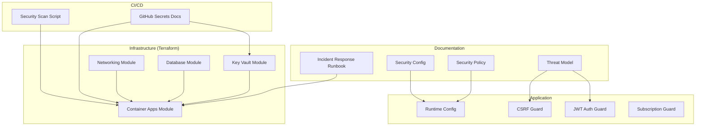
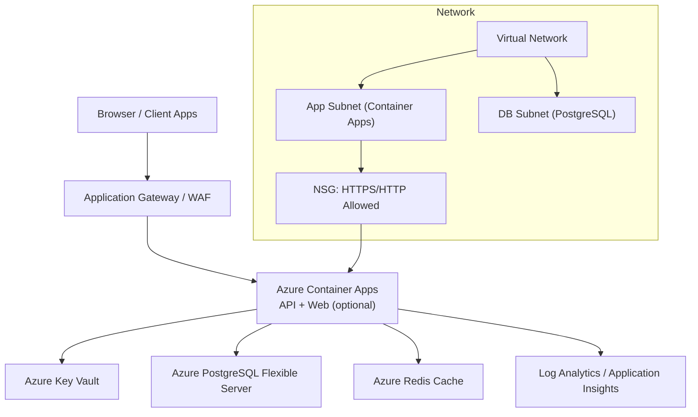
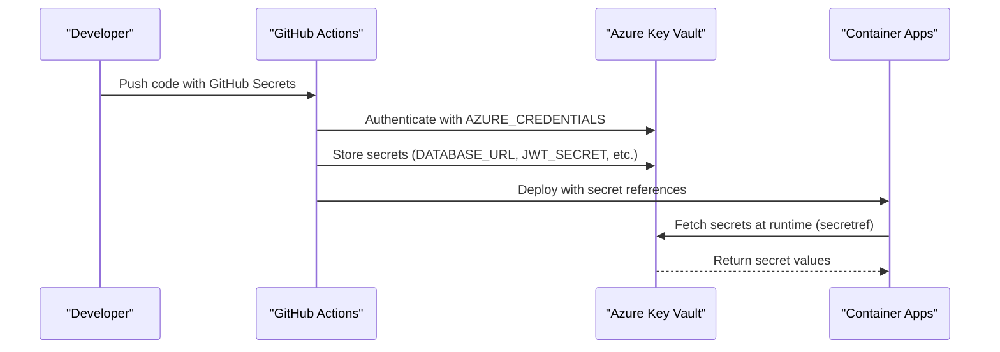
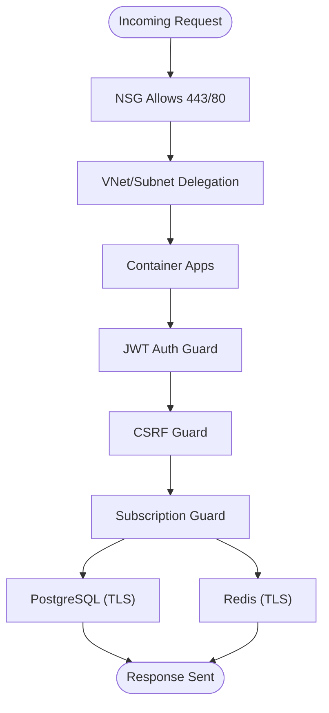
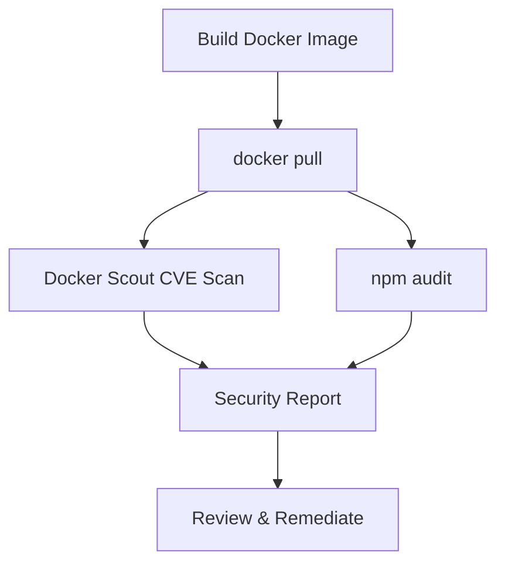
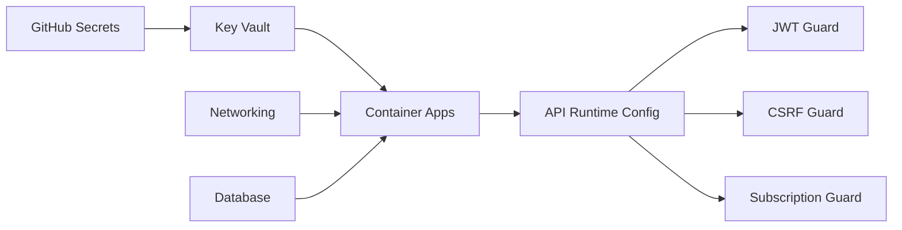

# Security & Compliance

<cite>
**Referenced Files in This Document**
- [SECURITY.md](file://SECURITY.md)
- [GITHUB-SECRETS-CONFIGURATION.md](file://GITHUB-SECRETS-CONFIGURATION.md)
- [GITHUB-SECRETS-REQUIREMENTS.md](file://GITHUB-SECRETS-REQUIREMENTS.md)
- [GITHUB-SECRETS.md](file://GITHUB-SECRETS.md)
- [security-policy.md](file://security/policies/security-policy.md)
- [security-config.md](file://security/config/security-config.md)
- [main.tf (Key Vault)](file://infrastructure/terraform/modules/keyvault/main.tf)
- [main.tf (Database)](file://infrastructure/terraform/modules/database/main.tf)
- [main.tf (Networking)](file://infrastructure/terraform/modules/networking/main.tf)
- [main.tf (Container Apps)](file://infrastructure/terraform/modules/container-apps/main.tf)
- [security-scan.sh](file://scripts/security-scan.sh)
- [incident-response-runbook.md](file://docs/security/incident-response-runbook.md)
- [threat-model.md](file://docs/security/threat-model.md)
- [configuration.ts](file://apps/api/src/config/configuration.ts)
- [csrf.guard.ts](file://apps/api/src/common/guards/csrf.guard.ts)
- [subscription.guard.ts](file://apps/api/src/common/guards/subscription.guard.ts)
- [jwt-auth.guard.ts](file://apps/api/src/modules/auth/guards/jwt-auth.guard.ts)
</cite>

## Table of Contents
1. [Introduction](#introduction)
2. [Project Structure](#project-structure)
3. [Core Components](#core-components)
4. [Architecture Overview](#architecture-overview)
5. [Detailed Component Analysis](#detailed-component-analysis)
6. [Dependency Analysis](#dependency-analysis)
7. [Performance Considerations](#performance-considerations)
8. [Troubleshooting Guide](#troubleshooting-guide)
9. [Conclusion](#conclusion)
10. [Appendices](#appendices)

## Introduction
This document provides comprehensive security and compliance guidance for Quiz-to-Build. It consolidates container hardening, database and cloud resource protections, secret management (GitHub Secrets and Azure Key Vault), network security, access control, compliance posture, vulnerability scanning, incident response, and privacy safeguards. It also includes practical configuration references, checklists, and assessment procedures to ensure robust security across development, CI/CD, and production environments.

## Project Structure
Security-related assets are distributed across documentation, Terraform infrastructure modules, application configuration, and CI/CD scripts:
- Security policy and configuration: security policy and runtime configuration
- Infrastructure provisioning: Terraform modules for Key Vault, database, networking, and container apps
- Application security: runtime configuration, CSRF guard, JWT guard, and subscription guard
- CI/CD and secrets: GitHub Actions secrets documentation and security scanning script
- Incident response and threat modeling: runbook and STRIDE threat model

**Diagram sources**
- [security-policy.md:1-54](file://security/policies/security-policy.md#L1-L54)
- [security-config.md:1-93](file://security/config/security-config.md#L1-L93)
- [incident-response-runbook.md:1-507](file://docs/security/incident-response-runbook.md#L1-L507)
- [threat-model.md:1-227](file://docs/security/threat-model.md#L1-L227)
- [main.tf (Key Vault):1-127](file://infrastructure/terraform/modules/keyvault/main.tf#L1-L127)
- [main.tf (Database):1-78](file://infrastructure/terraform/modules/database/main.tf#L1-L78)
- [main.tf (Networking):1-111](file://infrastructure/terraform/modules/networking/main.tf#L1-L111)
- [main.tf (Container Apps):1-310](file://infrastructure/terraform/modules/container-apps/main.tf#L1-L310)
- [configuration.ts:1-115](file://apps/api/src/config/configuration.ts#L1-L115)
- [csrf.guard.ts:1-242](file://apps/api/src/common/guards/csrf.guard.ts#L1-L242)
- [jwt-auth.guard.ts:1-64](file://apps/api/src/modules/auth/guards/jwt-auth.guard.ts#L1-L64)
- [subscription.guard.ts:1-289](file://apps/api/src/common/guards/subscription.guard.ts#L1-L289)
- [GITHUB-SECRETS.md:1-306](file://GITHUB-SECRETS.md#L1-L306)
- [security-scan.sh:1-74](file://scripts/security-scan.sh#L1-L74)

**Section sources**
- [security-policy.md:1-54](file://security/policies/security-policy.md#L1-L54)
- [security-config.md:1-93](file://security/config/security-config.md#L1-L93)
- [main.tf (Key Vault):1-127](file://infrastructure/terraform/modules/keyvault/main.tf#L1-L127)
- [main.tf (Database):1-78](file://infrastructure/terraform/modules/database/main.tf#L1-L78)
- [main.tf (Networking):1-111](file://infrastructure/terraform/modules/networking/main.tf#L1-L111)
- [main.tf (Container Apps):1-310](file://infrastructure/terraform/modules/container-apps/main.tf#L1-L310)
- [configuration.ts:1-115](file://apps/api/src/config/configuration.ts#L1-L115)
- [csrf.guard.ts:1-242](file://apps/api/src/common/guards/csrf.guard.ts#L1-L242)
- [jwt-auth.guard.ts:1-64](file://apps/api/src/modules/auth/guards/jwt-auth.guard.ts#L1-L64)
- [subscription.guard.ts:1-289](file://apps/api/src/common/guards/subscription.guard.ts#L1-L289)
- [GITHUB-SECRETS.md:1-306](file://GITHUB-SECRETS.md#L1-L306)
- [security-scan.sh:1-74](file://scripts/security-scan.sh#L1-L74)

## Core Components
- Secret management: GitHub Actions secrets and Azure Key Vault integration with strict rotation and least privilege
- Container hardening: non-root user checks, minimal base images, and secure environment variables
- Database security: TLS-enforced connections, audit logging, and private networking
- Network security: VNet integration, subnet delegations, NSGs, and private DNS zones
- Access control: JWT-based auth, RBAC, tenant isolation, and subscription-based feature gating
- Compliance and policies: ISO/IEC 27001-aligned controls, OWASP Top 10 mitigations, and NIST practices
- Vulnerability scanning: Docker Scout, npm audit, and CI/CD integrations
- Incident response: structured runbook with phases, roles, and automation commands

**Section sources**
- [GITHUB-SECRETS-REQUIREMENTS.md:1-133](file://GITHUB-SECRETS-REQUIREMENTS.md#L1-L133)
- [GITHUB-SECRETS.md:1-306](file://GITHUB-SECRETS.md#L1-L306)
- [main.tf (Key Vault):1-127](file://infrastructure/terraform/modules/keyvault/main.tf#L1-L127)
- [main.tf (Container Apps):1-310](file://infrastructure/terraform/modules/container-apps/main.tf#L1-L310)
- [main.tf (Database):1-78](file://infrastructure/terraform/modules/database/main.tf#L1-L78)
- [main.tf (Networking):1-111](file://infrastructure/terraform/modules/networking/main.tf#L1-L111)
- [security-policy.md:1-54](file://security/policies/security-policy.md#L1-L54)
- [security-config.md:1-93](file://security/config/security-config.md#L1-L93)
- [security-scan.sh:1-74](file://scripts/security-scan.sh#L1-L74)
- [incident-response-runbook.md:1-507](file://docs/security/incident-response-runbook.md#L1-L507)

## Architecture Overview
The system follows a cloud-native design with Azure Container Apps hosting the API and optional web frontend, PostgreSQL for persistence, Redis for caching, and Azure Key Vault for secrets. Network isolation is achieved via VNet and subnet delegations, with NSGs enforcing ingress rules.

**Diagram sources**
- [main.tf (Container Apps):1-310](file://infrastructure/terraform/modules/container-apps/main.tf#L1-L310)
- [main.tf (Networking):1-111](file://infrastructure/terraform/modules/networking/main.tf#L1-L111)
- [main.tf (Database):1-78](file://infrastructure/terraform/modules/database/main.tf#L1-L78)
- [main.tf (Key Vault):1-127](file://infrastructure/terraform/modules/keyvault/main.tf#L1-L127)

## Detailed Component Analysis

### Secret Management Strategy
- GitHub Secrets: Critical secrets for Azure authentication, ACR credentials, database URL, Redis, JWT, and OAuth clients are documented with strict priorities and environment mappings.
- Azure Key Vault: Provisioned via Terraform with access policies for deployment identity and Container Apps managed identity. Secrets are stored as Key Vault secrets and referenced by the Container Apps environment.
- Rotation policies: Recommended rotation cadence and secure handling of service principals and JWT secrets.

**Diagram sources**
- [GITHUB-SECRETS-REQUIREMENTS.md:94-104](file://GITHUB-SECRETS-REQUIREMENTS.md#L94-L104)
- [GITHUB-SECRETS.md:112-128](file://GITHUB-SECRETS.md#L112-L128)
- [main.tf (Key Vault):53-126](file://infrastructure/terraform/modules/keyvault/main.tf#L53-L126)
- [main.tf (Container Apps):189-222](file://infrastructure/terraform/modules/container-apps/main.tf#L189-L222)

**Section sources**
- [GITHUB-SECRETS-CONFIGURATION.md:1-57](file://GITHUB-SECRETS-CONFIGURATION.md#L1-L57)
- [GITHUB-SECRETS-REQUIREMENTS.md:1-133](file://GITHUB-SECRETS-REQUIREMENTS.md#L1-L133)
- [GITHUB-SECRETS.md:1-306](file://GITHUB-SECRETS.md#L1-L306)
- [main.tf (Key Vault):1-127](file://infrastructure/terraform/modules/keyvault/main.tf#L1-L127)
- [main.tf (Container Apps):189-222](file://infrastructure/terraform/modules/container-apps/main.tf#L189-L222)

### Network Security and Access Control
- Virtual Network and subnet delegations for Container Apps and PostgreSQL
- Network Security Groups allowing HTTPS/HTTP ingress
- Private DNS zones for PostgreSQL
- JWT-based authentication with short-lived access tokens and refresh token rotation
- CSRF protection via double-submit cookie pattern
- Subscription-based feature gating and tiered rate limits

**Diagram sources**
- [main.tf (Networking):56-92](file://infrastructure/terraform/modules/networking/main.tf#L56-L92)
- [main.tf (Container Apps):20-182](file://infrastructure/terraform/modules/container-apps/main.tf#L20-L182)
- [jwt-auth.guard.ts:1-64](file://apps/api/src/modules/auth/guards/jwt-auth.guard.ts#L1-L64)
- [csrf.guard.ts:47-148](file://apps/api/src/common/guards/csrf.guard.ts#L47-L148)
- [subscription.guard.ts:57-174](file://apps/api/src/common/guards/subscription.guard.ts#L57-L174)

**Section sources**
- [main.tf (Networking):1-111](file://infrastructure/terraform/modules/networking/main.tf#L1-L111)
- [main.tf (Container Apps):1-310](file://infrastructure/terraform/modules/container-apps/main.tf#L1-L310)
- [jwt-auth.guard.ts:1-64](file://apps/api/src/modules/auth/guards/jwt-auth.guard.ts#L1-L64)
- [csrf.guard.ts:1-242](file://apps/api/src/common/guards/csrf.guard.ts#L1-L242)
- [subscription.guard.ts:1-289](file://apps/api/src/common/guards/subscription.guard.ts#L1-L289)

### Data Protection and Encryption
- Transport encryption: TLS 1.2+ enforced across components
- At-rest encryption: Azure-managed keys for databases and caches
- Secrets protection: Key Vault with least-privilege access policies
- Logging hygiene: Sanitization and retention policies
- Data integrity: SHA-256 verification for evidence files and append-only decision logs

**Section sources**
- [security-policy.md:31-35](file://security/policies/security-policy.md#L31-L35)
- [security-config.md:58-75](file://security/config/security-config.md#L58-L75)
- [main.tf (Key Vault):1-127](file://infrastructure/terraform/modules/keyvault/main.tf#L1-L127)
- [main.tf (Database):1-78](file://infrastructure/terraform/modules/database/main.tf#L1-L78)

### Compliance and Policies
- Aligns with ISO/IEC 27001, OWASP Top 10 mitigations, and NIST SSDF practices
- Security controls include authentication, authorization, data protection, infrastructure hardening, and dependency management
- Audit logging enabled for critical events with retention policies

**Section sources**
- [security-policy.md:49-54](file://security/policies/security-policy.md#L49-L54)
- [security-config.md:77-92](file://security/config/security-config.md#L77-L92)

### Vulnerability Scanning and Penetration Testing
- Docker Scout CVE scanning and npm audit integration
- CI/CD pipeline scanning with automated reporting
- STRIDE threat modeling and recommendations for SAST/DAST and third-party penetration testing

**Diagram sources**
- [security-scan.sh:27-67](file://scripts/security-scan.sh#L27-L67)
- [threat-model.md:169-187](file://docs/security/threat-model.md#L169-L187)

**Section sources**
- [security-scan.sh:1-74](file://scripts/security-scan.sh#L1-L74)
- [threat-model.md:1-227](file://docs/security/threat-model.md#L1-L227)

### Incident Response Procedures
- Structured runbook with five phases: Detect, Contain, Eradicate, Recover, Review
- Severity classification and response time targets
- Automation commands for credential rotation, NSG updates, and recovery actions
- Regulatory requirements for breach notification under privacy legislation

**Section sources**
- [incident-response-runbook.md:1-507](file://docs/security/incident-response-runbook.md#L1-L507)

## Dependency Analysis
The application’s security posture depends on coordinated configuration across CI/CD, infrastructure, and runtime layers.

**Diagram sources**
- [GITHUB-SECRETS-REQUIREMENTS.md:94-104](file://GITHUB-SECRETS-REQUIREMENTS.md#L94-L104)
- [main.tf (Key Vault):1-127](file://infrastructure/terraform/modules/keyvault/main.tf#L1-L127)
- [main.tf (Container Apps):1-310](file://infrastructure/terraform/modules/container-apps/main.tf#L1-L310)
- [configuration.ts:1-115](file://apps/api/src/config/configuration.ts#L1-L115)
- [jwt-auth.guard.ts:1-64](file://apps/api/src/modules/auth/guards/jwt-auth.guard.ts#L1-L64)
- [csrf.guard.ts:1-242](file://apps/api/src/common/guards/csrf.guard.ts#L1-L242)
- [subscription.guard.ts:1-289](file://apps/api/src/common/guards/subscription.guard.ts#L1-L289)
- [main.tf (Networking):1-111](file://infrastructure/terraform/modules/networking/main.tf#L1-L111)
- [main.tf (Database):1-78](file://infrastructure/terraform/modules/database/main.tf#L1-L78)

**Section sources**
- [GITHUB-SECRETS-REQUIREMENTS.md:1-133](file://GITHUB-SECRETS-REQUIREMENTS.md#L1-L133)
- [main.tf (Key Vault):1-127](file://infrastructure/terraform/modules/keyvault/main.tf#L1-L127)
- [main.tf (Container Apps):1-310](file://infrastructure/terraform/modules/container-apps/main.tf#L1-L310)
- [configuration.ts:1-115](file://apps/api/src/config/configuration.ts#L1-L115)
- [jwt-auth.guard.ts:1-64](file://apps/api/src/modules/auth/guards/jwt-auth.guard.ts#L1-L64)
- [csrf.guard.ts:1-242](file://apps/api/src/common/guards/csrf.guard.ts#L1-L242)
- [subscription.guard.ts:1-289](file://apps/api/src/common/guards/subscription.guard.ts#L1-L289)
- [main.tf (Networking):1-111](file://infrastructure/terraform/modules/networking/main.tf#L1-L111)
- [main.tf (Database):1-78](file://infrastructure/terraform/modules/database/main.tf#L1-L78)

## Performance Considerations
- Container startup and health probes reduce cold starts and improve reliability
- Redis and PostgreSQL are provisioned with appropriate sizing and HA for production workloads
- Rate limiting and subscription tiers prevent resource exhaustion and enforce fair usage

[No sources needed since this section provides general guidance]

## Troubleshooting Guide
Common issues and resolutions:
- Missing or invalid secrets: Verify GitHub secrets and Key Vault entries; confirm secret references in Container Apps
- Authentication failures: Check JWT configuration, token expiration, and bearer token format
- CSRF validation errors: Ensure X-CSRF-Token header matches csrf-token cookie value
- Unauthorized access attempts: Confirm RBAC and tenant isolation are enforced at the API boundary
- Database connectivity: Validate TLS settings and VNet/private DNS zone configuration

**Section sources**
- [GITHUB-SECRETS-REQUIREMENTS.md:118-128](file://GITHUB-SECRETS-REQUIREMENTS.md#L118-L128)
- [configuration.ts:5-43](file://apps/api/src/config/configuration.ts#L5-L43)
- [csrf.guard.ts:95-148](file://apps/api/src/common/guards/csrf.guard.ts#L95-L148)
- [jwt-auth.guard.ts:35-62](file://apps/api/src/modules/auth/guards/jwt-auth.guard.ts#L35-L62)
- [main.tf (Database):50-77](file://infrastructure/terraform/modules/database/main.tf#L50-L77)

## Conclusion
Quiz-to-Build implements a layered security model combining secure CI/CD secret management, hardened cloud infrastructure, robust application guards, and comprehensive incident response procedures. Adhering to the documented policies, configurations, and runbooks will maintain a strong security posture aligned with industry standards and compliance requirements.

[No sources needed since this section summarizes without analyzing specific files]

## Appendices

### Security Configuration References
- Rate limiting, JWT, password policy, CORS, security headers, and audit logging are defined in the security configuration file
- Runtime configuration enforces production hardening and validates critical environment variables

**Section sources**
- [security-config.md:1-93](file://security/config/security-config.md#L1-L93)
- [configuration.ts:5-43](file://apps/api/src/config/configuration.ts#L5-L43)

### Compliance Checklists
- Secret management checklist: GitHub secrets configured, Key Vault secrets stored, rotation schedule established
- Infrastructure checklist: VNet and subnets created, NSGs applied, private DNS zones linked, TLS enforced
- Application checklist: JWT short-lived tokens, CSRF protection enabled, RBAC and tenant isolation active
- Operational checklist: Vulnerability scans integrated, incident response team trained, audit logs retained

**Section sources**
- [GITHUB-SECRETS-REQUIREMENTS.md:107-115](file://GITHUB-SECRETS-REQUIREMENTS.md#L107-L115)
- [main.tf (Networking):1-111](file://infrastructure/terraform/modules/networking/main.tf#L1-L111)
- [main.tf (Key Vault):1-127](file://infrastructure/terraform/modules/keyvault/main.tf#L1-L127)
- [security-policy.md:18-47](file://security/policies/security-policy.md#L18-L47)
- [incident-response-runbook.md:1-507](file://docs/security/incident-response-runbook.md#L1-L507)

### Security Assessment Procedures
- Conduct STRIDE threat modeling reviews and update mitigation plans
- Perform quarterly penetration testing and vulnerability assessments
- Validate CI/CD secrets rotation and access control reviews
- Monitor Azure Security Center alerts and Application Insights telemetry

**Section sources**
- [threat-model.md:169-187](file://docs/security/threat-model.md#L169-L187)
- [incident-response-runbook.md:431-456](file://docs/security/incident-response-runbook.md#L431-L456)