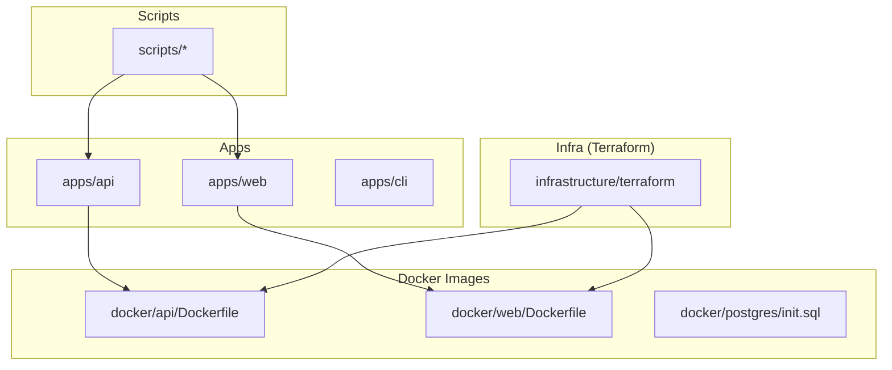
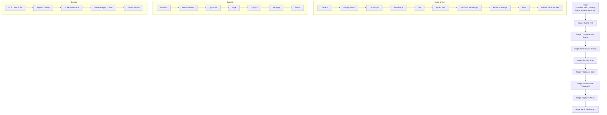
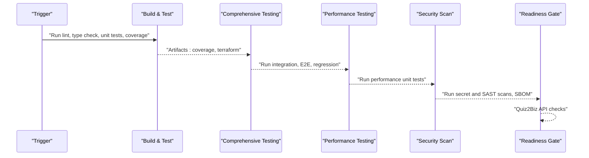
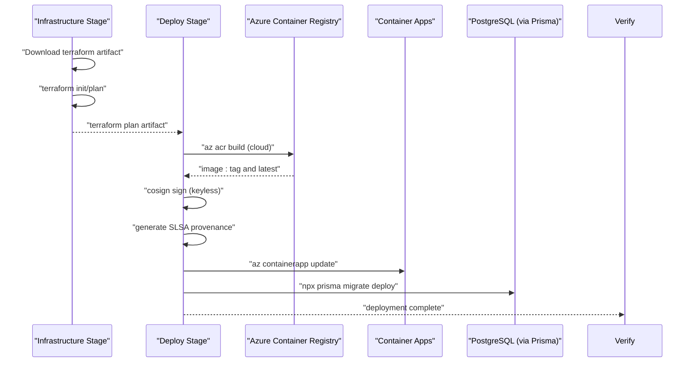
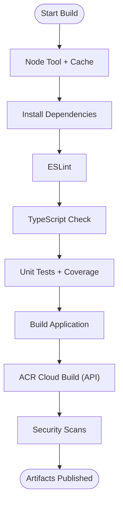
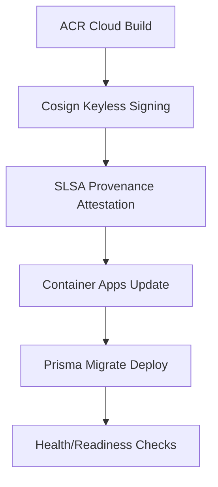
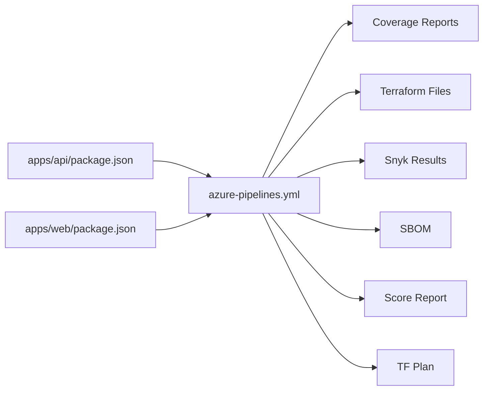

# CI/CD Pipeline

<cite>
**Referenced Files in This Document**
- [azure-pipelines.yml](file://azure-pipelines.yml)
- [docker-compose.yml](file://docker-compose.yml)
- [docker-compose.prod.yml](file://docker-compose.prod.yml)
- [Dockerfile.api](file://docker/api/Dockerfile)
- [entrypoint.sh](file://docker/api/entrypoint.sh)
- [nginx.conf](file://docker/web/nginx.conf)
- [Dockerfile.web](file://docker/web/Dockerfile)
- [Dockerfile.web.prebuilt](file://docker/web/Dockerfile.prebuilt)
- [package.json.apps.api](file://apps/api/package.json)
- [package.json.apps.web](file://apps/web/package.json)
- [jest.config.js.apps.api](file://apps/api/jest.config.js)
- [playwright.config.ts](file://apps/web/playwright.config.ts)
- [turbo.json](file://turbo.json)
- [README.md](file://README.md)
- [deployment-checklist.md](file://DEPLOYMENT-CHECKLIST.md)
- [deployment-readiness-report.md](file://DEPLOYMENT-READINESS-REPORT.md)
- [deployment-validation-report.md](file://DEPLOYMENT-VALIDATION_REPORT.md)
- [security-policy.md](file://SECURITY.md)
- [incident-response-runbook.md](file://docs/security/incident-response-runbook.md)
- [deployment-audit-report.md](file://DEPLOYMENT-AUDIT-REPORT.md)
- [deployment-summary.md](file://DEPLOYMENT-SUMMARY.md)
- [deployment-ready.md](file://DEPLOYMENT-READY.md)
- [deployment-fix-log.md](file://DEPLOYMENT-FIX-LOG.md)
- [deployment-completion-report.md](file://DEPLOYMENT-COMPLETION-REPORT.md)
- [deployment-verification-report.md](file://DEPLOYMENT-VERIFICATION_REPORT.md)
- [first-deployment.md](file://FIRST-DEPLOYMENT.md)
- [production-readiness-strategy.md](file://PRODUCTION-READINESS-STRATEGY.md)
- [github-actions-audit-report.md](file://GITHUB-ACTIONS-AUDIT-REPORT.md)
- [github-secrets-configuration.md](file://GITHUB-SECRETS-CONFIGURATION.md)
- [github-secrets-requirements.md](file://GITHUB-SECRETS-REQUIREMENTS.md)
- [github-secrets.md](file://GITHUB-SECRETS.md)
- [health-dashboard.md](file://HEALTH_DASHBOARD.md)
- [software-health-report.md](file://SOFTWARE_HEALTH_REPORT.md)
- [verify-ci-status.md](file://VERIFY-CI-STATUS.md)
- [workflow-cancellation-handling.md](file://docs/WORKFLOW-CANCELLATION-HANDLING.md)
- [workflow-validation-guide.md](file://docs/WORKFLOW-VALIDATION-GUIDE.md)
- [postgresql-16-migration.md](file://docs/postgresql-16-migration.md)
- [setup-azure.ps1](file://scripts/setup-azure.ps1)
- [deploy-to-azure.ps1](file://scripts/deploy-to-azure.ps1)
- [check-deployment-readiness.sh](file://scripts/check-deployment-readiness.sh)
- [diagnose-app-startup.ps1](file://scripts/diagnose-app-startup.ps1)
- [health-monitor.ps1](file://scripts/health-monitor.ps1)
- [security-scan.sh](file://scripts/security-scan.sh)
- [validate-ci-pipeline.js](file://scripts/validate-ci-pipeline.js)
- [validate-workflows.ps1](file://scripts/validate-workflows.ps1)
- [track-dora-metrics.js](file://scripts/track-dora-metrics.js)
- [run-testing-framework.ts](file://scripts/run-testing-framework.ts)
- [cancel-action-required-runs.sh](file://scripts/cancel-action-required-runs.sh)
- [cleanup.sh](file://scripts/cleanup.sh)
- [deploy.sh](file://scripts/deploy.sh)
- [dev-start.sh](file://scripts/dev-start.sh)
- [deploy-local.sh](file://scripts/deploy-local.sh)
- [docker-wsl.ps1](file://scripts/docker-wsl.ps1)
- [fix-azure-infrastructure.ps1](file://scripts/fix-azure-infrastructure.ps1)
- [setup-local.sh](file://scripts/setup-local.sh)
- [setup-production-infrastructure.ps1](file://scripts/setup-production-infrastructure.ps1)
- [sync-all-branches.sh](file://scripts/sync-all-branches.sh)
- [hotfix-database-url.sh](file://scripts/hotfix-database-url.sh)
- [validate-skills.js](file://scripts/validate-skills.js)
</cite>

## Table of Contents
1. [Introduction](#introduction)
2. [Project Structure](#project-structure)
3. [Core Components](#core-components)
4. [Architecture Overview](#architecture-overview)
5. [Detailed Component Analysis](#detailed-component-analysis)
6. [Dependency Analysis](#dependency-analysis)
7. [Performance Considerations](#performance-considerations)
8. [Troubleshooting Guide](#troubleshooting-guide)
9. [Conclusion](#conclusion)
10. [Appendices](#appendices)

## Introduction
This document describes the CI/CD pipeline for Quiz-to-Build, focusing on the Azure DevOps-based automation for building, testing, securing, and deploying the system. It explains triggers, stages, jobs, dependencies, artifacts, and the end-to-end deployment flow to Azure Container Apps via Azure Container Registry, including database migration automation. It also covers manual deployment options, environment-specific configurations, approval gates, monitoring, failure handling, rollback procedures, troubleshooting, and optimization strategies.

## Project Structure
The repository is a monorepo with multiple applications and supporting infrastructure:
- apps/api: NestJS backend service
- apps/web: React frontend
- apps/cli: Command-line interface
- docker: Multi-service images for API, web, and Postgres
- infrastructure/terraform: Provisioning for Azure resources
- scripts: Operational and automation helpers
- docs: Architectural and operational documentation
- Root-level CI/CD orchestration is implemented in Azure DevOps

**Diagram sources**
- [azure-pipelines.yml:1-908](file://azure-pipelines.yml#L1-L908)
- [docker-compose.yml:1-200](file://docker-compose.yml#L1-L200)
- [docker-compose.prod.yml:1-200](file://docker-compose.prod.yml#L1-L200)
- [Dockerfile.api:1-200](file://docker/api/Dockerfile#L1-L200)
- [Dockerfile.web:1-200](file://docker/web/Dockerfile#L1-L200)
- [nginx.conf:1-200](file://docker/web/nginx.conf#L1-L200)
- [turbo.json:1-200](file://turbo.json#L1-L200)

**Section sources**
- [azure-pipelines.yml:1-908](file://azure-pipelines.yml#L1-L908)
- [docker-compose.yml:1-200](file://docker-compose.yml#L1-L200)
- [docker-compose.prod.yml:1-200](file://docker-compose.prod.yml#L1-L200)
- [turbo.json:1-200](file://turbo.json#L1-L200)

## Core Components
- CI/CD Orchestration: Azure DevOps YAML pipeline defines stages and jobs for build, test, security, readiness gate, infrastructure provisioning, deployment, and verification.
- Build and Test: Node.js toolchain, linting, TypeScript type checking, unit/integration/E2E/regression/performance tests, and coverage collection.
- Security: Secret detection, dependency audit, SAST (Snyk, Trivy, Semgrep), SBOM generation.
- Infrastructure: Terraform-managed Azure resources (Container Apps, ACR, Key Vault, Networking, Monitoring).
- Deployment: Azure Container Registry image build and signing, Container Apps deployment, database migrations via Prisma.
- Artifacts: Coverage reports, test results, Terraform plans, SBOMs, score reports.

**Section sources**
- [azure-pipelines.yml:1-908](file://azure-pipelines.yml#L1-L908)
- [package.json.apps.api:1-200](file://apps/api/package.json#L1-L200)
- [package.json.apps.web:1-200](file://apps/web/package.json#L1-L200)
- [jest.config.js.apps.api:1-200](file://apps/api/jest.config.js#L1-L200)
- [playwright.config.ts:1-200](file://apps/web/playwright.config.ts#L1-L200)

## Architecture Overview
The pipeline follows a staged flow:
- Build and Test stage: lint, type check, unit tests, coverage publish, build application, publish Terraform files.
- Comprehensive Testing stage: unit, integration, E2E, regression suites with artifact publishing.
- Performance Testing stage: Web Vitals (skipped due to security remediation), API load testing, performance unit tests.
- Security stage: secret detection, npm audit, SAST (Snyk, Trivy, Semgrep), SBOM generation.
- Readiness Gate stage: Quiz2Biz compliance checks (score ≥ 95%, no critical red cells).
- Infrastructure stage: Terraform plan and optional apply (manual approval).
- Deploy stage: ACR cloud build, image signing and provenance attestation, Container Apps deployment, Prisma migrations.
- Verify stage: Health and readiness checks.

**Diagram sources**
- [azure-pipelines.yml:4-115](file://azure-pipelines.yml#L4-L115)
- [azure-pipelines.yml:119-251](file://azure-pipelines.yml#L119-L251)
- [azure-pipelines.yml:256-348](file://azure-pipelines.yml#L256-L348)
- [azure-pipelines.yml:352-432](file://azure-pipelines.yml#L352-L432)
- [azure-pipelines.yml:437-598](file://azure-pipelines.yml#L437-L598)
- [azure-pipelines.yml:602-709](file://azure-pipelines.yml#L602-L709)
- [azure-pipelines.yml:713-851](file://azure-pipelines.yml#L713-L851)
- [azure-pipelines.yml:855-908](file://azure-pipelines.yml#L855-L908)

## Detailed Component Analysis

### CI Pipeline (Build, Test, Security, Readiness Gate)
- Triggers: Branches main and develop; excludes documentation files and docs folder.
- Variables: Azure subscription, resource group, Container Apps name, ACR name, Node version, image name/tag, Terraform version and working directory.
- Build and Test:
  - Node tool installation, npm cache, dependency install, lint, type check, unit tests with coverage, publish JUnit results, publish coverage artifacts, build application, skip local Docker build (handled in Deploy).
  - Publish Terraform files as artifact.
- Comprehensive Testing:
  - Unit tests across web, CLI, and API; publish coverage.
  - Integration tests with Postgres and Redis test containers; reset DB, run integration tests, tear down containers.
  - E2E tests with Playwright; publish E2E results.
  - Regression tests against historical bug catalog; publish regression results.
- Performance Testing:
  - Web Vitals (LHCI) skipped due to security remediation; API load testing with autocannon and performance unit tests; publish performance results.
- Security:
  - GitLeaks, Detect-Secrets, npm audit, Snyk (code and test), Trivy filesystem scan, Semgrep, SBOM generation; publish Snyk results and SBOMs.
- Readiness Gate:
  - Calls Quiz2Biz API to validate readiness score and critical red cells; publishes score report; gated on both conditions.

**Diagram sources**
- [azure-pipelines.yml:4-115](file://azure-pipelines.yml#L4-L115)
- [azure-pipelines.yml:119-251](file://azure-pipelines.yml#L119-L251)
- [azure-pipelines.yml:256-348](file://azure-pipelines.yml#L256-L348)
- [azure-pipelines.yml:352-432](file://azure-pipelines.yml#L352-L432)
- [azure-pipelines.yml:437-598](file://azure-pipelines.yml#L437-L598)

**Section sources**
- [azure-pipelines.yml:4-115](file://azure-pipelines.yml#L4-L115)
- [azure-pipelines.yml:119-251](file://azure-pipelines.yml#L119-L251)
- [azure-pipelines.yml:256-348](file://azure-pipelines.yml#L256-L348)
- [azure-pipelines.yml:352-432](file://azure-pipelines.yml#L352-L432)
- [azure-pipelines.yml:437-598](file://azure-pipelines.yml#L437-L598)

### CD Pipeline (Infrastructure, Deploy, Verify)
- Infrastructure:
  - Download Terraform files artifact, install Terraform, init with backend configuration, plan, publish plan artifact for approval.
  - Optional apply step with manual approval.
- Deploy:
  - ACR cloud build with Dockerfile target production, tagging latest and build ID.
  - Sigstore Cosign keyless signing for both tags.
  - SLSA Provenance attestation generated and attached using image digest and build metadata.
  - Verify signatures and attestation.
  - Update Container Apps to new image.
  - Execute Prisma migrations via container app exec.
- Verify:
  - Retrieve API URL from Container Apps, poll health and readiness endpoints until success.

**Diagram sources**
- [azure-pipelines.yml:602-709](file://azure-pipelines.yml#L602-L709)
- [azure-pipelines.yml:713-851](file://azure-pipelines.yml#L713-L851)
- [azure-pipelines.yml:855-908](file://azure-pipelines.yml#L855-L908)

**Section sources**
- [azure-pipelines.yml:602-709](file://azure-pipelines.yml#L602-L709)
- [azure-pipelines.yml:713-851](file://azure-pipelines.yml#L713-L851)
- [azure-pipelines.yml:855-908](file://azure-pipelines.yml#L855-L908)

### Build Process Details
- Application Build:
  - Node.js toolchain, caching, dependency install, lint, type check, unit tests, coverage publish, build application.
- Docker Image Creation:
  - API image built via ACR cloud build using docker/api/Dockerfile with production target.
  - Web image built via docker/web/Dockerfile or prebuilt variant.
- Security Scanning:
  - Secret detection, npm audit, SAST (Snyk, Trivy, Semgrep), SBOM generation.
- Test Execution:
  - Unit tests across API, Web, and CLI; integration tests with Postgres and Redis; E2E with Playwright; regression tests; performance tests.

**Diagram sources**
- [azure-pipelines.yml:48-107](file://azure-pipelines.yml#L48-L107)
- [Dockerfile.api:1-200](file://docker/api/Dockerfile#L1-L200)
- [package.json.apps.api:1-200](file://apps/api/package.json#L1-L200)

**Section sources**
- [azure-pipelines.yml:48-107](file://azure-pipelines.yml#L48-L107)
- [Dockerfile.api:1-200](file://docker/api/Dockerfile#L1-L200)
- [package.json.apps.api:1-200](file://apps/api/package.json#L1-L200)

### Deployment Pipeline Details
- Azure Container Registry Integration:
  - Cloud build with Dockerfile.production target, tagging with build ID and latest.
- Container Apps Deployment:
  - az containerapp update to new image tag.
- Database Migration Automation:
  - az containerapp exec runs npx prisma migrate deploy to apply pending migrations.
- Approval Workflows:
  - Terraform plan published for manual approval prior to apply.
- Environment-Specific Configurations:
  - Variables define Azure subscription, resource group, Container Apps name, ACR name, Node version, image name/tag, Terraform version and working directory.

**Diagram sources**
- [azure-pipelines.yml:729-851](file://azure-pipelines.yml#L729-L851)

**Section sources**
- [azure-pipelines.yml:729-851](file://azure-pipelines.yml#L729-L851)

### Manual Deployment Options
- Local Development:
  - Scripts support local setup, development start, and local deployment for testing.
- Azure Provisioning:
  - PowerShell scripts assist with Azure setup, production infrastructure setup, and infrastructure fixes.
- Manual Terraform Apply:
  - Terraform plan artifact is published for manual approval before applying.

**Section sources**
- [deploy.sh:1-200](file://scripts/deploy.sh#L1-L200)
- [deploy-local.sh:1-200](file://scripts/deploy-local.sh#L1-L200)
- [dev-start.sh:1-200](file://scripts/dev-start.sh#L1-L200)
- [setup-azure.ps1:1-200](file://scripts/setup-azure.ps1#L1-L200)
- [setup-production-infrastructure.ps1:1-200](file://scripts/setup-production-infrastructure.ps1#L1-L200)
- [fix-azure-infrastructure.ps1:1-200](file://scripts/fix-azure-infrastructure.ps1#L1-L200)

### Pipeline Monitoring and Failure Handling
- Monitoring:
  - Health dashboard and software health report provide operational visibility.
  - Health monitor and startup diagnostics scripts support runtime troubleshooting.
- Failure Handling:
  - Security stage blocks on HIGH/CRITICAL findings; npm audit and SAST are configured to fail on severity thresholds.
  - Readiness Gate blocks deployment if score < 95% or critical red cells exist.
  - Workflow cancellation handling and validation guides exist to manage concurrent runs and validation.
- Rollback Procedures:
  - Container Apps can be rolled back by updating to a previous image tag; Prisma migrations can be reversed using migration files.

**Section sources**
- [health-dashboard.md:1-200](file://HEALTH_DASHBOARD.md#L1-L200)
- [software-health-report.md:1-200](file://SOFTWARE_HEALTH_REPORT.md#L1-L200)
- [health-monitor.ps1:1-200](file://scripts/health-monitor.ps1#L1-L200)
- [diagnose-app-startup.ps1:1-200](file://scripts/diagnose-app-startup.ps1#L1-L200)
- [workflow-cancellation-handling.md:1-200](file://docs/WORKFLOW-CANCELLATION-HANDLING.md#L1-L200)
- [workflow-validation-guide.md:1-200](file://docs/WORKFLOW-VALIDATION-GUIDE.md#L1-L200)

## Dependency Analysis
- Internal Dependencies:
  - apps/api and apps/web depend on shared libraries and common tooling (Jest, Playwright, Turbo).
  - Docker images depend on application builds and environment configurations.
- External Dependencies:
  - Azure DevOps tasks, Azure CLI, Terraform, Docker, Node.js toolchain, security scanners (Snyk, Trivy, Semgrep), Sigstore Cosign, jq for JSON parsing.
- Artifact Dependencies:
  - Build stage artifacts feed into Security and Infrastructure stages.
  - Security stage artifacts (SBOM, Snyk results) inform compliance.
  - Infrastructure stage artifacts (terraform plan) gate deployment.

**Diagram sources**
- [package.json.apps.api:1-200](file://apps/api/package.json#L1-L200)
- [package.json.apps.web:1-200](file://apps/web/package.json#L1-L200)
- [azure-pipelines.yml:92-115](file://azure-pipelines.yml#L92-L115)
- [azure-pipelines.yml:394-432](file://azure-pipelines.yml#L394-L432)
- [azure-pipelines.yml:592-598](file://azure-pipelines.yml#L592-L598)
- [azure-pipelines.yml:655-661](file://azure-pipelines.yml#L655-L661)

**Section sources**
- [package.json.apps.api:1-200](file://apps/api/package.json#L1-L200)
- [package.json.apps.web:1-200](file://apps/web/package.json#L1-L200)
- [azure-pipelines.yml:92-115](file://azure-pipelines.yml#L92-L115)
- [azure-pipelines.yml:394-432](file://azure-pipelines.yml#L394-L432)
- [azure-pipelines.yml:592-598](file://azure-pipelines.yml#L592-L598)
- [azure-pipelines.yml:655-661](file://azure-pipelines.yml#L655-L661)

## Performance Considerations
- Caching:
  - npm cache is configured to speed up dependency installs across jobs.
- Parallelism:
  - Jobs within stages are designed to maximize throughput; consider splitting heavy jobs further if needed.
- Test Scope:
  - Unit tests run first; integration/E2E/regression are sequential to ensure deterministic state.
- Container Startup:
  - Health/readiness polling in Verify stage prevents premature success.
- Optimization Strategies:
  - Prefer incremental builds and selective test runs on feature branches.
  - Use matrix strategies for Node versions or OS targets if applicable.
  - Archive and retain only necessary artifacts to reduce storage costs.

[No sources needed since this section provides general guidance]

## Troubleshooting Guide
- Common Issues and Remediation:
  - Secrets Detected: Review Detect-Secrets baseline and remove committed secrets; re-run pipeline.
  - npm Audit Failures: Resolve HIGH/CRITICAL vulnerabilities reported by npm audit.
  - Snyk/Trivy/Semgrep Findings: Fix SAST findings and re-run scans; ensure baseline is updated.
  - Quiz2Biz Readiness Gate Failure: Improve coverage to meet score ≥ 95% and eliminate critical red cells.
  - Terraform Plan Needs Approval: Approve the published plan artifact before apply.
  - Container Apps Deployment Failures: Verify image availability in ACR, network connectivity, and environment variables.
  - Database Migration Failures: Inspect Prisma migration logs and retry; ensure DB connectivity.
- Diagnostic Scripts:
  - Use health monitor and startup diagnostics to troubleshoot runtime issues.
  - Use validation scripts to verify pipeline correctness and workflow status.

**Section sources**
- [security-scan.sh:1-200](file://scripts/security-scan.sh#L1-L200)
- [health-monitor.ps1:1-200](file://scripts/health-monitor.ps1#L1-L200)
- [diagnose-app-startup.ps1:1-200](file://scripts/diagnose-app-startup.ps1#L1-L200)
- [validate-ci-pipeline.js:1-200](file://scripts/validate-ci-pipeline.js#L1-L200)
- [validate-workflows.ps1:1-200](file://scripts/validate-workflows.ps1#L1-L200)
- [verify-ci-status.md:1-200](file://VERIFY-CI-STATUS.md#L1-L200)

## Conclusion
The CI/CD pipeline automates Quiz-to-Build’s build, test, security, and deployment lifecycle with robust gates and artifacts. It leverages Azure DevOps for orchestration, Azure Container Registry for secure image management, Terraform for infrastructure, and Container Apps for scalable hosting. The pipeline enforces security and compliance through multiple scanners and gates, supports manual approvals, and provides verification and diagnostic capabilities to ensure reliable deployments.

[No sources needed since this section summarizes without analyzing specific files]

## Appendices

### Appendix A: Environment-Specific Configuration References
- Azure Variables:
  - azureSubscription, resourceGroup, containerAppName, acrName, nodeVersion, imageName, imageTag, terraformVersion, terraformWorkingDirectory.
- Quiz2Biz API:
  - QUIZ2BIZ_API_URL, QUIZ2BIZ_API_TOKEN for readiness checks.
- Azure OIDF/Cosign:
  - AZURE_CLIENT_ID, AZURE_TENANT_ID for keyless signing.

**Section sources**
- [azure-pipelines.yml:20-35](file://azure-pipelines.yml#L20-L35)
- [azure-pipelines.yml:541-543](file://azure-pipelines.yml#L541-L543)
- [azure-pipelines.yml:754-756](file://azure-pipelines.yml#L754-L756)
- [azure-pipelines.yml:810-812](file://azure-pipelines.yml#L810-L812)

### Appendix B: Operational Documents and Checklists
- Deployment-related documents:
  - Deployment checklist, readiness report, validation report, audit report, summary, completion report, verification report, first deployment guide, production readiness strategy, deployment fix log, deployment ready indicator.
- Security and compliance:
  - Security policy, incident response runbook, GitHub secrets configuration and requirements, GitHub actions audit report.

**Section sources**
- [deployment-checklist.md:1-200](file://DEPLOYMENT-CHECKLIST.md#L1-L200)
- [deployment-readiness-report.md:1-200](file://DEPLOYMENT-READINESS-REPORT.md#L1-L200)
- [deployment-validation-report.md:1-200](file://DEPLOYMENT-VALIDATION_REPORT.md#L1-L200)
- [deployment-audit-report.md:1-200](file://DEPLOYMENT-AUDIT-REPORT.md#L1-L200)
- [deployment-summary.md:1-200](file://DEPLOYMENT-SUMMARY.md#L1-L200)
- [deployment-completion-report.md:1-200](file://DEPLOYMENT-COMPLETION-REPORT.md#L1-L200)
- [deployment-verification-report.md:1-200](file://DEPLOYMENT-VERIFICATION_REPORT.md#L1-L200)
- [first-deployment.md:1-200](file://FIRST-DEPLOYMENT.md#L1-L200)
- [production-readiness-strategy.md:1-200](file://PRODUCTION-READINESS-STRATEGY.md#L1-L200)
- [deployment-fix-log.md:1-200](file://DEPLOYMENT-FIX-LOG.md#L1-L200)
- [deployment-ready.md:1-200](file://DEPLOYMENT-READY.md#L1-L200)
- [security-policy.md:1-200](file://SECURITY.md#L1-L200)
- [incident-response-runbook.md:1-200](file://docs/security/incident-response-runbook.md#L1-L200)
- [github-secrets-configuration.md:1-200](file://GITHUB-SECRETS-CONFIGURATION.md#L1-L200)
- [github-secrets-requirements.md:1-200](file://GITHUB-SECRETS-REQUIREMENTS.md#L1-L200)
- [github-actions-audit-report.md:1-200](file://GITHUB-ACTIONS-AUDIT-REPORT.md#L1-L200)

### Appendix C: Supporting Scripts and Utilities
- Validation and Diagnostics:
  - validate-ci-pipeline.js, validate-workflows.ps1, health-monitor.ps1, diagnose-app-startup.ps1, verify-ci-status.md.
- Security and Compliance:
  - security-scan.sh, cancel-action-required-runs.sh.
- Deployment and Operations:
  - deploy.sh, deploy-local.sh, dev-start.sh, deploy-to-azure.ps1, setup-azure.ps1, setup-production-infrastructure.ps1, fix-azure-infrastructure.ps1, setup-local.sh, sync-all-branches.sh, hotfix-database-url.sh, track-dora-metrics.js, run-testing-framework.ts, cleanup.sh.

**Section sources**
- [validate-ci-pipeline.js:1-200](file://scripts/validate-ci-pipeline.js#L1-L200)
- [validate-workflows.ps1:1-200](file://scripts/validate-workflows.ps1#L1-L200)
- [health-monitor.ps1:1-200](file://scripts/health-monitor.ps1#L1-L200)
- [diagnose-app-startup.ps1:1-200](file://scripts/diagnose-app-startup.ps1#L1-L200)
- [verify-ci-status.md:1-200](file://VERIFY-CI-STATUS.md#L1-L200)
- [security-scan.sh:1-200](file://scripts/security-scan.sh#L1-L200)
- [cancel-action-required-runs.sh:1-200](file://scripts/cancel-action-required-runs.sh#L1-L200)
- [deploy.sh:1-200](file://scripts/deploy.sh#L1-L200)
- [deploy-local.sh:1-200](file://scripts/deploy-local.sh#L1-L200)
- [dev-start.sh:1-200](file://scripts/dev-start.sh#L1-L200)
- [deploy-to-azure.ps1:1-200](file://scripts/deploy-to-azure.ps1#L1-L200)
- [setup-azure.ps1:1-200](file://scripts/setup-azure.ps1#L1-L200)
- [setup-production-infrastructure.ps1:1-200](file://scripts/setup-production-infrastructure.ps1#L1-L200)
- [fix-azure-infrastructure.ps1:1-200](file://scripts/fix-azure-infrastructure.ps1#L1-L200)
- [setup-local.sh:1-200](file://scripts/setup-local.sh#L1-L200)
- [sync-all-branches.sh:1-200](file://scripts/sync-all-branches.sh#L1-L200)
- [hotfix-database-url.sh:1-200](file://scripts/hotfix-database-url.sh#L1-L200)
- [track-dora-metrics.js:1-200](file://scripts/track-dora-metrics.js#L1-L200)
- [run-testing-framework.ts:1-200](file://scripts/run-testing-framework.ts#L1-L200)
- [cleanup.sh:1-200](file://scripts/cleanup.sh#L1-L200)