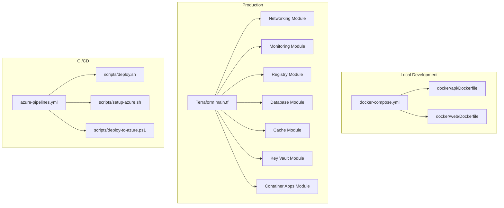
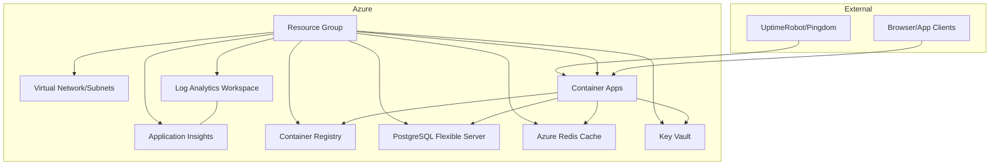
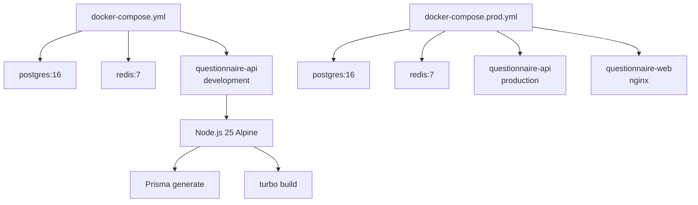
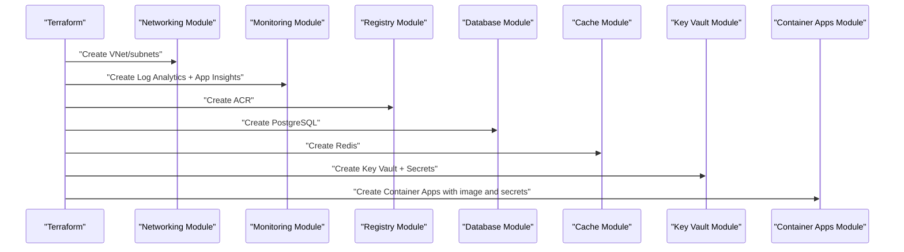
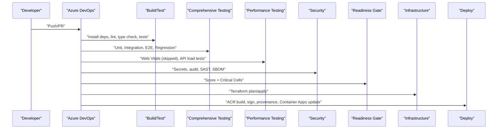
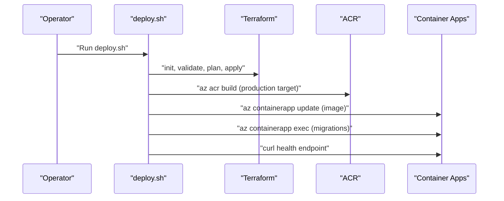
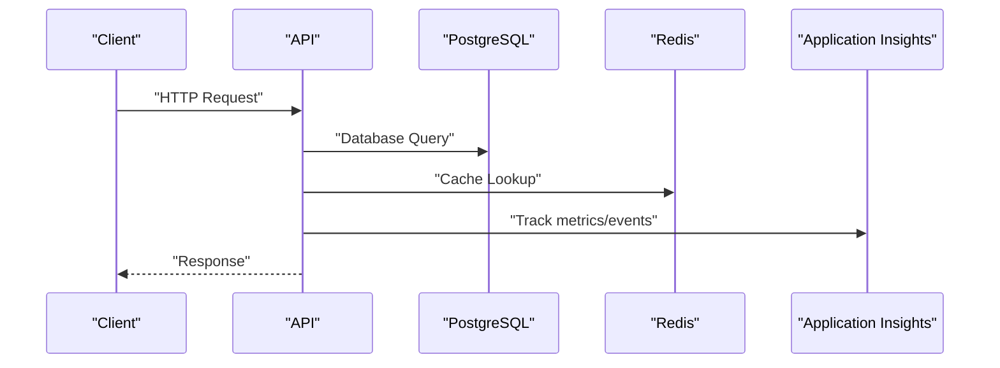
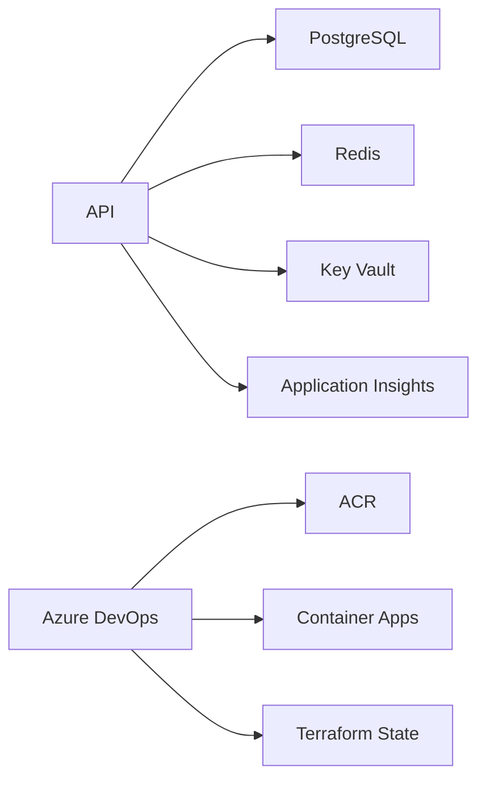

# Deployment & Operations

<cite>
**Referenced Files in This Document**
- [main.tf](file://infrastructure/terraform/main.tf)
- [Dockerfile (API)](file://docker/api/Dockerfile)
- [Dockerfile (Web)](file://docker/web/Dockerfile)
- [docker-compose.yml](file://docker-compose.yml)
- [docker-compose.prod.yml](file://docker-compose.prod.yml)
- [deploy.sh](file://scripts/deploy.sh)
- [setup-azure.sh](file://scripts/setup-azure.sh)
- [deploy-to-azure.ps1](file://scripts/deploy-to-azure.ps1)
- [azure-pipelines.yml](file://azure-pipelines.yml)
- [monitoring main.tf](file://infrastructure/terraform/modules/monitoring/main.tf)
- [appinsights.config.ts](file://apps/api/src/config/appinsights.config.ts)
- [logger.config.ts](file://apps/api/src/config/logger.config.ts)
- [health.controller.ts](file://apps/api/src/health.controller.ts)
- [alerting-rules.config.ts](file://apps/api/src/config/alerting-rules.config.ts)
- [uptime-monitoring.config.ts](file://apps/api/src/config/uption-monitoring.config.ts)
- [health-monitor.ps1](file://scripts/health-monitor.ps1)
- [diagnose-app-startup.ps1](file://scripts/diagnose-app-startup.ps1)
</cite>

## Table of Contents
1. [Introduction](#introduction)
2. [Project Structure](#project-structure)
3. [Core Components](#core-components)
4. [Architecture Overview](#architecture-overview)
5. [Detailed Component Analysis](#detailed-component-analysis)
6. [Dependency Analysis](#dependency-analysis)
7. [Performance Considerations](#performance-considerations)
8. [Troubleshooting Guide](#troubleshooting-guide)
9. [Conclusion](#conclusion)
10. [Appendices](#appendices)

## Introduction
This document provides comprehensive deployment and operations guidance for Quiz-to-Build. It covers containerization with Docker, Azure infrastructure provisioning via Terraform, CI/CD pipelines, production deployment procedures, rollback strategies, monitoring and alerting, capacity planning, performance monitoring, security configurations, backups, disaster recovery, and operational runbooks.

## Project Structure
Quiz-to-Build is a monorepo containing:
- NestJS API application with modular features
- React web application
- Dockerfiles for API and Web
- Docker Compose for local development and production
- Terraform modules for Azure infrastructure
- Scripts for deployment, monitoring, and diagnostics
- CI/CD pipeline definition for Azure DevOps

**Diagram sources**
- [main.tf:1-153](file://infrastructure/terraform/main.tf#L1-L153)
- [Dockerfile (API):1-120](file://docker/api/Dockerfile#L1-L120)
- [Dockerfile (Web):1-85](file://docker/web/Dockerfile#L1-L85)
- [docker-compose.yml:1-150](file://docker-compose.yml#L1-L150)
- [docker-compose.prod.yml:1-95](file://docker-compose.prod.yml#L1-L95)
- [deploy.sh:1-206](file://scripts/deploy.sh#L1-L206)
- [setup-azure.sh:1-196](file://scripts/setup-azure.sh#L1-L196)
- [deploy-to-azure.ps1:1-349](file://scripts/deploy-to-azure.ps1#L1-L349)
- [azure-pipelines.yml:1-908](file://azure-pipelines.yml#L1-L908)

**Section sources**
- [main.tf:1-153](file://infrastructure/terraform/main.tf#L1-L153)
- [Dockerfile (API):1-120](file://docker/api/Dockerfile#L1-L120)
- [Dockerfile (Web):1-85](file://docker/web/Dockerfile#L1-L85)
- [docker-compose.yml:1-150](file://docker-compose.yml#L1-L150)
- [docker-compose.prod.yml:1-95](file://docker-compose.prod.yml#L1-L95)
- [deploy.sh:1-206](file://scripts/deploy.sh#L1-L206)
- [setup-azure.sh:1-196](file://scripts/setup-azure.sh#L1-L196)
- [deploy-to-azure.ps1:1-349](file://scripts/deploy-to-azure.ps1#L1-L349)
- [azure-pipelines.yml:1-908](file://azure-pipelines.yml#L1-L908)

## Core Components
- Containerization
  - API: Multi-stage Dockerfile with production stage, non-root user, health checks, and OCI labels.
  - Web: Nginx-based static hosting with environment substitution and health checks.
- Local orchestration
  - docker-compose.yml for development with PostgreSQL and Redis, plus API and Web services.
  - docker-compose.prod.yml for production-like environment with explicit secrets and ports.
- Infrastructure as code
  - Terraform main.tf orchestrates resource groups, networking, monitoring, registry, database, cache, key vault, and container apps.
- CI/CD
  - Azure DevOps pipeline stages: build/test, comprehensive testing, performance testing, security scanning, readiness gate, infrastructure (Terraform), and deployment to Azure Container Apps.
- Monitoring and observability
  - Health endpoints (/health, /health/live, /health/ready, /health/startup) with detailed dependency checks.
  - Application Insights integration for telemetry.
  - Logging configuration with correlation IDs and redaction.
  - Alerting rules and escalation policies.
  - Uptime monitoring configuration for external services.

**Section sources**
- [Dockerfile (API):68-120](file://docker/api/Dockerfile#L68-L120)
- [Dockerfile (Web):40-85](file://docker/web/Dockerfile#L40-L85)
- [docker-compose.yml:109-150](file://docker-compose.yml#L109-L150)
- [docker-compose.prod.yml:40-95](file://docker-compose.prod.yml#L40-L95)
- [main.tf:108-152](file://infrastructure/terraform/main.tf#L108-L152)
- [azure-pipelines.yml:39-908](file://azure-pipelines.yml#L39-L908)
- [health.controller.ts:67-234](file://apps/api/src/health.controller.ts#L67-L234)
- [appinsights.config.ts:35-117](file://apps/api/src/config/appinsights.config.ts#L35-L117)
- [logger.config.ts:9-61](file://apps/api/src/config/logger.config.ts#L9-L61)
- [alerting-rules.config.ts:61-478](file://apps/api/src/config/alerting-rules.config.ts#L61-L478)
- [uptime-monitoring.config.ts:12-379](file://apps/api/src/config/uptime-monitoring.config.ts#L12-L379)

## Architecture Overview
The production architecture centers on Azure Container Apps with integrated services:
- Container Apps hosts the API application with autoscaling and secrets injection.
- Azure Container Registry stores container images.
- Azure PostgreSQL and Azure Redis provide data persistence and caching.
- Azure Key Vault manages secrets and certificates.
- Azure Log Analytics and Application Insights provide centralized logging and telemetry.
- CI/CD pipeline automates builds, tests, security scans, and deployments.

**Diagram sources**
- [main.tf:13-152](file://infrastructure/terraform/main.tf#L13-L152)
- [monitoring main.tf:3-21](file://infrastructure/terraform/modules/monitoring/main.tf#L3-L21)
- [deploy-to-azure.ps1:60-265](file://scripts/deploy-to-azure.ps1#L60-L265)

**Section sources**
- [main.tf:1-153](file://infrastructure/terraform/main.tf#L1-L153)
- [monitoring main.tf:1-22](file://infrastructure/terraform/modules/monitoring/main.tf#L1-L22)
- [deploy-to-azure.ps1:1-349](file://scripts/deploy-to-azure.ps1#L1-L349)

## Detailed Component Analysis

### Containerization and Orchestration
- API container
  - Multi-stage build with Node.js base, security updates, non-root user, health checks, and OCI labels.
  - Pruned production dependencies and preserved libs for path resolution.
- Web container
  - Nginx static hosting with environment substitution and health checks.
  - Non-root worker user and secured cache/logs directories.
- Local development
  - docker-compose.yml defines services for API, PostgreSQL, Redis, and test databases.
  - docker-compose.prod.yml mirrors production with explicit secrets and ports.

**Diagram sources**
- [docker-compose.yml:27-135](file://docker-compose.yml#L27-L135)
- [docker-compose.prod.yml:40-82](file://docker-compose.prod.yml#L40-L82)
- [Dockerfile (API):25-36](file://docker/api/Dockerfile#L25-L36)
- [Dockerfile (Web):35-40](file://docker/web/Dockerfile#L35-L40)

**Section sources**
- [Dockerfile (API):1-120](file://docker/api/Dockerfile#L1-L120)
- [Dockerfile (Web):1-85](file://docker/web/Dockerfile#L1-L85)
- [docker-compose.yml:1-150](file://docker-compose.yml#L1-L150)
- [docker-compose.prod.yml:1-95](file://docker-compose.prod.yml#L1-L95)

### Azure Infrastructure Provisioning (Terraform)
- Modules orchestrated by main.tf:
  - Networking: VNet, subnets, private DNS zones.
  - Monitoring: Log Analytics workspace and Application Insights.
  - Registry: Azure Container Registry with SKU selection.
  - Database: PostgreSQL flexible server with HA and VNet integration.
  - Cache: Azure Redis with SKU and capacity.
  - Key Vault: Secrets for database, Redis, and JWT.
  - Container Apps: Image, CPU/memory, replicas, registry credentials, secrets, and monitoring integration.
- Outputs expose resource names and URLs for deployment automation.

**Diagram sources**
- [main.tf:20-152](file://infrastructure/terraform/main.tf#L20-L152)

**Section sources**
- [main.tf:1-153](file://infrastructure/terraform/main.tf#L1-L153)

### CI/CD Pipeline (Azure DevOps)
- Stages:
  - Build & Test: Node tool, cache, lint, type check, unit tests, coverage publish, build.
  - Comprehensive Testing: Unit, integration, E2E, regression.
  - Performance Testing: Web Vitals (skipped due to security), API load tests, performance unit tests.
  - Security: GitLeaks, Detect-Secrets, npm audit, Snyk, Trivy, Semgrep, SBOM generation.
  - Readiness Gate: Quiz2Biz score and critical red cells check via API.
  - Infrastructure: Download Terraform, init/plan, manual approval, apply.
  - Deploy: Build image in ACR, sign with Sigstore Cosign, generate SLSA provenance, deploy to Container Apps.
- Conditions: Runs on main/develop, excludes docs, gates on branch and success.

**Diagram sources**
- [azure-pipelines.yml:39-908](file://azure-pipelines.yml#L39-L908)

**Section sources**
- [azure-pipelines.yml:1-908](file://azure-pipelines.yml#L1-L908)

### Production Deployment Procedures
- Automated deployment script
  - Validates prerequisites (Azure CLI, Terraform, login), reconciles state, plans, applies, builds image in ACR, updates Container App, runs migrations, health checks.
- PowerShell deployment script
  - Creates/validates resource group, deploys PostgreSQL, ACR, Container Apps Environment, Redis, generates secrets, creates Container App with env vars/secrets, runs migrations, prints URLs.
- Manual steps
  - Ensure terraform.tfvars and backend.tf are configured.
  - Confirm environment variables for secrets and configuration.
  - Approve Terraform plan in CI if required.

**Diagram sources**
- [deploy.sh:101-187](file://scripts/deploy.sh#L101-L187)
- [deploy-to-azure.ps1:115-280](file://scripts/deploy-to-azure.ps1#L115-L280)

**Section sources**
- [deploy.sh:1-206](file://scripts/deploy.sh#L1-L206)
- [setup-azure.sh:1-196](file://scripts/setup-azure.sh#L1-L196)
- [deploy-to-azure.ps1:1-349](file://scripts/deploy-to-azure.ps1#L1-L349)

### Rollback Processes
- Container Apps revisions
  - Use revision listing and activation to roll back to a previous stable revision.
- Database migrations
  - Maintain backward compatibility; if needed, use reversible migrations or snapshot/restore.
- Image tagging
  - Keep “latest” tag aligned with tested releases; pin deployments to specific digests when possible.

**Section sources**
- [deploy.sh:154-170](file://scripts/deploy.sh#L154-L170)

### Monitoring and Observability
- Health endpoints
  - Full health (/health), liveness (/health/live), readiness (/health/ready), startup (/health/startup).
- Telemetry
  - Application Insights initialization, custom metrics/events, dependency tracking, availability tracking, graceful shutdown.
- Logging
  - Structured JSON in production, pretty-print in development, correlation IDs, redacted sensitive fields.
- Alerting
  - Alert rules for error rates, performance, security, business, and resource thresholds with escalation policies.
- Uptime monitoring
  - SLA targets, health endpoints, external monitor configuration, alert escalation, status messages.

**Diagram sources**
- [health.controller.ts:67-234](file://apps/api/src/health.controller.ts#L67-L234)
- [appinsights.config.ts:65-117](file://apps/api/src/config/appinsights.config.ts#L65-L117)
- [logger.config.ts:9-61](file://apps/api/src/config/logger.config.ts#L9-L61)
- [alerting-rules.config.ts:61-478](file://apps/api/src/config/alerting-rules.config.ts#L61-L478)
- [uptime-monitoring.config.ts:12-379](file://apps/api/src/config/uptime-monitoring.config.ts#L12-L379)

**Section sources**
- [health.controller.ts:1-410](file://apps/api/src/health.controller.ts#L1-L410)
- [appinsights.config.ts:1-610](file://apps/api/src/config/appinsights.config.ts#L1-L610)
- [logger.config.ts:1-62](file://apps/api/src/config/logger.config.ts#L1-L62)
- [alerting-rules.config.ts:1-772](file://apps/api/src/config/alerting-rules.config.ts#L1-L772)
- [uptime-monitoring.config.ts:1-379](file://apps/api/src/config/uptime-monitoring.config.ts#L1-L379)

### Security Configurations
- Secrets management
  - Azure Key Vault integration for database URL, Redis password, JWT secrets.
- Container security
  - Non-root users, health checks, minimal base images, supply chain metadata.
- CI/CD security
  - Secret detection, SAST, SBOM generation, signed container images with Sigstore Cosign, SLSA provenance.
- Network security
  - VNet integration for database, private DNS zones, firewall rules.

**Section sources**
- [main.tf:93-106](file://infrastructure/terraform/main.tf#L93-L106)
- [Dockerfile (API):89-110](file://docker/api/Dockerfile#L89-L110)
- [Dockerfile (Web):57-74](file://docker/web/Dockerfile#L57-L74)
- [azure-pipelines.yml:352-432](file://azure-pipelines.yml#L352-L432)

### Backup and Disaster Recovery
- Database backup
  - Azure PostgreSQL flexible server backup and restore capabilities; maintain automated backups and point-in-time recovery.
- Secrets backup
  - Azure Key Vault backup/restore and access policies; rotate secrets regularly.
- DR planning
  - Multi-region considerations, cross-region replication, failover testing, and documented runbooks.

**Section sources**
- [main.tf:58-77](file://infrastructure/terraform/main.tf#L58-L77)

### Capacity Planning and Scaling Strategies
- Horizontal scaling
  - Container Apps autoscaling with min/max replicas and CPU/memory limits.
- Vertical scaling
  - Adjust CPU/memory per replica based on performance metrics.
- Database and cache sizing
  - Scale PostgreSQL and Redis based on connection pool usage and latency.

**Section sources**
- [main.tf:108-143](file://infrastructure/terraform/main.tf#L108-L143)

### Operational Runbooks
- Health monitoring
  - Use health-monitor.ps1 to continuously monitor readiness endpoint and alert on failures.
- Startup diagnostics
  - Use diagnose-app-startup.ps1 to check status, logs, environment variables, dependencies, and Key Vault secrets.
- Logs and revisions
  - Tail logs, inspect recent revisions, and compare with previous successful ones.

**Section sources**
- [health-monitor.ps1:1-195](file://scripts/health-monitor.ps1#L1-L195)
- [diagnose-app-startup.ps1:1-164](file://scripts/diagnose-app-startup.ps1#L1-L164)

## Dependency Analysis
- Internal dependencies
  - API depends on database and Redis clients; health controller checks these dependencies.
- External dependencies
  - Azure services (Container Apps, ACR, PostgreSQL, Redis, Key Vault, Log Analytics, Application Insights).
- CI/CD dependencies
  - Azure DevOps agents, service connections, ACR tasks, Terraform state storage.

**Diagram sources**
- [health.controller.ts:56-62](file://apps/api/src/health.controller.ts#L56-L62)
- [main.tf:108-152](file://infrastructure/terraform/main.tf#L108-L152)
- [azure-pipelines.yml:713-809](file://azure-pipelines.yml#L713-L809)

**Section sources**
- [health.controller.ts:1-410](file://apps/api/src/health.controller.ts#L1-L410)
- [main.tf:1-153](file://infrastructure/terraform/main.tf#L1-L153)
- [azure-pipelines.yml:1-908](file://azure-pipelines.yml#L1-L908)

## Performance Considerations
- Optimize container sizes and startup time by pruning dev dependencies and using multi-stage builds.
- Monitor response times and set alert thresholds for P95/P99 latencies.
- Tune database and Redis connection pools; scale vertically/horizontally based on utilization.
- Use Application Insights to track custom metrics and slow request patterns.

[No sources needed since this section provides general guidance]

## Troubleshooting Guide
- Health endpoint failures
  - Use readiness/liveness endpoints to isolate issues; check database and Redis connectivity.
- Startup failures
  - Run diagnose-app-startup.ps1 to inspect status, logs, environment variables, and Key Vault secrets.
- Continuous monitoring
  - health-monitor.ps1 provides periodic checks and alerts on consecutive failures.
- Logs and telemetry
  - Inspect container logs, Application Insights telemetry, and Azure Monitor dashboards.

**Section sources**
- [health-monitor.ps1:50-81](file://scripts/health-monitor.ps1#L50-L81)
- [diagnose-app-startup.ps1:19-63](file://scripts/diagnose-app-startup.ps1#L19-L63)
- [health.controller.ts:147-205](file://apps/api/src/health.controller.ts#L147-L205)

## Conclusion
Quiz-to-Build provides a robust, production-ready deployment and operations framework leveraging Docker, Terraform, and Azure DevOps. The combination of health endpoints, Application Insights, comprehensive alerting, and diagnostic scripts ensures reliable operations. Adhering to the procedures outlined here will facilitate smooth deployments, rapid incident response, and sustainable growth.

[No sources needed since this section summarizes without analyzing specific files]

## Appendices
- Appendix A: Environment variables and secrets
  - DATABASE_URL, REDIS_HOST, REDIS_PORT, REDIS_PASSWORD, JWT_SECRET, JWT_REFRESH_SECRET, APPLICATIONINSIGHTS_CONNECTION_STRING, LOG_LEVEL, CORS_ORIGIN, API_PREFIX, etc.
- Appendix B: Health endpoint reference
  - /health (full), /health/live (liveness), /health/ready (readiness), /health/startup (startup).

**Section sources**
- [docker-compose.prod.yml:49-57](file://docker-compose.prod.yml#L49-L57)
- [health.controller.ts:67-234](file://apps/api/src/health.controller.ts#L67-L234)