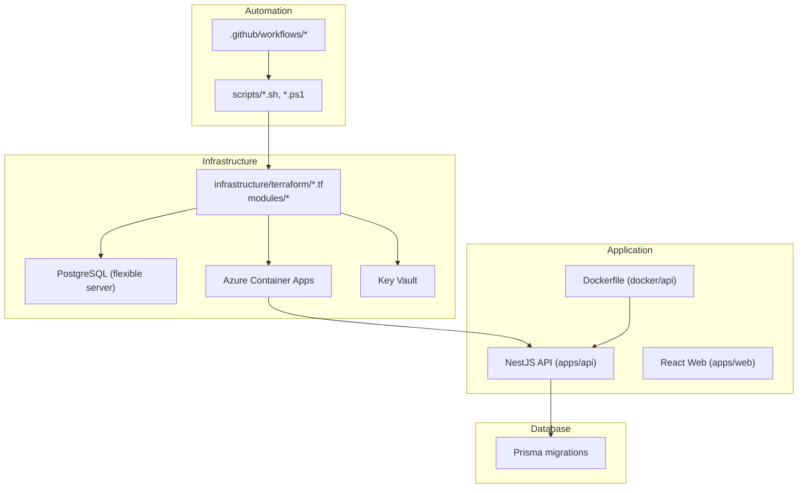
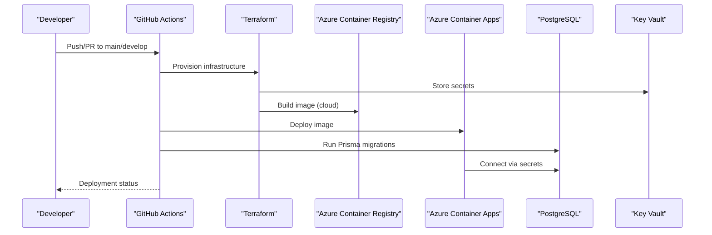
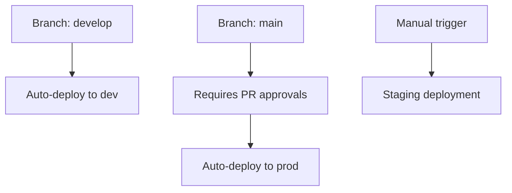
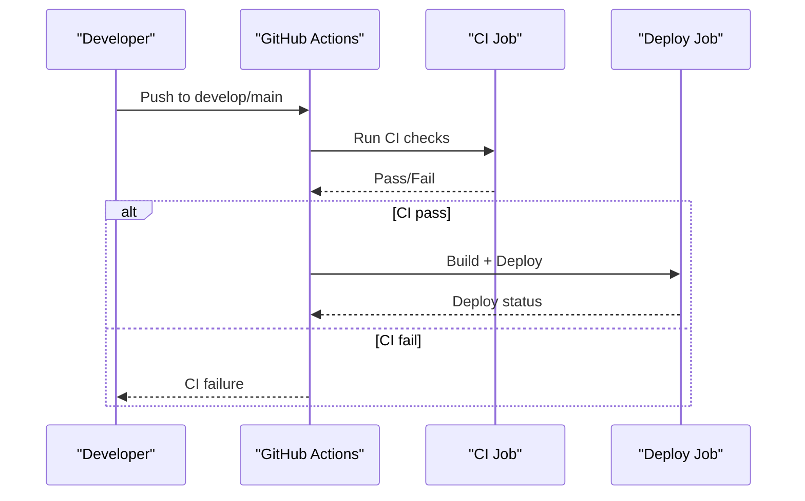
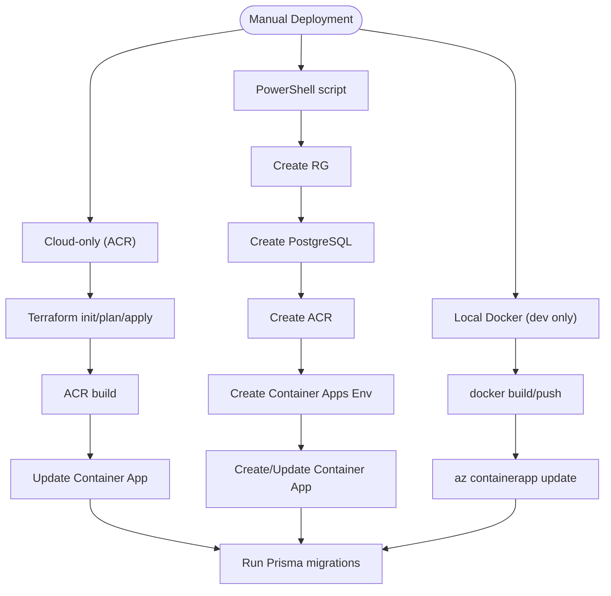
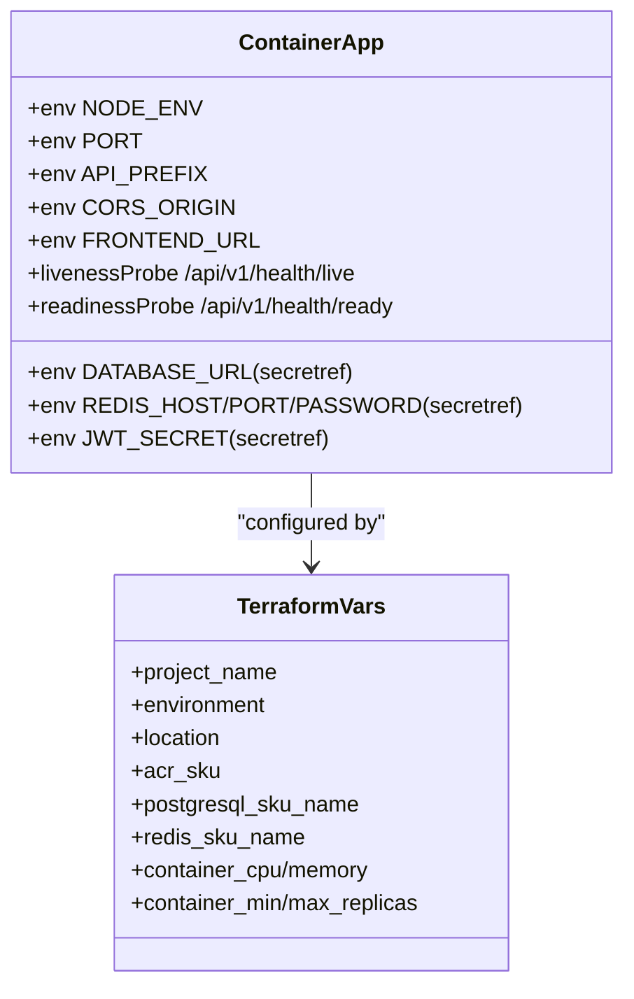
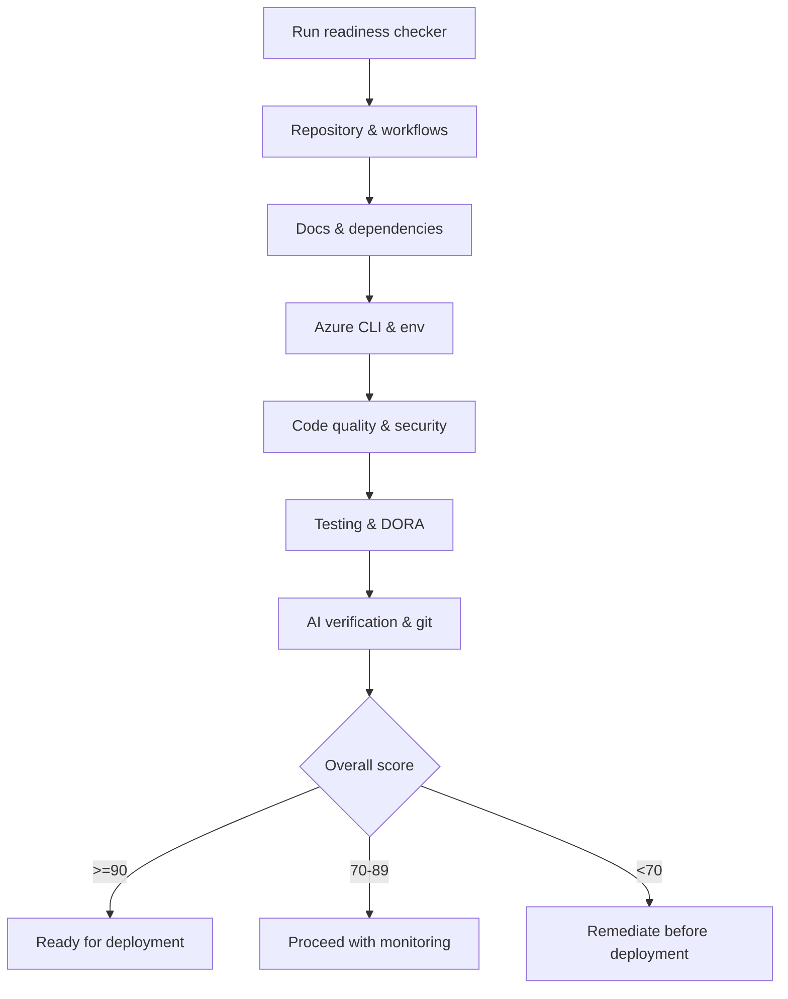
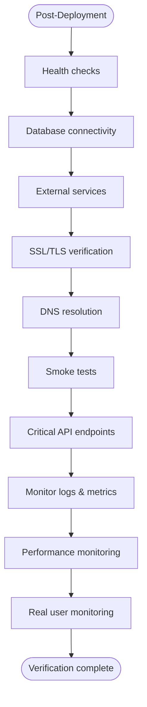
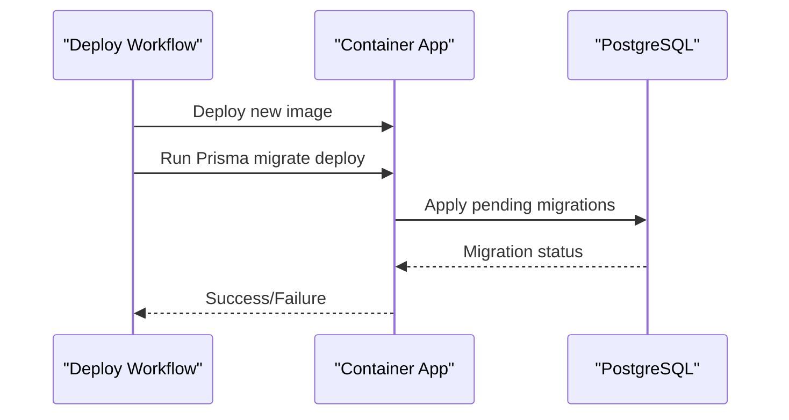
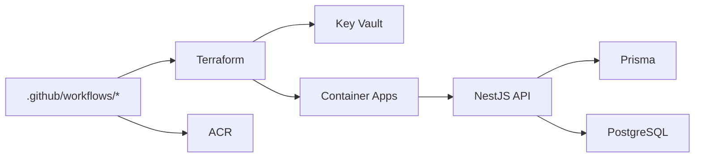

# Deployment Procedures

<cite>
**Referenced Files in This Document**
- [DEPLOYMENT.md](file://DEPLOYMENT.md)
- [DEPLOYMENT-CHECKLIST.md](file://DEPLOYMENT-CHECKLIST.md)
- [.github/branch-protection-develop.json](file://.github/branch-protection-develop.json)
- [.github/branch-protection-main.json](file://.github/branch-protection-main.json)
- [scripts/deploy.sh](file://scripts/deploy.sh)
- [scripts/deploy-to-azure.ps1](file://scripts/deploy-to-azure.ps1)
- [scripts/setup-azure.sh](file://scripts/setup-azure.sh)
- [scripts/check-deployment-readiness.sh](file://scripts/check-deployment-readiness.sh)
- [docker-compose.yml](file://docker-compose.yml)
- [docker/api/Dockerfile](file://docker/api/Dockerfile)
- [infrastructure/terraform/main.tf](file://infrastructure/terraform/main.tf)
- [infrastructure/terraform/modules/container-apps/main.tf](file://infrastructure/terraform/modules/container-apps/main.tf)
- [infrastructure/terraform/modules/database/main.tf](file://infrastructure/terraform/modules/database/main.tf)
- [apps/api/src/main.ts](file://apps/api/src/main.ts)
- [prisma/migrations/migration_lock.toml](file://prisma/migrations/migration_lock.toml)
- [docs/testing/PRE-DEPLOYMENT-TESTING-PROTOCOL.md](file://docs/testing/PRE-DEPLOYMENT-TESTING-PROTOCOL.md)
- [docs/testing/POST-DEPLOYMENT-TESTING-PROTOCOL.md](file://docs/testing/POST-DEPLOYMENT-TESTING-PROTOCOL.md)
</cite>

## Table of Contents
1. [Introduction](#introduction)
2. [Project Structure](#project-structure)
3. [Core Components](#core-components)
4. [Architecture Overview](#architecture-overview)
5. [Detailed Component Analysis](#detailed-component-analysis)
6. [Dependency Analysis](#dependency-analysis)
7. [Performance Considerations](#performance-considerations)
8. [Troubleshooting Guide](#troubleshooting-guide)
9. [Conclusion](#conclusion)
10. [Appendices](#appendices)

## Introduction
This document provides comprehensive deployment procedures for Quiz-to-Build environments across development, staging, and production. It covers automated and manual deployment triggers, environment-specific configurations, branch protection and approval workflows, pre-deployment and post-deployment verification, database migration procedures, health checks, API endpoint testing, rollback and emergency processes, and best practices for environment consistency and configuration management.

## Project Structure
The repository includes multiple deployment pathways and automation assets:
- GitHub Actions workflows for CI and CD
- Terraform modules for Azure infrastructure provisioning
- Scripts for manual deployment and readiness validation
- Docker configuration for containerized API builds
- Prisma migrations for database schema management
- Comprehensive testing protocols for pre- and post-deployment validation

**Diagram sources**
- [DEPLOYMENT.md:24-53](file://DEPLOYMENT.md#L24-L53)
- [infrastructure/terraform/main.tf:1-153](file://infrastructure/terraform/main.tf#L1-L153)
- [infrastructure/terraform/modules/container-apps/main.tf:1-310](file://infrastructure/terraform/modules/container-apps/main.tf#L1-L310)
- [infrastructure/terraform/modules/database/main.tf:1-78](file://infrastructure/terraform/modules/database/main.tf#L1-L78)
- [docker/api/Dockerfile:1-120](file://docker/api/Dockerfile#L1-L120)
- [prisma/migrations/migration_lock.toml:1-3](file://prisma/migrations/migration_lock.toml#L1-L3)

**Section sources**
- [DEPLOYMENT.md:15-53](file://DEPLOYMENT.md#L15-L53)
- [infrastructure/terraform/main.tf:1-153](file://infrastructure/terraform/main.tf#L1-L153)

## Core Components
- GitHub Actions workflows orchestrate CI and CD:
  - CI workflow validates code quality, tests, and builds
  - Deploy workflow builds Docker images and deploys to Azure Container Apps
- Terraform provisions Azure resources (resource groups, networking, PostgreSQL, Redis, Container Apps, Key Vault)
- Scripts automate manual deployments and readiness checks
- Dockerfile defines multi-stage builds for development and production
- Prisma manages database migrations and schema consistency

**Section sources**
- [DEPLOYMENT.md:24-53](file://DEPLOYMENT.md#L24-L53)
- [scripts/deploy.sh:1-206](file://scripts/deploy.sh#L1-L206)
- [scripts/deploy-to-azure.ps1:1-349](file://scripts/deploy-to-azure.ps1#L1-L349)
- [docker/api/Dockerfile:1-120](file://docker/api/Dockerfile#L1-L120)
- [prisma/migrations/migration_lock.toml:1-3](file://prisma/migrations/migration_lock.toml#L1-L3)

## Architecture Overview
The deployment architecture integrates GitHub Actions, Terraform-managed Azure infrastructure, and Azure Container Apps for application hosting. Secrets are stored in Azure Key Vault and referenced by Container Apps. Database migrations are executed post-deploy via container exec.

**Diagram sources**
- [DEPLOYMENT.md:43-52](file://DEPLOYMENT.md#L43-L52)
- [scripts/deploy.sh:145-170](file://scripts/deploy.sh#L145-L170)
- [infrastructure/terraform/modules/container-apps/main.tf:189-222](file://infrastructure/terraform/modules/container-apps/main.tf#L189-L222)
- [infrastructure/terraform/modules/database/main.tf:1-78](file://infrastructure/terraform/modules/database/main.tf#L1-L78)

## Detailed Component Analysis

### Environment Configuration and Branch Protection
- Development environment:
  - Branch: develop
  - Auto-deployment on pushes
  - PR reviews required (1 approving review)
- Staging environment:
  - Manual trigger via workflow_dispatch
  - Separate resource group and Container App
- Production environment:
  - Branch: main
  - Requires PR approvals and approval gates
  - Auto-deploy on approved pushes

**Diagram sources**
- [DEPLOYMENT.md:122-138](file://DEPLOYMENT.md#L122-L138)
- [.github/branch-protection-develop.json:1-30](file://.github/branch-protection-develop.json#L1-L30)
- [.github/branch-protection-main.json:1-32](file://.github/branch-protection-main.json#L1-L32)

**Section sources**
- [DEPLOYMENT.md:120-138](file://DEPLOYMENT.md#L120-L138)
- [.github/branch-protection-develop.json:19-28](file://.github/branch-protection-develop.json#L19-L28)
- [.github/branch-protection-main.json:21-25](file://.github/branch-protection-main.json#L21-L25)

### Automated Deployment Triggers
- CI workflow:
  - Triggers on PRs to main/develop and pushes to develop
  - Jobs include linting, unit tests, E2E tests, build verification, Docker build test, and security scans
- Deploy workflow:
  - Triggers on push to main or manual dispatch
  - Jobs: build and test, build Docker image, deploy to Azure Container Apps

**Diagram sources**
- [DEPLOYMENT.md:28-52](file://DEPLOYMENT.md#L28-L52)

**Section sources**
- [DEPLOYMENT.md:24-53](file://DEPLOYMENT.md#L24-L53)

### Manual Deployment Options
- Cloud-only deployment (preferred):
  - Uses Azure CLI and Terraform to provision infrastructure and deploy via ACR
  - Executes database migrations via container exec
- PowerShell script deployment:
  - Creates resource group, PostgreSQL, ACR, Container Apps Environment, and Container App
  - Generates secrets and applies them to Container Apps
- Local Docker option (not recommended for production):
  - Builds and pushes to ACR, then updates Container App image

**Diagram sources**
- [scripts/deploy.sh:101-170](file://scripts/deploy.sh#L101-L170)
- [scripts/deploy-to-azure.ps1:115-280](file://scripts/deploy-to-azure.ps1#L115-L280)
- [docker-compose.yml:18-150](file://docker-compose.yml#L18-L150)

**Section sources**
- [scripts/deploy.sh:1-206](file://scripts/deploy.sh#L1-L206)
- [scripts/deploy-to-azure.ps1:1-349](file://scripts/deploy-to-azure.ps1#L1-L349)
- [docker-compose.yml:18-150](file://docker-compose.yml#L18-L150)

### Environment-Specific Configurations
- Azure Container Apps environment variables:
  - NODE_ENV, PORT, API_PREFIX, DATABASE_URL (secretref), REDIS_HOST/PORT/PASSWORD (secretref), JWT secrets, CORS_ORIGIN, FRONTEND_URL, Application Insights connection string
- Container App probes:
  - Liveness, readiness, and startup probes use /api/v1/health endpoints
- Terraform variables:
  - Project name, environment, location, SKU, storage, CPU/memory, replicas, and VNet integration

**Diagram sources**
- [infrastructure/terraform/modules/container-apps/main.tf:31-181](file://infrastructure/terraform/modules/container-apps/main.tf#L31-L181)
- [infrastructure/terraform/main.tf:4-153](file://infrastructure/terraform/main.tf#L4-L153)

**Section sources**
- [infrastructure/terraform/modules/container-apps/main.tf:31-181](file://infrastructure/terraform/modules/container-apps/main.tf#L31-L181)
- [infrastructure/terraform/main.tf:4-153](file://infrastructure/terraform/main.tf#L4-L153)

### Pre-Deployment Checklist
- Repository and workflow validation
- Documentation completeness
- Dependencies and environment configuration
- Azure CLI authentication
- Code quality, security scanning, and testing standards
- DORA metrics readiness and AI verification
- Git status and branch context

**Diagram sources**
- [scripts/check-deployment-readiness.sh:52-694](file://scripts/check-deployment-readiness.sh#L52-L694)

**Section sources**
- [scripts/check-deployment-readiness.sh:1-694](file://scripts/check-deployment-readiness.sh#L1-L694)
- [DEPLOYMENT-CHECKLIST.md:5-103](file://DEPLOYMENT-CHECKLIST.md#L5-L103)

### Environment Preparation
- Infrastructure setup:
  - Terraform init/plan/apply for resource group, networking, monitoring, ACR, database, cache, key vault, and container apps
  - Or PowerShell script to provision all resources and deploy Container Apps
- Local development:
  - docker-compose for local PostgreSQL and Redis services, plus API container with development environment

**Section sources**
- [infrastructure/terraform/main.tf:1-153](file://infrastructure/terraform/main.tf#L1-L153)
- [scripts/setup-azure.sh:1-196](file://scripts/setup-azure.sh#L1-L196)
- [scripts/deploy-to-azure.ps1:115-280](file://scripts/deploy-to-azure.ps1#L115-L280)
- [docker-compose.yml:18-150](file://docker-compose.yml#L18-L150)

### Post-Deployment Verification
- Health checks:
  - Application health endpoints (/health, /api/health)
  - Database connectivity and Redis connectivity
- API documentation and key endpoints:
  - Swagger UI at /api/v1/docs
  - Test registration and login flows
- Monitoring and logs:
  - Application Insights and Container Apps logs
- Performance and error monitoring:
  - Error rates, latency thresholds, resource utilization
- Real user monitoring and user feedback

**Diagram sources**
- [DEPLOYMENT.md:217-285](file://DEPLOYMENT.md#L217-L285)
- [docs/testing/POST-DEPLOYMENT-TESTING-PROTOCOL.md:1-800](file://docs/testing/POST-DEPLOYMENT-TESTING-PROTOCOL.md#L1-L800)

**Section sources**
- [DEPLOYMENT.md:217-285](file://DEPLOYMENT.md#L217-L285)
- [docs/testing/POST-DEPLOYMENT-TESTING-PROTOCOL.md:1-800](file://docs/testing/POST-DEPLOYMENT-TESTING-PROTOCOL.md#L1-L800)

### Database Migration Procedures
- Prisma migrations are executed post-deploy:
  - Via container exec using the Prisma binary
  - Migration lock file ensures provider compatibility
- Migration strategy:
  - Use deterministic migration names and apply in order
  - Validate migration status before enabling traffic

**Diagram sources**
- [scripts/deploy.sh:163-170](file://scripts/deploy.sh#L163-L170)
- [prisma/migrations/migration_lock.toml:1-3](file://prisma/migrations/migration_lock.toml#L1-L3)

**Section sources**
- [scripts/deploy.sh:163-170](file://scripts/deploy.sh#L163-L170)
- [prisma/migrations/migration_lock.toml:1-3](file://prisma/migrations/migration_lock.toml#L1-L3)

### Health Check and API Testing
- Health endpoints:
  - /api/v1/health for application status
  - Probes configured for liveness/readiness/startup
- API testing:
  - Swagger UI for endpoint exploration
  - Test registration and login flows
- Security headers and CORS:
  - Helmet configuration and CORS origin settings

**Section sources**
- [apps/api/src/main.ts:125-191](file://apps/api/src/main.ts#L125-L191)
- [apps/api/src/main.ts:214-298](file://apps/api/src/main.ts#L214-L298)
- [infrastructure/terraform/modules/container-apps/main.tf:124-156](file://infrastructure/terraform/modules/container-apps/main.tf#L124-L156)

### Rollback and Emergency Procedures
- Revision management:
  - List revisions and activate previous stable revision
  - Deactivate failed revision
- Emergency deployment:
  - Manual workflow dispatch to rollback or promote a known-good revision
- Disaster recovery:
  - High availability PostgreSQL configuration
  - Backup retention and failover zones
  - Secret rotation and key vault integration

**Section sources**
- [DEPLOYMENT.md:422-442](file://DEPLOYMENT.md#L422-L442)
- [infrastructure/terraform/modules/database/main.tf:25-31](file://infrastructure/terraform/modules/database/main.tf#L25-L31)

### Best Practices and Configuration Management
- Environment consistency:
  - Use secret references in Container Apps and Key Vault
  - Centralize configuration via environment variables and Terraform variables
- Security:
  - Helmet security headers, strict transport security, permissions policy
  - Dependency scanning and secret detection baselines
- Observability:
  - Application Insights connection string in Container Apps
  - Health probes and structured logging
- CI/CD:
  - Automated deployments with approvals
  - DORA metrics and PR templates for small, reviewable changes

**Section sources**
- [apps/api/src/main.ts:69-123](file://apps/api/src/main.ts#L69-L123)
- [infrastructure/terraform/modules/container-apps/main.tf:194-222](file://infrastructure/terraform/modules/container-apps/main.tf#L194-L222)
- [scripts/check-deployment-readiness.sh:258-302](file://scripts/check-deployment-readiness.sh#L258-L302)

## Dependency Analysis
The deployment pipeline depends on GitHub Actions, Terraform, Azure services, and internal application components. Coupling is primarily through CI/CD and infrastructure provisioning scripts.

**Diagram sources**
- [DEPLOYMENT.md:24-53](file://DEPLOYMENT.md#L24-L53)
- [infrastructure/terraform/main.tf:1-153](file://infrastructure/terraform/main.tf#L1-L153)
- [apps/api/src/main.ts:1-329](file://apps/api/src/main.ts#L1-L329)

**Section sources**
- [DEPLOYMENT.md:24-53](file://DEPLOYMENT.md#L24-L53)
- [infrastructure/terraform/main.tf:1-153](file://infrastructure/terraform/main.tf#L1-L153)

## Performance Considerations
- Container scaling:
  - Minimum and maximum replicas configurable in Terraform
- Database performance:
  - PostgreSQL flexible server with HA and VNet integration
  - Connection logging and timezone configuration
- Application performance:
  - Compression middleware with streaming exclusions
  - Health checks and probes for reliable scaling

**Section sources**
- [infrastructure/terraform/modules/container-apps/main.tf:31-34](file://infrastructure/terraform/modules/container-apps/main.tf#L31-L34)
- [infrastructure/terraform/modules/database/main.tf:15-40](file://infrastructure/terraform/modules/database/main.tf#L15-L40)
- [apps/api/src/main.ts:43-67](file://apps/api/src/main.ts#L43-L67)

## Troubleshooting Guide
Common issues and resolutions:
- Authentication errors:
  - Recreate service principal and update GitHub secrets
- Database connection failures:
  - Verify firewall rules and SSL requirements
- Docker build failures:
  - Build locally to debug, ensure Prisma client generation
- Health check failures:
  - Inspect application logs and verify environment variables
- Migration failures:
  - Run migrations manually and check migration status

**Section sources**
- [DEPLOYMENT.md:329-420](file://DEPLOYMENT.md#L329-L420)

## Conclusion
The Quiz-to-Build deployment framework provides robust automation and governance across environments. By leveraging GitHub Actions, Terraform, and Azure Container Apps, teams can achieve consistent, auditable, and observable deployments. Adhering to the pre- and post-deployment protocols, maintaining strong security and observability practices, and following rollback and emergency procedures ensures reliable operations in development, staging, and production.

## Appendices
- Quick commands reference for deployments, logs, restarts, scaling, migrations, and health checks
- First-time deployment guide and checklist
- Pre- and post-deployment testing protocols

**Section sources**
- [DEPLOYMENT.md:229-253](file://DEPLOYMENT.md#L229-L253)
- [DEPLOYMENT-CHECKLIST.md:86-266](file://DEPLOYMENT-CHECKLIST.md#L86-L266)
- [docs/testing/PRE-DEPLOYMENT-TESTING-PROTOCOL.md:1-800](file://docs/testing/PRE-DEPLOYMENT-TESTING-PROTOCOL.md#L1-L800)
- [docs/testing/POST-DEPLOYMENT-TESTING-PROTOCOL.md:1-800](file://docs/testing/POST-DEPLOYMENT-TESTING-PROTOCOL.md#L1-L800)