# Infrastructure Setup

<cite>
**Referenced Files in This Document**
- [main.tf](file://infrastructure/terraform/main.tf)
- [variables.tf](file://infrastructure/terraform/variables.tf)
- [providers.tf](file://infrastructure/terraform/providers.tf)
- [backend.tf](file://infrastructure/terraform/backend.tf)
- [modules/networking/main.tf](file://infrastructure/terraform/modules/networking/main.tf)
- [modules/networking/outputs.tf](file://infrastructure/terraform/modules/networking/outputs.tf)
- [modules/database/main.tf](file://infrastructure/terraform/modules/database/main.tf)
- [modules/database/outputs.tf](file://infrastructure/terraform/modules/database/outputs.tf)
- [modules/registry/main.tf](file://infrastructure/terraform/modules/registry/main.tf)
- [modules/registry/outputs.tf](file://infrastructure/terraform/modules/registry/outputs.tf)
- [modules/container-apps/main.tf](file://infrastructure/terraform/modules/container-apps/main.tf)
- [modules/container-apps/outputs.tf](file://infrastructure/terraform/modules/container-apps/outputs.tf)
- [modules/keyvault/main.tf](file://infrastructure/terraform/modules/keyvault/main.tf)
- [modules/keyvault/outputs.tf](file://infrastructure/terraform/modules/keyvault/outputs.tf)
- [modules/monitoring/main.tf](file://infrastructure/terraform/modules/monitoring/main.tf)
- [modules/monitoring/outputs.tf](file://infrastructure/terraform/modules/monitoring/outputs.tf)
- [scripts/setup-azure.sh](file://scripts/setup-azure.sh)
- [scripts/deploy-to-azure.ps1](file://scripts/deploy-to-azure.ps1)
</cite>

## Table of Contents
1. [Introduction](#introduction)
2. [Project Structure](#project-structure)
3. [Core Components](#core-components)
4. [Architecture Overview](#architecture-overview)
5. [Detailed Component Analysis](#detailed-component-analysis)
6. [Dependency Analysis](#dependency-analysis)
7. [Performance Considerations](#performance-considerations)
8. [Troubleshooting Guide](#troubleshooting-guide)
9. [Conclusion](#conclusion)
10. [Appendices](#appendices)

## Introduction
This document explains how to provision the Quiz-to-Build platform infrastructure on Azure using Infrastructure as Code. It covers:
- Terraform-based provisioning for resource groups, networking, PostgreSQL, Azure Container Registry, Redis Cache, Key Vault, Container Apps, and monitoring
- Alternative PowerShell and bash deployment scripts
- Network security groups, firewall rules, private DNS zones, and ingress configuration
- Terraform module structure, variables, and outputs
- Manual setup steps, naming conventions, and cost optimization strategies
- Best practices for state management, environment isolation, and secrets handling

## Project Structure
The infrastructure is defined under infrastructure/terraform with modular components and a top-level orchestration file. Supporting scripts exist under scripts/ for quick setup and deployment.

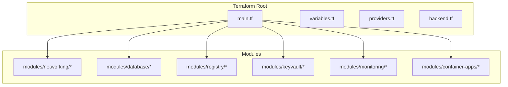

**Diagram sources**
- [main.tf:1-153](file://infrastructure/terraform/main.tf#L1-L153)
- [variables.tf:1-178](file://infrastructure/terraform/variables.tf#L1-L178)
- [providers.tf:1-30](file://infrastructure/terraform/providers.tf#L1-L30)
- [backend.tf:1-9](file://infrastructure/terraform/backend.tf#L1-L9)

**Section sources**
- [main.tf:1-153](file://infrastructure/terraform/main.tf#L1-L153)
- [variables.tf:1-178](file://infrastructure/terraform/variables.tf#L1-L178)
- [providers.tf:1-30](file://infrastructure/terraform/providers.tf#L1-L30)
- [backend.tf:1-9](file://infrastructure/terraform/backend.tf#L1-L9)

## Core Components
- Resource Group: Central grouping for all resources
- Networking: Virtual Network, subnets with delegations, NSGs, and private DNS zones
- Database: Azure PostgreSQL Flexible Server with optional VNet integration and HA
- Cache: Azure Redis Cache (non-SSL port disabled)
- Registry: Azure Container Registry with admin credentials
- Key Vault: Secure secrets storage with access policies
- Monitoring: Log Analytics Workspace and Application Insights
- Container Apps: Environment and API/web services with probes, secrets, and ingress

Key outputs expose IDs, names, FQDNs, and connection strings for downstream configuration.

**Section sources**
- [modules/networking/main.tf:1-111](file://infrastructure/terraform/modules/networking/main.tf#L1-L111)
- [modules/networking/outputs.tf:1-35](file://infrastructure/terraform/modules/networking/outputs.tf#L1-L35)
- [modules/database/main.tf:1-78](file://infrastructure/terraform/modules/database/main.tf#L1-L78)
- [modules/database/outputs.tf:1-38](file://infrastructure/terraform/modules/database/outputs.tf#L1-L38)
- [modules/registry/main.tf:1-12](file://infrastructure/terraform/modules/registry/main.tf#L1-L12)
- [modules/registry/outputs.tf:1-27](file://infrastructure/terraform/modules/registry/outputs.tf#L1-L27)
- [modules/keyvault/main.tf:1-127](file://infrastructure/terraform/modules/keyvault/main.tf#L1-L127)
- [modules/keyvault/outputs.tf:1-42](file://infrastructure/terraform/modules/keyvault/outputs.tf#L1-L42)
- [modules/monitoring/main.tf:1-22](file://infrastructure/terraform/modules/monitoring/main.tf#L1-L22)
- [modules/monitoring/outputs.tf:1-38](file://infrastructure/terraform/modules/monitoring/outputs.tf#L1-L38)
- [modules/container-apps/main.tf:1-310](file://infrastructure/terraform/modules/container-apps/main.tf#L1-L310)
- [modules/container-apps/outputs.tf:1-82](file://infrastructure/terraform/modules/container-apps/outputs.tf#L1-L82)

## Architecture Overview
The system provisions a private network for production-grade connectivity, places the API and web apps behind Container Apps, and connects them to managed services for compute, storage, and secrets.

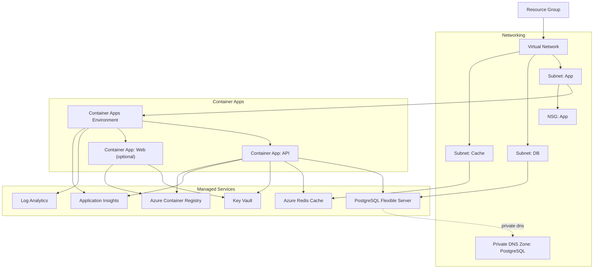

**Diagram sources**
- [main.tf:13-152](file://infrastructure/terraform/main.tf#L13-L152)
- [modules/networking/main.tf:3-111](file://infrastructure/terraform/modules/networking/main.tf#L3-L111)
- [modules/database/main.tf:9-48](file://infrastructure/terraform/modules/database/main.tf#L9-L48)
- [modules/container-apps/main.tf:4-222](file://infrastructure/terraform/modules/container-apps/main.tf#L4-L222)
- [modules/registry/main.tf:3-11](file://infrastructure/terraform/modules/registry/main.tf#L3-L11)
- [modules/keyvault/main.tf:11-22](file://infrastructure/terraform/modules/keyvault/main.tf#L11-L22)
- [modules/monitoring/main.tf:3-21](file://infrastructure/terraform/modules/monitoring/main.tf#L3-L21)

## Detailed Component Analysis

### Terraform Orchestration and Variables
- Orchestrates resource group, networking, monitoring, registry, database, cache, key vault, and container apps
- Uses locals for naming and tagging; modules pass parameters and receive outputs
- Variables define environment, location, SKU sizes, CPU/memory, replica counts, and toggles for VNet and HA

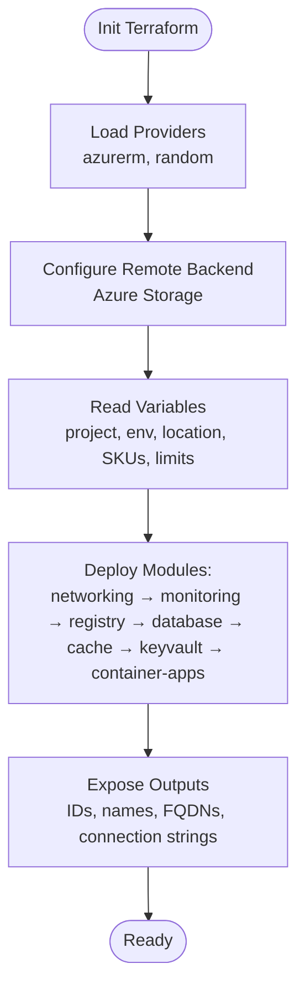

**Diagram sources**
- [providers.tf:1-30](file://infrastructure/terraform/providers.tf#L1-L30)
- [backend.tf:1-9](file://infrastructure/terraform/backend.tf#L1-L9)
- [variables.tf:1-178](file://infrastructure/terraform/variables.tf#L1-L178)
- [main.tf:4-152](file://infrastructure/terraform/main.tf#L4-L152)

**Section sources**
- [main.tf:1-153](file://infrastructure/terraform/main.tf#L1-L153)
- [variables.tf:1-178](file://infrastructure/terraform/variables.tf#L1-L178)
- [providers.tf:1-30](file://infrastructure/terraform/providers.tf#L1-L30)
- [backend.tf:1-9](file://infrastructure/terraform/backend.tf#L1-L9)

### Networking Module
- Virtual Network with configurable address spaces
- Delegated subnets:
  - App subnet delegated to Container Apps
  - DB subnet delegated to PostgreSQL with storage service endpoints
  - Cache subnet for Redis
- Network Security Groups allowing HTTP/HTTPS ingress to the app subnet
- Private DNS zone for PostgreSQL with VNet link

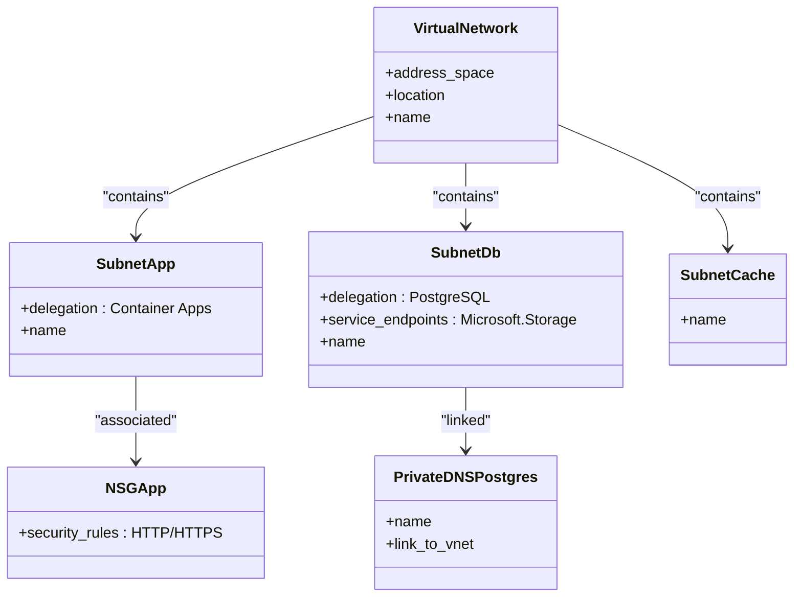

**Diagram sources**
- [modules/networking/main.tf:3-111](file://infrastructure/terraform/modules/networking/main.tf#L3-L111)

**Section sources**
- [modules/networking/main.tf:1-111](file://infrastructure/terraform/modules/networking/main.tf#L1-L111)
- [modules/networking/outputs.tf:1-35](file://infrastructure/terraform/modules/networking/outputs.tf#L1-L35)

### Database Module (PostgreSQL Flexible Server)
- Randomly generated admin password
- Optional VNet integration and private DNS zone binding
- High availability toggle for zone-redundant failover
- Firewall rule to allow Azure services
- Server parameters tuned for logging and timezone

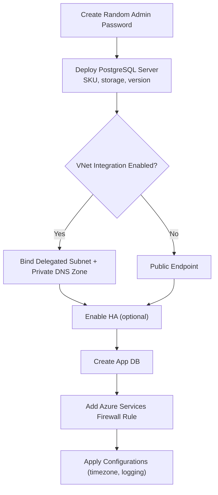

**Diagram sources**
- [modules/database/main.tf:3-78](file://infrastructure/terraform/modules/database/main.tf#L3-L78)

**Section sources**
- [modules/database/main.tf:1-78](file://infrastructure/terraform/modules/database/main.tf#L1-L78)
- [modules/database/outputs.tf:1-38](file://infrastructure/terraform/modules/database/outputs.tf#L1-L38)

### Container Registry Module
- Basic SKU ACR with admin enabled for simplified dev deployments
- Outputs include login server and admin credentials

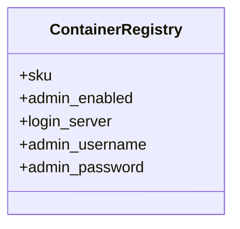

**Diagram sources**
- [modules/registry/main.tf:3-11](file://infrastructure/terraform/modules/registry/main.tf#L3-L11)
- [modules/registry/outputs.tf:1-27](file://infrastructure/terraform/modules/registry/outputs.tf#L1-L27)

**Section sources**
- [modules/registry/main.tf:1-12](file://infrastructure/terraform/modules/registry/main.tf#L1-L12)
- [modules/registry/outputs.tf:1-27](file://infrastructure/terraform/modules/registry/outputs.tf#L1-L27)

### Key Vault Module
- Unique vault name with randomized suffix
- Access policies for deployer and Container App managed identity
- Secrets for database URL, Redis password, JWT secrets, CSRF, optional Stripe and CORS

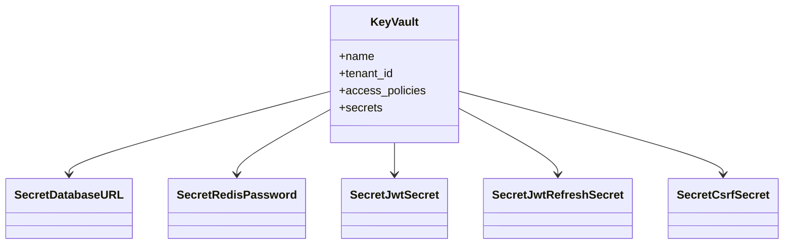

**Diagram sources**
- [modules/keyvault/main.tf:11-127](file://infrastructure/terraform/modules/keyvault/main.tf#L11-L127)
- [modules/keyvault/outputs.tf:1-42](file://infrastructure/terraform/modules/keyvault/outputs.tf#L1-L42)

**Section sources**
- [modules/keyvault/main.tf:1-127](file://infrastructure/terraform/modules/keyvault/main.tf#L1-L127)
- [modules/keyvault/outputs.tf:1-42](file://infrastructure/terraform/modules/keyvault/outputs.tf#L1-L42)

### Monitoring Module
- Log Analytics workspace and Application Insights configured together
- Outputs include workspace IDs, instrumentation keys, and connection strings

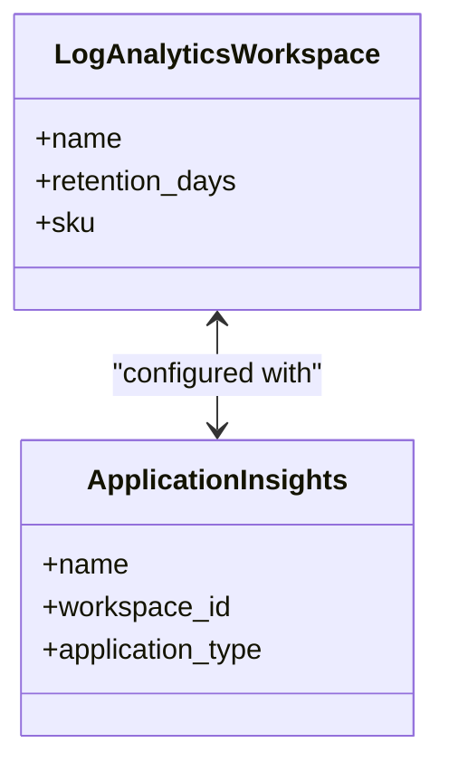

**Diagram sources**
- [modules/monitoring/main.tf:3-21](file://infrastructure/terraform/modules/monitoring/main.tf#L3-L21)
- [modules/monitoring/outputs.tf:1-38](file://infrastructure/terraform/modules/monitoring/outputs.tf#L1-L38)

**Section sources**
- [modules/monitoring/main.tf:1-22](file://infrastructure/terraform/modules/monitoring/main.tf#L1-L22)
- [modules/monitoring/outputs.tf:1-38](file://infrastructure/terraform/modules/monitoring/outputs.tf#L1-L38)

### Container Apps Module
- Environment with optional infrastructure subnet binding
- API Container App with liveness/readiness/startup probes, secrets, and ingress
- Optional Web Container App with separate image and routing
- Registry credentials supplied via secrets

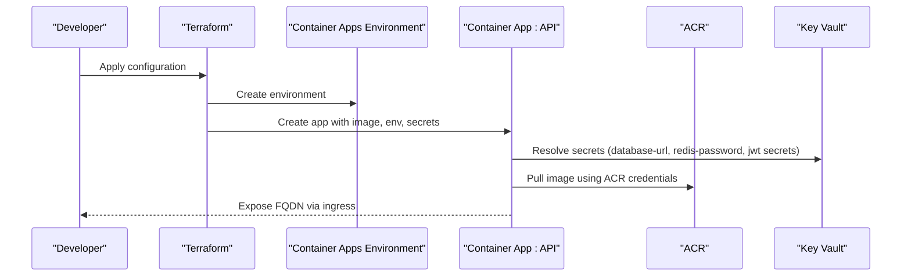

**Diagram sources**
- [modules/container-apps/main.tf:4-222](file://infrastructure/terraform/modules/container-apps/main.tf#L4-L222)

**Section sources**
- [modules/container-apps/main.tf:1-310](file://infrastructure/terraform/modules/container-apps/main.tf#L1-L310)
- [modules/container-apps/outputs.tf:1-82](file://infrastructure/terraform/modules/container-apps/outputs.tf#L1-L82)

### Alternative Deployment Paths

#### Bash Script Deployment (setup-azure.sh)
- Validates prerequisites (Azure CLI, Terraform, OpenSSL)
- Logs into Azure, ensures state resource group and storage account, creates container if missing
- Writes backend.tf dynamically and optionally terraform.tfvars
- Outputs next steps to run the deployment script

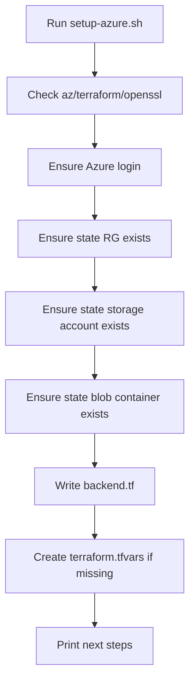

**Diagram sources**
- [scripts/setup-azure.sh:43-186](file://scripts/setup-azure.sh#L43-L186)

**Section sources**
- [scripts/setup-azure.sh:1-196](file://scripts/setup-azure.sh#L1-L196)

#### PowerShell Script Deployment (deploy-to-azure.ps1)
- Deploys end-to-end: Resource Group, PostgreSQL, ACR, Redis, Container Apps Environment, and API
- Builds and pushes API image via ACR Tasks
- Generates secrets and deploys Container Apps with env vars and secrets
- Runs Prisma migrations via container exec
- Prints summary and saves credentials to a file

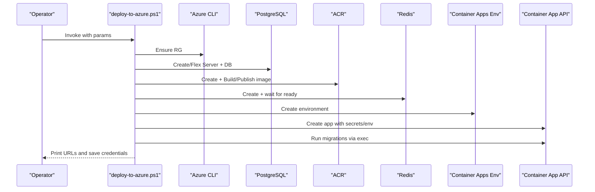

**Diagram sources**
- [scripts/deploy-to-azure.ps1:38-349](file://scripts/deploy-to-azure.ps1#L38-L349)

**Section sources**
- [scripts/deploy-to-azure.ps1:1-349](file://scripts/deploy-to-azure.ps1#L1-L349)

## Dependency Analysis
- Top-level orchestration depends on modules; modules export IDs/names consumed by others
- Container Apps depends on networking (subnet), registry (credentials), database/connection string, cache, key vault, and monitoring
- Database module supports VNet integration and private DNS zone linkage
- Key Vault secrets are referenced by Container Apps and populated by the keyvault module

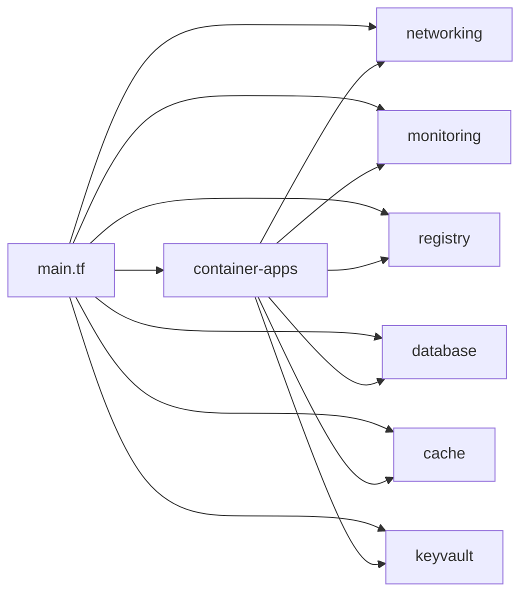

**Diagram sources**
- [main.tf:20-152](file://infrastructure/terraform/main.tf#L20-L152)

**Section sources**
- [main.tf:1-153](file://infrastructure/terraform/main.tf#L1-L153)

## Performance Considerations
- Use appropriate SKU tiers and capacity for PostgreSQL and Redis based on workload
- Enable high availability for PostgreSQL in production
- Right-size CPU/memory and replicas for Container Apps; autoscale based on metrics
- Use private networking (VNet integration) to reduce latency and exposure
- Monitor with Application Insights and Log Analytics; set alerts for critical thresholds

## Troubleshooting Guide
- Terraform state initialization
  - Ensure backend.tf points to a valid storage account and container
  - Confirm the state key matches the intended environment
- Azure authentication
  - Verify Azure CLI login and subscription selection
- Networking issues
  - Confirm subnet delegations and NSG rules allow required ports
  - Validate private DNS zone linkage for VNet-integrated databases
- Secrets resolution
  - Ensure Key Vault access policies grant permissions to the Container App managed identity
  - Confirm secret names match references in Container Apps
- Container Apps health
  - Review liveness/readiness probes and logs
  - Check ingress configuration and domain bindings

**Section sources**
- [scripts/setup-azure.sh:43-186](file://scripts/setup-azure.sh#L43-L186)
- [modules/networking/main.tf:56-92](file://infrastructure/terraform/modules/networking/main.tf#L56-L92)
- [modules/keyvault/main.tf:24-50](file://infrastructure/terraform/modules/keyvault/main.tf#L24-L50)
- [modules/container-apps/main.tf:124-157](file://infrastructure/terraform/modules/container-apps/main.tf#L124-L157)

## Conclusion
The repository provides a robust, modular Terraform foundation for deploying Quiz-to-Build on Azure, complemented by convenient scripts for rapid setup and end-to-end deployment. By leveraging private networking, managed services, and centralized secrets management, teams can achieve secure, scalable, and maintainable infrastructure.

## Appendices

### Step-by-Step Manual Setup (Terraform)
1. Initialize provider and backend
   - Ensure azurerm provider and required version are configured
   - Configure remote backend with resource group, storage account, container, and key
2. Define variables
   - Set project_name, environment, location, tags, SKUs, and capacity limits
3. Create resource group
   - Use the resource group created by the orchestration module
4. Provision networking
   - Virtual network, subnets with delegations, NSGs, and private DNS zone
5. Deploy managed services
   - PostgreSQL (with optional VNet integration), Redis Cache, ACR, Key Vault, Monitoring
6. Deploy Container Apps
   - Environment, API app with secrets and probes, optional web app
7. Validate outputs
   - Retrieve FQDNs, connection strings, and IDs for integration

**Section sources**
- [providers.tf:1-30](file://infrastructure/terraform/providers.tf#L1-L30)
- [backend.tf:1-9](file://infrastructure/terraform/backend.tf#L1-L9)
- [variables.tf:1-178](file://infrastructure/terraform/variables.tf#L1-L178)
- [main.tf:13-152](file://infrastructure/terraform/main.tf#L13-L152)

### Resource Naming Conventions
- Resource Group: rg-{project}-{env}
- Virtual Network: vnet-{project}-{env}
- Subnets: snet-app/db/cache-{env}
- PostgreSQL: psql-{project}-{env}
- Redis: redis-{project}-{env}
- ACR: acr{project}{env}
- Key Vault: kv-quest-{env}-<suffix>
- Container Apps Environment: cae-{project}-{env}
- Container Apps: ca-{project}-api/web-{env}

**Section sources**
- [main.tf:13-152](file://infrastructure/terraform/main.tf#L13-L152)
- [modules/networking/main.tf:3-111](file://infrastructure/terraform/modules/networking/main.tf#L3-L111)
- [modules/database/main.tf:9-21](file://infrastructure/terraform/modules/database/main.tf#L9-L21)
- [modules/registry/main.tf:3-11](file://infrastructure/terraform/modules/registry/main.tf#L3-L11)
- [modules/keyvault/main.tf:11-22](file://infrastructure/terraform/modules/keyvault/main.tf#L11-L22)
- [modules/container-apps/main.tf:4-31](file://infrastructure/terraform/modules/container-apps/main.tf#L4-L31)

### Cost Optimization Strategies
- Use Basic SKU for ACR in development; upgrade as needed
- Right-size PostgreSQL and Redis SKUs; enable auto-grow where appropriate
- Use reserved instances or committed amount for predictable workloads
- Enable monitoring and set budget alerts
- Leverage private networking to avoid public egress costs
- Clean up unused resources and disable non-essential features in lower environments

### Infrastructure as Code Best Practices
- State Management
  - Use remote backend with encryption-at-rest and strict access controls
  - Lock down state keys per environment
- Environment Isolation
  - Separate resource groups and subscriptions per environment
  - Tag resources consistently for cost allocation and governance
- Secrets Management
  - Store secrets in Key Vault; reference via Container Apps or modules
  - Limit access policies to least privilege identities
- Idempotency and Drift Prevention
  - Avoid manual changes to state-managed resources
  - Use lifecycle ignore blocks judiciously for controlled updates
- Version Pinning
  - Pin provider versions and use dependency lock files