# Monitoring & Alerts

<cite>
**Referenced Files in This Document**
- [appinsights.config.ts](file://apps/api/src/config/appinsights.config.ts)
- [sentry.config.ts](file://apps/api/src/config/sentry.config.ts)
- [alerting-rules.config.ts](file://apps/api/src/config/alerting-rules.config.ts)
- [logger.config.ts](file://apps/api/src/config/logger.config.ts)
- [uptime-monitoring.config.ts](file://apps/api/src/config/uptime-monitoring.config.ts)
- [resource-pressure.config.ts](file://apps/api/src/config/resource-pressure.config.ts)
- [graceful-degradation.config.ts](file://apps/api/src/config/graceful-degradation.config.ts)
- [canary-deployment.config.ts](file://apps/api/src/config/canary-deployment.config.ts)
- [chaos-engineering.config.ts](file://apps/api/src/config/chaos-engineering.config.ts)
- [disaster-recovery.config.ts](file://apps/api/src/config/disaster-recovery.config.ts)
- [health.controller.ts](file://apps/api/src/health.controller.ts)
- [main.ts](file://apps/api/src/main.ts)
</cite>

## Table of Contents
1. [Introduction](#introduction)
2. [Project Structure](#project-structure)
3. [Core Components](#core-components)
4. [Architecture Overview](#architecture-overview)
5. [Detailed Component Analysis](#detailed-component-analysis)
6. [Dependency Analysis](#dependency-analysis)
7. [Performance Considerations](#performance-considerations)
8. [Troubleshooting Guide](#troubleshooting-guide)
9. [Conclusion](#conclusion)
10. [Appendices](#appendices)

## Introduction
This document provides comprehensive monitoring and alerting guidance for Quiz-to-Build operations. It covers Application Insights configuration, custom metrics collection, performance monitoring, alerting rules for CPU/memory/database connectivity, error tracking with Sentry, distributed tracing, log aggregation, dashboard creation, and operational runbooks. It also includes proactive monitoring strategies, capacity planning indicators, performance baselines, and incident response procedures.

## Project Structure
The monitoring stack is implemented primarily in the API application under the config directory, with supporting health endpoints and initialization in main.ts. Key areas:
- Application Insights telemetry and custom metrics
- Sentry error tracking and performance monitoring
- Alerting rules and notification channels
- Uptime monitoring and SLA tracking
- Resilience patterns (degradation, circuit breaking, retries)
- Resource pressure testing and chaos engineering
- Canary deployments with health-based rollbacks
- Disaster recovery targets and procedures

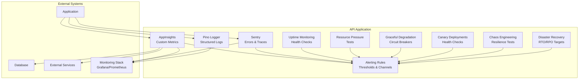

**Diagram sources**
- [appinsights.config.ts:1-610](file://apps/api/src/config/appinsights.config.ts#L1-L610)
- [sentry.config.ts:1-228](file://apps/api/src/config/sentry.config.ts#L1-L228)
- [alerting-rules.config.ts:1-772](file://apps/api/src/config/alerting-rules.config.ts#L1-L772)
- [uptime-monitoring.config.ts:1-379](file://apps/api/src/config/uptime-monitoring.config.ts#L1-L379)
- [resource-pressure.config.ts:1-800](file://apps/api/src/config/resource-pressure.config.ts#L1-L800)
- [graceful-degradation.config.ts:1-800](file://apps/api/src/config/graceful-degradation.config.ts#L1-L800)
- [canary-deployment.config.ts:1-800](file://apps/api/src/config/canary-deployment.config.ts#L1-L800)
- [chaos-engineering.config.ts:1-800](file://apps/api/src/config/chaos-engineering.config.ts#L1-L800)
- [disaster-recovery.config.ts:1-791](file://apps/api/src/config/disaster-recovery.config.ts#L1-L791)

**Section sources**
- [appinsights.config.ts:1-610](file://apps/api/src/config/appinsights.config.ts#L1-L610)
- [sentry.config.ts:1-228](file://apps/api/src/config/sentry.config.ts#L1-L228)
- [alerting-rules.config.ts:1-772](file://apps/api/src/config/alerting-rules.config.ts#L1-L772)
- [uptime-monitoring.config.ts:1-379](file://apps/api/src/config/uptime-monitoring.config.ts#L1-L379)
- [resource-pressure.config.ts:1-800](file://apps/api/src/config/resource-pressure.config.ts#L1-L800)
- [graceful-degradation.config.ts:1-800](file://apps/api/src/config/graceful-degradation.config.ts#L1-L800)
- [canary-deployment.config.ts:1-800](file://apps/api/src/config/canary-deployment.config.ts#L1-L800)
- [chaos-engineering.config.ts:1-800](file://apps/api/src/config/chaos-engineering.config.ts#L1-L800)
- [disaster-recovery.config.ts:1-791](file://apps/api/src/config/disaster-recovery.config.ts#L1-L791)

## Core Components
- Application Insights: Telemetry client initialization, custom metrics, events, exceptions, dependencies, availability, and middleware for request tracking.
- Sentry: Error capture, performance monitoring, distributed tracing, user context, and alerting rules.
- Alerting Rules: Centralized thresholds, severity levels, notification channels, escalation policies, and alert formatting.
- Uptime Monitoring: Health endpoints, SLA targets, external uptime monitoring configuration, and incident severity mapping.
- Graceful Degradation: Circuit breakers, fallbacks, retry with exponential backoff, bulkheads, and rate limiting.
- Resource Pressure Testing: CPU, memory, disk, network, and connection pressure tests with validation and alerts.
- Canary Deployments: Progressive rollout stages, health checks, rollback triggers, and notifications.
- Chaos Engineering: Controlled failure experiments, Azure Chaos Studio and Chaos Mesh configurations.
- Disaster Recovery: RTO/RPO targets, backup schedules, PITR, failover configuration, and DR procedures.

**Section sources**
- [appinsights.config.ts:1-610](file://apps/api/src/config/appinsights.config.ts#L1-L610)
- [sentry.config.ts:1-228](file://apps/api/src/config/sentry.config.ts#L1-L228)
- [alerting-rules.config.ts:1-772](file://apps/api/src/config/alerting-rules.config.ts#L1-L772)
- [uptime-monitoring.config.ts:1-379](file://apps/api/src/config/uptime-monitoring.config.ts#L1-L379)
- [graceful-degradation.config.ts:1-800](file://apps/api/src/config/graceful-degradation.config.ts#L1-L800)
- [resource-pressure.config.ts:1-800](file://apps/api/src/config/resource-pressure.config.ts#L1-L800)
- [canary-deployment.config.ts:1-800](file://apps/api/src/config/canary-deployment.config.ts#L1-L800)
- [chaos-engineering.config.ts:1-800](file://apps/api/src/config/chaos-engineering.config.ts#L1-L800)
- [disaster-recovery.config.ts:1-791](file://apps/api/src/config/disaster-recovery.config.ts#L1-L791)

## Architecture Overview
The monitoring architecture integrates telemetry collection, centralized alerting, and operational runbooks. Application Insights and Sentry feed metrics/logs/traces into the monitoring stack, while alerting rules define thresholds and escalation. Uptime monitoring complements internal telemetry with external health checks. Resilience patterns and chaos engineering validate system behavior under stress.

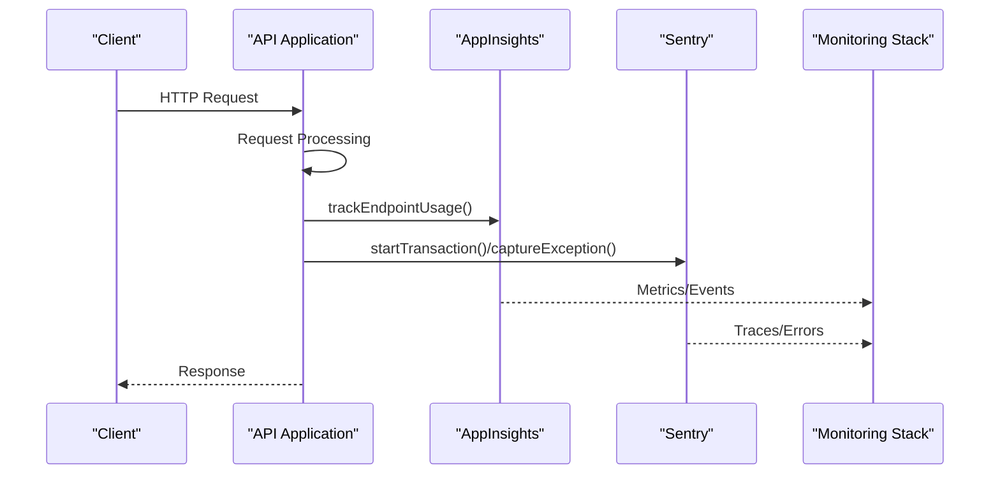

**Diagram sources**
- [appinsights.config.ts:556-610](file://apps/api/src/config/appinsights.config.ts#L556-L610)
- [sentry.config.ts:180-190](file://apps/api/src/config/sentry.config.ts#L180-L190)
- [main.ts](file://apps/api/src/main.ts)

## Detailed Component Analysis

### Application Insights Configuration
- Initialization: Reads connection string/environment keys, sets cloud role/instance, sampling percentages, and enables auto-collection features.
- Custom Metrics: Provides functions to track response times, questionnaire metrics, readiness scores, and standard performance metrics.
- Events: Tracks authentication, document generation, endpoint usage, and availability tests.
- Exceptions: Captures unhandled/handled/critical exceptions with properties and measurements.
- Dependencies: Records database queries and external API calls with success/result codes.
- Middleware: Express-style middleware to automatically track request durations and flag slow requests.

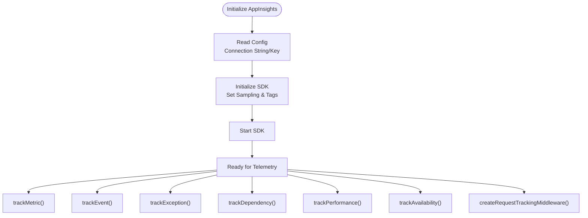

**Diagram sources**
- [appinsights.config.ts:35-117](file://apps/api/src/config/appinsights.config.ts#L35-L117)
- [appinsights.config.ts:140-498](file://apps/api/src/config/appinsights.config.ts#L140-L498)
- [appinsights.config.ts:556-610](file://apps/api/src/config/appinsights.config.ts#L556-L610)

**Section sources**
- [appinsights.config.ts:1-610](file://apps/api/src/config/appinsights.config.ts#L1-L610)

### Sentry Configuration
- Initialization: Loads DSN, environment, release, trace/profile sampling rates, and optional profiling integration.
- Filtering: Removes sensitive headers/data from events and breadcrumbs; ignores known benign errors.
- Error Capture: Provides captureException/captureMessage with contextual extras.
- User Context: setUser/clearUser helpers for correlation.
- Transactions: startTransaction for distributed tracing spans.
- Alerting Rules: Built-in thresholds for error rate, response time, and critical error categories.

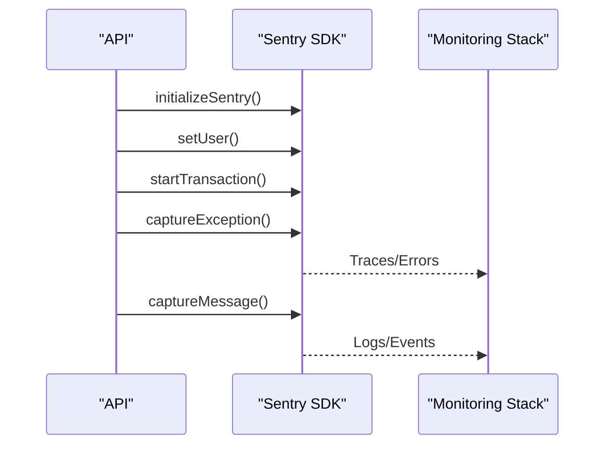

**Diagram sources**
- [sentry.config.ts:51-127](file://apps/api/src/config/sentry.config.ts#L51-L127)
- [sentry.config.ts:132-189](file://apps/api/src/config/sentry.config.ts#L132-L189)

**Section sources**
- [sentry.config.ts:1-228](file://apps/api/src/config/sentry.config.ts#L1-L228)

### Alerting Rules Configuration
- Structure: AlertRule interface defines metric, condition, threshold, duration, severity, channels, and labels/annotations.
- Categories: Error, performance, security, business, and resource alerts with predefined thresholds.
- Global Settings: Evaluation intervals, resolve/repeat intervals, grouping, and inhibition rules.
- Notification Channels: Email, Slack, Teams, PagerDuty, SMS, Webhook with environment-driven configuration.
- Escalation Policies: Default and critical escalation levels with repeat/auto-resolve behavior.
- Helpers: Severity filtering, category filtering, alert formatting, quiet hours logic, and summaries.

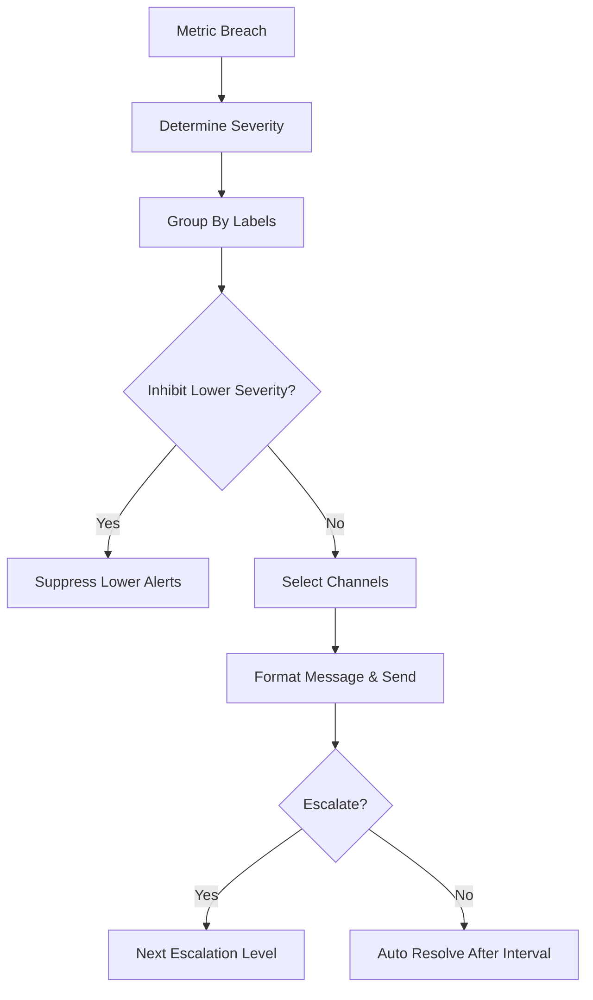

**Diagram sources**
- [alerting-rules.config.ts:20-80](file://apps/api/src/config/alerting-rules.config.ts#L20-L80)
- [alerting-rules.config.ts:583-621](file://apps/api/src/config/alerting-rules.config.ts#L583-L621)

**Section sources**
- [alerting-rules.config.ts:1-772](file://apps/api/src/config/alerting-rules.config.ts#L1-L772)

### Uptime Monitoring and SLA
- SLA Targets: Uptime target, response time targets, maintenance windows, and calculation period.
- Health Endpoints: Live, ready, and full health checks with intervals and expected responses.
- External Uptime Monitoring: UptimeRobot configuration with monitors, status page, and alert contacts.
- Alerting: Thresholds for consecutive failures, response time warnings/criticals, and escalation levels.
- Incident Severity: Mapping of severity levels to response times and notify channels.
- Status Messages: Operational/degraded/partial outage/major outage/scheduled maintenance.

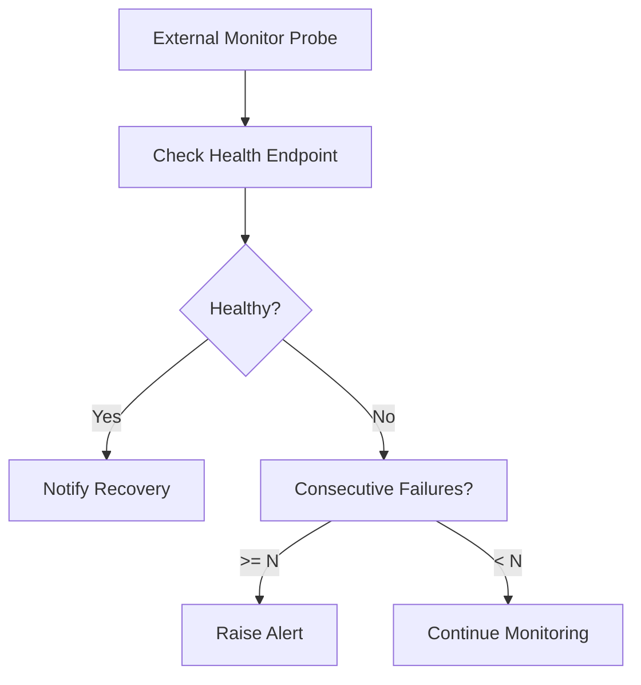

**Diagram sources**
- [uptime-monitoring.config.ts:12-31](file://apps/api/src/config/uptime-monitoring.config.ts#L12-L31)
- [uptime-monitoring.config.ts:100-149](file://apps/api/src/config/uptime-monitoring.config.ts#L100-L149)
- [uptime-monitoring.config.ts:216-268](file://apps/api/src/config/uptime-monitoring.config.ts#L216-L268)

**Section sources**
- [uptime-monitoring.config.ts:1-379](file://apps/api/src/config/uptime-monitoring.config.ts#L1-L379)
- [health.controller.ts](file://apps/api/src/health.controller.ts)

### Graceful Degradation Patterns
- Circuit Breakers: Configurable thresholds, timeouts, fallbacks (cache/queue/default/alternative/local), and monitoring.
- Fallback Handler: Executes fallback strategies with cache retrieval, queueing, default values, alternative endpoints, and local cache.
- Retry with Exponential Backoff: Configurable max retries, delays, jitter, and retryable/non-retryable error lists.
- Bulkhead Isolation: Per-resource concurrency limits, queue sizes, wait timeouts, and metrics.
- Rate Limiting: Per-user/global/login/email/file upload rate limits with timeout behavior.

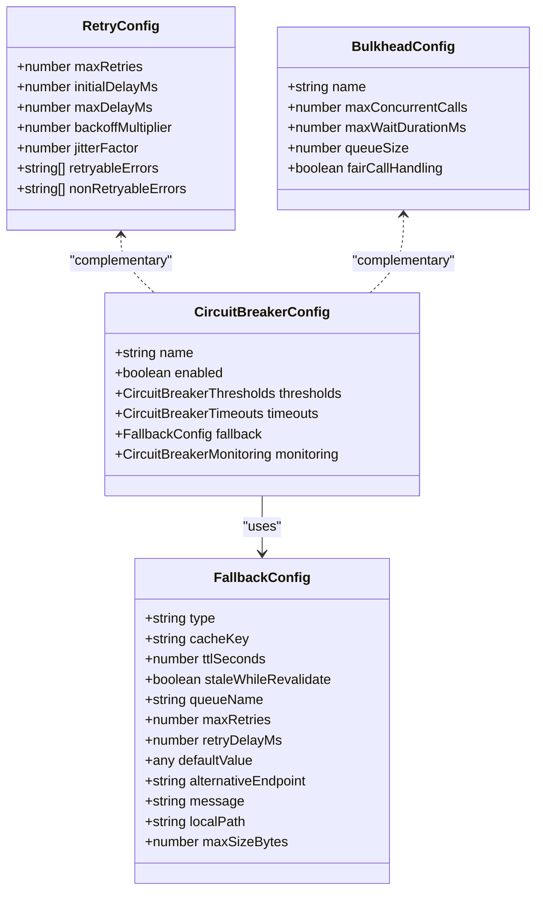

**Diagram sources**
- [graceful-degradation.config.ts:20-95](file://apps/api/src/config/graceful-degradation.config.ts#L20-L95)
- [graceful-degradation.config.ts:217-230](file://apps/api/src/config/graceful-degradation.config.ts#L217-L230)
- [graceful-degradation.config.ts:332-438](file://apps/api/src/config/graceful-degradation.config.ts#L332-L438)
- [graceful-degradation.config.ts:538-593](file://apps/api/src/config/graceful-degradation.config.ts#L538-L593)

**Section sources**
- [graceful-degradation.config.ts:1-800](file://apps/api/src/config/graceful-degradation.config.ts#L1-L800)

### Resource Pressure Testing
- CPU: Moderate/high/critical pressure tests with targeted percentages, workers, ramp/sustain durations, and validation checks.
- Memory: Near-OOM scenarios with GC behavior, OOM protection, graceful rejection, and anomaly detection.
- Disk: Space warnings/criticals, I/O saturation, and emergency cleanup procedures.
- Network/Connections: Bandwidth saturation, connection pool exhaustion, and file descriptor limits.
- Validation: Metrics, logs, health checks, and behavior validations per test.

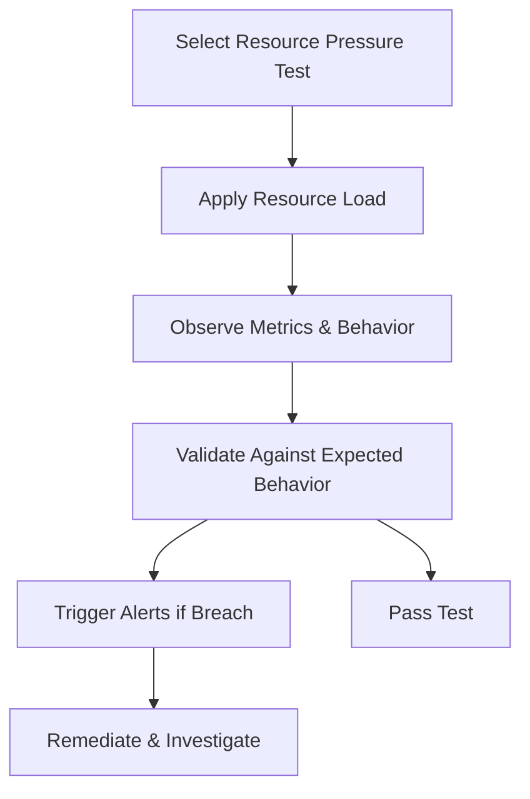

**Diagram sources**
- [resource-pressure.config.ts:78-254](file://apps/api/src/config/resource-pressure.config.ts#L78-L254)
- [resource-pressure.config.ts:260-444](file://apps/api/src/config/resource-pressure.config.ts#L260-L444)
- [resource-pressure.config.ts:451-621](file://apps/api/src/config/resource-pressure.config.ts#L451-L621)
- [resource-pressure.config.ts:627-790](file://apps/api/src/config/resource-pressure.config.ts#L627-L790)

**Section sources**
- [resource-pressure.config.ts:1-800](file://apps/api/src/config/resource-pressure.config.ts#L1-L800)

### Canary Deployments
- Stages: Linear rollout (5% → 25% → 50% → 100%) with min/max durations and health checks.
- Health Checks: Multiple endpoints with thresholds and timeouts.
- Rollback Triggers: Error rate, latency, pod restarts, CPU/memory usage.
- Promotion Criteria: Successful health checks, error rate, latency, and request volume thresholds.
- Notifications: Teams, Slack, email, PagerDuty for deployment lifecycle events.
- Metrics: Azure Monitor integration with custom metrics queries.

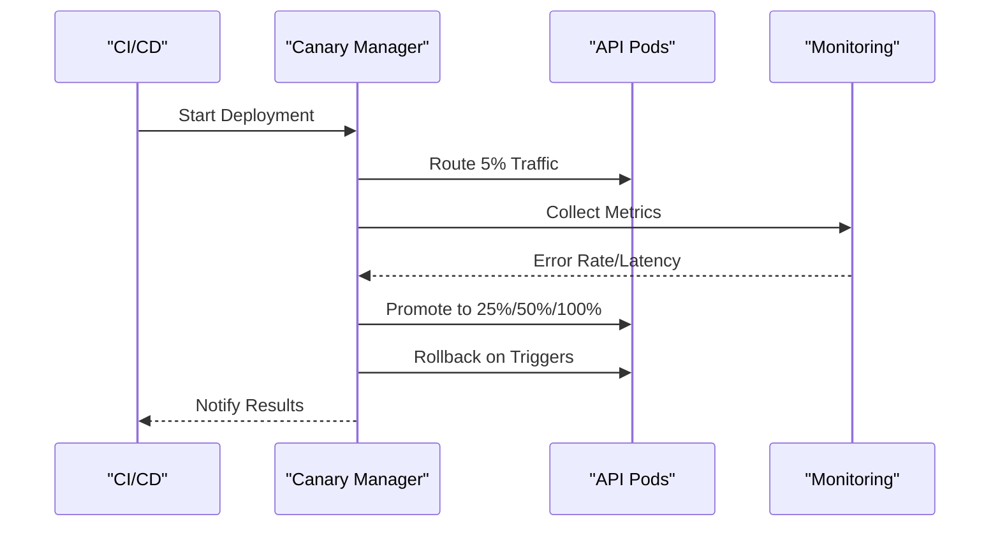

**Diagram sources**
- [canary-deployment.config.ts:144-232](file://apps/api/src/config/canary-deployment.config.ts#L144-L232)
- [canary-deployment.config.ts:270-335](file://apps/api/src/config/canary-deployment.config.ts#L270-L335)
- [canary-deployment.config.ts:429-472](file://apps/api/src/config/canary-deployment.config.ts#L429-L472)

**Section sources**
- [canary-deployment.config.ts:1-800](file://apps/api/src/config/canary-deployment.config.ts#L1-L800)

### Chaos Engineering
- Experiments: Network latency/partition, CPU/memory/disk pressure, pod kill/failure, DNS chaos, HTTP error injection.
- Azure Chaos Studio: Managed identity, target resources, experiment steps with continuous/discrete actions.
- Chaos Mesh: Kubernetes manifests for PodChaos, NetworkChaos, IOChaos, TimeChaos, StressChaos, etc.
- Monitoring: Alerts, dashboards, and notification channels for chaos events.

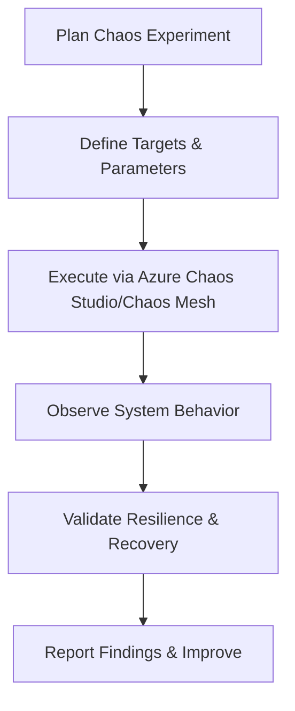

**Diagram sources**
- [chaos-engineering.config.ts:286-642](file://apps/api/src/config/chaos-engineering.config.ts#L286-L642)
- [chaos-engineering.config.ts:648-741](file://apps/api/src/config/chaos-engineering.config.ts#L648-L741)
- [chaos-engineering.config.ts:747-800](file://apps/api/src/config/chaos-engineering.config.ts#L747-L800)

**Section sources**
- [chaos-engineering.config.ts:1-800](file://apps/api/src/config/chaos-engineering.config.ts#L1-L800)

### Disaster Recovery
- Targets: RTO/RPO, monthly downtime allowance, target availability.
- Backups: Full/incremental/differential/transaction log/snapshot with retention and encryption.
- PITR: Point-in-time recovery configuration aligned with RPO.
- Failover: Active-passive mode, DNS failover, database replication, storage failover.
- Procedures: Region failover, database PITR, full system restore with step-by-step commands.
- Testing: Quarterly, monthly, and annual DR exercises with success criteria.

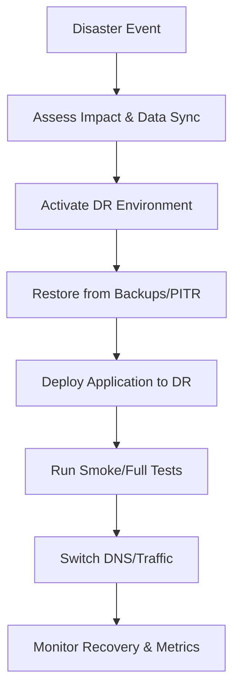

**Diagram sources**
- [disaster-recovery.config.ts:40-47](file://apps/api/src/config/disaster-recovery.config.ts#L40-L47)
- [disaster-recovery.config.ts:113-309](file://apps/api/src/config/disaster-recovery.config.ts#L113-L309)
- [disaster-recovery.config.ts:386-424](file://apps/api/src/config/disaster-recovery.config.ts#L386-L424)
- [disaster-recovery.config.ts:455-689](file://apps/api/src/config/disaster-recovery.config.ts#L455-L689)

**Section sources**
- [disaster-recovery.config.ts:1-791](file://apps/api/src/config/disaster-recovery.config.ts#L1-L791)

## Dependency Analysis
- Application Insights depends on environment variables for connection and role tagging; middleware depends on request/response shapes.
- Sentry initialization depends on DSN and environment; integrates with NestJS request lifecycle.
- Alerting rules depend on metric names and thresholds; channels depend on environment variables.
- Uptime monitoring depends on base URLs and external service configuration.
- Graceful degradation components are independent but coordinate via shared contexts (user/session).
- Canary deployment manager coordinates with monitoring systems for metrics and health checks.
- Chaos experiments integrate with Azure Chaos Studio and Kubernetes Chaos Mesh.
- Disaster recovery procedures rely on backup systems and failover configurations.

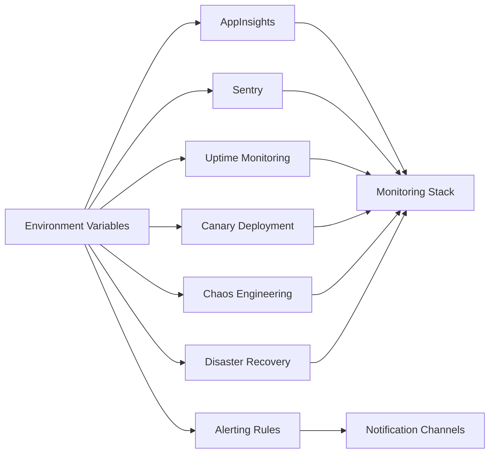

**Diagram sources**
- [appinsights.config.ts:35-52](file://apps/api/src/config/appinsights.config.ts#L35-L52)
- [sentry.config.ts:35-44](file://apps/api/src/config/sentry.config.ts#L35-L44)
- [alerting-rules.config.ts:536-577](file://apps/api/src/config/alerting-rules.config.ts#L536-L577)
- [uptime-monitoring.config.ts:100-149](file://apps/api/src/config/uptime-monitoring.config.ts#L100-L149)
- [canary-deployment.config.ts:356-424](file://apps/api/src/config/canary-deployment.config.ts#L356-L424)
- [chaos-engineering.config.ts:648-741](file://apps/api/src/config/chaos-engineering.config.ts#L648-L741)
- [disaster-recovery.config.ts:113-309](file://apps/api/src/config/disaster-recovery.config.ts#L113-L309)

**Section sources**
- [appinsights.config.ts:1-610](file://apps/api/src/config/appinsights.config.ts#L1-L610)
- [sentry.config.ts:1-228](file://apps/api/src/config/sentry.config.ts#L1-L228)
- [alerting-rules.config.ts:1-772](file://apps/api/src/config/alerting-rules.config.ts#L1-L772)
- [uptime-monitoring.config.ts:1-379](file://apps/api/src/config/uptime-monitoring.config.ts#L1-L379)
- [canary-deployment.config.ts:1-800](file://apps/api/src/config/canary-deployment.config.ts#L1-L800)
- [chaos-engineering.config.ts:1-800](file://apps/api/src/config/chaos-engineering.config.ts#L1-L800)
- [disaster-recovery.config.ts:1-791](file://apps/api/src/config/disaster-recovery.config.ts#L1-L791)

## Performance Considerations
- Sampling: Application Insights sampling reduces telemetry volume in production; adjust based on cost/performance trade-offs.
- Middleware Overhead: Request tracking middleware adds minimal overhead; ensure it runs after authentication.
- Logging: Pino structured logging with redaction improves observability without leaking secrets.
- Circuit Breakers: Tune thresholds to balance protection and throughput; use fallbacks to maintain functionality.
- Retries: Exponential backoff with jitter prevents thundering herds; classify retryable vs non-retryable errors.
- Bulkheads: Queue depth and wait timeouts prevent overload; monitor queue metrics.
- Resource Tests: Use controlled pressure tests to establish baselines and capacity limits.

[No sources needed since this section provides general guidance]

## Troubleshooting Guide
- Application Insights Not Initializing:
  - Verify connection string or instrumentation key environment variables.
  - Check role/instance tags and sampling configuration.
  - Review initialization logs for errors.

- Sentry Not Capturing Errors:
  - Confirm DSN is set and environment matches.
  - Check beforeSend/beforeSendTransaction filters for excluded paths.
  - Validate user context and breadcrumbs.

- Alert Not Firing:
  - Validate metric names and thresholds in alerting rules.
  - Confirm channel configuration and environment variables.
  - Check escalation policy and quiet hours logic.

- Health Check Failures:
  - Review uptime monitoring configuration and external service endpoints.
  - Inspect incident severity mapping and auto-incident rules.

- Graceful Degradation Not Engaging:
  - Verify circuit breaker thresholds and fallback configurations.
  - Check retry configurations and bulkhead limits.
  - Confirm rate limiter settings.

**Section sources**
- [appinsights.config.ts:65-117](file://apps/api/src/config/appinsights.config.ts#L65-L117)
- [sentry.config.ts:51-127](file://apps/api/src/config/sentry.config.ts#L51-L127)
- [alerting-rules.config.ts:687-741](file://apps/api/src/config/alerting-rules.config.ts#L687-L741)
- [uptime-monitoring.config.ts:100-210](file://apps/api/src/config/uptime-monitoring.config.ts#L100-L210)

## Conclusion
The Quiz-to-Build monitoring and alerting framework combines Application Insights and Sentry for comprehensive telemetry, centralized alerting rules with robust escalation, uptime monitoring, graceful degradation patterns, resource pressure testing, canary deployments, chaos engineering, and disaster recovery procedures. Together, these components provide proactive monitoring, rapid incident response, and resilient operations.

[No sources needed since this section summarizes without analyzing specific files]

## Appendices

### Dashboard Creation and Metric Visualization
- Metrics to Track:
  - Uptime: Hourly/Daily/Weekly/Monthly
  - Response Time: Average/P50/P95/P99/Max
  - Availability: Success/Failure rates, MTBF/MTTR
- Visualization Tips:
  - Use percentiles for latency to reflect tail behavior.
  - Combine error rate and latency for performance health.
  - Correlate CPU/memory/disk metrics with request volumes.

**Section sources**
- [uptime-monitoring.config.ts:286-311](file://apps/api/src/config/uptime-monitoring.config.ts#L286-L311)

### Alert Notification Channels
- Email: SMTP configuration with recipients and subject prefix.
- Slack: Webhook URL, channel, username, and mentions.
- Teams: Webhook URL and optional mentions.
- PagerDuty: Service key and escalation policy.
- SMS: Provider selection and recipients.
- Webhook: URL with headers for alert routing.

**Section sources**
- [alerting-rules.config.ts:536-577](file://apps/api/src/config/alerting-rules.config.ts#L536-L577)

### Proactive Monitoring Strategies
- Establish Performance Baselines: Measure steady-state latencies and error rates.
- Capacity Planning Indicators: Track CPU/memory/disk trends and connection pool usage.
- Health Scorecards: Combine availability, latency, error rate, and throughput.
- Change Intelligence: Tie alerts to deployments and configuration changes.

**Section sources**
- [graceful-degradation.config.ts:538-593](file://apps/api/src/config/graceful-degradation.config.ts#L538-L593)
- [resource-pressure.config.ts:78-254](file://apps/api/src/config/resource-pressure.config.ts#L78-L254)

### Incident Response Procedures
- Severity Levels: P1–P4 with response times and notify channels.
- Auto-Incidents: Rules for health check failures and response time breaches.
- Escalation Paths: Multi-level escalation with repeat/auto-resolve.
- Runbooks: Automated commands for failover, PITR, and full restore.

**Section sources**
- [uptime-monitoring.config.ts:216-268](file://apps/api/src/config/uptime-monitoring.config.ts#L216-L268)
- [disaster-recovery.config.ts:455-689](file://apps/api/src/config/disaster-recovery.config.ts#L455-L689)