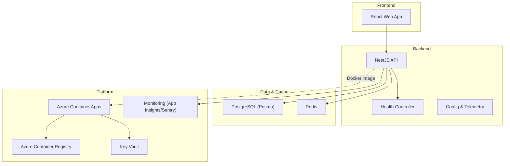
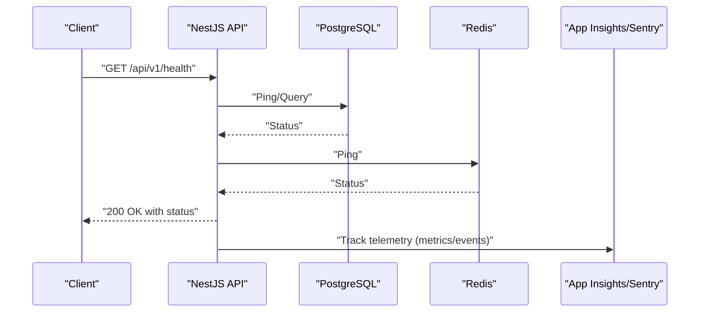
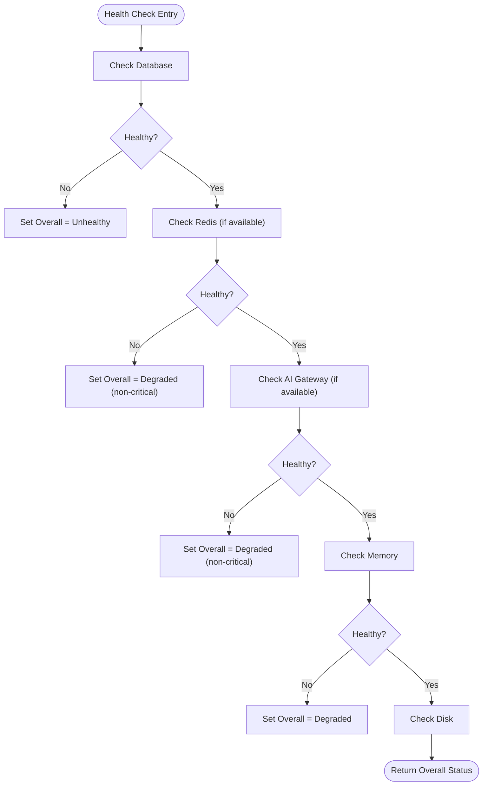
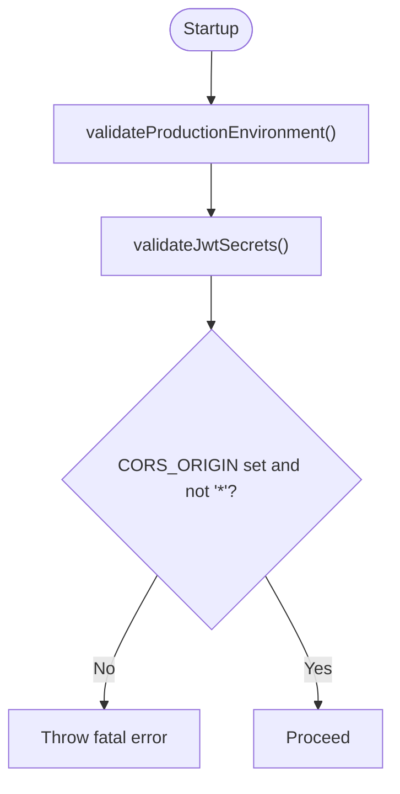
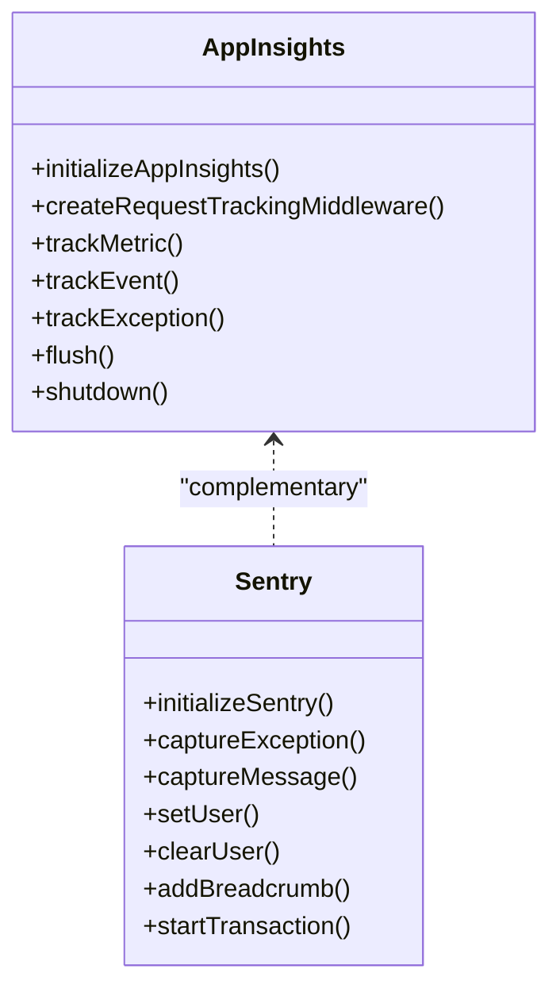
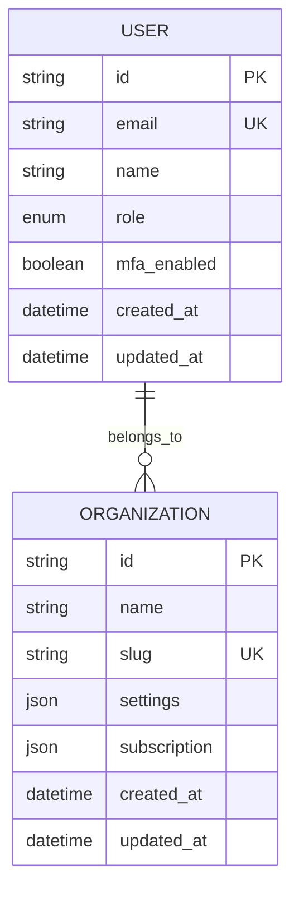
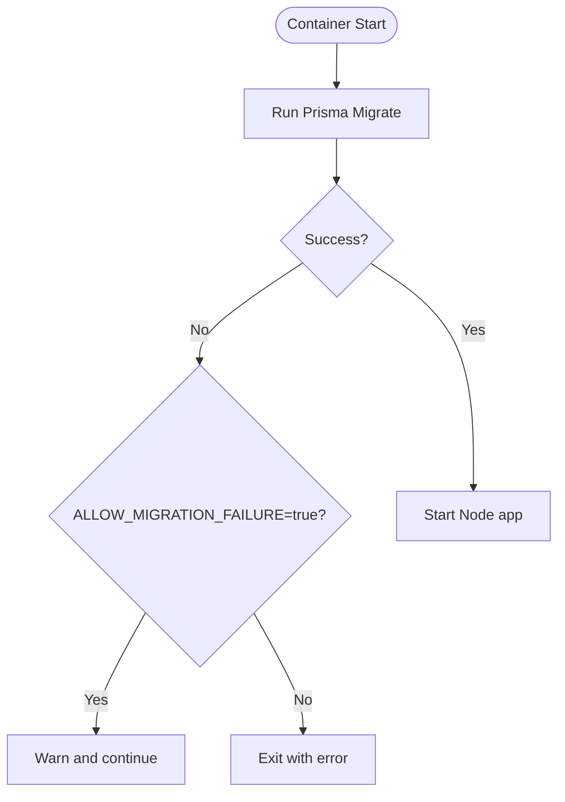
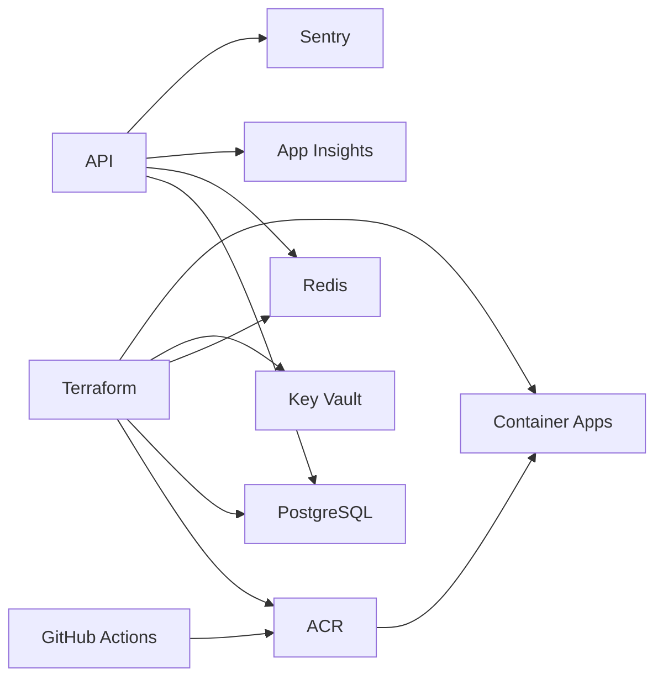
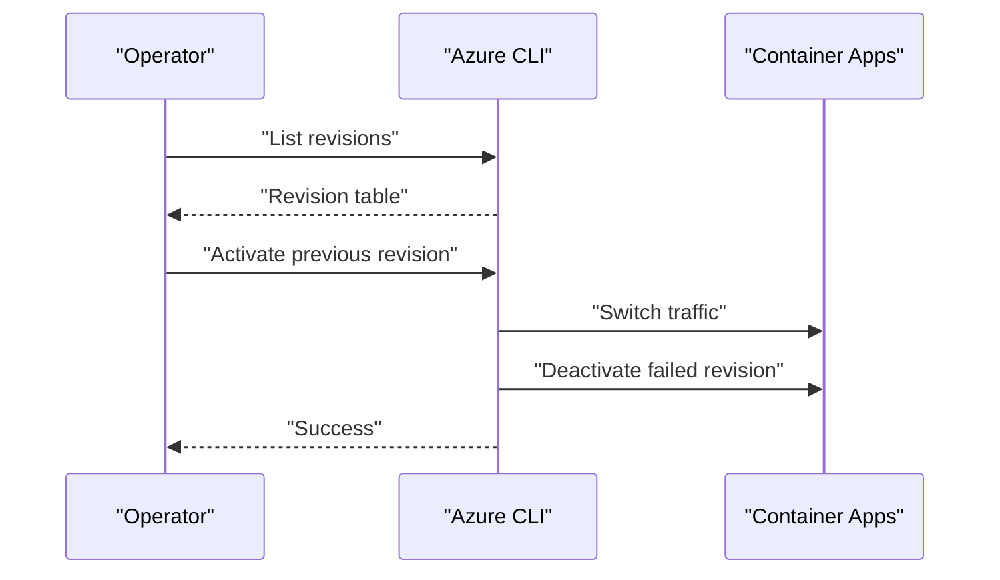

# Troubleshooting & Operations

<cite>
**Referenced Files in This Document**
- [README.md](file://README.md)
- [DEPLOYMENT.md](file://DEPLOYMENT.md)
- [DEPLOYMENT-CHECKLIST.md](file://DEPLOYMENT-CHECKLIST.md)
- [apps/api/src/main.ts](file://apps/api/src/main.ts)
- [apps/api/src/health.controller.ts](file://apps/api/src/health.controller.ts)
- [apps/api/src/config/configuration.ts](file://apps/api/src/config/configuration.ts)
- [apps/api/src/config/appinsights.config.ts](file://apps/api/src/config/appinsights.config.ts)
- [apps/api/src/config/sentry.config.ts](file://apps/api/src/config/sentry.config.ts)
- [prisma/schema.prisma](file://prisma/schema.prisma)
- [docker/api/Dockerfile](file://docker/api/Dockerfile)
- [docker/api/entrypoint.sh](file://docker/api/entrypoint.sh)
- [docker-compose.yml](file://docker-compose.yml)
- [scripts/deploy.sh](file://scripts/deploy.sh)
- [scripts/setup-local.sh](file://scripts/setup-local.sh)
- [scripts/security-scan.sh](file://scripts/security-scan.sh)
- [scripts/health-monitor.ps1](file://scripts/health-monitor.ps1)
- [scripts/diagnose-app-startup.ps1](file://scripts/diagnose-app-startup.ps1)
- [infrastructure/terraform/main.tf](file://infrastructure/terraform/main.tf)
</cite>

## Table of Contents
1. [Introduction](#introduction)
2. [Project Structure](#project-structure)
3. [Core Components](#core-components)
4. [Architecture Overview](#architecture-overview)
5. [Detailed Component Analysis](#detailed-component-analysis)
6. [Dependency Analysis](#dependency-analysis)
7. [Performance Considerations](#performance-considerations)
8. [Troubleshooting Guide](#troubleshooting-guide)
9. [Rollback and Hotfix Procedures](#rollback-and-hotfix-procedures)
10. [Operational Runbooks](#operational-runbooks)
11. [Incident Response and Escalation](#incident-response-and-escalation)
12. [Conclusion](#conclusion)

## Introduction
This document provides comprehensive troubleshooting and operations guidance for Quiz-to-Build (Quiz2Biz). It focuses on diagnosing and resolving common deployment issues—authentication failures, database connectivity problems, Docker build errors, and health check failures—alongside operational procedures for database migrations, configuration updates, rollbacks, and emergency fixes. It also outlines diagnostic tools, log analysis techniques, performance profiling, dependency inspection, and incident response workflows.

## Project Structure
Quiz2Biz is a multi-service system composed of:
- NestJS backend (API) with modular domain features
- React frontend
- CLI tool
- Shared libraries (database, redis, orchestration)
- Prisma-managed PostgreSQL schema and migrations
- Dockerized API with multi-stage builds
- Azure Container Apps deployment with CI/CD via GitHub Actions
- Terraform-managed infrastructure (Container Registry, PostgreSQL, Redis, Key Vault, Container Apps)

**Diagram sources**
- [apps/api/src/main.ts:28-329](file://apps/api/src/main.ts#L28-L329)
- [apps/api/src/health.controller.ts:55-410](file://apps/api/src/health.controller.ts#L55-L410)
- [prisma/schema.prisma:1-120](file://prisma/schema.prisma#L1-L120)
- [docker/api/Dockerfile:68-120](file://docker/api/Dockerfile#L68-L120)
- [infrastructure/terraform/main.tf:108-153](file://infrastructure/terraform/main.tf#L108-L153)

**Section sources**
- [README.md:295-318](file://README.md#L295-L318)
- [docker-compose.yml:18-150](file://docker-compose.yml#L18-L150)

## Core Components
- Health endpoints: Full health, liveness, readiness, and startup probes
- Telemetry: Application Insights and Sentry for observability and error tracking
- Configuration: Strict production validation for secrets and CORS
- Database: Prisma ORM with migrations and seed data
- Containerization: Multi-stage Dockerfile with non-root user and health checks
- Deployment: GitHub Actions CI/CD, Azure Container Apps, Terraform infrastructure

**Section sources**
- [apps/api/src/health.controller.ts:67-234](file://apps/api/src/health.controller.ts#L67-L234)
- [apps/api/src/config/appinsights.config.ts:65-117](file://apps/api/src/config/appinsights.config.ts#L65-L117)
- [apps/api/src/config/sentry.config.ts:51-127](file://apps/api/src/config/sentry.config.ts#L51-L127)
- [apps/api/src/config/configuration.ts:5-43](file://apps/api/src/config/configuration.ts#L5-L43)
- [prisma/schema.prisma:1-120](file://prisma/schema.prisma#L1-L120)
- [docker/api/Dockerfile:68-120](file://docker/api/Dockerfile#L68-L120)

## Architecture Overview
The API exposes health endpoints and integrates with PostgreSQL and Redis. In production, it runs in Azure Container Apps with secrets from Key Vault, monitored via Application Insights and Sentry. CI/CD automates builds and deployments.

**Diagram sources**
- [apps/api/src/health.controller.ts:240-313](file://apps/api/src/health.controller.ts#L240-L313)
- [apps/api/src/config/appinsights.config.ts:576-610](file://apps/api/src/config/appinsights.config.ts#L576-L610)
- [apps/api/src/config/sentry.config.ts:184-189](file://apps/api/src/config/sentry.config.ts#L184-L189)

## Detailed Component Analysis

### Health Controller
The health controller provides:
- Full health: aggregates database, Redis, AI gateway, memory, and disk checks
- Liveness: simple alive check
- Readiness: database connectivity gating
- Startup: database availability at startup

**Diagram sources**
- [apps/api/src/health.controller.ts:75-141](file://apps/api/src/health.controller.ts#L75-L141)

**Section sources**
- [apps/api/src/health.controller.ts:67-234](file://apps/api/src/health.controller.ts#L67-L234)

### Configuration and Security Validation
Production configuration enforces:
- Presence and strength of JWT secrets
- Explicit CORS origin list (not wildcard)
- Database URL presence

**Diagram sources**
- [apps/api/src/config/configuration.ts:5-43](file://apps/api/src/config/configuration.ts#L5-L43)

**Section sources**
- [apps/api/src/config/configuration.ts:87-115](file://apps/api/src/config/configuration.ts#L87-L115)

### Telemetry and Observability
- Application Insights: request tracking middleware, custom metrics, availability tests
- Sentry: error tracking, performance monitoring, alerting rules

**Diagram sources**
- [apps/api/src/config/appinsights.config.ts:65-117](file://apps/api/src/config/appinsights.config.ts#L65-L117)
- [apps/api/src/config/sentry.config.ts:51-127](file://apps/api/src/config/sentry.config.ts#L51-L127)

**Section sources**
- [apps/api/src/config/appinsights.config.ts:576-610](file://apps/api/src/config/appinsights.config.ts#L576-L610)
- [apps/api/src/config/sentry.config.ts:194-216](file://apps/api/src/config/sentry.config.ts#L194-L216)

### Database Schema and Migrations
- Prisma schema defines core models and enums
- Migrations under prisma/migrations
- Seed data under prisma/seeds

**Diagram sources**
- [prisma/schema.prisma:245-286](file://prisma/schema.prisma#L245-L286)

**Section sources**
- [prisma/schema.prisma:1-120](file://prisma/schema.prisma#L1-L120)

### Containerization and Startup
- Multi-stage Dockerfile with non-root user and health checks
- Entrypoint runs migrations then starts the app
- Local compose spins up PostgreSQL, Redis, and API

**Diagram sources**
- [docker/api/entrypoint.sh:4-33](file://docker/api/entrypoint.sh#L4-L33)
- [docker/api/Dockerfile:68-120](file://docker/api/Dockerfile#L68-L120)

**Section sources**
- [docker/api/Dockerfile:68-120](file://docker/api/Dockerfile#L68-L120)
- [docker/api/entrypoint.sh:17-33](file://docker/api/entrypoint.sh#L17-L33)
- [docker-compose.yml:109-136](file://docker-compose.yml#L109-L136)

## Dependency Analysis
- API depends on PostgreSQL (via Prisma) and Redis
- Health controller optionally checks Redis and AI gateway
- CI/CD pushes to ACR and deploys to Container Apps
- Terraform provisions ACR, PostgreSQL, Redis, Key Vault, Container Apps

**Diagram sources**
- [apps/api/src/health.controller.ts:56-62](file://apps/api/src/health.controller.ts#L56-L62)
- [infrastructure/terraform/main.tf:108-153](file://infrastructure/terraform/main.tf#L108-L153)
- [DEPLOYMENT.md:43-53](file://DEPLOYMENT.md#L43-L53)

**Section sources**
- [apps/api/src/health.controller.ts:56-62](file://apps/api/src/health.controller.ts#L56-L62)
- [infrastructure/terraform/main.tf:108-153](file://infrastructure/terraform/main.tf#L108-L153)

## Performance Considerations
- Compression middleware excludes streaming endpoints
- Helmet CSP and permissions policies reduce attack surface
- Health checks expose memory usage and response times
- Telemetry tracks slow requests and performance metrics
- Container health checks ensure rolling updates succeed

[No sources needed since this section provides general guidance]

## Troubleshooting Guide

### Authentication Failures
Symptoms:
- Login/register endpoints failing
- CORS errors in production
- JWT validation errors

Diagnosis steps:
- Verify JWT secrets are strong and present
- Confirm CORS_ORIGIN is not wildcard in production
- Check Application Insights/Sentry for authentication-related errors
- Validate OAuth provider configurations if used

Remediation:
- Regenerate secrets with sufficient entropy
- Update CORS_ORIGIN to explicit origins
- Review OAuth adapter configuration
- Inspect Sentry for stack traces

**Section sources**
- [apps/api/src/config/configuration.ts:5-43](file://apps/api/src/config/configuration.ts#L5-L43)
- [apps/api/src/config/sentry.config.ts:105-115](file://apps/api/src/config/sentry.config.ts#L105-L115)
- [apps/api/src/config/appinsights.config.ts:576-610](file://apps/api/src/config/appinsights.config.ts#L576-L610)

### Database Connectivity Problems
Symptoms:
- Health endpoint reports database disconnected
- Migrations fail on startup
- API throws database errors

Diagnosis steps:
- Check PostgreSQL server state and FQDN
- Verify firewall rules and VNet integration
- Confirm DATABASE_URL format and SSL mode
- Review startup diagnostics script logs
- Inspect Prisma client generation and migrations

Remediation:
- Update firewall rules to allow Container Apps subnet
- Ensure sslmode=require in connection string
- Re-run migrations with local Prisma binary
- Validate Terraform network modules

**Section sources**
- [DEPLOYMENT.md:349-367](file://DEPLOYMENT.md#L349-L367)
- [scripts/diagnose-app-startup.ps1:87-96](file://scripts/diagnose-app-startup.ps1#L87-L96)
- [docker/api/entrypoint.sh:13-30](file://docker/api/entrypoint.sh#L13-L30)
- [infrastructure/terraform/main.tf:58-77](file://infrastructure/terraform/main.tf#L58-L77)

### Docker Build Errors
Symptoms:
- GitHub Actions build fails
- Local Docker build fails
- Missing dependencies or Prisma client

Diagnosis steps:
- Build locally with debug tag to inspect
- Verify Prisma client generation
- Check Node version compatibility
- Review Dockerfile stages and security patches

Remediation:
- Use multi-stage build with Node 25 Alpine
- Ensure OpenSSL installed for Prisma
- Run npm ci with legacy peer deps
- Prune dev dependencies in production stage

**Section sources**
- [docker/api/Dockerfile:1-120](file://docker/api/Dockerfile#L1-L120)
- [scripts/security-scan.sh:27-39](file://scripts/security-scan.sh#L27-L39)

### Health Check Failures
Symptoms:
- /health returns 503
- Readiness probe fails
- Liveness probe intermittently fails

Diagnosis steps:
- Check application logs for errors
- Validate environment variables and secrets
- Inspect database and Redis connectivity
- Review health controller thresholds

Remediation:
- Fix environment variable values or secret references
- Resolve database/Redis connectivity issues
- Adjust thresholds if appropriate for workload
- Use health-monitor script for continuous checks

**Section sources**
- [apps/api/src/health.controller.ts:147-205](file://apps/api/src/health.controller.ts#L147-L205)
- [scripts/health-monitor.ps1:50-81](file://scripts/health-monitor.ps1#L50-L81)
- [DEPLOYMENT.md:384-402](file://DEPLOYMENT.md#L384-L402)

### Log Analysis Techniques
- Azure Container Apps logs: follow logs, inspect recent entries
- Local compose logs: docker compose logs -f api
- Structured logs: Pino logger configured in NestJS
- Error tracking: Sentry for stack traces and breadcrumbs
- APM: Application Insights for request telemetry and dependencies

**Section sources**
- [DEPLOYMENT.md:271-285](file://DEPLOYMENT.md#L271-L285)
- [scripts/diagnose-app-startup.ps1:44-63](file://scripts/diagnose-app-startup.ps1#L44-L63)
- [apps/api/src/main.ts:36-36](file://apps/api/src/main.ts#L36-L36)
- [apps/api/src/config/sentry.config.ts:132-136](file://apps/api/src/config/sentry.config.ts#L132-L136)
- [apps/api/src/config/appinsights.config.ts:576-610](file://apps/api/src/config/appinsights.config.ts#L576-L610)

### Performance Profiling
- Use Application Insights for latency and throughput metrics
- Enable Sentry profiling integration if available
- Track slow requests and database query times
- Monitor memory usage via health endpoint

**Section sources**
- [apps/api/src/config/appinsights.config.ts:488-498](file://apps/api/src/config/appinsights.config.ts#L488-L498)
- [apps/api/src/config/sentry.config.ts:13-22](file://apps/api/src/config/sentry.config.ts#L13-L22)
- [apps/api/src/health.controller.ts:315-341](file://apps/api/src/health.controller.ts#L315-L341)

### Dependency Inspection
- Security scan Docker images for CVEs
- Check for sensitive files in image
- Run npm audit inside container image
- Validate non-root user and minimal base image

**Section sources**
- [scripts/security-scan.sh:1-74](file://scripts/security-scan.sh#L1-L74)
- [docker/api/Dockerfile:89-109](file://docker/api/Dockerfile#L89-L109)

## Rollback and Hotfix Procedures

### Rollback to Previous Revision
- List revisions and identify previous healthy revision
- Activate previous revision and deactivate failed revision
- Optionally restart specific revision

**Diagram sources**
- [DEPLOYMENT.md:422-442](file://DEPLOYMENT.md#L422-L442)

**Section sources**
- [DEPLOYMENT.md:422-442](file://DEPLOYMENT.md#L422-L442)

### Hotfix Deployment Process
- Build and push fixed image to ACR
- Update Container App image reference
- Run migrations if schema changed
- Validate with health checks and monitoring

**Section sources**
- [scripts/deploy.sh:145-171](file://scripts/deploy.sh#L145-L171)
- [DEPLOYMENT.md:201-216](file://DEPLOYMENT.md#L201-L216)

## Operational Runbooks

### Routine Maintenance Tasks
- Database migrations: run via container exec or local Prisma binary
- Seed data: run seed command if needed
- Health verification: curl /api/v1/health and Swagger docs
- Log rotation and retention: managed by Azure Container Apps

**Section sources**
- [scripts/deploy.sh:163-171](file://scripts/deploy.sh#L163-L171)
- [scripts/setup-local.sh:115-136](file://scripts/setup-local.sh#L115-L136)
- [DEPLOYMENT.md:217-270](file://DEPLOYMENT.md#L217-L270)

### Security Scans
- Docker image security scan with Docker Scout
- npm audit inside container image
- Sensitive files detection in image
- Non-root user verification

**Section sources**
- [scripts/security-scan.sh:27-68](file://scripts/security-scan.sh#L27-L68)

### System Optimization
- Optimize compression to avoid streaming endpoints
- Tune container CPU/memory limits
- Monitor and alert on CPU, memory, and error rates
- Use health checks for rolling updates

**Section sources**
- [apps/api/src/main.ts:43-67](file://apps/api/src/main.ts#L43-L67)
- [scripts/health-monitor.ps1:1-195](file://scripts/health-monitor.ps1#L1-L195)

## Incident Response and Escalation

### Incident Response Workflow
- Detect: health-monitor alerts, Application Insights/Sentry
- Isolate: check logs, environment variables, database/Redis connectivity
- Mitigate: rollback to previous revision, hotfix deployment
- Communicate: update stakeholders, post-mortem documentation
- Recover: validate with health checks and smoke tests

**Section sources**
- [scripts/health-monitor.ps1:29-48](file://scripts/health-monitor.ps1#L29-L48)
- [scripts/diagnose-app-startup.ps1:1-164](file://scripts/diagnose-app-startup.ps1#L1-L164)
- [DEPLOYMENT.md:422-442](file://DEPLOYMENT.md#L422-L442)

### Escalation Procedures
- Tier 1: Developer on-call monitors health and applies hotfixes
- Tier 2: Senior developer escalates for complex issues
- Tier 3: Platform/DevOps team handles infrastructure and secrets
- Cross-team coordination: Azure Container Apps, PostgreSQL, Redis, Key Vault teams

**Section sources**
- [infrastructure/terraform/main.tf:108-153](file://infrastructure/terraform/main.tf#L108-L153)

## Conclusion
This guide consolidates troubleshooting and operations procedures for Quiz2Biz. By leveraging health endpoints, telemetry, structured logs, and CI/CD tooling, teams can quickly diagnose and resolve common deployment issues, perform safe rollouts, and maintain a resilient production environment.