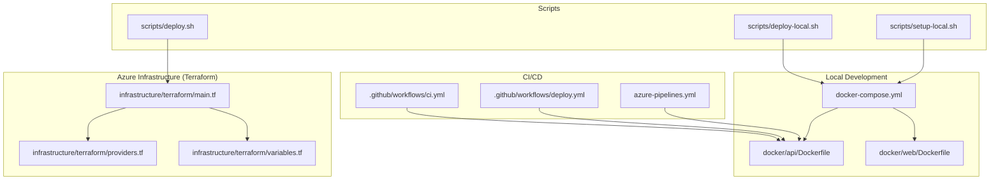
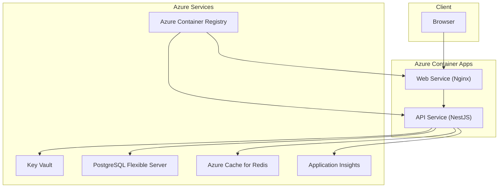
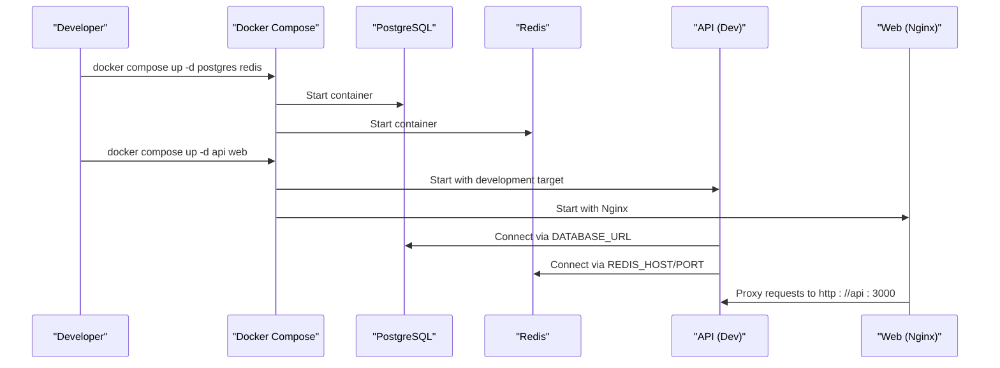
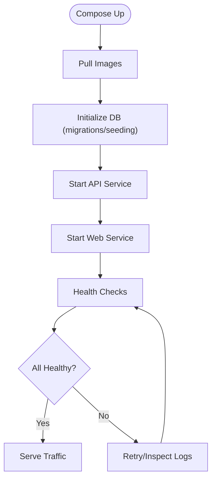
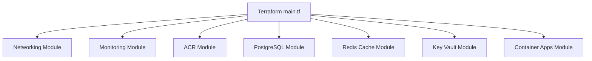
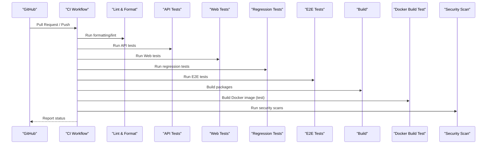
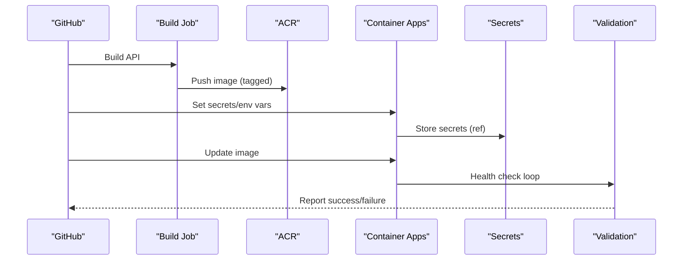
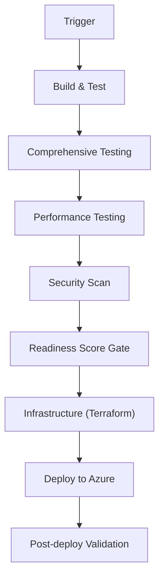
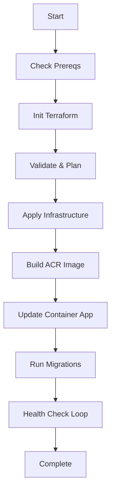
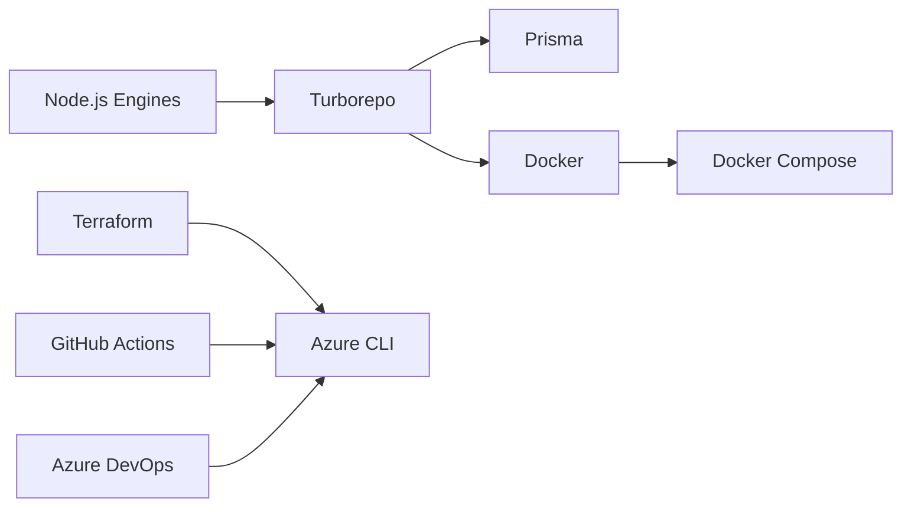

# Build & Deployment

<cite>
**Referenced Files in This Document**
- [docker-compose.yml](file://docker-compose.yml)
- [docker-compose.prod.yml](file://docker-compose.prod.yml)
- [docker/api/Dockerfile](file://docker/api/Dockerfile)
- [docker/web/Dockerfile](file://docker/web/Dockerfile)
- [scripts/deploy.sh](file://scripts/deploy.sh)
- [scripts/deploy-local.sh](file://scripts/deploy-local.sh)
- [scripts/setup-local.sh](file://scripts/setup-local.sh)
- [infrastructure/terraform/main.tf](file://infrastructure/terraform/main.tf)
- [infrastructure/terraform/providers.tf](file://infrastructure/terraform/providers.tf)
- [infrastructure/terraform/variables.tf](file://infrastructure/terraform/variables.tf)
- [.github/workflows/ci.yml](file://.github/workflows/ci.yml)
- [.github/workflows/deploy.yml](file://.github/workflows/deploy.yml)
- [azure-pipelines.yml](file://azure-pipelines.yml)
- [package.json](file://package.json)
</cite>

## Table of Contents
1. [Introduction](#introduction)
2. [Project Structure](#project-structure)
3. [Core Components](#core-components)
4. [Architecture Overview](#architecture-overview)
5. [Detailed Component Analysis](#detailed-component-analysis)
6. [Dependency Analysis](#dependency-analysis)
7. [Performance Considerations](#performance-considerations)
8. [Troubleshooting Guide](#troubleshooting-guide)
9. [Conclusion](#conclusion)
10. [Appendices](#appendices)

## Introduction
This document provides comprehensive build and deployment guidance for Quiz-to-Build across local development, staging, and production environments. It covers containerization with Docker, orchestration via Docker Compose, Azure cloud deployment using Terraform, CI/CD pipelines (GitHub Actions and Azure DevOps), environment variable and secrets management, security hardening, performance tuning, monitoring, and operational procedures including rollback and disaster recovery.

## Project Structure
The project follows a monorepo with a multi-application architecture:
- API backend built with NestJS
- Web frontend built with React/Vite
- Shared libraries and database layer
- Dockerized services for API and Web
- Terraform-managed Azure infrastructure
- CI/CD pipelines for automated testing and deployment

**Diagram sources**
- [docker-compose.yml:18-150](file://docker-compose.yml#L18-L150)
- [docker/api/Dockerfile:1-120](file://docker/api/Dockerfile#L1-L120)
- [docker/web/Dockerfile:1-85](file://docker/web/Dockerfile#L1-L85)
- [.github/workflows/ci.yml:1-541](file://.github/workflows/ci.yml#L1-L541)
- [.github/workflows/deploy.yml:1-285](file://.github/workflows/deploy.yml#L1-L285)
- [azure-pipelines.yml:1-908](file://azure-pipelines.yml#L1-L908)
- [infrastructure/terraform/main.tf:1-153](file://infrastructure/terraform/main.tf#L1-L153)
- [infrastructure/terraform/providers.tf:1-30](file://infrastructure/terraform/providers.tf#L1-L30)
- [infrastructure/terraform/variables.tf:1-178](file://infrastructure/terraform/variables.tf#L1-L178)
- [scripts/deploy.sh:1-206](file://scripts/deploy.sh#L1-L206)
- [scripts/deploy-local.sh:1-359](file://scripts/deploy-local.sh#L1-L359)
- [scripts/setup-local.sh:1-189](file://scripts/setup-local.sh#L1-L189)

**Section sources**
- [docker-compose.yml:18-150](file://docker-compose.yml#L18-L150)
- [docker/api/Dockerfile:1-120](file://docker/api/Dockerfile#L1-L120)
- [docker/web/Dockerfile:1-85](file://docker/web/Dockerfile#L1-L85)
- [infrastructure/terraform/main.tf:1-153](file://infrastructure/terraform/main.tf#L1-L153)
- [infrastructure/terraform/providers.tf:1-30](file://infrastructure/terraform/providers.tf#L1-L30)
- [infrastructure/terraform/variables.tf:1-178](file://infrastructure/terraform/variables.tf#L1-L178)
- [.github/workflows/ci.yml:1-541](file://.github/workflows/ci.yml#L1-L541)
- [.github/workflows/deploy.yml:1-285](file://.github/workflows/deploy.yml#L1-L285)
- [azure-pipelines.yml:1-908](file://azure-pipelines.yml#L1-L908)
- [scripts/deploy.sh:1-206](file://scripts/deploy.sh#L1-L206)
- [scripts/deploy-local.sh:1-359](file://scripts/deploy-local.sh#L1-L359)
- [scripts/setup-local.sh:1-189](file://scripts/setup-local.sh#L1-L189)

## Core Components
- Dockerized API and Web applications with multi-stage builds for production and development
- Docker Compose for local orchestration of API, PostgreSQL, and Redis
- Terraform modules for Azure networking, monitoring, ACR, PostgreSQL, Redis, Key Vault, and Container Apps
- CI/CD pipelines for automated linting, testing, security scanning, and deployment
- Scripts for local setup, local deployment, and cloud deployment

Key capabilities:
- Local development with hot reload for API and static serving for Web
- Production-grade container images with non-root users, health checks, and OCI labels
- Azure Container Apps deployment with managed secrets and environment variables
- Automated readiness gates and deployment validation

**Section sources**
- [docker/api/Dockerfile:68-120](file://docker/api/Dockerfile#L68-L120)
- [docker/web/Dockerfile:40-85](file://docker/web/Dockerfile#L40-L85)
- [docker-compose.yml:109-135](file://docker-compose.yml#L109-L135)
- [infrastructure/terraform/main.tf:108-152](file://infrastructure/terraform/main.tf#L108-L152)
- [.github/workflows/ci.yml:440-541](file://.github/workflows/ci.yml#L440-L541)
- [.github/workflows/deploy.yml:116-270](file://.github/workflows/deploy.yml#L116-L270)

## Architecture Overview
The system consists of:
- Frontend (React) served via Nginx in a container
- Backend (NestJS) containerized with health checks and non-root execution
- Shared infrastructure: PostgreSQL and Redis, provisioned via Terraform
- Secrets management via Azure Key Vault and Container Apps secrets
- Observability via Application Insights and container logs

**Diagram sources**
- [infrastructure/terraform/main.tf:108-152](file://infrastructure/terraform/main.tf#L108-L152)
- [docker/web/Dockerfile:40-85](file://docker/web/Dockerfile#L40-L85)
- [docker/api/Dockerfile:68-120](file://docker/api/Dockerfile#L68-L120)

## Detailed Component Analysis

### Local Development Environment
Local setup supports rapid iteration with Docker Compose:
- PostgreSQL 16 and Redis 7 containers
- API service with development target
- Web service with static asset serving
- Health checks and dependency ordering

**Diagram sources**
- [docker-compose.yml:18-150](file://docker-compose.yml#L18-L150)
- [docker/api/Dockerfile:38-66](file://docker/api/Dockerfile#L38-L66)
- [docker/web/Dockerfile:40-85](file://docker/web/Dockerfile#L40-L85)

Operational highlights:
- Health checks for Postgres and Redis
- Automatic dependency waits using service conditions
- Non-root users in production stages

**Section sources**
- [docker-compose.yml:18-150](file://docker-compose.yml#L18-L150)
- [docker/api/Dockerfile:38-120](file://docker/api/Dockerfile#L38-L120)
- [docker/web/Dockerfile:40-85](file://docker/web/Dockerfile#L40-L85)

### Production Deployment with Docker Compose
Production Compose focuses on hardened runtime:
- Non-root users and health checks
- Environment-driven configuration
- Redis with password enforcement
- API prefix and production-ready settings

**Diagram sources**
- [docker-compose.prod.yml:1-95](file://docker-compose.prod.yml#L1-L95)

**Section sources**
- [docker-compose.prod.yml:1-95](file://docker-compose.prod.yml#L1-L95)

### Azure Cloud Deployment with Terraform
Terraform provisions the entire stack:
- Resource group, virtual network, subnets
- PostgreSQL Flexible Server with HA and VNet options
- Azure Cache for Redis
- Azure Container Registry
- Azure Key Vault for secrets
- Azure Container Apps with CPU/memory limits and replica counts
- Application Insights for telemetry

**Diagram sources**
- [infrastructure/terraform/main.tf:1-153](file://infrastructure/terraform/main.tf#L1-153)

Key variables and defaults:
- PostgreSQL SKU, storage, version, HA, VNet integration
- Redis SKU, capacity, family
- Container CPU/memory, min/max replicas
- ACR SKU, web container toggles

**Section sources**
- [infrastructure/terraform/variables.tf:1-178](file://infrastructure/terraform/variables.tf#L1-L178)
- [infrastructure/terraform/providers.tf:1-30](file://infrastructure/terraform/providers.tf#L1-L30)
- [infrastructure/terraform/main.tf:1-153](file://infrastructure/terraform/main.tf#L1-L153)

### CI/CD Pipelines

#### GitHub Actions CI
The CI workflow enforces quality gates:
- Formatting and linting
- Unit tests for API, Web, and Regression suites
- E2E tests with Playwright
- Build verification for all packages
- Docker build test
- Security scanning (npm audit, Trivy, custom script)

**Diagram sources**
- [.github/workflows/ci.yml:1-541](file://.github/workflows/ci.yml#L1-L541)

#### GitHub Actions Deploy
The deployment workflow supports multiple environments:
- Build and push Docker images to ACR
- Set Container Apps secrets
- Configure environment variables
- Validate deployment via health checks
- Summarize deployment outcomes

**Diagram sources**
- [.github/workflows/deploy.yml:38-270](file://.github/workflows/deploy.yml#L38-L270)

#### Azure DevOps Pipeline
The Azure DevOps pipeline includes:
- Build and test stages
- Security scanning (GitLeaks, Detect-Secrets, npm audit, Snyk, Trivy, Semgrep)
- Readiness score gate (Quiz2Biz compliance)
- Infrastructure provisioning with Terraform plan/apply
- Deployment to Azure Container Apps with image signing and provenance

**Diagram sources**
- [azure-pipelines.yml:39-908](file://azure-pipelines.yml#L39-L908)

**Section sources**
- [.github/workflows/ci.yml:1-541](file://.github/workflows/ci.yml#L1-L541)
- [.github/workflows/deploy.yml:1-285](file://.github/workflows/deploy.yml#L1-L285)
- [azure-pipelines.yml:1-908](file://azure-pipelines.yml#L1-L908)

### Scripts for Deployment Operations

#### Cloud Deployment Script
Automates end-to-end cloud deployment:
- Prerequisite checks (Azure CLI, Terraform, login)
- Terraform initialization, validation, plan, apply
- ACR build and push
- Container App image update
- Database migrations via container exec
- Health checks and post-deployment diagnostics

**Diagram sources**
- [scripts/deploy.sh:1-206](file://scripts/deploy.sh#L1-L206)

**Section sources**
- [scripts/deploy.sh:1-206](file://scripts/deploy.sh#L1-L206)

#### Local Deployment Script
End-to-end local deployment:
- Prerequisite checks (Docker, Docker Compose, Node)
- Environment setup (.env)
- Dependency installation
- Infrastructure start (PostgreSQL, Redis)
- Database setup (generate, migrate, seed)
- Build and start API in development mode

**Section sources**
- [scripts/deploy-local.sh:1-359](file://scripts/deploy-local.sh#L1-L359)

#### Local Setup Script
Quick local setup:
- Stop existing containers
- Start PostgreSQL and Redis
- Health checks
- Build and start API
- Run migrations and optional seeding
- Health validation

**Section sources**
- [scripts/setup-local.sh:1-189](file://scripts/setup-local.sh#L1-L189)

### Containerization Details

#### API Dockerfile
- Multi-stage build: builder, development, production
- Security updates and OpenSSL for Prisma
- Prisma client generation
- Production image with non-root user, health checks, OCI labels
- Entrypoint script for startup

**Section sources**
- [docker/api/Dockerfile:1-120](file://docker/api/Dockerfile#L1-L120)

#### Web Dockerfile
- Multi-stage build: builder with Vite, production Nginx
- Build-time environment injection for OAuth and API
- Nginx template substitution for API upstream
- Non-root user, health checks, OCI labels

**Section sources**
- [docker/web/Dockerfile:1-85](file://docker/web/Dockerfile#L1-L85)

### Environment Variables and Secrets Management
- Local development: .env file with development defaults
- Production: environment variables via Docker Compose and Container Apps
- Secrets: stored in Azure Key Vault and referenced as Container Apps secrets
- Required secrets validated in GitHub Actions deploy workflow

Recommended practice:
- Store sensitive values in Key Vault and reference via secret references in Container Apps
- Use distinct secrets per environment
- Rotate regularly and enforce minimum lifetime policies

**Section sources**
- [docker-compose.prod.yml:49-57](file://docker-compose.prod.yml#L49-L57)
- [.github/workflows/deploy.yml:134-174](file://.github/workflows/deploy.yml#L134-L174)
- [infrastructure/terraform/main.tf:126-140](file://infrastructure/terraform/main.tf#L126-L140)

### Security Considerations
- Non-root users in production images
- Health checks for runtime verification
- Azure-managed secrets and encryption
- Security scanning in CI/CD
- Supply chain security with image signing and provenance (Azure DevOps)

**Section sources**
- [docker/api/Dockerfile:89-110](file://docker/api/Dockerfile#L89-L110)
- [docker/web/Dockerfile:57-74](file://docker/web/Dockerfile#L57-L74)
- [azure-pipelines.yml:745-850](file://azure-pipelines.yml#L745-L850)
- [.github/workflows/ci.yml:440-488](file://.github/workflows/ci.yml#L440-L488)

### Monitoring and Observability
- Application Insights configured via Terraform
- Container logs via Azure CLI
- Health endpoints for runtime checks
- Post-deployment diagnostics and revision inspection

**Section sources**
- [infrastructure/terraform/main.tf:35-44](file://infrastructure/terraform/main.tf#L35-L44)
- [scripts/deploy.sh:203-206](file://scripts/deploy.sh#L203-L206)

## Dependency Analysis
The build and deployment pipeline depends on:
- Node.js and npm versions aligned with engines
- Turborepo for monorepo builds
- Prisma for database tooling
- Docker and Docker Compose for local orchestration
- Azure CLI and Terraform for cloud provisioning
- GitHub Actions/Azure DevOps for CI/CD

**Diagram sources**
- [package.json:7-10](file://package.json#L7-L10)
- [package.json:16-67](file://package.json#L16-L67)
- [scripts/deploy.sh:25-50](file://scripts/deploy.sh#L25-L50)

**Section sources**
- [package.json:1-176](file://package.json#L1-L176)
- [scripts/deploy.sh:1-206](file://scripts/deploy.sh#L1-L206)

## Performance Considerations
- Use production Docker targets for optimized images
- Configure CPU/memory and replica counts via Terraform variables
- Enable high availability and VNet integration for PostgreSQL
- Monitor API latency and Web Vitals; adjust autoscaling thresholds
- Use caching and CDN for static assets

[No sources needed since this section provides general guidance]

## Troubleshooting Guide
Common issues and resolutions:
- Health checks failing: inspect container logs, verify secrets and environment variables, confirm database connectivity
- Terraform state mismatches: reconcile resource groups and state keys, reconfigure backend.tf
- Docker build failures: ensure Node version matches engines, verify .dockerignore exclusions
- CI/CD failures: review security scan results, address high/Critical findings, validate readiness score

**Section sources**
- [scripts/deploy.sh:172-186](file://scripts/deploy.sh#L172-L186)
- [scripts/setup-local.sh:140-167](file://scripts/setup-local.sh#L140-L167)
- [.github/workflows/ci.yml:440-541](file://.github/workflows/ci.yml#L440-L541)

## Conclusion
Quiz-to-Build provides a robust, repeatable, and secure deployment story across environments. The combination of Dockerized services, Terraform-managed Azure infrastructure, and comprehensive CI/CD pipelines ensures reliable releases with strong observability and security controls. Adopt the recommended practices for environment management, secrets handling, and operational procedures to maintain a high-performing and resilient platform.

[No sources needed since this section summarizes without analyzing specific files]

## Appendices

### Multi-Environment Strategy
- Local: Docker Compose for isolated development
- Staging: Azure DevOps pipeline with security gates and infrastructure plan/apply
- Production: GitHub Actions with environment-specific deployments and validation

**Section sources**
- [docker-compose.yml:18-150](file://docker-compose.yml#L18-L150)
- [azure-pipelines.yml:600-710](file://azure-pipelines.yml#L600-L710)
- [.github/workflows/deploy.yml:116-270](file://.github/workflows/deploy.yml#L116-L270)

### Rollback and Disaster Recovery
- Use Azure Container Apps revision history to roll back to previous revisions
- Maintain backups of PostgreSQL and Redis
- Store immutable artifacts and signed images in ACR
- Automate recovery steps via scripts and Terraform state

**Section sources**
- [scripts/deploy.sh:203-206](file://scripts/deploy.sh#L203-L206)
- [infrastructure/terraform/main.tf:108-152](file://infrastructure/terraform/main.tf#L108-L152)