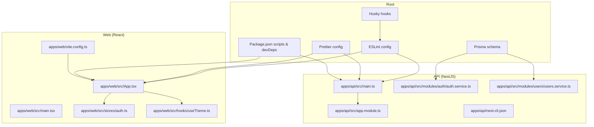
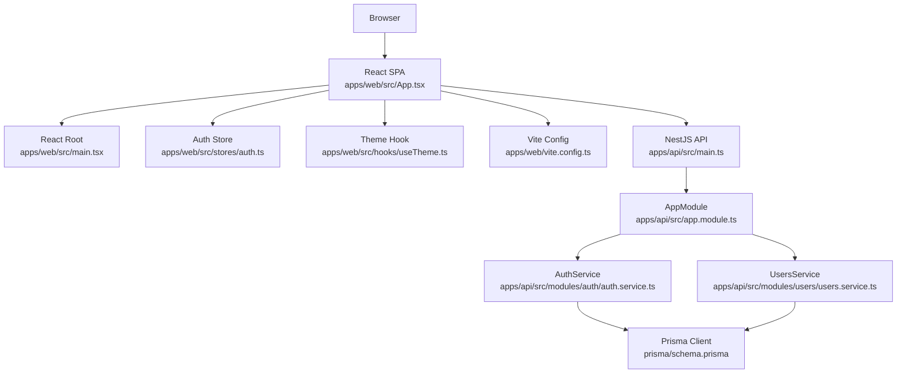
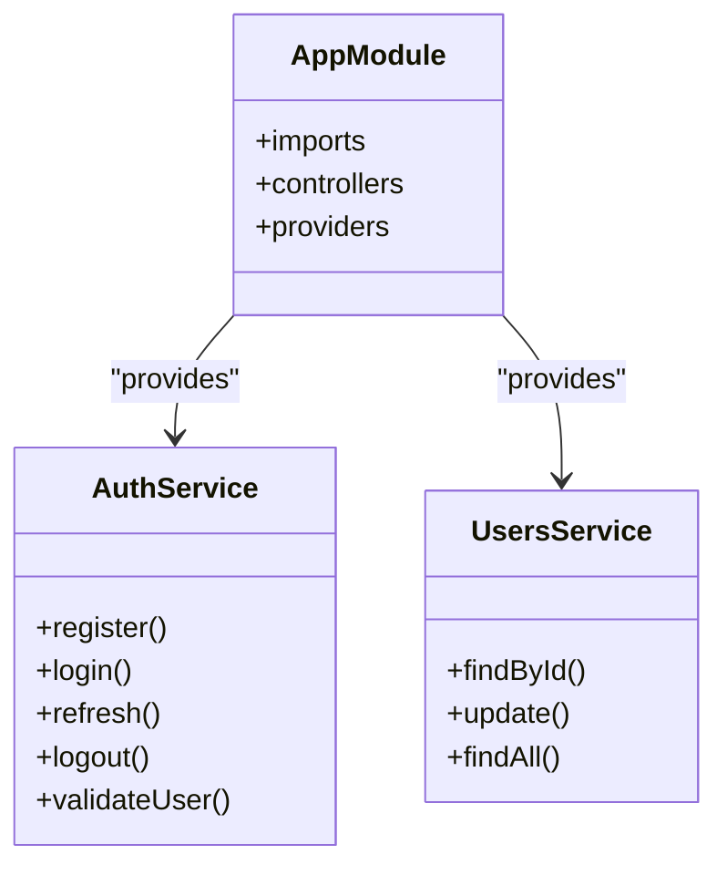
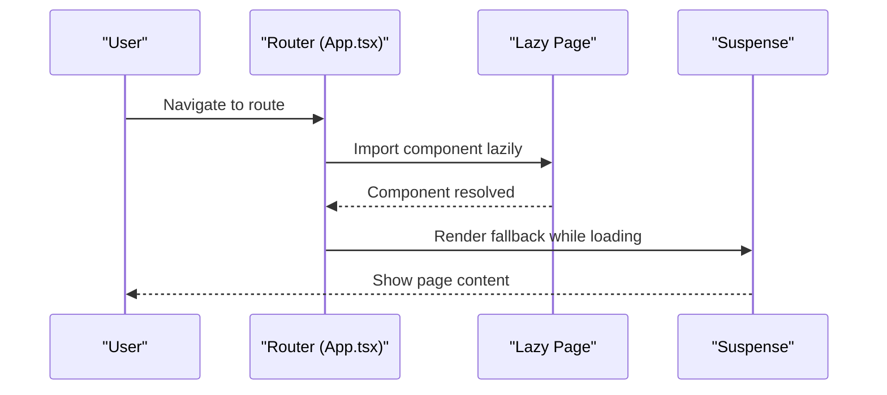
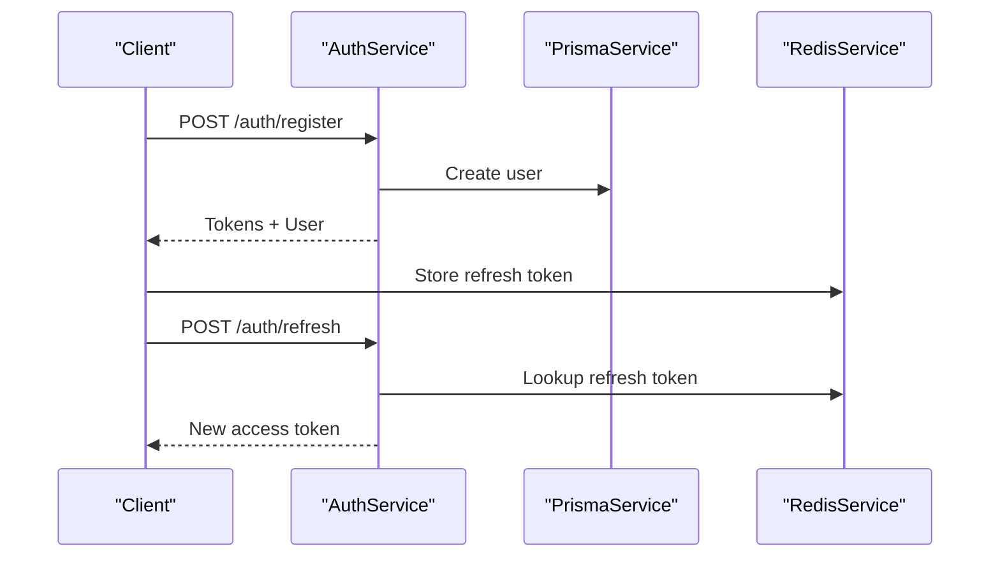
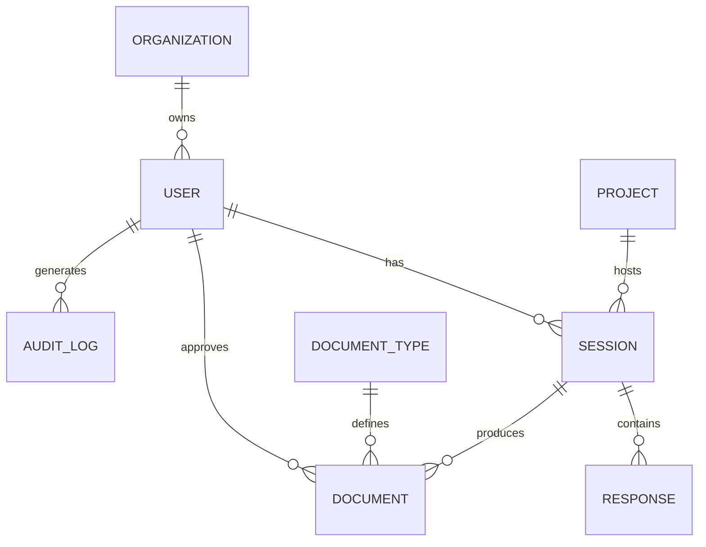
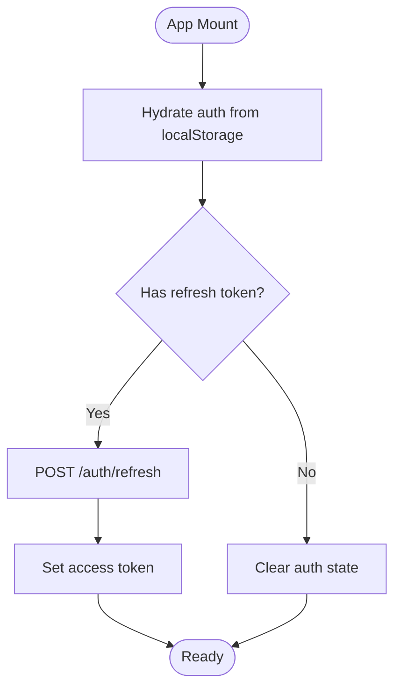
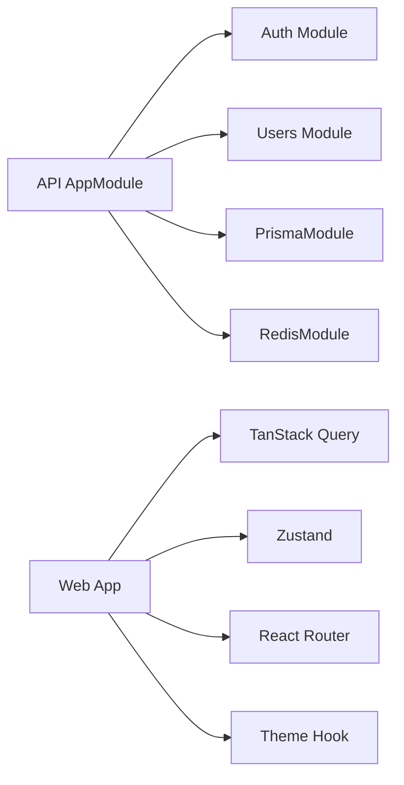

# Code Standards & Guidelines

<cite>
**Referenced Files in This Document**
- [eslint.config.mjs](file://eslint.config.mjs)
- [.prettierrc](file://.prettierrc)
- [package.json](file://package.json)
- [apps/api/src/main.ts](file://apps/api/src/main.ts)
- [apps/api/src/app.module.ts](file://apps/api/src/app.module.ts)
- [apps/api/src/modules/auth/auth.service.ts](file://apps/api/src/modules/auth/auth.service.ts)
- [apps/api/src/modules/users/users.service.ts](file://apps/api/src/modules/users/users.service.ts)
- [apps/api/nest-cli.json](file://apps/api/nest-cli.json)
- [apps/web/src/App.tsx](file://apps/web/src/App.tsx)
- [apps/web/src/main.tsx](file://apps/web/src/main.tsx)
- [apps/web/src/stores/auth.ts](file://apps/web/src/stores/auth.ts)
- [apps/web/src/hooks/useTheme.ts](file://apps/web/src/hooks/useTheme.ts)
- [apps/web/vite.config.ts](file://apps/web/vite.config.ts)
- [prisma/schema.prisma](file://prisma/schema.prisma)
</cite>

## Table of Contents
1. [Introduction](#introduction)
2. [Project Structure](#project-structure)
3. [Core Components](#core-components)
4. [Architecture Overview](#architecture-overview)
5. [Detailed Component Analysis](#detailed-component-analysis)
6. [Dependency Analysis](#dependency-analysis)
7. [Performance Considerations](#performance-considerations)
8. [Troubleshooting Guide](#troubleshooting-guide)
9. [Conclusion](#conclusion)
10. [Appendices](#appendices)

## Introduction
This document defines the code standards and guidelines for Quiz-to-Build contributors. It consolidates TypeScript coding conventions, NestJS architecture patterns, and React component guidelines. It also explains the shared tooling configuration for ESLint, Prettier, and Husky pre-commit hooks, along with naming conventions, architectural patterns (dependency injection, service layer design, component composition), API design principles, database modeling with Prisma, state management patterns, code review standards, documentation requirements, maintainability principles, performance practices, security standards, and accessibility guidelines.

## Project Structure
The project follows a monorepo layout with three primary applications:
- apps/api: NestJS backend with modular feature domains and shared libraries
- apps/web: React SPA with Vite, TanStack Query, and Zustand stores
- apps/cli: Command-line utilities (not covered in detail here)

Shared tooling and configuration live at the repository root, including ESLint, Prettier, Husky, and Prisma.

**Diagram sources**
- [apps/api/src/main.ts:1-329](file://apps/api/src/main.ts#L1-L329)
- [apps/api/src/app.module.ts:1-130](file://apps/api/src/app.module.ts#L1-L130)
- [apps/api/src/modules/auth/auth.service.ts:1-507](file://apps/api/src/modules/auth/auth.service.ts#L1-L507)
- [apps/api/src/modules/users/users.service.ts:1-203](file://apps/api/src/modules/users/users.service.ts#L1-L203)
- [apps/api/nest-cli.json:1-12](file://apps/api/nest-cli.json#L1-L12)
- [apps/web/src/App.tsx:1-284](file://apps/web/src/App.tsx#L1-L284)
- [apps/web/src/main.tsx:1-23](file://apps/web/src/main.tsx#L1-L23)
- [apps/web/src/stores/auth.ts:1-173](file://apps/web/src/stores/auth.ts#L1-L173)
- [apps/web/src/hooks/useTheme.ts:1-129](file://apps/web/src/hooks/useTheme.ts#L1-L129)
- [apps/web/vite.config.ts:1-19](file://apps/web/vite.config.ts#L1-L19)
- [prisma/schema.prisma:1-1112](file://prisma/schema.prisma#L1-L1112)
- [eslint.config.mjs:1-157](file://eslint.config.mjs#L1-L157)
- [.prettierrc:1-11](file://.prettierrc#L1-L11)
- [package.json:1-176](file://package.json#L1-L176)

**Section sources**
- [apps/api/src/main.ts:1-329](file://apps/api/src/main.ts#L1-L329)
- [apps/api/src/app.module.ts:1-130](file://apps/api/src/app.module.ts#L1-L130)
- [apps/web/src/App.tsx:1-284](file://apps/web/src/App.tsx#L1-L284)
- [apps/web/src/main.tsx:1-23](file://apps/web/src/main.tsx#L1-L23)
- [prisma/schema.prisma:1-1112](file://prisma/schema.prisma#L1-L1112)
- [eslint.config.mjs:1-157](file://eslint.config.mjs#L1-L157)
- [.prettierrc:1-11](file://.prettierrc#L1-L11)
- [package.json:1-176](file://package.json#L1-L176)

## Core Components
This section outlines the foundational standards that apply across the entire codebase.

- TypeScript coding conventions
  - Enforced via ESLint with TypeScript-specific rules and Prettier integration
  - Naming convention enforcement for interfaces, classes, enums, variables, functions, methods, and parameters
  - Complexity and cognitive complexity limits to improve readability and maintainability
  - Strictness rules for promises, unsafe assignments, and unused variables with environment-specific relaxations

- Formatting and linting
  - Prettier configuration for consistent code style across the monorepo
  - ESLint flat config with shared rules for API, CLI, and test contexts
  - Husky and lint-staged configured to auto-format and fix on commit

- NestJS architecture patterns
  - Central AppModule aggregates feature modules and global guards/interceptors
  - Services encapsulate business logic with dependency injection
  - Guards, interceptors, filters, and pipes applied globally for consistent cross-cutting concerns
  - Feature-flagged modules for legacy components

- React component guidelines
  - Code-splitting with React.lazy and Suspense for route-level chunks
  - TanStack Query for caching, retries, and invalidation
  - Zustand stores with localStorage persistence and hydration
  - Hooks for theme management and accessibility

- Database modeling with Prisma
  - Strongly typed models with enums, relations, indexes, and mapped names
  - JSON fields for flexible configuration and metadata
  - Explicit indexing strategy for performance

**Section sources**
- [eslint.config.mjs:1-157](file://eslint.config.mjs#L1-L157)
- [.prettierrc:1-11](file://.prettierrc#L1-L11)
- [package.json:118-126](file://package.json#L118-L126)
- [apps/api/src/app.module.ts:1-130](file://apps/api/src/app.module.ts#L1-L130)
- [apps/api/src/main.ts:1-329](file://apps/api/src/main.ts#L1-L329)
- [apps/web/src/App.tsx:1-284](file://apps/web/src/App.tsx#L1-L284)
- [apps/web/src/stores/auth.ts:1-173](file://apps/web/src/stores/auth.ts#L1-L173)
- [apps/web/src/hooks/useTheme.ts:1-129](file://apps/web/src/hooks/useTheme.ts#L1-L129)
- [prisma/schema.prisma:1-1112](file://prisma/schema.prisma#L1-L1112)

## Architecture Overview
The system comprises a NestJS API server and a React SPA. The API enforces global guards, interceptors, and pipes, while the Web app manages authentication state, navigation, and UI composition.

**Diagram sources**
- [apps/web/src/App.tsx:1-284](file://apps/web/src/App.tsx#L1-L284)
- [apps/web/src/main.tsx:1-23](file://apps/web/src/main.tsx#L1-L23)
- [apps/web/src/stores/auth.ts:1-173](file://apps/web/src/stores/auth.ts#L1-L173)
- [apps/web/src/hooks/useTheme.ts:1-129](file://apps/web/src/hooks/useTheme.ts#L1-L129)
- [apps/web/vite.config.ts:1-19](file://apps/web/vite.config.ts#L1-L19)
- [apps/api/src/main.ts:1-329](file://apps/api/src/main.ts#L1-L329)
- [apps/api/src/app.module.ts:1-130](file://apps/api/src/app.module.ts#L1-L130)
- [apps/api/src/modules/auth/auth.service.ts:1-507](file://apps/api/src/modules/auth/auth.service.ts#L1-L507)
- [apps/api/src/modules/users/users.service.ts:1-203](file://apps/api/src/modules/users/users.service.ts#L1-L203)
- [prisma/schema.prisma:1-1112](file://prisma/schema.prisma#L1-L1112)

## Detailed Component Analysis

### TypeScript Coding Conventions
- Naming conventions enforced by ESLint:
  - Interfaces, type aliases, and classes in PascalCase
  - Enums uppercase with members uppercase
  - Variables and functions camelCase; parameters allow leading underscore
- Complexity limits:
  - Cyclomatic complexity capped at 15
  - Maximum nesting depth 4
  - Function length limit 75 lines (with test-specific exceptions)
  - Maximum parameters 4
- Type safety and safety rules:
  - Promises enforced strictness with warnings for unsafe patterns
  - Console usage restricted to warnings; debugger errors
  - Unused variables allowed with underscore prefix
- Environment-specific rule sets:
  - Tests, seeds, config files, and API modules have tailored relaxations

**Section sources**
- [eslint.config.mjs:83-95](file://eslint.config.mjs#L83-L95)
- [eslint.config.mjs:77-82](file://eslint.config.mjs#L77-L82)
- [eslint.config.mjs:99-114](file://eslint.config.mjs#L99-L114)
- [eslint.config.mjs:116-123](file://eslint.config.mjs#L116-L123)
- [eslint.config.mjs:125-138](file://eslint.config.mjs#L125-L138)
- [eslint.config.mjs:140-147](file://eslint.config.mjs#L140-L147)
- [eslint.config.mjs:149-156](file://eslint.config.mjs#L149-L156)

### NestJS Architecture Patterns
- Dependency Injection and Modules
  - AppModule aggregates feature modules and provides global guards/interceptors
  - Feature modules encapsulate domain logic; services injected via constructor DI
- Global Middleware and Pipes
  - Helmet, compression, CORS, body size limits, and structured logging applied at bootstrap
  - ValidationPipe enabled globally with whitelisting and transformation
- Guards, Interceptors, Filters
  - Global throttling guard, CSRF guard, transform interceptor, and logging interceptor
- Feature-flagged modules
  - Legacy modules conditionally loaded via environment variable

**Diagram sources**
- [apps/api/src/app.module.ts:1-130](file://apps/api/src/app.module.ts#L1-L130)
- [apps/api/src/modules/auth/auth.service.ts:1-507](file://apps/api/src/modules/auth/auth.service.ts#L1-L507)
- [apps/api/src/modules/users/users.service.ts:1-203](file://apps/api/src/modules/users/users.service.ts#L1-L203)

**Section sources**
- [apps/api/src/app.module.ts:1-130](file://apps/api/src/app.module.ts#L1-L130)
- [apps/api/src/main.ts:1-329](file://apps/api/src/main.ts#L1-L329)
- [apps/api/src/modules/auth/auth.service.ts:1-507](file://apps/api/src/modules/auth/auth.service.ts#L1-L507)
- [apps/api/src/modules/users/users.service.ts:1-203](file://apps/api/src/modules/users/users.service.ts#L1-L203)

### React Component Guidelines
- Routing and Composition
  - Route-level lazy loading with Suspense fallback
  - Layout wrappers and protected/public route guards
- State Management
  - Zustand stores with localStorage persistence and hydration
  - Token synchronization strategy with retry mechanism
- UI and Theming
  - Theme hook supports system preference and manual toggling
  - Tailwind-based dark mode application to document root
- Performance
  - Vite chunk splitting for vendor bundles

**Diagram sources**
- [apps/web/src/App.tsx:23-136](file://apps/web/src/App.tsx#L23-L136)

**Section sources**
- [apps/web/src/App.tsx:1-284](file://apps/web/src/App.tsx#L1-L284)
- [apps/web/src/main.tsx:1-23](file://apps/web/src/main.tsx#L1-L23)
- [apps/web/src/stores/auth.ts:1-173](file://apps/web/src/stores/auth.ts#L1-L173)
- [apps/web/src/hooks/useTheme.ts:1-129](file://apps/web/src/hooks/useTheme.ts#L1-L129)
- [apps/web/vite.config.ts:1-19](file://apps/web/vite.config.ts#L1-L19)

### API Design Principles
- Authentication and Authorization
  - JWT-based access tokens; refresh tokens persisted in Redis and DB
  - MFA fields and OAuth account integrations
- Input Validation and Security
  - Global ValidationPipe with transformation
  - Helmet CSP, HSTS, permissions policy, and CORS configuration
  - Body size limits and compression with streaming endpoint awareness
- OpenAPI Documentation
  - Swagger UI gated by environment variable with bearer auth and tags

**Diagram sources**
- [apps/api/src/modules/auth/auth.service.ts:64-102](file://apps/api/src/modules/auth/auth.service.ts#L64-L102)
- [apps/api/src/modules/auth/auth.service.ts:147-177](file://apps/api/src/modules/auth/auth.service.ts#L147-L177)

**Section sources**
- [apps/api/src/main.ts:1-329](file://apps/api/src/main.ts#L1-L329)
- [apps/api/src/modules/auth/auth.service.ts:1-507](file://apps/api/src/modules/auth/auth.service.ts#L1-L507)

### Database Modeling with Prisma
- Enumerations and relations
  - Rich enums for roles, question types, session status, and more
  - Strong relations between entities with foreign keys and cascading rules
- Indexing and performance
  - Explicit indexes on frequently queried columns
- JSON fields
  - Flexible configuration and metadata storage
- Mapped names
  - Consistent mapping between Prisma models and SQL tables

**Diagram sources**
- [prisma/schema.prisma:154-286](file://prisma/schema.prisma#L154-L286)
- [prisma/schema.prisma:512-560](file://prisma/schema.prisma#L512-L560)
- [prisma/schema.prisma:744-774](file://prisma/schema.prisma#L744-L774)
- [prisma/schema.prisma:204-243](file://prisma/schema.prisma#L204-L243)
- [prisma/schema.prisma:154-170](file://prisma/schema.prisma#L154-L170)

**Section sources**
- [prisma/schema.prisma:1-1112](file://prisma/schema.prisma#L1-L1112)

### State Management Patterns
- React Query
  - Centralized caching with retry, stale time, and refetch behavior
- Zustand
  - Auth store with localStorage persistence and hydration
  - Token synchronization with retry and fallback mechanisms
- Theme management
  - useTheme hook with system preference detection and DOM class toggling

**Diagram sources**
- [apps/web/src/stores/auth.ts:150-169](file://apps/web/src/stores/auth.ts#L150-L169)

**Section sources**
- [apps/web/src/stores/auth.ts:1-173](file://apps/web/src/stores/auth.ts#L1-L173)
- [apps/web/src/hooks/useTheme.ts:1-129](file://apps/web/src/hooks/useTheme.ts#L1-L129)

### Naming Conventions
- TypeScript
  - Interfaces, classes, type aliases: PascalCase
  - Enums: PascalCase; enum members: UPPER_CASE
  - Variables, functions, methods: camelCase; parameters may start with underscore
- Files
  - Feature folders: kebab-case
  - DTOs: <Feature>.dto.ts
  - Services: <Feature>.service.ts
  - Controllers: <Feature>.controller.ts
  - Modules: <Feature>.module.ts
- NestJS
  - Guards: <Feature>.guard.ts
  - Interceptors: <Feature>.interceptor.ts
  - Filters: <Feature>.filter.ts
  - Pipes: <Feature>.pipe.ts
- React
  - Components: PascalCase
  - Hooks: useXxx
  - Stores: kebab-case with suffix .store.ts (e.g., auth.store.ts)
  - Pages: kebab-case with suffix .page.tsx
  - Utilities: kebab-case with suffix .utils.ts

**Section sources**
- [eslint.config.mjs:83-95](file://eslint.config.mjs#L83-L95)
- [apps/api/src/app.module.ts:1-130](file://apps/api/src/app.module.ts#L1-L130)
- [apps/web/src/App.tsx:1-284](file://apps/web/src/App.tsx#L1-L284)

### Code Review Standards
- Lint and format
  - All commits must pass ESLint and Prettier checks via Husky and lint-staged
- Test coverage
  - Maintain coverage thresholds; add tests for new features and bug fixes
- Security
  - Avoid exposing secrets; use environment variables and secret managers
  - Validate and sanitize inputs; enforce global ValidationPipe
- Documentation
  - Update API docs when endpoints change; keep Prisma schema comments up to date
- Maintainability
  - Prefer small, focused PRs; avoid feature flags long-term
  - Keep complexity within limits; refactor large functions

**Section sources**
- [package.json:118-126](file://package.json#L118-L126)
- [eslint.config.mjs:1-157](file://eslint.config.mjs#L1-L157)

### Documentation Requirements
- API documentation
  - Swagger UI available when enabled; keep descriptions accurate
- Database schema
  - Update Prisma schema and run migrations; add comments for clarity
- Component documentation
  - JSDoc for complex functions and exported types
- Architecture decisions
  - ADRs in docs/adr for significant decisions

**Section sources**
- [apps/api/src/main.ts:214-298](file://apps/api/src/main.ts#L214-L298)
- [prisma/schema.prisma:1-1112](file://prisma/schema.prisma#L1-L1112)

### Maintainability Principles
- Cohesion and separation of concerns
  - Services encapsulate business logic; controllers orchestrate
- Dependency inversion
  - Inject dependencies via constructors; avoid tight coupling
- Configuration-driven behavior
  - Use environment variables and feature flags for optional features
- Observability
  - Structured logging, telemetry, and error reporting

**Section sources**
- [apps/api/src/app.module.ts:1-130](file://apps/api/src/app.module.ts#L1-L130)
- [apps/api/src/main.ts:1-329](file://apps/api/src/main.ts#L1-L329)

## Dependency Analysis
The API depends on shared libraries for database and cache, while the Web app depends on UI libraries and state management.

**Diagram sources**
- [apps/api/src/app.module.ts:8-116](file://apps/api/src/app.module.ts#L8-L116)
- [apps/web/src/App.tsx:1-284](file://apps/web/src/App.tsx#L1-L284)
- [apps/web/src/stores/auth.ts:1-173](file://apps/web/src/stores/auth.ts#L1-L173)
- [apps/web/src/hooks/useTheme.ts:1-129](file://apps/web/src/hooks/useTheme.ts#L1-L129)

**Section sources**
- [apps/api/src/app.module.ts:1-130](file://apps/api/src/app.module.ts#L1-L130)
- [apps/web/src/App.tsx:1-284](file://apps/web/src/App.tsx#L1-L284)

## Performance Considerations
- API
  - Compression with streaming endpoint awareness
  - Global ValidationPipe reduces error handling overhead
  - Rate limiting via ThrottlerModule
- Web
  - Vite manual chunking for vendor libraries
  - React.lazy and Suspense for route-level code splitting
  - TanStack Query caching and retry strategies
- Database
  - Indexed columns for frequent queries
  - Efficient Prisma queries with selective includes

**Section sources**
- [apps/api/src/main.ts:43-67](file://apps/api/src/main.ts#L43-L67)
- [apps/api/src/app.module.ts:68-85](file://apps/api/src/app.module.ts#L68-L85)
- [apps/web/vite.config.ts:8-17](file://apps/web/vite.config.ts#L8-L17)
- [apps/web/src/App.tsx:138-147](file://apps/web/src/App.tsx#L138-L147)
- [prisma/schema.prisma:1-1112](file://prisma/schema.prisma#L1-L1112)

## Troubleshooting Guide
- Lint/format failures
  - Run lint and format scripts; ensure Husky hooks are installed
- Authentication issues
  - Verify refresh token storage and expiration; check Redis connectivity
- Database connectivity
  - Confirm Prisma client generation and migrations
- React hydration problems
  - Check Zustand persistence and localStorage availability

**Section sources**
- [package.json:45-48](file://package.json#L45-L48)
- [package.json:66-66](file://package.json#L66-L66)
- [apps/api/src/modules/auth/auth.service.ts:147-183](file://apps/api/src/modules/auth/auth.service.ts#L147-L183)
- [apps/web/src/stores/auth.ts:150-169](file://apps/web/src/stores/auth.ts#L150-L169)

## Conclusion
These standards unify development practices across the monorepo, ensuring consistent code quality, security, performance, and maintainability. Contributors should align their work with the established conventions, tooling, and architectural patterns described herein.

## Appendices

### Tooling Configuration Summary
- ESLint
  - Flat config with TypeScript recommended, type-checked configs, and Prettier integration
  - Environment-specific rule sets for tests, seeds, and API modules
- Prettier
  - Single quote, trailing comma, print width 100, tab width 2, semicolons, spacing, arrow parens, LF endings
- Husky + lint-staged
  - Auto-fix TypeScript/JS and format JSON/Markdown on commit

**Section sources**
- [eslint.config.mjs:1-157](file://eslint.config.mjs#L1-L157)
- [.prettierrc:1-11](file://.prettierrc#L1-L11)
- [package.json:118-126](file://package.json#L118-L126)