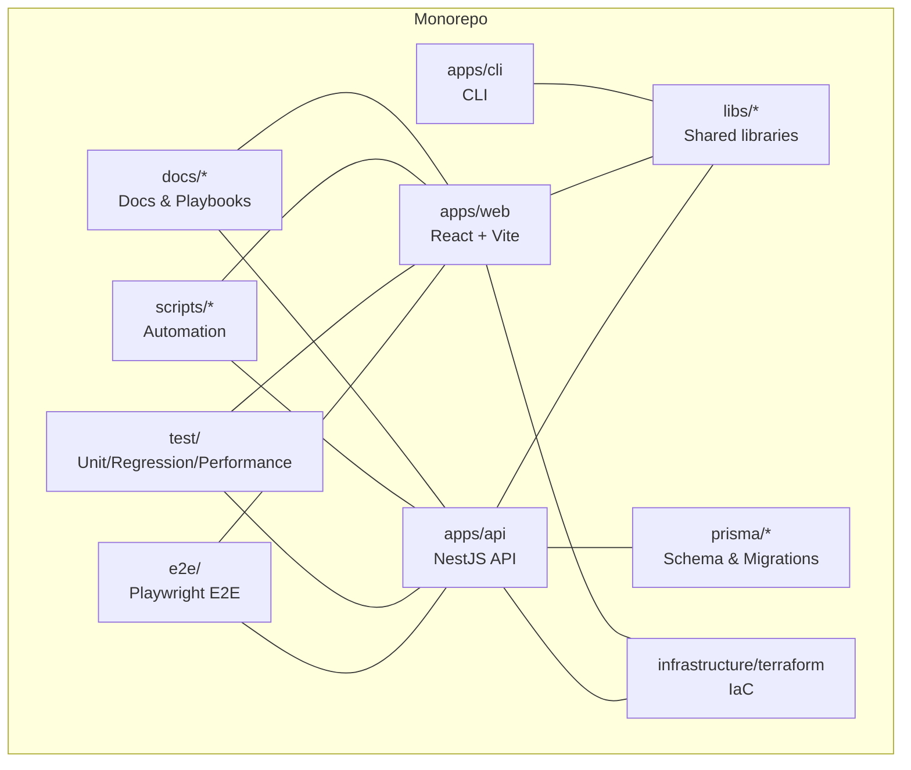
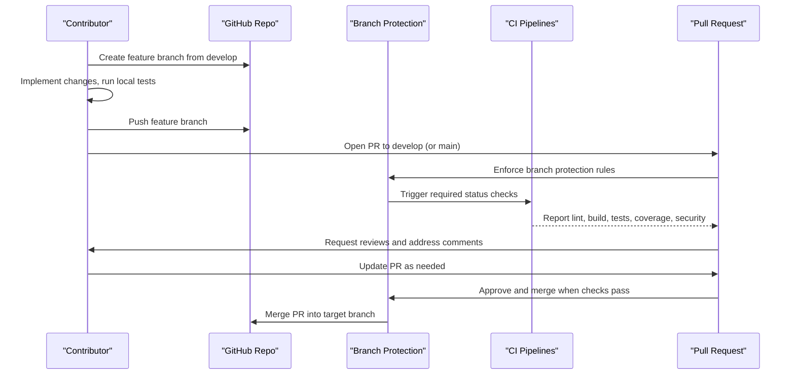
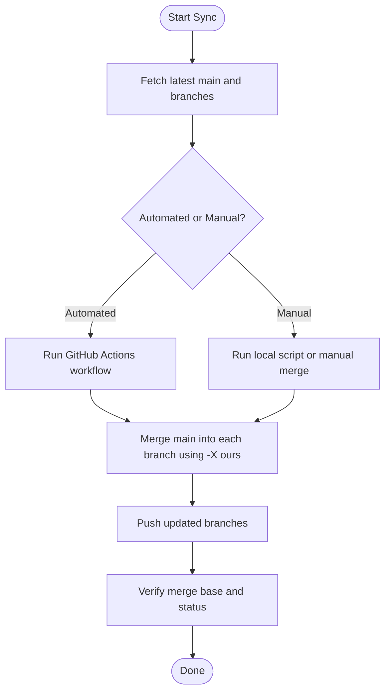
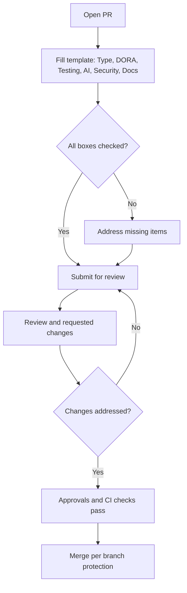
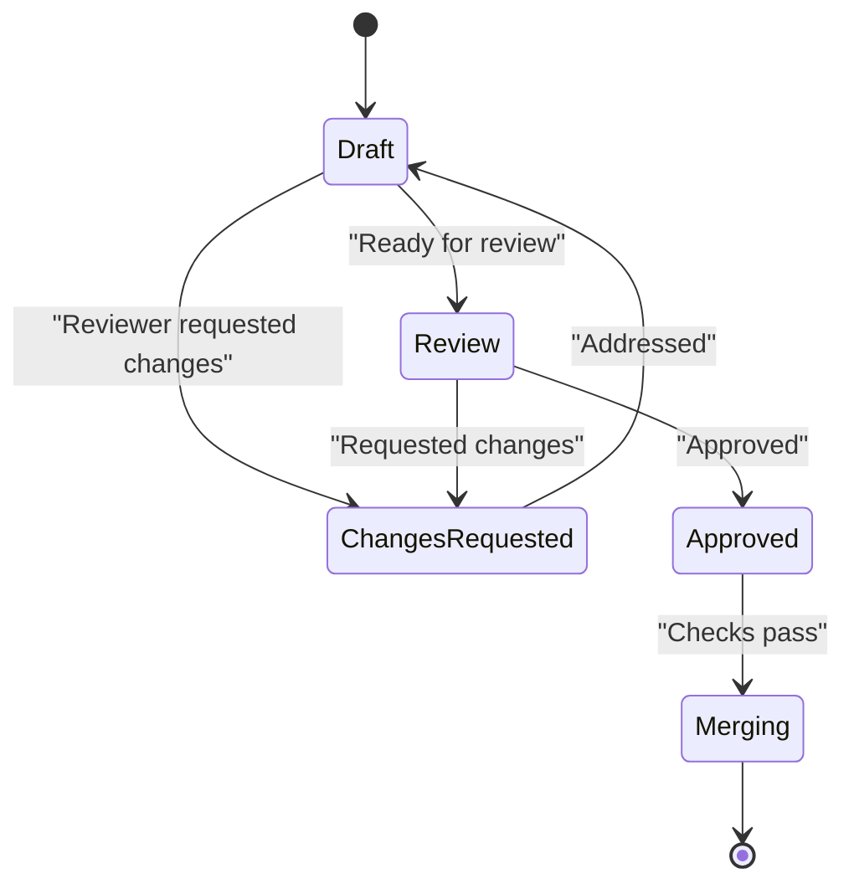
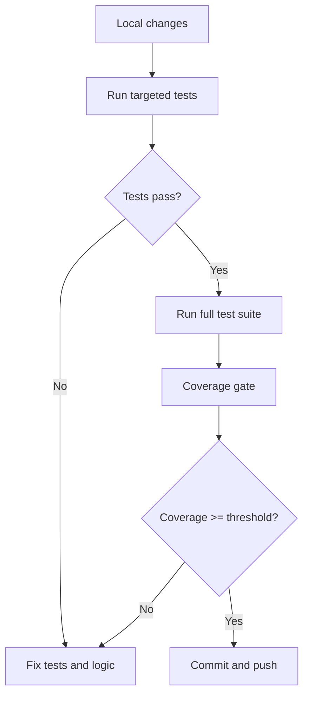
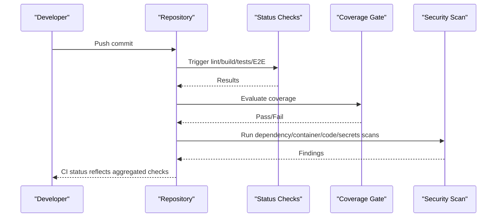
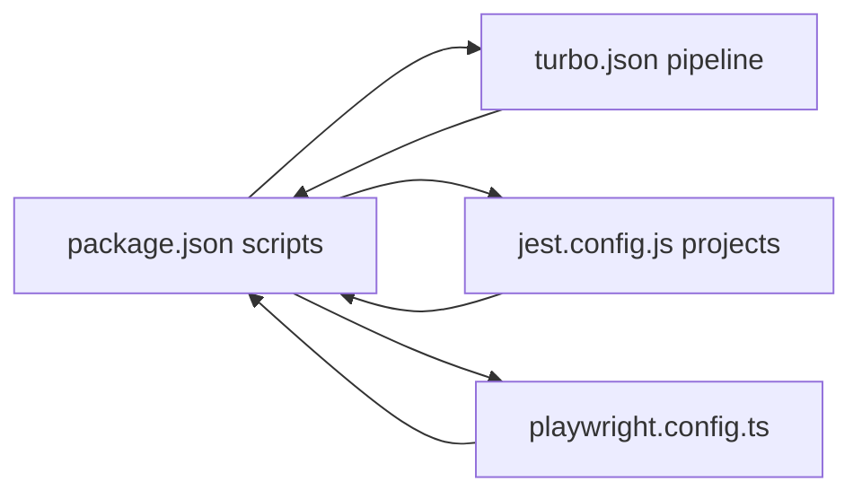

# Contribution Workflows

<cite>
**Referenced Files in This Document**
- [pull_request_template.md](file://.github/pull_request_template.md)
- [copilot-instructions.md](file://.github/copilot-instructions.md)
- [BRANCH-PROTECTION-SETUP.md](file://docs/BRANCH-PROTECTION-SETUP.md)
- [BRANCH-PROTECTION-CHECKLIST.md](file://docs/BRANCH-PROTECTION-CHECKLIST.md)
- [BRANCH-SYNC-GUIDE.md](file://BRANCH-SYNC-GUIDE.md)
- [package.json](file://package.json)
- [turbo.json](file://turbo.json)
- [jest.config.js](file://jest.config.js)
- [playwright.config.ts](file://playwright.config.ts)
- [.github/dependabot.yml](file://.github/dependabot.yml)
</cite>

## Table of Contents
1. [Introduction](#introduction)
2. [Project Structure](#project-structure)
3. [Core Components](#core-components)
4. [Architecture Overview](#architecture-overview)
5. [Detailed Component Analysis](#detailed-component-analysis)
6. [Dependency Analysis](#dependency-analysis)
7. [Performance Considerations](#performance-considerations)
8. [Troubleshooting Guide](#troubleshooting-guide)
9. [Conclusion](#conclusion)
10. [Appendices](#appendices)

## Introduction
This document defines the complete contribution workflow for Quiz-to-Build contributors. It covers the development lifecycle from issue creation to merge approval, including branching strategies, commit message conventions, pull request guidelines, code review expectations, automated testing requirements, and CI/CD pipeline expectations. It also outlines feature development, bug fixes, documentation contributions, phased development approach, milestone tracking, roadmap alignment, code quality standards, testing requirements, performance benchmarks, conflict resolution, peer review processes, and maintainer responsibilities.

## Project Structure
Quiz-to-Build is a monorepo organized with npm workspaces and Turbo. The repository includes:
- Backend API (NestJS) in apps/api
- Web application (React + Vite) in apps/web
- CLI application in apps/cli
- Shared libraries in libs/*
- Prisma schema and migrations in prisma/*
- Infrastructure as code in infrastructure/terraform
- E2E tests in e2e/
- Testing frameworks and configurations in test/, performance tests in test/performance
- Documentation and operational playbooks in docs/

**Diagram sources**
- [package.json:11-14](file://package.json#L11-L14)
- [turbo.json:6-64](file://turbo.json#L6-L64)

**Section sources**
- [package.json:11-14](file://package.json#L11-L14)
- [turbo.json:6-64](file://turbo.json#L6-L64)

## Core Components
- Development lifecycle: Issue → Feature Branch → Pull Request → Review → CI Checks → Merge
- Branching model: develop (integration) and main (release/stable) with strict branch protection
- Pull Request requirements: type classification, DORA metrics, testing, security, documentation, and reviewer notes
- CI/CD expectations: lint, build, unit/integration tests, E2E tests, coverage gate, security scans, and optional deployment checks
- Quality gates: code coverage threshold, static analysis, type checking, and security scanning
- Automation: Dependabot for dependency updates, Husky lint-staged hooks, and Turbo pipelines

**Section sources**
- [pull_request_template.md:1-73](file://.github/pull_request_template.md#L1-L73)
- [BRANCH-PROTECTION-SETUP.md:67-118](file://docs/BRANCH-PROTECTION-SETUP.md#L67-L118)
- [BRANCH-PROTECTION-SETUP.md:132-165](file://docs/BRANCH-PROTECTION-SETUP.md#L132-L165)
- [copilot-instructions.md:1-33](file://.github/copilot-instructions.md#L1-L33)
- [package.json:15-66](file://package.json#L15-L66)
- [turbo.json:6-64](file://turbo.json#L6-L64)

## Architecture Overview
The contribution workflow integrates local development, automated checks, and branch protection enforcement.

**Diagram sources**
- [BRANCH-PROTECTION-SETUP.md:67-118](file://docs/BRANCH-PROTECTION-SETUP.md#L67-L118)
- [BRANCH-PROTECTION-SETUP.md:138-147](file://docs/BRANCH-PROTECTION-SETUP.md#L138-L147)
- [pull_request_template.md:16-52](file://.github/pull_request_template.md#L16-L52)

## Detailed Component Analysis

### Branching Strategy and Sync
- Use develop as the integration branch and main as the release/stable branch.
- Branch protection enforces PR requirements and status checks for both branches.
- Branch synchronization keeps feature branches up to date with main to reduce conflicts.
- The repository uses a merge strategy preferring branch content (-X ours) and allows unrelated histories for shallow/grafted history scenarios.

**Diagram sources**
- [BRANCH-SYNC-GUIDE.md:26-82](file://BRANCH-SYNC-GUIDE.md#L26-L82)
- [BRANCH-SYNC-GUIDE.md:86-101](file://BRANCH-SYNC-GUIDE.md#L86-L101)

**Section sources**
- [BRANCH-PROTECTION-SETUP.md:67-118](file://docs/BRANCH-PROTECTION-SETUP.md#L67-L118)
- [BRANCH-PROTECTION-SETUP.md:138-147](file://docs/BRANCH-PROTECTION-SETUP.md#L138-L147)
- [BRANCH-SYNC-GUIDE.md:24-82](file://BRANCH-SYNC-GUIDE.md#L24-L82)
- [BRANCH-SYNC-GUIDE.md:86-101](file://BRANCH-SYNC-GUIDE.md#L86-L101)

### Pull Request Guidelines and Template
- Classification: bug fix, feature, breaking change, documentation, refactoring, performance.
- DORA metrics: prefer small PRs (<200 lines, opt) with acceptable range up to 300 lines.
- Testing: unit, integration, E2E, and manual testing checkboxes.
- AI-generated code verification: disclosure, review, static analysis, type checking, coverage.
- Security checklist: secrets, SQL injection, input validation, sensitive logs.
- Documentation: self-documenting code, JSDoc/comments, README updates.
- Reviewer notes: lead time targets and rework rate guidance.

**Diagram sources**
- [pull_request_template.md:1-73](file://.github/pull_request_template.md#L1-L73)

**Section sources**
- [pull_request_template.md:1-73](file://.github/pull_request_template.md#L1-L73)

### Code Review Process
- Minimum approvals: 2 for main, 1 for develop.
- Stale review dismissal: enabled for main, relaxed for develop.
- Conversation resolution required before merge.
- Code owners review required for main.
- Administrators can bypass protections on main; relaxed for develop.

**Diagram sources**
- [BRANCH-PROTECTION-SETUP.md:67-118](file://docs/BRANCH-PROTECTION-SETUP.md#L67-L118)
- [BRANCH-PROTECTION-SETUP.md:138-165](file://docs/BRANCH-PROTECTION-SETUP.md#L138-L165)

**Section sources**
- [BRANCH-PROTECTION-SETUP.md:67-118](file://docs/BRANCH-PROTECTION-SETUP.md#L67-L118)
- [BRANCH-PROTECTION-SETUP.md:138-165](file://docs/BRANCH-PROTECTION-SETUP.md#L138-L165)

### Automated Testing Requirements
- Unit and integration tests via Jest (root config aggregates projects).
- E2E tests via Playwright (parallel, reporters, device targets).
- Regression and performance tests in dedicated suites.
- Coverage thresholds enforced by coverage-gate workflow.
- Scripts for targeted runs and framework execution.

**Diagram sources**
- [jest.config.js:11-17](file://jest.config.js#L11-L17)
- [playwright.config.ts:27-31](file://playwright.config.ts#L27-L31)
- [package.json:21-44](file://package.json#L21-L44)

**Section sources**
- [jest.config.js:11-17](file://jest.config.js#L11-L17)
- [playwright.config.ts:27-31](file://playwright.config.ts#L27-L31)
- [package.json:21-44](file://package.json#L21-L44)

### CI/CD Pipeline Expectations
- Required status checks include lint, build, API/web tests, E2E, Docker build test, coverage, dependency/container/code scanning, secrets detection, and “All Checks Passed”.
- “All Checks Passed” aggregates required checks.
- Coverage gate enforces thresholds and posts coverage reports.
- Security scanning includes dependency, container, code, and secrets scans.
- Administrators can bypass protections on main; relaxed on develop.

**Diagram sources**
- [BRANCH-PROTECTION-SETUP.md:78-91](file://docs/BRANCH-PROTECTION-SETUP.md#L78-L91)
- [BRANCH-PROTECTION-SETUP.md:141-147](file://docs/BRANCH-PROTECTION-SETUP.md#L141-L147)
- [BRANCH-PROTECTION-CHECKLIST.md:20-34](file://docs/BRANCH-PROTECTION-CHECKLIST.md#L20-L34)
- [BRANCH-PROTECTION-CHECKLIST.md:50-62](file://docs/BRANCH-PROTECTION-CHECKLIST.md#L50-L62)

**Section sources**
- [BRANCH-PROTECTION-SETUP.md:78-91](file://docs/BRANCH-PROTECTION-SETUP.md#L78-L91)
- [BRANCH-PROTECTION-SETUP.md:141-147](file://docs/BRANCH-PROTECTION-SETUP.md#L141-L147)
- [BRANCH-PROTECTION-CHECKLIST.md:20-34](file://docs/BRANCH-PROTECTION-CHECKLIST.md#L20-L34)
- [BRANCH-PROTECTION-CHECKLIST.md:50-62](file://docs/BRANCH-PROTECTION-CHECKLIST.md#L50-L62)

### Commit Message Conventions
- Keep changes minimal and scoped to the issue.
- Follow existing TypeScript strict typing; avoid any.
- Reuse existing patterns and libraries already used in the touched area.
- Add or update tests when behavior changes.
- Do not commit build artifacts or dependency folders.
- Run lint, build, and tests before final handoff.

**Section sources**
- [.github/copilot-instructions.md:20-33](file://.github/copilot-instructions.md#L20-L33)

### Feature Development, Bug Fixes, and Documentation Contributions
- Features: align with roadmap and phased kits; small PRs; comprehensive tests; documentation updates.
- Bug fixes: reproduce issue, fix root cause, add regression tests, update docs if behavior changes.
- Documentation: update READMEs, inline comments, and architectural/playbook docs; keep examples current.

**Section sources**
- [pull_request_template.md:9-14](file://.github/pull_request_template.md#L9-L14)
- [pull_request_template.md:53-58](file://.github/pull_request_template.md#L53-L58)

### Phased Development Approach and Milestone Tracking
- Follow phase kits for structured delivery across domains (deployment, data model, AI gateway, chat engine, fact extraction, quality scoring, document commerce, document generation, workspace navigation, launch prep).
- Align milestones with phase deliverables and readiness criteria.
- Use roadmap alignment documents to guide prioritization and execution.

**Section sources**
- [docs/phase-kits/PHASE-01-fix-deployment.md](file://docs/phase-kits/PHASE-01-fix-deployment.md)
- [docs/phase-kits/PHASE-02-data-model.md](file://docs/phase-kits/PHASE-02-data-model.md)
- [docs/phase-kits/PHASE-03-ai-gateway.md](file://docs/phase-kits/PHASE-03-ai-gateway.md)
- [docs/phase-kits/PHASE-04-chat-engine.md](file://docs/phase-kits/PHASE-04-chat-engine.md)
- [docs/phase-kits/PHASE-05-fact-extraction.md](file://docs/phase-kits/PHASE-05-fact-extraction.md)
- [docs/phase-kits/PHASE-06-quality-scoring.md](file://docs/phase-kits/PHASE-06-quality-scoring.md)
- [docs/phase-kits/PHASE-07-document-commerce.md](file://docs/phase-kits/PHASE-07-document-commerce.md)
- [docs/phase-kits/PHASE-08-document-generation.md](file://docs/phase-kits/PHASE-08-document-generation.md)
- [docs/phase-kits/PHASE-09-workspace-nav.md](file://docs/phase-kits/PHASE-09-workspace-nav.md)
- [docs/phase-kits/PHASE-10-launch-prep.md](file://docs/phase-kits/PHASE-10-launch-prep.md)

### Roadmap Alignment
- Use technology roadmap and product architecture docs to ensure contributions align with strategic direction.
- Reference business requirements and compliance documentation to maintain governance alignment.

**Section sources**
- [docs/cto/01-technology-roadmap.md](file://docs/cto/01-technology-roadmap.md)
- [docs/cto/03-product-architecture.md](file://docs/cto/03-product-architecture.md)
- [docs/ba/01-business-requirements-document.md](file://docs/ba/01-business-requirements-document.md)
- [docs/compliance/final-readiness-report.md](file://docs/compliance/final-readiness-report.md)

### Code Quality Standards
- Strict TypeScript typing; avoid any.
- Self-documenting code with clear names and JSDoc for complex logic.
- Static analysis via ESLint and type checking via tsc.
- Formatting via Prettier; enforced via lint-staged and Husky hooks.
- Coverage thresholds enforced by coverage-gate workflow.

**Section sources**
- [.github/copilot-instructions.md:20-33](file://.github/copilot-instructions.md#L20-L33)
- [pull_request_template.md:34-42](file://.github/pull_request_template.md#L34-L42)

### Testing Requirements
- Unit and integration tests for all changed logic.
- E2E tests for user-facing flows and cross-application interactions.
- Regression tests for stability; performance tests for load characteristics.
- Coverage gate validates thresholds; upload artifacts for visibility.

**Section sources**
- [jest.config.js:11-17](file://jest.config.js#L11-L17)
- [playwright.config.ts:27-31](file://playwright.config.ts#L27-L31)
- [package.json:29-31](file://package.json#L29-L31)

### Performance Benchmarks
- Load testing via Autocannon and LHCI for web performance.
- Stress tests and memory load tests in performance suite.
- Use performance test outputs to guide optimization and capacity planning.

**Section sources**
- [package.json:41-44](file://package.json#L41-L44)
- [test/performance/autocannon-load.js](file://test/performance/autocannon-load.js)
- [test/performance/web-vitals.config.ts](file://test/performance/web-vitals.config.ts)

### Conflict Resolution and Peer Review Processes
- Prefer branch synchronization with main to minimize conflicts.
- Use -X ours merge strategy to preserve branch content during sync.
- Resolve conflicts manually if automated tools fail.
- Maintain linear history enforcement on main; allow rebase on develop.

**Section sources**
- [BRANCH-SYNC-GUIDE.md:86-101](file://BRANCH-SYNC-GUIDE.md#L86-L101)
- [BRANCH-PROTECTION-SETUP.md:98-99](file://docs/BRANCH-PROTECTION-SETUP.md#L98-L99)
- [BRANCH-PROTECTION-SETUP.md:154-156](file://docs/BRANCH-PROTECTION-SETUP.md#L154-L156)

### Maintainer Responsibilities
- Enforce branch protection rules and required status checks.
- Validate CI workflows and troubleshoot failures.
- Ensure security scans and coverage gates pass.
- Facilitate merges after approvals and checks completion.
- Maintain and update branch protection rules as the project evolves.

**Section sources**
- [BRANCH-PROTECTION-SETUP.md:67-118](file://docs/BRANCH-PROTECTION-SETUP.md#L67-L118)
- [BRANCH-PROTECTION-SETUP.md:138-147](file://docs/BRANCH-PROTECTION-SETUP.md#L138-L147)

## Dependency Analysis
The monorepo uses Turbo for pipeline orchestration and npm scripts for tasks. Jest aggregates projects for root-level runs, while Playwright manages E2E tests with multiple device targets and reporters.

**Diagram sources**
- [package.json:15-66](file://package.json#L15-L66)
- [turbo.json:6-64](file://turbo.json#L6-L64)
- [jest.config.js:11-17](file://jest.config.js#L11-L17)
- [playwright.config.ts:27-31](file://playwright.config.ts#L27-L31)

**Section sources**
- [package.json:15-66](file://package.json#L15-L66)
- [turbo.json:6-64](file://turbo.json#L6-L64)
- [jest.config.js:11-17](file://jest.config.js#L11-L17)
- [playwright.config.ts:27-31](file://playwright.config.ts#L27-L31)

## Performance Considerations
- Keep PR sizes small to meet DORA targets and reduce review overhead.
- Use targeted tests locally before pushing; rely on CI for full validation.
- Monitor coverage and performance metrics; optimize bottlenecks identified by load and LHCI tests.
- Leverage Turbo caching and incremental builds to speed up local development.

[No sources needed since this section provides general guidance]

## Troubleshooting Guide
- Branch protection prevents direct pushes to protected branches; create a PR instead.
- If status checks do not appear, trigger workflows via a test PR or manually run the workflow.
- Coverage gate failures: review coverage report artifacts and ensure tests cover new logic.
- Security scan failures: address CRITICAL/HIGH vulnerabilities, update base images, and rerun scans.
- E2E flakiness: adjust retries and timeouts; inspect HTML/JSON/JUnit reports in e2e/reports.

**Section sources**
- [BRANCH-PROTECTION-CHECKLIST.md:155-174](file://docs/BRANCH-PROTECTION-CHECKLIST.md#L155-L174)
- [BRANCH-PROTECTION-CHECKLIST.md:211-222](file://docs/BRANCH-PROTECTION-CHECKLIST.md#L211-L222)

## Conclusion
This contribution workflow ensures high-quality, secure, and timely delivery through disciplined branching, strict branch protection, comprehensive automated checks, and collaborative code review. By following the guidelines and leveraging the documented tools and processes, contributors can efficiently move features from conception to production while maintaining system reliability and governance.

[No sources needed since this section summarizes without analyzing specific files]

## Appendices

### Appendix A: Branch Protection Quick Checklist
- Configure main and develop branch protection rules.
- Enable required status checks and approvals.
- Validate workflows and test branch protection enforcement.

**Section sources**
- [BRANCH-PROTECTION-CHECKLIST.md:9-67](file://docs/BRANCH-PROTECTION-CHECKLIST.md#L9-L67)
- [BRANCH-PROTECTION-CHECKLIST.md:70-148](file://docs/BRANCH-PROTECTION-CHECKLIST.md#L70-L148)
- [BRANCH-PROTECTION-CHECKLIST.md:151-206](file://docs/BRANCH-PROTECTION-CHECKLIST.md#L151-L206)

### Appendix B: Dependency Updates with Dependabot
- Weekly automated updates for npm packages in apps/api, apps/web, and apps/cli.
- Limit open pull requests to avoid noise.
- Review and merge dependency updates regularly.

**Section sources**
- [.github/dependabot.yml:1-27](file://.github/dependabot.yml#L1-L27)