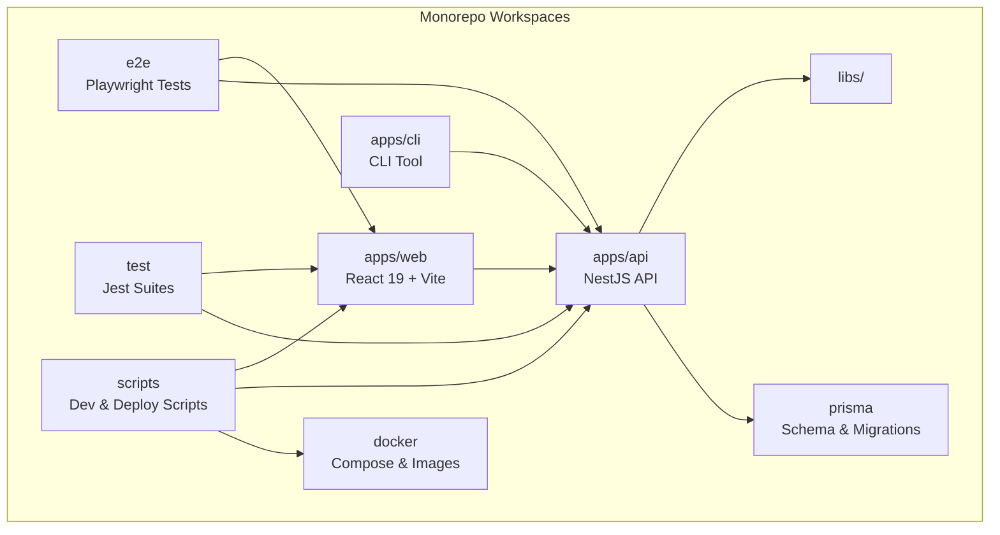
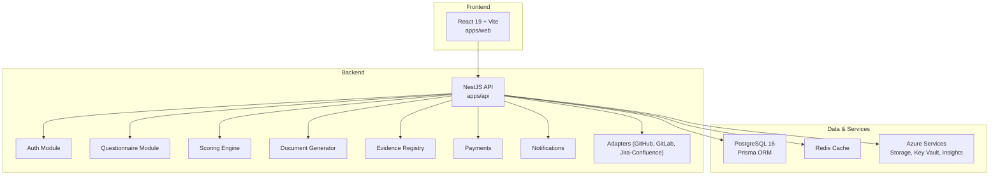
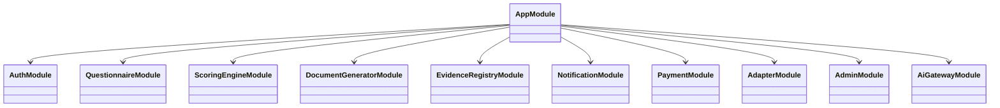
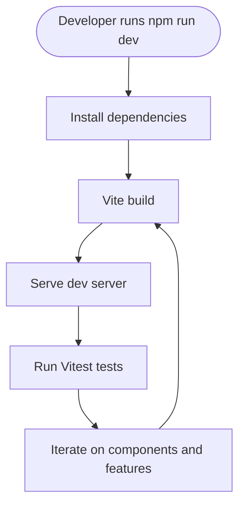
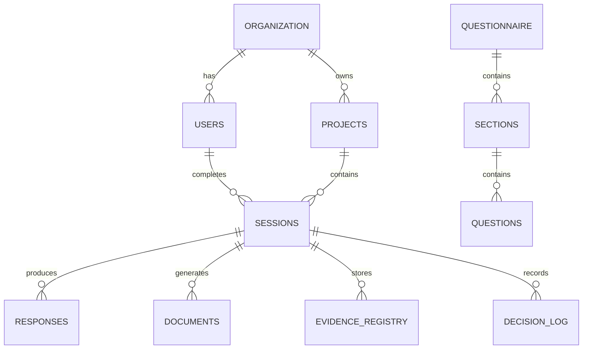
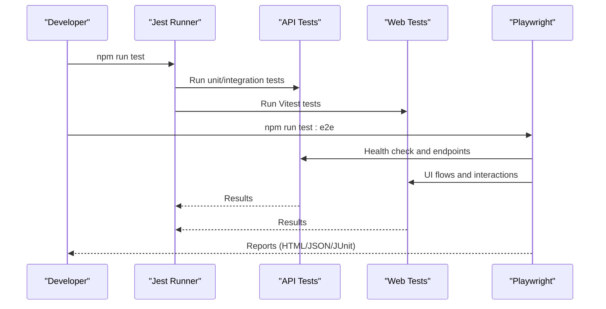
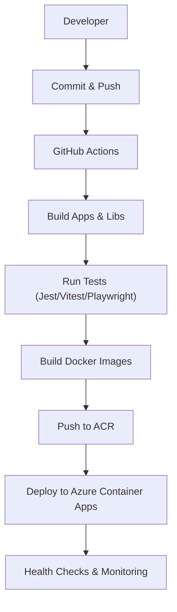
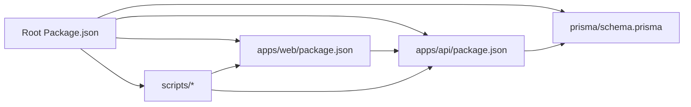

# Development Guide

<cite>
**Referenced Files in This Document**
- [README.md](file://README.md)
- [package.json](file://package.json)
- [turbo.json](file://turbo.json)
- [jest.config.js](file://jest.config.js)
- [playwright.config.ts](file://playwright.config.ts)
- [prisma/schema.prisma](file://prisma/schema.prisma)
- [apps/api/package.json](file://apps/api/package.json)
- [apps/web/package.json](file://apps/web/package.json)
- [docker-compose.yml](file://docker-compose.yml)
- [scripts/setup-local.sh](file://scripts/setup-local.sh)
- [scripts/dev-start.sh](file://scripts/dev-start.sh)
- [scripts/deploy-local.sh](file://scripts/deploy-local.sh)
- [TODO.md](file://TODO.md)
</cite>

## Table of Contents
1. [Introduction](#introduction)
2. [Project Structure](#project-structure)
3. [Core Components](#core-components)
4. [Architecture Overview](#architecture-overview)
5. [Detailed Component Analysis](#detailed-component-analysis)
6. [Dependency Analysis](#dependency-analysis)
7. [Performance Considerations](#performance-considerations)
8. [Troubleshooting Guide](#troubleshooting-guide)
9. [Conclusion](#conclusion)
10. [Appendices](#appendices)

## Introduction
This development guide provides a comprehensive overview of the Quiz-to-Build (Quiz2Biz) codebase for contributors. It covers development environment setup, coding standards, contribution workflows, project structure, build processes, testing frameworks, CI/CD and deployment procedures, release management, phased development approach, feature roadmaps, milestone tracking, code review processes, quality assurance, debugging techniques, local development with Docker, environment management, adding new features, extending functionality, maintaining code quality, testing strategy, performance testing, and security testing procedures.

## Project Structure
The repository follows a monorepo layout with multiple workspaces:
- apps/api: NestJS backend API with extensive modules for authentication, questionnaires, scoring, document generation, and integrations.
- apps/web: React 19 frontend built with Vite and TypeScript.
- apps/cli: Command-line interface for offline and batch operations.
- libs: Shared libraries for database, orchestrator, Redis, and shared utilities.
- prisma: Database schema and migrations.
- e2e: End-to-end tests using Playwright.
- test: Regression and performance test suites.
- docs: Architectural decision records, business analysis, compliance, security, and testing methodologies.
- scripts: Automation helpers for local development, deployment, and infrastructure management.
- docker: Container configurations for API, web, and PostgreSQL initialization.

**Diagram sources**
- [package.json:11-14](file://package.json#L11-L14)
- [turbo.json:6-64](file://turbo.json#L6-L64)

**Section sources**
- [README.md:295-318](file://README.md#L295-L318)
- [package.json:11-14](file://package.json#L11-L14)
- [turbo.json:1-65](file://turbo.json#L1-L65)

## Core Components
- Backend API (NestJS):
  - Modular architecture with domain-focused modules (auth, questionnaire, scoring, document generation, evidence registry, notifications, payments, etc.).
  - Strong typing with Prisma ORM and comprehensive DTOs/validation.
  - Security middleware (Helmet, throttling, JWT, OAuth).
  - Observability with Sentry, Application Insights, and logging.
- Frontend (React 19 + Vite):
  - Component-driven UI with React Router, Zustand for state, TanStack Query for data fetching, and Tailwind CSS.
  - Accessibility and internationalization support.
- CLI:
  - Command utilities for offline operations and integration testing.
- Shared Libraries:
  - Database, orchestrator, Redis, and shared utilities for cross-app usage.
- Database:
  - PostgreSQL 16 with Prisma schema and migrations.
- Testing:
  - Unit tests (Jest), integration tests, E2E (Playwright), regression, and performance tests.
- CI/CD and Deployment:
  - GitHub Actions workflows, Azure Container Apps, Azure Container Registry, and Docker-based deployments.

**Section sources**
- [apps/api/package.json:6-87](file://apps/api/package.json#L6-L87)
- [apps/web/package.json:1-75](file://apps/web/package.json#L1-L75)
- [prisma/schema.prisma:1-800](file://prisma/schema.prisma#L1-L800)
- [jest.config.js:11-17](file://jest.config.js#L11-L17)
- [playwright.config.ts:1-133](file://playwright.config.ts#L1-L133)

## Architecture Overview
The system follows a chat-first, multi-project architecture with a PostgreSQL-backed API and React frontend. The API exposes REST endpoints with Swagger documentation, integrates with Azure services (Storage, Key Vault, Application Insights), and supports OAuth providers. The CLI enables offline operations and batch tasks. Docker Compose provisions PostgreSQL and Redis for local development and testing.

**Diagram sources**
- [docker-compose.yml:18-150](file://docker-compose.yml#L18-L150)
- [prisma/schema.prisma:154-800](file://prisma/schema.prisma#L154-L800)
- [apps/api/package.json:21-64](file://apps/api/package.json#L21-L64)

**Section sources**
- [README.md:188-216](file://README.md#L188-L216)
- [docker-compose.yml:18-150](file://docker-compose.yml#L18-L150)
- [prisma/schema.prisma:1-800](file://prisma/schema.prisma#L1-800)

## Detailed Component Analysis

### Backend API (NestJS)
- Modules and Services:
  - Auth: JWT, OAuth, MFA, refresh tokens, and guards.
  - Questionnaire: adaptive logic, sections, questions, visibility rules, and sessions.
  - Scoring Engine: readiness scoring, dimension catalogs, and score snapshots.
  - Document Generator: document types, generation pipeline, and storage integration.
  - Evidence Registry: artifact ingestion, integrity checks, and CI artifact mapping.
  - Notifications: adaptive cards and webhook integrations.
  - Payments: Stripe integration and subscription services.
  - Adapters: GitHub, GitLab, Jira-Confluence integrations.
  - Admin: administrative controls and approval workflows.
  - AI Gateway: provider abstraction for LLMs.
  - Common Utilities: filters, interceptors, guards, monitoring, and configuration.
- Testing:
  - Jest-based unit and integration tests with coverage thresholds.
  - E2E tests via Playwright targeting both API and UI.
- Security:
  - Helmet, throttling, CSRF protection, input validation, and secure headers.
  - OAuth providers (Google, GitHub, Microsoft), JWT refresh tokens, and MFA.

**Diagram sources**
- [apps/api/package.json:67-86](file://apps/api/package.json#L67-L86)

**Section sources**
- [apps/api/package.json:6-87](file://apps/api/package.json#L6-L87)
- [jest.config.js:11-17](file://jest.config.js#L11-L17)
- [playwright.config.ts:1-133](file://playwright.config.ts#L1-L133)

### Frontend (React 19 + Vite)
- Features:
  - Routing with React Router 7, state management with Zustand, data fetching with TanStack Query.
  - UI components organized by feature areas (auth, questionnaire, dashboard, documents, etc.).
  - Accessibility and internationalization support.
- Testing:
  - Vitest-based unit and component tests with coverage reporting.
- Build:
  - Vite-based build pipeline with TypeScript and Tailwind CSS.

**Diagram sources**
- [apps/web/package.json:6-17](file://apps/web/package.json#L6-L17)

**Section sources**
- [apps/web/package.json:1-75](file://apps/web/package.json#L1-L75)

### CLI (Command-Line Interface)
- Purpose:
  - Offline operations and integration testing utilities.
- Testing:
  - Jest-based tests ensuring command behavior validation.

**Section sources**
- [apps/api/package.json:13-18](file://apps/api/package.json#L13-L18)

### Database (PostgreSQL 16 + Prisma)
- Schema:
  - Rich domain models covering organizations, users, questionnaires, sessions, responses, scoring, documents, evidence, decisions, and more.
- Migrations:
  - Incremental migrations managed by Prisma with seed data for development.
- Testing:
  - Separate test database container for CI and local testing.

**Diagram sources**
- [prisma/schema.prisma:154-800](file://prisma/schema.prisma#L154-L800)

**Section sources**
- [prisma/schema.prisma:1-800](file://prisma/schema.prisma#L1-L800)
- [docker-compose.yml:72-107](file://docker-compose.yml#L72-L107)

### Testing Frameworks
- Unit Tests:
  - Jest for NestJS API and CLI; coverage thresholds configured.
- Web Tests:
  - Vitest for React frontend with coverage.
- Integration Tests:
  - Jest-based integration suites for API contracts and flows.
- E2E Tests:
  - Playwright with multiple browser targets and projects; HTML, JSON, and JUnit reporters.
- Regression and Performance:
  - Dedicated suites for regression and performance testing.

**Diagram sources**
- [jest.config.js:11-25](file://jest.config.js#L11-L25)
- [playwright.config.ts:27-31](file://playwright.config.ts#L27-L31)

**Section sources**
- [jest.config.js:1-26](file://jest.config.js#L1-L26)
- [playwright.config.ts:1-133](file://playwright.config.ts#L1-L133)

### CI/CD and Deployment
- Local Development:
  - Docker Compose for PostgreSQL and Redis; API container with development build.
  - Scripts for quick setup and deployment automation.
- Cloud Deployment:
  - Azure Container Apps for API and Web.
  - Azure Container Registry for Docker images.
  - Scripts for login, build, push, and update commands.
- Scripts:
  - setup-local.sh, dev-start.sh, deploy-local.sh automate prerequisites, environment setup, database migrations, and startup.

**Diagram sources**
- [scripts/setup-local.sh:1-189](file://scripts/setup-local.sh#L1-L189)
- [scripts/dev-start.sh:1-15](file://scripts/dev-start.sh#L1-L15)
- [scripts/deploy-local.sh:1-359](file://scripts/deploy-local.sh#L1-L359)
- [package.json:58-64](file://package.json#L58-L64)

**Section sources**
- [docker-compose.yml:18-150](file://docker-compose.yml#L18-L150)
- [scripts/setup-local.sh:1-189](file://scripts/setup-local.sh#L1-L189)
- [scripts/dev-start.sh:1-15](file://scripts/dev-start.sh#L1-L15)
- [scripts/deploy-local.sh:1-359](file://scripts/deploy-local.sh#L1-L359)
- [package.json:58-64](file://package.json#L58-L64)

### Contribution Workflows
- Branching and Pull Requests:
  - Use pull request templates and branch protection rules.
  - Dependabot for dependency updates.
- Code Quality:
  - ESLint and Prettier via lint-staged.
  - Husky hooks (disabled for OneDrive compatibility).
- Reviews and Validation:
  - Automated tests must pass; E2E reports are generated.
  - Security scanning and audit reports.

**Section sources**
- [.github/pull_request_template.md](file://.github/pull_request_template.md)
- [.github/branch-protection-develop.json](file://.github/branch-protection-develop.json)
- [.github/branch-protection-main.json](file://.github/branch-protection-main.json)
- [package.json:118-126](file://package.json#L118-L126)
- [package.json:66-66](file://package.json#L66-L66)

### Coding Standards and Guidelines
- Language and Tooling:
  - TypeScript across all apps; ESLint and Prettier for formatting.
  - Turbo for monorepo orchestration.
- Naming and Structure:
  - Feature-based module organization; consistent naming for DTOs, services, controllers, and guards.
- Logging and Observability:
  - Winston-based logging with request correlation IDs.
- Security:
  - Helmet, throttling, input validation, and secure headers.
- Accessibility:
  - WCAG 2.2 Level AA compliance validated.

**Section sources**
- [apps/api/package.json:67-86](file://apps/api/package.json#L67-L86)
- [apps/web/package.json:37-74](file://apps/web/package.json#L37-L74)
- [README.md:197-203](file://README.md#L197-L203)

### Adding New Features and Extending Functionality
- Backend:
  - Create a new module under apps/api/modules with controllers, services, DTOs, and guards.
  - Add Prisma models and migrations for data persistence.
  - Write unit and integration tests; update E2E tests if UI impacts exist.
- Frontend:
  - Add new pages/components under apps/web/src/components/pages and integrate with routing.
  - Use TanStack Query for data fetching and Zustand for state where appropriate.
- CLI:
  - Extend commands under apps/cli/commands and add tests under apps/cli/src/__tests__.
- Shared Libraries:
  - Place reusable logic under libs and import via workspace aliases.

**Section sources**
- [apps/api/package.json:67-86](file://apps/api/package.json#L67-L86)
- [prisma/schema.prisma:1-800](file://prisma/schema.prisma#L1-L800)

### Release Management
- Versioning:
  - Semantic versioning reflected in package.json.
- Tagging and Releases:
  - Create releases from main branch after successful CI validation.
- Post-Release:
  - Update changelogs and documentation; monitor telemetry and alerts.

**Section sources**
- [package.json:2-4](file://package.json#L2-L4)

### Phased Development Approach and Roadmap
- Current Status:
  - Production ready with comprehensive testing and documentation.
- Roadmap Highlights:
  - Critical blockers: resolve TypeScript schema drift, CLI test failures, and security vulnerabilities.
  - High priority: technical debt cleanup, infrastructure verification, resource optimization.
  - Medium priority: OAuth verification, GitHub secrets, Application Insights, production environment setup, logging strategy.
  - Polish and optimization: performance testing, security hardening, documentation completion, backup and DR.
- Remediation Sprint:
  - Structured phases with measurable success metrics and validation protocols.

**Section sources**
- [README.md:380-388](file://README.md#L380-L388)
- [TODO.md:1-800](file://TODO.md#L1-L800)

### Milestone Tracking
- Use the roadmap and action plan to track milestones:
  - Phase 1: Critical blockers resolution.
  - Phase 2: High-priority items.
  - Phase 3: Medium-priority items.
  - Phase 4: Polishing and optimization.
- Final validation protocol ensures two consecutive green test cycles and performance/security validations.

**Section sources**
- [TODO.md:547-601](file://TODO.md#L547-L601)

### Code Review Processes and Quality Assurance
- Review Checklist:
  - All tests pass, coverage thresholds met, E2E reports reviewed.
  - Security scanning results clean; no high/critical vulnerabilities.
  - Code quality metrics (TODO/FIXME count, console statements) within acceptable limits.
- Tools:
  - ESLint, Prettier, Jest, Vitest, Playwright, SonarQube properties.

**Section sources**
- [TODO.md:12-21](file://TODO.md#L12-L21)
- [TODO.md:572-582](file://TODO.md#L572-L582)

### Debugging Techniques
- Local Debugging:
  - Use dev scripts to start services and attach debuggers.
  - Inspect logs via Docker Compose and application logs.
- API Debugging:
  - Swagger UI at /api/v1/docs; health endpoints for readiness.
- Frontend Debugging:
  - Vite dev server with hot reload; React DevTools recommended.
- Database:
  - Prisma Studio for schema exploration; seed data for reproducibility.

**Section sources**
- [scripts/dev-start.sh:1-15](file://scripts/dev-start.sh#L1-L15)
- [docker-compose.yml:109-135](file://docker-compose.yml#L109-L135)

### Environment Management
- Local:
  - Docker Compose for PostgreSQL and Redis; API container with development build.
  - Environment variables loaded from .env; scripts handle setup and migrations.
- Cloud:
  - Azure Container Apps for API and Web; ACR for images.
  - Environment-specific secrets and configuration injected via Azure.

**Section sources**
- [docker-compose.yml:18-150](file://docker-compose.yml#L18-L150)
- [scripts/setup-local.sh:72-83](file://scripts/setup-local.sh#L72-L83)
- [scripts/deploy-local.sh:251-262](file://scripts/deploy-local.sh#L251-L262)

### Testing Strategy
- Unit:
  - Jest with coverage thresholds; focus on services, guards, interceptors, and utilities.
- Integration:
  - Contract tests and flow tests validating API behavior.
- E2E:
  - Playwright across desktop and mobile browsers; HTML/JSON/JUnit reports.
- Regression and Performance:
  - Regression tests for stability; performance tests with k6 and Autocannon.

**Section sources**
- [jest.config.js:11-17](file://jest.config.js#L11-L17)
- [playwright.config.ts:27-31](file://playwright.config.ts#L27-L31)
- [test/performance/api-load.k6.js](file://test/performance/api-load.k6.js)
- [test/performance/autocannon-load.js](file://test/performance/autocannon-load.js)

### Performance Testing
- Load Testing:
  - k6 and Autocannon scripts for sustained load testing.
- Caching and Optimization:
  - Redis caching for scoring, question data, and session data.
  - Pagination for list endpoints; gzip compression; Docker multi-stage builds.
- Monitoring:
  - Application Insights and custom dashboards for latency and throughput.

**Section sources**
- [TODO.md:440-469](file://TODO.md#L440-L469)

### Security Testing Procedures
- Static and Dynamic Analysis:
  - npm audit, Snyk scans, and CodeQL.
- Runtime Security:
  - Helmet headers, CORS whitelist, CSP, HSTS, rate limiting, CSRF protection.
- Secrets Management:
  - Azure Key Vault and GitHub secrets; rotation policies.

**Section sources**
- [TODO.md:472-495](file://TODO.md#L472-L495)
- [GITHUB-SECRETS.md](file://GITHUB-SECRETS.md)

## Dependency Analysis
The monorepo uses Turbo for task orchestration and workspaces for modular development. Dependencies are managed at the root and per-app level, with overrides for security and compatibility.

**Diagram sources**
- [package.json:11-14](file://package.json#L11-L14)
- [turbo.json:6-64](file://turbo.json#L6-L64)

**Section sources**
- [package.json:1-176](file://package.json#L1-L176)
- [turbo.json:1-65](file://turbo.json#L1-L65)

## Performance Considerations
- Database:
  - Indexes for common queries; connection pooling; Prisma selective field loading.
- API:
  - Redis caching for scoring and frequently accessed data; pagination; compression.
- Frontend:
  - Lazy loading, code splitting, and efficient state management.
- Observability:
  - Metrics and tracing for latency and error rates.

[No sources needed since this section provides general guidance]

## Troubleshooting Guide
- Local Setup Issues:
  - Docker daemon not running; missing compose; port conflicts.
  - Use setup-local.sh or dev-start.sh for streamlined setup.
- Database Problems:
  - Migration failures; schema drift; seed issues.
  - Use Prisma CLI inside the API container; verify health checks.
- API Health:
  - Swagger UI endpoint for documentation; health checks for readiness.
- Logs:
  - Docker Compose logs for API, PostgreSQL, and Redis.
- E2E Failures:
  - Review Playwright HTML/JSON/JUnit reports; run with headed mode for debugging.

**Section sources**
- [scripts/setup-local.sh:62-69](file://scripts/setup-local.sh#L62-L69)
- [scripts/dev-start.sh:10-12](file://scripts/dev-start.sh#L10-L12)
- [docker-compose.yml:47-51](file://docker-compose.yml#L47-L51)
- [docker-compose.yml:101-106](file://docker-compose.yml#L101-L106)
- [playwright.config.ts:27-31](file://playwright.config.ts#L27-L31)

## Conclusion
This guide consolidates the development practices, tooling, and processes for contributing to Quiz-to-Build. By following the outlined workflows—environment setup, coding standards, testing, CI/CD, and phased roadmap—you can efficiently develop, validate, and deploy features while maintaining high quality and security.

[No sources needed since this section summarizes without analyzing specific files]

## Appendices
- Quick Links:
  - [Quick Start](README.md#L325-L338)
  - [Product Overview](README.md#L44-L52)
  - [Wireframes](README.md#L53-L60)
  - [Roadmap](TODO.md#L1-L800)

**Section sources**
- [README.md:322-341](file://README.md#L322-L341)
- [TODO.md:1-800](file://TODO.md#L1-L800)