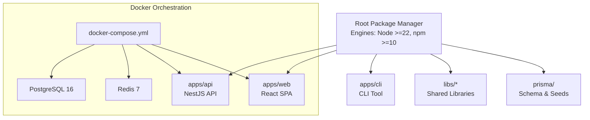
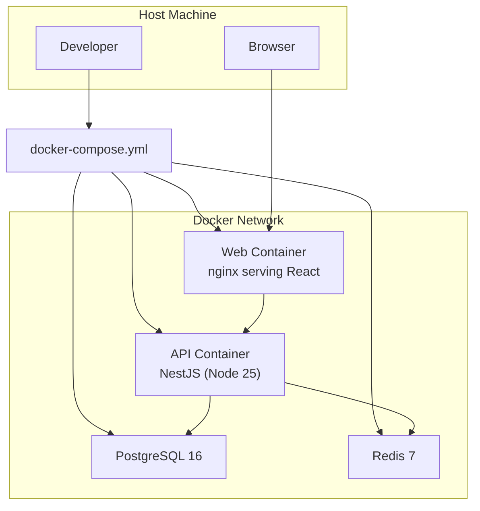
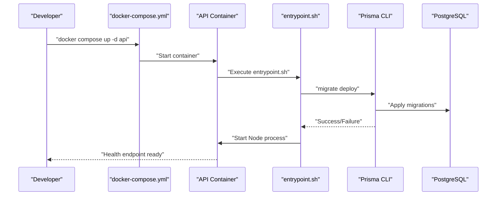
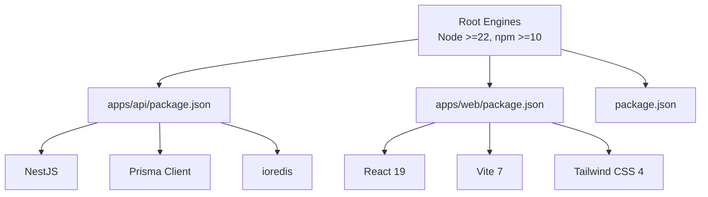

# Environment Setup

<cite>
**Referenced Files in This Document**
- [docker-compose.yml](file://docker-compose.yml)
- [package.json](file://package.json)
- [apps/api/package.json](file://apps/api/package.json)
- [apps/web/package.json](file://apps/web/package.json)
- [scripts/setup-local.sh](file://scripts/setup-local.sh)
- [scripts/dev-start.sh](file://scripts/dev-start.sh)
- [docker/api/Dockerfile](file://docker/api/Dockerfile)
- [docker/web/Dockerfile](file://docker/web/Dockerfile)
- [docker/api/entrypoint.sh](file://docker/api/entrypoint.sh)
- [docker/web/nginx.conf](file://docker/web/nginx.conf)
- [docker/postgres/init.sql](file://docker/postgres/init.sql)
- [prisma/schema.prisma](file://prisma/schema.prisma)
- [prisma/seed.ts](file://prisma/seed.ts)
- [prisma/seeds/e2e-seed.ts](file://prisma/seeds/e2e-seed.ts)
- [README.md](file://README.md)
</cite>

## Table of Contents
1. [Introduction](#introduction)
2. [Project Structure](#project-structure)
3. [Core Components](#core-components)
4. [Architecture Overview](#architecture-overview)
5. [Detailed Component Analysis](#detailed-component-analysis)
6. [Dependency Analysis](#dependency-analysis)
7. [Performance Considerations](#performance-considerations)
8. [Troubleshooting Guide](#troubleshooting-guide)
9. [Conclusion](#conclusion)
10. [Appendices](#appendices)

## Introduction
This document provides comprehensive environment setup instructions for Quiz-to-Build (Quiz2Biz) development. It covers system requirements, Node.js versions, prerequisite tools, local development setup using Docker Compose, environment variable configuration, database initialization and seeding, and troubleshooting common issues. It also includes step-by-step instructions for Windows, macOS, and Linux environments, along with IDE setup recommendations and development workflow optimization tips.

## Project Structure
The project is a monorepo organized with a root package manager controlling workspaces for the API, web, and CLI applications, plus shared libraries and database tooling. Docker Compose orchestrates local infrastructure (PostgreSQL, Redis, API, and Web).

**Diagram sources**
- [docker-compose.yml:18-150](file://docker-compose.yml#L18-L150)
- [package.json:11-14](file://package.json#L11-L14)

**Section sources**
- [README.md:295-318](file://README.md#L295-L318)
- [package.json:11-14](file://package.json#L11-L14)

## Core Components
- Node.js and npm versions are enforced at the root level to ensure consistent development across platforms.
- Docker Compose defines services for PostgreSQL (16), Redis (7), the NestJS API, and the React web app served via nginx.
- Prisma manages database schema, migrations, and seeds for local development and testing.
- Scripts automate local setup, health checks, and optional database seeding.

Key requirements and versions:
- Node.js: >= 22.0.0
- npm: >= 10.0.0
- PostgreSQL: 16 (Alpine)
- Redis: 7 (Alpine)
- NestJS API: development via Dockerfile with Node 25 base
- React Web: built with Vite and served via nginx

**Section sources**
- [package.json:7-10](file://package.json#L7-L10)
- [docker-compose.yml:27-35](file://docker-compose.yml#L27-L35)
- [docker/api/Dockerfile:2-2](file://docker/api/Dockerfile#L2-L2)
- [apps/web/package.json:1-75](file://apps/web/package.json#L1-L75)

## Architecture Overview
Local development uses Docker Compose to provision infrastructure and the API/Web apps. The web app is built and served by nginx, while the API runs under development mode inside its container. Prisma handles schema and data initialization.

**Diagram sources**
- [docker-compose.yml:18-150](file://docker-compose.yml#L18-L150)
- [docker/api/Dockerfile:38-66](file://docker/api/Dockerfile#L38-L66)
- [docker/web/Dockerfile:40-85](file://docker/web/Dockerfile#L40-L85)

## Detailed Component Analysis

### System Requirements and Prerequisites
- Operating systems: Windows, macOS, Linux
- Docker Engine and Docker Compose must be installed and running
- Node.js >= 22.0.0 and npm >= 10.0.0 (enforced at root)
- Optional: Azure Container Registry login for cloud deployment (not required for local development)

Verification steps:
- Confirm Docker and Compose availability
- Verify Docker daemon is running
- Ensure Node and npm satisfy root engines

**Section sources**
- [package.json:7-10](file://package.json#L7-L10)
- [scripts/setup-local.sh:45-69](file://scripts/setup-local.sh#L45-L69)

### Local Development Setup with Docker Compose
Follow these steps to start the environment locally:

1. Start infrastructure services (PostgreSQL and Redis)
   - Command: docker compose up -d postgres redis
   - Wait for health checks to pass

2. Start the API service
   - Command: docker compose up -d --build api

3. Apply database migrations
   - Command: docker compose exec -T api ./node_modules/.bin/prisma migrate deploy

4. Seed the database (optional)
   - Command: docker compose exec -T api ./node_modules/.bin/prisma db seed

5. Verify health
   - Endpoint: http://localhost:3000/api/v1/health
   - Use docker compose logs -f api for diagnostics if needed

6. Access the application
   - API Docs: http://localhost:3000/docs
   - API v1: http://localhost:3000/api/v1

Automated setup script:
- The repository provides a setup script that performs the above steps in sequence, including health checks and helpful messaging.

**Section sources**
- [scripts/setup-local.sh:82-136](file://scripts/setup-local.sh#L82-L136)
- [scripts/setup-local.sh:144-167](file://scripts/setup-local.sh#L144-L167)
- [docker-compose.yml:109-135](file://docker-compose.yml#L109-L135)

### Environment Variables and Configuration
- API environment variables are defined in docker-compose.yml for development:
  - NODE_ENV: development
  - PORT: 3000
  - DATABASE_URL: pointing to PostgreSQL service
  - REDIS_HOST/PORT: pointing to Redis service
  - JWT_SECRET/JWT_REFRESH_SECRET: development defaults
- Web container exposes API_UPSTREAM (defaults to http://api:3000) and supports runtime overrides.
- The web build embeds Vite environment variables via a generated .env.production.local file during the Docker build.

Important notes:
- Do not hardcode secrets in docker-compose.yml for production; use external secret management.
- For local development, the defaults are acceptable but should be changed before production use.

**Section sources**
- [docker-compose.yml:118-125](file://docker-compose.yml#L118-L125)
- [docker/web/Dockerfile:19-33](file://docker/web/Dockerfile#L19-L33)
- [docker/web/Dockerfile:67-68](file://docker/web/Dockerfile#L67-L68)

### Database Initialization and Seeding
- PostgreSQL initialization script enables UUID and pgcrypto extensions and grants privileges.
- Prisma schema defines the data model and is compatible with PostgreSQL 16.
- Migrations are applied automatically by the API entrypoint script and via the setup script.
- Seed data is generated by prisma/seed.ts, which creates organizations, users, questionnaires, sections, questions, visibility rules, and related domain data.

E2E test data:
- prisma/seeds/e2e-seed.ts provides test users and questionnaires for automated tests when NODE_ENV=test.

**Section sources**
- [docker/postgres/init.sql:4-14](file://docker/postgres/init.sql#L4-L14)
- [prisma/schema.prisma:9-12](file://prisma/schema.prisma#L9-L12)
- [prisma/seed.ts:12-518](file://prisma/seed.ts#L12-L518)
- [prisma/seeds/e2e-seed.ts:80-157](file://prisma/seeds/e2e-seed.ts#L80-L157)

### API Server Startup Flow
The API container uses a multi-stage Dockerfile:
- Builder stage installs dependencies, generates Prisma client, and builds the API.
- Development stage starts the API in watch mode.
- Production stage runs the application with health checks and non-root user.

The entrypoint script applies Prisma migrations at container startup and then launches the API process.

**Diagram sources**
- [docker/api/entrypoint.sh:4-33](file://docker/api/entrypoint.sh#L4-L33)
- [docker/api/Dockerfile:68-120](file://docker/api/Dockerfile#L68-L120)

**Section sources**
- [docker/api/Dockerfile:38-66](file://docker/api/Dockerfile#L38-L66)
- [docker/api/entrypoint.sh:4-33](file://docker/api/entrypoint.sh#L4-L33)

### Frontend Development Server and Web Proxy
The web app is built with Vite and served by nginx in the web container. The nginx configuration:
- Proxies /api/ requests to the API upstream (default: http://api:3000)
- Serves SPA fallback via index.html for single-page routing
- Applies security headers and caching for static assets
- Supports runtime override of API_UPSTREAM via environment variable

Build-time configuration:
- Vite environment variables are embedded into .env.production.local during the Docker build stage.

**Section sources**
- [docker/web/Dockerfile:19-33](file://docker/web/Dockerfile#L19-L33)
- [docker/web/Dockerfile:67-84](file://docker/web/Dockerfile#L67-L84)
- [docker/web/nginx.conf:20-48](file://docker/web/nginx.conf#L20-L48)

### Step-by-Step Setup Instructions

#### Windows
- Install Docker Desktop and enable WSL2 backend if using WSL2.
- Open PowerShell or Windows Terminal and navigate to the repository root.
- Run the automated setup script:
  - .\scripts\setup-local.sh
- Alternatively, use the minimal start script:
  - .\scripts\dev-start.sh

Ports:
- API: localhost:3000
- PostgreSQL: localhost:5432
- Redis: localhost:6379

Notes:
- Ensure Docker Desktop is running before starting services.
- If using WSL2, run the script from the WSL2 terminal for best compatibility.

**Section sources**
- [scripts/setup-local.sh:1-189](file://scripts/setup-local.sh#L1-L189)
- [scripts/dev-start.sh:1-15](file://scripts/dev-start.sh#L1-L15)

#### macOS
- Install Docker Desktop for Mac.
- Open Terminal and run:
  - ./scripts/setup-local.sh
- Ports: 3000 (API), 5432 (PostgreSQL), 6379 (Redis)

**Section sources**
- [scripts/setup-local.sh:1-189](file://scripts/setup-local.sh#L1-L189)

#### Linux
- Install Docker Engine and Docker Compose.
- Open a terminal and run:
  - ./scripts/setup-local.sh
- Ports: 3000 (API), 5432 (PostgreSQL), 6379 (Redis)

**Section sources**
- [scripts/setup-local.sh:1-189](file://scripts/setup-local.sh#L1-L189)

### IDE Setup Recommendations
- Recommended IDE: VS Code
- Extensions:
  - ESLint, Prettier, Tailwind CSS IntelliSense, Docker, Prisma
- Workspace configuration:
  - Open the repository root in VS Code to benefit from monorepo settings
- Debugging:
  - NestJS API: use the "start:debug" script in apps/api/package.json
  - Web app: use Vite dev server via npm run dev in apps/web
- Formatting and linting:
  - Use npm run format and npm run lint to keep code consistent

**Section sources**
- [apps/api/package.json:10-11](file://apps/api/package.json#L10-L11)
- [apps/web/package.json:7-16](file://apps/web/package.json#L7-L16)

### Development Workflow Optimization
- Use Turbo for fast incremental builds across workspaces
- Leverage Docker Compose for consistent environments across team members
- Keep Node.js and npm versions aligned with root engines
- Use the automated setup script to reduce manual steps and errors
- For rapid iteration, run the API in development mode with hot reload (via Dockerfile development stage)

**Section sources**
- [package.json:16-19](file://package.json#L16-L19)
- [docker/api/Dockerfile:38-66](file://docker/api/Dockerfile#L38-L66)

## Dependency Analysis
The environment relies on several key dependencies and their versions:

**Diagram sources**
- [package.json:7-10](file://package.json#L7-L10)
- [apps/api/package.json:21-64](file://apps/api/package.json#L21-L64)
- [apps/web/package.json:18-35](file://apps/web/package.json#L18-L35)

**Section sources**
- [package.json:7-10](file://package.json#L7-L10)
- [apps/api/package.json:21-64](file://apps/api/package.json#L21-L64)
- [apps/web/package.json:18-35](file://apps/web/package.json#L18-L35)

## Performance Considerations
- Use the development Dockerfile for local iteration; switch to the production stage for performance profiling.
- Ensure adequate memory allocation for Docker Desktop/Engine to prevent swapping.
- Prune unused Docker images and volumes periodically to maintain performance.
- Use the web container’s nginx caching for static assets to reduce load on the API.

[No sources needed since this section provides general guidance]

## Troubleshooting Guide

Common issues and resolutions:
- Port conflicts
  - API port 3000: change PORT in docker-compose.yml or stop the conflicting service.
  - PostgreSQL 5432 and Redis 6379: adjust exposed ports or stop conflicting services.
- Docker daemon not running
  - Start Docker Desktop or Docker Engine before running setup scripts.
- Health checks failing
  - Use docker compose logs -f api to inspect startup logs.
  - Verify Prisma migrations succeeded; rerun migration if needed.
- Database initialization errors
  - Confirm PostgreSQL container is healthy and init.sql executed.
- Web proxy issues
  - Ensure API_UPSTREAM is reachable from the web container.
  - Check nginx.conf proxy settings and API health endpoint.

Additional commands:
- docker compose logs -f api
- docker compose exec -T api ./node_modules/.bin/prisma studio
- docker compose down --remove-orphans

**Section sources**
- [scripts/setup-local.sh:144-167](file://scripts/setup-local.sh#L144-L167)
- [docker-compose.yml:47-51](file://docker-compose.yml#L47-L51)
- [docker/web/nginx.conf:31-43](file://docker/web/nginx.conf#L31-L43)

## Conclusion
With the provided scripts and Docker Compose configuration, Quiz-to-Build can be quickly spun up locally across Windows, macOS, and Linux. Adhering to the Node.js and npm version requirements, using the automated setup script, and understanding the API/web orchestration will streamline development. For production, replace development defaults with secure secrets and consider the cloud deployment notes included in the repository.

[No sources needed since this section summarizes without analyzing specific files]

## Appendices

### Appendix A: Quick Commands Reference
- Start all services: docker compose up -d
- Stop all services: docker compose down
- View logs: docker compose logs -f api
- Health check: curl http://localhost:3000/api/v1/health
- Apply migrations: docker compose exec -T api ./node_modules/.bin/prisma migrate deploy
- Seed database: docker compose exec -T api ./node_modules/.bin/prisma db seed

**Section sources**
- [scripts/setup-local.sh:183-188](file://scripts/setup-local.sh#L183-L188)
- [docker-compose.yml:109-135](file://docker-compose.yml#L109-L135)