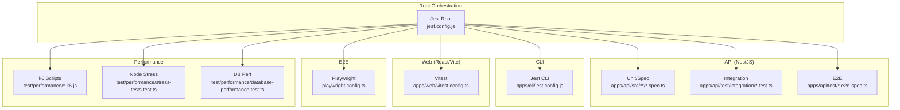
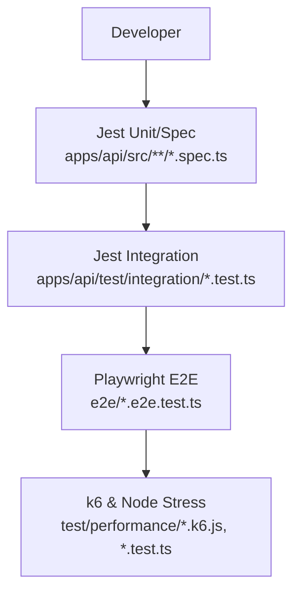
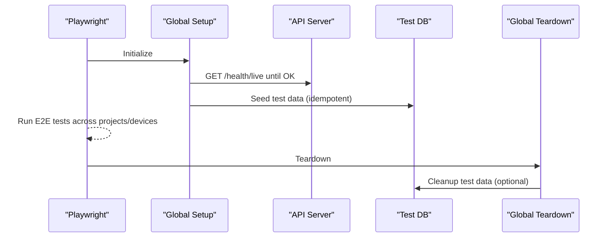
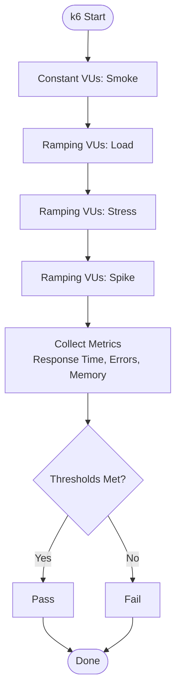
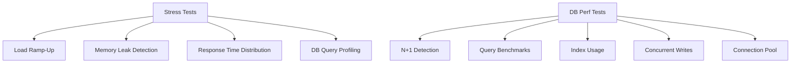
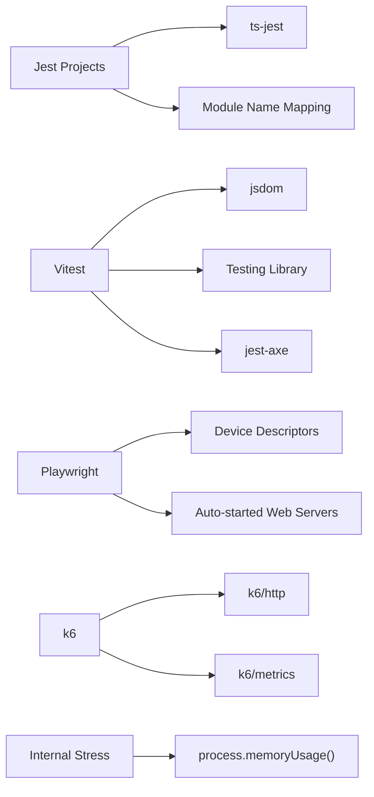

# Testing Framework

<cite>
**Referenced Files in This Document**
- [jest.config.js](file://jest.config.js)
- [playwright.config.ts](file://playwright.config.ts)
- [vitest.config.ts](file://apps/web/vitest.config.ts)
- [jest.config.js (CLI)](file://apps/cli/jest.config.js)
- [jest-e2e.json (API)](file://apps/api/test/jest-e2e.json)
- [jest-integration.json (API)](file://apps/api/test/jest-integration.json)
- [jest.config.js (Performance)](file://test/performance/jest.config.js)
- [jest.config.js (Regression)](file://test/regression/jest.config.js)
- [setup.ts (Web Test Setup)](file://apps/web/src/test/setup.ts)
- [setup.ts (Regression Setup)](file://test/regression/setup.ts)
- [global-setup.ts (E2E)](file://e2e/global-setup.ts)
- [global-teardown.ts (E2E)](file://e2e/global-teardown.ts)
- [api-load.k6.js](file://test/performance/api-load.k6.js)
- [memory-load.k6.js](file://test/performance/memory-load.k6.js)
- [stress-tests.test.ts](file://test/performance/stress-tests.test.ts)
- [database-performance.test.ts](file://test/performance/database-performance.test.ts)
</cite>

## Table of Contents
1. [Introduction](#introduction)
2. [Project Structure](#project-structure)
3. [Core Components](#core-components)
4. [Architecture Overview](#architecture-overview)
5. [Detailed Component Analysis](#detailed-component-analysis)
6. [Dependency Analysis](#dependency-analysis)
7. [Performance Considerations](#performance-considerations)
8. [Troubleshooting Guide](#troubleshooting-guide)
9. [Conclusion](#conclusion)
10. [Appendices](#appendices)

## Introduction
This document describes the multi-layered testing strategy for Quiz-to-Build, covering unit, integration, end-to-end (E2E), and performance tests. It explains the configuration and tooling used across the stack:
- Jest for API unit and integration tests, plus dedicated suites for regression and performance
- Vitest for web component and UI tests
- Playwright for browser-based E2E flows
- k6 for API load and memory profiling tests
- Internal Node.js stress and database performance suites

It also documents test organization, naming conventions, assertion patterns, mocking strategies, test data management, continuous integration testing, coverage reporting, quality gates, debugging, maintenance, and environment setup.

## Project Structure
The repository organizes tests by layer and application:
- Root Jest orchestration coordinates multiple projects
- API tests split into unit/spec and integration/E2E configurations
- CLI tests use Jest with isolated coverage
- Web tests use Vitest with jsdom and Testing Library
- E2E tests use Playwright with cross-browser and mobile device targets
- Performance tests include k6 scripts and internal Node.js suites

**Diagram sources**
- [jest.config.js:1-26](file://jest.config.js#L1-L26)
- [apps/api/test/jest-integration.json:1-27](file://apps/api/test/jest-integration.json#L1-L27)
- [apps/api/test/jest-e2e.json:1-21](file://apps/api/test/jest-e2e.json#L1-L21)
- [apps/cli/jest.config.js:1-31](file://apps/cli/jest.config.js#L1-L31)
- [apps/web/vitest.config.ts:1-45](file://apps/web/vitest.config.ts#L1-L45)
- [playwright.config.ts:1-133](file://playwright.config.ts#L1-L133)
- [test/performance/api-load.k6.js:1-303](file://test/performance/api-load.k6.js#L1-L303)
- [test/performance/stress-tests.test.ts:1-525](file://test/performance/stress-tests.test.ts#L1-L525)
- [test/performance/database-performance.test.ts:1-391](file://test/performance/database-performance.test.ts#L1-L391)

**Section sources**
- [jest.config.js:1-26](file://jest.config.js#L1-L26)
- [apps/api/test/jest-integration.json:1-27](file://apps/api/test/jest-integration.json#L1-L27)
- [apps/api/test/jest-e2e.json:1-21](file://apps/api/test/jest-e2e.json#L1-L21)
- [apps/cli/jest.config.js:1-31](file://apps/cli/jest.config.js#L1-L31)
- [apps/web/vitest.config.ts:1-45](file://apps/web/vitest.config.ts#L1-L45)
- [playwright.config.ts:1-133](file://playwright.config.ts#L1-L133)
- [test/performance/api-load.k6.js:1-303](file://test/performance/api-load.k6.js#L1-L303)
- [test/performance/stress-tests.test.ts:1-525](file://test/performance/stress-tests.test.ts#L1-L525)
- [test/performance/database-performance.test.ts:1-391](file://test/performance/database-performance.test.ts#L1-L391)

## Core Components
- Jest root configuration aggregates projects for API, CLI, orchestrator, regression, and performance suites. It sets global timeouts and verbosity.
- API test suites:
  - Integration: Jest project with ts-jest, module name mapping, cache directory, and explicit test timeout.
  - E2E: Jest project with ts-jest, module name mapping, cache directory, and explicit test timeout.
- CLI tests: Jest with isolated coverage collection and strict thresholds for targeted modules.
- Web tests: Vitest with jsdom, Testing Library matchers, jest-axe, localStorage polyfills, and custom setup hooks.
- E2E: Playwright with parallelism, browser/device matrix, HTML/JSON/JUnit reporters, global setup/teardown, and optional auto-started web servers.
- Performance: k6 scripts for load and memory tests; Node.js suites for stress, memory leak detection, database query profiling, and connection pool checks.

**Section sources**
- [jest.config.js:1-26](file://jest.config.js#L1-L26)
- [apps/api/test/jest-integration.json:1-27](file://apps/api/test/jest-integration.json#L1-L27)
- [apps/api/test/jest-e2e.json:1-21](file://apps/api/test/jest-e2e.json#L1-L21)
- [apps/cli/jest.config.js:1-31](file://apps/cli/jest.config.js#L1-L31)
- [apps/web/vitest.config.ts:1-45](file://apps/web/vitest.config.ts#L1-L45)
- [playwright.config.ts:1-133](file://playwright.config.ts#L1-L133)
- [test/performance/api-load.k6.js:1-303](file://test/performance/api-load.k6.js#L1-L303)
- [test/performance/memory-load.k6.js:1-174](file://test/performance/memory-load.k6.js#L1-L174)
- [test/performance/stress-tests.test.ts:1-525](file://test/performance/stress-tests.test.ts#L1-L525)
- [test/performance/database-performance.test.ts:1-391](file://test/performance/database-performance.test.ts#L1-L391)

## Architecture Overview
The testing architecture separates concerns by layer and technology, enabling fast local feedback (unit and component), robust integration validation, broad browser coverage (E2E), and rigorous performance validation (k6 and internal suites).

**Diagram sources**
- [jest.config.js:1-26](file://jest.config.js#L1-L26)
- [apps/api/test/jest-integration.json:1-27](file://apps/api/test/jest-integration.json#L1-L27)
- [playwright.config.ts:1-133](file://playwright.config.ts#L1-L133)
- [test/performance/api-load.k6.js:1-303](file://test/performance/api-load.k6.js#L1-L303)
- [test/performance/stress-tests.test.ts:1-525](file://test/performance/stress-tests.test.ts#L1-L525)

## Detailed Component Analysis

### Jest Root Configuration
- Coordinates multiple projects: API, CLI, orchestrator, regression, performance.
- Applies global test timeout and verbosity.
- Keeps frontend tests separate (Vitest) as indicated in comments.

**Section sources**
- [jest.config.js:1-26](file://jest.config.js#L1-L26)

### API Integration Tests (Jest)
- Uses ts-jest with isolatedModules for faster transforms.
- Module name mapping resolves monorepo aliases for libs.
- Dedicated cache directory prevents interference.
- Explicit test timeout supports longer integration flows.

**Section sources**
- [apps/api/test/jest-integration.json:1-27](file://apps/api/test/jest-integration.json#L1-L27)

### API E2E Tests (Jest)
- ts-jest transform and module name mapping for libs.
- Cache directory and explicit test timeout.
- Designed for end-to-end flows against live API.

**Section sources**
- [apps/api/test/jest-e2e.json:1-21](file://apps/api/test/jest-e2e.json#L1-L21)

### CLI Tests (Jest)
- Node environment with ts-jest.
- Isolated coverage collection focused on specific modules.
- Strict coverage thresholds enforce quality.

**Section sources**
- [apps/cli/jest.config.js:1-31](file://apps/cli/jest.config.js#L1-L31)

### Web Component Tests (Vitest)
- jsdom environment with Testing Library matchers and jest-axe.
- LocalStorage polyfill and matchMedia polyfill for DOM APIs.
- Coverage thresholds and reporter configuration.
- Setup file cleans up after each test.

**Section sources**
- [apps/web/vitest.config.ts:1-45](file://apps/web/vitest.config.ts#L1-L45)
- [apps/web/src/test/setup.ts:1-72](file://apps/web/src/test/setup.ts#L1-L72)

### Regression Suite (Jest)
- Isolated project with bail-on-first-failure behavior.
- JUnit-style reporters for CI integration.
- Custom matchers for immutability and null-safety.
- Shared test helpers and test data catalog.

**Section sources**
- [test/regression/jest.config.js:1-54](file://test/regression/jest.config.js#L1-L54)
- [test/regression/setup.ts:1-170](file://test/regression/setup.ts#L1-L170)

### Performance Suite (Jest)
- Node environment with ts-jest and module name mapping.
- Longer timeouts suitable for performance scenarios.
- Designed for internal performance tests alongside k6.

**Section sources**
- [test/performance/jest.config.js:1-27](file://test/performance/jest.config.js#L1-L27)

### E2E Tests (Playwright)
- Parallel execution with browser/device matrix (Chrome, Firefox, Safari, Chrome Mobile, Safari Mobile).
- HTML/JSON/JUnit reporters for CI artifact consumption.
- Global setup waits for API health and seeds test data; teardown optionally cleans up.
- Optional auto-started web servers for local development or CI.

**Diagram sources**
- [playwright.config.ts:1-133](file://playwright.config.ts#L1-L133)
- [e2e/global-setup.ts:1-70](file://e2e/global-setup.ts#L1-L70)
- [e2e/global-teardown.ts:1-31](file://e2e/global-teardown.ts#L1-L31)

**Section sources**
- [playwright.config.ts:1-133](file://playwright.config.ts#L1-L133)
- [e2e/global-setup.ts:1-70](file://e2e/global-setup.ts#L1-L70)
- [e2e/global-teardown.ts:1-31](file://e2e/global-teardown.ts#L1-L31)

### k6 Load and Memory Tests
- api-load.k6.js: Multi-scenario load (smoke, load, stress, spike) with thresholds on response time and error rate; groups API endpoints by functional area.
- memory-load.k6.js: Sustained load with memory gauge metrics and thresholds.

**Diagram sources**
- [test/performance/api-load.k6.js:1-303](file://test/performance/api-load.k6.js#L1-L303)
- [test/performance/memory-load.k6.js:1-174](file://test/performance/memory-load.k6.js#L1-L174)

**Section sources**
- [test/performance/api-load.k6.js:1-303](file://test/performance/api-load.k6.js#L1-L303)
- [test/performance/memory-load.k6.js:1-174](file://test/performance/memory-load.k6.js#L1-L174)

### Internal Stress and Database Performance Suites
- stress-tests.test.ts: Simulated load ramp-up, memory leak detection, response time distribution, and database query profiling.
- database-performance.test.ts: N+1 detection, query performance benchmarks, index usage verification, concurrent write performance, and connection pool checks.

**Diagram sources**
- [test/performance/stress-tests.test.ts:1-525](file://test/performance/stress-tests.test.ts#L1-L525)
- [test/performance/database-performance.test.ts:1-391](file://test/performance/database-performance.test.ts#L1-L391)

**Section sources**
- [test/performance/stress-tests.test.ts:1-525](file://test/performance/stress-tests.test.ts#L1-L525)
- [test/performance/database-performance.test.ts:1-391](file://test/performance/database-performance.test.ts#L1-L391)

## Dependency Analysis
- Test toolchain dependencies:
  - Jest projects depend on ts-jest and module name mapping for monorepo paths.
  - Vitest depends on jsdom and Testing Library; includes jest-axe for accessibility.
  - Playwright depends on device descriptors and optional auto-started web servers.
  - k6 scripts depend on HTTP and metrics modules; internal suites depend on Node.js process memory APIs.

**Diagram sources**
- [apps/api/test/jest-integration.json:1-27](file://apps/api/test/jest-integration.json#L1-L27)
- [apps/web/vitest.config.ts:1-45](file://apps/web/vitest.config.ts#L1-L45)
- [playwright.config.ts:1-133](file://playwright.config.ts#L1-L133)
- [test/performance/api-load.k6.js:1-303](file://test/performance/api-load.k6.js#L1-L303)
- [test/performance/stress-tests.test.ts:1-525](file://test/performance/stress-tests.test.ts#L1-L525)

**Section sources**
- [apps/api/test/jest-integration.json:1-27](file://apps/api/test/jest-integration.json#L1-L27)
- [apps/web/vitest.config.ts:1-45](file://apps/web/vitest.config.ts#L1-L45)
- [playwright.config.ts:1-133](file://playwright.config.ts#L1-L133)
- [test/performance/api-load.k6.js:1-303](file://test/performance/api-load.k6.js#L1-L303)
- [test/performance/stress-tests.test.ts:1-525](file://test/performance/stress-tests.test.ts#L1-L525)

## Performance Considerations
- k6 scenarios:
  - Smoke, load, stress, and spike tests with explicit thresholds for response time and error rates.
  - Functional grouping of API endpoints to isolate areas of concern.
- Memory profiling:
  - Dedicated memory load test with gauge metrics and thresholds.
- Internal stress:
  - Simulated load ramp-up, memory growth detection, response time percentiles, and database query profiling.
- Database performance:
  - N+1 detection, query benchmarks, index usage checks, concurrent write performance, and connection pool validation.

**Section sources**
- [test/performance/api-load.k6.js:1-303](file://test/performance/api-load.k6.js#L1-L303)
- [test/performance/memory-load.k6.js:1-174](file://test/performance/memory-load.k6.js#L1-L174)
- [test/performance/stress-tests.test.ts:1-525](file://test/performance/stress-tests.test.ts#L1-L525)
- [test/performance/database-performance.test.ts:1-391](file://test/performance/database-performance.test.ts#L1-L391)

## Troubleshooting Guide
- Jest timeouts:
  - Increase testTimeout in project-specific Jest configs when tests exceed default durations.
- Vitest setup issues:
  - Ensure jsdom environment and setup file are loaded; verify polyfills for localStorage and matchMedia.
- Playwright flakiness:
  - Adjust actionTimeout/navigationTimeout; leverage trace/screenshot/video on first retry; reduce workers on CI.
- Coverage gaps:
  - Verify coverage include/exclude patterns and thresholds; regenerate lcov reports for CI.
- Regression test failures:
  - Use custom matchers (immutable, null-safe) and helpers (waitForCondition, deepFreeze, fake timers) to stabilize tests.
- E2E environment:
  - Confirm API health readiness in global setup; ensure seed/cleanup scripts run idempotently.

**Section sources**
- [apps/web/vitest.config.ts:1-45](file://apps/web/vitest.config.ts#L1-L45)
- [apps/web/src/test/setup.ts:1-72](file://apps/web/src/test/setup.ts#L1-L72)
- [playwright.config.ts:1-133](file://playwright.config.ts#L1-L133)
- [test/regression/setup.ts:1-170](file://test/regression/setup.ts#L1-L170)
- [e2e/global-setup.ts:1-70](file://e2e/global-setup.ts#L1-L70)
- [e2e/global-teardown.ts:1-31](file://e2e/global-teardown.ts#L1-L31)

## Conclusion
Quiz-to-Build employs a layered testing strategy spanning unit, integration, E2E, and performance domains. The configuration leverages Jest, Vitest, Playwright, and k6 to deliver fast feedback locally and robust validation in CI. Custom matchers, setup utilities, and performance suites ensure reliability, maintainability, and scalability.

## Appendices

### Test Organization and Naming Conventions
- API:
  - Unit/spec: apps/api/src/**/*.spec.ts
  - Integration: apps/api/test/integration/*.test.ts
  - E2E: apps/api/test/*.e2e-spec.ts
- CLI:
  - apps/cli/src/__tests__/**/*.test.{js,ts}
- Web:
  - apps/web/src/**/*.test.{ts,tsx}
- E2E:
  - e2e/**/*.e2e.test.ts
- Performance:
  - test/performance/*.test.ts and *.k6.js

**Section sources**
- [apps/api/test/jest-integration.json:1-27](file://apps/api/test/jest-integration.json#L1-L27)
- [apps/api/test/jest-e2e.json:1-21](file://apps/api/test/jest-e2e.json#L1-L21)
- [apps/cli/jest.config.js:1-31](file://apps/cli/jest.config.js#L1-L31)
- [apps/web/vitest.config.ts:1-45](file://apps/web/vitest.config.ts#L1-L45)
- [playwright.config.ts:1-133](file://playwright.config.ts#L1-L133)
- [test/performance/jest.config.js:1-27](file://test/performance/jest.config.js#L1-L27)

### Assertion Patterns and Mocking Strategies
- Vitest:
  - Testing Library matchers and jest-axe; cleanup after each test; localStorage and matchMedia polyfills.
- Regression:
  - Custom matchers for immutability and null-safety; waitForCondition; deepFreeze; fake timers.
- Jest (API):
  - ts-jest with isolatedModules; module name mapping; cacheDirectory; testTimeout.

**Section sources**
- [apps/web/src/test/setup.ts:1-72](file://apps/web/src/test/setup.ts#L1-L72)
- [test/regression/setup.ts:1-170](file://test/regression/setup.ts#L1-L170)
- [apps/api/test/jest-integration.json:1-27](file://apps/api/test/jest-integration.json#L1-L27)

### Continuous Integration and Quality Gates
- Reports:
  - Playwright HTML/JSON/JUnit for E2E artifacts.
  - Jest reporters for regression and performance suites.
  - Vitest coverage (text, json, html, lcov).
- Quality gates:
  - Bail on first regression failure.
  - Coverage thresholds per module.
  - k6 thresholds for response time and error rate.

**Section sources**
- [playwright.config.ts:1-133](file://playwright.config.ts#L1-L133)
- [test/regression/jest.config.js:1-54](file://test/regression/jest.config.js#L1-L54)
- [apps/web/vitest.config.ts:1-45](file://apps/web/vitest.config.ts#L1-L45)
- [test/performance/api-load.k6.js:1-303](file://test/performance/api-load.k6.js#L1-L303)

### Test Environment Setup
- Playwright:
  - Optional auto-started web servers for API and Web; configurable base URLs; CI worker limits.
- E2E:
  - Global setup waits for API health; seeds test data; global teardown attempts cleanup.
- k6:
  - Environment variables for API_URL and AUTH_TOKEN; scenario-driven execution.

**Section sources**
- [playwright.config.ts:1-133](file://playwright.config.ts#L1-L133)
- [e2e/global-setup.ts:1-70](file://e2e/global-setup.ts#L1-L70)
- [e2e/global-teardown.ts:1-31](file://e2e/global-teardown.ts#L1-L31)
- [test/performance/api-load.k6.js:1-303](file://test/performance/api-load.k6.js#L1-L303)