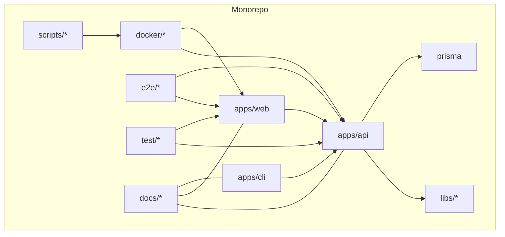
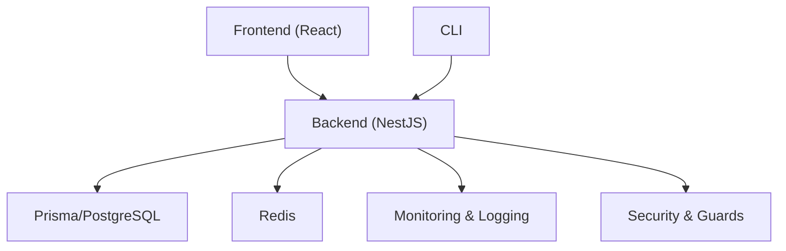
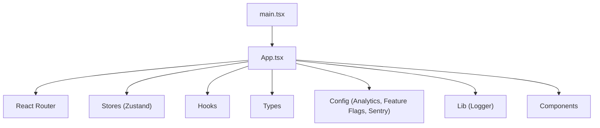
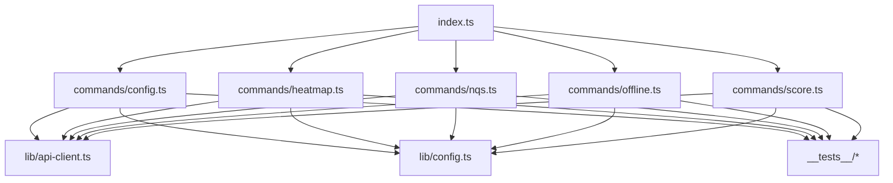
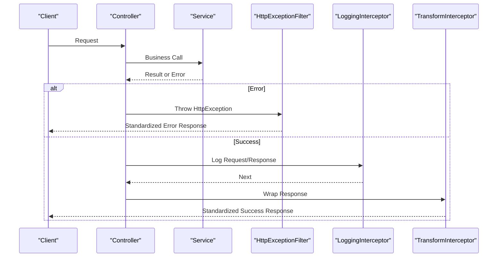
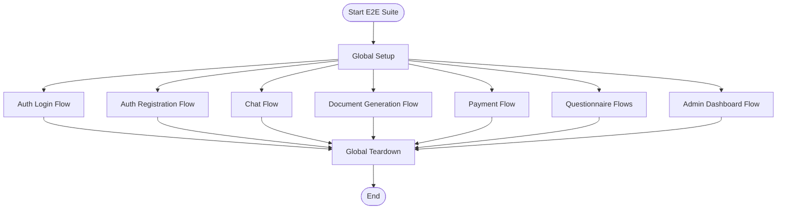
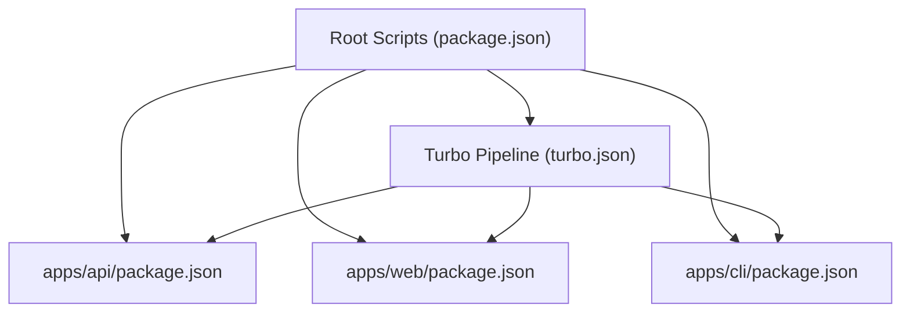

# Development Guidelines

<cite>
**Referenced Files in This Document**
- [package.json](file://package.json)
- [turbo.json](file://turbo.json)
- [jest.config.js](file://jest.config.js)
- [.github/copilot-instructions.md](file://.github/copilot-instructions.md)
- [.github/branch-protection-develop.json](file://.github/branch-protection-develop.json)
- [.github/branch-protection-main.json](file://.github/branch-protection-main.json)
- [.github/dependabot.yml](file://.github/dependabot.yml)
- [.pre-commit-config.yaml](file://.pre-commit-config.yaml)
- [apps/api/package.json](file://apps/api/package.json)
- [apps/web/package.json](file://apps/web/package.json)
- [apps/cli/package.json](file://apps/cli/package.json)
- [apps/api/src/app.module.ts](file://apps/api/src/app.module.ts)
- [apps/api/src/main.ts](file://apps/api/src/main.ts)
- [apps/api/src/common/filters/http-exception.filter.ts](file://apps/api/src/common/filters/http-exception.filter.ts)
- [apps/api/src/common/interceptors/logging.interceptor.ts](file://apps/api/src/common/interceptors/logging.interceptor.ts)
- [apps/api/src/common/interceptors/transform.interceptor.ts](file://apps/api/src/common/interceptors/transform.interceptor.ts)
- [apps/api/src/modules/auth/auth.module.ts](file://apps/api/src/modules/auth/auth.module.ts)
- [apps/api/src/modules/auth/auth.service.ts](file://apps/api/src/modules/auth/auth.service.ts)
- [apps/api/src/modules/chat-engine/chat-engine.module.ts](file://apps/api/src/modules/chat-engine/chat-engine.module.ts)
- [apps/api/src/modules/document-generator/document-generator.module.ts](file://apps/api/src/modules/document-generator/document-generator.module.ts)
- [apps/api/src/modules/evidence-registry/evidence-registry.module.ts](file://apps/api/src/modules/evidence-registry/evidence-registry.module.ts)
- [apps/api/src/modules/fact-extraction/fact-extraction.module.ts](file://apps/api/src/modules/fact-extraction/fact-extraction.module.ts)
- [apps/api/src/modules/decision-log/decision-log.module.ts](file://apps/api/src/modules/decision-log/decision-log.module.ts)
- [apps/api/src/modules/payment/payment.module.ts](file://apps/api/src/modules/payment/payment.module.ts)
- [apps/api/src/modules/projects/projects.module.ts](file://apps/api/src/modules/projects/projects.module.ts)
- [apps/api/src/modules/qpg/qpg.module.ts](file://apps/api/src/modules/qpg/qpg.module.ts)
- [apps/api/src/modules/quality-scoring/quality-scoring.module.ts](file://apps/api/src/modules/quality-scoring/quality-scoring.module.ts)
- [apps/api/src/modules/questionnaire/questionnaire.module.ts](file://apps/api/src/modules/questionnaire/questionnaire.module.ts)
- [apps/api/src/modules/scoring-engine/scoring-engine.module.ts](file://apps/api/src/modules/scoring-engine/scoring-engine.module.ts)
- [apps/api/src/modules/session/session.module.ts](file://apps/api/src/modules/session/session.module.ts)
- [apps/api/src/modules/standards/standards.module.ts](file://apps/api/src/modules/standards/standards.module.ts)
- [apps/api/src/modules/users/users.module.ts](file://apps/api/src/modules/users/users.module.ts)
- [apps/api/src/modules/ai-gateway/ai-gateway.module.ts](file://apps/api/src/modules/ai-gateway/ai-gateway.module.ts)
- [apps/api/src/modules/heatmap/heatmap.module.ts](file://apps/api/src/modules/heatmap/heatmap.module.ts)
- [apps/api/src/modules/policy-pack/policy-pack.module.ts](file://apps/api/src/modules/policy-pack/policy-pack.module.ts)
- [apps/api/src/modules/adaptivelogic/adaptive-logic.module.ts](file://apps/api/src/modules/adaptivelogic/adaptive-logic.module.ts)
- [apps/api/src/modules/admin/admin.module.ts](file://apps/api/src/modules/admin/admin.module.ts)
- [apps/api/src/modules/notification/notification.module.ts](file://apps/api/src/modules/notification/notification.module.ts)
- [apps/api/src/modules/notifications/notifications.module.ts](file://apps/api/src/modules/notifications/notifications.module.ts)
- [apps/api/src/modules/document-commerce/document-commerce.module.ts](file://apps/api/src/modules/document-commerce/document-commerce.module.ts)
- [apps/api/src/modules/idea-capture/idea-capture.module.ts](file://apps/api/src/modules/idea-capture/idea-capture.module.ts)
- [apps/api/src/modules/adapter/adapter.module.ts](file://apps/api/src/modules/adapter/adapter.module.ts)
- [apps/api/src/modules/adapter/github.adapter.ts](file://apps/api/src/modules/adapter/github.adapter.ts)
- [apps/api/src/modules/adapter/gitlab.adapter.ts](file://apps/api/src/modules/adapter/gitlab.adapter.ts)
- [apps/api/src/modules/adapter/jira-confluence.adapter.ts](file://apps/api/src/modules/adapter/jira-confluence.adapter.ts)
- [apps/api/src/modules/adapter/adapter-config.service.ts](file://apps/api/src/modules/adapter/adapter-config.service.ts)
- [apps/api/src/modules/adapter/adapter.controller.ts](file://apps/api/src/modules/adapter/adapter.controller.ts)
- [apps/api/src/modules/ai-gateway/ai-gateway.service.ts](file://apps/api/src/modules/ai-gateway/ai-gateway.service.ts)
- [apps/api/src/modules/ai-gateway/ai-gateway.controller.ts](file://apps/api/src/modules/ai-gateway/ai-gateway.controller.ts)
- [apps/api/src/modules/chat-engine/chat-engine.service.ts](file://apps/api/src/modules/chat-engine/chat-engine.service.ts)
- [apps/api/src/modules/chat-engine/chat-engine.controller.ts](file://apps/api/src/modules/chat-engine/chat-engine.controller.ts)
- [apps/api/src/modules/document-generator/document-generator.service.ts](file://apps/api/src/modules/document-generator/document-generator.service.ts)
- [apps/api/src/modules/document-generator/document-generator.controller.ts](file://apps/api/src/modules/document-generator/document-generator.controller.ts)
- [apps/api/src/modules/evidence-registry/evidence-registry.service.ts](file://apps/api/src/modules/evidence-registry/evidence-registry.service.ts)
- [apps/api/src/modules/evidence-registry/evidence-registry.controller.ts](file://apps/api/src/modules/evidence-registry/evidence-registry.controller.ts)
- [apps/api/src/modules/fact-extraction/fact-extraction.service.ts](file://apps/api/src/modules/fact-extraction/fact-extraction.service.ts)
- [apps/api/src/modules/fact-extraction/facts.controller.ts](file://apps/api/src/modules/fact-extraction/facts.controller.ts)
- [apps/api/src/modules/decision-log/decision-log.service.ts](file://apps/api/src/modules/decision-log/decision-log.service.ts)
- [apps/api/src/modules/decision-log/decision-log.controller.ts](file://apps/api/src/modules/decision-log/decision-log.controller.ts)
- [apps/api/src/modules/payment/payment.service.ts](file://apps/api/src/modules/payment/payment.service.ts)
- [apps/api/src/modules/payment/payment.controller.ts](file://apps/api/src/modules/payment/payment.controller.ts)
- [apps/api/src/modules/projects/projects.controller.ts](file://apps/api/src/modules/projects/projects.controller.ts)
- [apps/api/src/modules/qpg/qpg.controller.ts](file://apps/api/src/modules/qpg/qpg.controller.ts)
- [apps/api/src/modules/quality-scoring/quality-scoring.controller.ts](file://apps/api/src/modules/quality-scoring/quality-scoring.controller.ts)
- [apps/api/src/modules/questionnaire/questionnaire.controller.ts](file://apps/api/src/modules/questionnaire/questionnaire.controller.ts)
- [apps/api/src/modules/scoring-engine/scoring-engine.controller.ts](file://apps/api/src/modules/scoring-engine/scoring-engine.controller.ts)
- [apps/api/src/modules/session/session.controller.ts](file://apps/api/src/modules/session/session.controller.ts)
- [apps/api/src/modules/standards/standards.controller.ts](file://apps/api/src/modules/standards/standards.controller.ts)
- [apps/api/src/modules/users/users.controller.ts](file://apps/api/src/modules/users/users.controller.ts)
- [apps/api/src/modules/ai-gateway/ai-gateway.dto.ts](file://apps/api/src/modules/ai-gateway/ai-gateway.dto.ts)
- [apps/api/src/modules/chat-engine/chat-engine.dto.ts](file://apps/api/src/modules/chat-engine/chat-engine.dto.ts)
- [apps/api/src/modules/document-generator/document-generator.dto.ts](file://apps/api/src/modules/document-generator/document-generator.dto.ts)
- [apps/api/src/modules/evidence-registry/evidence-registry.dto.ts](file://apps/api/src/modules/evidence-registry/evidence-registry.dto.ts)
- [apps/api/src/modules/fact-extraction/fact-extraction.dto.ts](file://apps/api/src/modules/fact-extraction/fact-extraction.dto.ts)
- [apps/api/src/modules/decision-log/decision-log.dto.ts](file://apps/api/src/modules/decision-log/decision-log.dto.ts)
- [apps/api/src/modules/payment/payment.dto.ts](file://apps/api/src/modules/payment/payment.dto.ts)
- [apps/api/src/modules/projects/projects.dto.ts](file://apps/api/src/modules/projects/projects.dto.ts)
- [apps/api/src/modules/qpg/qpg.dto.ts](file://apps/api/src/modules/qpg/qpg.dto.ts)
- [apps/api/src/modules/quality-scoring/quality-scoring.dto.ts](file://apps/api/src/modules/quality-scoring/quality-scoring.dto.ts)
- [apps/api/src/modules/questionnaire/questionnaire.dto.ts](file://apps/api/src/modules/questionnaire/questionnaire.dto.ts)
- [apps/api/src/modules/scoring-engine/scoring-engine.dto.ts](file://apps/api/src/modules/scoring-engine/scoring-engine.dto.ts)
- [apps/api/src/modules/session/session.dto.ts](file://apps/api/src/modules/session/session.dto.ts)
- [apps/api/src/modules/standards/standards.dto.ts](file://apps/api/src/modules/standards/standards.dto.ts)
- [apps/api/src/modules/users/users.dto.ts](file://apps/api/src/modules/users/users.dto.ts)
- [apps/api/src/modules/adapter/adapter.dto.ts](file://apps/api/src/modules/adapter/adapter.dto.ts)
- [apps/api/src/common/guards/csrf.guard.ts](file://apps/api/src/common/guards/csrf.guard.ts)
- [apps/api/src/common/guards/subscription.guard.ts](file://apps/api/src/common/guards/subscription.guard.ts)
- [apps/api/src/common/services/memory-optimization.service.ts](file://apps/api/src/common/services/memory-optimization.service.ts)
- [apps/api/src/config/configuration.ts](file://apps/api/src/config/configuration.ts)
- [apps/api/src/config/logger.config.ts](file://apps/api/src/config/logger.config.ts)
- [apps/api/src/config/sentry.config.ts](file://apps/api/src/config/sentry.config.ts)
- [apps/api/src/config/alerting-rules.config.ts](file://apps/api/src/config/alerting-rules.config.ts)
- [apps/api/src/config/appinsights.config.ts](file://apps/api/src/config/appinsights.config.ts)
- [apps/api/src/config/canary-deployment.config.ts](file://apps/api/src/config/canary-deployment.config.ts)
- [apps/api/src/config/chaos-engineering.config.ts](file://apps/api/src/config/chaos-engineering.config.ts)
- [apps/api/src/config/disaster-recovery.config.ts](file://apps/api/src/config/disaster-recovery.config.ts)
- [apps/api/src/config/graceful-degradation.config.ts](file://apps/api/src/config/graceful-degradation.config.ts)
- [apps/api/src/config/incident-response.config.ts](file://apps/api/src/config/incident-response.config.ts)
- [apps/api/src/config/resource-pressure.config.ts](file://apps/api/src/config/resource-pressure.config.ts)
- [apps/api/src/config/uptime-monitoring.config.ts](file://apps/api/src/config/uptime-monitoring.config.ts)
- [apps/web/src/App.tsx](file://apps/web/src/App.tsx)
- [apps/web/src/main.tsx](file://apps/web/src/main.tsx)
- [apps/web/vitest.config.ts](file://apps/web/vitest.config.ts)
- [apps/web/eslint.config.js](file://apps/web/eslint.config.js)
- [apps/web/tsconfig.app.json](file://apps/web/tsconfig.app.json)
- [apps/web/tsconfig.json](file://apps/web/tsconfig.json)
- [apps/web/tsconfig.node.json](file://apps/web/tsconfig.node.json)
- [apps/web/vite.config.ts](file://apps/web/vite.config.ts)
- [apps/web/src/api/client.ts](file://apps/web/src/api/client.ts)
- [apps/web/src/hooks/useTheme.ts](file://apps/web/src/hooks/useTheme.ts)
- [apps/web/src/stores/auth.ts](file://apps/web/src/stores/auth.ts)
- [apps/web/src/stores/decisions.ts](file://apps/web/src/stores/decisions.ts)
- [apps/web/src/stores/evidence.ts](file://apps/web/src/stores/evidence.ts)
- [apps/web/src/stores/questionnaire.ts](file://apps/web/src/stores/questionnaire.ts)
- [apps/web/src/components/accessibility/accessibility.ts](file://apps/web/src/components/accessibility/accessibility.ts)
- [apps/web/src/lib/logger.ts](file://apps/web/src/lib/logger.ts)
- [apps/web/src/types/api.ts](file://apps/web/src/types/api.ts)
- [apps/web/src/types/enums.ts](file://apps/web/src/types/enums.ts)
- [apps/web/src/types/index.ts](file://apps/web/src/types/index.ts)
- [apps/web/src/types/questionnaire.ts](file://apps/web/src/types/questionnaire.ts)
- [apps/web/src/config/analytics.config.ts](file://apps/web/src/config/analytics.config.ts)
- [apps/web/src/config/feature-flags.config.ts](file://apps/web/src/config/feature-flags.config.ts)
- [apps/web/src/config/sentry.config.ts](file://apps/web/src/config/sentry.config.ts)
- [apps/cli/src/index.ts](file://apps/cli/src/index.ts)
- [apps/cli/src/commands/config.ts](file://apps/cli/src/commands/config.ts)
- [apps/cli/src/commands/heatmap.ts](file://apps/cli/src/commands/heatmap.ts)
- [apps/cli/src/commands/nqs.ts](file://apps/cli/src/commands/nqs.ts)
- [apps/cli/src/commands/offline.ts](file://apps/cli/src/commands/offline.ts)
- [apps/cli/src/commands/score.ts](file://apps/cli/src/commands/score.ts)
- [apps/cli/src/lib/api-client.ts](file://apps/cli/src/lib/api-client.ts)
- [apps/cli/src/lib/config.ts](file://apps/cli/src/lib/config.ts)
- [apps/cli/src/__tests__/config.test.ts](file://apps/cli/src/__tests__/config.test.ts)
- [apps/cli/src/__tests__/heatmap.test.ts](file://apps/cli/src/__tests__/heatmap.test.ts)
- [apps/cli/src/__tests__/nqs.test.ts](file://apps/cli/src/__tests__/nqs.test.ts)
- [apps/cli/src/__tests__/offline.test.ts](file://apps/cli/src/__tests__/offline.test.ts)
- [apps/cli/src/__tests__/score.test.ts](file://apps/cli/src/__tests__/score.test.ts)
- [docker/api/Dockerfile](file://docker/api/Dockerfile)
- [docker/web/Dockerfile](file://docker/web/Dockerfile)
- [docker-compose.yml](file://docker-compose.yml)
- [docker-compose.prod.yml](file://docker-compose.prod.yml)
- [scripts/dev-start.sh](file://scripts/dev-start.sh)
- [scripts/deploy-local.sh](file://scripts/deploy-local.sh)
- [scripts/setup-local.sh](file://scripts/setup-local.sh)
- [scripts/deploy.sh](file://scripts/deploy.sh)
- [scripts/deploy-to-azure.ps1](file://scripts/deploy-to-azure.ps1)
- [scripts/cloud:build](file://scripts/cloud:build)
- [scripts/cloud:push](file://scripts/cloud:push)
- [scripts/cloud:deploy:prod](file://scripts/cloud:deploy:prod)
- [scripts/security-scan.sh](file://scripts/security-scan.sh)
- [scripts/check-deployment-readiness.sh](file://scripts/check-deployment-readiness.sh)
- [scripts/run-testing-framework.ts](file://scripts/run-testing-framework.ts)
- [scripts/validate-ci-pipeline.js](file://scripts/validate-ci-pipeline.js)
- [scripts/validate-workflows.ps1](file://scripts/validate-workflows.ps1)
- [playwright.config.ts](file://playwright.config.ts)
- [test/performance/jest.config.js](file://test/performance/jest.config.js)
- [test/regression/jest.config.js](file://test/regression/jest.config.js)
- [e2e/global-setup.ts](file://e2e/global-setup.ts)
- [e2e/global-teardown.ts](file://e2e/global-teardown.ts)
- [e2e/auth/login.e2e.test.ts](file://e2e/auth/login.e2e.test.ts)
- [e2e/auth/registration.e2e.test.ts](file://e2e/auth/registration.e2e.test.ts)
- [e2e/chat/chat-flow.e2e.test.ts](file://e2e/chat/chat-flow.e2e.test.ts)
- [e2e/document-generation/generation-flow.e2e.test.ts](file://e2e/document-generation/generation-flow.e2e.test.ts)
- [e2e/document-generation/generation.e2e.test.ts](file://e2e/document-generation/generation.e2e.test.ts)
- [e2e/payment/payment.e2e.test.ts](file://e2e/payment/payment.e2e.test.ts)
- [e2e/questionnaire/adaptive.e2e.test.ts](file://e2e/questionnaire/adaptive.e2e.test.ts)
- [e2e/questionnaire/complete-flow.e2e.test.ts](file://e2e/questionnaire/complete-flow.e2e.test.ts)
- [e2e/questionnaire/session-flow.e2e.test.ts](file://e2e/questionnaire/session-flow.e2e.test.ts)
- [e2e/admin/dashboard.e2e.test.ts](file://e2e/admin/dashboard.e2e.test.ts)
- [docs/adr/template.md](file://docs/adr/template.md)
- [docs/cto/01-technology-roadmap.md](file://docs/cto/01-technology-roadmap.md)
- [docs/cto/02-technology-strategy.md](file://docs/cto/02-technology-strategy.md)
- [docs/cto/03-product-architecture.md](file://docs/cto/03-product-architecture.md)
- [docs/cto/04-api-documentation.md](file://docs/cto/04-api-documentation.md)
- [docs/cto/05-data-models-db-architecture.md](file://docs/cto/05-data-models-db-architecture.md)
- [docs/cto/06-user-flow-journey-maps.md](file://docs/cto/06-user-flow-journey-maps.md)
- [docs/cto/07-technical-debt-register.md](file://docs/cto/07-technical-debt-register.md)
- [docs/cto/08-information-security-policy.md](file://docs/cto/08-information-security-policy.md)
- [docs/cto/09-incident-response-plan.md](file://docs/cto/09-incident-response-plan.md)
- [docs/cto/10-data-protection-privacy-policy.md](file://docs/cto/10-data-protection-privacy-policy.md)
- [docs/cto/11-disaster-recovery-business-continuity.md](file://docs/cto/11-disaster-recovery-business-continuity.md)
- [docs/cto/12-engineering-handbook.md](file://docs/cto/12-engineering-handbook.md)
- [docs/cto/13-vendor-management.md](file://docs/cto/13-vendor-management.md)
- [docs/cto/14-onboarding-offboarding-procedures.md](file://docs/cto/14-onboarding-offboarding-procedures.md)
- [docs/cto/15-ip-assignment-nda.md](file://docs/cto/15-ip-assignment-nda.md)
- [docs/architecture/c4-01-system-context.mmd](file://docs/architecture/c4-01-system-context.mmd)
- [docs/architecture/c4-02-container.md](file://docs/architecture/c4-02-container.md)
- [docs/architecture/c4-03-component.md](file://docs/architecture/c4-03-component.md)
- [docs/architecture/data-flow-trust-bounds.md](file://docs/architecture/data-flow-trust-bounds.md)
- [docs/testing/UNIVERSAL-TESTING-FRAMEWORK.md](file://docs/testing/UNIVERSAL-TESTING-FRAMEWORK.md)
- [docs/testing/PRE-DEPLOYMENT-TESTING-PROTOCOL.md](file://docs/testing/PRE-DEPLOYMENT-TESTING-PROTOCOL.md)
- [docs/testing/POST-DEPLOYMENT-TESTING-PROTOCOL.md](file://docs/testing/POST-DEPLOYMENT-TESTING-PROTOCOL.md)
- [docs/testing/ENHANCED-E2E-TESTING-PROTOCOL.md](file://docs/testing/ENHANCED-E2E-TESTING-PROTOCOL.md)
- [docs/testing/COMPREHENSIVE-TESTING-METHODOLOGY.md](file://docs/testing/COMPREHENSIVE-TESTING-METHODOLOGY.md)
- [docs/testing/TESTING-PROMPT-CHECKLIST.md](file://docs/testing/TESTING-PROMPT-CHECKLIST.md)
- [docs/testing/BUG-DETECTION-SCRIPTS.md](file://docs/testing/BUG-DETECTION-SCRIPTS.md)
- [docs/testing/CUSTOM-DOMAIN-SETUP.md](file://docs/testing/CUSTOM-DOMAIN-SETUP.md)
- [docs/testing/HTTPS-SETUP-SUMMARY.md](file://docs/testing/HTTPS-SETUP-SUMMARY.md)
- [docs/testing/HTTPS-QUICK-START.md](file://docs/testing/HTTPS-QUICK-START.md)
- [docs/testing/HTTPS-FLOW-DIAGRAM.md](file://docs/testing/HTTPS-FLOW-DIAGRAM.md)
- [docs/testing/WORKFLOW-VALIDATION-GUIDE.md](file://docs/testing/WORKFLOW-VALIDATION-GUIDE.md)
- [docs/testing/WORKFLOW-CANCELLATION-HANDLING.md](file://docs/testing/WORKFLOW-CANCELLATION-HANDLING.md)
- [docs/testing/NODE-22-COMPATIBILITY.md](file://docs/testing/NODE-22-COMPATIBILITY.md)
- [docs/BRANCH-PROTECTION-CHECKLIST.md](file://docs/BRANCH-PROTECTION-CHECKLIST.md)
- [docs/BRANCH-PROTECTION-SETUP-GUIDE.md](file://docs/BRANCH-PROTECTION-SETUP-GUIDE.md)
- [docs/BRANCH-PROTECTION-SETUP.md](file://docs/BRANCH-PROTECTION-SETUP.md)
- [docs/DEPLOYMENT.md](file://docs/DEPLOYMENT.md)
- [docs/FIRST-DEPLOYMENT.md](file://docs/FIRST-DEPLOYMENT.md)
- [docs/DEPLOYMENT-CHECKLIST.md](file://docs/DEPLOYMENT-CHECKLIST.md)
- [docs/DEPLOYMENT-READY.md](file://docs/DEPLOYMENT-READY.md)
- [docs/DEPLOYMENT-READINESS-REPORT.md](file://docs/DEPLOYMENT-READINESS-REPORT.md)
- [docs/DEPLOYMENT-SUMMARY.md](file://docs/DEPLOYMENT-SUMMARY.md)
- [docs/DEPLOYMENT-AUDIT-REPORT.md](file://docs/DEPLOYMENT-AUDIT-REPORT.md)
- [docs/DEPLOYMENT-COMPLETION-REPORT.md](file://docs/DEPLOYMENT-COMPLETION-REPORT.md)
- [docs/DEPLOYMENT-VALIDATION-REPORT.md](file://docs/DEPLOYMENT-VALIDATION-REPORT.md)
- [docs/SECURITY.md](file://docs/SECURITY.md)
- [docs/PRODUCT-OVERVIEW.md](file://docs/PRODUCT-OVERVIEW.md)
- [docs/PRODUCTION-READINESS-STRATEGY.md](file://docs/PRODUCTION-READINESS-STRATEGY.md)
- [docs/DEEP-AUDIT-REPORT.md](file://docs/DEEP-AUDIT-REPORT.md)
- [docs/GITHUB-ACTIONS-AUDIT-REPORT.md](file://docs/GITHUB-ACTIONS-AUDIT-REPORT.md)
- [docs/POST-DEPLOYMENT-VERIFICATION.md](file://docs/POST-DEPLOYMENT-VERIFICATION.md)
- [docs/PRE-DEPLOYMENT-VERIFICATION.md](file://docs/PRE-DEPLOYMENT-VERIFICATION.md)
- [docs/TESTING-REPORT.md](file://docs/TESTING-REPORT.md)
- [docs/WORKFLOW-CANCELLATION-HANDLING.md](file://docs/WORKFLOW-CANCELLATION-HANDLING.md)
- [docs/WORKFLOW-VALIDATION-GUIDE.md](file://docs/WORKFLOW-VALIDATION-GUIDE.md)
- [docs/HTTPS-FLOW-DIAGRAM.md](file://docs/HTTPS-FLOW-DIAGRAM.md)
- [docs/HTTPS-QUICK-START.md](file://docs/HTTPS-QUICK-START.md)
- [docs/HTTPS-SETUP-SUMMARY.md](file://docs/HTTPS-SETUP-SUMMARY.md)
- [docs/NODE-22-COMPATIBILITY.md](file://docs/NODE-22-COMPATIBILITY.md)
- [docs/phase-kits/PHASE-01-fix-deployment.md](file://docs/phase-kits/PHASE-01-fix-deployment.md)
- [docs/phase-kits/PHASE-02-data-model.md](file://docs/phase-kits/PHASE-02-data-model.md)
- [docs/phase-kits/PHASE-03-ai-gateway.md](file://docs/phase-kits/PHASE-03-ai-gateway.md)
- [docs/phase-kits/PHASE-04-chat-engine.md](file://docs/phase-kits/PHASE-04-chat-engine.md)
- [docs/phase-kits/PHASE-05-fact-extraction.md](file://docs/phase-kits/PHASE-05-fact-extraction.md)
- [docs/phase-kits/PHASE-06-quality-scoring.md](file://docs/phase-kits/PHASE-06-quality-scoring.md)
- [docs/phase-kits/PHASE-07-document-commerce.md](file://docs/phase-kits/PHASE-07-document-commerce.md)
- [docs/phase-kits/PHASE-08-document-generation.md](file://docs/phase-kits/PHASE-08-document-generation.md)
- [docs/phase-kits/PHASE-09-workspace-nav.md](file://docs/phase-kits/PHASE-09-workspace-nav.md)
- [docs/phase-kits/PHASE-10-launch-prep.md](file://docs/phase-kits/PHASE-10-launch-prep.md)
- [docs/phase-kits/V1-ALIGNMENT-EXECUTION-TODO.md](file://docs/phase-kits/V1-ALIGNMENT-EXECUTION-TODO.md)
- [docs/phase-kits/V1-GAP-ANALYSIS-2026-02-21.md](file://docs/phase-kits/V1-GAP-ANALYSIS-2026-02-21.md)
- [docs/policies/severity-default-policy.md](file://docs/policies/severity-default-policy.md)
- [docs/compliance/assumptions-exclusions-risks.md](file://docs/compliance/assumptions-exclusions-risks.md)
- [docs/compliance/completeness-checklist.md](file://docs/compliance/completeness-checklist.md)
- [docs/compliance/final-readiness-report.md](file://docs/compliance/final-readiness-report.md)
- [docs/security/incident-response-runbook.md](file://docs/security/incident-response-runbook.md)
- [docs/security/threat-model.md](file://docs/security/threat-model.md)
- [docs/wiki/Deep-Gap-Analysis-Prompt.md](file://docs/wiki/Deep-Gap-Analysis-Prompt.md)
- [docs/postgresql-16-migration.md](file://docs/postgresql-16-migration.md)
- [docs/quest-prompts.md](file://docs/quest-prompts.md)
- [docs/ENHANCED-E2E-TESTING-PROTOCOL.md](file://docs/ENHANCED-E2E-TESTING-PROTOCOL.md)
- [docs/UNIVERSAL-TESTING-FRAMEWORK.md](file://docs/UNIVERSAL-TESTING-FRAMEWORK.md)
- [docs/PRE-DEPLOYMENT-TESTING-PROTOCOL.md](file://docs/PRE-DEPLOYMENT-TESTING-PROTOCOL.md)
- [docs/POST-DEPLOYMENT-TESTING-PROTOCOL.md](file://docs/POST-DEPLOYMENT-TESTING-PROTOCOL.md)
- [docs/TESTING-PROMPT-CHECKLIST.md](file://docs/TESTING-PROMPT-CHECKLIST.md)
- [docs/BUG-DETECTION-SCRIPTS.md](file://docs/BUG-DETECTION-SCRIPTS.md)
- [docs/DEPLOYMENT.md](file://docs/DEPLOYMENT.md)
- [docs/DEPLOYMENT-CHECKLIST.md](file://docs/DEPLOYMENT-CHECKLIST.md)
- [docs/DEPLOYMENT-READY.md](file://docs/DEPLOYMENT-READY.md)
- [docs/DEPLOYMENT-READINESS-REPORT.md](file://docs/DEPLOYMENT-READINESS-REPORT.md)
- [docs/DEPLOYMENT-SUMMARY.md](file://docs/DEPLOYMENT-SUMMARY.md)
- [docs/DEPLOYMENT-AUDIT-REPORT.md](file://docs/DEPLOYMENT-AUDIT-REPORT.md)
- [docs/DEPLOYMENT-COMPLETION-REPORT.md](file://docs/DEPLOYMENT-COMPLETION-REPORT.md)
- [docs/DEPLOYMENT-VALIDATION-REPORT.md](file://docs/DEPLOYMENT-VALIDATION-REPORT.md)
- [docs/SECURITY.md](file://docs/SECURITY.md)
- [docs/PRODUCT-OVERVIEW.md](file://docs/PRODUCT-OVERVIEW.md)
- [docs/PRODUCTION-READINESS-STRATEGY.md](file://docs/PRODUCTION-READINESS-STRATEGY.md)
- [docs/DEEP-AUDIT-REPORT.md](file://docs/DEEP-AUDIT-REPORT.md)
- [docs/GITHUB-ACTIONS-AUDIT-REPORT.md](file://docs/GITHUB-ACTIONS-AUDIT-REPORT.md)
- [docs/POST-DEPLOYMENT-VERIFICATION.md](file://docs/POST-DEPLOYMENT-VERIFICATION.md)
- [docs/PRE-DEPLOYMENT-VERIFICATION.md](file://docs/PRE-DEPLOYMENT-VERIFICATION.md)
- [docs/TESTING-REPORT.md](file://docs/TESTING-REPORT.md)
- [docs/WORKFLOW-CANCELLATION-HANDLING.md](file://docs/WORKFLOW-CANCELLATION-HANDLING.md)
- [docs/WORKFLOW-VALIDATION-GUIDE.md](file://docs/WORKFLOW-VALIDATION-GUIDE.md)
- [docs/HTTPS-FLOW-DIAGRAM.md](file://docs/HTTPS-FLOW-DIAGRAM.md)
- [docs/HTTPS-QUICK-START.md](file://docs/HTTPS-QUICK-START.md)
- [docs/HTTPS-SETUP-SUMMARY.md](file://docs/HTTPS-SETUP-SUMMARY.md)
- [docs/NODE-22-COMPATIBILITY.md](file://docs/NODE-22-COMPATIBILITY.md)
- [docs/phase-kits/PHASE-01-fix-deployment.md](file://docs/phase-kits/PHASE-01-fix-deployment.md)
- [docs/phase-kits/PHASE-02-data-model.md](file://docs/phase-kits/PHASE-02-data-model.md)
- [docs/phase-kits/PHASE-03-ai-gateway.md](file://docs/phase-kits/PHASE-03-ai-gateway.md)
- [docs/phase-kits/PHASE-04-chat-engine.md](file://docs/phase-kits/PHASE-04-chat-engine.md)
- [docs/phase-kits/PHASE-05-fact-extraction.md](file://docs/phase-kits/PHASE-05-fact-extraction.md)
- [docs/phase-kits/PHASE-06-quality-scoring.md](file://docs/phase-kits/PHASE-06-quality-scoring.md)
- [docs/phase-kits/PHASE-07-document-commerce.md](file://docs/phase-kits/PHASE-07-document-commerce.md)
- [docs/phase-kits/PHASE-08-document-generation.md](file://docs/phase-kits/PHASE-08-document-generation.md)
- [docs/phase-kits/PHASE-09-workspace-nav.md](file://docs/phase-kits/PHASE-09-workspace-nav.md)
- [docs/phase-kits/PHASE-10-launch-prep.md](file://docs/phase-kits/PHASE-10-launch-prep.md)
- [docs/phase-kits/V1-ALIGNMENT-EXECUTION-TODO.md](file://docs/phase-kits/V1-ALIGNMENT-EXECUTION-TODO.md)
- [docs/phase-kits/V1-GAP-ANALYSIS-2026-02-21.md](file://docs/phase-kits/V1-GAP-ANALYSIS-2026-02-21.md)
- [docs/policies/severity-default-policy.md](file://docs/policies/severity-default-policy.md)
- [docs/compliance/assumptions-exclusions-risks.md](file://docs/compliance/assumptions-exclusions-risks.md)
- [docs/compliance/completeness-checklist.md](file://docs/compliance/completeness-checklist.md)
- [docs/compliance/final-readiness-report.md](file://docs/compliance/final-readiness-report.md)
- [docs/security/incident-response-runbook.md](file://docs/security/incident-response-runbook.md)
- [docs/security/threat-model.md](file://docs/security/threat-model.md)
- [docs/wiki/Deep-Gap-Analysis-Prompt.md](file://docs/wiki/Deep-Gap-Analysis-Prompt.md)
- [docs/postgresql-16-migration.md](file://docs/postgresql-16-migration.md)
- [docs/quest-prompts.md](file://docs/quest-prompts.md)
</cite>

## Table of Contents
1. [Introduction](#introduction)
2. [Project Structure](#project-structure)
3. [Core Components](#core-components)
4. [Architecture Overview](#architecture-overview)
5. [Detailed Component Analysis](#detailed-component-analysis)
6. [Dependency Analysis](#dependency-analysis)
7. [Performance Considerations](#performance-considerations)
8. [Troubleshooting Guide](#troubleshooting-guide)
9. [Conclusion](#conclusion)
10. [Appendices](#appendices)

## Introduction
This document defines comprehensive development guidelines for contributing to Quiz-to-Build. It consolidates coding standards, testing and quality gates, CI/CD expectations, branching and merging rules, documentation and ADR practices, and operational procedures for building, validating, and deploying the platform. The project is a TypeScript monorepo using Turbo and npm workspaces, with a NestJS backend, React frontend, and a CLI, plus shared libraries and Prisma-based persistence.

## Project Structure
Quiz-to-Build is organized as a monorepo with three primary applications and shared libraries:
- apps/api: NestJS backend API
- apps/web: React + Vite frontend
- apps/cli: CLI tool
- libs: Shared libraries (database, redis, shared, orchestrator)
- prisma: Database schema, migrations, and seed scripts
- docker: Container configurations for API and Web
- scripts: Local and cloud deployment automation
- e2e: Playwright end-to-end tests
- test: Regression and performance test suites
- docs: Architectural, compliance, and operational documentation

**Section sources**
- [package.json:11-14](file://package.json#L11-L14)
- [turbo.json:1-65](file://turbo.json#L1-L65)
- [.github/copilot-instructions.md:12-18](file://.github/copilot-instructions.md#L12-L18)

## Core Components
- Backend (NestJS): Modular domain-driven design with feature modules, DTOs, services, controllers, guards, interceptors, and configuration modules. See module and controller files for representative boundaries.
- Frontend (React): Component-driven architecture with stores, hooks, typed APIs, and configuration for analytics and Sentry.
- CLI: Command-driven tooling with commands for config, heatmap, NQS, offline, and score, backed by an API client and configuration utilities.
- Shared Libraries: Database, Redis, shared utilities, and orchestrator abstractions reused across apps.
- Prisma: Centralized schema, migrations, and seed scripts for data modeling and initialization.

Key representative files:
- Backend modules: [apps/api/src/modules/auth/auth.module.ts](file://apps/api/src/modules/auth/auth.module.ts), [apps/api/src/modules/chat-engine/chat-engine.module.ts](file://apps/api/src/modules/chat-engine/chat-engine.module.ts), [apps/api/src/modules/document-generator/document-generator.module.ts](file://apps/api/src/modules/document-generator/document-generator.module.ts), [apps/api/src/modules/evidence-registry/evidence-registry.module.ts](file://apps/api/src/modules/evidence-registry/evidence-registry.module.ts), [apps/api/src/modules/fact-extraction/fact-extraction.module.ts](file://apps/api/src/modules/fact-extraction/fact-extraction.module.ts), [apps/api/src/modules/decision-log/decision-log.module.ts](file://apps/api/src/modules/decision-log/decision-log.module.ts), [apps/api/src/modules/payment/payment.module.ts](file://apps/api/src/modules/payment/payment.module.ts), [apps/api/src/modules/projects/projects.module.ts](file://apps/api/src/modules/projects/projects.module.ts), [apps/api/src/modules/qpg/qpg.module.ts](file://apps/api/src/modules/qpg/qpg.module.ts), [apps/api/src/modules/quality-scoring/quality-scoring.module.ts](file://apps/api/src/modules/quality-scoring/quality-scoring.module.ts), [apps/api/src/modules/questionnaire/questionnaire.module.ts](file://apps/api/src/modules/questionnaire/questionnaire.module.ts), [apps/api/src/modules/scoring-engine/scoring-engine.module.ts](file://apps/api/src/modules/scoring-engine/scoring-engine.module.ts), [apps/api/src/modules/session/session.module.ts](file://apps/api/src/modules/session/session.module.ts), [apps/api/src/modules/standards/standards.module.ts](file://apps/api/src/modules/standards/standards.module.ts), [apps/api/src/modules/users/users.module.ts](file://apps/api/src/modules/users/users.module.ts), [apps/api/src/modules/ai-gateway/ai-gateway.module.ts](file://apps/api/src/modules/ai-gateway/ai-gateway.module.ts), [apps/api/src/modules/heatmap/heatmap.module.ts](file://apps/api/src/modules/heatmap/heatmap.module.ts), [apps/api/src/modules/policy-pack/policy-pack.module.ts](file://apps/api/src/modules/policy-pack/policy-pack.module.ts), [apps/api/src/modules/adaptivelogic/adaptive-logic.module.ts](file://apps/api/src/modules/adaptivelogic/adaptive-logic.module.ts), [apps/api/src/modules/admin/admin.module.ts](file://apps/api/src/modules/admin/admin.module.ts), [apps/api/src/modules/notification/notification.module.ts](file://apps/api/src/modules/notification/notification.module.ts), [apps/api/src/modules/notifications/notifications.module.ts](file://apps/api/src/modules/notifications/notifications.module.ts), [apps/api/src/modules/document-commerce/document-commerce.module.ts](file://apps/api/src/modules/document-commerce/document-commerce.module.ts), [apps/api/src/modules/idea-capture/idea-capture.module.ts](file://apps/api/src/modules/idea-capture/idea-capture.module.ts), [apps/api/src/modules/adapter/adapter.module.ts](file://apps/api/src/modules/adapter/adapter.module.ts)
- Controllers and Services: [apps/api/src/modules/ai-gateway/ai-gateway.controller.ts](file://apps/api/src/modules/ai-gateway/ai-gateway.controller.ts), [apps/api/src/modules/ai-gateway/ai-gateway.service.ts](file://apps/api/src/modules/ai-gateway/ai-gateway.service.ts), [apps/api/src/modules/chat-engine/chat-engine.controller.ts](file://apps/api/src/modules/chat-engine/chat-engine.controller.ts), [apps/api/src/modules/chat-engine/chat-engine.service.ts](file://apps/api/src/modules/chat-engine/chat-engine.service.ts), [apps/api/src/modules/document-generator/document-generator.controller.ts](file://apps/api/src/modules/document-generator/document-generator.controller.ts), [apps/api/src/modules/document-generator/document-generator.service.ts](file://apps/api/src/modules/document-generator/document-generator.service.ts), [apps/api/src/modules/evidence-registry/evidence-registry.controller.ts](file://apps/api/src/modules/evidence-registry/evidence-registry.controller.ts), [apps/api/src/modules/evidence-registry/evidence-registry.service.ts](file://apps/api/src/modules/evidence-registry/evidence-registry.service.ts), [apps/api/src/modules/fact-extraction/facts.controller.ts](file://apps/api/src/modules/fact-extraction/facts.controller.ts), [apps/api/src/modules/fact-extraction/fact-extraction.service.ts](file://apps/api/src/modules/fact-extraction/fact-extraction.service.ts), [apps/api/src/modules/decision-log/decision-log.controller.ts](file://apps/api/src/modules/decision-log/decision-log.controller.ts), [apps/api/src/modules/decision-log/decision-log.service.ts](file://apps/api/src/modules/decision-log/decision-log.service.ts), [apps/api/src/modules/payment/payment.controller.ts](file://apps/api/src/modules/payment/payment.controller.ts), [apps/api/src/modules/payment/payment.service.ts](file://apps/api/src/modules/payment/payment.service.ts), [apps/api/src/modules/projects/projects.controller.ts](file://apps/api/src/modules/projects/projects.controller.ts), [apps/api/src/modules/qpg/qpg.controller.ts](file://apps/api/src/modules/qpg/qpg.controller.ts), [apps/api/src/modules/quality-scoring/quality-scoring.controller.ts](file://apps/api/src/modules/quality-scoring/quality-scoring.controller.ts), [apps/api/src/modules/questionnaire/questionnaire.controller.ts](file://apps/api/src/modules/questionnaire/questionnaire.controller.ts), [apps/api/src/modules/scoring-engine/scoring-engine.controller.ts](file://apps/api/src/modules/scoring-engine/scoring-engine.controller.ts), [apps/api/src/modules/session/session.controller.ts](file://apps/api/src/modules/session/session.controller.ts), [apps/api/src/modules/standards/standards.controller.ts](file://apps/api/src/modules/standards/standards.controller.ts), [apps/api/src/modules/users/users.controller.ts](file://apps/api/src/modules/users/users.controller.ts)
- DTOs: [apps/api/src/modules/ai-gateway/ai-gateway.dto.ts](file://apps/api/src/modules/ai-gateway/ai-gateway.dto.ts), [apps/api/src/modules/chat-engine/chat-engine.dto.ts](file://apps/api/src/modules/chat-engine/chat-engine.dto.ts), [apps/api/src/modules/document-generator/document-generator.dto.ts](file://apps/api/src/modules/document-generator/document-generator.dto.ts), [apps/api/src/modules/evidence-registry/evidence-registry.dto.ts](file://apps/api/src/modules/evidence-registry/evidence-registry.dto.ts), [apps/api/src/modules/fact-extraction/fact-extraction.dto.ts](file://apps/api/src/modules/fact-extraction/fact-extraction.dto.ts), [apps/api/src/modules/decision-log/decision-log.dto.ts](file://apps/api/src/modules/decision-log/decision-log.dto.ts), [apps/api/src/modules/payment/payment.dto.ts](file://apps/api/src/modules/payment/payment.dto.ts), [apps/api/src/modules/projects/projects.dto.ts](file://apps/api/src/modules/projects/projects.dto.ts), [apps/api/src/modules/qpg/qpg.dto.ts](file://apps/api/src/modules/qpg/qpg.dto.ts), [apps/api/src/modules/quality-scoring/quality-scoring.dto.ts](file://apps/api/src/modules/quality-scoring/quality-scoring.dto.ts), [apps/api/src/modules/questionnaire/questionnaire.dto.ts](file://apps/api/src/modules/questionnaire/questionnaire.dto.ts), [apps/api/src/modules/scoring-engine/scoring-engine.dto.ts](file://apps/api/src/modules/scoring-engine/scoring-engine.dto.ts), [apps/api/src/modules/session/session.dto.ts](file://apps/api/src/modules/session/session.dto.ts), [apps/api/src/modules/standards/standards.dto.ts](file://apps/api/src/modules/standards/standards.dto.ts), [apps/api/src/modules/users/users.dto.ts](file://apps/api/src/modules/users/users.dto.ts), [apps/api/src/modules/adapter/adapter.dto.ts](file://apps/api/src/modules/adapter/adapter.dto.ts)
- Guards and Interceptors: [apps/api/src/common/guards/csrf.guard.ts](file://apps/api/src/common/guards/csrf.guard.ts), [apps/api/src/common/guards/subscription.guard.ts](file://apps/api/src/common/guards/subscription.guard.ts), [apps/api/src/common/interceptors/logging.interceptor.ts](file://apps/api/src/common/interceptors/logging.interceptor.ts), [apps/api/src/common/interceptors/transform.interceptor.ts](file://apps/api/src/common/interceptors/transform.interceptor.ts), [apps/api/src/common/filters/http-exception.filter.ts](file://apps/api/src/common/filters/http-exception.filter.ts)
- Configuration: [apps/api/src/config/configuration.ts](file://apps/api/src/config/configuration.ts), [apps/api/src/config/logger.config.ts](file://apps/api/src/config/logger.config.ts), [apps/api/src/config/sentry.config.ts](file://apps/api/src/config/sentry.config.ts), [apps/api/src/config/alerting-rules.config.ts](file://apps/api/src/config/alerting-rules.config.ts), [apps/api/src/config/appinsights.config.ts](file://apps/api/src/config/appinsights.config.ts), [apps/api/src/config/canary-deployment.config.ts](file://apps/api/src/config/canary-deployment.config.ts), [apps/api/src/config/chaos-engineering.config.ts](file://apps/api/src/config/chaos-engineering.config.ts), [apps/api/src/config/disaster-recovery.config.ts](file://apps/api/src/config/disaster-recovery.config.ts), [apps/api/src/config/graceful-degradation.config.ts](file://apps/api/src/config/graceful-degradation.config.ts), [apps/api/src/config/incident-response.config.ts](file://apps/api/src/config/incident-response.config.ts), [apps/api/src/config/resource-pressure.config.ts](file://apps/api/src/config/resource-pressure.config.ts), [apps/api/src/config/uptime-monitoring.config.ts](file://apps/api/src/config/uptime-monitoring.config.ts)
- Frontend: [apps/web/src/App.tsx](file://apps/web/src/App.tsx), [apps/web/src/main.tsx](file://apps/web/src/main.tsx), [apps/web/vitest.config.ts](file://apps/web/vitest.config.ts), [apps/web/eslint.config.js](file://apps/web/eslint.config.js), [apps/web/tsconfig.app.json](file://apps/web/tsconfig.app.json), [apps/web/tsconfig.json](file://apps/web/tsconfig.json), [apps/web/tsconfig.node.json](file://apps/web/tsconfig.node.json), [apps/web/vite.config.ts](file://apps/web/vite.config.ts), [apps/web/src/api/client.ts](file://apps/web/src/api/client.ts), [apps/web/src/hooks/useTheme.ts](file://apps/web/src/hooks/useTheme.ts), [apps/web/src/stores/auth.ts](file://apps/web/src/stores/auth.ts), [apps/web/src/stores/decisions.ts](file://apps/web/src/stores/decisions.ts), [apps/web/src/stores/evidence.ts](file://apps/web/src/stores/evidence.ts), [apps/web/src/stores/questionnaire.ts](file://apps/web/src/stores/questionnaire.ts), [apps/web/src/components/accessibility/accessibility.ts](file://apps/web/src/components/accessibility/accessibility.ts), [apps/web/src/lib/logger.ts](file://apps/web/src/lib/logger.ts), [apps/web/src/types/api.ts](file://apps/web/src/types/api.ts), [apps/web/src/types/enums.ts](file://apps/web/src/types/enums.ts), [apps/web/src/types/index.ts](file://apps/web/src/types/index.ts), [apps/web/src/types/questionnaire.ts](file://apps/web/src/types/questionnaire.ts), [apps/web/src/config/analytics.config.ts](file://apps/web/src/config/analytics.config.ts), [apps/web/src/config/feature-flags.config.ts](file://apps/web/src/config/feature-flags.config.ts), [apps/web/src/config/sentry.config.ts](file://apps/web/src/config/sentry.config.ts)
- CLI: [apps/cli/src/index.ts](file://apps/cli/src/index.ts), [apps/cli/src/commands/config.ts](file://apps/cli/src/commands/config.ts), [apps/cli/src/commands/heatmap.ts](file://apps/cli/src/commands/heatmap.ts), [apps/cli/src/commands/nqs.ts](file://apps/cli/src/commands/nqs.ts), [apps/cli/src/commands/offline.ts](file://apps/cli/src/commands/offline.ts), [apps/cli/src/commands/score.ts](file://apps/cli/src/commands/score.ts), [apps/cli/src/lib/api-client.ts](file://apps/cli/src/lib/api-client.ts), [apps/cli/src/lib/config.ts](file://apps/cli/src/lib/config.ts), [apps/cli/src/__tests__/config.test.ts](file://apps/cli/src/__tests__/config.test.ts), [apps/cli/src/__tests__/heatmap.test.ts](file://apps/cli/src/__tests__/heatmap.test.ts), [apps/cli/src/__tests__/nqs.test.ts](file://apps/cli/src/__tests__/nqs.test.ts), [apps/cli/src/__tests__/offline.test.ts](file://apps/cli/src/__tests__/offline.test.ts), [apps/cli/src/__tests__/score.test.ts](file://apps/cli/src/__tests__/score.test.ts)

**Section sources**
- [apps/api/src/app.module.ts](file://apps/api/src/app.module.ts)
- [apps/api/src/main.ts](file://apps/api/src/main.ts)
- [apps/api/src/modules/auth/auth.module.ts](file://apps/api/src/modules/auth/auth.module.ts)
- [apps/api/src/modules/chat-engine/chat-engine.module.ts](file://apps/api/src/modules/chat-engine/chat-engine.module.ts)
- [apps/api/src/modules/document-generator/document-generator.module.ts](file://apps/api/src/modules/document-generator/document-generator.module.ts)
- [apps/api/src/modules/evidence-registry/evidence-registry.module.ts](file://apps/api/src/modules/evidence-registry/evidence-registry.module.ts)
- [apps/api/src/modules/fact-extraction/fact-extraction.module.ts](file://apps/api/src/modules/fact-extraction/fact-extraction.module.ts)
- [apps/api/src/modules/decision-log/decision-log.module.ts](file://apps/api/src/modules/decision-log/decision-log.module.ts)
- [apps/api/src/modules/payment/payment.module.ts](file://apps/api/src/modules/payment/payment.module.ts)
- [apps/api/src/modules/projects/projects.module.ts](file://apps/api/src/modules/projects/projects.module.ts)
- [apps/api/src/modules/qpg/qpg.module.ts](file://apps/api/src/modules/qpg/qpg.module.ts)
- [apps/api/src/modules/quality-scoring/quality-scoring.module.ts](file://apps/api/src/modules/quality-scoring/quality-scoring.module.ts)
- [apps/api/src/modules/questionnaire/questionnaire.module.ts](file://apps/api/src/modules/questionnaire/questionnaire.module.ts)
- [apps/api/src/modules/scoring-engine/scoring-engine.module.ts](file://apps/api/src/modules/scoring-engine/scoring-engine.module.ts)
- [apps/api/src/modules/session/session.module.ts](file://apps/api/src/modules/session/session.module.ts)
- [apps/api/src/modules/standards/standards.module.ts](file://apps/api/src/modules/standards/standards.module.ts)
- [apps/api/src/modules/users/users.module.ts](file://apps/api/src/modules/users/users.module.ts)
- [apps/api/src/modules/ai-gateway/ai-gateway.module.ts](file://apps/api/src/modules/ai-gateway/ai-gateway.module.ts)
- [apps/api/src/modules/heatmap/heatmap.module.ts](file://apps/api/src/modules/heatmap/heatmap.module.ts)
- [apps/api/src/modules/policy-pack/policy-pack.module.ts](file://apps/api/src/modules/policy-pack/policy-pack.module.ts)
- [apps/api/src/modules/adaptivelogic/adaptive-logic.module.ts](file://apps/api/src/modules/adaptivelogic/adaptive-logic.module.ts)
- [apps/api/src/modules/admin/admin.module.ts](file://apps/api/src/modules/admin/admin.module.ts)
- [apps/api/src/modules/notification/notification.module.ts](file://apps/api/src/modules/notification/notification.module.ts)
- [apps/api/src/modules/notifications/notifications.module.ts](file://apps/api/src/modules/notifications/notifications.module.ts)
- [apps/api/src/modules/document-commerce/document-commerce.module.ts](file://apps/api/src/modules/document-commerce/document-commerce.module.ts)
- [apps/api/src/modules/idea-capture/idea-capture.module.ts](file://apps/api/src/modules/idea-capture/idea-capture.module.ts)
- [apps/api/src/modules/adapter/adapter.module.ts](file://apps/api/src/modules/adapter/adapter.module.ts)
- [apps/api/src/common/guards/csrf.guard.ts](file://apps/api/src/common/guards/csrf.guard.ts)
- [apps/api/src/common/guards/subscription.guard.ts](file://apps/api/src/common/guards/subscription.guard.ts)
- [apps/api/src/common/interceptors/logging.interceptor.ts](file://apps/api/src/common/interceptors/logging.interceptor.ts)
- [apps/api/src/common/interceptors/transform.interceptor.ts](file://apps/api/src/common/interceptors/transform.interceptor.ts)
- [apps/api/src/common/filters/http-exception.filter.ts](file://apps/api/src/common/filters/http-exception.filter.ts)
- [apps/api/src/config/configuration.ts](file://apps/api/src/config/configuration.ts)
- [apps/api/src/config/logger.config.ts](file://apps/api/src/config/logger.config.ts)
- [apps/api/src/config/sentry.config.ts](file://apps/api/src/config/sentry.config.ts)
- [apps/api/src/config/alerting-rules.config.ts](file://apps/api/src/config/alerting-rules.config.ts)
- [apps/api/src/config/appinsights.config.ts](file://apps/api/src/config/appinsights.config.ts)
- [apps/api/src/config/canary-deployment.config.ts](file://apps/api/src/config/canary-deployment.config.ts)
- [apps/api/src/config/chaos-engineering.config.ts](file://apps/api/src/config/chaos-engineering.config.ts)
- [apps/api/src/config/disaster-recovery.config.ts](file://apps/api/src/config/disaster-recovery.config.ts)
- [apps/api/src/config/graceful-degradation.config.ts](file://apps/api/src/config/graceful-degradation.config.ts)
- [apps/api/src/config/incident-response.config.ts](file://apps/api/src/config/incident-response.config.ts)
- [apps/api/src/config/resource-pressure.config.ts](file://apps/api/src/config/resource-pressure.config.ts)
- [apps/api/src/config/uptime-monitoring.config.ts](file://apps/api/src/config/uptime-monitoring.config.ts)
- [apps/web/src/App.tsx](file://apps/web/src/App.tsx)
- [apps/web/src/main.tsx](file://apps/web/src/main.tsx)
- [apps/web/vitest.config.ts](file://apps/web/vitest.config.ts)
- [apps/web/eslint.config.js](file://apps/web/eslint.config.js)
- [apps/web/tsconfig.app.json](file://apps/web/tsconfig.app.json)
- [apps/web/tsconfig.json](file://apps/web/tsconfig.json)
- [apps/web/tsconfig.node.json](file://apps/web/tsconfig.node.json)
- [apps/web/vite.config.ts](file://apps/web/vite.config.ts)
- [apps/web/src/api/client.ts](file://apps/web/src/api/client.ts)
- [apps/web/src/hooks/useTheme.ts](file://apps/web/src/hooks/useTheme.ts)
- [apps/web/src/stores/auth.ts](file://apps/web/src/stores/auth.ts)
- [apps/web/src/stores/decisions.ts](file://apps/web/src/stores/decisions.ts)
- [apps/web/src/stores/evidence.ts](file://apps/web/src/stores/evidence.ts)
- [apps/web/src/stores/questionnaire.ts](file://apps/web/src/stores/questionnaire.ts)
- [apps/web/src/components/accessibility/accessibility.ts](file://apps/web/src/components/accessibility/accessibility.ts)
- [apps/web/src/lib/logger.ts](file://apps/web/src/lib/logger.ts)
- [apps/web/src/types/api.ts](file://apps/web/src/types/api.ts)
- [apps/web/src/types/enums.ts](file://apps/web/src/types/enums.ts)
- [apps/web/src/types/index.ts](file://apps/web/src/types/index.ts)
- [apps/web/src/types/questionnaire.ts](file://apps/web/src/types/questionnaire.ts)
- [apps/web/src/config/analytics.config.ts](file://apps/web/src/config/analytics.config.ts)
- [apps/web/src/config/feature-flags.config.ts](file://apps/web/src/config/feature-flags.config.ts)
- [apps/web/src/config/sentry.config.ts](file://apps/web/src/config/sentry.config.ts)
- [apps/cli/src/index.ts](file://apps/cli/src/index.ts)
- [apps/cli/src/commands/config.ts](file://apps/cli/src/commands/config.ts)
- [apps/cli/src/commands/heatmap.ts](file://apps/cli/src/commands/heatmap.ts)
- [apps/cli/src/commands/nqs.ts](file://apps/cli/src/commands/nqs.ts)
- [apps/cli/src/commands/offline.ts](file://apps/cli/src/commands/offline.ts)
- [apps/cli/src/commands/score.ts](file://apps/cli/src/commands/score.ts)
- [apps/cli/src/lib/api-client.ts](file://apps/cli/src/lib/api-client.ts)
- [apps/cli/src/lib/config.ts](file://apps/cli/src/lib/config.ts)
- [apps/cli/src/__tests__/config.test.ts](file://apps/cli/src/__tests__/config.test.ts)
- [apps/cli/src/__tests__/heatmap.test.ts](file://apps/cli/src/__tests__/heatmap.test.ts)
- [apps/cli/src/__tests__/nqs.test.ts](file://apps/cli/src/__tests__/nqs.test.ts)
- [apps/cli/src/__tests__/offline.test.ts](file://apps/cli/src/__tests__/offline.test.ts)
- [apps/cli/src/__tests__/score.test.ts](file://apps/cli/src/__tests__/score.test.ts)

## Architecture Overview
The system follows a modular backend architecture with feature modules, a layered frontend, and a CLI for operational tasks. Configuration modules centralize observability, monitoring, and alerting. The monorepo uses Turbo for orchestration across workspaces.

**Diagram sources**
- [apps/api/src/app.module.ts](file://apps/api/src/app.module.ts)
- [apps/api/src/config/configuration.ts](file://apps/api/src/config/configuration.ts)
- [apps/api/src/common/guards/csrf.guard.ts](file://apps/api/src/common/guards/csrf.guard.ts)
- [apps/api/src/common/interceptors/logging.interceptor.ts](file://apps/api/src/common/interceptors/logging.interceptor.ts)
- [apps/web/src/App.tsx](file://apps/web/src/App.tsx)
- [apps/cli/src/index.ts](file://apps/cli/src/index.ts)

## Detailed Component Analysis

### Backend Module Organization
Representative modules demonstrate the feature-driven structure:
- Authentication and Authorization: [apps/api/src/modules/auth/auth.module.ts](file://apps/api/src/modules/auth/auth.module.ts), [apps/api/src/modules/auth/auth.service.ts](file://apps/api/src/modules/auth/auth.service.ts)
- Chat Engine: [apps/api/src/modules/chat-engine/chat-engine.module.ts](file://apps/api/src/modules/chat-engine/chat-engine.module.ts), [apps/api/src/modules/chat-engine/chat-engine.service.ts](file://apps/api/src/modules/chat-engine/chat-engine.service.ts), [apps/api/src/modules/chat-engine/chat-engine.controller.ts](file://apps/api/src/modules/chat-engine/chat-engine.controller.ts)
- Document Generator: [apps/api/src/modules/document-generator/document-generator.module.ts](file://apps/api/src/modules/document-generator/document-generator.module.ts), [apps/api/src/modules/document-generator/document-generator.service.ts](file://apps/api/src/modules/document-generator/document-generator.service.ts), [apps/api/src/modules/document-generator/document-generator.controller.ts](file://apps/api/src/modules/document-generator/document-generator.controller.ts)
- Evidence Registry: [apps/api/src/modules/evidence-registry/evidence-registry.module.ts](file://apps/api/src/modules/evidence-registry/evidence-registry.module.ts), [apps/api/src/modules/evidence-registry/evidence-registry.service.ts](file://apps/api/src/modules/evidence-registry/evidence-registry.service.ts), [apps/api/src/modules/evidence-registry/evidence-registry.controller.ts](file://apps/api/src/modules/evidence-registry/evidence-registry.controller.ts)
- Fact Extraction: [apps/api/src/modules/fact-extraction/fact-extraction.module.ts](file://apps/api/src/modules/fact-extraction/fact-extraction.module.ts), [apps/api/src/modules/fact-extraction/fact-extraction.service.ts](file://apps/api/src/modules/fact-extraction/fact-extraction.service.ts), [apps/api/src/modules/fact-extraction/facts.controller.ts](file://apps/api/src/modules/fact-extraction/facts.controller.ts)
- Decision Log: [apps/api/src/modules/decision-log/decision-log.module.ts](file://apps/api/src/modules/decision-log/decision-log.module.ts), [apps/api/src/modules/decision-log/decision-log.service.ts](file://apps/api/src/modules/decision-log/decision-log.service.ts), [apps/api/src/modules/decision-log/decision-log.controller.ts](file://apps/api/src/modules/decision-log/decision-log.controller.ts)
- Payment: [apps/api/src/modules/payment/payment.module.ts](file://apps/api/src/modules/payment/payment.module.ts), [apps/api/src/modules/payment/payment.service.ts](file://apps/api/src/modules/payment/payment.service.ts), [apps/api/src/modules/payment/payment.controller.ts](file://apps/api/src/modules/payment/payment.controller.ts)
- Projects: [apps/api/src/modules/projects/projects.module.ts](file://apps/api/src/modules/projects/projects.module.ts), [apps/api/src/modules/projects/projects.controller.ts](file://apps/api/src/modules/projects/projects.controller.ts)
- QPG: [apps/api/src/modules/qpg/qpg.module.ts](file://apps/api/src/modules/qpg/qpg.module.ts), [apps/api/src/modules/qpg/qpg.controller.ts](file://apps/api/src/modules/qpg/qpg.controller.ts)
- Quality Scoring: [apps/api/src/modules/quality-scoring/quality-scoring.module.ts](file://apps/api/src/modules/quality-scoring/quality-scoring.module.ts), [apps/api/src/modules/quality-scoring/quality-scoring.controller.ts](file://apps/api/src/modules/quality-scoring/quality-scoring.controller.ts)
- Questionnaire: [apps/api/src/modules/questionnaire/questionnaire.module.ts](file://apps/api/src/modules/questionnaire/questionnaire.module.ts), [apps/api/src/modules/questionnaire/questionnaire.controller.ts](file://apps/api/src/modules/questionnaire/questionnaire.controller.ts)
- Scoring Engine: [apps/api/src/modules/scoring-engine/scoring-engine.module.ts](file://apps/api/src/modules/scoring-engine/scoring-engine.module.ts), [apps/api/src/modules/scoring-engine/scoring-engine.controller.ts](file://apps/api/src/modules/scoring-engine/scoring-engine.controller.ts)
- Session: [apps/api/src/modules/session/session.module.ts](file://apps/api/src/modules/session/session.module.ts), [apps/api/src/modules/session/session.controller.ts](file://apps/api/src/modules/session/session.controller.ts)
- Standards: [apps/api/src/modules/standards/standards.module.ts](file://apps/api/src/modules/standards/standards.module.ts), [apps/api/src/modules/standards/standards.controller.ts](file://apps/api/src/modules/standards/standards.controller.ts)
- Users: [apps/api/src/modules/users/users.module.ts](file://apps/api/src/modules/users/users.module.ts), [apps/api/src/modules/users/users.controller.ts](file://apps/api/src/modules/users/users.controller.ts)
- AI Gateway: [apps/api/src/modules/ai-gateway/ai-gateway.module.ts](file://apps/api/src/modules/ai-gateway/ai-gateway.module.ts), [apps/api/src/modules/ai-gateway/ai-gateway.service.ts](file://apps/api/src/modules/ai-gateway/ai-gateway.service.ts), [apps/api/src/modules/ai-gateway/ai-gateway.controller.ts](file://apps/api/src/modules/ai-gateway/ai-gateway.controller.ts)
- Heatmap: [apps/api/src/modules/heatmap/heatmap.module.ts](file://apps/api/src/modules/heatmap/heatmap.module.ts), [apps/api/src/modules/heatmap/heatmap.controller.ts](file://apps/api/src/modules/heatmap/heatmap.controller.ts)
- Policy Pack: [apps/api/src/modules/policy-pack/policy-pack.module.ts](file://apps/api/src/modules/policy-pack/policy-pack.module.ts), [apps/api/src/modules/policy-pack/policy-pack.controller.ts](file://apps/api/src/modules/policy-pack/policy-pack.controller.ts)
- Adaptive Logic: [apps/api/src/modules/adaptivelogic/adaptive-logic.module.ts](file://apps/api/src/modules/adaptivelogic/adaptive-logic.module.ts), [apps/api/src/modules/adaptivelogic/adaptive-logic.service.ts](file://apps/api/src/modules/adaptivelogic/adaptive-logic.service.ts)
- Admin: [apps/api/src/modules/admin/admin.module.ts](file://apps/api/src/modules/admin/admin.module.ts), [apps/api/src/modules/admin/admin.controller.ts](file://apps/api/src/modules/admin/admin.controller.ts)
- Notification: [apps/api/src/modules/notification/notification.module.ts](file://apps/api/src/modules/notification/notification.module.ts), [apps/api/src/modules/notification/notification.controller.ts](file://apps/api/src/modules/notification/notification.controller.ts)
- Notifications: [apps/api/src/modules/notifications/notifications.module.ts](file://apps/api/src/modules/notifications/notifications.module.ts), [apps/api/src/modules/notifications/notifications.controller.ts](file://apps/api/src/modules/notifications/notifications.controller.ts)
- Document Commerce: [apps/api/src/modules/document-commerce/document-commerce.module.ts](file://apps/api/src/modules/document-commerce/document-commerce.module.ts), [apps/api/src/modules/document-commerce/document-commerce.controller.ts](file://apps/api/src/modules/document-commerce/document-commerce.controller.ts)
- Idea Capture: [apps/api/src/modules/idea-capture/idea-capture.module.ts](file://apps/api/src/modules/idea-capture/idea-capture.module.ts), [apps/api/src/modules/idea-capture/idea-capture.controller.ts](file://apps/api/src/modules/idea-capture/idea-capture.controller.ts)
- Adapters: [apps/api/src/modules/adapter/adapter.module.ts](file://apps/api/src/modules/adapter/adapter.module.ts), [apps/api/src/modules/adapter/github.adapter.ts](file://apps/api/src/modules/adapter/github.adapter.ts), [apps/api/src/modules/adapter/gitlab.adapter.ts](file://apps/api/src/modules/adapter/gitlab.adapter.ts), [apps/api/src/modules/adapter/jira-confluence.adapter.ts](file://apps/api/src/modules/adapter/jira-confluence.adapter.ts), [apps/api/src/modules/adapter/adapter-config.service.ts](file://apps/api/src/modules/adapter/adapter-config.service.ts), [apps/api/src/modules/adapter/adapter.controller.ts](file://apps/api/src/modules/adapter/adapter.controller.ts)

```mermaid
classDiagram
class AppModule
class AuthModule
class ChatEngineModule
class DocumentGeneratorModule
class EvidenceRegistryModule
class FactExtractionModule
class DecisionLogModule
class PaymentModule
class ProjectsModule
class QPGModule
class QualityScoringModule
class QuestionnaireModule
class ScoringEngineModule
class SessionModule
class StandardsModule
class UsersModule
class AiGatewayModule
class HeatmapModule
class PolicyPackModule
class AdaptiveLogicModule
class AdminModule
class NotificationModule
class NotificationsModule
class DocumentCommerceModule
class IdeaCaptureModule
class AdapterModule
AppModule --> AuthModule
AppModule --> ChatEngineModule
AppModule --> DocumentGeneratorModule
AppModule --> EvidenceRegistryModule
AppModule --> FactExtractionModule
AppModule --> DecisionLogModule
AppModule --> PaymentModule
AppModule --> ProjectsModule
AppModule --> QPGModule
AppModule --> QualityScoringModule
AppModule --> QuestionnaireModule
AppModule --> ScoringEngineModule
AppModule --> SessionModule
AppModule --> StandardsModule
AppModule --> UsersModule
AppModule --> AiGatewayModule
AppModule --> HeatmapModule
AppModule --> PolicyPackModule
AppModule --> AdaptiveLogicModule
AppModule --> AdminModule
AppModule --> NotificationModule
AppModule --> NotificationsModule
AppModule --> DocumentCommerceModule
AppModule --> IdeaCaptureModule
AppModule --> AdapterModule
```

**Diagram sources**
- [apps/api/src/app.module.ts](file://apps/api/src/app.module.ts)
- [apps/api/src/modules/auth/auth.module.ts](file://apps/api/src/modules/auth/auth.module.ts)
- [apps/api/src/modules/chat-engine/chat-engine.module.ts](file://apps/api/src/modules/chat-engine/chat-engine.module.ts)
- [apps/api/src/modules/document-generator/document-generator.module.ts](file://apps/api/src/modules/document-generator/document-generator.module.ts)
- [apps/api/src/modules/evidence-registry/evidence-registry.module.ts](file://apps/api/src/modules/evidence-registry/evidence-registry.module.ts)
- [apps/api/src/modules/fact-extraction/fact-extraction.module.ts](file://apps/api/src/modules/fact-extraction/fact-extraction.module.ts)
- [apps/api/src/modules/decision-log/decision-log.module.ts](file://apps/api/src/modules/decision-log/decision-log.module.ts)
- [apps/api/src/modules/payment/payment.module.ts](file://apps/api/src/modules/payment/payment.module.ts)
- [apps/api/src/modules/projects/projects.module.ts](file://apps/api/src/modules/projects/projects.module.ts)
- [apps/api/src/modules/qpg/qpg.module.ts](file://apps/api/src/modules/qpg/qpg.module.ts)
- [apps/api/src/modules/quality-scoring/quality-scoring.module.ts](file://apps/api/src/modules/quality-scoring/quality-scoring.module.ts)
- [apps/api/src/modules/questionnaire/questionnaire.module.ts](file://apps/api/src/modules/questionnaire/questionnaire.module.ts)
- [apps/api/src/modules/scoring-engine/scoring-engine.module.ts](file://apps/api/src/modules/scoring-engine/scoring-engine.module.ts)
- [apps/api/src/modules/session/session.module.ts](file://apps/api/src/modules/session/session.module.ts)
- [apps/api/src/modules/standards/standards.module.ts](file://apps/api/src/modules/standards/standards.module.ts)
- [apps/api/src/modules/users/users.module.ts](file://apps/api/src/modules/users/users.module.ts)
- [apps/api/src/modules/ai-gateway/ai-gateway.module.ts](file://apps/api/src/modules/ai-gateway/ai-gateway.module.ts)
- [apps/api/src/modules/heatmap/heatmap.module.ts](file://apps/api/src/modules/heatmap/heatmap.module.ts)
- [apps/api/src/modules/policy-pack/policy-pack.module.ts](file://apps/api/src/modules/policy-pack/policy-pack.module.ts)
- [apps/api/src/modules/adaptivelogic/adaptive-logic.module.ts](file://apps/api/src/modules/adaptivelogic/adaptive-logic.module.ts)
- [apps/api/src/modules/admin/admin.module.ts](file://apps/api/src/modules/admin/admin.module.ts)
- [apps/api/src/modules/notification/notification.module.ts](file://apps/api/src/modules/notification/notification.module.ts)
- [apps/api/src/modules/notifications/notifications.module.ts](file://apps/api/src/modules/notifications/notifications.module.ts)
- [apps/api/src/modules/document-commerce/document-commerce.module.ts](file://apps/api/src/modules/document-commerce/document-commerce.module.ts)
- [apps/api/src/modules/idea-capture/idea-capture.module.ts](file://apps/api/src/modules/idea-capture/idea-capture.module.ts)
- [apps/api/src/modules/adapter/adapter.module.ts](file://apps/api/src/modules/adapter/adapter.module.ts)

**Section sources**
- [apps/api/src/app.module.ts](file://apps/api/src/app.module.ts)
- [apps/api/src/modules/auth/auth.module.ts](file://apps/api/src/modules/auth/auth.module.ts)
- [apps/api/src/modules/chat-engine/chat-engine.module.ts](file://apps/api/src/modules/chat-engine/chat-engine.module.ts)
- [apps/api/src/modules/document-generator/document-generator.module.ts](file://apps/api/src/modules/document-generator/document-generator.module.ts)
- [apps/api/src/modules/evidence-registry/evidence-registry.module.ts](file://apps/api/src/modules/evidence-registry/evidence-registry.module.ts)
- [apps/api/src/modules/fact-extraction/fact-extraction.module.ts](file://apps/api/src/modules/fact-extraction/fact-extraction.module.ts)
- [apps/api/src/modules/decision-log/decision-log.module.ts](file://apps/api/src/modules/decision-log/decision-log.module.ts)
- [apps/api/src/modules/payment/payment.module.ts](file://apps/api/src/modules/payment/payment.module.ts)
- [apps/api/src/modules/projects/projects.module.ts](file://apps/api/src/modules/projects/projects.module.ts)
- [apps/api/src/modules/qpg/qpg.module.ts](file://apps/api/src/modules/qpg/qpg.module.ts)
- [apps/api/src/modules/quality-scoring/quality-scoring.module.ts](file://apps/api/src/modules/quality-scoring/quality-scoring.module.ts)
- [apps/api/src/modules/questionnaire/questionnaire.module.ts](file://apps/api/src/modules/questionnaire/questionnaire.module.ts)
- [apps/api/src/modules/scoring-engine/scoring-engine.module.ts](file://apps/api/src/modules/scoring-engine/scoring-engine.module.ts)
- [apps/api/src/modules/session/session.module.ts](file://apps/api/src/modules/session/session.module.ts)
- [apps/api/src/modules/standards/standards.module.ts](file://apps/api/src/modules/standards/standards.module.ts)
- [apps/api/src/modules/users/users.module.ts](file://apps/api/src/modules/users/users.module.ts)
- [apps/api/src/modules/ai-gateway/ai-gateway.module.ts](file://apps/api/src/modules/ai-gateway/ai-gateway.module.ts)
- [apps/api/src/modules/heatmap/heatmap.module.ts](file://apps/api/src/modules/heatmap/heatmap.module.ts)
- [apps/api/src/modules/policy-pack/policy-pack.module.ts](file://apps/api/src/modules/policy-pack/policy-pack.module.ts)
- [apps/api/src/modules/adaptivelogic/adaptive-logic.module.ts](file://apps/api/src/modules/adaptivelogic/adaptive-logic.module.ts)
- [apps/api/src/modules/admin/admin.module.ts](file://apps/api/src/modules/admin/admin.module.ts)
- [apps/api/src/modules/notification/notification.module.ts](file://apps/api/src/modules/notification/notification.module.ts)
- [apps/api/src/modules/notifications/notifications.module.ts](file://apps/api/src/modules/notifications/notifications.module.ts)
- [apps/api/src/modules/document-commerce/document-commerce.module.ts](file://apps/api/src/modules/document-commerce/document-commerce.module.ts)
- [apps/api/src/modules/idea-capture/idea-capture.module.ts](file://apps/api/src/modules/idea-capture/idea-capture.module.ts)
- [apps/api/src/modules/adapter/adapter.module.ts](file://apps/api/src/modules/adapter/adapter.module.ts)

### Frontend Component Architecture
The frontend uses React with Vite, Zustand for state, React Query for data fetching, and typed APIs. Stores encapsulate domain state, and components are organized by feature areas.

**Diagram sources**
- [apps/web/src/App.tsx](file://apps/web/src/App.tsx)
- [apps/web/src/main.tsx](file://apps/web/src/main.tsx)
- [apps/web/src/stores/auth.ts](file://apps/web/src/stores/auth.ts)
- [apps/web/src/stores/decisions.ts](file://apps/web/src/stores/decisions.ts)
- [apps/web/src/stores/evidence.ts](file://apps/web/src/stores/evidence.ts)
- [apps/web/src/stores/questionnaire.ts](file://apps/web/src/stores/questionnaire.ts)
- [apps/web/src/hooks/useTheme.ts](file://apps/web/src/hooks/useTheme.ts)
- [apps/web/src/types/api.ts](file://apps/web/src/types/api.ts)
- [apps/web/src/types/enums.ts](file://apps/web/src/types/enums.ts)
- [apps/web/src/types/index.ts](file://apps/web/src/types/index.ts)
- [apps/web/src/types/questionnaire.ts](file://apps/web/src/types/questionnaire.ts)
- [apps/web/src/config/analytics.config.ts](file://apps/web/src/config/analytics.config.ts)
- [apps/web/src/config/feature-flags.config.ts](file://apps/web/src/config/feature-flags.config.ts)
- [apps/web/src/config/sentry.config.ts](file://apps/web/src/config/sentry.config.ts)
- [apps/web/src/lib/logger.ts](file://apps/web/src/lib/logger.ts)

**Section sources**
- [apps/web/src/App.tsx](file://apps/web/src/App.tsx)
- [apps/web/src/main.tsx](file://apps/web/src/main.tsx)
- [apps/web/src/stores/auth.ts](file://apps/web/src/stores/auth.ts)
- [apps/web/src/stores/decisions.ts](file://apps/web/src/stores/decisions.ts)
- [apps/web/src/stores/evidence.ts](file://apps/web/src/stores/evidence.ts)
- [apps/web/src/stores/questionnaire.ts](file://apps/web/src/stores/questionnaire.ts)
- [apps/web/src/hooks/useTheme.ts](file://apps/web/src/hooks/useTheme.ts)
- [apps/web/src/types/api.ts](file://apps/web/src/types/api.ts)
- [apps/web/src/types/enums.ts](file://apps/web/src/types/enums.ts)
- [apps/web/src/types/index.ts](file://apps/web/src/types/index.ts)
- [apps/web/src/types/questionnaire.ts](file://apps/web/src/types/questionnaire.ts)
- [apps/web/src/config/analytics.config.ts](file://apps/web/src/config/analytics.config.ts)
- [apps/web/src/config/feature-flags.config.ts](file://apps/web/src/config/feature-flags.config.ts)
- [apps/web/src/config/sentry.config.ts](file://apps/web/src/config/sentry.config.ts)
- [apps/web/src/lib/logger.ts](file://apps/web/src/lib/logger.ts)

### CLI Command Architecture
Commands are organized under a single entry point with dedicated command modules and tests.

**Diagram sources**
- [apps/cli/src/index.ts](file://apps/cli/src/index.ts)
- [apps/cli/src/commands/config.ts](file://apps/cli/src/commands/config.ts)
- [apps/cli/src/commands/heatmap.ts](file://apps/cli/src/commands/heatmap.ts)
- [apps/cli/src/commands/nqs.ts](file://apps/cli/src/commands/nqs.ts)
- [apps/cli/src/commands/offline.ts](file://apps/cli/src/commands/offline.ts)
- [apps/cli/src/commands/score.ts](file://apps/cli/src/commands/score.ts)
- [apps/cli/src/lib/api-client.ts](file://apps/cli/src/lib/api-client.ts)
- [apps/cli/src/lib/config.ts](file://apps/cli/src/lib/config.ts)
- [apps/cli/src/__tests__/config.test.ts](file://apps/cli/src/__tests__/config.test.ts)
- [apps/cli/src/__tests__/heatmap.test.ts](file://apps/cli/src/__tests__/heatmap.test.ts)
- [apps/cli/src/__tests__/nqs.test.ts](file://apps/cli/src/__tests__/nqs.test.ts)
- [apps/cli/src/__tests__/offline.test.ts](file://apps/cli/src/__tests__/offline.test.ts)
- [apps/cli/src/__tests__/score.test.ts](file://apps/cli/src/__tests__/score.test.ts)

**Section sources**
- [apps/cli/src/index.ts](file://apps/cli/src/index.ts)
- [apps/cli/src/commands/config.ts](file://apps/cli/src/commands/config.ts)
- [apps/cli/src/commands/heatmap.ts](file://apps/cli/src/commands/heatmap.ts)
- [apps/cli/src/commands/nqs.ts](file://apps/cli/src/commands/nqs.ts)
- [apps/cli/src/commands/offline.ts](file://apps/cli/src/commands/offline.ts)
- [apps/cli/src/commands/score.ts](file://apps/cli/src/commands/score.ts)
- [apps/cli/src/lib/api-client.ts](file://apps/cli/src/lib/api-client.ts)
- [apps/cli/src/lib/config.ts](file://apps/cli/src/lib/config.ts)
- [apps/cli/src/__tests__/config.test.ts](file://apps/cli/src/__tests__/config.test.ts)
- [apps/cli/src/__tests__/heatmap.test.ts](file://apps/cli/src/__tests__/heatmap.test.ts)
- [apps/cli/src/__tests__/nqs.test.ts](file://apps/cli/src/__tests__/nqs.test.ts)
- [apps/cli/src/__tests__/offline.test.ts](file://apps/cli/src/__tests__/offline.test.ts)
- [apps/cli/src/__tests__/score.test.ts](file://apps/cli/src/__tests__/score.test.ts)

### API Workflow: Exception Handling and Interceptors
The backend uses centralized exception filtering and interceptors for logging and response transformation.

**Diagram sources**
- [apps/api/src/common/filters/http-exception.filter.ts](file://apps/api/src/common/filters/http-exception.filter.ts)
- [apps/api/src/common/interceptors/logging.interceptor.ts](file://apps/api/src/common/interceptors/logging.interceptor.ts)
- [apps/api/src/common/interceptors/transform.interceptor.ts](file://apps/api/src/common/interceptors/transform.interceptor.ts)

**Section sources**
- [apps/api/src/common/filters/http-exception.filter.ts](file://apps/api/src/common/filters/http-exception.filter.ts)
- [apps/api/src/common/interceptors/logging.interceptor.ts](file://apps/api/src/common/interceptors/logging.interceptor.ts)
- [apps/api/src/common/interceptors/transform.interceptor.ts](file://apps/api/src/common/interceptors/transform.interceptor.ts)

### E2E Test Flow
End-to-end tests are orchestrated via Playwright and configured per feature.

**Diagram sources**
- [e2e/global-setup.ts](file://e2e/global-setup.ts)
- [e2e/global-teardown.ts](file://e2e/global-teardown.ts)
- [e2e/auth/login.e2e.test.ts](file://e2e/auth/login.e2e.test.ts)
- [e2e/auth/registration.e2e.test.ts](file://e2e/auth/registration.e2e.test.ts)
- [e2e/chat/chat-flow.e2e.test.ts](file://e2e/chat/chat-flow.e2e.test.ts)
- [e2e/document-generation/generation-flow.e2e.test.ts](file://e2e/document-generation/generation-flow.e2e.test.ts)
- [e2e/document-generation/generation.e2e.test.ts](file://e2e/document-generation/generation.e2e.test.ts)
- [e2e/payment/payment.e2e.test.ts](file://e2e/payment/payment.e2e.test.ts)
- [e2e/questionnaire/adaptive.e2e.test.ts](file://e2e/questionnaire/adaptive.e2e.test.ts)
- [e2e/questionnaire/complete-flow.e2e.test.ts](file://e2e/questionnaire/complete-flow.e2e.test.ts)
- [e2e/questionnaire/session-flow.e2e.test.ts](file://e2e/questionnaire/session-flow.e2e.test.ts)
- [e2e/admin/dashboard.e2e.test.ts](file://e2e/admin/dashboard.e2e.test.ts)

**Section sources**
- [e2e/global-setup.ts](file://e2e/global-setup.ts)
- [e2e/global-teardown.ts](file://e2e/global-teardown.ts)
- [e2e/auth/login.e2e.test.ts](file://e2e/auth/login.e2e.test.ts)
- [e2e/auth/registration.e2e.test.ts](file://e2e/auth/registration.e2e.test.ts)
- [e2e/chat/chat-flow.e2e.test.ts](file://e2e/chat/chat-flow.e2e.test.ts)
- [e2e/document-generation/generation-flow.e2e.test.ts](file://e2e/document-generation/generation-flow.e2e.test.ts)
- [e2e/document-generation/generation.e2e.test.ts](file://e2e/document-generation/generation.e2e.test.ts)
- [e2e/payment/payment.e2e.test.ts](file://e2e/payment/payment.e2e.test.ts)
- [e2e/questionnaire/adaptive.e2e.test.ts](file://e2e/questionnaire/adaptive.e2e.test.ts)
- [e2e/questionnaire/complete-flow.e2e.test.ts](file://e2e/questionnaire/complete-flow.e2e.test.ts)
- [e2e/questionnaire/session-flow.e2e.test.ts](file://e2e/questionnaire/session-flow.e2e.test.ts)
- [e2e/admin/dashboard.e2e.test.ts](file://e2e/admin/dashboard.e2e.test.ts)

## Dependency Analysis
The monorepo uses Turbo for pipeline orchestration and npm workspaces for package management. Root scripts coordinate builds, tests, linting, and Docker-based deployments.

**Diagram sources**
- [package.json:15-66](file://package.json#L15-L66)
- [turbo.json:6-64](file://turbo.json#L6-L64)
- [apps/api/package.json:6-20](file://apps/api/package.json#L6-L20)
- [apps/web/package.json:6-17](file://apps/web/package.json#L6-L17)
- [apps/cli/package.json:10-20](file://apps/cli/package.json#L10-L20)

**Section sources**
- [package.json:15-66](file://package.json#L15-L66)
- [turbo.json:6-64](file://turbo.json#L6-L64)
- [apps/api/package.json:6-20](file://apps/api/package.json#L6-L20)
- [apps/web/package.json:6-17](file://apps/web/package.json#L6-L17)
- [apps/cli/package.json:10-20](file://apps/cli/package.json#L10-L20)

## Performance Considerations
- Backend coverage thresholds are enforced at the API level to ensure maintainable and reliable code.
- Frontend uses Vitest with coverage reporting; configure coverage thresholds in the framework as needed.
- Performance testing is integrated via Jest and Autocannon; load tests and LHCI are available via scripts.

Recommendations:
- Maintain coverage thresholds across modules.
- Use React Query caching and pagination to reduce redundant network requests.
- Profile bundle sizes and enable tree-shaking in Vite/Turbo builds.
- Monitor API latency and throughput; leverage interceptors for structured logging.

**Section sources**
- [apps/api/package.json:123-130](file://apps/api/package.json#L123-L130)
- [apps/web/package.json:12-16](file://apps/web/package.json#L12-L16)
- [package.json:41-44](file://package.json#L41-L44)

## Troubleshooting Guide
Common issues and remedies:
- Node version mismatch: Ensure Node >= 22 and npm >= 10 as declared in engines.
- Large diffs or slow CI: Keep PRs under 200 lines as recommended in the PR template; split changes when exceeding 300 lines.
- Secrets exposure: Use pre-commit hooks to detect secrets and avoid committing sensitive data.
- Dependency conflicts: Review overrides and lockfiles; keep dependencies updated via Dependabot.
- Docker build failures: Validate Dockerfile contexts and image tags; use provided scripts for local builds.

**Section sources**
- [package.json:7-10](file://package.json#L7-L10)
- [.github/pull_request_template.md:18-23](file://.github/pull_request_template.md#L18-L23)
- [.pre-commit-config.yaml:6-27](file://.pre-commit-config.yaml#L6-L27)
- [apps/api/package.json:152-172](file://apps/api/package.json#L152-L172)
- [scripts/cloud:build](file://scripts/cloud:build)
- [scripts/cloud:push](file://scripts/cloud:push)

## Conclusion
These guidelines consolidate the project’s standards for TypeScript, React, and NestJS development, testing and quality gates, CI/CD expectations, branching and merging rules, documentation and ADR practices, and operational procedures. Contributors should align changes with these standards to ensure consistency, reliability, and maintainability across the monorepo.

## Appendices

### A. Coding Standards and Naming Conventions
- TypeScript Strictness: Avoid generic types like any; favor precise typings and interfaces.
- File Organization: Feature-first modules in NestJS; domain-driven separation; consistent naming for DTOs, services, controllers, guards, interceptors.
- React: Component-driven structure; typed props and state; centralized stores and hooks; clear export/import paths.
- CLI: Single entry point with modular commands; consistent naming for commands and tests.

**Section sources**
- [.github/copilot-instructions.md:20-26](file://.github/copilot-instructions.md#L20-L26)
- [apps/api/src/modules/ai-gateway/ai-gateway.dto.ts](file://apps/api/src/modules/ai-gateway/ai-gateway.dto.ts)
- [apps/web/src/types/api.ts](file://apps/web/src/types/api.ts)
- [apps/cli/src/commands/config.ts](file://apps/cli/src/commands/config.ts)

### B. Code Review and Pull Request Guidelines
- PR Template: Use the provided checklist for testing, security, documentation, and DORA metrics.
- Size Targets: Prefer small, focused PRs; split when exceeding 300 lines.
- Automated Checks: Ensure lint, tests, coverage, and security scans pass before requesting reviews.

**Section sources**
- [.github/pull_request_template.md:1-73](file://.github/pull_request_template.md#L1-L73)

### C. Git Workflow, Branch Protection, and Merge Strategies
- Branch Protection: Develop requires multiple status checks; main enforces linear history and additional checks.
- Merge Strategy: Squash merges recommended to keep history clean; rebase feature branches against develop.

**Section sources**
- [.github/branch-protection-develop.json:1-30](file://.github/branch-protection-develop.json#L1-L30)
- [.github/branch-protection-main.json:1-32](file://.github/branch-protection-main.json#L1-L32)

### D. Commit Message Conventions
- Use conventional commit messages to improve readability and automate changelog generation.
- Keep subject lines concise; reference issues in footers.

[No sources needed since this section provides general guidance]

### E. Development Environment Setup
- Install dependencies: npm install
- Build all packages: npm run build
- Lint all packages: npm run lint
- Run all tests: npm run test
- Run API tests only: npm run test:api
- Run web E2E tests: npm run test:e2e

**Section sources**
- [.github/copilot-instructions.md:3-10](file://.github/copilot-instructions.md#L3-L10)

### F. Debugging Techniques
- Backend: Use debug scripts and inspect-brk for Jest; enable logging interceptors.
- Frontend: Use Vite dev server with React Fast Refresh; enable React DevTools.
- CLI: Use ts-node for interactive debugging; add console logs strategically.

**Section sources**
- [apps/api/package.json:16](file://apps/api/package.json#L16)
- [apps/web/package.json:7-8](file://apps/web/package.json#L7-L8)
- [apps/cli/package.json:13](file://apps/cli/package.json#L13)

### G. Local Testing Procedures
- Unit Tests: Run per-app or workspace scripts; ensure coverage thresholds are met.
- Integration Tests: Use Jest configuration for integration projects.
- E2E Tests: Use Playwright with local or headed modes; generate reports.

**Section sources**
- [apps/api/package.json:13-18](file://apps/api/package.json#L13-L18)
- [jest.config.js:11-17](file://jest.config.js#L11-L17)
- [package.json:32-35](file://package.json#L32-L35)

### H. Documentation Standards and ADR Process
- ADR Template: Follow the ADR template for capturing architectural decisions.
- Documentation Categories: Architecture, compliance, security, testing, and product documentation.

**Section sources**
- [docs/adr/template.md](file://docs/adr/template.md)
- [docs/cto/01-technology-roadmap.md](file://docs/cto/01-technology-roadmap.md)
- [docs/cto/02-technology-strategy.md](file://docs/cto/02-technology-strategy.md)
- [docs/cto/03-product-architecture.md](file://docs/cto/03-product-architecture.md)
- [docs/cto/04-api-documentation.md](file://docs/cto/04-api-documentation.md)
- [docs/cto/05-data-models-db-architecture.md](file://docs/cto/05-data-models-db-architecture.md)
- [docs/cto/06-user-flow-journey-maps.md](file://docs/cto/06-user-flow-journey-maps.md)
- [docs/cto/07-technical-debt-register.md](file://docs/cto/07-technical-debt-register.md)
- [docs/cto/08-information-security-policy.md](file://docs/cto/08-information-security-policy.md)
- [docs/cto/09-incident-response-plan.md](file://docs/cto/09-incident-response-plan.md)
- [docs/cto/10-data-protection-privacy-policy.md](file://docs/cto/10-data-protection-privacy-policy.md)
- [docs/cto/11-disaster-recovery-business-continuity.md](file://docs/cto/11-disaster-recovery-business-continuity.md)
- [docs/cto/12-engineering-handbook.md](file://docs/cto/12-engineering-handbook.md)
- [docs/cto/13-vendor-management.md](file://docs/cto/13-vendor-management.md)
- [docs/cto/14-onboarding-offboarding-procedures.md](file://docs/cto/14-onboarding-offboarding-procedures.md)
- [docs/cto/15-ip-assignment-nda.md](file://docs/cto/15-ip-assignment-nda.md)

### I. Quality Gates and Continuous Integration
- Status Checks: lint-and-format, test-api, test-web, test-regression, build, coverage-check, dependency-scan, container-scan, code-scanning, secrets-scan.
- Coverage Thresholds: Enforced at the API level; maintain similar standards across apps.
- Dependabot: Automated dependency updates for all workspaces.

**Section sources**
- [.github/branch-protection-develop.json:4-16](file://.github/branch-protection-develop.json#L4-L16)
- [.github/branch-protection-main.json:4-18](file://.github/branch-protection-main.json#L4-L18)
- [apps/api/package.json:123-130](file://apps/api/package.json#L123-L130)
- [.github/dependabot.yml:1-27](file://.github/dependabot.yml#L1-L27)

### J. Examples of Good Practices and Anti-Patterns
- Good Practices:
  - Feature modules with clear boundaries; DTOs for request/response contracts; guards and interceptors for cross-cutting concerns.
  - Centralized configuration for observability and monitoring; typed APIs in the frontend; store-based state management.
- Anti-Patterns:
  - Overuse of any; excessive coupling between modules; lack of input validation; hardcoded secrets; large, untested PRs.

**Section sources**
- [.github/copilot-instructions.md:20-26](file://.github/copilot-instructions.md#L20-L26)
- [apps/api/src/common/guards/csrf.guard.ts](file://apps/api/src/common/guards/csrf.guard.ts)
- [apps/api/src/common/interceptors/logging.interceptor.ts](file://apps/api/src/common/interceptors/logging.interceptor.ts)
- [apps/web/src/types/api.ts](file://apps/web/src/types/api.ts)
- [apps/web/src/stores/auth.ts](file://apps/web/src/stores/auth.ts)

### K. Performance Optimization Standards
- Backend: Use interceptors for logging and response shaping; optimize DTOs and service calls; monitor memory usage.
- Frontend: Enable React Query caching; lazy-load routes; minimize heavy computations; use efficient state updates.

**Section sources**
- [apps/api/src/common/interceptors/logging.interceptor.ts](file://apps/api/src/common/interceptors/logging.interceptor.ts)
- [apps/api/src/common/services/memory-optimization.service.ts](file://apps/api/src/common/services/memory-optimization.service.ts)
- [apps/web/src/stores/auth.ts](file://apps/web/src/stores/auth.ts)

### L. Security Coding Practices
- Guards and CSRF Protection: Enforce CSRF guard and subscription guard where applicable.
- Secrets Management: Use pre-commit hooks to detect secrets; avoid committing sensitive data.
- Input Validation: Use class-validator and DTOs; sanitize inputs; avoid SQL injection risks.

**Section sources**
- [apps/api/src/common/guards/csrf.guard.ts](file://apps/api/src/common/guards/csrf.guard.ts)
- [apps/api/src/common/guards/subscription.guard.ts](file://apps/api/src/common/guards/subscription.guard.ts)
- [.pre-commit-config.yaml:6-27](file://.pre-commit-config.yaml#L6-L27)
- [apps/api/src/modules/ai-gateway/ai-gateway.dto.ts](file://apps/api/src/modules/ai-gateway/ai-gateway.dto.ts)

### M. Accessibility Requirements
- Frontend Accessibility: Use accessibility utilities and ensure semantic markup; test with automated tools.

**Section sources**
- [apps/web/src/components/accessibility/accessibility.ts](file://apps/web/src/components/accessibility/accessibility.ts)

### N. Release Process, Versioning, and Deployment
- Versioning: Follow semantic versioning; update package versions consistently across workspaces.
- Deployment: Use provided scripts for local and cloud deployments; validate readiness before production pushes.

**Section sources**
- [scripts/deploy-local.sh](file://scripts/deploy-local.sh)
- [scripts/deploy.sh](file://scripts/deploy.sh)
- [scripts/deploy-to-azure.ps1](file://scripts/deploy-to-azure.ps1)
- [scripts/check-deployment-readiness.sh](file://scripts/check-deployment-readiness.sh)
- [scripts/security-scan.sh](file://scripts/security-scan.sh)