# AI-Assisted Content Generation

<cite>
**Referenced Files in This Document**
- [claude.adapter.ts](file://apps/api/src/modules/ai-gateway/adapters/claude.adapter.ts)
- [openai.adapter.ts](file://apps/api/src/modules/ai-gateway/adapters/openai.adapter.ts)
- [ai-gateway.service.ts](file://apps/api/src/modules/ai-gateway/ai-gateway.service.ts)
- [ai-gateway.controller.ts](file://apps/api/src/modules/ai-gateway/ai-gateway.controller.ts)
- [ai-gateway.interface.ts](file://apps/api/src/modules/ai-gateway/interfaces/ai-gateway.interface.ts)
- [ai-document-content.service.ts](file://apps/api/src/modules/document-generator/services/ai-document-content.service.ts)
- [document-generator.service.ts](file://apps/api/src/modules/document-generator/services/document-generator.service.ts)
- [template-engine.service.ts](file://apps/api/src/modules/document-generator/services/template-engine.service.ts)
- [questionnaire.service.ts](file://apps/api/src/modules/questionnaire/questionnaire.service.ts)
- [evidence-registry.service.ts](file://apps/api/src/modules/evidence-registry/evidence-registry.service.ts)
- [quality-scoring.service.ts](file://apps/api/src/modules/quality-scoring/services/quality-scoring.service.ts)
- [feature-flags.config.ts](file://apps/api/src/config/feature-flags.config.ts)
- [settings.local.json](file://.claude/settings.local.json)
</cite>

## Table of Contents
1. [Introduction](#introduction)
2. [Project Structure](#project-structure)
3. [Core Components](#core-components)
4. [Architecture Overview](#architecture-overview)
5. [Detailed Component Analysis](#detailed-component-analysis)
6. [Dependency Analysis](#dependency-analysis)
7. [Performance Considerations](#performance-considerations)
8. [Troubleshooting Guide](#troubleshooting-guide)
9. [Conclusion](#conclusion)
10. [Appendices](#appendices)

## Introduction
This document explains the AI-assisted content generation system powering Quiz2Biz. It covers provider integrations (Claude and OpenAI), API configuration, cost tracking, prompt engineering, document generation workflows, quality calibration, and admin controls. It also details the relationship between questionnaire responses, evidence registry data, and generated content, along with fallback procedures and optimization strategies.

## Project Structure
The AI content generation spans several modules:
- AI Gateway: unified interface and adapters for Claude and OpenAI
- Document Generator: orchestrates document creation from AI or templates
- Template Engine: assembles structured content from questionnaire sessions
- Quality Scoring: evaluates content quality and completeness
- Evidence Registry: captures and summarizes supporting evidence
- Admin and Feature Flags: manage providers and operational tuning

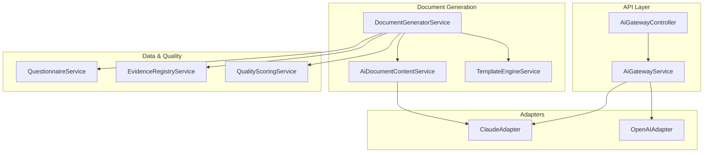

**Diagram sources**
- [ai-gateway.controller.ts:52-156](file://apps/api/src/modules/ai-gateway/ai-gateway.controller.ts#L52-L156)
- [ai-gateway.service.ts:39-81](file://apps/api/src/modules/ai-gateway/ai-gateway.service.ts#L39-L81)
- [claude.adapter.ts:1-283](file://apps/api/src/modules/ai-gateway/adapters/claude.adapter.ts#L1-L283)
- [openai.adapter.ts:1-310](file://apps/api/src/modules/ai-gateway/adapters/openai.adapter.ts#L1-L310)
- [document-generator.service.ts:1-609](file://apps/api/src/modules/document-generator/services/document-generator.service.ts#L1-L609)
- [ai-document-content.service.ts:1-359](file://apps/api/src/modules/document-generator/services/ai-document-content.service.ts#L1-L359)
- [template-engine.service.ts:1-56](file://apps/api/src/modules/document-generator/services/template-engine.service.ts#L1-L56)
- [questionnaire.service.ts:281-320](file://apps/api/src/modules/questionnaire/questionnaire.service.ts#L281-L320)
- [evidence-registry.service.ts:746-786](file://apps/api/src/modules/evidence-registry/evidence-registry.service.ts#L746-L786)
- [quality-scoring.service.ts:1-339](file://apps/api/src/modules/quality-scoring/services/quality-scoring.service.ts#L1-L339)

**Section sources**
- [ai-gateway.controller.ts:52-156](file://apps/api/src/modules/ai-gateway/ai-gateway.controller.ts#L52-L156)
- [ai-gateway.service.ts:39-81](file://apps/api/src/modules/ai-gateway/ai-gateway.service.ts#L39-L81)

## Core Components
- AI Gateway: loads provider configs, routes requests, streams responses, tracks health, and exposes provider availability.
- Claude/OpenAI Adapters: provider-specific clients implementing a common adapter interface, including token estimation, cost calculation, and streaming support.
- Document Generator: validates sessions, orchestrates AI or template-based generation, uploads artifacts, and notifies users.
- AI Document Content Service: prompts Claude to generate structured document content from questionnaire answers and template sections.
- Template Engine: assembles structured TemplateData from questionnaire sessions and document types.
- Quality Scoring: computes completeness/confidence and dimensional scores to guide pricing and quality monitoring.
- Evidence Registry: aggregates evidence coverage by dimension and question to inform content quality.

**Section sources**
- [ai-gateway.interface.ts:1-212](file://apps/api/src/modules/ai-gateway/interfaces/ai-gateway.interface.ts#L1-L212)
- [claude.adapter.ts:1-283](file://apps/api/src/modules/ai-gateway/adapters/claude.adapter.ts#L1-L283)
- [openai.adapter.ts:1-310](file://apps/api/src/modules/ai-gateway/adapters/openai.adapter.ts#L1-L310)
- [document-generator.service.ts:1-609](file://apps/api/src/modules/document-generator/services/document-generator.service.ts#L1-L609)
- [ai-document-content.service.ts:1-359](file://apps/api/src/modules/document-generator/services/ai-document-content.service.ts#L1-L359)
- [template-engine.service.ts:1-56](file://apps/api/src/modules/document-generator/services/template-engine.service.ts#L1-L56)
- [quality-scoring.service.ts:1-339](file://apps/api/src/modules/quality-scoring/services/quality-scoring.service.ts#L1-L339)
- [evidence-registry.service.ts:746-786](file://apps/api/src/modules/evidence-registry/evidence-registry.service.ts#L746-L786)

## Architecture Overview
The AI Gateway abstracts provider differences and exposes a unified request/response contract. Document generation integrates AI content generation when available, otherwise falls back to template-based assembly. Quality scoring and evidence coverage feed back into content refinement and admin monitoring.

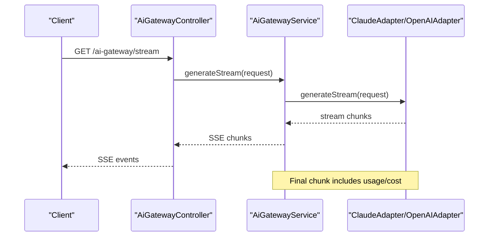

**Diagram sources**
- [ai-gateway.controller.ts:67-127](file://apps/api/src/modules/ai-gateway/ai-gateway.controller.ts#L67-L127)
- [ai-gateway.service.ts:39-81](file://apps/api/src/modules/ai-gateway/ai-gateway.service.ts#L39-L81)
- [claude.adapter.ts:177-252](file://apps/api/src/modules/ai-gateway/adapters/claude.adapter.ts#L177-L252)
- [openai.adapter.ts:204-279](file://apps/api/src/modules/ai-gateway/adapters/openai.adapter.ts#L204-L279)

## Detailed Component Analysis

### AI Provider Adapters (Claude and OpenAI)
Both adapters implement a common interface, exposing:
- Availability checks based on configured API keys
- Non-streaming and streaming generation
- Token usage extraction and cost calculation
- Provider-specific model selection, max tokens, and temperature defaults

Key behaviors:
- Provider configuration loaded from database and applied to adapters
- Streaming uses provider-native streams and yields SSE-compatible chunks
- Costs computed from usage and provider pricing configuration
- Finish reasons normalized to a common set

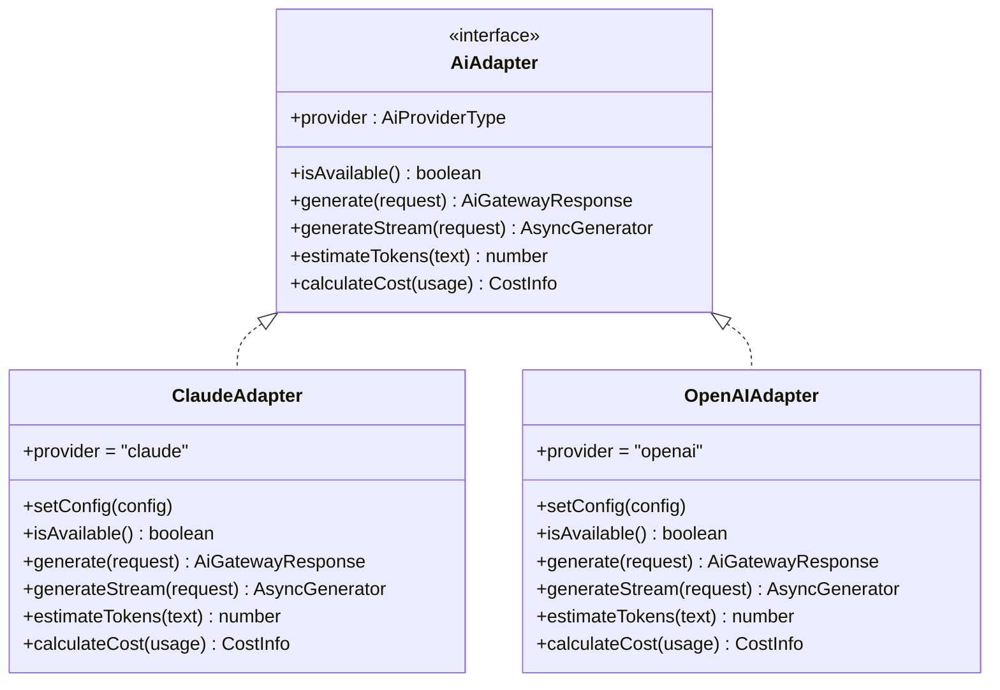

**Diagram sources**
- [ai-gateway.interface.ts:144-165](file://apps/api/src/modules/ai-gateway/interfaces/ai-gateway.interface.ts#L144-L165)
- [claude.adapter.ts:1-283](file://apps/api/src/modules/ai-gateway/adapters/claude.adapter.ts#L1-L283)
- [openai.adapter.ts:1-310](file://apps/api/src/modules/ai-gateway/adapters/openai.adapter.ts#L1-L310)

**Section sources**
- [claude.adapter.ts:31-111](file://apps/api/src/modules/ai-gateway/adapters/claude.adapter.ts#L31-L111)
- [openai.adapter.ts:31-111](file://apps/api/src/modules/ai-gateway/adapters/openai.adapter.ts#L31-L111)
- [ai-gateway.interface.ts:167-197](file://apps/api/src/modules/ai-gateway/interfaces/ai-gateway.interface.ts#L167-L197)

### AI Gateway Service and Controller
- Loads provider configurations from the database and applies them to adapters
- Exposes health, provider availability, and streaming endpoints
- Streams responses to clients using Server-Sent Events (SSE)

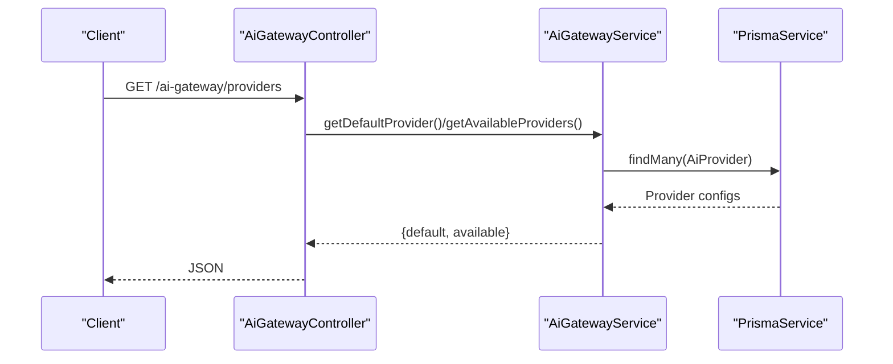

**Diagram sources**
- [ai-gateway.controller.ts:142-156](file://apps/api/src/modules/ai-gateway/ai-gateway.controller.ts#L142-L156)
- [ai-gateway.service.ts:49-81](file://apps/api/src/modules/ai-gateway/ai-gateway.service.ts#L49-L81)

**Section sources**
- [ai-gateway.service.ts:49-81](file://apps/api/src/modules/ai-gateway/ai-gateway.service.ts#L49-L81)
- [ai-gateway.controller.ts:132-156](file://apps/api/src/modules/ai-gateway/ai-gateway.controller.ts#L132-L156)

### Document Generation Workflow
The system supports two generation modes:
- AI-powered: uses AiDocumentContentService to generate structured content via Claude, then builds a DOCX
- Template-based: assembles TemplateData from questionnaire responses and renders a DOCX

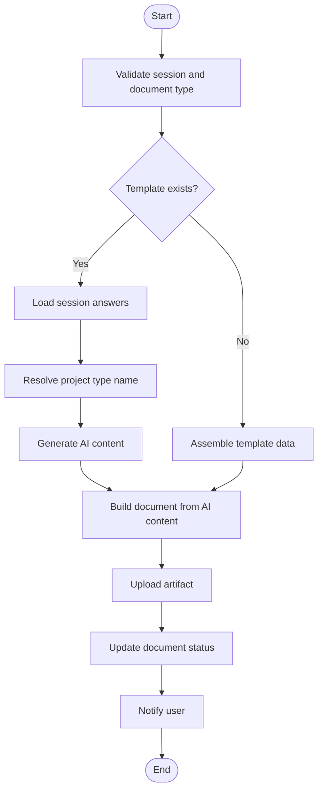

**Diagram sources**
- [document-generator.service.ts:142-219](file://apps/api/src/modules/document-generator/services/document-generator.service.ts#L142-L219)
- [ai-document-content.service.ts:94-153](file://apps/api/src/modules/document-generator/services/ai-document-content.service.ts#L94-L153)
- [template-engine.service.ts:44-118](file://apps/api/src/modules/document-generator/services/template-engine.service.ts#L44-L118)

**Section sources**
- [document-generator.service.ts:37-219](file://apps/api/src/modules/document-generator/services/document-generator.service.ts#L37-L219)
- [ai-document-content.service.ts:94-359](file://apps/api/src/modules/document-generator/services/ai-document-content.service.ts#L94-L359)
- [template-engine.service.ts:44-118](file://apps/api/src/modules/document-generator/services/template-engine.service.ts#L44-L118)

### Prompt Engineering Strategies
- System prompts instruct Claude to write professional, data-driven content and respond with strict JSON schemas
- User messages include structured sections for questionnaire responses and required document sections
- Placeholder content ensures meaningful output when AI is unavailable

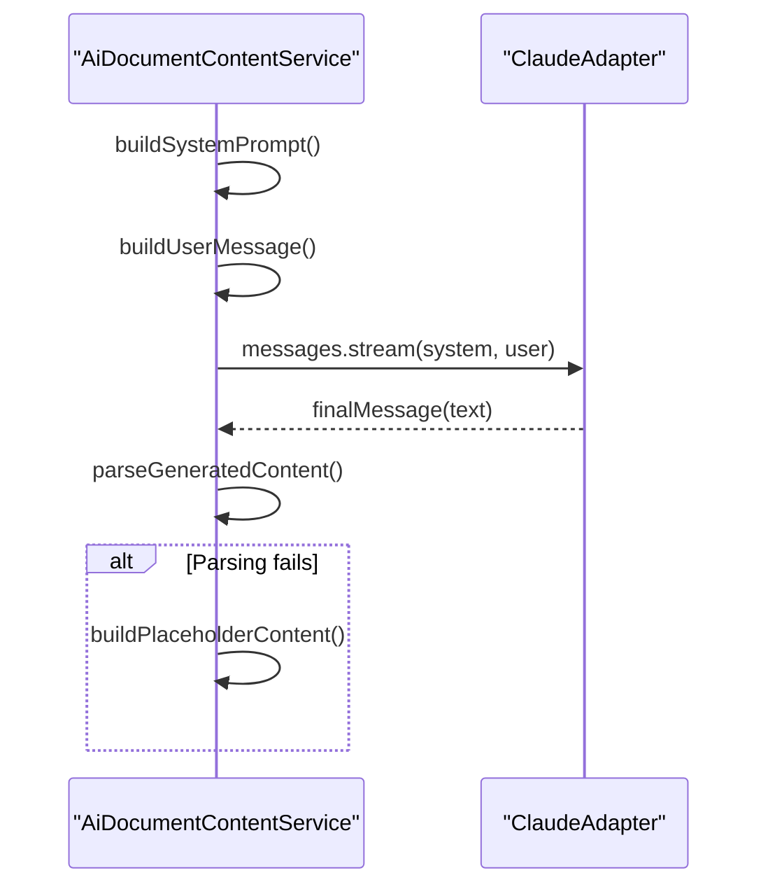

**Diagram sources**
- [ai-document-content.service.ts:116-153](file://apps/api/src/modules/document-generator/services/ai-document-content.service.ts#L116-L153)
- [claude.adapter.ts:177-252](file://apps/api/src/modules/ai-gateway/adapters/claude.adapter.ts#L177-L252)

**Section sources**
- [ai-document-content.service.ts:159-206](file://apps/api/src/modules/document-generator/services/ai-document-content.service.ts#L159-L206)
- [claude.adapter.ts:113-126](file://apps/api/src/modules/ai-gateway/adapters/claude.adapter.ts#L113-L126)

### Content Injection Patterns and Multi-turn Conversations
- The unified request interface supports multi-turn conversations with roles and optional names
- Streaming responses enable real-time content delivery with SSE
- JSON mode can be requested for structured outputs

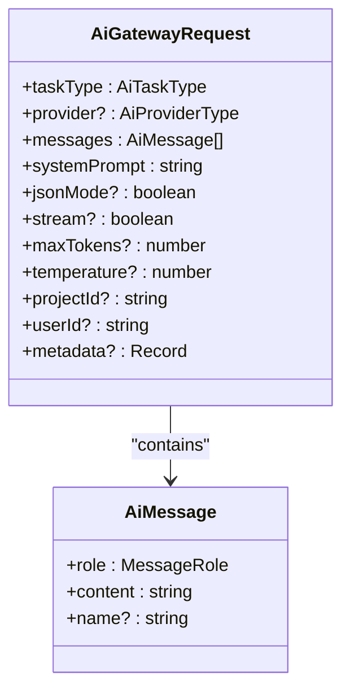

**Diagram sources**
- [ai-gateway.interface.ts:24-68](file://apps/api/src/modules/ai-gateway/interfaces/ai-gateway.interface.ts#L24-L68)

**Section sources**
- [ai-gateway.interface.ts:8-68](file://apps/api/src/modules/ai-gateway/interfaces/ai-gateway.interface.ts#L8-L68)
- [ai-gateway.controller.ts:67-127](file://apps/api/src/modules/ai-gateway/ai-gateway.controller.ts#L67-L127)

### Quality Calibration and Evidence Integration
- Quality scoring computes completeness and confidence across benchmark criteria
- Evidence registry summarizes coverage by dimension and question to guide content quality
- Recommendations suggest missing criteria and follow-up questions

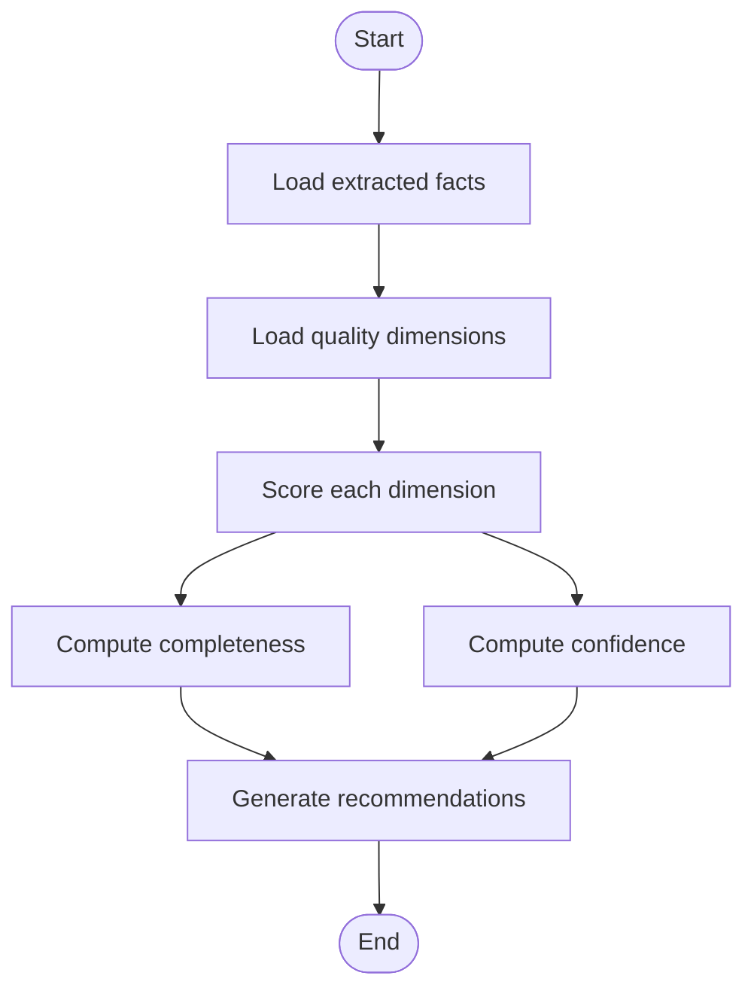

**Diagram sources**
- [quality-scoring.service.ts:36-94](file://apps/api/src/modules/quality-scoring/services/quality-scoring.service.ts#L36-L94)
- [evidence-registry.service.ts:750-786](file://apps/api/src/modules/evidence-registry/evidence-registry.service.ts#L750-L786)

**Section sources**
- [quality-scoring.service.ts:36-339](file://apps/api/src/modules/quality-scoring/services/quality-scoring.service.ts#L36-L339)
- [evidence-registry.service.ts:746-786](file://apps/api/src/modules/evidence-registry/evidence-registry.service.ts#L746-L786)

### Admin Controls and Monitoring
- Provider management: providers are loaded from the database and applied to adapters at startup
- Health and availability: controller endpoints expose default provider and available providers
- Feature flags: dynamic rate limiting configuration is exposed via feature flags

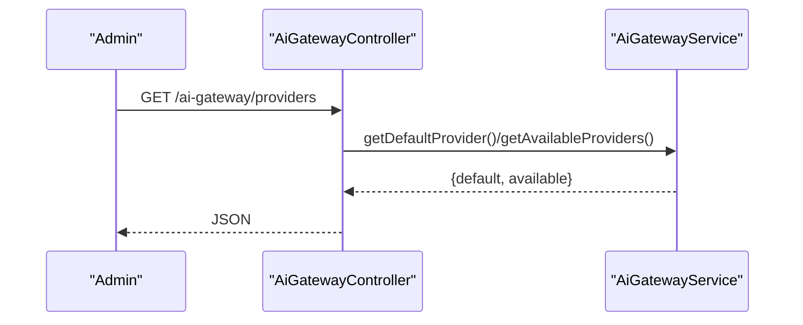

**Diagram sources**
- [ai-gateway.controller.ts:142-156](file://apps/api/src/modules/ai-gateway/ai-gateway.controller.ts#L142-L156)
- [ai-gateway.service.ts:49-81](file://apps/api/src/modules/ai-gateway/ai-gateway.service.ts#L49-L81)

**Section sources**
- [ai-gateway.controller.ts:132-156](file://apps/api/src/modules/ai-gateway/ai-gateway.controller.ts#L132-L156)
- [feature-flags.config.ts:544-596](file://apps/api/src/config/feature-flags.config.ts#L544-L596)

## Dependency Analysis
- Adapters depend on provider SDKs and environment variables for API keys
- Document generator depends on AI content service and template engine
- Quality scoring and evidence registry integrate with the data layer
- Admin and feature flags influence runtime behavior and rate limiting

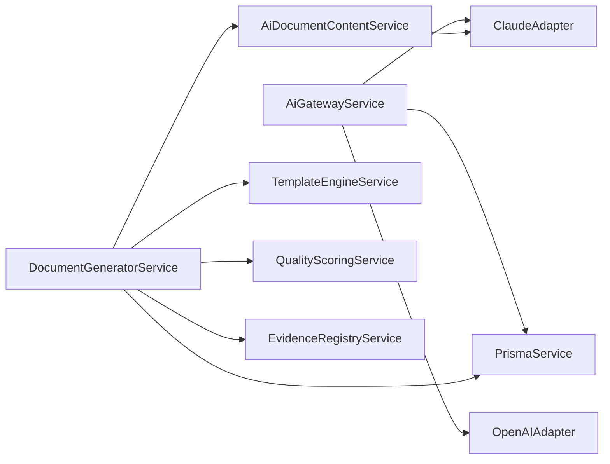

**Diagram sources**
- [ai-gateway.service.ts:49-81](file://apps/api/src/modules/ai-gateway/ai-gateway.service.ts#L49-L81)
- [claude.adapter.ts:1-283](file://apps/api/src/modules/ai-gateway/adapters/claude.adapter.ts#L1-L283)
- [openai.adapter.ts:1-310](file://apps/api/src/modules/ai-gateway/adapters/openai.adapter.ts#L1-L310)
- [document-generator.service.ts:25-32](file://apps/api/src/modules/document-generator/services/document-generator.service.ts#L25-L32)
- [quality-scoring.service.ts:1-339](file://apps/api/src/modules/quality-scoring/services/quality-scoring.service.ts#L1-L339)
- [evidence-registry.service.ts:746-786](file://apps/api/src/modules/evidence-registry/evidence-registry.service.ts#L746-L786)

**Section sources**
- [ai-gateway.service.ts:49-81](file://apps/api/src/modules/ai-gateway/ai-gateway.service.ts#L49-L81)
- [document-generator.service.ts:25-32](file://apps/api/src/modules/document-generator/services/document-generator.service.ts#L25-L32)

## Performance Considerations
- Streaming reduces latency and avoids timeouts for long-form generation
- Token estimation and cost calculation enable budget-aware prompting
- Dynamic rate limiting via feature flags allows environment-specific tuning
- Caching and reuse of structured content can reduce repeated work

[No sources needed since this section provides general guidance]

## Troubleshooting Guide
Common issues and recovery strategies:
- Missing API keys: adapters become unavailable; streaming and generation will fail early
- Empty or malformed AI responses: parsing failures trigger placeholder content generation
- Client disconnect during streaming: SSE loop detects closure and stops sending
- Provider unavailability: controller returns internal server errors; fallbacks apply upstream

**Section sources**
- [claude.adapter.ts:31-39](file://apps/api/src/modules/ai-gateway/adapters/claude.adapter.ts#L31-L39)
- [openai.adapter.ts:31-39](file://apps/api/src/modules/ai-gateway/adapters/openai.adapter.ts#L31-L39)
- [ai-document-content.service.ts:94-110](file://apps/api/src/modules/document-generator/services/ai-document-content.service.ts#L94-L110)
- [ai-gateway.controller.ts:86-127](file://apps/api/src/modules/ai-gateway/ai-gateway.controller.ts#L86-L127)

## Conclusion
The AI-assisted content generation system combines a flexible AI Gateway with provider adapters, robust document generation, and quality monitoring. It supports streaming, structured outputs, and graceful fallbacks while enabling admin controls and dynamic configuration.

[No sources needed since this section summarizes without analyzing specific files]

## Appendices

### Relationship Between Questionnaire Responses, Evidence Registry, and Generated Content
- Questionnaire responses feed both template assembly and AI content generation
- Evidence registry coverage informs quality scoring and recommendations
- Document generation integrates these signals to produce high-quality outputs

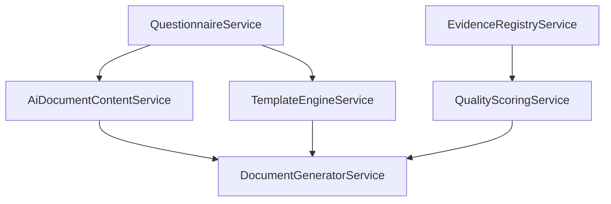

**Diagram sources**
- [questionnaire.service.ts:281-320](file://apps/api/src/modules/questionnaire/questionnaire.service.ts#L281-L320)
- [template-engine.service.ts:44-118](file://apps/api/src/modules/document-generator/services/template-engine.service.ts#L44-L118)
- [ai-document-content.service.ts:94-153](file://apps/api/src/modules/document-generator/services/ai-document-content.service.ts#L94-L153)
- [evidence-registry.service.ts:746-786](file://apps/api/src/modules/evidence-registry/evidence-registry.service.ts#L746-L786)
- [quality-scoring.service.ts:36-94](file://apps/api/src/modules/quality-scoring/services/quality-scoring.service.ts#L36-L94)
- [document-generator.service.ts:142-219](file://apps/api/src/modules/document-generator/services/document-generator.service.ts#L142-L219)

### Examples of Prompt Templates and Content Formatting
- System prompt: defines professional writing tone, data fidelity, and required JSON schema
- User message: includes structured questionnaire responses and required sections
- Placeholder content: maintains structure and hints for missing AI content

**Section sources**
- [ai-document-content.service.ts:159-206](file://apps/api/src/modules/document-generator/services/ai-document-content.service.ts#L159-L206)
- [ai-document-content.service.ts:298-357](file://apps/api/src/modules/document-generator/services/ai-document-content.service.ts#L298-L357)

### Cost Tracking and Optimization Strategies
- Token usage and costs are calculated per provider adapter
- Pricing configuration is stored in provider config and used for cost computation
- Recommendations:
  - Tune max tokens and temperature per task type
  - Prefer JSON mode for structured outputs to reduce retries
  - Monitor finish reasons to adjust prompts and limits

**Section sources**
- [claude.adapter.ts:266-281](file://apps/api/src/modules/ai-gateway/adapters/claude.adapter.ts#L266-L281)
- [openai.adapter.ts:293-308](file://apps/api/src/modules/ai-gateway/adapters/openai.adapter.ts#L293-L308)
- [ai-gateway.interface.ts:167-197](file://apps/api/src/modules/ai-gateway/interfaces/ai-gateway.interface.ts#L167-L197)

### Fallback Procedures
- If Claude API key is missing, AI content generation falls back to placeholder content
- If template is missing, legacy template-based generation is used
- Streaming failures emit error events and close the connection gracefully

**Section sources**
- [ai-document-content.service.ts:71-81](file://apps/api/src/modules/document-generator/services/ai-document-content.service.ts#L71-L81)
- [document-generator.service.ts:176-187](file://apps/api/src/modules/document-generator/services/document-generator.service.ts#L176-L187)
- [ai-gateway.controller.ts:113-127](file://apps/api/src/modules/ai-gateway/ai-gateway.controller.ts#L113-L127)

### Admin Controls for Provider Management
- Providers are loaded from the database and applied to adapters at startup
- Health and availability endpoints expose provider status
- Feature flags control rate limiting behavior

**Section sources**
- [ai-gateway.service.ts:49-81](file://apps/api/src/modules/ai-gateway/ai-gateway.service.ts#L49-L81)
- [ai-gateway.controller.ts:132-156](file://apps/api/src/modules/ai-gateway/ai-gateway.controller.ts#L132-L156)
- [feature-flags.config.ts:544-596](file://apps/api/src/config/feature-flags.config.ts#L544-L596)