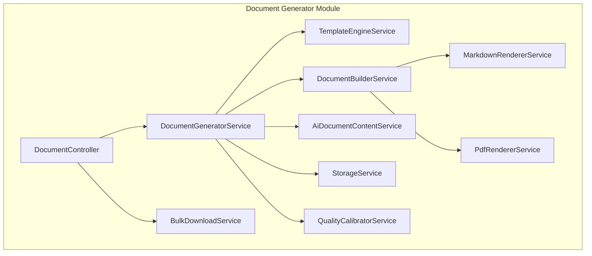
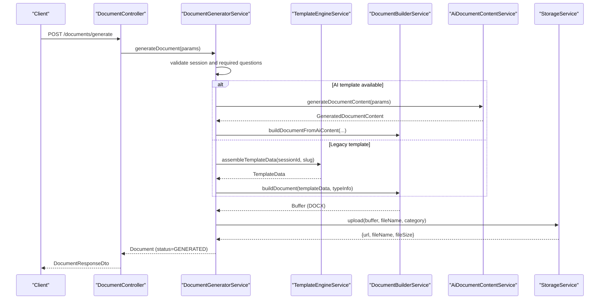
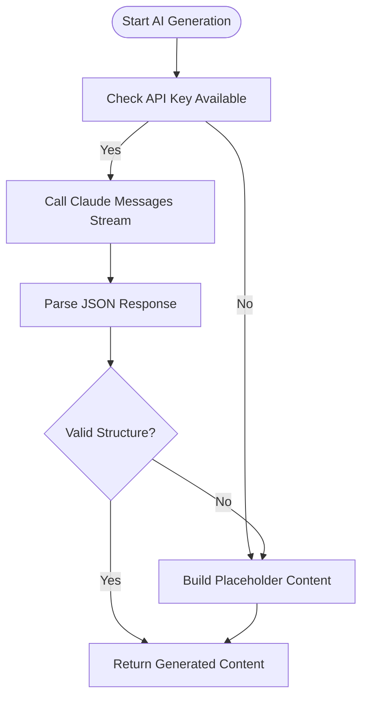
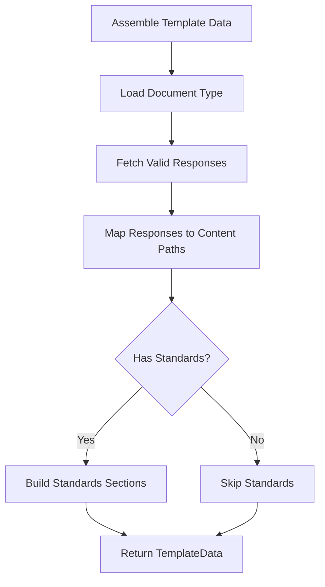
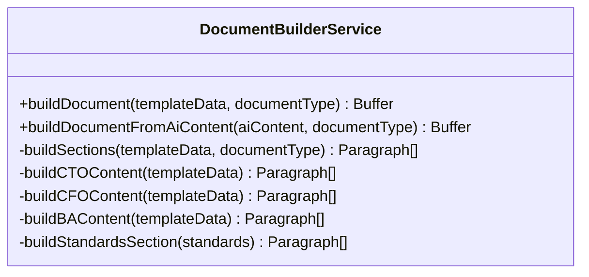
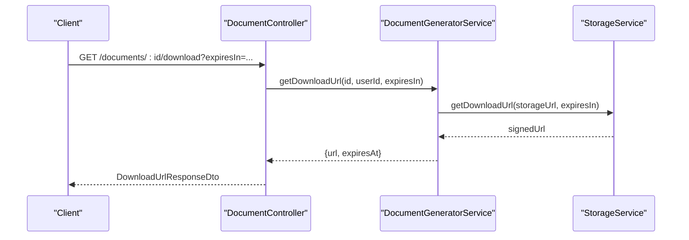
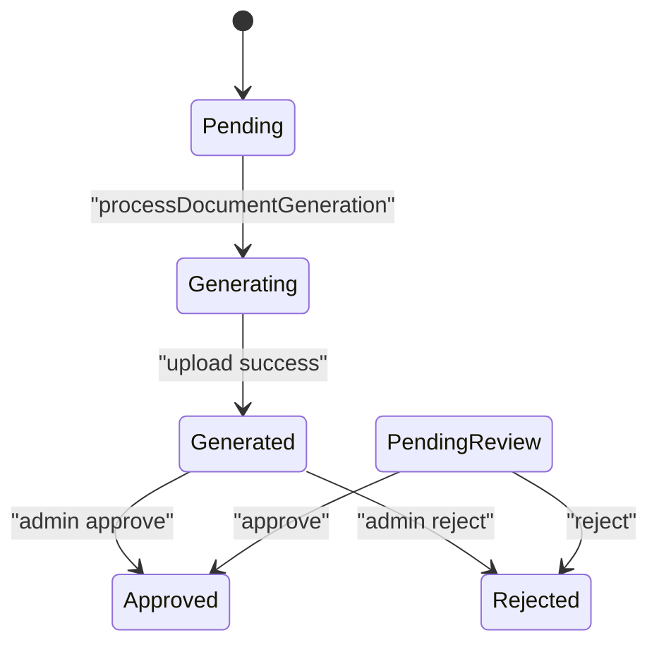
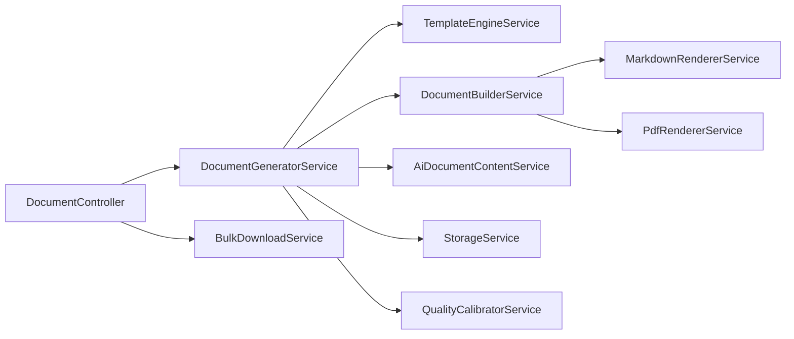
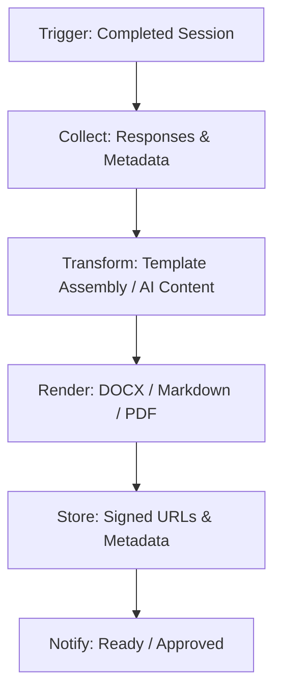

# Document Generation

<cite>
**Referenced Files in This Document**
- [document-generator.module.ts](file://apps/api/src/modules/document-generator/document-generator.module.ts)
- [document.controller.ts](file://apps/api/src/modules/document-generator/controllers/document.controller.ts)
- [document-generator.service.ts](file://apps/api/src/modules/document-generator/services/document-generator.service.ts)
- [ai-document-content.service.ts](file://apps/api/src/modules/document-generator/services/ai-document-content.service.ts)
- [template-engine.service.ts](file://apps/api/src/modules/document-generator/services/template-engine.service.ts)
- [document-builder.service.ts](file://apps/api/src/modules/document-generator/services/document-builder.service.ts)
- [create-document-type.dto.ts](file://apps/api/src/modules/document-generator/dto/create-document-type.dto.ts)
- [03-product-architecture.md](file://docs/cto/03-product-architecture.md)
- [document.controller.ts](file://apps/api/src/modules/document-generator/controllers/document.controller.ts)
- [document-generator.service.ts](file://apps/api/src/modules/document-generator/services/document-generator.service.ts)
- [ai-document-content.service.ts](file://apps/api/src/modules/document-generator/services/ai-document-content.service.ts)
- [template-engine.service.ts](file://apps/api/src/modules/document-generator/services/template-engine.service.ts)
- [document-builder.service.ts](file://apps/api/src/modules/document-generator/services/document-builder.service.ts)
- [document-generator.service.spec.ts](file://apps/api/src/modules/document-generator/services/document-generator.service.spec.ts)
- [template-engine.service.spec.ts](file://apps/api/src/modules/document-generator/tests/template-engine.service.spec.ts)
</cite>

## Table of Contents
1. [Introduction](#introduction)
2. [Project Structure](#project-structure)
3. [Core Components](#core-components)
4. [Architecture Overview](#architecture-overview)
5. [Detailed Component Analysis](#detailed-component-analysis)
6. [Dependency Analysis](#dependency-analysis)
7. [Performance Considerations](#performance-considerations)
8. [Troubleshooting Guide](#troubleshooting-guide)
9. [Conclusion](#conclusion)
10. [Appendices](#appendices)

## Introduction
This document describes the automated document generation system that transforms questionnaire responses into structured, professional documents. It supports multiple document types across categories (Architecture Dossier, SDLC Playbook, Test Strategy, DevSecOps Guide, Policy Pack, Business Case, and others), integrates AI-assisted content generation via Claude, and compiles outputs into DOCX, with support for PDF and Markdown rendering pathways. The system includes robust quality calibration, versioning, review workflows, bulk processing, and secure delivery with audit trails.

## Project Structure
The document generation capability is implemented as a NestJS module with controllers, services, DTOs, and templates. The module exposes REST endpoints for initiating generation, listing document types, retrieving documents, downloading versions, and bulk downloads. Services encapsulate the AI content generation, template assembly, document building, storage, and quality calibration.

**Diagram sources**
- [document-generator.module.ts:19-46](file://apps/api/src/modules/document-generator/document-generator.module.ts#L19-L46)
- [document.controller.ts:35-43](file://apps/api/src/modules/document-generator/controllers/document.controller.ts#L35-L43)
- [document-generator.service.ts:21-32](file://apps/api/src/modules/document-generator/services/document-generator.service.ts#L21-L32)

**Section sources**
- [document-generator.module.ts:1-47](file://apps/api/src/modules/document-generator/document-generator.module.ts#L1-L47)
- [document.controller.ts:35-43](file://apps/api/src/modules/document-generator/controllers/document.controller.ts#L35-L43)

## Core Components
- DocumentController: Exposes endpoints for document generation, listing document types, session documents, download URLs, and bulk downloads. Handles pagination, filtering, and access control.
- DocumentGeneratorService: Orchestrates the generation pipeline, validates sessions and required questions, selects AI or template-based generation, builds documents, uploads to storage, updates metadata, and notifies users.
- TemplateEngineService: Assembles structured template data from questionnaire responses, applies document mappings, and constructs standardized sections for specific categories.
- DocumentBuilderService: Converts structured content into DOCX using docxtemplater-compatible constructs, applying styles, headers, footers, and category-specific layouts.
- AiDocumentContentService: Generates structured content using Claude, with fallback to placeholder content when the API key is unavailable.
- StorageService: Manages secure file uploads and download URLs.
- MarkdownRendererService and PdfRendererService: Provide rendering pathways for Markdown previews and PDF exports.
- QualityCalibratorService: Implements quality calibration and review workflows.
- BulkDownloadService: Creates ZIP archives for session or selected documents.

**Section sources**
- [document.controller.ts:45-278](file://apps/api/src/modules/document-generator/controllers/document.controller.ts#L45-L278)
- [document-generator.service.ts:37-609](file://apps/api/src/modules/document-generator/services/document-generator.service.ts#L37-L609)
- [template-engine.service.ts:44-318](file://apps/api/src/modules/document-generator/services/template-engine.service.ts#L44-L318)
- [document-builder.service.ts:35-539](file://apps/api/src/modules/document-generator/services/document-builder.service.ts#L35-L539)
- [ai-document-content.service.ts:94-359](file://apps/api/src/modules/document-generator/services/ai-document-content.service.ts#L94-L359)

## Architecture Overview
The system follows a modular pipeline: trigger generation from a completed session, collect and transform questionnaire responses, render into DOCX (with optional AI enrichment), store securely, and deliver via signed URLs. Versioning and review workflows are integrated for quality control.

**Diagram sources**
- [document.controller.ts:54-65](file://apps/api/src/modules/document-generator/controllers/document.controller.ts#L54-L65)
- [document-generator.service.ts:142-219](file://apps/api/src/modules/document-generator/services/document-generator.service.ts#L142-L219)
- [template-engine.service.ts:44-103](file://apps/api/src/modules/document-generator/services/template-engine.service.ts#L44-L103)
- [document-builder.service.ts:75-124](file://apps/api/src/modules/document-generator/services/document-builder.service.ts#L75-L124)
- [ai-document-content.service.ts:94-110](file://apps/api/src/modules/document-generator/services/ai-document-content.service.ts#L94-L110)

## Detailed Component Analysis

### Document Types and Categories
Supported document types are categorized (e.g., CTO, CFO, BA) and include metadata such as slugs, descriptions, required questions, output formats, and activity flags. The system enforces required questions and project-type scoping.

- Document types are persisted and queried from the database.
- Required questions ensure sufficient data for generation.
- Category-driven content builders produce tailored layouts.

**Section sources**
- [create-document-type.dto.ts:17-72](file://apps/api/src/modules/document-generator/dto/create-document-type.dto.ts#L17-L72)
- [document-generator.service.ts:64-100](file://apps/api/src/modules/document-generator/services/document-generator.service.ts#L64-L100)
- [document-generator.service.ts:414-429](file://apps/api/src/modules/document-generator/services/document-generator.service.ts#L414-L429)

### AI-Assisted Content Generation
The AI service integrates with Claude to produce structured content (title, sections, summary) based on questionnaire responses and template sections. It includes:
- Streaming API calls with extended thinking for quality.
- Robust parsing and fallback to placeholder content when API keys are missing or responses are invalid.
- Prompt engineering focused on professional, data-driven outputs.

**Diagram sources**
- [ai-document-content.service.ts:94-110](file://apps/api/src/modules/document-generator/services/ai-document-content.service.ts#L94-L110)
- [ai-document-content.service.ts:116-153](file://apps/api/src/modules/document-generator/services/ai-document-content.service.ts#L116-L153)
- [ai-document-content.service.ts:251-291](file://apps/api/src/modules/document-generator/services/ai-document-content.service.ts#L251-L291)

**Section sources**
- [ai-document-content.service.ts:94-359](file://apps/api/src/modules/document-generator/services/ai-document-content.service.ts#L94-L359)

### Template Engine and Data Assembly
The template engine:
- Loads document types and standard mappings.
- Aggregates validated responses and maps them to nested content paths defined by document mappings.
- Supports safe path construction and sanitization against unsafe segments.
- Builds standards sections for CTO documents.

**Diagram sources**
- [template-engine.service.ts:44-103](file://apps/api/src/modules/document-generator/services/template-engine.service.ts#L44-L103)
- [template-engine.service.ts:108-137](file://apps/api/src/modules/document-generator/services/template-engine.service.ts#L108-L137)
- [template-engine.service.ts:255-277](file://apps/api/src/modules/document-generator/services/template-engine.service.ts#L255-L277)

**Section sources**
- [template-engine.service.ts:44-318](file://apps/api/src/modules/document-generator/services/template-engine.service.ts#L44-L318)

### Document Building and Rendering
The builder:
- Produces DOCX documents with consistent styles, headers, footers, and category-specific sections.
- Supports AI-generated content by splitting content into paragraphs and adding headings.
- Provides hooks for Markdown and PDF rendering services.

**Diagram sources**
- [document-builder.service.ts:35-539](file://apps/api/src/modules/document-generator/services/document-builder.service.ts#L35-L539)

**Section sources**
- [document-builder.service.ts:35-539](file://apps/api/src/modules/document-generator/services/document-builder.service.ts#L35-L539)

### Multi-Format Export and Delivery
- DOCX export is produced by the builder and stored with metadata.
- Markdown and PDF rendering services are available for preview and export.
- Secure download URLs are generated with configurable expiration.
- Bulk download endpoints support session-wide and selected document ZIP creation.

**Diagram sources**
- [document.controller.ts:129-141](file://apps/api/src/modules/document-generator/controllers/document.controller.ts#L129-L141)
- [document-generator.service.ts:371-388](file://apps/api/src/modules/document-generator/services/document-generator.service.ts#L371-L388)

**Section sources**
- [document.controller.ts:119-197](file://apps/api/src/modules/document-generator/controllers/document.controller.ts#L119-L197)
- [document-generator.service.ts:371-388](file://apps/api/src/modules/document-generator/services/document-generator.service.ts#L371-L388)

### Document Compilation, Versioning, and Review Workflows
- Documents are created with initial status and updated upon completion.
- Version history is maintained per session and document type.
- Admin workflows support approving or rejecting documents with audit metadata.
- Notifications are sent to document owners on readiness and approval.

**Diagram sources**
- [document-generator.service.ts:142-219](file://apps/api/src/modules/document-generator/services/document-generator.service.ts#L142-L219)
- [document-generator.service.ts:434-513](file://apps/api/src/modules/document-generator/services/document-generator.service.ts#L434-L513)

**Section sources**
- [document-generator.service.ts:311-366](file://apps/api/src/modules/document-generator/services/document-generator.service.ts#L311-L366)
- [document-generator.service.ts:434-513](file://apps/api/src/modules/document-generator/services/document-generator.service.ts#L434-L513)

### Quality Calibration and Assurance
- QualityCalibratorService participates in the generation pipeline to assess content quality and guide review.
- Validation checks ensure required fields are present when assembling template data.
- Fallback placeholder content ensures generation proceeds even without AI.

**Section sources**
- [template-engine.service.ts:299-316](file://apps/api/src/modules/document-generator/services/template-engine.service.ts#L299-L316)
- [ai-document-content.service.ts:298-311](file://apps/api/src/modules/document-generator/services/ai-document-content.service.ts#L298-L311)

### Bulk Processing and Delivery Mechanisms
- BulkDownloadService creates ZIP archives for session or selected documents.
- Responses include filename, total count, and streaming of ZIP content.

**Section sources**
- [document.controller.ts:148-197](file://apps/api/src/modules/document-generator/controllers/document.controller.ts#L148-L197)

### Storage, Metadata, and Audit Trail
- StorageService manages upload and download URL generation with metadata (filename, size).
- Document records capture generation method, timestamps, and status transitions.
- Audit fields include reviewer actions and reasons.

**Section sources**
- [document-generator.service.ts:198-211](file://apps/api/src/modules/document-generator/services/document-generator.service.ts#L198-L211)
- [document-generator.service.ts:460-481](file://apps/api/src/modules/document-generator/services/document-generator.service.ts#L460-L481)

### Integration with Questionnaire Responses and Evidence Registry
- Generation relies on validated responses from completed sessions.
- Required questions are enforced per document type.
- Standards mappings enable category-specific sections for CTO documents.

**Section sources**
- [document-generator.service.ts:77-100](file://apps/api/src/modules/document-generator/services/document-generator.service.ts#L77-L100)
- [template-engine.service.ts:46-103](file://apps/api/src/modules/document-generator/services/template-engine.service.ts#L46-L103)

### Admin Interfaces for Document Management and Quality Control
- Admin endpoints exist to list documents pending review and to approve/reject them.
- Batch operations support mass approvals and rejections with detailed results.

**Section sources**
- [document-generator.service.ts:434-513](file://apps/api/src/modules/document-generator/services/document-generator.service.ts#L434-L513)

## Dependency Analysis
The module composes multiple services with clear separation of concerns. Controllers depend on services, services depend on the database and external integrations (AI), and renderers integrate with storage.

**Diagram sources**
- [document-generator.module.ts:19-46](file://apps/api/src/modules/document-generator/document-generator.module.ts#L19-L46)

**Section sources**
- [document-generator.module.ts:19-46](file://apps/api/src/modules/document-generator/document-generator.module.ts#L19-L46)

## Performance Considerations
- Streaming AI responses prevents timeouts and improves throughput.
- Safe path construction and sanitization reduce risk and improve reliability.
- Bulk ZIP creation streams content to avoid memory pressure.
- DOCX generation uses efficient paragraph building and minimal DOM traversal.

[No sources needed since this section provides general guidance]

## Troubleshooting Guide
Common issues and resolutions:
- Session not completed: Ensure the session status is COMPLETED before generation.
- Missing required questions: Add answers for required question IDs defined per document type.
- Download URL errors: Verify document status is GENERATED or APPROVED and storage URL exists.
- AI content unavailable: Confirm ANTHROPIC_API_KEY is configured; otherwise, placeholder content is used.
- Template mapping failures: Validate document mappings and path safety.

**Section sources**
- [document-generator.service.ts:49-62](file://apps/api/src/modules/document-generator/services/document-generator.service.ts#L49-L62)
- [document-generator.service.ts:95-99](file://apps/api/src/modules/document-generator/services/document-generator.service.ts#L95-L99)
- [document-generator.service.ts:374-387](file://apps/api/src/modules/document-generator/services/document-generator.service.ts#L374-L387)
- [ai-document-content.service.ts:71-81](file://apps/api/src/modules/document-generator/services/ai-document-content.service.ts#L71-L81)
- [template-engine.service.ts:32-39](file://apps/api/src/modules/document-generator/services/template-engine.service.ts#L32-L39)

## Conclusion
The document generation system provides a scalable, secure, and extensible pipeline for transforming questionnaire responses into professional documents. It leverages AI for enriched content while maintaining fallbacks, supports multiple output formats, and integrates robust quality control, versioning, and bulk delivery mechanisms.

[No sources needed since this section summarizes without analyzing specific files]

## Appendices

### Pipeline Visualization
The end-to-end generation pipeline is documented in the product architecture reference.

**Diagram sources**
- [03-product-architecture.md:953-985](file://docs/cto/03-product-architecture.md#L953-L985)