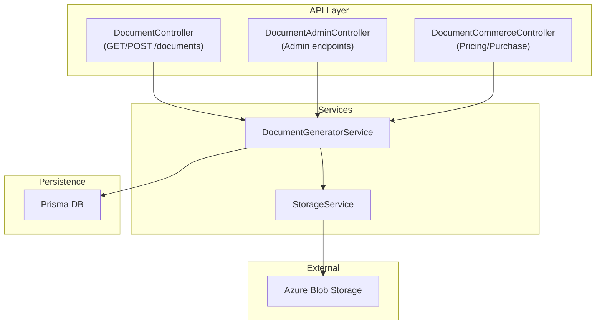
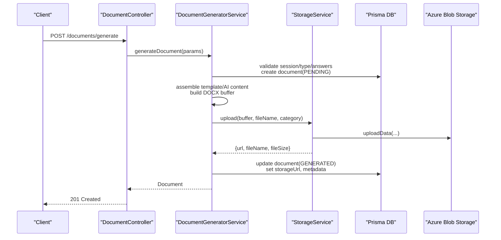
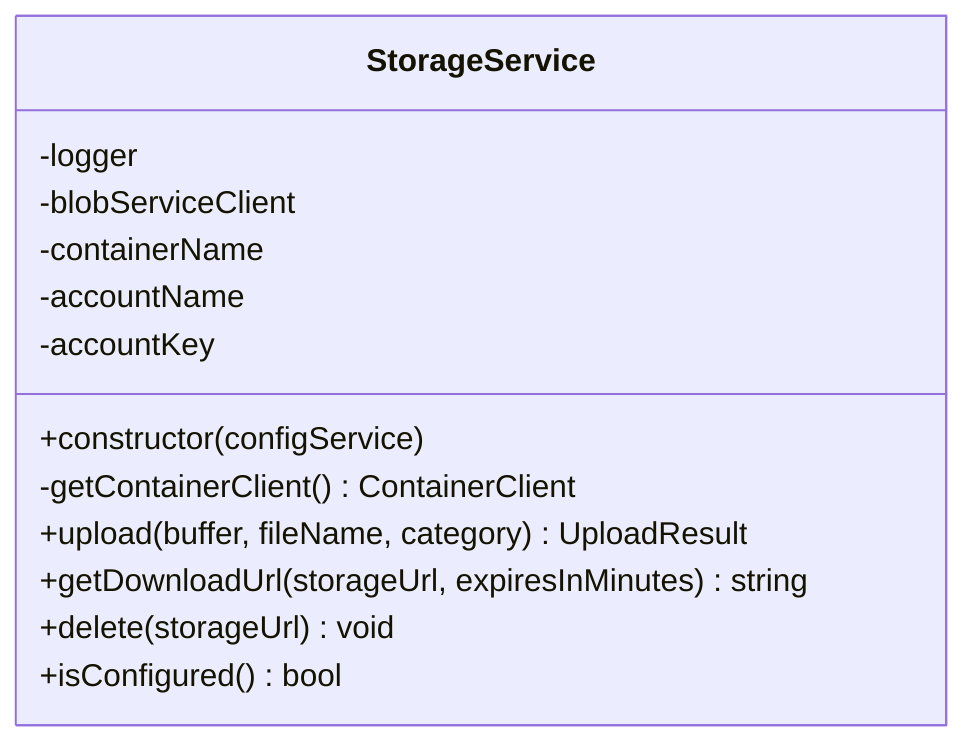
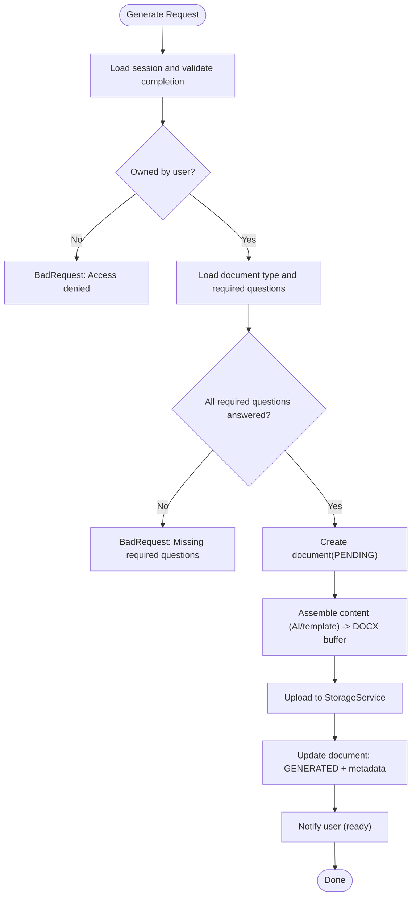
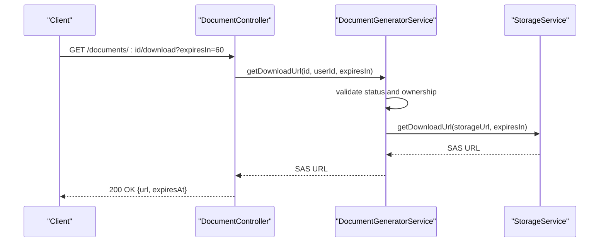
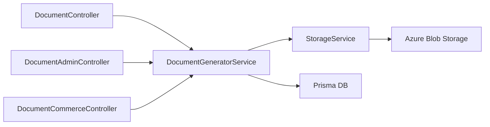

# Document Storage & Management

<cite>
**Referenced Files in This Document**
- [storage.service.ts](file://apps/api/src/modules/document-generator/services/storage.service.ts)
- [document-generator.service.ts](file://apps/api/src/modules/document-generator/services/document-generator.service.ts)
- [document.controller.ts](file://apps/api/src/modules/document-generator/controllers/document.controller.ts)
- [document-admin.controller.ts](file://apps/api/src/modules/document-generator/controllers/document-admin.controller.ts)
- [document-commerce.controller.ts](file://apps/api/src/modules/document-commerce/document-commerce.controller.ts)
- [document-response.dto.ts](file://apps/api/src/modules/document-generator/dto/document-response.dto.ts)
- [review-document.dto.ts](file://apps/api/src/modules/document-generator/dto/review-document.dto.ts)
- [03-product-architecture.md](file://docs/cto/03-product-architecture.md)
- [05-data-models-db-architecture.md](file://docs/cto/05-data-models-db-architecture.md)
- [08-information-security-policy.md](file://docs/cto/08-information-security-policy.md)
- [admin.ts](file://apps/web/src/api/admin.ts)
</cite>

## Table of Contents
1. [Introduction](#introduction)
2. [Project Structure](#project-structure)
3. [Core Components](#core-components)
4. [Architecture Overview](#architecture-overview)
5. [Detailed Component Analysis](#detailed-component-analysis)
6. [Dependency Analysis](#dependency-analysis)
7. [Performance Considerations](#performance-considerations)
8. [Troubleshooting Guide](#troubleshooting-guide)
9. [Conclusion](#conclusion)
10. [Appendices](#appendices)

## Introduction
This document describes the document storage and management system, focusing on cloud storage integration, file upload handling, metadata management, versioning, access control, retention policies, retrieval APIs, admin monitoring, and integration touchpoints with commerce and notifications. It synthesizes the implementation present in the repository and aligns it with documented policies and architecture guidelines.

## Project Structure
The document storage system spans:
- API controllers exposing document generation, retrieval, versioning, and admin workflows
- A storage service integrating with Azure Blob Storage
- A generator service orchestrating document creation, metadata updates, and cloud storage uploads
- DTOs defining API response shapes
- Admin APIs enabling moderation and batch operations
- Documentation specifying storage buckets, retention, and archival strategies

**Diagram sources**
- [document.controller.ts:36-278](file://apps/api/src/modules/document-generator/controllers/document.controller.ts#L36-L278)
- [document-admin.controller.ts:31-265](file://apps/api/src/modules/document-generator/controllers/document-admin.controller.ts#L31-L265)
- [document-commerce.controller.ts:34-98](file://apps/api/src/modules/document-commerce/document-commerce.controller.ts#L34-L98)
- [document-generator.service.ts:22-609](file://apps/api/src/modules/document-generator/services/document-generator.service.ts#L22-L609)
- [storage.service.ts:19-146](file://apps/api/src/modules/document-generator/services/storage.service.ts#L19-L146)

**Section sources**
- [document.controller.ts:36-278](file://apps/api/src/modules/document-generator/controllers/document.controller.ts#L36-L278)
- [document-admin.controller.ts:31-265](file://apps/api/src/modules/document-generator/controllers/document-admin.controller.ts#L31-L265)
- [document-commerce.controller.ts:34-98](file://apps/api/src/modules/document-commerce/document-commerce.controller.ts#L34-L98)
- [document-generator.service.ts:22-609](file://apps/api/src/modules/document-generator/services/document-generator.service.ts#L22-L609)
- [storage.service.ts:19-146](file://apps/api/src/modules/document-generator/services/storage.service.ts#L19-L146)

## Core Components
- StorageService: Handles Azure Blob Storage uploads, signed URLs (SAS), deletions, and configuration checks. It organizes blobs by category/date and returns structured upload results.
- DocumentGeneratorService: Orchestrates document generation, enforces access control, manages metadata, triggers storage uploads, and exposes versioning and download URL generation.
- Controllers: Expose REST endpoints for generation, listing, retrieval, bulk downloads, version history, and admin moderation.
- DTOs: Define response schemas for documents, document types, and download URLs.
- Admin APIs: Enable listing, approving, and rejecting documents pending review, including batch operations.

**Section sources**
- [storage.service.ts:19-146](file://apps/api/src/modules/document-generator/services/storage.service.ts#L19-L146)
- [document-generator.service.ts:22-609](file://apps/api/src/modules/document-generator/services/document-generator.service.ts#L22-L609)
- [document.controller.ts:36-278](file://apps/api/src/modules/document-generator/controllers/document.controller.ts#L36-L278)
- [document-admin.controller.ts:31-265](file://apps/api/src/modules/document-generator/controllers/document-admin.controller.ts#L31-L265)
- [document-response.dto.ts:34-84](file://apps/api/src/modules/document-generator/dto/document-response.dto.ts#L34-L84)

## Architecture Overview
The system integrates NestJS controllers with a generator service and a storage service backed by Azure Blob Storage. Metadata is persisted in the database while binary content resides in blob storage. Access control is enforced at controller/service boundaries, and admin endpoints enable moderation workflows.

**Diagram sources**
- [document.controller.ts:45-65](file://apps/api/src/modules/document-generator/controllers/document.controller.ts#L45-L65)
- [document-generator.service.ts:37-136](file://apps/api/src/modules/document-generator/services/document-generator.service.ts#L37-L136)
- [storage.service.ts:62-87](file://apps/api/src/modules/document-generator/services/storage.service.ts#L62-L87)

## Detailed Component Analysis

### StorageService
Responsibilities:
- Upload buffers to Azure Blob Storage under a structured path: category/date/filename
- Generate signed, time-limited download URLs (SAS)
- Delete blobs by URL
- Validate configuration and log operational events

Key behaviors:
- Path construction uses ISO date partitioning for efficient organization
- Content type set for Word documents during upload
- SAS generation requires stored account credentials; otherwise throws configuration error
- Deletion extracts blob path from URL and deletes if exists

**Diagram sources**
- [storage.service.ts:19-146](file://apps/api/src/modules/document-generator/services/storage.service.ts#L19-L146)

**Section sources**
- [storage.service.ts:62-144](file://apps/api/src/modules/document-generator/services/storage.service.ts#L62-L144)

### DocumentGeneratorService
Responsibilities:
- Validate prerequisites (session completion, ownership, required answers)
- Create document records with initial status
- Generate content via AI or template engine, then build DOCX
- Upload to storage and update metadata (URL, filename, size, timestamps)
- Enforce access control on retrieval and versioning
- Provide download URLs for latest and specific versions
- Support admin workflows: pending review listing, approve/reject, batch operations
- Notify users on readiness and approval

Access control highlights:
- Retrieval and versioning check document ownership against session user
- Download availability restricted to GENERATED or APPROVED statuses
- Admin endpoints enforce role-based access

**Diagram sources**
- [document-generator.service.ts:37-219](file://apps/api/src/modules/document-generator/services/document-generator.service.ts#L37-L219)

**Section sources**
- [document-generator.service.ts:37-219](file://apps/api/src/modules/document-generator/services/document-generator.service.ts#L37-L219)
- [document-generator.service.ts:262-388](file://apps/api/src/modules/document-generator/services/document-generator.service.ts#L262-L388)

### Controllers and APIs
Endpoints:
- Generation and listing
  - POST /documents/generate
  - GET /documents/types
  - GET /documents/session/:sessionId/types
  - GET /documents/session/:sessionId
  - GET /documents/:id
- Retrieval and downloads
  - GET /documents/:id/download?expiresIn=...
  - GET /documents/session/:sessionId/bulk-download
  - POST /documents/bulk-download
  - GET /documents/:id/versions
  - GET /documents/:id/versions/:version/download
- Admin moderation
  - GET /admin/documents/pending-review
  - PATCH /admin/documents/:id/approve
  - PATCH /admin/documents/:id/reject
  - POST /admin/documents/batch-approve
  - POST /admin/documents/batch-reject

Access control:
- JWT guard applied to most endpoints
- Ownership checks in service layer for retrieval/versioning
- Admin endpoints protected by roles guard

**Diagram sources**
- [document.controller.ts:119-141](file://apps/api/src/modules/document-generator/controllers/document.controller.ts#L119-L141)
- [document-generator.service.ts:371-388](file://apps/api/src/modules/document-generator/services/document-generator.service.ts#L371-L388)
- [storage.service.ts:92-122](file://apps/api/src/modules/document-generator/services/storage.service.ts#L92-L122)

**Section sources**
- [document.controller.ts:45-278](file://apps/api/src/modules/document-generator/controllers/document.controller.ts#L45-L278)
- [document-admin.controller.ts:141-263](file://apps/api/src/modules/document-generator/controllers/document-admin.controller.ts#L141-L263)

### DTOs and Responses
- DocumentResponseDto: Includes identifiers, status, format, optional metadata (fileName, fileSize), version, timestamps, and optional embedded documentType
- DocumentTypeResponseDto: Defines category, outputFormats, estimatedPages, and activity flag
- DownloadUrlResponseDto: Returns signed URL and expiration

These DTOs shape API responses and are mapped consistently across controllers.

**Section sources**
- [document-response.dto.ts:34-84](file://apps/api/src/modules/document-generator/dto/document-response.dto.ts#L34-L84)

### Admin Interfaces
Admin endpoints support:
- Listing documents pending review
- Approving or rejecting individual documents with optional notes/reason
- Batch operations for approval and rejection
- Pagination and role-based access control

Frontend admin API helpers:
- getPendingReviewDocuments(page, perPage)
- getDocumentForReview(documentId)
- approveDocument(documentId, request?)
- rejectDocument(documentId, request)

**Section sources**
- [document-admin.controller.ts:141-263](file://apps/api/src/modules/document-generator/controllers/document-admin.controller.ts#L141-L263)
- [review-document.dto.ts:4-22](file://apps/api/src/modules/document-generator/dto/review-document.dto.ts#L4-L22)
- [admin.ts:78-119](file://apps/web/src/api/admin.ts#L78-L119)

## Dependency Analysis
- Controllers depend on services for orchestration
- DocumentGeneratorService depends on:
  - Prisma for persistence
  - StorageService for cloud storage
  - Template/AI services for content assembly
  - Notification service for user communication
- StorageService depends on Azure Blob SDK and configuration

**Diagram sources**
- [document.controller.ts:36-278](file://apps/api/src/modules/document-generator/controllers/document.controller.ts#L36-L278)
- [document-admin.controller.ts:31-265](file://apps/api/src/modules/document-generator/controllers/document-admin.controller.ts#L31-L265)
- [document-commerce.controller.ts:34-98](file://apps/api/src/modules/document-commerce/document-commerce.controller.ts#L34-L98)
- [document-generator.service.ts:22-609](file://apps/api/src/modules/document-generator/services/document-generator.service.ts#L22-L609)
- [storage.service.ts:19-146](file://apps/api/src/modules/document-generator/services/storage.service.ts#L19-L146)

**Section sources**
- [document-generator.service.ts:22-609](file://apps/api/src/modules/document-generator/services/document-generator.service.ts#L22-L609)
- [storage.service.ts:19-146](file://apps/api/src/modules/document-generator/services/storage.service.ts#L19-L146)

## Performance Considerations
- Blob organization by category/date supports scalable listing and pruning
- Signed URLs avoid server bandwidth for downloads
- Async generation allows immediate response while processing continues
- Caching strategies for frequently accessed metadata and templates are recommended (see product architecture)

[No sources needed since this section provides general guidance]

## Troubleshooting Guide
Common issues and resolutions:
- Storage not configured
  - Symptom: Storage operations fail or warn about missing connection string
  - Resolution: Provide AZURE_STORAGE_CONNECTION_STRING and ensure container name is set
- Download URL generation fails
  - Symptom: Error indicating credentials not configured
  - Resolution: Confirm account name/key are extracted from connection string or configure credentials
- Access denied on retrieval
  - Symptom: BadRequest when accessing another user’s document
  - Resolution: Ensure caller owns the session associated with the document
- Download not available
  - Symptom: BadRequest when requesting download for non-generated/non-approved document
  - Resolution: Wait until document reaches GENERATED or APPROVED status
- Version not found
  - Symptom: NotFound when requesting a specific version
  - Resolution: Verify version number matches existing records for the session and document type

**Section sources**
- [storage.service.ts:33-52](file://apps/api/src/modules/document-generator/services/storage.service.ts#L33-L52)
- [storage.service.ts:92-95](file://apps/api/src/modules/document-generator/services/storage.service.ts#L92-L95)
- [document-generator.service.ts:275-278](file://apps/api/src/modules/document-generator/services/document-generator.service.ts#L275-L278)
- [document-generator.service.ts:374-381](file://apps/api/src/modules/document-generator/services/document-generator.service.ts#L374-L381)
- [document-generator.service.ts:348-350](file://apps/api/src/modules/document-generator/services/document-generator.service.ts#L348-L350)

## Conclusion
The document storage and management system integrates Azure Blob Storage with robust metadata handling, strict access control, and admin moderation. It supports versioning, bulk downloads, and secure retrieval via signed URLs. Policies and architecture documents define bucket strategies, retention, and archival processes that complement the implementation.

[No sources needed since this section summarizes without analyzing specific files]

## Appendices

### Cloud Storage Integration and File Organization
- Blob path pattern: category/date/filename
- Container name configurable; defaults to “documents”
- Content type set to Word document during upload
- SAS-based download URLs with configurable expiry

**Section sources**
- [storage.service.ts:68-80](file://apps/api/src/modules/document-generator/services/storage.service.ts#L68-L80)
- [storage.service.ts:92-122](file://apps/api/src/modules/document-generator/services/storage.service.ts#L92-L122)

### Metadata Management
- Document metadata stored in database including status, format, version, timestamps, and generation metadata
- Storage URL and file size updated post-upload
- Document type metadata included in responses for context

**Section sources**
- [document-generator.service.ts:198-211](file://apps/api/src/modules/document-generator/services/document-generator.service.ts#L198-L211)
- [document-response.dto.ts:34-70](file://apps/api/src/modules/document-generator/dto/document-response.dto.ts#L34-L70)

### Document Versioning System
- Version history retrieved for all documents of the same type within a session
- Specific version downloads supported with access checks and status validation
- Latest version download uses current document metadata

**Section sources**
- [document-generator.service.ts:311-325](file://apps/api/src/modules/document-generator/services/document-generator.service.ts#L311-L325)
- [document-generator.service.ts:330-366](file://apps/api/src/modules/document-generator/services/document-generator.service.ts#L330-L366)
- [document.controller.ts:199-226](file://apps/api/src/modules/document-generator/controllers/document.controller.ts#L199-L226)

### Access Control Mechanisms
- JWT guard on most endpoints
- Ownership checks for retrieval and versioning
- Admin endpoints require elevated roles
- Download URLs are signed and time-limited

**Section sources**
- [document.controller.ts:37-38](file://apps/api/src/modules/document-generator/controllers/document.controller.ts#L37-L38)
- [document-generator.service.ts:275-278](file://apps/api/src/modules/document-generator/services/document-generator.service.ts#L275-L278)
- [document-admin.controller.ts:32-33](file://apps/api/src/modules/document-generator/controllers/document-admin.controller.ts#L32-L33)

### Retention Policies and Archival
- Product architecture defines buckets and retention periods for draft/final content and uploads
- Data models specify retention windows for sessions, responses, and documents
- Archival process targets completed sessions older than the active retention threshold

**Section sources**
- [03-product-architecture.md:1072-1082](file://docs/cto/03-product-architecture.md#L1072-L1082)
- [05-data-models-db-architecture.md:1391-1411](file://docs/cto/05-data-models-db-architecture.md#L1391-L1411)

### Document Retrieval APIs and Filtering
- Retrieve by ID, list by session, list document types, and filter by project-type-scoped types
- Bulk download endpoints for session and selected documents
- Download URLs with optional expiry parameter

**Section sources**
- [document.controller.ts:67-197](file://apps/api/src/modules/document-generator/controllers/document.controller.ts#L67-L197)

### Admin Interfaces for Monitoring and Auditing
- Pending review listing, approve/reject, and batch operations
- Frontend helpers for admin workflows

**Section sources**
- [document-admin.controller.ts:141-263](file://apps/api/src/modules/document-generator/controllers/document-admin.controller.ts#L141-L263)
- [admin.ts:78-119](file://apps/web/src/api/admin.ts#L78-L119)

### Billing and Usage Tracking Integration Notes
- Pricing calculation and purchase endpoints exist in the document-commerce module
- No explicit usage metering or cost allocation logic is present in the analyzed files
- Consider integrating usage metrics with storage events and billing service calls

**Section sources**
- [document-commerce.controller.ts:34-98](file://apps/api/src/modules/document-commerce/document-commerce.controller.ts#L34-L98)

### Compliance Requirements
- Information security policy outlines retention schedules and disposal methods
- Data retention and archival processes defined in data models documentation

**Section sources**
- [08-information-security-policy.md:611-621](file://docs/cto/08-information-security-policy.md#L611-L621)
- [05-data-models-db-architecture.md:1391-1411](file://docs/cto/05-data-models-db-architecture.md#L1391-L1411)