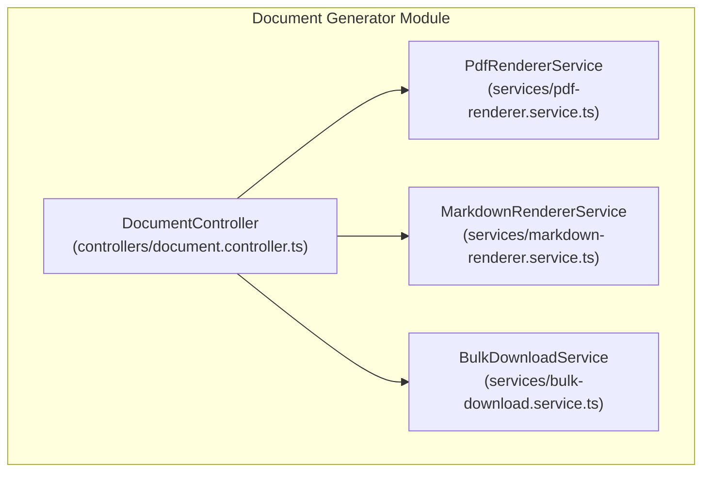
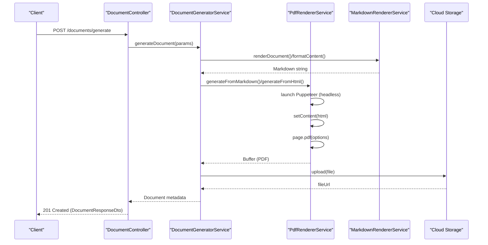
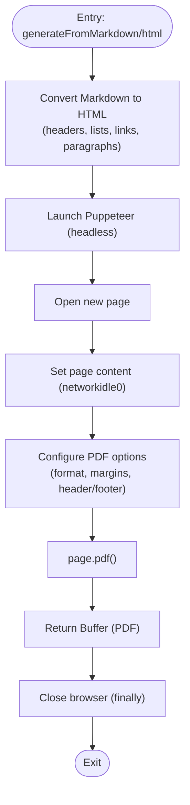
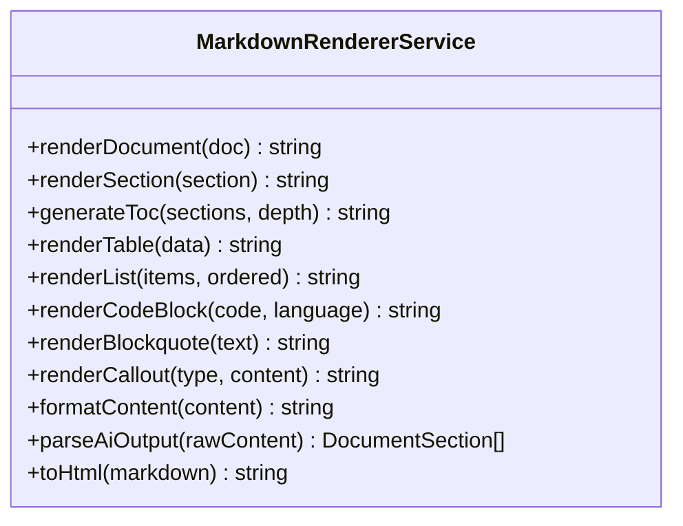
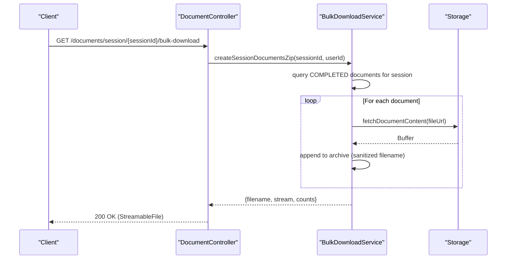
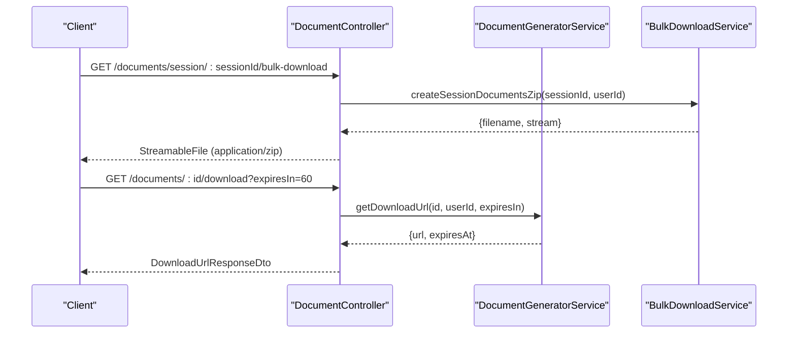
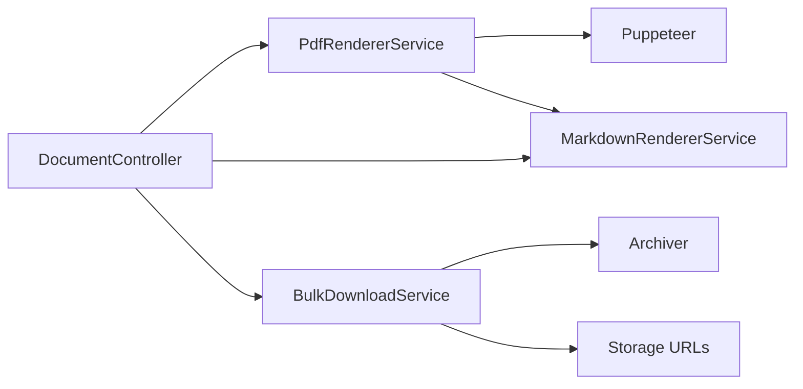

# Multi-Format Export System

<cite>
**Referenced Files in This Document**
- [pdf-renderer.service.ts](file://apps/api/src/modules/document-generator/services/pdf-renderer.service.ts)
- [markdown-renderer.service.ts](file://apps/api/src/modules/document-generator/services/markdown-renderer.service.ts)
- [bulk-download.service.ts](file://apps/api/src/modules/document-generator/services/bulk-download.service.ts)
- [document.controller.ts](file://apps/api/src/modules/document-generator/controllers/document.controller.ts)
- [memory-optimization.service.ts](file://apps/api/src/common/services/memory-optimization.service.ts)
</cite>

## Table of Contents
1. [Introduction](#introduction)
2. [Project Structure](#project-structure)
3. [Core Components](#core-components)
4. [Architecture Overview](#architecture-overview)
5. [Detailed Component Analysis](#detailed-component-analysis)
6. [Dependency Analysis](#dependency-analysis)
7. [Performance Considerations](#performance-considerations)
8. [Troubleshooting Guide](#troubleshooting-guide)
9. [Conclusion](#conclusion)
10. [Appendices](#appendices)

## Introduction
This document describes the multi-format export system responsible for generating, formatting, and delivering documents in multiple formats. The system integrates:
- PDF rendering via Puppeteer for HTML/Markdown content
- Markdown export with structured formatting and markup generation
- Bulk download capabilities for batch processing and ZIP packaging
- Secure download URLs and streaming responses
- File naming conventions and metadata handling
- Performance and memory optimization strategies

## Project Structure
The export system is primarily implemented in the document generator module with supporting services and controllers.

**Diagram sources**
- [document.controller.ts:39-43](file://apps/api/src/modules/document-generator/controllers/document.controller.ts#L39-L43)
- [pdf-renderer.service.ts:22-24](file://apps/api/src/modules/document-generator/services/pdf-renderer.service.ts#L22-L24)
- [markdown-renderer.service.ts:29-31](file://apps/api/src/modules/document-generator/services/markdown-renderer.service.ts#L29-L31)
- [bulk-download.service.ts:17-24](file://apps/api/src/modules/document-generator/services/bulk-download.service.ts#L17-L24)

**Section sources**
- [document.controller.ts:35-43](file://apps/api/src/modules/document-generator/controllers/document.controller.ts#L35-L43)
- [pdf-renderer.service.ts:18-25](file://apps/api/src/modules/document-generator/services/pdf-renderer.service.ts#L18-L25)
- [markdown-renderer.service.ts:29-31](file://apps/api/src/modules/document-generator/services/markdown-renderer.service.ts#L29-L31)
- [bulk-download.service.ts:17-24](file://apps/api/src/modules/document-generator/services/bulk-download.service.ts#L17-L24)

## Core Components
- PdfRendererService: Converts Markdown or raw HTML to PDF using Puppeteer with configurable margins, headers/footers, and paper sizes.
- MarkdownRendererService: Renders structured documents to Markdown with tables of contents, metadata blocks, and content formatting helpers.
- BulkDownloadService: Streams ZIP archives of multiple documents with filename sanitization and size estimation.
- DocumentController: Exposes REST endpoints for generation, listing, downloading, and bulk downloads.

Key responsibilities:
- PDF rendering pipeline with Puppeteer headless browser
- Markdown to HTML conversion for previews and PDF generation
- Batch processing and concurrent export handling via streaming
- Temporary storage management and cleanup via browser lifecycle and stream handling
- Secure download URLs and streaming responses

**Section sources**
- [pdf-renderer.service.ts:131-223](file://apps/api/src/modules/document-generator/services/pdf-renderer.service.ts#L131-L223)
- [markdown-renderer.service.ts:34-74](file://apps/api/src/modules/document-generator/services/markdown-renderer.service.ts#L34-L74)
- [bulk-download.service.ts:29-114](file://apps/api/src/modules/document-generator/services/bulk-download.service.ts#L29-L114)
- [document.controller.ts:45-277](file://apps/api/src/modules/document-generator/controllers/document.controller.ts#L45-L277)

## Architecture Overview
The export system follows a layered architecture:
- Controllers orchestrate requests and responses
- Services encapsulate business logic for rendering, formatting, and packaging
- External integrations: Puppeteer for PDF generation, Archiver for ZIP packaging, and storage URLs for file retrieval

**Diagram sources**
- [document.controller.ts:54-65](file://apps/api/src/modules/document-generator/controllers/document.controller.ts#L54-L65)
- [pdf-renderer.service.ts:131-205](file://apps/api/src/modules/document-generator/services/pdf-renderer.service.ts#L131-L205)
- [markdown-renderer.service.ts:34-74](file://apps/api/src/modules/document-generator/services/markdown-renderer.service.ts#L34-L74)

## Detailed Component Analysis

### PDF Rendering Pipeline (Puppeteer)
The PdfRendererService transforms Markdown or HTML into PDFs with:
- Configurable paper format (A4/Letter) and margins
- Optional header/footer templates with page numbering
- Background printing enabled for styled content
- Headless Chromium via Puppeteer with sandbox flags for containerized environments

Processing logic:
- Markdown to HTML conversion with basic inline formatting and semantic wrappers
- HTML injection into a new page with network idle wait
- PDF generation with explicit options and buffer return
- Browser lifecycle management in try/finally to ensure closure

**Diagram sources**
- [pdf-renderer.service.ts:29-126](file://apps/api/src/modules/document-generator/services/pdf-renderer.service.ts#L29-L126)
- [pdf-renderer.service.ts:141-205](file://apps/api/src/modules/document-generator/services/pdf-renderer.service.ts#L141-L205)

**Section sources**
- [pdf-renderer.service.ts:4-16](file://apps/api/src/modules/document-generator/services/pdf-renderer.service.ts#L4-L16)
- [pdf-renderer.service.ts:131-205](file://apps/api/src/modules/document-generator/services/pdf-renderer.service.ts#L131-L205)

### Markdown Export and Formatting
The MarkdownRendererService:
- Renders structured documents with metadata blocks, ToC, and nested sections
- Provides helpers for tables, lists, code blocks, blockquotes, and admonitions
- Normalizes raw AI content into structured sections
- Generates slugs for anchor links and formats content consistently

**Diagram sources**
- [markdown-renderer.service.ts:29-279](file://apps/api/src/modules/document-generator/services/markdown-renderer.service.ts#L29-L279)

**Section sources**
- [markdown-renderer.service.ts:34-74](file://apps/api/src/modules/document-generator/services/markdown-renderer.service.ts#L34-L74)
- [markdown-renderer.service.ts:117-148](file://apps/api/src/modules/document-generator/services/markdown-renderer.service.ts#L117-L148)
- [markdown-renderer.service.ts:211-247](file://apps/api/src/modules/document-generator/services/markdown-renderer.service.ts#L211-L247)

### Bulk Download and Batch Processing
The BulkDownloadService streams ZIP archives containing multiple documents:
- Validates session ownership and completion status
- Fetches document content from storage URLs
- Sanitizes filenames and ensures uniqueness with short IDs
- Streams ZIP content via a PassThrough stream to avoid memory spikes
- Emits download statistics and handles partial failures gracefully

**Diagram sources**
- [document.controller.ts:148-162](file://apps/api/src/modules/document-generator/controllers/document.controller.ts#L148-L162)
- [bulk-download.service.ts:29-114](file://apps/api/src/modules/document-generator/services/bulk-download.service.ts#L29-L114)

**Section sources**
- [bulk-download.service.ts:29-114](file://apps/api/src/modules/document-generator/services/bulk-download.service.ts#L29-L114)
- [bulk-download.service.ts:119-190](file://apps/api/src/modules/document-generator/services/bulk-download.service.ts#L119-L190)
- [bulk-download.service.ts:195-231](file://apps/api/src/modules/document-generator/services/bulk-download.service.ts#L195-L231)

### Endpoint Workflows
DocumentController exposes endpoints for:
- Generating documents and listing types
- Retrieving session documents and individual document details
- Creating secure download URLs with expiration
- Performing bulk downloads (all session documents or selected documents)
- Managing version history and downloading specific versions

**Diagram sources**
- [document.controller.ts:148-162](file://apps/api/src/modules/document-generator/controllers/document.controller.ts#L148-L162)
- [document.controller.ts:129-141](file://apps/api/src/modules/document-generator/controllers/document.controller.ts#L129-L141)

**Section sources**
- [document.controller.ts:45-277](file://apps/api/src/modules/document-generator/controllers/document.controller.ts#L45-L277)

## Dependency Analysis
- PdfRendererService depends on Puppeteer for headless rendering and uses a local HTML/CSS template for styling.
- MarkdownRendererService provides formatting utilities consumed by the PDF renderer and preview flows.
- BulkDownloadService depends on Archiver for streaming ZIP creation and on storage URLs for content retrieval.
- DocumentController coordinates between services and returns typed DTOs to clients.

**Diagram sources**
- [pdf-renderer.service.ts:1-3](file://apps/api/src/modules/document-generator/services/pdf-renderer.service.ts#L1-L3)
- [bulk-download.service.ts:7-8](file://apps/api/src/modules/document-generator/services/bulk-download.service.ts#L7-L8)
- [document.controller.ts:26-27](file://apps/api/src/modules/document-generator/controllers/document.controller.ts#L26-L27)

**Section sources**
- [pdf-renderer.service.ts:141-205](file://apps/api/src/modules/document-generator/services/pdf-renderer.service.ts#L141-L205)
- [bulk-download.service.ts:76-106](file://apps/api/src/modules/document-generator/services/bulk-download.service.ts#L76-L106)
- [document.controller.ts:39-43](file://apps/api/src/modules/document-generator/controllers/document.controller.ts#L39-L43)

## Performance Considerations
- Memory optimization: The system avoids loading entire PDFs into memory by using Puppeteer’s headless mode and returning Buffers efficiently. Streaming is used for bulk downloads to prevent memory spikes.
- Concurrency: Bulk operations iterate sequentially over documents while fetching content and appending to the archive, minimizing contention. Consider batching and rate-limiting external storage fetches if scaling.
- Browser lifecycle: The PDF renderer launches and closes the browser in a controlled manner to prevent resource leaks.
- Compression: ZIP archives use balanced compression settings to balance speed and size.
- Content normalization: Markdown formatting normalizes inconsistent AI output to reduce rendering overhead.

[No sources needed since this section provides general guidance]

## Troubleshooting Guide
Common issues and resolutions:
- PDF generation failures: Check Puppeteer launch arguments and network idle conditions. Validate HTML content and ensure required assets are accessible.
- Bulk download errors: Inspect storage URL fetch failures and handle partial successes by continuing with remaining documents.
- Filename collisions: The system appends short IDs to sanitized titles to ensure uniqueness within ZIP archives.
- Streaming issues: Ensure the response headers are set correctly for ZIP downloads and that the PassThrough stream is not destroyed prematurely.

**Section sources**
- [pdf-renderer.service.ts:195-204](file://apps/api/src/modules/document-generator/services/pdf-renderer.service.ts#L195-L204)
- [bulk-download.service.ts:80-84](file://apps/api/src/modules/document-generator/services/bulk-download.service.ts#L80-L84)
- [bulk-download.service.ts:195-207](file://apps/api/src/modules/document-generator/services/bulk-download.service.ts#L195-L207)

## Conclusion
The multi-format export system provides a robust pipeline for converting structured content into PDFs and managing bulk downloads. It leverages Puppeteer for reliable PDF rendering, maintains Markdown formatting for flexibility, and streams ZIP archives for efficient batch delivery. With careful attention to browser lifecycle, streaming, and filename hygiene, the system scales to large document exports while preserving quality and metadata.

[No sources needed since this section summarizes without analyzing specific files]

## Appendices

### Export Configuration Examples
- PDF options: Configure paper format, margins, header/footer templates, and background printing.
- Markdown rendering: Use metadata blocks, ToC generation, and content formatting helpers.
- Bulk download: Limit selection size, sanitize filenames, and estimate total size.

**Section sources**
- [pdf-renderer.service.ts:4-16](file://apps/api/src/modules/document-generator/services/pdf-renderer.service.ts#L4-L16)
- [markdown-renderer.service.ts:34-74](file://apps/api/src/modules/document-generator/services/markdown-renderer.service.ts#L34-L74)
- [bulk-download.service.ts:119-129](file://apps/api/src/modules/document-generator/services/bulk-download.service.ts#L119-L129)

### File Naming and Metadata Preservation
- Session-based ZIP naming: Uses sanitized questionnaire name and date stamp.
- Individual document ZIP entries: Sanitized title + short ID + extension derived from format.
- Metadata: Document type, creation timestamps, and sizes are preserved in DTOs and statistics.

**Section sources**
- [bulk-download.service.ts:67-72](file://apps/api/src/modules/document-generator/services/bulk-download.service.ts#L67-L72)
- [bulk-download.service.ts:212-231](file://apps/api/src/modules/document-generator/services/bulk-download.service.ts#L212-L231)
- [document.controller.ts:228-276](file://apps/api/src/modules/document-generator/controllers/document.controller.ts#L228-L276)

### Admin Interfaces and Queue Management
- The document generator module exposes endpoints for listing document types, retrieving session documents, and managing versions.
- Bulk download endpoints support administrators in exporting multiple documents efficiently.
- No explicit admin-only controller was identified in the referenced files; administrative capabilities are exposed via the document controller with appropriate guards.

**Section sources**
- [document.controller.ts:67-92](file://apps/api/src/modules/document-generator/controllers/document.controller.ts#L67-L92)
- [document.controller.ts:148-197](file://apps/api/src/modules/document-generator/controllers/document.controller.ts#L148-L197)