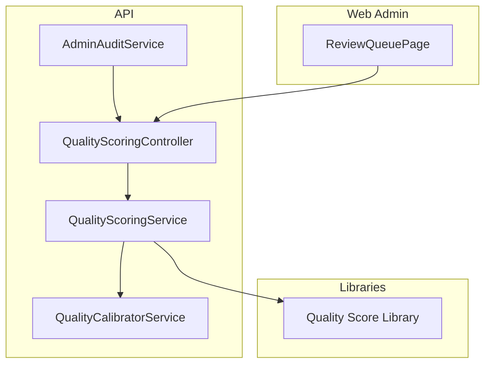
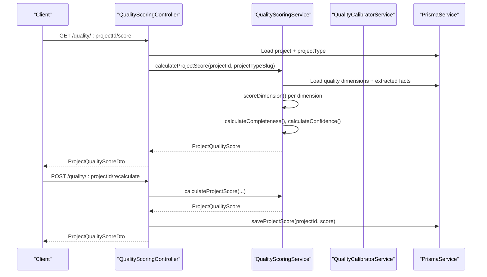
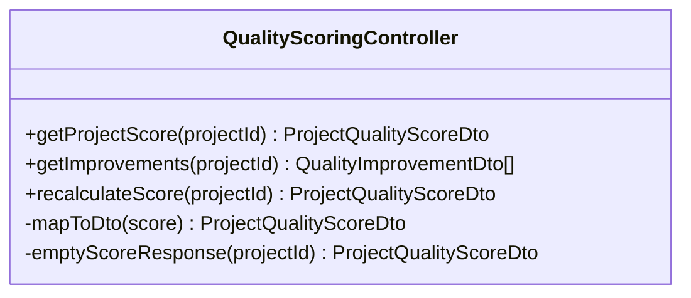
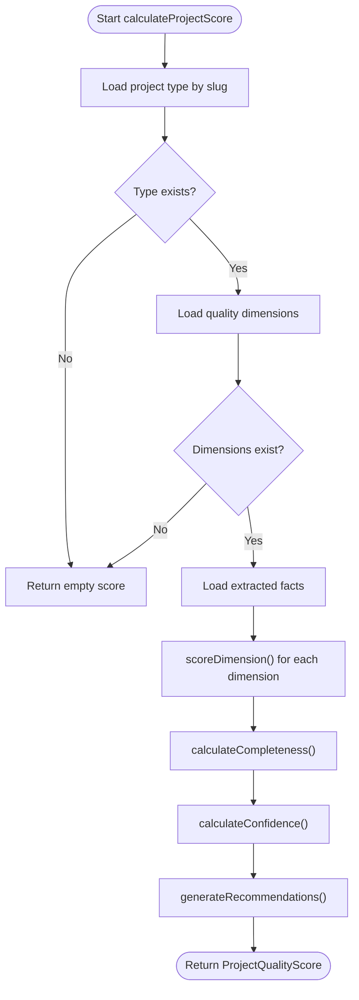
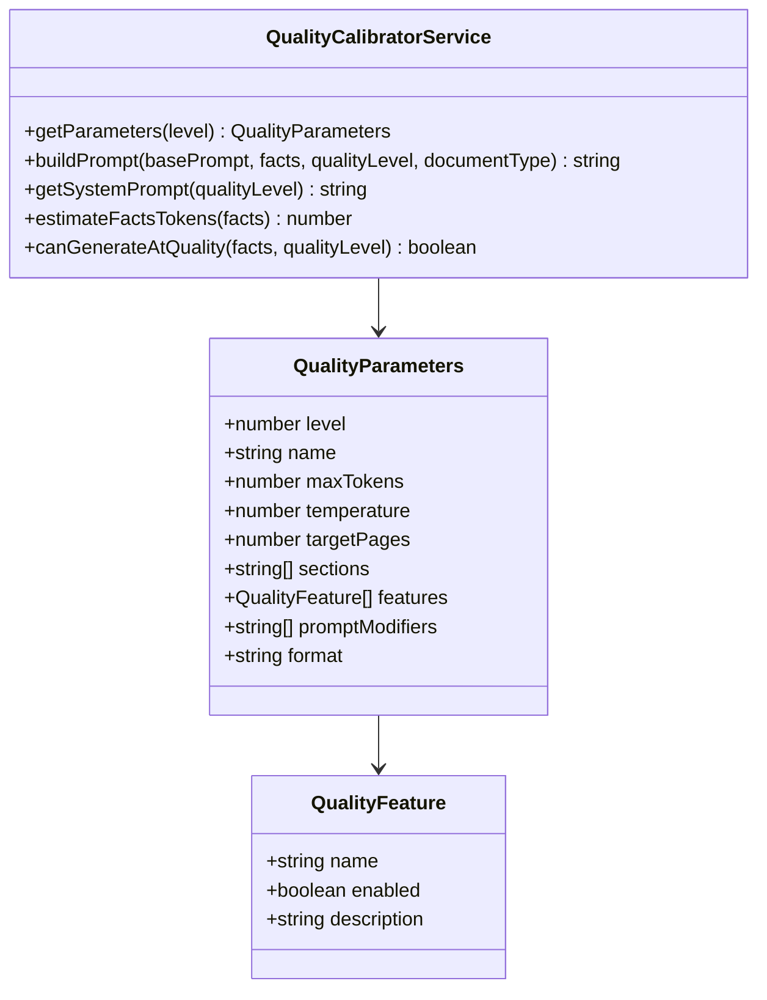
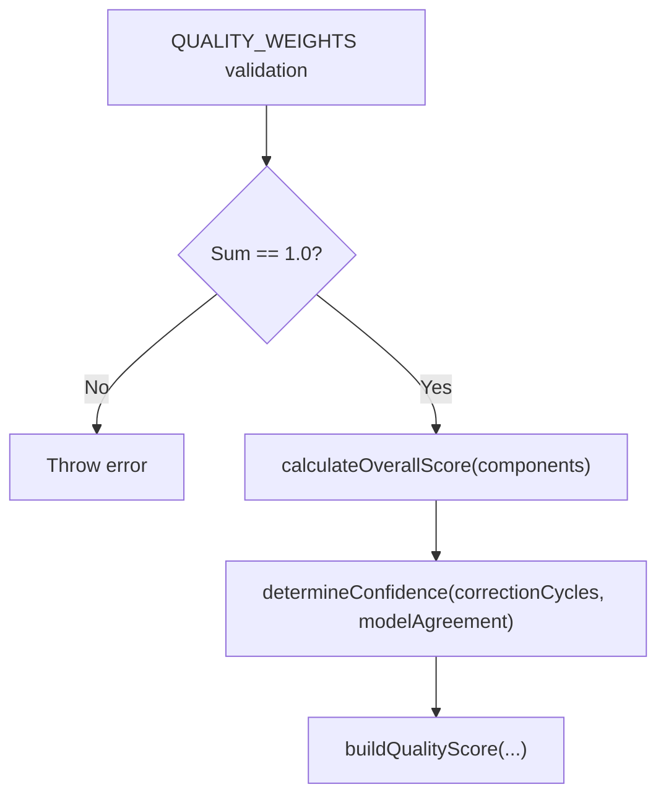
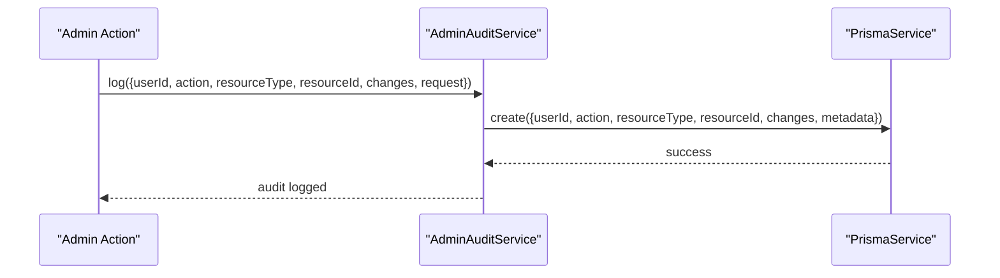
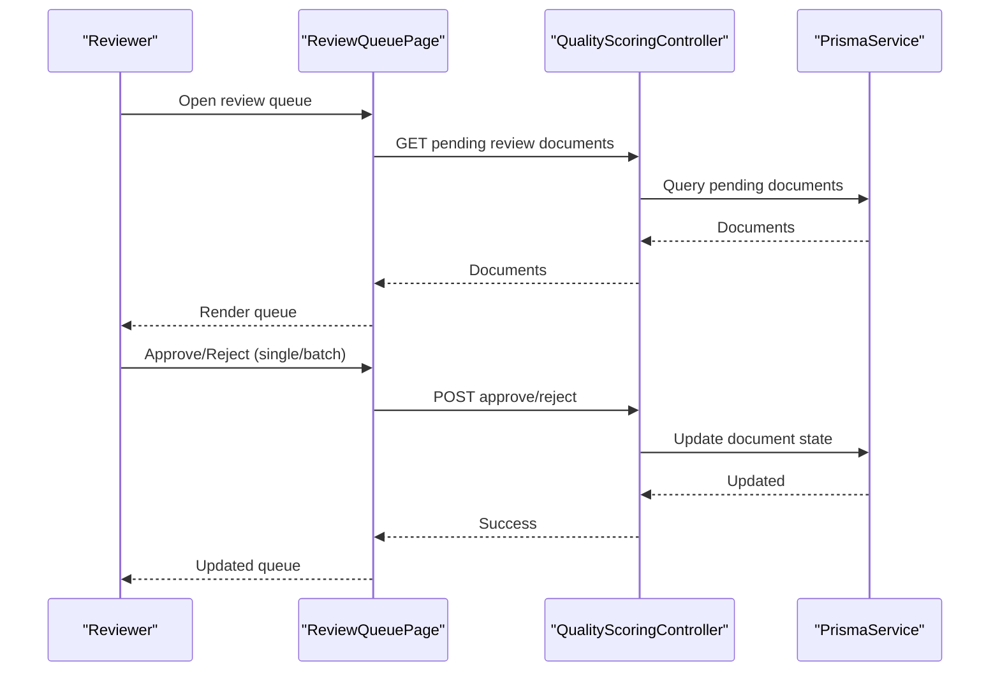
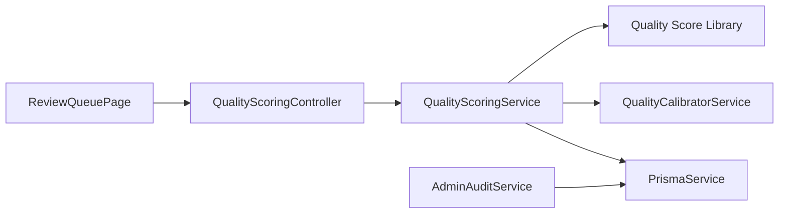

# Quality Assurance & Review

<cite>
**Referenced Files in This Document**
- [quality-scoring.controller.ts](file://apps/api/src/modules/quality-scoring/quality-scoring.controller.ts)
- [quality-scoring.service.ts](file://apps/api/src/modules/quality-scoring/services/quality-scoring.service.ts)
- [quality-scoring.dto.ts](file://apps/api/src/modules/quality-scoring/dto/quality-scoring.dto.ts)
- [interfaces.ts](file://apps/api/src/modules/quality-scoring/interfaces.ts)
- [quality-calibrator.service.ts](file://apps/api/src/modules/document-generator/services/quality-calibrator.service.ts)
- [quality-score.ts](file://libs/orchestrator/src/schemas/quality-score.ts)
- [admin-audit.service.ts](file://apps/api/src/modules/admin/services/admin-audit.service.ts)
- [ReviewQueuePage.tsx](file://apps/web/src/pages/admin/ReviewQueuePage.tsx)
- [PHASE-08-document-generation.md](file://docs/phase-kits/PHASE-08-document-generation.md)
</cite>

## Table of Contents
1. [Introduction](#introduction)
2. [Project Structure](#project-structure)
3. [Core Components](#core-components)
4. [Architecture Overview](#architecture-overview)
5. [Detailed Component Analysis](#detailed-component-analysis)
6. [Dependency Analysis](#dependency-analysis)
7. [Performance Considerations](#performance-considerations)
8. [Troubleshooting Guide](#troubleshooting-guide)
9. [Conclusion](#conclusion)
10. [Appendices](#appendices)

## Introduction
This document describes the quality assurance and review system, focusing on:
- Quality calibrator service for aligning document generation parameters with quality levels
- Content validation rules and automated quality checks grounded in extracted facts and benchmark criteria
- Review workflows and approval processes
- Quality metrics collection and scoring methodologies
- Project document generation service and quality scoring algorithms
- Admin interfaces for document review, quality monitoring, and compliance tracking
- Integration with evidence registry data and audit trail generation
- Quality scoring methodologies, benchmark comparisons, and continuous improvement processes
- Reviewer permissions, workflow automation, and quality reporting dashboards

## Project Structure
The quality assurance system spans backend NestJS modules and frontend admin pages:
- Backend modules:
  - Quality scoring controller and service evaluate project facts against quality dimensions
  - Quality calibrator service adjusts generation parameters by quality level
  - Orchestrator library defines quality score weights and calculation logic
  - Admin audit service records administrative actions
- Frontend admin pages:
  - Review queue page for managing pending documents and batch approvals

**Diagram sources**
- [quality-scoring.controller.ts:16-25](file://apps/api/src/modules/quality-scoring/quality-scoring.controller.ts#L16-L25)
- [quality-scoring.service.ts:28-31](file://apps/api/src/modules/quality-scoring/services/quality-scoring.service.ts#L28-L31)
- [quality-calibrator.service.ts:200-201](file://apps/api/src/modules/document-generator/services/quality-calibrator.service.ts#L200-L201)
- [quality-score.ts:1-119](file://libs/orchestrator/src/schemas/quality-score.ts#L1-L119)
- [admin-audit.service.ts:16-19](file://apps/api/src/modules/admin/services/admin-audit.service.ts#L16-L19)
- [ReviewQueuePage.tsx:56-80](file://apps/web/src/pages/admin/ReviewQueuePage.tsx#L56-L80)

**Section sources**
- [quality-scoring.controller.ts:16-25](file://apps/api/src/modules/quality-scoring/quality-scoring.controller.ts#L16-L25)
- [quality-scoring.service.ts:28-31](file://apps/api/src/modules/quality-scoring/services/quality-scoring.service.ts#L28-L31)
- [quality-calibrator.service.ts:200-201](file://apps/api/src/modules/document-generator/services/quality-calibrator.service.ts#L200-L201)
- [quality-score.ts:1-119](file://libs/orchestrator/src/schemas/quality-score.ts#L1-L119)
- [admin-audit.service.ts:16-19](file://apps/api/src/modules/admin/services/admin-audit.service.ts#L16-L19)
- [ReviewQueuePage.tsx:56-80](file://apps/web/src/pages/admin/ReviewQueuePage.tsx#L56-L80)

## Core Components
- Quality Scoring Controller: Exposes REST endpoints to fetch project quality scores, improvement suggestions, and recalculation with persistence.
- Quality Scoring Service: Computes dimension-level and overall scores from extracted facts and benchmark criteria; generates recommendations and improvement suggestions.
- Quality Calibrator Service: Translates quality levels into generation parameters (tokens, sections, features, prompt modifiers) and validates capacity.
- Quality Score Library: Defines weights and calculation for overall and confidence scores.
- Admin Audit Service: Logs administrative actions with request metadata for compliance tracking.
- Review Queue Page: Provides admin UI for reviewing, approving, rejecting, and batch-managing documents.

**Section sources**
- [quality-scoring.controller.ts:27-117](file://apps/api/src/modules/quality-scoring/quality-scoring.controller.ts#L27-L117)
- [quality-scoring.service.ts:33-94](file://apps/api/src/modules/quality-scoring/services/quality-scoring.service.ts#L33-L94)
- [quality-calibrator.service.ts:1-356](file://apps/api/src/modules/document-generator/services/quality-calibrator.service.ts#L1-L356)
- [quality-score.ts:11-61](file://libs/orchestrator/src/schemas/quality-score.ts#L11-L61)
- [admin-audit.service.ts:21-44](file://apps/api/src/modules/admin/services/admin-audit.service.ts#L21-L44)
- [ReviewQueuePage.tsx:56-172](file://apps/web/src/pages/admin/ReviewQueuePage.tsx#L56-L172)

## Architecture Overview
The system integrates quality scoring with document generation and admin oversight:
- Controllers orchestrate requests and delegate to services
- Services query facts, compute scores, and suggest improvements
- Calibrator maps quality levels to generation parameters
- Audit logs capture administrative actions
- Web admin surfaces review queues and actions

**Diagram sources**
- [quality-scoring.controller.ts:30-117](file://apps/api/src/modules/quality-scoring/quality-scoring.controller.ts#L30-L117)
- [quality-scoring.service.ts:36-94](file://apps/api/src/modules/quality-scoring/services/quality-scoring.service.ts#L36-L94)
- [quality-calibrator.service.ts:206-216](file://apps/api/src/modules/document-generator/services/quality-calibrator.service.ts#L206-L216)

## Detailed Component Analysis

### Quality Scoring Controller
Responsibilities:
- Enforce JWT authentication and bearer auth
- Retrieve project type to select appropriate quality dimensions
- Compute and map scores to DTOs
- Persist recalculated scores to the project record

Key behaviors:
- Empty score fallback when project is missing
- Mapping from internal score structures to DTOs
- Saving scores to project for downstream use

**Diagram sources**
- [quality-scoring.controller.ts:19-182](file://apps/api/src/modules/quality-scoring/quality-scoring.controller.ts#L19-L182)

**Section sources**
- [quality-scoring.controller.ts:27-117](file://apps/api/src/modules/quality-scoring/quality-scoring.controller.ts#L27-L117)

### Quality Scoring Service
Responsibilities:
- Load project type and associated quality dimensions
- Match extracted facts to benchmark criteria
- Compute dimension scores, completeness, and confidence
- Generate recommendations and improvement suggestions
- Persist scores to the project

Scoring logic highlights:
- Parse benchmark criteria from JSON
- Find matching facts via exact/partial/category keyword matching
- Weighted average of criterion confidences for dimension score
- Completeness as ratio of met criteria across all dimensions
- Confidence as average of fact confidences
- Recommendations prioritized by lowest dimension scores

**Diagram sources**
- [quality-scoring.service.ts:36-94](file://apps/api/src/modules/quality-scoring/services/quality-scoring.service.ts#L36-L94)

**Section sources**
- [quality-scoring.service.ts:33-339](file://apps/api/src/modules/quality-scoring/services/quality-scoring.service.ts#L33-L339)

### Quality Calibrator Service
Responsibilities:
- Translate numeric quality level (0–4) into generation parameters
- Build prompts with quality modifiers, sections, features, and extracted facts
- Estimate token usage and validate capacity
- Provide system prompts tailored to quality format

Quality levels:
- Basic (1x): Essentials, minimal formatting
- Standard (2x): Expanded content, professional formatting
- Enhanced (3x): Comprehensive content, charts, citations
- Premium (4x): Executive-ready, SWOT, market analysis
- Enterprise (5x): Board-ready, appendices, full analysis

**Diagram sources**
- [quality-calibrator.service.ts:200-356](file://apps/api/src/modules/document-generator/services/quality-calibrator.service.ts#L200-L356)

**Section sources**
- [quality-calibrator.service.ts:1-356](file://apps/api/src/modules/document-generator/services/quality-calibrator.service.ts#L1-L356)
- [PHASE-08-document-generation.md:100-161](file://docs/phase-kits/PHASE-08-document-generation.md#L100-L161)

### Quality Score Library (Weights and Confidence)
Responsibilities:
- Define and validate quality weights for schema, ISO compliance, completeness, and clarity
- Compute overall score as a weighted average
- Determine confidence level based on correction cycles and model agreement

**Diagram sources**
- [quality-score.ts:11-61](file://libs/orchestrator/src/schemas/quality-score.ts#L11-L61)
- [quality-score.ts:76-83](file://libs/orchestrator/src/schemas/quality-score.ts#L76-L83)
- [quality-score.ts:98-118](file://libs/orchestrator/src/schemas/quality-score.ts#L98-L118)

**Section sources**
- [quality-score.ts:11-61](file://libs/orchestrator/src/schemas/quality-score.ts#L11-L61)
- [quality-score.ts:76-83](file://libs/orchestrator/src/schemas/quality-score.ts#L76-L83)
- [quality-score.ts:98-118](file://libs/orchestrator/src/schemas/quality-score.ts#L98-L118)

### Admin Audit Service
Responsibilities:
- Log administrative actions with user, resource, and change details
- Capture request metadata (IP, user agent, request ID)
- Persist audit logs for compliance and traceability

**Diagram sources**
- [admin-audit.service.ts:21-44](file://apps/api/src/modules/admin/services/admin-audit.service.ts#L21-L44)

**Section sources**
- [admin-audit.service.ts:21-44](file://apps/api/src/modules/admin/services/admin-audit.service.ts#L21-L44)

### Review Queue Page (Admin UI)
Responsibilities:
- Display pending documents with filtering, sorting, pagination
- Support single and batch approval/rejection
- Provide optimistic updates and refresh intervals
- Navigate to document review details

**Diagram sources**
- [ReviewQueuePage.tsx:56-172](file://apps/web/src/pages/admin/ReviewQueuePage.tsx#L56-L172)
- [quality-scoring.controller.ts:30-117](file://apps/api/src/modules/quality-scoring/quality-scoring.controller.ts#L30-L117)

**Section sources**
- [ReviewQueuePage.tsx:56-172](file://apps/web/src/pages/admin/ReviewQueuePage.tsx#L56-L172)

## Dependency Analysis
- QualityScoringController depends on QualityScoringService and PrismaService
- QualityScoringService depends on PrismaService and uses QualityDimension and ExtractedFact models
- QualityCalibratorService depends on ExtractedFact type and provides generation parameters
- Quality Score Library defines shared constants and functions used across services
- AdminAuditService depends on PrismaService and Express Request for metadata extraction
- ReviewQueuePage depends on admin APIs and TanStack Query for state management

**Diagram sources**
- [quality-scoring.controller.ts:12-25](file://apps/api/src/modules/quality-scoring/quality-scoring.controller.ts#L12-L25)
- [quality-scoring.service.ts:10-31](file://apps/api/src/modules/quality-scoring/services/quality-scoring.service.ts#L10-L31)
- [quality-calibrator.service.ts:14-201](file://apps/api/src/modules/document-generator/services/quality-calibrator.service.ts#L14-L201)
- [quality-score.ts:1-119](file://libs/orchestrator/src/schemas/quality-score.ts#L1-L119)
- [admin-audit.service.ts:3-19](file://apps/api/src/modules/admin/services/admin-audit.service.ts#L3-L19)
- [ReviewQueuePage.tsx:32-37](file://apps/web/src/pages/admin/ReviewQueuePage.tsx#L32-L37)

**Section sources**
- [quality-scoring.controller.ts:12-25](file://apps/api/src/modules/quality-scoring/quality-scoring.controller.ts#L12-L25)
- [quality-scoring.service.ts:10-31](file://apps/api/src/modules/quality-scoring/services/quality-scoring.service.ts#L10-L31)
- [quality-calibrator.service.ts:14-201](file://apps/api/src/modules/document-generator/services/quality-calibrator.service.ts#L14-L201)
- [quality-score.ts:1-119](file://libs/orchestrator/src/schemas/quality-score.ts#L1-L119)
- [admin-audit.service.ts:3-19](file://apps/api/src/modules/admin/services/admin-audit.service.ts#L3-L19)
- [ReviewQueuePage.tsx:32-37](file://apps/web/src/pages/admin/ReviewQueuePage.tsx#L32-L37)

## Performance Considerations
- Fact and dimension limits: Services cap fact retrieval and dimension counts to prevent excessive computation.
- Token estimation: Calibrator estimates token usage from facts to avoid exceeding generation limits.
- Weight normalization: Quality weights are validated at module load to maintain consistent scoring.
- Caching and polling: Admin review queue polls periodically to keep state fresh without real-time push.

[No sources needed since this section provides general guidance]

## Troubleshooting Guide
Common issues and resolutions:
- Missing project type or dimensions: Controller returns empty score; ensure project type slugs and quality dimensions are configured.
- No extracted facts: Scoring defaults to zero completeness/confidence; encourage conversation completion.
- Invalid quality weights: Library throws on mismatch; verify weights sum to 1.0.
- Audit log failures: AdminAuditService logs errors; inspect request metadata capture and database connectivity.
- Generation capacity exceeded: Calibrator canGenerateAtQuality returns false; reduce quality level or trim facts.

**Section sources**
- [quality-scoring.controller.ts:43-45](file://apps/api/src/modules/quality-scoring/quality-scoring.controller.ts#L43-L45)
- [quality-scoring.service.ts:47-50](file://apps/api/src/modules/quality-scoring/services/quality-scoring.service.ts#L47-L50)
- [quality-score.ts:31-37](file://libs/orchestrator/src/schemas/quality-score.ts#L31-L37)
- [admin-audit.service.ts:38-43](file://apps/api/src/modules/admin/services/admin-audit.service.ts#L38-L43)
- [quality-calibrator.service.ts:348-354](file://apps/api/src/modules/document-generator/services/quality-calibrator.service.ts#L348-L354)

## Conclusion
The quality assurance and review system combines automated scoring of project facts against benchmark criteria with configurable generation parameters aligned to quality levels. It supports robust review workflows, persistent quality metrics, and compliance through audit logging. Together, these components enable continuous improvement, standardized quality evaluation, and scalable document generation.

[No sources needed since this section summarizes without analyzing specific files]

## Appendices

### Quality Metrics and DTOs
- ProjectQualityScoreDto: Includes overall, completeness, and confidence scores, dimension breakdowns, and recommendations
- QualityImprovementDto: Suggests potential improvements per dimension with missing criteria and follow-up questions
- Interfaces define dimension and criteria scoring structures used across services

**Section sources**
- [quality-scoring.dto.ts:49-99](file://apps/api/src/modules/quality-scoring/dto/quality-scoring.dto.ts#L49-L99)
- [interfaces.ts:8-62](file://apps/api/src/modules/quality-scoring/interfaces.ts#L8-L62)

### Example Workflows and Configurations
- Quality check configuration: Benchmark criteria parsed from JSON and matched to facts via multiple strategies
- Validation rules: Exact key match, partial key overlap, and keyword-based matching
- Remediation workflow: Recommendations and improvement suggestions prioritize low-scoring dimensions and missing criteria

**Section sources**
- [quality-scoring.service.ts:156-207](file://apps/api/src/modules/quality-scoring/services/quality-scoring.service.ts#L156-L207)
- [quality-scoring.service.ts:247-271](file://apps/api/src/modules/quality-scoring/services/quality-scoring.service.ts#L247-L271)

### Integration with Evidence Registry and Compliance
- Evidence registry integration: Extracted facts feed quality scoring and generation parameters
- Compliance tracking: AdminAuditService logs administrative actions with request metadata for audit trails

**Section sources**
- [quality-scoring.service.ts:65-69](file://apps/api/src/modules/quality-scoring/services/quality-scoring.service.ts#L65-L69)
- [admin-audit.service.ts:21-44](file://apps/api/src/modules/admin/services/admin-audit.service.ts#L21-L44)

### Reviewer Permissions and Automation
- Authentication: Controllers require JWT bearer auth
- Batch operations: Admin UI supports batch approve/reject with optimistic updates and refresh intervals
- Workflow automation: Recalculation endpoint persists scores for downstream use

**Section sources**
- [quality-scoring.controller.ts:17-18](file://apps/api/src/modules/quality-scoring/quality-scoring.controller.ts#L17-L18)
- [ReviewQueuePage.tsx:153-165](file://apps/web/src/pages/admin/ReviewQueuePage.tsx#L153-L165)
- [quality-scoring.controller.ts:92-117](file://apps/api/src/modules/quality-scoring/quality-scoring.controller.ts#L92-L117)