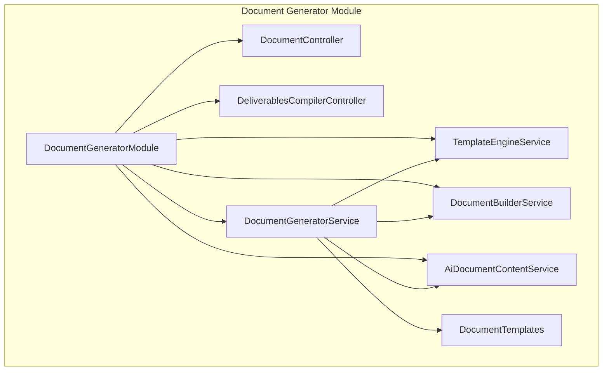
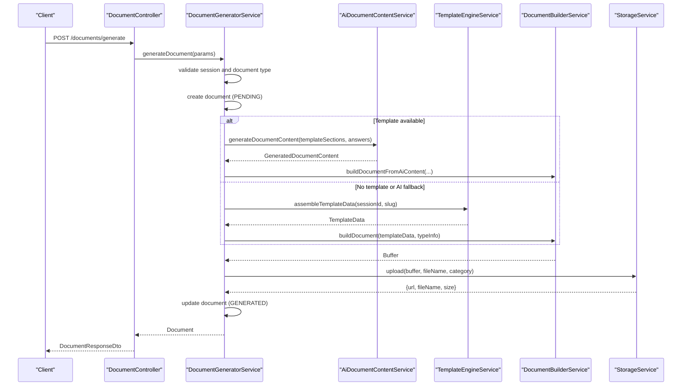
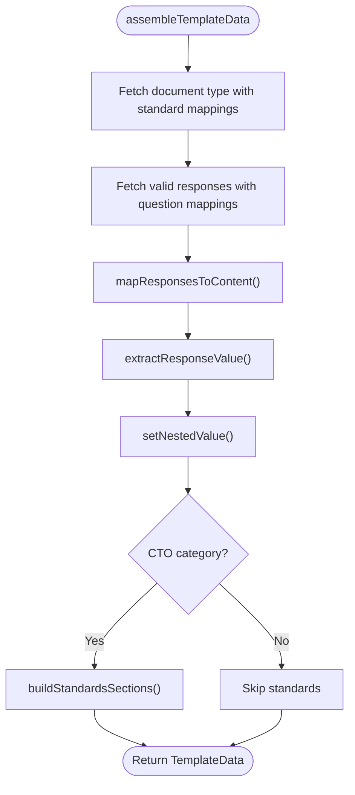
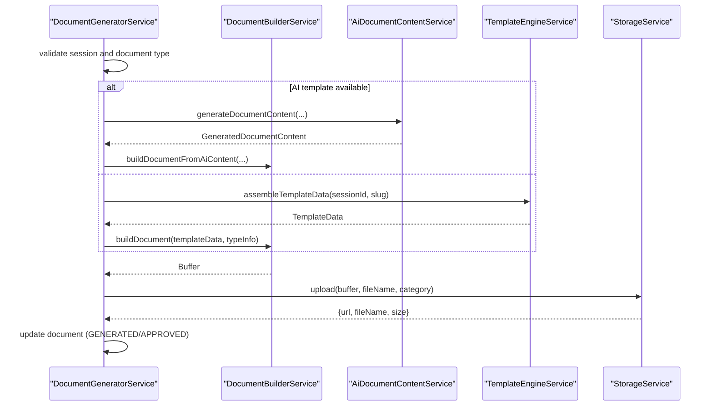
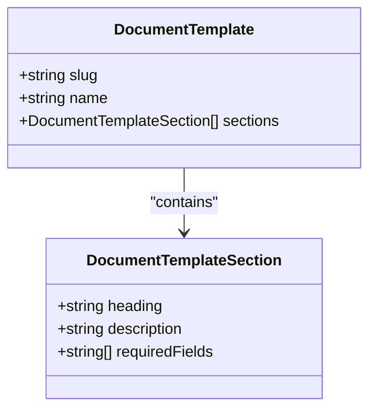
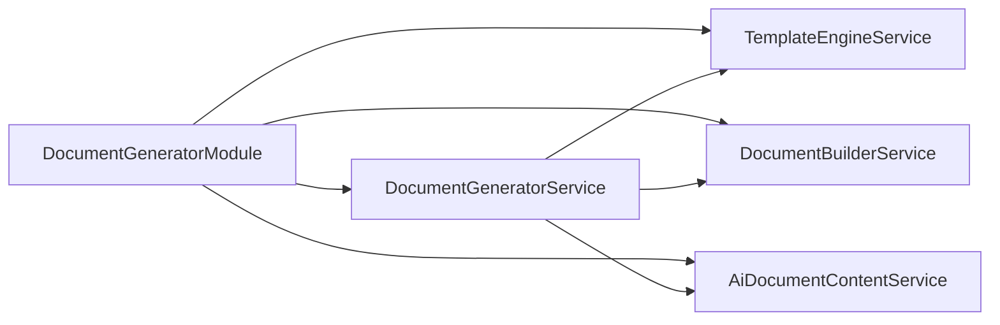

# Template Management System

<cite>
**Referenced Files in This Document**
- [document-generator.module.ts](file://apps/api/src/modules/document-generator/document-generator.module.ts)
- [template-engine.service.ts](file://apps/api/src/modules/document-generator/services/template-engine.service.ts)
- [document-generator.service.ts](file://apps/api/src/modules/document-generator/services/document-generator.service.ts)
- [document-builder.service.ts](file://apps/api/src/modules/document-generator/services/document-builder.service.ts)
- [document-templates.ts](file://apps/api/src/modules/document-generator/templates/document-templates.ts)
- [ai-document-content.service.ts](file://apps/api/src/modules/document-generator/services/ai-document-content.service.ts)
- [document.controller.ts](file://apps/api/src/modules/document-generator/controllers/document.controller.ts)
- [deliverables-compiler.controller.ts](file://apps/api/src/modules/document-generator/controllers/deliverables-compiler.controller.ts)
</cite>

## Table of Contents
1. [Introduction](#introduction)
2. [Project Structure](#project-structure)
3. [Core Components](#core-components)
4. [Architecture Overview](#architecture-overview)
5. [Detailed Component Analysis](#detailed-component-analysis)
6. [Dependency Analysis](#dependency-analysis)
7. [Performance Considerations](#performance-considerations)
8. [Troubleshooting Guide](#troubleshooting-guide)
9. [Conclusion](#conclusion)

## Introduction
This document describes the Template Management System that powers document generation across multiple domains (Architecture, SDLC, Testing, DevSecOps, Policy, Business Case, and more). It explains how templates define the structure for AI-driven content generation, how session responses are transformed into structured content, and how documents are built and delivered. The system supports both AI-powered generation and fallback template-based generation, integrates with a deliverables pack compiler, and provides robust validation, versioning, and performance characteristics.

## Project Structure
The template management system resides in the Document Generator module. Key areas:
- Controllers expose APIs for document generation, downloads, and deliverables pack compilation.
- Services orchestrate generation, template assembly, content building, and AI integration.
- Templates define the section structure for AI content generation.
- The module is registered in NestJS and exports services for broader application use.

**Diagram sources**
- [document-generator.module.ts:19-46](file://apps/api/src/modules/document-generator/document-generator.module.ts#L19-L46)
- [document.controller.ts:35-43](file://apps/api/src/modules/document-generator/controllers/document.controller.ts#L35-L43)
- [deliverables-compiler.controller.ts:26-31](file://apps/api/src/modules/document-generator/controllers/deliverables-compiler.controller.ts#L26-L31)
- [document-generator.service.ts:21-32](file://apps/api/src/modules/document-generator/services/document-generator.service.ts#L21-L32)
- [template-engine.service.ts:26-30](file://apps/api/src/modules/document-generator/services/template-engine.service.ts#L26-L30)
- [document-builder.service.ts:28-29](file://apps/api/src/modules/document-generator/services/document-builder.service.ts#L28-L29)
- [ai-document-content.service.ts:59-62](file://apps/api/src/modules/document-generator/services/ai-document-content.service.ts#L59-L62)
- [document-templates.ts:18-319](file://apps/api/src/modules/document-generator/templates/document-templates.ts#L18-L319)

**Section sources**
- [document-generator.module.ts:19-46](file://apps/api/src/modules/document-generator/document-generator.module.ts#L19-L46)

## Core Components
- TemplateEngineService: Assembles template data from session responses, maps question responses to nested content paths, extracts values by question type, validates required fields, and builds standards sections for CTO documents.
- DocumentGeneratorService: Validates sessions and document types, orchestrates AI or template-based generation, uploads artifacts, updates statuses, and notifies users.
- DocumentBuilderService: Converts structured content into DOCX documents, applies category-specific layouts, and renders standardized sections.
- AiDocumentContentService: Generates structured AI content using Claude, with fallback to placeholder content when API keys are unavailable.
- DocumentTemplates: Defines AI-driven template sections with headings, descriptions, and optional required fields.
- Controllers: Expose endpoints for document generation, versioning, downloads, and deliverables pack compilation.

**Section sources**
- [template-engine.service.ts:27-318](file://apps/api/src/modules/document-generator/services/template-engine.service.ts#L27-L318)
- [document-generator.service.ts:22-609](file://apps/api/src/modules/document-generator/services/document-generator.service.ts#L22-L609)
- [document-builder.service.ts:29-539](file://apps/api/src/modules/document-generator/services/document-builder.service.ts#L29-L539)
- [ai-document-content.service.ts:60-359](file://apps/api/src/modules/document-generator/services/ai-document-content.service.ts#L60-L359)
- [document-templates.ts:18-319](file://apps/api/src/modules/document-generator/templates/document-templates.ts#L18-L319)
- [document.controller.ts:39-278](file://apps/api/src/modules/document-generator/controllers/document.controller.ts#L39-L278)
- [deliverables-compiler.controller.ts:30-256](file://apps/api/src/modules/document-generator/controllers/deliverables-compiler.controller.ts#L30-L256)

## Architecture Overview
The system follows a layered architecture:
- API Layer: Controllers accept requests and delegate to services.
- Orchestration Layer: DocumentGeneratorService coordinates generation steps.
- Template Engine: TemplateEngineService transforms raw responses into structured content.
- AI Integration: AiDocumentContentService generates structured content from templates and session answers.
- Document Builder: DocumentBuilderService renders content into DOCX.
- Storage and Notifications: StorageService persists artifacts and provides signed URLs; NotificationService informs users.

**Diagram sources**
- [document.controller.ts:54-65](file://apps/api/src/modules/document-generator/controllers/document.controller.ts#L54-L65)
- [document-generator.service.ts:142-219](file://apps/api/src/modules/document-generator/services/document-generator.service.ts#L142-L219)
- [ai-document-content.service.ts:94-110](file://apps/api/src/modules/document-generator/services/ai-document-content.service.ts#L94-L110)
- [template-engine.service.ts:44-103](file://apps/api/src/modules/document-generator/services/template-engine.service.ts#L44-L103)
- [document-builder.service.ts:75-124](file://apps/api/src/modules/document-generator/services/document-builder.service.ts#L75-L124)

## Detailed Component Analysis

### Template Engine Service
Responsibilities:
- Assemble TemplateData from a session and document type slug.
- Map question responses to nested content paths using documentMappings.
- Extract values based on question types (text, number, choice, matrix, file).
- Validate required fields and compute standards sections for CTO documents.
- Safely set nested values to prevent prototype pollution.

Key behaviors:
- Response value extraction dispatches by question type.
- Dot-notation path traversal with safety checks.
- Standards aggregation for CTO documents.

**Diagram sources**
- [template-engine.service.ts:44-103](file://apps/api/src/modules/document-generator/services/template-engine.service.ts#L44-L103)
- [template-engine.service.ts:108-137](file://apps/api/src/modules/document-generator/services/template-engine.service.ts#L108-L137)
- [template-engine.service.ts:142-199](file://apps/api/src/modules/document-generator/services/template-engine.service.ts#L142-L199)
- [template-engine.service.ts:204-250](file://apps/api/src/modules/document-generator/services/template-engine.service.ts#L204-L250)
- [template-engine.service.ts:255-277](file://apps/api/src/modules/document-generator/services/template-engine.service.ts#L255-L277)

**Section sources**
- [template-engine.service.ts:27-318](file://apps/api/src/modules/document-generator/services/template-engine.service.ts#L27-L318)

### Document Generator Service
Responsibilities:
- Validate session completion and ownership.
- Enforce required questions for the target document type.
- Choose AI-powered generation when a template exists; otherwise fall back to template-based generation.
- Build DOCX buffers, upload to storage, update document metadata, and notify users.
- Support versioning and retrieval of document versions.

Highlights:
- Orchestrates AI vs template path.
- Loads session answers and project type name.
- Handles approvals and admin workflows.

**Diagram sources**
- [document-generator.service.ts:142-219](file://apps/api/src/modules/document-generator/services/document-generator.service.ts#L142-L219)
- [document-generator.service.ts:224-246](file://apps/api/src/modules/document-generator/services/document-generator.service.ts#L224-L246)
- [document-generator.service.ts:251-257](file://apps/api/src/modules/document-generator/services/document-generator.service.ts#L251-L257)
- [document-builder.service.ts:75-124](file://apps/api/src/modules/document-generator/services/document-builder.service.ts#L75-L124)
- [document-builder.service.ts:35-69](file://apps/api/src/modules/document-generator/services/document-builder.service.ts#L35-L69)

**Section sources**
- [document-generator.service.ts:22-609](file://apps/api/src/modules/document-generator/services/document-generator.service.ts#L22-L609)

### Document Builder Service
Responsibilities:
- Render structured content into DOCX using docx library.
- Apply category-specific layouts (CTO, CFO, BA).
- Build standardized sections (Document Control, Standards).
- Format content recursively from nested objects and arrays.

Key rendering logic:
- Category routing to content builders.
- Recursive content section builder supporting strings, arrays, and nested objects.
- Header/footer/page numbering.

**Section sources**
- [document-builder.service.ts:29-539](file://apps/api/src/modules/document-generator/services/document-builder.service.ts#L29-L539)

### AI Document Content Service
Responsibilities:
- Initialize Claude client from configuration.
- Generate structured content using system and user prompts.
- Stream responses to avoid timeouts and parse JSON output.
- Provide placeholder content when API is unavailable.

Prompt construction:
- System prompt defines professional writing tone and schema expectations.
- User message includes grouped session answers and required sections.
- Placeholder content synthesizes relevant answers and required fields.

**Section sources**
- [ai-document-content.service.ts:60-359](file://apps/api/src/modules/document-generator/services/ai-document-content.service.ts#L60-L359)

### Document Templates
The templates define the AI-driven structure for documents. Each template includes:
- Slug and name.
- Ordered sections with headings, descriptions, and optional required fields.

Example templates include Business Plan, Marketing Strategy, Financial Projections, Investor Pitch Deck, AI Prompt Library, Marketing Strategy Report, and Financial Projections Report.

**Diagram sources**
- [document-templates.ts:6-16](file://apps/api/src/modules/document-generator/templates/document-templates.ts#L6-L16)

**Section sources**
- [document-templates.ts:18-319](file://apps/api/src/modules/document-generator/templates/document-templates.ts#L18-L319)

### Controllers
- DocumentController: Endpoints for generating documents, listing types, retrieving documents and versions, downloading files, and bulk downloads.
- DeliverablesCompilerController: Endpoints for compiling a complete deliverables pack (Architecture Dossier, SDLC Playbook, Test Strategy, DevSecOps Guide, Privacy & Data Protection, Observability Guide, Finance & Economics, Policy & Governance Pack, Readiness Report), exporting JSON, and retrieving individual documents by category.

**Section sources**
- [document.controller.ts:39-278](file://apps/api/src/modules/document-generator/controllers/document.controller.ts#L39-L278)
- [deliverables-compiler.controller.ts:30-256](file://apps/api/src/modules/document-generator/controllers/deliverables-compiler.controller.ts#L30-L256)

## Dependency Analysis
- DocumentGeneratorModule aggregates all services and exposes them for injection.
- DocumentGeneratorService depends on TemplateEngineService, DocumentBuilderService, StorageService, NotificationService, and AiDocumentContentService.
- TemplateEngineService depends on PrismaService and DocumentCategory.
- DocumentBuilderService depends on docx and DocumentCategory.
- AiDocumentContentService depends on ConfigService and Anthropic SDK.
- Controllers depend on respective services and DTOs.

**Diagram sources**
- [document-generator.module.ts:19-46](file://apps/api/src/modules/document-generator/document-generator.module.ts#L19-L46)
- [document-generator.service.ts:25-31](file://apps/api/src/modules/document-generator/services/document-generator.service.ts#L25-L31)

**Section sources**
- [document-generator.module.ts:19-46](file://apps/api/src/modules/document-generator/document-generator.module.ts#L19-L46)

## Performance Considerations
- Streaming AI generation: The AI service streams Claude responses to avoid timeouts and reduce latency for long-form content.
- Minimal DOM manipulation: The DOCX builder constructs content incrementally and reuses styles to minimize overhead.
- Validation early exit: Required field validation short-circuits generation when missing.
- Versioning: Maintains multiple versions per session/type to avoid recomputation and enable selective retrieval.
- Bulk operations: Controllers support bulk ZIP downloads to reduce repeated requests.

[No sources needed since this section provides general guidance]

## Troubleshooting Guide
Common issues and resolutions:
- Missing required questions: Generation fails fast with a descriptive error when required questions are unanswered for a given document type.
- Session not completed: Documents can only be generated for completed sessions; otherwise a bad request is thrown.
- Access denied: Users can only generate documents for their own sessions.
- AI API unconfigured: When ANTHROPIC_API_KEY is missing, the system falls back to placeholder content but logs a warning.
- Storage upload failures: Document status transitions to FAILED with error metadata; inspect generationMetadata for details.
- Download URL errors: Ensure the document is in GENERATED or APPROVED state and has a storage URL.

**Section sources**
- [document-generator.service.ts:40-136](file://apps/api/src/modules/document-generator/services/document-generator.service.ts#L40-L136)
- [document-generator.service.ts:114-129](file://apps/api/src/modules/document-generator/services/document-generator.service.ts#L114-L129)
- [ai-document-content.service.ts:71-81](file://apps/api/src/modules/document-generator/services/ai-document-content.service.ts#L71-L81)
- [document.controller.ts:119-141](file://apps/api/src/modules/document-generator/controllers/document.controller.ts#L119-L141)

## Conclusion
The Template Management System provides a robust, extensible framework for generating domain-specific documents. It combines structured AI-driven content with safe, template-based fallbacks, enforces validation and access controls, and offers comprehensive versioning and delivery mechanisms. The deliverables pack compiler further streamlines production of multi-category documentation sets, enabling efficient onboarding, governance, and readiness reporting.