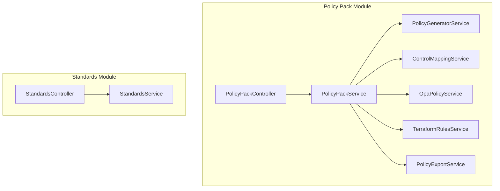
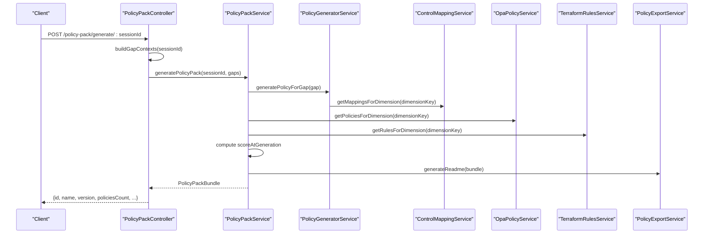
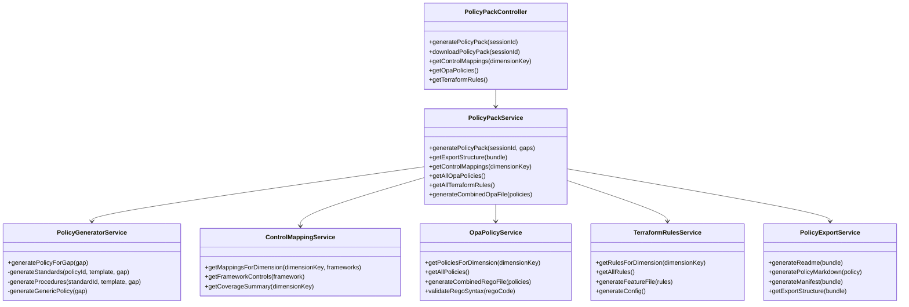
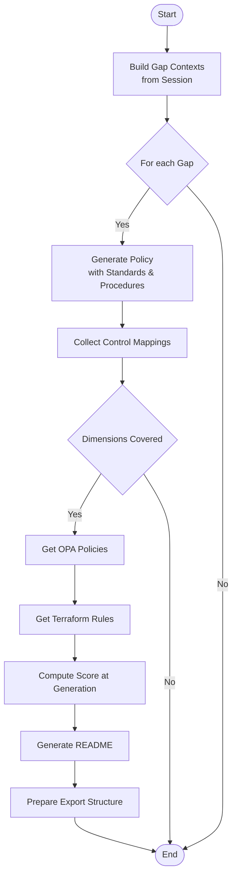
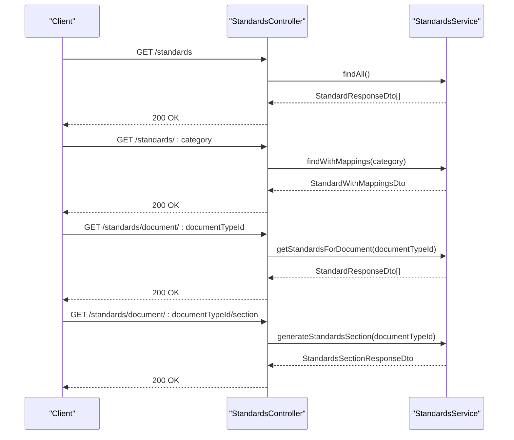
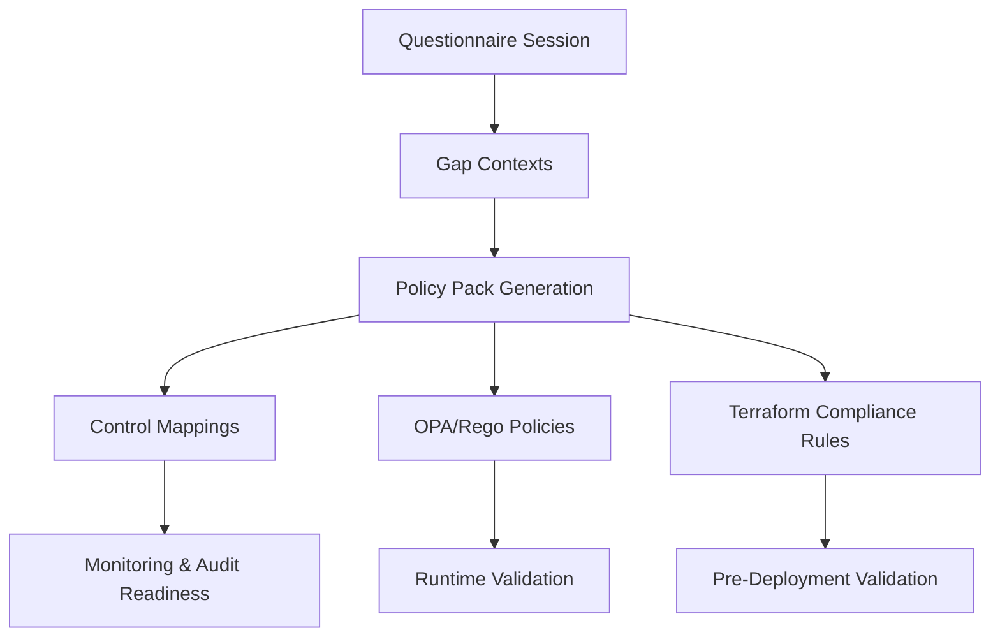
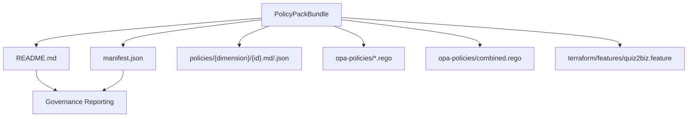
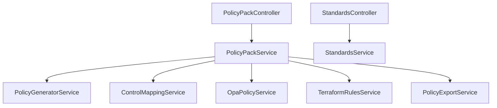

# Compliance Tracking

<cite>
**Referenced Files in This Document**
- [policy-pack.module.ts](file://apps/api/src/modules/policy-pack/policy-pack.module.ts)
- [policy-pack.controller.ts](file://apps/api/src/modules/policy-pack/policy-pack.controller.ts)
- [policy-pack.service.ts](file://apps/api/src/modules/policy-pack/policy-pack.service.ts)
- [policy-generator.service.ts](file://apps/api/src/modules/policy-pack/services/policy-generator.service.ts)
- [control-mapping.service.ts](file://apps/api/src/modules/policy-pack/services/control-mapping.service.ts)
- [opa-policy.service.ts](file://apps/api/src/modules/policy-pack/services/opa-policy.service.ts)
- [terraform-rules.service.ts](file://apps/api/src/modules/policy-pack/services/terraform-rules.service.ts)
- [policy-export.service.ts](file://apps/api/src/modules/policy-pack/services/policy-export.service.ts)
- [standards.module.ts](file://apps/api/src/modules/standards/standards.module.ts)
- [standards.controller.ts](file://apps/api/src/modules/standards/standards.controller.ts)
- [standard.dto.ts](file://apps/api/src/modules/standards/dto/standard.dto.ts)
- [standard.types.ts](file://apps/api/src/modules/standards/types/standard.types.ts)
</cite>

## Table of Contents
1. [Introduction](#introduction)
2. [Project Structure](#project-structure)
3. [Core Components](#core-components)
4. [Architecture Overview](#architecture-overview)
5. [Detailed Component Analysis](#detailed-component-analysis)
6. [Dependency Analysis](#dependency-analysis)
7. [Performance Considerations](#performance-considerations)
8. [Troubleshooting Guide](#troubleshooting-guide)
9. [Conclusion](#conclusion)
10. [Appendices](#appendices)

## Introduction
This document describes the compliance tracking system built around two primary modules: Policy Pack and Standards. The Policy Pack module generates compliance-ready policy documents from readiness gaps, aligns them with international frameworks (ISO 27001, NIST CSF, OWASP ASVS), and produces supporting OPA/Rego policies and Terraform compliance rules. The Standards module exposes curated industry-specific compliance requirements and governance controls for use across documents and workflows. Together, these modules enable automated assessment, policy generation, export, and governance reporting.

## Project Structure
The compliance tracking system is organized into NestJS modules with focused responsibilities:
- Policy Pack module: policy generation, control mapping, OPA policy generation, Terraform rules, and export bundling
- Standards module: retrieval and presentation of engineering standards and mappings

**Diagram sources**
- [policy-pack.controller.ts:16-171](file://apps/api/src/modules/policy-pack/policy-pack.controller.ts#L16-L171)
- [policy-pack.service.ts:16-133](file://apps/api/src/modules/policy-pack/policy-pack.service.ts#L16-L133)
- [policy-generator.service.ts:31-312](file://apps/api/src/modules/policy-pack/services/policy-generator.service.ts#L31-L312)
- [control-mapping.service.ts:14-478](file://apps/api/src/modules/policy-pack/services/control-mapping.service.ts#L14-L478)
- [opa-policy.service.ts:8-245](file://apps/api/src/modules/policy-pack/services/opa-policy.service.ts#L8-L245)
- [terraform-rules.service.ts:15-195](file://apps/api/src/modules/policy-pack/services/terraform-rules.service.ts#L15-L195)
- [policy-export.service.ts:8-273](file://apps/api/src/modules/policy-pack/services/policy-export.service.ts#L8-L273)
- [standards.controller.ts:15-90](file://apps/api/src/modules/standards/standards.controller.ts#L15-L90)

**Section sources**
- [policy-pack.module.ts:8-32](file://apps/api/src/modules/policy-pack/policy-pack.module.ts#L8-L32)
- [standards.module.ts:1-13](file://apps/api/src/modules/standards/standards.module.ts#L1-L13)

## Core Components
- PolicyPackController: Exposes endpoints to generate and download policy packs, and to fetch control mappings and compliance rules.
- PolicyPackService: Orchestrates policy generation, collects OPA policies and Terraform rules for covered dimensions, computes readiness scores, and prepares export bundles.
- PolicyGeneratorService: Produces Policy → Standard → Procedure documents from gap contexts, with framework-aligned templates and control mappings.
- ControlMappingService: Provides mappings to ISO 27001, NIST CSF, and OWASP ASVS controls for each dimension.
- OpaPolicyService: Supplies OPA/Rego policies for infrastructure validation aligned with security and governance needs.
- TerraformRulesService: Generates terraform-compliance feature files for Azure-focused resources.
- PolicyExportService: Creates ZIP bundles with README, manifests, policy markdown/json, OPA Rego files, and Terraform feature files.
- StandardsController: Public endpoints to list standards, filter by category, and generate standards sections for documents.
- StandardsService: Retrieves standards with mappings and supports generating Markdown sections for specific document types.

**Section sources**
- [policy-pack.controller.ts:16-171](file://apps/api/src/modules/policy-pack/policy-pack.controller.ts#L16-L171)
- [policy-pack.service.ts:16-133](file://apps/api/src/modules/policy-pack/policy-pack.service.ts#L16-L133)
- [policy-generator.service.ts:31-312](file://apps/api/src/modules/policy-pack/services/policy-generator.service.ts#L31-L312)
- [control-mapping.service.ts:14-478](file://apps/api/src/modules/policy-pack/services/control-mapping.service.ts#L14-L478)
- [opa-policy.service.ts:8-245](file://apps/api/src/modules/policy-pack/services/opa-policy.service.ts#L8-L245)
- [terraform-rules.service.ts:15-195](file://apps/api/src/modules/policy-pack/services/terraform-rules.service.ts#L15-L195)
- [policy-export.service.ts:8-273](file://apps/api/src/modules/policy-pack/services/policy-export.service.ts#L8-L273)
- [standards.controller.ts:15-90](file://apps/api/src/modules/standards/standards.controller.ts#L15-L90)

## Architecture Overview
The system follows a layered architecture:
- Controllers handle HTTP requests and delegate to services
- Services encapsulate domain logic for policy generation, control mapping, policy export, and rule generation
- Data access is handled via PrismaService injected into services
- Export and rule generation produce filesystem-like structures suitable for ZIP packaging

**Diagram sources**
- [policy-pack.controller.ts:28-61](file://apps/api/src/modules/policy-pack/policy-pack.controller.ts#L28-L61)
- [policy-pack.service.ts:32-96](file://apps/api/src/modules/policy-pack/policy-pack.service.ts#L32-L96)
- [policy-generator.service.ts:161-204](file://apps/api/src/modules/policy-pack/services/policy-generator.service.ts#L161-L204)
- [control-mapping.service.ts:429-454](file://apps/api/src/modules/policy-pack/services/control-mapping.service.ts#L429-L454)
- [opa-policy.service.ts:183-185](file://apps/api/src/modules/policy-pack/services/opa-policy.service.ts#L183-L185)
- [terraform-rules.service.ts:147-149](file://apps/api/src/modules/policy-pack/services/terraform-rules.service.ts#L147-L149)
- [policy-export.service.ts:13-87](file://apps/api/src/modules/policy-pack/services/policy-export.service.ts#L13-L87)

## Detailed Component Analysis

### Policy Pack Module
The Policy Pack module coordinates the generation of policy documents and supporting compliance artifacts from questionnaire session gaps.

**Diagram sources**
- [policy-pack.controller.ts:16-171](file://apps/api/src/modules/policy-pack/policy-pack.controller.ts#L16-L171)
- [policy-pack.service.ts:16-133](file://apps/api/src/modules/policy-pack/policy-pack.service.ts#L16-L133)
- [policy-generator.service.ts:31-312](file://apps/api/src/modules/policy-pack/services/policy-generator.service.ts#L31-L312)
- [control-mapping.service.ts:14-478](file://apps/api/src/modules/policy-pack/services/control-mapping.service.ts#L14-L478)
- [opa-policy.service.ts:8-245](file://apps/api/src/modules/policy-pack/services/opa-policy.service.ts#L8-L245)
- [terraform-rules.service.ts:15-195](file://apps/api/src/modules/policy-pack/services/terraform-rules.service.ts#L15-L195)
- [policy-export.service.ts:8-273](file://apps/api/src/modules/policy-pack/services/policy-export.service.ts#L8-L273)

#### Policy Generation Workflow
- Input: Gap contexts derived from a questionnaire session
- Process:
  - For each gap, generate a policy with standards and procedures
  - Collect control mappings aligned to ISO 27001, NIST CSF, and OWASP ASVS
  - Gather OPA policies and Terraform rules for covered dimensions
  - Compute score at generation from the session
  - Generate README and export structure
- Output: PolicyPackBundle with policies, OPA policies, and Terraform rules

**Diagram sources**
- [policy-pack.controller.ts:41-61](file://apps/api/src/modules/policy-pack/policy-pack.controller.ts#L41-L61)
- [policy-pack.service.ts:32-96](file://apps/api/src/modules/policy-pack/policy-pack.service.ts#L32-L96)
- [policy-generator.service.ts:161-204](file://apps/api/src/modules/policy-pack/services/policy-generator.service.ts#L161-L204)
- [control-mapping.service.ts:429-454](file://apps/api/src/modules/policy-pack/services/control-mapping.service.ts#L429-L454)
- [opa-policy.service.ts:183-185](file://apps/api/src/modules/policy-pack/services/opa-policy.service.ts#L183-L185)
- [terraform-rules.service.ts:147-149](file://apps/api/src/modules/policy-pack/services/terraform-rules.service.ts#L147-L149)
- [policy-export.service.ts:13-87](file://apps/api/src/modules/policy-pack/services/policy-export.service.ts#L13-L87)

**Section sources**
- [policy-pack.controller.ts:28-106](file://apps/api/src/modules/policy-pack/policy-pack.controller.ts#L28-L106)
- [policy-pack.service.ts:32-96](file://apps/api/src/modules/policy-pack/policy-pack.service.ts#L32-L96)
- [policy-generator.service.ts:161-312](file://apps/api/src/modules/policy-pack/services/policy-generator.service.ts#L161-L312)
- [control-mapping.service.ts:429-478](file://apps/api/src/modules/policy-pack/services/control-mapping.service.ts#L429-L478)
- [opa-policy.service.ts:183-245](file://apps/api/src/modules/policy-pack/services/opa-policy.service.ts#L183-L245)
- [terraform-rules.service.ts:147-195](file://apps/api/src/modules/policy-pack/services/terraform-rules.service.ts#L147-L195)
- [policy-export.service.ts:218-273](file://apps/api/src/modules/policy-pack/services/policy-export.service.ts#L218-L273)

### Standards Management System
The Standards module provides:
- Listing all active engineering standards
- Retrieving standards by category with mappings
- Fetching standards associated with a document type
- Generating a Markdown section for a given document type

**Diagram sources**
- [standards.controller.ts:20-89](file://apps/api/src/modules/standards/standards.controller.ts#L20-L89)

**Section sources**
- [standards.controller.ts:20-89](file://apps/api/src/modules/standards/standards.controller.ts#L20-L89)
- [standard.dto.ts](file://apps/api/src/modules/standards/dto/standard.dto.ts)
- [standard.types.ts](file://apps/api/src/modules/standards/types/standard.types.ts)

### Compliance Monitoring Workflows and Automated Assessment
- Policy Pack generation is triggered by a questionnaire session ID, ensuring automated assessment from readiness gaps.
- Control mappings provide framework alignment for continuous monitoring and audit readiness.
- OPA policies enable runtime validation of infrastructure configurations.
- Terraform rules support pre-deploy validation via terraform-compliance.

**Diagram sources**
- [policy-pack.controller.ts:41-61](file://apps/api/src/modules/policy-pack/policy-pack.controller.ts#L41-L61)
- [control-mapping.service.ts:429-454](file://apps/api/src/modules/policy-pack/services/control-mapping.service.ts#L429-L454)
- [opa-policy.service.ts:183-185](file://apps/api/src/modules/policy-pack/services/opa-policy.service.ts#L183-L185)
- [terraform-rules.service.ts:147-149](file://apps/api/src/modules/policy-pack/services/terraform-rules.service.ts#L147-L149)

### Policy Export and Governance Reporting
- Export bundle includes:
  - README with contents, usage instructions, and control mapping summaries
  - Policy markdown and JSON for each policy
  - Individual and combined OPA Rego files
  - Terraform feature files for compliance rules
  - Manifest describing bundle contents and source session
- Governance reporting:
  - Control mapping counts per framework
  - Source session and readiness score at generation

**Diagram sources**
- [policy-export.service.ts:218-273](file://apps/api/src/modules/policy-pack/services/policy-export.service.ts#L218-L273)

**Section sources**
- [policy-export.service.ts:13-87](file://apps/api/src/modules/policy-pack/services/policy-export.service.ts#L13-L87)
- [policy-export.service.ts:218-273](file://apps/api/src/modules/policy-pack/services/policy-export.service.ts#L218-L273)

### Integration with External Compliance Frameworks
- Control mappings align policies with:
  - ISO 27001 (Annex A controls)
  - NIST CSF (Identify, Protect, Detect, Respond, Recover domains)
  - OWASP ASVS (Application security verification standard)
- OPA/Rego policies target cloud provider resources (Azure/AWS) commonly used in the platform
- Terraform rules focus on Azure resources for terraform-compliance validation

**Section sources**
- [control-mapping.service.ts:19-424](file://apps/api/src/modules/policy-pack/services/control-mapping.service.ts#L19-L424)
- [opa-policy.service.ts:13-178](file://apps/api/src/modules/policy-pack/services/opa-policy.service.ts#L13-L178)
- [terraform-rules.service.ts:20-142](file://apps/api/src/modules/policy-pack/services/terraform-rules.service.ts#L20-L142)

### Admin Interfaces and Oversight
- Policy Pack endpoints:
  - Generate policy pack from session
  - Download ZIP bundle
  - Retrieve control mappings and compliance rules
- Standards endpoints:
  - Public listing and filtering by category
  - Standards sections for document types
- These endpoints are protected by JWT authentication and expose Swagger metadata for discoverability.

**Section sources**
- [policy-pack.controller.ts:13-171](file://apps/api/src/modules/policy-pack/policy-pack.controller.ts#L13-L171)
- [standards.controller.ts:15-90](file://apps/api/src/modules/standards/standards.controller.ts#L15-L90)

## Dependency Analysis
- PolicyPackController depends on PolicyPackService and ContextBuilderService
- PolicyPackService depends on PolicyGeneratorService, ControlMappingService, OpaPolicyService, TerraformRulesService, and PolicyExportService
- StandardsController depends on StandardsService
- All services are injectable and orchestrated by their respective modules

**Diagram sources**
- [policy-pack.controller.ts:20-23](file://apps/api/src/modules/policy-pack/policy-pack.controller.ts#L20-L23)
- [policy-pack.service.ts:20-27](file://apps/api/src/modules/policy-pack/policy-pack.service.ts#L20-L27)
- [standards.controller.ts](file://apps/api/src/modules/standards/standards.controller.ts#L18)

**Section sources**
- [policy-pack.module.ts:19-31](file://apps/api/src/modules/policy-pack/policy-pack.module.ts#L19-L31)
- [standards.module.ts:6-12](file://apps/api/src/modules/standards/standards.module.ts#L6-L12)

## Performance Considerations
- Policy generation loops over gaps and dimensions; ensure efficient template lookup and mapping retrieval
- Export bundle creation aggregates many files; consider streaming ZIP generation for large exports
- OPA and Terraform rule generation can be cached per dimension to avoid recomputation
- Use pagination for listing standards and compliance rules when scaling

## Troubleshooting Guide
- Policy generation failures:
  - Inspect warnings logged during policy generation for specific gap IDs
  - Verify gap contexts are present for the session ID
- OPA policy validation:
  - Use basic syntax validation to detect missing package declarations or rules
- Terraform-compliance execution:
  - Ensure terraform plan JSON is generated and placed correctly for feature file evaluation
- Download issues:
  - Confirm archive creation and response headers for ZIP downloads

**Section sources**
- [policy-pack.service.ts:44-48](file://apps/api/src/modules/policy-pack/policy-pack.service.ts#L44-L48)
- [opa-policy.service.ts:225-243](file://apps/api/src/modules/policy-pack/services/opa-policy.service.ts#L225-L243)
- [policy-pack.controller.ts:80-106](file://apps/api/src/modules/policy-pack/policy-pack.controller.ts#L80-L106)

## Conclusion
The compliance tracking system automates policy generation from readiness gaps, aligns them with major frameworks, and produces actionable artifacts for governance and auditing. The Standards module complements this by exposing curated requirements and mappings. Together, they support continuous monitoring, automated assessment, and streamlined audit preparation.

## Appendices
- Example workflows:
  - Generate policy pack from a session and download the ZIP bundle
  - Retrieve control mappings for a dimension to assess framework coverage
  - List standards by category and generate a standards section for a document type
- Governance reporting:
  - Use README summaries and manifests to report control mapping counts and source session metrics