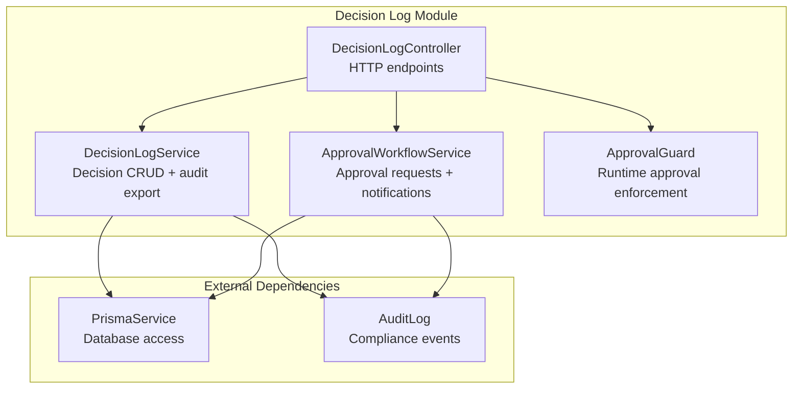
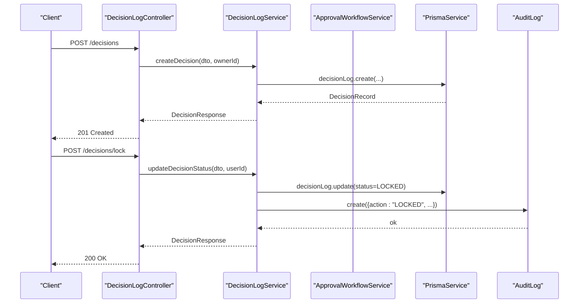
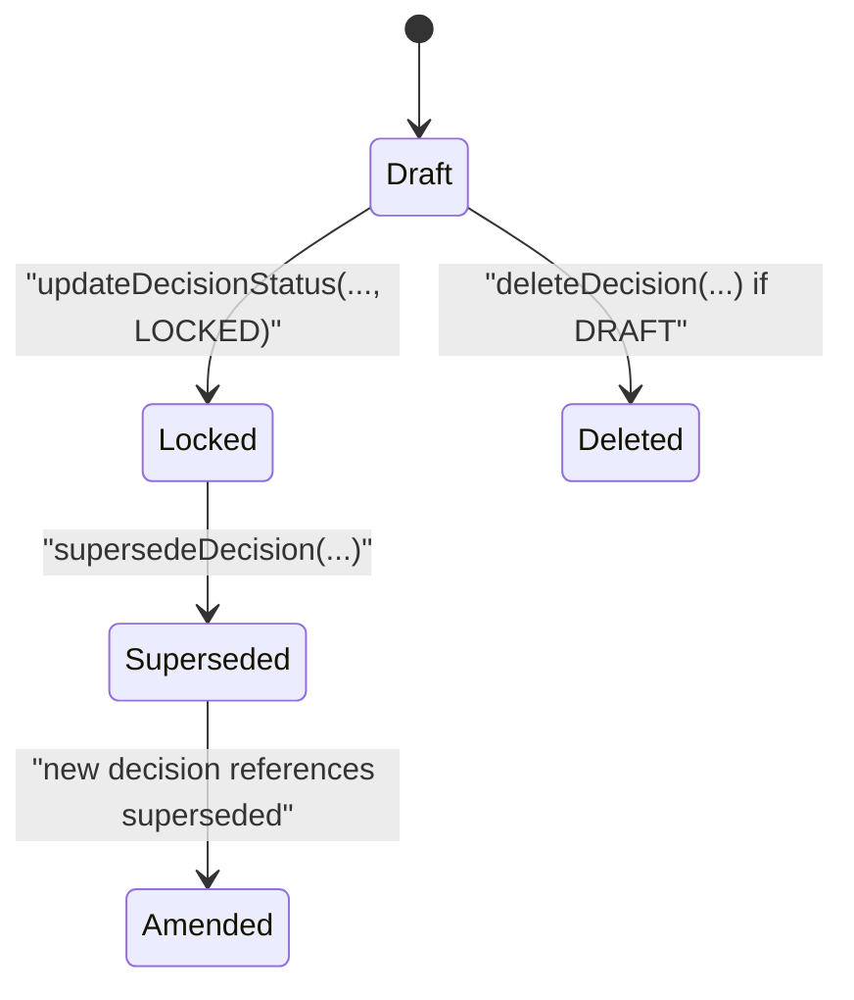
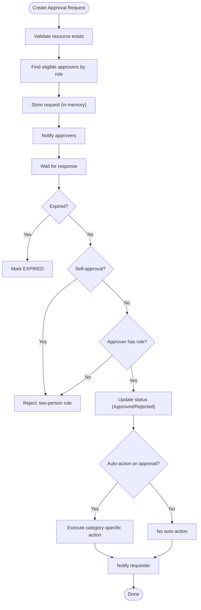
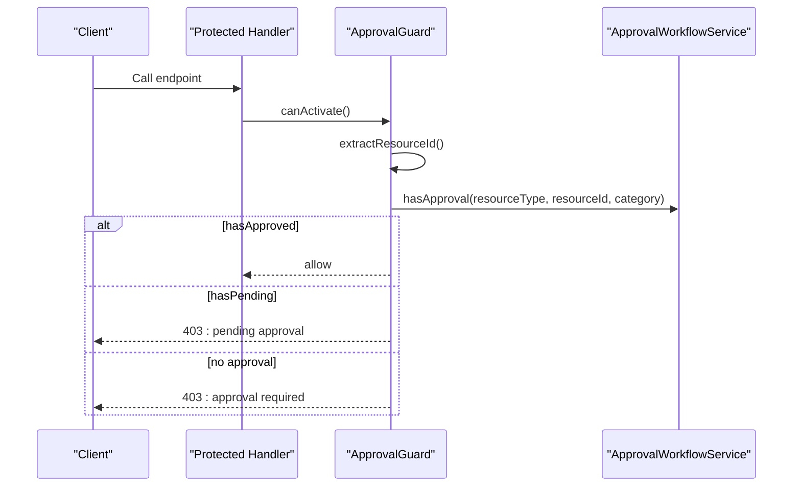
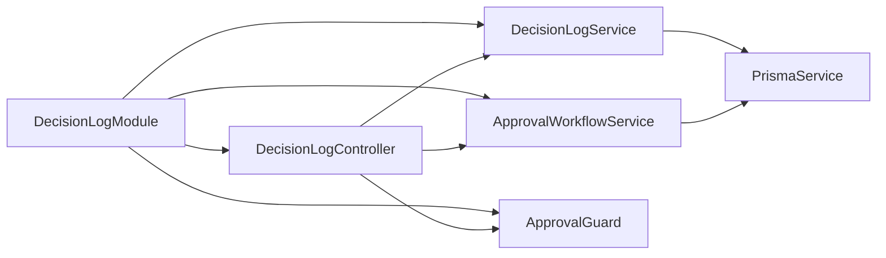

# Decision Workflows

<cite>
**Referenced Files in This Document**
- [decision-log.module.ts](file://apps/api/src/modules/decision-log/decision-log.module.ts)
- [decision-log.service.ts](file://apps/api/src/modules/decision-log/decision-log.service.ts)
- [approval-workflow.service.ts](file://apps/api/src/modules/decision-log/approval-workflow.service.ts)
- [decision-log.controller.ts](file://apps/api/src/modules/decision-log/decision-log.controller.ts)
- [require-approval.decorator.ts](file://apps/api/src/modules/decision-log/decorators/require-approval.decorator.ts)
- [index.ts](file://apps/api/src/modules/decision-log/index.ts)
</cite>

## Table of Contents
1. [Introduction](#introduction)
2. [Project Structure](#project-structure)
3. [Core Components](#core-components)
4. [Architecture Overview](#architecture-overview)
5. [Detailed Component Analysis](#detailed-component-analysis)
6. [Dependency Analysis](#dependency-analysis)
7. [Performance Considerations](#performance-considerations)
8. [Troubleshooting Guide](#troubleshooting-guide)
9. [Conclusion](#conclusion)
10. [Appendices](#appendices)

## Introduction
This document describes the decision log and approval workflow system implemented in the Quiz-to-Build platform. It covers the append-only decision lifecycle, multi-level approval routing, conditional gating, escalation and notification mechanisms, governance controls, and administrative interfaces. The system enforces a strict two-person rule for high-risk actions and maintains a complete audit trail for compliance.

## Project Structure
The decision workflows are encapsulated in a dedicated NestJS module with a controller, service, and an approval workflow service. A reusable decorator and guard enforce approval requirements at runtime.

**Diagram sources**
- [decision-log.module.ts:18-24](file://apps/api/src/modules/decision-log/decision-log.module.ts#L18-L24)
- [decision-log.controller.ts:39-41](file://apps/api/src/modules/decision-log/decision-log.controller.ts#L39-L41)
- [decision-log.service.ts:37-41](file://apps/api/src/modules/decision-log/decision-log.service.ts#L37-L41)
- [approval-workflow.service.ts:89-99](file://apps/api/src/modules/decision-log/approval-workflow.service.ts#L89-L99)

**Section sources**
- [decision-log.module.ts:1-25](file://apps/api/src/modules/decision-log/decision-log.module.ts#L1-L25)
- [index.ts:1-7](file://apps/api/src/modules/decision-log/index.ts#L1-L7)

## Core Components
- DecisionLogController: Exposes REST endpoints for creating, locking, superseding, listing, exporting, and deleting decisions.
- DecisionLogService: Implements append-only decision semantics, status transitions, supersession chaining, and audit exports.
- ApprovalWorkflowService: Manages approval requests, categorization, permission checks, expiration, and notifications.
- ApprovalGuard and RequireApproval decorators: Enforce runtime approval gating for protected operations.

Key governance features:
- Append-only decision records with immutable status transitions.
- Two-person rule via approval categories and role-based permissions.
- Audit logs for all decision and approval actions.
- Notifications for new requests, responses, and expiring approvals.

**Section sources**
- [decision-log.controller.ts:46-277](file://apps/api/src/modules/decision-log/decision-log.controller.ts#L46-L277)
- [decision-log.service.ts:49-396](file://apps/api/src/modules/decision-log/decision-log.service.ts#L49-L396)
- [approval-workflow.service.ts:108-653](file://apps/api/src/modules/decision-log/approval-workflow.service.ts#L108-L653)
- [require-approval.decorator.ts:1-200](file://apps/api/src/modules/decision-log/decorators/require-approval.decorator.ts#L1-L200)

## Architecture Overview
The system integrates decision management with an approval workflow engine. Controllers delegate to services, which interact with the database and audit log. Approval requests trigger notifications and can automatically execute actions upon approval.

**Diagram sources**
- [decision-log.controller.ts:61-98](file://apps/api/src/modules/decision-log/decision-log.controller.ts#L61-L98)
- [decision-log.service.ts:87-123](file://apps/api/src/modules/decision-log/decision-log.service.ts#L87-L123)

## Detailed Component Analysis

### Decision Lifecycle and Append-Only Semantics
Decision records follow a strict workflow:
- Creation: DRAFT status
- Locking: DRAFT → LOCKED (immutable)
- Amendment: Create a new decision that supersedes the locked one
- Deletion: Only DRAFT decisions can be removed

**Diagram sources**
- [decision-log.service.ts:31-36](file://apps/api/src/modules/decision-log/decision-log.service.ts#L31-L36)
- [decision-log.service.ts:87-123](file://apps/api/src/modules/decision-log/decision-log.service.ts#L87-L123)
- [decision-log.service.ts:135-188](file://apps/api/src/modules/decision-log/decision-log.service.ts#L135-L188)
- [decision-log.service.ts:325-347](file://apps/api/src/modules/decision-log/decision-log.service.ts#L325-L347)

**Section sources**
- [decision-log.service.ts:49-188](file://apps/api/src/modules/decision-log/decision-log.service.ts#L49-L188)
- [decision-log.controller.ts:61-156](file://apps/api/src/modules/decision-log/decision-log.controller.ts#L61-L156)

### Approval Workflow Engine
Approval categories and statuses:
- Categories: Policy lock, ADR approval, high-risk decision, security exception, data access.
- Statuses: Pending, Approved, Rejected, Expired.

Approval request lifecycle:
- Create request with category, resource type/id, reason, optional metadata, and expiration.
- Eligible approvers are discovered by role mapping per category.
- Respond with approve/reject; requester cannot self-approve.
- On approval, associated actions may execute (e.g., locking a decision).
- Notifications are emitted for new requests, responses, and expiring approvals.

**Diagram sources**
- [approval-workflow.service.ts:108-243](file://apps/api/src/modules/decision-log/approval-workflow.service.ts#L108-L243)
- [approval-workflow.service.ts:444-495](file://apps/api/src/modules/decision-log/approval-workflow.service.ts#L444-L495)
- [approval-workflow.service.ts:533-585](file://apps/api/src/modules/decision-log/approval-workflow.service.ts#L533-L585)

**Section sources**
- [approval-workflow.service.ts:15-64](file://apps/api/src/modules/decision-log/approval-workflow.service.ts#L15-L64)
- [approval-workflow.service.ts:108-243](file://apps/api/src/modules/decision-log/approval-workflow.service.ts#L108-L243)
- [approval-workflow.service.ts:444-495](file://apps/api/src/modules/decision-log/approval-workflow.service.ts#L444-L495)
- [approval-workflow.service.ts:533-651](file://apps/api/src/modules/decision-log/approval-workflow.service.ts#L533-L651)

### Runtime Approval Enforcement (Decorator and Guard)
The RequireApproval decorator and ApprovalGuard enforce preconditions:
- Extract resource ID from route params, body, or query.
- Check if an approved or pending approval exists for the given category and resource.
- Optionally allow admin bypass depending on configuration.
- Throw descriptive errors when missing approvals or pending requests.

**Diagram sources**
- [require-approval.decorator.ts:1-200](file://apps/api/src/modules/decision-log/decorators/require-approval.decorator.ts#L1-L200)
- [approval-workflow.service.ts:307-331](file://apps/api/src/modules/decision-log/approval-workflow.service.ts#L307-L331)

**Section sources**
- [require-approval.decorator.ts:1-200](file://apps/api/src/modules/decision-log/decorators/require-approval.decorator.ts#L1-L200)

### Governance Controls and Compliance
- Role-based access: Each approval category maps to allowed roles.
- Two-person rule: Requester cannot approve their own request.
- Expiration: Requests expire after a configurable window.
- Audit trail: Every decision and approval action logs metadata for compliance.
- Supersession chain: Historical amendments remain discoverable.

**Section sources**
- [approval-workflow.service.ts:444-463](file://apps/api/src/modules/decision-log/approval-workflow.service.ts#L444-L463)
- [approval-workflow.service.ts:184-196](file://apps/api/src/modules/decision-log/approval-workflow.service.ts#L184-L196)
- [decision-log.service.ts:352-367](file://apps/api/src/modules/decision-log/decision-log.service.ts#L352-L367)
- [approval-workflow.service.ts:500-516](file://apps/api/src/modules/decision-log/approval-workflow.service.ts#L500-L516)

### Decision Review, History, and Reporting
- Supersession chain retrieval: Walk backward and forward through related decisions.
- Audit export: Compile decisions for a session with supersession mapping for compliance review.
- Pending approvals: Approver dashboards can list pending items with sorting and filtering.

**Section sources**
- [decision-log.service.ts:276-316](file://apps/api/src/modules/decision-log/decision-log.service.ts#L276-L316)
- [decision-log.service.ts:235-269](file://apps/api/src/modules/decision-log/decision-log.service.ts#L235-L269)
- [approval-workflow.service.ts:248-274](file://apps/api/src/modules/decision-log/approval-workflow.service.ts#L248-L274)

### Integration Points
- Database: PrismaService persists decisions, approvals, and audit logs.
- Notifications: Notification triggers are implemented as audit entries; integration with a notification service is indicated for actual delivery.
- External systems: Approval categories include Policy and ADR, enabling integration with external systems via resource identifiers.

**Section sources**
- [decision-log.service.ts:37-41](file://apps/api/src/modules/decision-log/decision-log.service.ts#L37-L41)
- [approval-workflow.service.ts:99](file://apps/api/src/modules/decision-log/approval-workflow.service.ts#L99)
- [approval-workflow.service.ts:533-585](file://apps/api/src/modules/decision-log/approval-workflow.service.ts#L533-L585)

## Dependency Analysis
The DecisionLogModule wires together the controller, services, and guard. The services depend on Prisma for persistence and on each other for cross-cutting concerns like notifications and audit logging.

**Diagram sources**
- [decision-log.module.ts:18-24](file://apps/api/src/modules/decision-log/decision-log.module.ts#L18-L24)

**Section sources**
- [decision-log.module.ts:1-25](file://apps/api/src/modules/decision-log/decision-log.module.ts#L1-L25)

## Performance Considerations
- In-memory approvals: The approval service uses an in-memory map for demo purposes; in production, persist approvals to the database to avoid data loss across restarts.
- Pagination and limits: Listing decisions applies a reasonable limit and sorts by creation date.
- Transactional supersession: Superseding uses a database transaction to maintain consistency.
- Audit volume: Audit logs grow with activity; consider retention and archival policies.

[No sources needed since this section provides general guidance]

## Troubleshooting Guide
Common issues and resolutions:
- Decision not found: Ensure the decision ID exists and the user has access.
- Invalid status transition: Only DRAFT can be locked; use supersession for changes to LOCKED decisions.
- Cannot delete non-DRAFT: Only draft decisions can be removed.
- Approval not found: Verify the approval ID and that it has not expired.
- Self-approval violation: Requester cannot approve their own request.
- Insufficient permissions: Approver must have the required role for the category.
- Pending approval blocking: Pending approvals prevent protected operations; resolve or escalate.

**Section sources**
- [decision-log.service.ts:95-110](file://apps/api/src/modules/decision-log/decision-log.service.ts#L95-L110)
- [decision-log.service.ts:330-340](file://apps/api/src/modules/decision-log/decision-log.service.ts#L330-L340)
- [approval-workflow.service.ts:175-196](file://apps/api/src/modules/decision-log/approval-workflow.service.ts#L175-L196)
- [approval-workflow.service.ts:458-462](file://apps/api/src/modules/decision-log/approval-workflow.service.ts#L458-L462)

## Conclusion
The decision log and approval workflow system enforces strong governance through append-only records, a two-person rule, and comprehensive auditability. The modular design enables clear separation of concerns, while decorators and guards provide flexible, reusable enforcement at runtime. Extending the system to integrate with external approval systems and notification platforms is straightforward via the existing audit and notification hooks.

[No sources needed since this section summarizes without analyzing specific files]

## Appendices

### API Endpoints Summary
- POST /decisions: Create a decision (DRAFT)
- POST /decisions/lock: Lock a decision (DRAFT → LOCKED)
- PATCH /{decisionId}/status: Frontend-friendly status update
- POST /decisions/supersede: Create a superseding decision
- GET /{decisionId}: Retrieve a decision
- GET /: List decisions with filters
- GET /{decisionId}/chain: Get supersession chain
- GET /export/{sessionId}: Export decisions for audit
- DELETE /{decisionId}: Delete a DRAFT decision

**Section sources**
- [decision-log.controller.ts:46-277](file://apps/api/src/modules/decision-log/decision-log.controller.ts#L46-L277)

### Approval Categories and Roles
- Policy lock: ADMIN, SUPER_ADMIN
- ADR approval: DEVELOPER, ADMIN, SUPER_ADMIN
- High-risk decision: DEVELOPER, ADMIN, SUPER_ADMIN
- Security exception: ADMIN, SUPER_ADMIN
- Data access: ADMIN, SUPER_ADMIN

**Section sources**
- [approval-workflow.service.ts:15-21](file://apps/api/src/modules/decision-log/approval-workflow.service.ts#L15-L21)
- [approval-workflow.service.ts:449-455](file://apps/api/src/modules/decision-log/approval-workflow.service.ts#L449-L455)

### Admin Interfaces and Oversight
- Approver dashboards: View pending approvals and manage responses.
- Audit exports: Download compliance-ready reports for sessions.
- Escalation: Scheduled notifications for expiring approvals.
- Delegation: Not explicitly modeled; administrators can adjust roles and categories.

**Section sources**
- [approval-workflow.service.ts:248-274](file://apps/api/src/modules/decision-log/approval-workflow.service.ts#L248-L274)
- [approval-workflow.service.ts:618-651](file://apps/api/src/modules/decision-log/approval-workflow.service.ts#L618-L651)
- [decision-log.service.ts:235-269](file://apps/api/src/modules/decision-log/decision-log.service.ts#L235-L269)