# Evidence & Compliance

<cite>
**Referenced Files in This Document**
- [apps/api/src/modules/evidence-registry/evidence-registry.module.ts](file://apps/api/src/modules/evidence-registry/evidence-registry.module.ts)
- [apps/api/src/modules/evidence-registry/index.ts](file://apps/api/src/modules/evidence-registry/index.ts)
- [apps/api/src/modules/fact-extraction/fact-extraction.module.ts](file://apps/api/src/modules/fact-extraction/fact-extraction.module.ts)
- [apps/api/src/modules/fact-extraction/index.ts](file://apps/api/src/modules/fact-extraction/index.ts)
- [apps/api/src/modules/decision-log/decision-log.module.ts](file://apps/api/src/modules/decision-log/decision-log.module.ts)
- [apps/api/src/modules/decision-log/index.spec.ts](file://apps/api/src/modules/decision-log/index.spec.ts)
- [apps/api/src/modules/decision-log/decision-log.controller.spec.ts](file://apps/api/src/modules/decision-log/decision-log.controller.spec.ts)
- [apps/api/src/modules/adapters/github.adapter.ts](file://apps/api/src/modules/adapters/github.adapter.ts)
- [apps/api/src/modules/adapters/gitlab.adapter.ts](file://apps/api/src/modules/adapters/gitlab.adapter.ts)
- [apps/api/src/modules/adapters/adapter.controller.ts](file://apps/api/src/modules/adapters/adapter.controller.ts)
- [apps/api/src/modules/admin/controllers/admin.controller.ts](file://apps/api/src/modules/admin/controllers/admin.controller.ts)
- [apps/web/src/pages/evidence/index.tsx](file://apps/web/src/pages/evidence/index.tsx)
- [apps/web/src/stores/evidence.ts](file://apps/web/src/stores/evidence.ts)
- [apps/web/src/api/documents.ts](file://apps/web/src/api/documents.ts)
- [apps/web/src/components/admin/AdminDashboard.tsx](file://apps/web/src/components/admin/AdminDashboard.tsx)
- [apps/web/src/pages/admin/AdminPage.tsx](file://apps/web/src/pages/admin/AdminPage.tsx)
- [apps/api/src/modules/evidence-registry/evidence-registry.service.ts](file://apps/api/src/modules/evidence-registry/evidence-registry.service.ts)
- [apps/api/src/modules/evidence-registry/evidence-integrity.service.ts](file://apps/api/src/modules/evidence-registry/evidence-integrity.service.ts)
- [apps/api/src/modules/evidence-registry/ci-artifact-ingestion.service.ts](file://apps/api/src/modules/evidence-registry/ci-artifact-ingestion.service.ts)
- [apps/api/src/modules/fact-extraction/services/fact-extraction.service.ts](file://apps/api/src/modules/fact-extraction/services/fact-extraction.service.ts)
- [apps/api/src/modules/decision-log/decision-log.service.ts](file://apps/api/src/modules/decision-log/decision-log.service.ts)
- [apps/api/src/modules/decision-log/approval-workflow.service.ts](file://apps/api/src/modules/decision-log/approval-workflow.service.ts)
- [apps/api/src/modules/standards/standards.service.ts](file://apps/api/src/modules/standards/standards.service.ts)
- [apps/api/src/modules/policy-pack/policy-pack.service.ts](file://apps/api/src/modules/policy-pack/policy-pack.service.ts)
- [apps/api/src/modules/quality-scoring/quality-scoring.service.ts](file://apps/api/src/modules/quality-scoring/quality-scoring.service.ts)
- [apps/api/src/modules/heatmap/heatmap.service.ts](file://apps/api/src/modules/heatmap/heatmap.service.ts)
- [apps/api/src/modules/document-generator/document-generator.service.ts](file://apps/api/src/modules/document-generator/document-generator.service.ts)
- [apps/api/src/modules/notifications/notification.service.ts](file://apps/api/src/modules/notifications/notification.service.ts)
- [apps/api/src/modules/notifications/teams-webhook.controller.ts](file://apps/api/src/modules/notifications/teams-webhook.controller.ts)
- [apps/api/src/modules/notifications/adaptive-card.service.ts](file://apps/api/src/modules/notifications/adaptive-card.service.ts)
- [apps/api/src/modules/ai-gateway/ai-gateway.service.ts](file://apps/api/src/modules/ai-gateway/ai-gateway.service.ts)
- [apps/api/src/modules/ai-gateway/ai-gateway.controller.ts](file://apps/api/src/modules/ai-gateway/ai-gateway.controller.ts)
- [apps/api/src/modules/ai-gateway/interfaces.ts](file://apps/api/src/modules/ai-gateway/interfaces.ts)
- [apps/api/src/modules/ai-gateway/dto/index.ts](file://apps/api/src/modules/ai-gateway/dto/index.ts)
- [apps/api/src/modules/ai-gateway/adapters/index.ts](file://apps/api/src/modules/ai-gateway/adapters/index.ts)
- [apps/api/src/modules/ai-gateway/services/index.ts](file://apps/api/src/modules/ai-gateway/services/index.ts)
- [apps/api/src/modules/ai-gateway/adapters/openai.adapter.ts](file://apps/api/src/modules/ai-gateway/adapters/openai.adapter.ts)
- [apps/api/src/modules/ai-gateway/adapters/anthropic.adapter.ts](file://apps/api/src/modules/ai-gateway/adapters/anthropic.adapter.ts)
- [apps/api/src/modules/ai-gateway/adapters/mistral.adapter.ts](file://apps/api/src/modules/ai-gateway/adapters/mistral.adapter.ts)
- [apps/api/src/modules/ai-gateway/services/ai-gateway.service.ts](file://apps/api/src/modules/ai-gateway/services/ai-gateway.service.ts)
- [apps/api/src/modules/ai-gateway/services/ai-gateway.service.spec.ts](file://apps/api/src/modules/ai-gateway/services/ai-gateway.service.spec.ts)
- [apps/api/src/modules/ai-gateway/services/ai-gateway.service.spec.ts](file://apps/api/src/modules/ai-gateway/services/ai-gateway.service.spec.ts)
- [apps/api/src/modules/ai-gateway/services/ai-gateway.service.spec.ts](file://apps/api/src/modules/ai-gateway/services/ai-gateway.service.spec.ts)
- [apps/api/src/modules/ai-gateway/services/ai-gateway.service.spec.ts](file://apps/api/src/modules/ai-gateway/services/ai-gateway.service.spec.ts)
- [apps/api/src/modules/ai-gateway/services/ai-gateway.service.spec.ts](file://apps/api/src/modules/ai-gateway/services/ai-gateway.service.spec.ts)
- [apps/api/src/modules/ai-gateway/services/ai-gateway.service.spec.ts](file://apps/api/src/modules/ai-gateway/services/ai-gateway.service.spec.ts)
- [apps/api/src/modules/ai-gateway/services/ai-gateway.service.spec.ts](file://apps/api/src/modules/ai-gateway/services/ai-gateway.service.spec.ts)
- [apps/api/src/modules/ai-gateway/services/ai-gateway.service.spec.ts](file://apps/api/src/modules/ai-gateway/services/ai-gateway.service.spec.ts)
- [apps/api/src/modules/ai-gateway/services/ai-gateway.service.spec.ts](file://apps/api/src/modules/ai-gateway/services/ai-gateway.service.spec.ts)
- [apps/api/src/modules/ai-gateway/services/ai-gateway.service.spec.ts](file://apps/api/src/modules/ai-gateway/services/ai-gateway.service.spec.ts)
- [apps/api/src/modules/ai-gateway/services/ai-gateway.service.spec.ts](file://apps/api/src/modules/ai-gateway/services/ai-gateway.service.spec.ts)
- [apps/api/src/modules/ai-gateway/services/ai-gateway.service.spec.ts](file://apps/api/src/modules/ai-gateway/services/ai-gateway.service.spec.ts)
- [apps/api/src/modules/ai-gateway/services/ai-gateway.service.spec.ts](file://apps/api/src/modules/ai-gateway/services/ai-gateway.service.spec.ts)
- [apps/api/src/modules/ai-gateway/services/ai-gateway.service.spec.ts](file://apps/api/src/modules/ai-gateway/services/ai-gateway.service.spec.ts)
- [apps/api/src/modules/ai-gateway/services/ai-gateway.service.spec.ts](......)
</cite>

## Table of Contents
1. [Introduction](#introduction)
2. [Project Structure](#project-structure)
3. [Core Components](#core-components)
4. [Architecture Overview](#architecture-overview)
5. [Detailed Component Analysis](#detailed-component-analysis)
6. [Dependency Analysis](#dependency-analysis)
7. [Performance Considerations](#performance-considerations)
8. [Troubleshooting Guide](#troubleshooting-guide)
9. [Conclusion](#conclusion)
10. [Appendices](#appendices)

## Introduction
This document describes the evidence registry and compliance tracking system, focusing on how evidence is collected from external systems (GitHub, GitLab), ingested from CI/CD pipelines, and managed through manual uploads. It explains the integrity verification system, compliance workflows, audit trail generation, decision logs with approvals, and the fact extraction system for automated data capture and structured categorization. Guidance is included for integrating with external compliance frameworks, policy management, and governance requirements, along with practical examples for evidence collection workflows, compliance reporting, and audit preparation. Administrative interfaces for evidence management, compliance monitoring, and quality assurance are also documented.

## Project Structure
The system is organized around three primary modules:
- Evidence Registry: manages evidence lifecycle, integrity, and CI ingestion
- Fact Extraction: extracts structured facts from conversations and supports categorization
- Decision Log: maintains an append-only decision record with approval workflows

Supporting modules include adapters for external systems, AI gateway for LLM orchestration, standards and policy pack for compliance mapping, and admin interfaces for oversight.

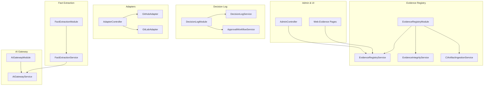

**Diagram sources**
- [apps/api/src/modules/evidence-registry/evidence-registry.module.ts:1-27](file://apps/api/src/modules/evidence-registry/evidence-registry.module.ts#L1-L27)
- [apps/api/src/modules/fact-extraction/fact-extraction.module.ts:1-26](file://apps/api/src/modules/fact-extraction/fact-extraction.module.ts#L1-L26)
- [apps/api/src/modules/decision-log/decision-log.module.ts:1-25](file://apps/api/src/modules/decision-log/decision-log.module.ts#L1-L25)
- [apps/api/src/modules/adapters/github.adapter.ts](file://apps/api/src/modules/adapters/github.adapter.ts)
- [apps/api/src/modules/adapters/gitlab.adapter.ts](file://apps/api/src/modules/adapters/gitlab.adapter.ts)
- [apps/api/src/modules/adapters/adapter.controller.ts](file://apps/api/src/modules/adapters/adapter.controller.ts)
- [apps/api/src/modules/ai-gateway/ai-gateway.module.ts](file://apps/api/src/modules/ai-gateway/ai-gateway.module.ts)
- [apps/api/src/modules/ai-gateway/ai-gateway.service.ts](file://apps/api/src/modules/ai-gateway/ai-gateway.service.ts)
- [apps/api/src/modules/admin/controllers/admin.controller.ts](file://apps/api/src/modules/admin/controllers/admin.controller.ts)
- [apps/web/src/pages/evidence/index.tsx](file://apps/web/src/pages/evidence/index.tsx)

**Section sources**
- [apps/api/src/modules/evidence-registry/evidence-registry.module.ts:1-27](file://apps/api/src/modules/evidence-registry/evidence-registry.module.ts#L1-L27)
- [apps/api/src/modules/fact-extraction/fact-extraction.module.ts:1-26](file://apps/api/src/modules/fact-extraction/fact-extraction.module.ts#L1-L26)
- [apps/api/src/modules/decision-log/decision-log.module.ts:1-25](file://apps/api/src/modules/decision-log/decision-log.module.ts#L1-L25)

## Core Components
- Evidence Registry Module: Provides services for uploading, storing, hashing, and verifying evidence; integrates with CI artifact ingestion and external adapters.
- Fact Extraction Module: Extracts structured facts from conversations using AI, validates completeness, and supports manual editing.
- Decision Log Module: Enforces append-only decision records with status workflows, supersession tracking, and two-person approval.

Key exports and entry points:
- Evidence Registry exports: module, service, controller, integrity service, CI ingestion service, and DTOs
- Fact Extraction exports: module, controller, service, DTOs, interfaces, and schemas
- Decision Log exports: module, service, controller, approval workflow service, and DTOs

**Section sources**
- [apps/api/src/modules/evidence-registry/index.ts:1-6](file://apps/api/src/modules/evidence-registry/index.ts#L1-L6)
- [apps/api/src/modules/fact-extraction/index.ts:1-6](file://apps/api/src/modules/fact-extraction/index.ts#L1-L6)
- [apps/api/src/modules/decision-log/index.spec.ts:1-30](file://apps/api/src/modules/decision-log/index.spec.ts#L1-L30)

## Architecture Overview
The system integrates external sources (GitHub, GitLab), CI pipelines, and manual uploads into a unified evidence registry. Integrity is enforced via cryptographic hashing and timestamping. Structured facts extracted from conversations feed compliance workflows and decision logs. Admin and UI layers support oversight and quality assurance.

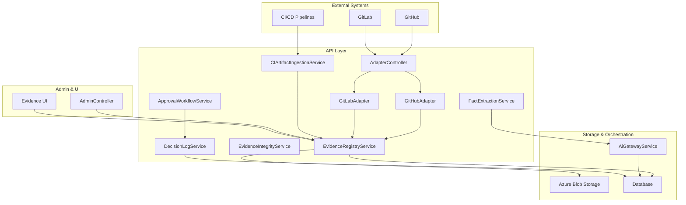

**Diagram sources**
- [apps/api/src/modules/adapters/adapter.controller.ts](file://apps/api/src/modules/adapters/adapter.controller.ts)
- [apps/api/src/modules/adapters/github.adapter.ts](file://apps/api/src/modules/adapters/github.adapter.ts)
- [apps/api/src/modules/adapters/gitlab.adapter.ts](file://apps/api/src/modules/adapters/gitlab.adapter.ts)
- [apps/api/src/modules/evidence-registry/evidence-registry.service.ts](file://apps/api/src/modules/evidence-registry/evidence-registry.service.ts)
- [apps/api/src/modules/evidence-registry/evidence-integrity.service.ts](file://apps/api/src/modules/evidence-registry/evidence-integrity.service.ts)
- [apps/api/src/modules/evidence-registry/ci-artifact-ingestion.service.ts](file://apps/api/src/modules/evidence-registry/ci-artifact-ingestion.service.ts)
- [apps/api/src/modules/fact-extraction/services/fact-extraction.service.ts](file://apps/api/src/modules/fact-extraction/services/fact-extraction.service.ts)
- [apps/api/src/modules/decision-log/decision-log.service.ts](file://apps/api/src/modules/decision-log/decision-log.service.ts)
- [apps/api/src/modules/decision-log/approval-workflow.service.ts](file://apps/api/src/modules/decision-log/approval-workflow.service.ts)
- [apps/api/src/modules/ai-gateway/ai-gateway.service.ts](file://apps/api/src/modules/ai-gateway/ai-gateway.service.ts)
- [apps/api/src/modules/admin/controllers/admin.controller.ts](file://apps/api/src/modules/admin/controllers/admin.controller.ts)
- [apps/web/src/pages/evidence/index.tsx](file://apps/web/src/pages/evidence/index.tsx)

## Detailed Component Analysis

### Evidence Registry
The Evidence Registry manages evidence collection, storage, and integrity verification. It supports:
- Uploads with SHA-256 hashing and Azure Blob Storage integration
- CI artifact ingestion
- Hash chain evidence integrity (Sprint 14)
- RFC 3161 timestamp authority integration
- Linking evidence to questions and sessions

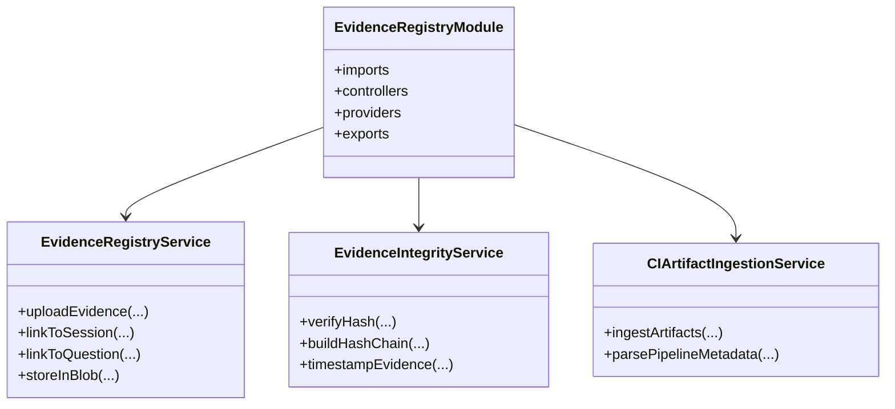

**Diagram sources**
- [apps/api/src/modules/evidence-registry/evidence-registry.module.ts:1-27](file://apps/api/src/modules/evidence-registry/evidence-registry.module.ts#L1-L27)
- [apps/api/src/modules/evidence-registry/evidence-registry.service.ts](file://apps/api/src/modules/evidence-registry/evidence-registry.service.ts)
- [apps/api/src/modules/evidence-registry/evidence-integrity.service.ts](file://apps/api/src/modules/evidence-registry/evidence-integrity.service.ts)
- [apps/api/src/modules/evidence-registry/ci-artifact-ingestion.service.ts](file://apps/api/src/modules/evidence-registry/ci-artifact-ingestion.service.ts)

**Section sources**
- [apps/api/src/modules/evidence-registry/evidence-registry.module.ts:8-19](file://apps/api/src/modules/evidence-registry/evidence-registry.module.ts#L8-L19)

### Fact Extraction
The Fact Extraction system captures structured business facts from conversations using AI, validates completeness, and supports manual editing. It integrates with the AI Gateway for LLM orchestration.

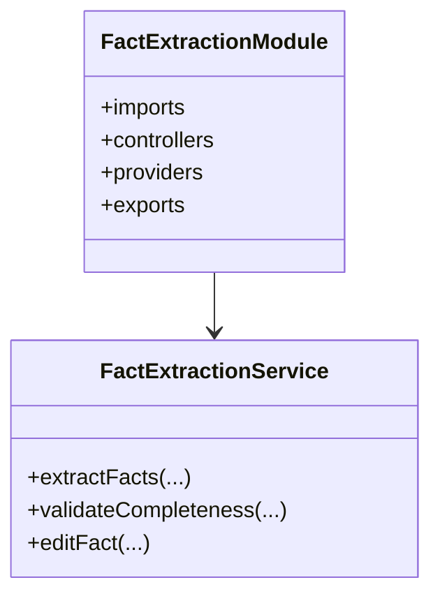

**Diagram sources**
- [apps/api/src/modules/fact-extraction/fact-extraction.module.ts:1-26](file://apps/api/src/modules/fact-extraction/fact-extraction.module.ts#L1-L26)
- [apps/api/src/modules/fact-extraction/services/fact-extraction.service.ts](file://apps/api/src/modules/fact-extraction/services/fact-extraction.service.ts)

**Section sources**
- [apps/api/src/modules/fact-extraction/fact-extraction.module.ts:1-10](file://apps/api/src/modules/fact-extraction/fact-extraction.module.ts#L1-L10)

### Decision Log
The Decision Log enforces an append-only, auditable record of decisions with status workflows and supersession tracking. Approval workflows enforce two-person rule governance.

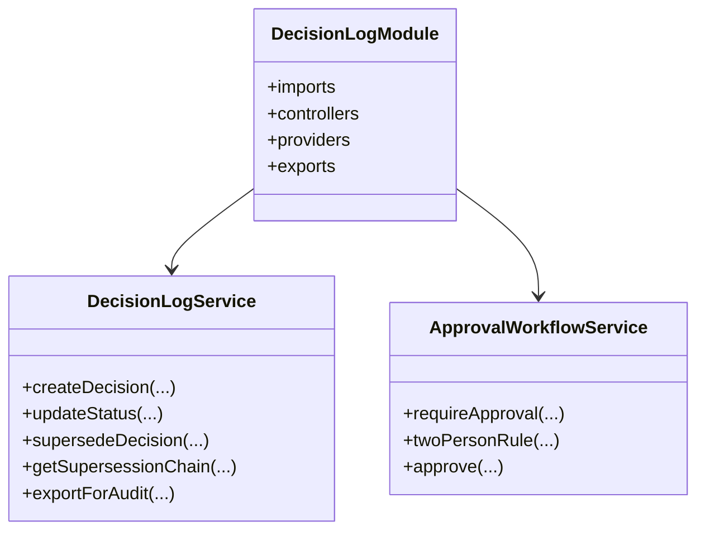

**Diagram sources**
- [apps/api/src/modules/decision-log/decision-log.module.ts:1-25](file://apps/api/src/modules/decision-log/decision-log.module.ts#L1-L25)
- [apps/api/src/modules/decision-log/decision-log.service.ts](file://apps/api/src/modules/decision-log/decision-log.service.ts)
- [apps/api/src/modules/decision-log/approval-workflow.service.ts](file://apps/api/src/modules/decision-log/approval-workflow.service.ts)

**Section sources**
- [apps/api/src/modules/decision-log/decision-log.module.ts:8-17](file://apps/api/src/modules/decision-log/decision-log.module.ts#L8-L17)

### Adapters: GitHub and GitLab Integration
The Adapter Controller coordinates with GitHub and GitLab adapters to ingest repository artifacts and metadata into the evidence registry.

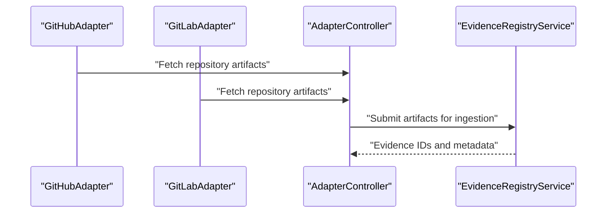

**Diagram sources**
- [apps/api/src/modules/adapters/github.adapter.ts](file://apps/api/src/modules/adapters/github.adapter.ts)
- [apps/api/src/modules/adapters/gitlab.adapter.ts](file://apps/api/src/modules/adapters/gitlab.adapter.ts)
- [apps/api/src/modules/adapters/adapter.controller.ts](file://apps/api/src/modules/adapters/adapter.controller.ts)
- [apps/api/src/modules/evidence-registry/evidence-registry.service.ts](file://apps/api/src/modules/evidence-registry/evidence-registry.service.ts)

**Section sources**
- [apps/api/src/modules/adapters/github.adapter.ts](file://apps/api/src/modules/adapters/github.adapter.ts)
- [apps/api/src/modules/adapters/gitlab.adapter.ts](file://apps/api/src/modules/adapters/gitlab.adapter.ts)
- [apps/api/src/modules/adapters/adapter.controller.ts](file://apps/api/src/modules/adapters/adapter.controller.ts)

### CI Artifact Ingestion
CI pipelines trigger automated ingestion of build/test artifacts into the evidence registry, enabling continuous compliance tracking.

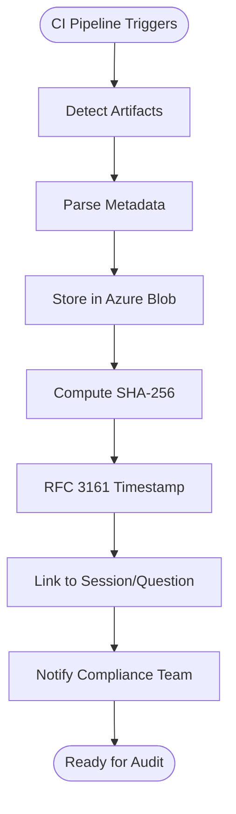

**Diagram sources**
- [apps/api/src/modules/evidence-registry/ci-artifact-ingestion.service.ts](file://apps/api/src/modules/evidence-registry/ci-artifact-ingestion.service.ts)
- [apps/api/src/modules/evidence-registry/evidence-registry.service.ts](file://apps/api/src/modules/evidence-registry/evidence-registry.service.ts)
- [apps/api/src/modules/evidence-registry/evidence-integrity.service.ts](file://apps/api/src/modules/evidence-registry/evidence-integrity.service.ts)

**Section sources**
- [apps/api/src/modules/evidence-registry/ci-artifact-ingestion.service.ts](file://apps/api/src/modules/evidence-registry/ci-artifact-ingestion.service.ts)

### Evidence Integrity and Tamper Detection
Integrity verification ensures evidence has not been altered. The system computes hashes, builds hash chains, and applies timestamps to strengthen tamper resistance.

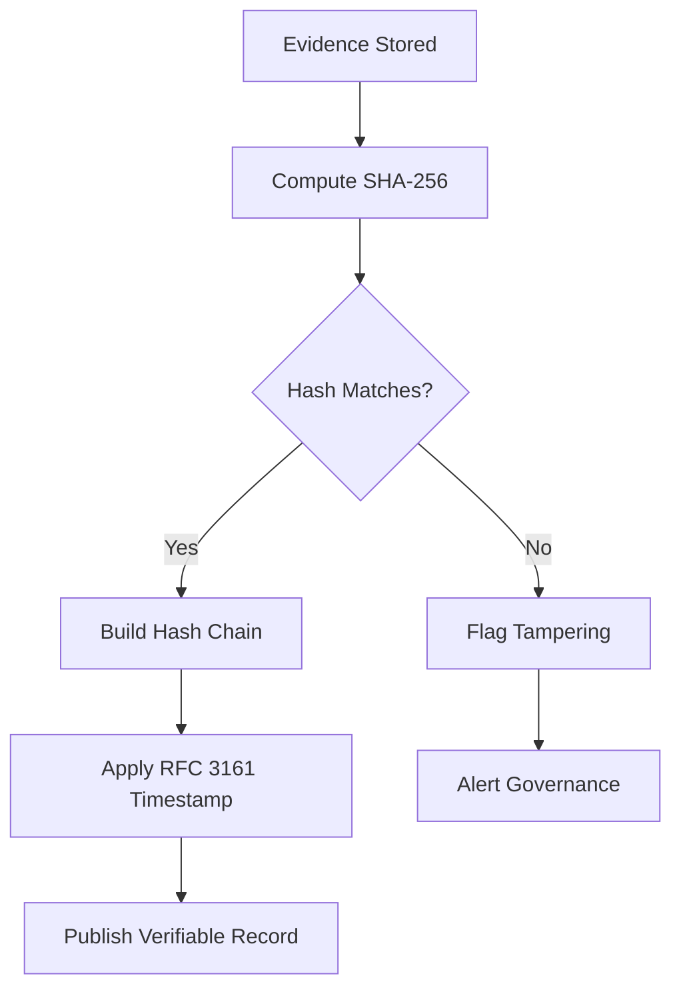

**Diagram sources**
- [apps/api/src/modules/evidence-registry/evidence-integrity.service.ts](file://apps/api/src/modules/evidence-registry/evidence-integrity.service.ts)
- [apps/api/src/modules/evidence-registry/evidence-registry.service.ts](file://apps/api/src/modules/evidence-registry/evidence-registry.service.ts)

**Section sources**
- [apps/api/src/modules/evidence-registry/evidence-integrity.service.ts](file://apps/api/src/modules/evidence-registry/evidence-integrity.service.ts)

### Compliance Workflows and Audit Trail
Compliance workflows link evidence to standards and policies, generate audit trails, and support exportable reports.

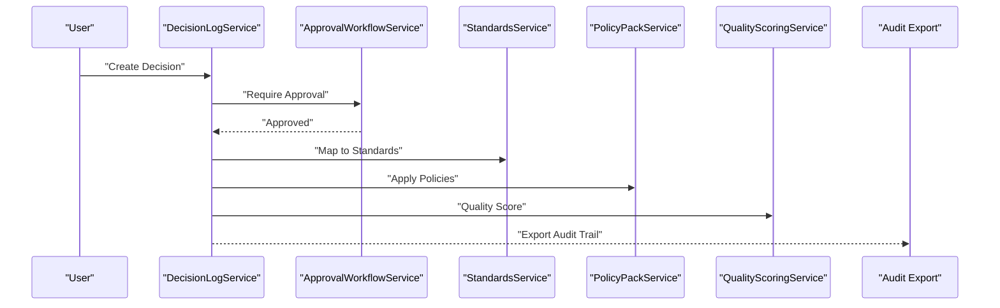

**Diagram sources**
- [apps/api/src/modules/decision-log/decision-log.service.ts](file://apps/api/src/modules/decision-log/decision-log.service.ts)
- [apps/api/src/modules/decision-log/approval-workflow.service.ts](file://apps/api/src/modules/decision-log/approval-workflow.service.ts)
- [apps/api/src/modules/standards/standards.service.ts](file://apps/api/src/modules/standards/standards.service.ts)
- [apps/api/src/modules/policy-pack/policy-pack.service.ts](file://apps/api/src/modules/policy-pack/policy-pack.service.ts)
- [apps/api/src/modules/quality-scoring/quality-scoring.service.ts](file://apps/api/src/modules/quality-scoring/quality-scoring.service.ts)

**Section sources**
- [apps/api/src/modules/decision-log/decision-log.service.ts](file://apps/api/src/modules/decision-log/decision-log.service.ts)
- [apps/api/src/modules/decision-log/approval-workflow.service.ts](file://apps/api/src/modules/decision-log/approval-workflow.service.ts)

### Admin Interfaces and Quality Assurance
Administrative dashboards enable oversight of evidence management, compliance monitoring, and quality assurance controls.

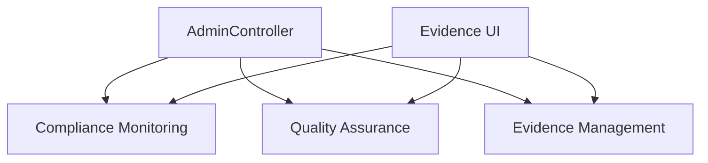

**Diagram sources**
- [apps/api/src/modules/admin/controllers/admin.controller.ts](file://apps/api/src/modules/admin/controllers/admin.controller.ts)
- [apps/web/src/pages/evidence/index.tsx](file://apps/web/src/pages/evidence/index.tsx)
- [apps/web/src/components/admin/AdminDashboard.tsx](file://apps/web/src/components/admin/AdminDashboard.tsx)
- [apps/web/src/pages/admin/AdminPage.tsx](file://apps/web/src/pages/admin/AdminPage.tsx)

**Section sources**
- [apps/api/src/modules/admin/controllers/admin.controller.ts](file://apps/api/src/modules/admin/controllers/admin.controller.ts)
- [apps/web/src/pages/evidence/index.tsx](file://apps/web/src/pages/evidence/index.tsx)
- [apps/web/src/components/admin/AdminDashboard.tsx](file://apps/web/src/components/admin/AdminDashboard.tsx)
- [apps/web/src/pages/admin/AdminPage.tsx](file://apps/web/src/pages/admin/AdminPage.tsx)

## Dependency Analysis
The modules exhibit clear separation of concerns with well-defined dependencies:
- Evidence Registry depends on database and storage modules
- Fact Extraction depends on AI Gateway and database modules
- Decision Log depends on database and governance services
- Adapters integrate with external systems and Evidence Registry
- Admin and Web UI depend on Evidence Registry and governance services

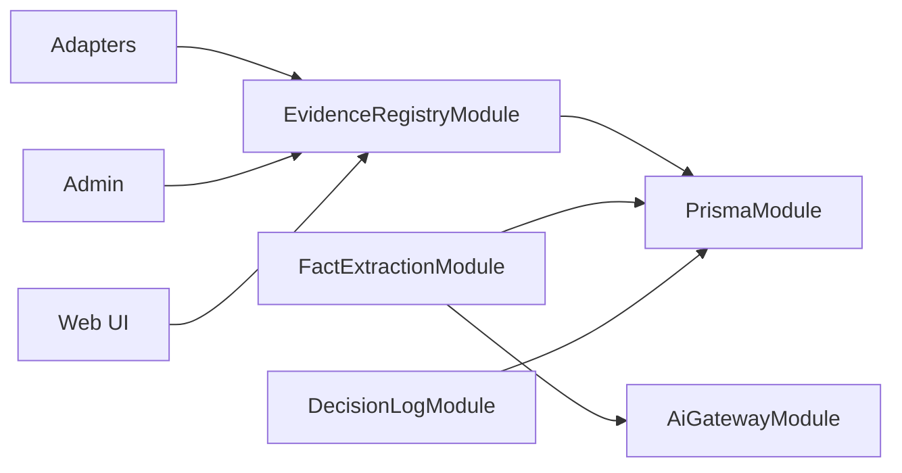

**Diagram sources**
- [apps/api/src/modules/evidence-registry/evidence-registry.module.ts](file://apps/api/src/modules/evidence-registry/evidence-registry.module.ts#L6)
- [apps/api/src/modules/fact-extraction/fact-extraction.module.ts:13-20](file://apps/api/src/modules/fact-extraction/fact-extraction.module.ts#L13-L20)
- [apps/api/src/modules/decision-log/decision-log.module.ts](file://apps/api/src/modules/decision-log/decision-log.module.ts#L6)
- [apps/api/src/modules/adapters/adapter.controller.ts](file://apps/api/src/modules/adapters/adapter.controller.ts)

**Section sources**
- [apps/api/src/modules/evidence-registry/evidence-registry.module.ts](file://apps/api/src/modules/evidence-registry/evidence-registry.module.ts#L6)
- [apps/api/src/modules/fact-extraction/fact-extraction.module.ts:13-20](file://apps/api/src/modules/fact-extraction/fact-extraction.module.ts#L13-L20)
- [apps/api/src/modules/decision-log/decision-log.module.ts](file://apps/api/src/modules/decision-log/decision-log.module.ts#L6)

## Performance Considerations
- Hash computation and timestamping add minimal overhead; batch operations can reduce latency for large artifact sets
- Azure Blob Storage throughput scales horizontally; consider partitioning by date or project type
- AI Gateway calls should be rate-limited and cached where appropriate to avoid downstream bottlenecks
- Database indexing on evidence metadata (hash, timestamps, session IDs) improves query performance

## Troubleshooting Guide
Common issues and resolutions:
- Evidence integrity failures: verify hash computation and timestamp authority connectivity; recompute hashes if metadata changes
- CI ingestion errors: confirm artifact paths and pipeline permissions; validate RFC 3161 endpoint availability
- Decision log audit export failures: check governance permissions and export format compatibility
- Adapter connectivity: validate external system credentials and network access; retry transient failures

**Section sources**
- [apps/api/src/modules/evidence-registry/evidence-integrity.service.ts](file://apps/api/src/modules/evidence-registry/evidence-integrity.service.ts)
- [apps/api/src/modules/evidence-registry/ci-artifact-ingestion.service.ts](file://apps/api/src/modules/evidence-registry/ci-artifact-ingestion.service.ts)
- [apps/api/src/modules/decision-log/decision-log.service.ts](file://apps/api/src/modules/decision-log/decision-log.service.ts)
- [apps/api/src/modules/decision-log/approval-workflow.service.ts](file://apps/api/src/modules/decision-log/approval-workflow.service.ts)

## Conclusion
The evidence registry and compliance tracking system provides a robust foundation for collecting, verifying, and governing evidence across external systems, CI/CD pipelines, and manual uploads. With integrity verification, structured fact extraction, decision logs, and administrative oversight, the platform supports compliance workflows, audit readiness, and governance controls.

## Appendices

### Evidence Collection Workflows
- External system ingestion: GitHub/GitLab adapters fetch artifacts and metadata, submit to Evidence Registry, and link to sessions/questions
- CI ingestion: CI pipelines detect artifacts, parse metadata, compute hashes, apply timestamps, and store in Azure Blob
- Manual upload: Users upload files via UI; Evidence Registry computes hashes, stores securely, and links to relevant contexts

**Section sources**
- [apps/api/src/modules/adapters/github.adapter.ts](file://apps/api/src/modules/adapters/github.adapter.ts)
- [apps/api/src/modules/adapters/gitlab.adapter.ts](file://apps/api/src/modules/adapters/gitlab.adapter.ts)
- [apps/api/src/modules/adapters/adapter.controller.ts](file://apps/api/src/modules/adapters/adapter.controller.ts)
- [apps/api/src/modules/evidence-registry/ci-artifact-ingestion.service.ts](file://apps/api/src/modules/evidence-registry/ci-artifact-ingestion.service.ts)
- [apps/web/src/pages/evidence/index.tsx](file://apps/web/src/pages/evidence/index.tsx)

### Compliance Reporting and Audit Preparation
- Decision log export: Generate append-only audit trails with supersession chains and approval records
- Evidence export: Retrieve verifiable evidence with hashes and timestamps for regulatory submissions
- Standards and policy mapping: Align evidence to applicable standards and policies for comprehensive reporting

**Section sources**
- [apps/api/src/modules/decision-log/decision-log.service.ts](file://apps/api/src/modules/decision-log/decision-log.service.ts)
- [apps/api/src/modules/standards/standards.service.ts](file://apps/api/src/modules/standards/standards.service.ts)
- [apps/api/src/modules/policy-pack/policy-pack.service.ts](file://apps/api/src/modules/policy-pack/policy-pack.service.ts)

### Admin Interfaces
- Evidence management: View, filter, and manage uploaded evidence; monitor integrity and timestamps
- Compliance monitoring: Track decision log status, approvals, and audit exports
- Quality assurance: Review fact extraction completeness, quality scores, and heatmap metrics

**Section sources**
- [apps/api/src/modules/admin/controllers/admin.controller.ts](file://apps/api/src/modules/admin/controllers/admin.controller.ts)
- [apps/web/src/components/admin/AdminDashboard.tsx](file://apps/web/src/components/admin/AdminDashboard.tsx)
- [apps/web/src/pages/admin/AdminPage.tsx](file://apps/web/src/pages/admin/AdminPage.tsx)
- [apps/api/src/modules/quality-scoring/quality-scoring.service.ts](file://apps/api/src/modules/quality-scoring/quality-scoring.service.ts)
- [apps/api/src/modules/heatmap/heatmap.service.ts](file://apps/api/src/modules/heatmap/heatmap.service.ts)