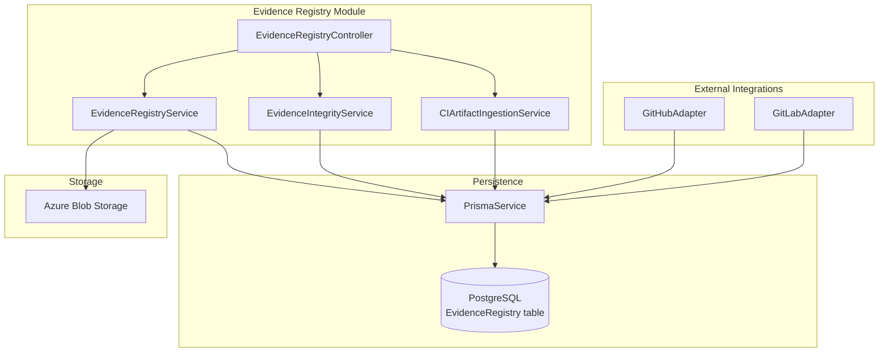
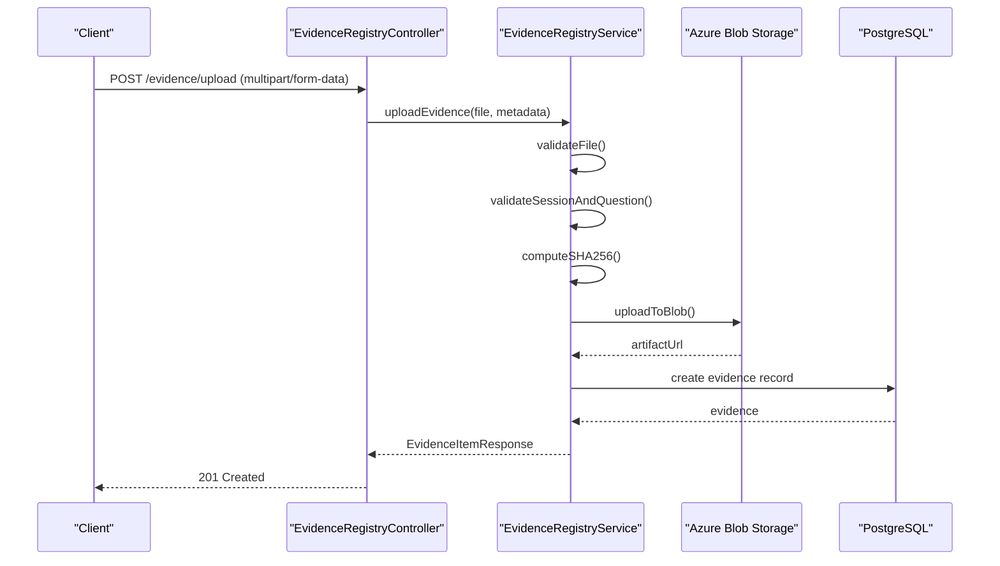
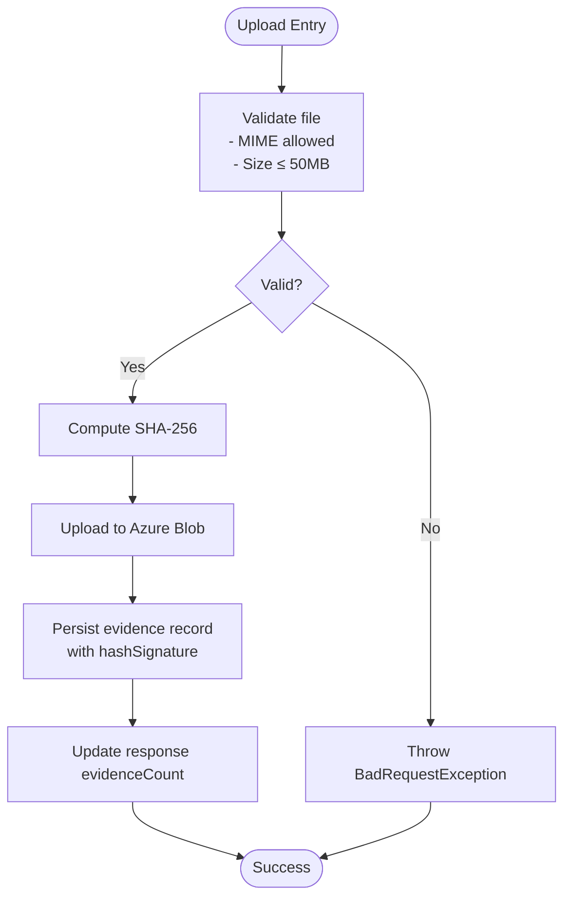
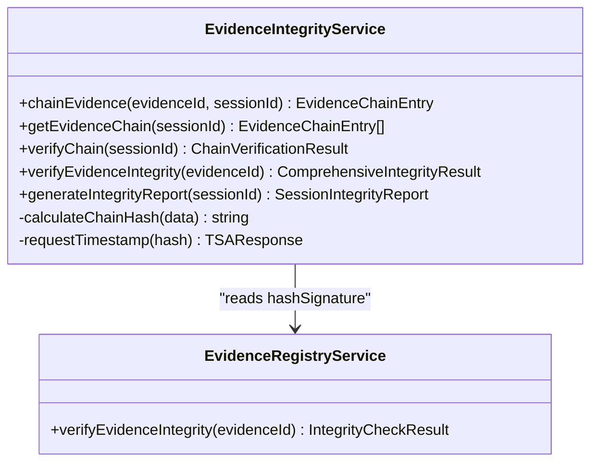
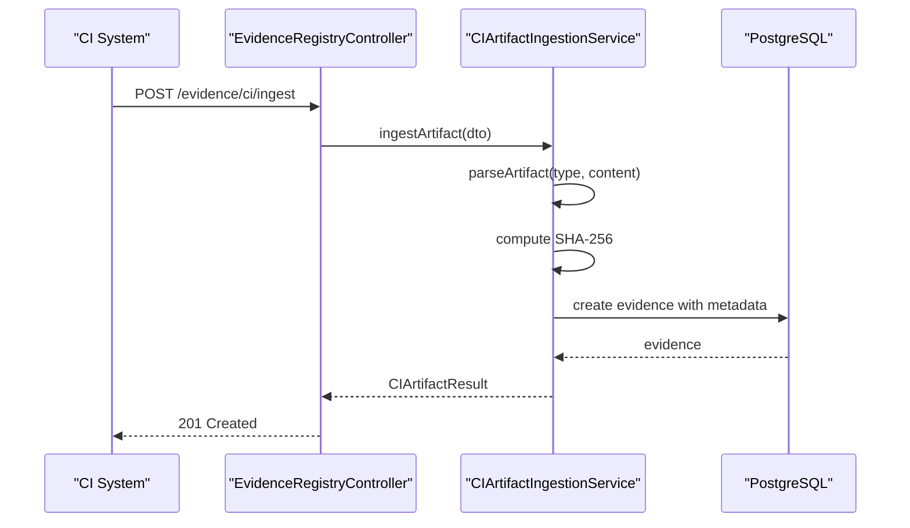
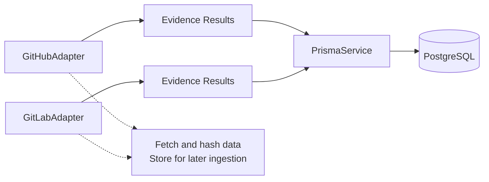
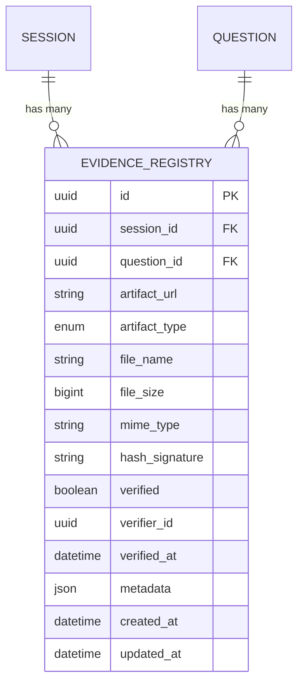
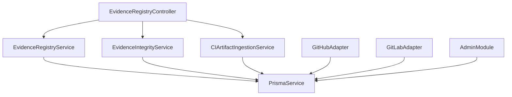

# Evidence Registry

<cite>
**Referenced Files in This Document**
- [evidence-registry.module.ts](file://apps/api/src/modules/evidence-registry/evidence-registry.module.ts)
- [evidence-registry.controller.ts](file://apps/api/src/modules/evidence-registry/evidence-registry.controller.ts)
- [evidence-registry.service.ts](file://apps/api/src/modules/evidence-registry/evidence-registry.service.ts)
- [evidence-integrity.service.ts](file://apps/api/src/modules/evidence-registry/evidence-integrity.service.ts)
- [ci-artifact-ingestion.service.ts](file://apps/api/src/modules/evidence-registry/ci-artifact-ingestion.service.ts)
- [evidence.dto.ts](file://apps/api/src/modules/evidence-registry/dto/evidence.dto.ts)
- [github.adapter.ts](file://apps/api/src/modules/adapters/github.adapter.ts)
- [gitlab.adapter.ts](file://apps/api/src/modules/adapters/gitlab.adapter.ts)
- [admin.module.ts](file://apps/api/src/modules/admin/admin.module.ts)
- [schema.prisma](file://prisma/schema.prisma)
</cite>

## Table of Contents
1. [Introduction](#introduction)
2. [Project Structure](#project-structure)
3. [Core Components](#core-components)
4. [Architecture Overview](#architecture-overview)
5. [Detailed Component Analysis](#detailed-component-analysis)
6. [Dependency Analysis](#dependency-analysis)
7. [Performance Considerations](#performance-considerations)
8. [Troubleshooting Guide](#troubleshooting-guide)
9. [Conclusion](#conclusion)
10. [Appendices](#appendices)

## Introduction
The Evidence Registry system manages verifiable, tamper-evident artifacts produced during assessments and CI/CD processes. It supports:
- Manual uploads with SHA-256 integrity hashing and Azure Blob Storage
- CI/CD artifact ingestion with structured parsing and metadata embedding
- Cryptographic chaining and RFC 3161 timestamping for tamper detection
- Evidence categorization, coverage tracking, and audit trails
- Lifecycle management from ingestion to archival and reporting
- Admin interfaces for oversight and batch operations

## Project Structure
The Evidence Registry is implemented as a NestJS module with dedicated services for storage, integrity, and CI ingestion, plus adapters for external systems.

**Diagram sources**
- [evidence-registry.controller.ts:60-66](file://apps/api/src/modules/evidence-registry/evidence-registry.controller.ts#L60-L66)
- [evidence-registry.service.ts:96-133](file://apps/api/src/modules/evidence-registry/evidence-registry.service.ts#L96-L133)
- [evidence-integrity.service.ts:36-53](file://apps/api/src/modules/evidence-registry/evidence-integrity.service.ts#L36-L53)
- [ci-artifact-ingestion.service.ts:37-91](file://apps/api/src/modules/evidence-registry/ci-artifact-ingestion.service.ts#L37-L91)
- [github.adapter.ts:118-122](file://apps/api/src/modules/adapters/github.adapter.ts#L118-L122)
- [gitlab.adapter.ts:183-190](file://apps/api/src/modules/adapters/gitlab.adapter.ts#L183-L190)
- [schema.prisma:635-674](file://prisma/schema.prisma#L635-L674)

**Section sources**
- [evidence-registry.module.ts:1-26](file://apps/api/src/modules/evidence-registry/evidence-registry.module.ts#L1-L26)

## Core Components
- EvidenceRegistryController: Exposes REST endpoints for upload, verify, list, delete, integrity checks, and CI ingestion.
- EvidenceRegistryService: Handles file validation, Azure Blob upload, SHA-256 hashing, verification workflow, coverage updates, and audit trails.
- EvidenceIntegrityService: Implements blockchain-style hash chaining, RFC 3161 timestamping, and comprehensive integrity verification.
- CIArtifactIngestionService: Parses CI artifacts (JUnit, Jest, lcov, Cobertura, CycloneDX, SPDX, Trivy, OWASP DC), computes hashes, and embeds metadata.
- GitHubAdapter and GitLabAdapter: Fetch repository/workflow data and artifacts for ingestion into the registry.
- Prisma schema: Defines EvidenceRegistry entity, EvidenceType enum, and CoverageLevel scale.

**Section sources**
- [evidence-registry.controller.ts:60-462](file://apps/api/src/modules/evidence-registry/evidence-registry.controller.ts#L60-L462)
- [evidence-registry.service.ts:96-800](file://apps/api/src/modules/evidence-registry/evidence-registry.service.ts#L96-L800)
- [evidence-integrity.service.ts:36-608](file://apps/api/src/modules/evidence-registry/evidence-integrity.service.ts#L36-L608)
- [ci-artifact-ingestion.service.ts:37-871](file://apps/api/src/modules/evidence-registry/ci-artifact-ingestion.service.ts#L37-L871)
- [github.adapter.ts:118-592](file://apps/api/src/modules/adapters/github.adapter.ts#L118-L592)
- [gitlab.adapter.ts:183-881](file://apps/api/src/modules/adapters/gitlab.adapter.ts#L183-L881)
- [schema.prisma:91-120](file://prisma/schema.prisma#L91-L120)
- [schema.prisma:635-674](file://prisma/schema.prisma#L635-L674)

## Architecture Overview
The system integrates three primary ingestion pathways:
- Manual uploads: validated, hashed, stored, and linked to sessions/questions
- CI/CD ingestion: parsed artifacts, metadata embedded, optional auto-verification
- External system adapters: GitHub and GitLab workflows, SBOMs, advisories, and artifacts

**Diagram sources**
- [evidence-registry.controller.ts:135-141](file://apps/api/src/modules/evidence-registry/evidence-registry.controller.ts#L135-L141)
- [evidence-registry.service.ts:165-208](file://apps/api/src/modules/evidence-registry/evidence-registry.service.ts#L165-L208)
- [evidence-registry.service.ts:376-395](file://apps/api/src/modules/evidence-registry/evidence-registry.service.ts#L376-L395)

## Detailed Component Analysis

### Evidence Registry Service
Responsibilities:
- File validation (MIME whitelist, size limits)
- SHA-256 hashing for integrity
- Azure Blob Storage upload and deletion
- Verification workflow with coverage updates
- Evidence listing, stats, and audit trail
- Bulk verification and integrity checks

**Diagram sources**
- [evidence-registry.service.ts:420-434](file://apps/api/src/modules/evidence-registry/evidence-registry.service.ts#L420-L434)
- [evidence-registry.service.ts:360-362](file://apps/api/src/modules/evidence-registry/evidence-registry.service.ts#L360-L362)
- [evidence-registry.service.ts:376-395](file://apps/api/src/modules/evidence-registry/evidence-registry.service.ts#L376-L395)
- [evidence-registry.service.ts:460-469](file://apps/api/src/modules/evidence-registry/evidence-registry.service.ts#L460-L469)

**Section sources**
- [evidence-registry.service.ts:100-127](file://apps/api/src/modules/evidence-registry/evidence-registry.service.ts#L100-L127)
- [evidence-registry.service.ts:165-208](file://apps/api/src/modules/evidence-registry/evidence-registry.service.ts#L165-L208)
- [evidence-registry.service.ts:216-245](file://apps/api/src/modules/evidence-registry/evidence-registry.service.ts#L216-L245)
- [evidence-registry.service.ts:292-324](file://apps/api/src/modules/evidence-registry/evidence-registry.service.ts#L292-L324)
- [evidence-registry.service.ts:329-355](file://apps/api/src/modules/evidence-registry/evidence-registry.service.ts#L329-L355)
- [evidence-registry.service.ts:696-744](file://apps/api/src/modules/evidence-registry/evidence-registry.service.ts#L696-L744)

### Evidence Integrity Service
Features:
- Hash chain linking evidence items in a blockchain-like manner
- RFC 3161 timestamp token integration
- Chain verification and integrity reports
- Comprehensive integrity checks per evidence

**Diagram sources**
- [evidence-integrity.service.ts:63-133](file://apps/api/src/modules/evidence-registry/evidence-integrity.service.ts#L63-L133)
- [evidence-integrity.service.ts:197-274](file://apps/api/src/modules/evidence-registry/evidence-integrity.service.ts#L197-L274)
- [evidence-integrity.service.ts:396-444](file://apps/api/src/modules/evidence-registry/evidence-integrity.service.ts#L396-L444)
- [evidence-integrity.service.ts:449-486](file://apps/api/src/modules/evidence-registry/evidence-integrity.service.ts#L449-L486)
- [evidence-registry.service.ts:696-744](file://apps/api/src/modules/evidence-registry/evidence-registry.service.ts#L696-L744)

**Section sources**
- [evidence-integrity.service.ts:39-53](file://apps/api/src/modules/evidence-registry/evidence-integrity.service.ts#L39-L53)
- [evidence-integrity.service.ts:63-133](file://apps/api/src/modules/evidence-registry/evidence-integrity.service.ts#L63-L133)
- [evidence-integrity.service.ts:197-274](file://apps/api/src/modules/evidence-registry/evidence-integrity.service.ts#L197-L274)
- [evidence-integrity.service.ts:288-387](file://apps/api/src/modules/evidence-registry/evidence-integrity.service.ts#L288-L387)
- [evidence-integrity.service.ts:396-502](file://apps/api/src/modules/evidence-registry/evidence-integrity.service.ts#L396-L502)

### CI Artifact Ingestion Service
Capabilities:
- Parses multiple artifact types (JUnit, Jest, lcov, Cobertura, CycloneDX, SPDX, Trivy, OWASP DC)
- Computes SHA-256, creates evidence records, and embeds CI metadata
- Supports bulk ingestion and build summaries
- Auto-maps to matching questions or falls back to first unanswered question

**Diagram sources**
- [evidence-registry.controller.ts:412-414](file://apps/api/src/modules/evidence-registry/evidence-registry.controller.ts#L412-L414)
- [ci-artifact-ingestion.service.ts:98-163](file://apps/api/src/modules/evidence-registry/ci-artifact-ingestion.service.ts#L98-L163)
- [ci-artifact-ingestion.service.ts:205-228](file://apps/api/src/modules/evidence-registry/ci-artifact-ingestion.service.ts#L205-L228)

**Section sources**
- [ci-artifact-ingestion.service.ts:40-86](file://apps/api/src/modules/evidence-registry/ci-artifact-ingestion.service.ts#L40-L86)
- [ci-artifact-ingestion.service.ts:98-163](file://apps/api/src/modules/evidence-registry/ci-artifact-ingestion.service.ts#L98-L163)
- [ci-artifact-ingestion.service.ts:168-200](file://apps/api/src/modules/evidence-registry/ci-artifact-ingestion.service.ts#L168-L200)
- [ci-artifact-ingestion.service.ts:615-709](file://apps/api/src/modules/evidence-registry/ci-artifact-ingestion.service.ts#L615-L709)

### External System Adapters
- GitHubAdapter: Pull requests, workflow runs, check runs, releases, SBOMs, security advisories, and workflow artifacts
- GitLabAdapter: Pipelines, jobs, test reports, merge requests, releases, vulnerabilities, and coverage history

**Diagram sources**
- [github.adapter.ts:173-211](file://apps/api/src/modules/adapters/github.adapter.ts#L173-L211)
- [github.adapter.ts:295-330](file://apps/api/src/modules/adapters/github.adapter.ts#L295-L330)
- [gitlab.adapter.ts:359-403](file://apps/api/src/modules/adapters/gitlab.adapter.ts#L359-L403)
- [gitlab.adapter.ts:455-501](file://apps/api/src/modules/adapters/gitlab.adapter.ts#L455-L501)

**Section sources**
- [github.adapter.ts:118-592](file://apps/api/src/modules/adapters/github.adapter.ts#L118-L592)
- [gitlab.adapter.ts:183-881](file://apps/api/src/modules/adapters/gitlab.adapter.ts#L183-L881)

### Evidence Categorization and Metadata
- EvidenceType enum defines supported artifact categories
- CoverageLevel discrete scale (NONE, PARTIAL, HALF, SUBSTANTIAL, FULL) mapped to decimals
- Metadata embedding for CI artifacts (provider, buildId, parsedData, status)
- Audit trail includes upload and verification events

**Diagram sources**
- [schema.prisma:91-120](file://prisma/schema.prisma#L91-L120)
- [schema.prisma:635-674](file://prisma/schema.prisma#L635-L674)

**Section sources**
- [schema.prisma:91-120](file://prisma/schema.prisma#L91-L120)
- [schema.prisma:635-674](file://prisma/schema.prisma#L635-L674)
- [evidence-registry.service.ts:26-82](file://apps/api/src/modules/evidence-registry/evidence-registry.service.ts#L26-L82)
- [evidence-registry.service.ts:626-694](file://apps/api/src/modules/evidence-registry/evidence-registry.service.ts#L626-L694)

## Dependency Analysis
- EvidenceRegistryController depends on EvidenceRegistryService, EvidenceIntegrityService, and CIArtifactIngestionService
- Services depend on PrismaService and Azure Blob SDK
- Adapters depend on external APIs and Prisma for audit/logging
- AdminModule provides administrative controllers/services for oversight

**Diagram sources**
- [evidence-registry.controller.ts:60-66](file://apps/api/src/modules/evidence-registry/evidence-registry.controller.ts#L60-L66)
- [evidence-registry.service.ts:96-133](file://apps/api/src/modules/evidence-registry/evidence-registry.service.ts#L96-L133)
- [evidence-integrity.service.ts:36-53](file://apps/api/src/modules/evidence-registry/evidence-integrity.service.ts#L36-L53)
- [ci-artifact-ingestion.service.ts:37-91](file://apps/api/src/modules/evidence-registry/ci-artifact-ingestion.service.ts#L37-L91)
- [github.adapter.ts:118-122](file://apps/api/src/modules/adapters/github.adapter.ts#L118-L122)
- [gitlab.adapter.ts:183-190](file://apps/api/src/modules/adapters/gitlab.adapter.ts#L183-L190)
- [admin.module.ts:1-14](file://apps/api/src/modules/admin/admin.module.ts#L1-L14)

**Section sources**
- [evidence-registry.module.ts:1-26](file://apps/api/src/modules/evidence-registry/evidence-registry.module.ts#L1-L26)
- [admin.module.ts:1-14](file://apps/api/src/modules/admin/admin.module.ts#L1-L14)

## Performance Considerations
- File upload validation prevents oversized or disallowed types
- Batch verification reduces N+1 queries and uses transactions
- Azure Blob operations are optimized with streaming buffers
- CI parsing uses lightweight parsers; consider caching parsed results for repeated ingestion
- Chain verification iterates entries; ensure session scope limits and pagination

[No sources needed since this section provides general guidance]

## Troubleshooting Guide
Common issues and resolutions:
- File upload failures: Check Azure Blob configuration and container permissions; verify MIME type and size constraints
- Verification errors: Ensure evidence exists and coverage transitions are monotonic
- Integrity verification failures: Confirm blob connectivity and hash recomputation
- CI ingestion errors: Validate artifact content format and mapping; confirm question resolution
- Adapter errors: Review API URLs, tokens, and endpoint sanitization

**Section sources**
- [evidence-registry.service.ts:138-156](file://apps/api/src/modules/evidence-registry/evidence-registry.service.ts#L138-L156)
- [evidence-registry.service.ts:420-434](file://apps/api/src/modules/evidence-registry/evidence-registry.service.ts#L420-L434)
- [evidence-integrity.service.ts:291-337](file://apps/api/src/modules/evidence-registry/evidence-integrity.service.ts#L291-L337)
- [ci-artifact-ingestion.service.ts:205-228](file://apps/api/src/modules/evidence-registry/ci-artifact-ingestion.service.ts#L205-L228)
- [github.adapter.ts:132-164](file://apps/api/src/modules/adapters/github.adapter.ts#L132-L164)
- [gitlab.adapter.ts:300-346](file://apps/api/src/modules/adapters/gitlab.adapter.ts#L300-L346)

## Conclusion
The Evidence Registry provides a robust framework for collecting, verifying, and maintaining tamper-evident artifacts across manual uploads, CI/CD pipelines, and external systems. Its modular design, strong integrity guarantees, and comprehensive audit capabilities support compliance and readiness assessment workflows.

[No sources needed since this section summarizes without analyzing specific files]

## Appendices

### API Endpoints Overview
- Upload evidence: POST /evidence/upload
- Verify evidence: POST /evidence/verify
- Get evidence: GET /evidence/{evidenceId}
- List evidence: GET /evidence
- Delete evidence: DELETE /evidence/{evidenceId}
- Chain evidence: POST /evidence/{evidenceId}/chain
- Get chain: GET /evidence/chain/{sessionId}
- Verify chain: GET /evidence/chain/{sessionId}/verify
- Verify integrity: GET /evidence/{evidenceId}/integrity
- Generate integrity report: GET /evidence/integrity-report/{sessionId}
- CI ingest: POST /evidence/ci/ingest
- CI bulk ingest: POST /evidence/ci/bulk-ingest
- Get CI artifacts: GET /evidence/ci/session/{sessionId}
- Get CI build summary: GET /evidence/ci/build/{sessionId}/{buildId}

**Section sources**
- [evidence-registry.controller.ts:68-462](file://apps/api/src/modules/evidence-registry/evidence-registry.controller.ts#L68-L462)

### Evidence Categories and Coverage
- EvidenceType: FILE, IMAGE, LINK, LOG, SBOM, REPORT, TEST_RESULT, SCREENSHOT, DOCUMENT
- CoverageLevel: NONE (0.0), PARTIAL (0.25), HALF (0.5), SUBSTANTIAL (0.75), FULL (1.0)

**Section sources**
- [schema.prisma:91-120](file://prisma/schema.prisma#L91-L120)
- [evidence-registry.service.ts:26-82](file://apps/api/src/modules/evidence-registry/evidence-registry.service.ts#L26-L82)

### Admin Interfaces
- AdminModule provides administrative controllers/services for oversight and batch operations

**Section sources**
- [admin.module.ts:1-14](file://apps/api/src/modules/admin/admin.module.ts#L1-L14)