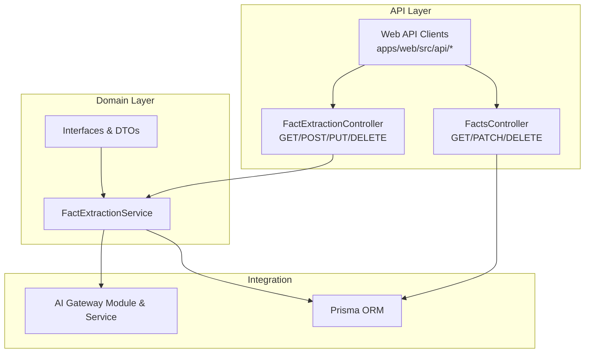
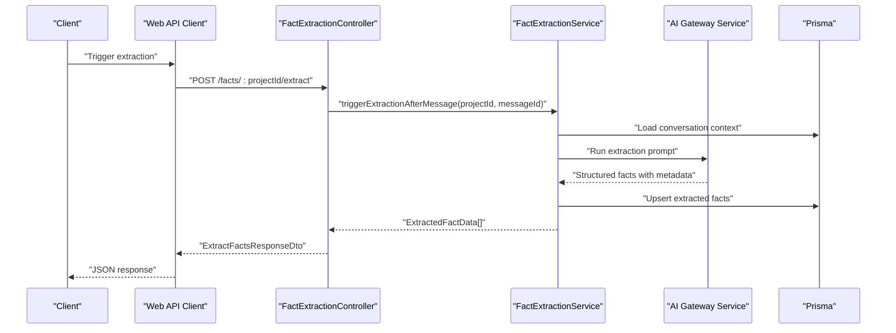
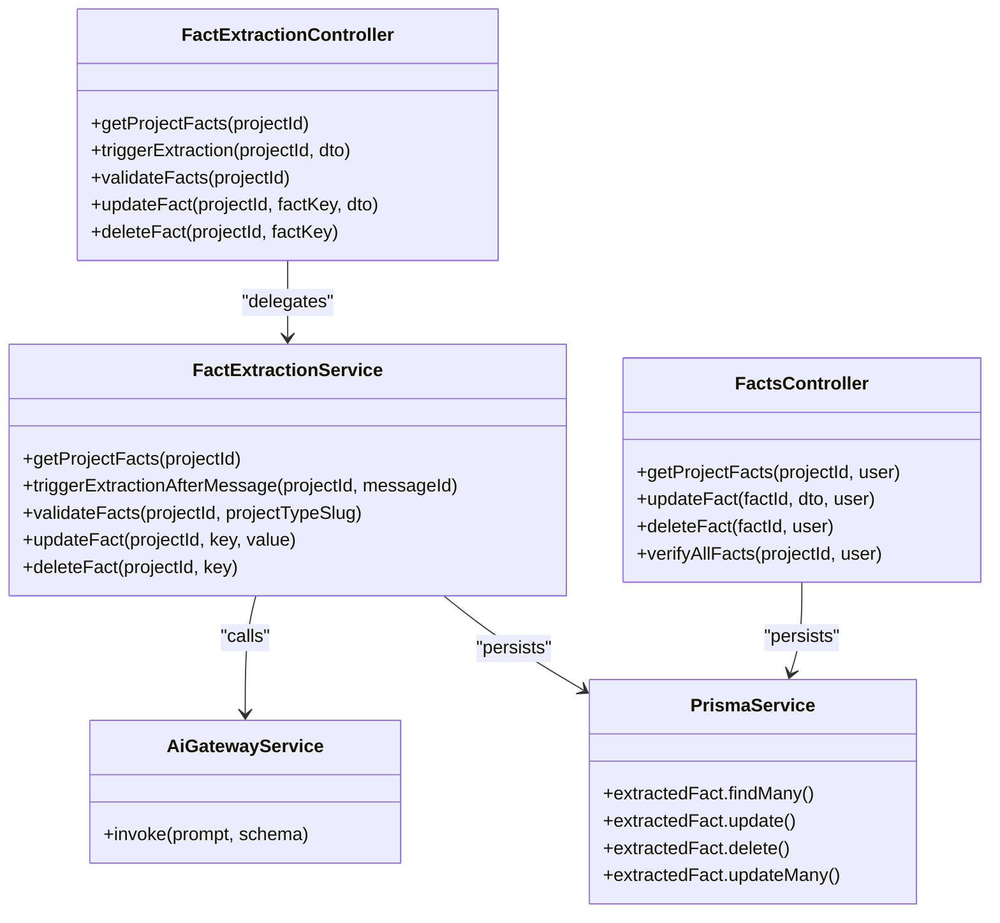

# Fact Extraction

<cite>
**Referenced Files in This Document**
- [fact-extraction.module.ts](file://apps/api/src/modules/fact-extraction/fact-extraction.module.ts)
- [interfaces.ts](file://apps/api/src/modules/fact-extraction/interfaces.ts)
- [fact-extraction.controller.ts](file://apps/api/src/modules/fact-extraction/fact-extraction.controller.ts)
- [facts.controller.ts](file://apps/api/src/modules/fact-extraction/facts.controller.ts)
- [fact-extraction.service.ts](file://apps/api/src/modules/fact-extraction/services/fact-extraction.service.ts)
- [fact-extraction.dto.ts](file://apps/api/src/modules/fact-extraction/dto/fact-extraction.dto.ts)
- [ai-gateway.module.ts](file://apps/api/src/modules/ai-gateway/ai-gateway.module.ts)
- [ai-gateway.service.ts](file://apps/api/src/modules/ai-gateway/ai-gateway.service.ts)
- [prisma.config.ts](file://prisma/prisma.config.ts)
- [schema.prisma](file://prisma/schema.prisma)
- [admin.module.ts](file://apps/api/src/modules/admin/admin.module.ts)
- [admin.controllers](file://apps/api/src/modules/admin/controllers/)
- [admin.services](file://apps/api/src/modules/admin/services/)
- [web.admin.ts](file://apps/web/src/api/admin.ts)
- [web.facts.ts](file://apps/web/src/api/facts.ts)
</cite>

## Table of Contents
1. [Introduction](#introduction)
2. [Project Structure](#project-structure)
3. [Core Components](#core-components)
4. [Architecture Overview](#architecture-overview)
5. [Detailed Component Analysis](#detailed-component-analysis)
6. [Dependency Analysis](#dependency-analysis)
7. [Performance Considerations](#performance-considerations)
8. [Troubleshooting Guide](#troubleshooting-guide)
9. [Conclusion](#conclusion)
10. [Appendices](#appendices)

## Introduction
This document describes the Fact Extraction system that automatically captures structured business facts from conversational data and integrates them into a knowledge graph for downstream document generation and decision-making. It covers automated data capture from chat conversations, schema-driven extraction, validation and confidence scoring, manual editing, and integration with AI providers via the AI Gateway. It also outlines admin interfaces for configuration, quality monitoring, and optimization.

## Project Structure
The Fact Extraction feature is implemented as a NestJS module with controllers, services, DTOs, and interfaces. It integrates with:
- Prisma ORM for persistence
- AI Gateway for LLM-based extraction
- Admin module for configuration and monitoring
- Web API clients for frontend consumption

**Diagram sources**
- [fact-extraction.controller.ts:1-142](file://apps/api/src/modules/fact-extraction/fact-extraction.controller.ts#L1-L142)
- [facts.controller.ts:1-230](file://apps/api/src/modules/fact-extraction/facts.controller.ts#L1-L230)
- [fact-extraction.service.ts:1-200](file://apps/api/src/modules/fact-extraction/services/fact-extraction.service.ts#L1-L200)
- [ai-gateway.module.ts:1-200](file://apps/api/src/modules/ai-gateway/ai-gateway.module.ts#L1-L200)
- [ai-gateway.service.ts:1-200](file://apps/api/src/modules/ai-gateway/ai-gateway.service.ts#L1-L200)
- [prisma.config.ts:1-200](file://prisma/prisma.config.ts#L1-L200)
- [schema.prisma:1-200](file://prisma/schema.prisma#L1-L200)

**Section sources**
- [fact-extraction.module.ts:1-26](file://apps/api/src/modules/fact-extraction/fact-extraction.module.ts#L1-L26)
- [fact-extraction.controller.ts:1-142](file://apps/api/src/modules/fact-extraction/fact-extraction.controller.ts#L1-L142)
- [facts.controller.ts:1-230](file://apps/api/src/modules/fact-extraction/facts.controller.ts#L1-L230)

## Core Components
- FactExtractionModule: Declares dependencies on PrismaModule and AiGatewayModule, exposes FactExtractionService, and registers controllers.
- FactExtractionController: Public endpoints for triggering extraction, retrieving facts, validating, updating, and deleting facts.
- FactsController: Internal/admin endpoints for listing, verifying, updating, and deleting facts with organization-scoped access checks.
- FactExtractionService: Orchestrates extraction, validation, persistence, and confidence scoring.
- Interfaces and DTOs: Define extraction categories, confidence levels, schema fields, validation results, and request/response contracts.
- AI Gateway: Provides LLM adapters and orchestration for extraction prompts and completions.
- Prisma: Defines the extractedFact model and relationships to projects and organizations.

**Section sources**
- [fact-extraction.module.ts:1-26](file://apps/api/src/modules/fact-extraction/fact-extraction.module.ts#L1-L26)
- [interfaces.ts:1-88](file://apps/api/src/modules/fact-extraction/interfaces.ts#L1-L88)
- [fact-extraction.controller.ts:1-142](file://apps/api/src/modules/fact-extraction/fact-extraction.controller.ts#L1-L142)
- [facts.controller.ts:1-230](file://apps/api/src/modules/fact-extraction/facts.controller.ts#L1-L230)
- [fact-extraction.service.ts:1-200](file://apps/api/src/modules/fact-extraction/services/fact-extraction.service.ts#L1-L200)

## Architecture Overview
The system follows a layered architecture:
- Controllers handle HTTP requests and delegate to services.
- Services encapsulate business logic: fetching conversation context, invoking AI Gateway for extraction, applying schema validation, persisting facts, and computing confidence scores.
- Prisma manages data access and enforces organization-scoped access controls.
- AI Gateway abstracts provider integrations and prompt orchestration.

**Diagram sources**
- [fact-extraction.controller.ts:48-76](file://apps/api/src/modules/fact-extraction/fact-extraction.controller.ts#L48-L76)
- [fact-extraction.service.ts:1-200](file://apps/api/src/modules/fact-extraction/services/fact-extraction.service.ts#L1-L200)
- [ai-gateway.service.ts:1-200](file://apps/api/src/modules/ai-gateway/ai-gateway.service.ts#L1-L200)
- [schema.prisma:1-200](file://prisma/schema.prisma#L1-L200)

## Detailed Component Analysis

### FactExtractionController
Responsibilities:
- Retrieve all facts for a project.
- Trigger extraction after a specific message.
- Validate facts against a project type schema.
- Update and delete individual facts.

Endpoints:
- GET /facts/:projectId
- POST /facts/:projectId/extract
- GET /facts/:projectId/validate
- PUT /facts/:projectId/:factKey
- DELETE /facts/:projectId/:factKey

Notes:
- Uses JWT guard and bearer auth.
- Delegates to FactExtractionService for business logic.
- Returns DTOs with selected fields for the public endpoint.

**Section sources**
- [fact-extraction.controller.ts:1-142](file://apps/api/src/modules/fact-extraction/fact-extraction.controller.ts#L1-L142)

### FactsController
Responsibilities:
- List all facts for a project with organization membership verification.
- Update a single fact (value and verification flag).
- Delete a single fact.
- Verify all facts for a project in bulk.

Access control:
- Ensures the requesting user belongs to the same organization as the target project.

Confidence mapping:
- Converts persisted numeric confidence to "high"/"medium"/"low".

**Section sources**
- [facts.controller.ts:1-230](file://apps/api/src/modules/fact-extraction/facts.controller.ts#L1-L230)

### FactExtractionService
Responsibilities:
- Load conversation context around a given message.
- Build extraction prompts using schema definitions and categories.
- Invoke AI Gateway for structured extraction.
- Validate facts against schema (required fields, completeness).
- Persist facts with confidence scores and metadata.
- Support manual edits and verification.

Confidence scoring:
- Numeric confidence stored in DB mapped to "high"/"medium"/"low".
- Validation computes completeness score and flags missing required fields and low-confidence items.

Note: The service coordinates with Prisma for persistence and with AI Gateway for inference.

**Section sources**
- [fact-extraction.service.ts:1-200](file://apps/api/src/modules/fact-extraction/services/fact-extraction.service.ts#L1-L200)

### Interfaces and DTOs
Extraction categories:
- business_overview
- market_analysis
- financial_data
- team_and_operations
- product_service
- strategy
- risk_assessment
- technology
- legal_compliance

Core types:
- ExtractedFactData: category, key, value, confidence, optional sourceMessageId and relatedQuestionIds.
- FactExtractionRequest: projectId, conversationContent, projectTypeSlug, optional existingFacts.
- FactExtractionResponse: facts array, processingTimeMs, tokensUsed.
- SchemaField: key, description, category, required, optional examples.
- ExtractionSchema: projectTypeSlug, projectTypeName, fields[], systemPromptAddition.
- FactValidationResult: isValid, missingRequired[], lowConfidenceFacts[], completenessScore.

DTOs:
- ExtractedFactDto, TriggerExtractionDto, UpdateFactDto, FactValidationResultDto, ExtractFactsResponseDto.

**Section sources**
- [interfaces.ts:1-88](file://apps/api/src/modules/fact-extraction/interfaces.ts#L1-L88)
- [fact-extraction.dto.ts:1-200](file://apps/api/src/modules/fact-extraction/dto/fact-extraction.dto.ts#L1-L200)

### AI Gateway Integration
The FactExtractionService depends on the AI Gateway module and service to:
- Select appropriate provider/adapters for extraction.
- Apply structured output formatting and schema-aligned prompting.
- Track token usage and processing time.

This enables pluggable providers and consistent extraction behavior across different AI backends.

**Section sources**
- [ai-gateway.module.ts:1-200](file://apps/api/src/modules/ai-gateway/ai-gateway.module.ts#L1-L200)
- [ai-gateway.service.ts:1-200](file://apps/api/src/modules/ai-gateway/ai-gateway.service.ts#L1-L200)

### Data Model and Persistence
The extractedFact model persists:
- projectId (foreign key to Project)
- fieldName (maps to schema keys)
- fieldValue (normalized text)
- category (mapped to extraction categories)
- confidence (numeric, 0..1)
- sourceMessageId (optional)
- confirmedByUser (boolean, manual verification)
- createdAt, updatedAt

Organization scoping:
- Controllers enforce that the requesting user belongs to the same organization as the project.

**Section sources**
- [schema.prisma:1-200](file://prisma/schema.prisma#L1-L200)
- [facts.controller.ts:74-81](file://apps/api/src/modules/fact-extraction/facts.controller.ts#L74-L81)
- [facts.controller.ts:134-141](file://apps/api/src/modules/fact-extraction/facts.controller.ts#L134-L141)

### Admin Interfaces
Admin module provides configuration and monitoring surfaces:
- Configuration: Manage AI providers, extraction schemas, and quality thresholds.
- Monitoring: Track extraction latency, token usage, and validation outcomes.
- Optimization: Adjust prompts, provider selection, and confidence thresholds.

Web admin client:
- apps/web/src/api/admin.ts consumes admin endpoints for configuration management.

**Section sources**
- [admin.module.ts:1-200](file://apps/api/src/modules/admin/admin.module.ts#L1-L200)
- [admin.controllers](file://apps/api/src/modules/admin/controllers/)
- [admin.services](file://apps/api/src/modules/admin/services/)
- [web.admin.ts:1-200](file://apps/web/src/api/admin.ts#L1-L200)

## Dependency Analysis

**Diagram sources**
- [fact-extraction.controller.ts:1-142](file://apps/api/src/modules/fact-extraction/fact-extraction.controller.ts#L1-L142)
- [facts.controller.ts:1-230](file://apps/api/src/modules/fact-extraction/facts.controller.ts#L1-L230)
- [fact-extraction.service.ts:1-200](file://apps/api/src/modules/fact-extraction/services/fact-extraction.service.ts#L1-L200)
- [ai-gateway.service.ts:1-200](file://apps/api/src/modules/ai-gateway/ai-gateway.service.ts#L1-L200)
- [schema.prisma:1-200](file://prisma/schema.prisma#L1-L200)

**Section sources**
- [fact-extraction.module.ts:1-26](file://apps/api/src/modules/fact-extraction/fact-extraction.module.ts#L1-L26)
- [fact-extraction.controller.ts:1-142](file://apps/api/src/modules/fact-extraction/fact-extraction.controller.ts#L1-L142)
- [facts.controller.ts:1-230](file://apps/api/src/modules/fact-extraction/facts.controller.ts#L1-L230)
- [fact-extraction.service.ts:1-200](file://apps/api/src/modules/fact-extraction/services/fact-extraction.service.ts#L1-L200)

## Performance Considerations
- Prompt efficiency: Keep prompts concise and schema-aligned to reduce token usage and latency.
- Batch operations: Use bulk verification endpoints to minimize round trips.
- Caching: Cache frequently accessed schemas and provider configurations.
- Pagination: Limit returned fact lists and apply server-side filtering.
- Confidence thresholds: Tune thresholds to reduce rework and improve throughput.

## Troubleshooting Guide
Common issues and resolutions:
- Project not found or unauthorized: Ensure the user belongs to the same organization as the project when accessing internal endpoints.
- No facts returned: Verify that extraction was triggered after a message and that the AI Gateway is configured and reachable.
- Low confidence facts: Manually edit via update endpoints and mark as verified to improve downstream quality.
- Validation failures: Add missing required fields or improve conversation context to aid extraction.

Operational checks:
- Confirm Prisma connection and schema synchronization.
- Review AI Gateway logs for provider errors and rate limits.
- Monitor token usage and adjust prompts to stay within budget.

**Section sources**
- [facts.controller.ts:74-81](file://apps/api/src/modules/fact-extraction/facts.controller.ts#L74-L81)
- [facts.controller.ts:134-141](file://apps/api/src/modules/fact-extraction/facts.controller.ts#L134-L141)
- [fact-extraction.controller.ts:54-76](file://apps/api/src/modules/fact-extraction/fact-extraction.controller.ts#L54-L76)

## Conclusion
The Fact Extraction system automates structured data capture from conversations, validates and scores extracted facts, and exposes both public and admin endpoints for review and refinement. Its modular design, schema-driven extraction, and AI Gateway integration enable scalable, high-quality knowledge capture suitable for document generation and decision support.

## Appendices

### Extraction Workflow Example
- Trigger extraction after a message: POST /facts/{projectId}/extract
- Receive structured facts with confidence and source metadata
- Optionally validate against schema and compute completeness score
- Manually edit and verify facts via admin endpoints
- Use validated facts for downstream document generation

**Section sources**
- [fact-extraction.controller.ts:48-76](file://apps/api/src/modules/fact-extraction/fact-extraction.controller.ts#L48-L76)
- [interfaces.ts:42-56](file://apps/api/src/modules/fact-extraction/interfaces.ts#L42-L56)

### Schema Mapping and Transformation
- SchemaField defines required keys, categories, and examples.
- ExtractionSchema binds fields to a project type and augments system prompts.
- FactExtractionResponse normalizes raw AI output into ExtractedFactData.

**Section sources**
- [interfaces.ts:61-77](file://apps/api/src/modules/fact-extraction/interfaces.ts#L61-L77)
- [interfaces.ts:27-37](file://apps/api/src/modules/fact-extraction/interfaces.ts#L27-L37)

### Admin Configuration and Monitoring
- Configure AI providers and extraction schemas in the admin module.
- Monitor extraction metrics and adjust thresholds for quality optimization.
- Use admin web client to manage settings and review extraction outcomes.

**Section sources**
- [admin.module.ts:1-200](file://apps/api/src/modules/admin/admin.module.ts#L1-L200)
- [web.admin.ts:1-200](file://apps/web/src/api/admin.ts#L1-L200)