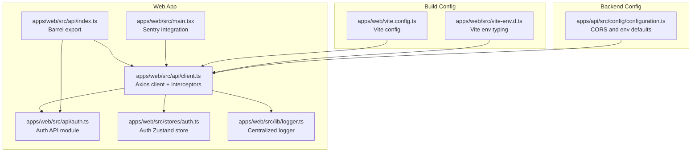
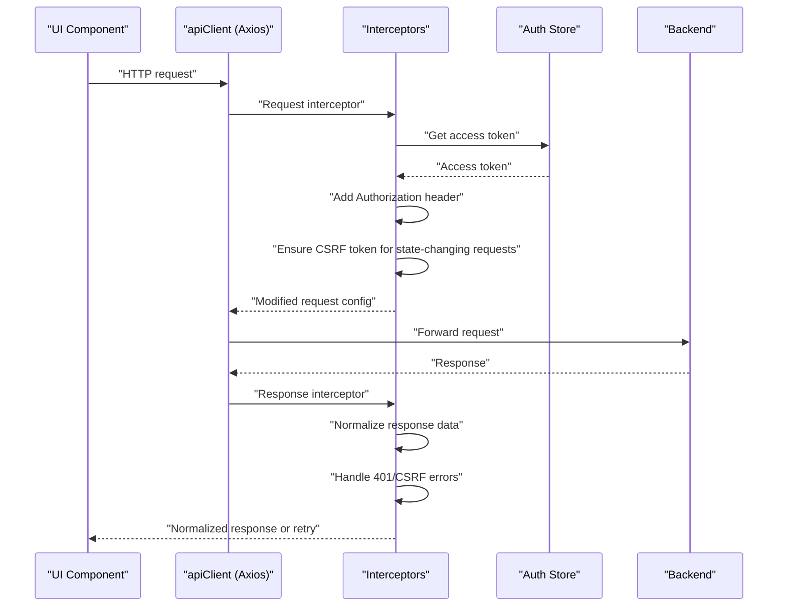
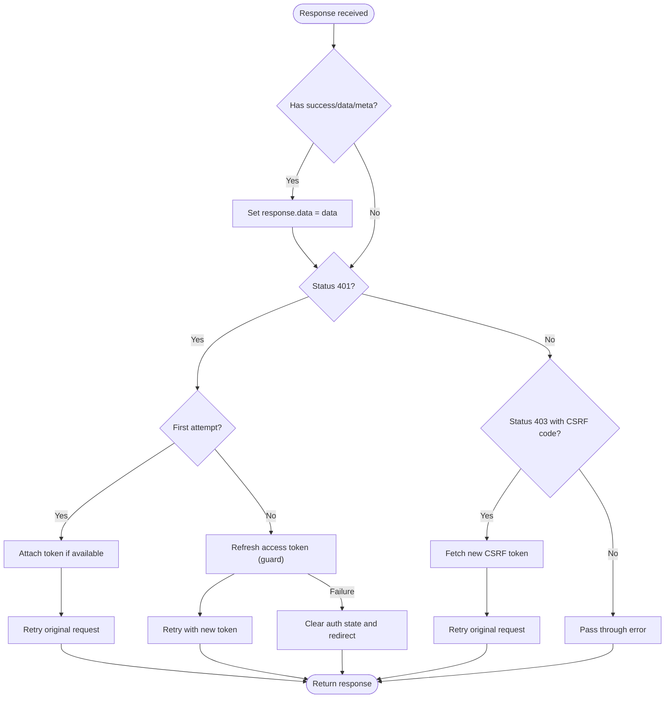
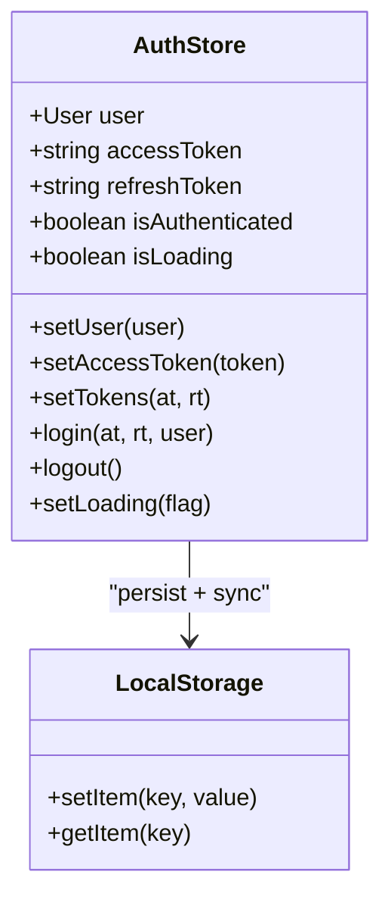
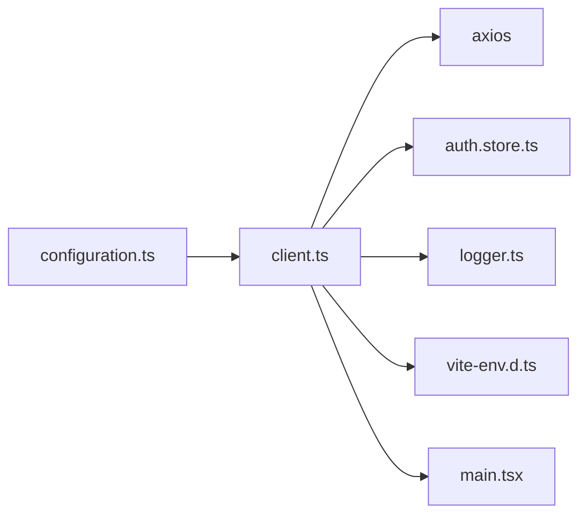

# API Client Configuration

<cite>
**Referenced Files in This Document**
- [client.ts](file://apps/web/src/api/client.ts)
- [index.ts](file://apps/web/src/api/index.ts)
- [auth.ts](file://apps/web/src/api/auth.ts)
- [auth.store.ts](file://apps/web/src/stores/auth.ts)
- [logger.ts](file://apps/web/src/lib/logger.ts)
- [main.tsx](file://apps/web/src/main.tsx)
- [vite.config.ts](file://apps/web/vite.config.ts)
- [vite-env.d.ts](file://apps/web/src/vite-env.d.ts)
- [configuration.ts](file://apps/api/src/config/configuration.ts)
</cite>

## Table of Contents
1. [Introduction](#introduction)
2. [Project Structure](#project-structure)
3. [Core Components](#core-components)
4. [Architecture Overview](#architecture-overview)
5. [Detailed Component Analysis](#detailed-component-analysis)
6. [Dependency Analysis](#dependency-analysis)
7. [Performance Considerations](#performance-considerations)
8. [Troubleshooting Guide](#troubleshooting-guide)
9. [Conclusion](#conclusion)

## Introduction
This document explains the API client configuration and setup for the web application. It covers Axios client initialization, base URL resolution across environments, request and response interceptors, timeout handling, CSRF protection, authentication token management, error response processing, and integration with authentication services and global error boundaries. It also documents environment-specific settings, proxy behavior via nginx, and practical examples for customization and extension.

## Project Structure
The API client is implemented in the web application under `apps/web/src/api`. The primary client is initialized in a dedicated module and exported via a barrel index. Supporting modules include:
- Client initialization and interceptors
- Authentication API module
- Authentication Zustand store with persistence
- Centralized logger
- Application bootstrap integrating Sentry error boundary

**Diagram sources**
- [client.ts:1-326](file://apps/web/src/api/client.ts#L1-L326)
- [auth.ts:1-101](file://apps/web/src/api/auth.ts#L1-L101)
- [index.ts:1-14](file://apps/web/src/api/index.ts#L1-L14)
- [auth.store.ts:1-173](file://apps/web/src/stores/auth.ts#L1-L173)
- [logger.ts:1-25](file://apps/web/src/lib/logger.ts#L1-L25)
- [main.tsx:1-23](file://apps/web/src/main.tsx#L1-L23)
- [vite.config.ts:1-19](file://apps/web/vite.config.ts#L1-L19)
- [vite-env.d.ts:1-24](file://apps/web/src/vite-env.d.ts#L1-L24)
- [configuration.ts:87-114](file://apps/api/src/config/configuration.ts#L87-L114)

**Section sources**
- [client.ts:1-326](file://apps/web/src/api/client.ts#L1-L326)
- [index.ts:1-14](file://apps/web/src/api/index.ts#L1-L14)
- [auth.ts:1-101](file://apps/web/src/api/auth.ts#L1-L101)
- [auth.store.ts:1-173](file://apps/web/src/stores/auth.ts#L1-L173)
- [logger.ts:1-25](file://apps/web/src/lib/logger.ts#L1-L25)
- [main.tsx:1-23](file://apps/web/src/main.tsx#L1-L23)
- [vite.config.ts:1-19](file://apps/web/vite.config.ts#L1-L19)
- [vite-env.d.ts:1-24](file://apps/web/src/vite-env.d.ts#L1-L24)
- [configuration.ts:87-114](file://apps/api/src/config/configuration.ts#L87-L114)

## Core Components
- Axios client with base URL resolution and default headers
- Request interceptor for authentication and CSRF token injection
- Response interceptor for automatic token refresh and CSRF error handling
- Authentication store with localStorage persistence and hydration logic
- Centralized logger for diagnostics and warnings
- Barrel export for API modules

Key capabilities:
- Environment-aware base URL resolution
- Automatic Authorization header injection
- CSRF token acquisition and injection for state-changing requests
- Token refresh flow with concurrency guard
- Response normalization for consistent data access
- Global error boundary integration for unhandled errors

**Section sources**
- [client.ts:95-102](file://apps/web/src/api/client.ts#L95-L102)
- [client.ts:161-198](file://apps/web/src/api/client.ts#L161-L198)
- [client.ts:201-323](file://apps/web/src/api/client.ts#L201-L323)
- [auth.store.ts:54-172](file://apps/web/src/stores/auth.ts#L54-L172)
- [logger.ts:12-24](file://apps/web/src/lib/logger.ts#L12-L24)
- [index.ts:1-14](file://apps/web/src/api/index.ts#L1-L14)

## Architecture Overview
The API client architecture centers on a single Axios instance configured with two interceptors and integrated with the authentication store. The client resolves the base URL based on environment variables and mode, injects Authorization and CSRF headers, and handles token refresh and CSRF failures transparently. The application bootstraps a Sentry error boundary to capture unhandled client-side errors.

**Diagram sources**
- [client.ts:161-198](file://apps/web/src/api/client.ts#L161-L198)
- [client.ts:201-323](file://apps/web/src/api/client.ts#L201-L323)
- [auth.store.ts:54-172](file://apps/web/src/stores/auth.ts#L54-L172)

## Detailed Component Analysis

### Axios Client Initialization and Base URL Configuration
- Base URL resolution strategy:
  - Explicit override via VITE_API_URL
  - Production: empty string for relative URLs (proxied by nginx)
  - Development: localhost:3000 fallback
- Default headers include Content-Type: application/json
- Timeout is set to 30000 ms
- Credentials enabled for CSRF cookie support

Environment variable typing is defined for Vite, ensuring type-safe usage of VITE_API_URL and other runtime variables.

**Section sources**
- [client.ts:20-31](file://apps/web/src/api/client.ts#L20-L31)
- [client.ts:95-102](file://apps/web/src/api/client.ts#L95-L102)
- [vite-env.d.ts:7-20](file://apps/web/src/vite-env.d.ts#L7-L20)

### Request Interceptor: Authentication and CSRF Management
Responsibilities:
- Wait for authentication store hydration to avoid race conditions
- Inject Authorization header using Bearer token from the store or localStorage fallback
- For state-changing methods (POST, PUT, DELETE, PATCH):
  - Ensure CSRF token availability via memory, cookie, or fetch
  - Attach X-CSRF-Token header
- Normalize request timing to prevent immediate 401 errors on initial load

Concurrency and synchronization:
- Uses a hydration wait mechanism with timeout
- Implements localStorage fallback to bridge state synchronization gaps

**Section sources**
- [client.ts:161-198](file://apps/web/src/api/client.ts#L161-L198)
- [client.ts:108-158](file://apps/web/src/api/client.ts#L108-L158)
- [client.ts:46-93](file://apps/web/src/api/client.ts#L46-L93)

### Response Interceptor: Error Handling, Normalization, and Token Refresh
Processing pipeline:
- Response normalization: unwraps { success, data, meta } envelope to expose data directly
- CSRF error handling: detects 403 with CSRF_TOKEN_* codes, refreshes CSRF token, and retries
- 401 Unauthorized handling:
  - Attempts to attach token if missing due to timing
  - Executes refresh flow guarded against concurrent refreshes
  - On refresh failure, clears auth state and redirects to login
- Propagates other errors to caller

**Diagram sources**
- [client.ts:201-323](file://apps/web/src/api/client.ts#L201-L323)

**Section sources**
- [client.ts:201-323](file://apps/web/src/api/client.ts#L201-L323)

### Authentication Store and Token Persistence
- Uses Zustand with localStorage persistence via the persist middleware
- Ensures immediate in-memory state update plus synchronous localStorage write
- Includes a retry-based synchronization verification to mitigate module boundary issues
- On hydration, proactively refreshes access token if missing but refresh token exists
- Provides actions to set tokens, login, logout, and loading state

**Diagram sources**
- [auth.store.ts:54-172](file://apps/web/src/stores/auth.ts#L54-L172)

**Section sources**
- [auth.store.ts:54-172](file://apps/web/src/stores/auth.ts#L54-L172)

### CSRF Token Management
- CSRF token cookie name: csrf-token
- Token retrieval order:
  - Memory cache
  - Cookie parsing
  - Server endpoint fetch
- Token is attached to headers for state-changing requests
- Automatic refresh on CSRF-related 403 errors

**Section sources**
- [client.ts:33-34](file://apps/web/src/api/client.ts#L33-L34)
- [client.ts:46-93](file://apps/web/src/api/client.ts#L46-L93)
- [client.ts:174-193](file://apps/web/src/api/client.ts#L174-L193)

### Error Response Processing and Logging
- Centralized logger suppresses console output in production while keeping errors visible
- Interceptors log warnings for recoverable failures (e.g., CSRF fetch) and errors for critical issues
- Global Sentry error boundary captures unhandled exceptions

**Section sources**
- [logger.ts:12-24](file://apps/web/src/lib/logger.ts#L12-L24)
- [client.ts:67-76](file://apps/web/src/api/client.ts#L67-L76)
- [client.ts:238-241](file://apps/web/src/api/client.ts#L238-L241)
- [main.tsx:6-22](file://apps/web/src/main.tsx#L6-L22)

### Environment-Specific Settings and Proxy Configuration
- Frontend base URL resolution:
  - VITE_API_URL overrides all
  - Production uses relative URLs (nginx proxies /api/ to backend)
  - Development falls back to localhost:3000
- Backend CORS defaults:
  - CORS origin defaults to "*" in configuration
  - Frontend URL defaults to localhost:3001
- Build configuration:
  - Vite plugin setup for React and Tailwind
  - Chunk splitting for vendor bundles

**Section sources**
- [client.ts:20-31](file://apps/web/src/api/client.ts#L20-L31)
- [configuration.ts:104-108](file://apps/api/src/config/configuration.ts#L104-L108)
- [vite.config.ts:6-18](file://apps/web/vite.config.ts#L6-L18)
- [vite-env.d.ts:7-20](file://apps/web/src/vite-env.d.ts#L7-L20)

### API Modules and Barrel Export
- Individual API modules encapsulate endpoints (e.g., auth, questionnaire, chat)
- Barrel export centralizes imports across the application
- Example: authApi wraps the client with endpoint-specific paths and typed responses

**Section sources**
- [auth.ts:17-98](file://apps/web/src/api/auth.ts#L17-L98)
- [index.ts:1-14](file://apps/web/src/api/index.ts#L1-L14)

### Client Customization Examples
- Override base URL:
  - Set VITE_API_URL to target a specific backend host
- Add common headers:
  - Extend the Axios instance headers for additional metadata
- Modify interceptors:
  - Chain additional request/response handlers around existing ones
- Integrate monitoring:
  - Add request/response logging or metrics collection in interceptors
- Customize error handling:
  - Extend response interceptor logic for domain-specific error codes

Note: These examples reference the client initialization and interceptor chain locations for safe customization.

**Section sources**
- [client.ts:95-102](file://apps/web/src/api/client.ts#L95-L102)
- [client.ts:161-198](file://apps/web/src/api/client.ts#L161-L198)
- [client.ts:201-323](file://apps/web/src/api/client.ts#L201-L323)

## Dependency Analysis
The client depends on:
- Axios for HTTP transport
- Zustand store for authentication state
- Logger for diagnostics
- Vite environment typing for base URL configuration
- Backend configuration for CORS defaults

**Diagram sources**
- [client.ts:10-12](file://apps/web/src/api/client.ts#L10-L12)
- [auth.store.ts:17-21](file://apps/web/src/stores/auth.ts#L17-L21)
- [logger.ts:1-25](file://apps/web/src/lib/logger.ts#L1-L25)
- [vite-env.d.ts:7-20](file://apps/web/src/vite-env.d.ts#L7-L20)
- [main.tsx:6-22](file://apps/web/src/main.tsx#L6-L22)
- [configuration.ts:104-108](file://apps/api/src/config/configuration.ts#L104-L108)

**Section sources**
- [client.ts:10-12](file://apps/web/src/api/client.ts#L10-L12)
- [auth.store.ts:17-21](file://apps/web/src/stores/auth.ts#L17-L21)
- [logger.ts:1-25](file://apps/web/src/lib/logger.ts#L1-L25)
- [vite-env.d.ts:7-20](file://apps/web/src/vite-env.d.ts#L7-L20)
- [main.tsx:6-22](file://apps/web/src/main.tsx#L6-L22)
- [configuration.ts:104-108](file://apps/api/src/config/configuration.ts#L104-L108)

## Performance Considerations
- Timeout: 30000 ms provides reasonable leeway for network latency while avoiding indefinite waits
- Concurrency guard: Prevents multiple simultaneous token refreshes
- Hydration wait: Limits initial blocking to 2 seconds to avoid UI stalls
- Response normalization: Reduces boilerplate and improves downstream performance by returning clean data
- Build chunking: Vite configuration splits vendor bundles to improve caching and load performance

[No sources needed since this section provides general guidance]

## Troubleshooting Guide
Common issues and resolutions:
- Requests fail with CSRF errors:
  - Ensure CSRF token is present and attached for state-changing requests
  - Confirm cookie availability or successful fetch from the server
- 401 Unauthorized on first load:
  - Verify authentication hydration completes before requests
  - Check that the Authorization header is attached after login
- Token refresh loops:
  - Confirm refresh token exists and is valid
  - Inspect concurrent refresh guard to avoid race conditions
- Base URL misconfiguration:
  - Set VITE_API_URL explicitly for custom environments
  - In production, rely on nginx proxy and empty base URL
- CORS errors:
  - Review backend CORS origin configuration
  - Ensure frontend URL matches allowed origins

**Section sources**
- [client.ts:174-193](file://apps/web/src/api/client.ts#L174-L193)
- [client.ts:244-319](file://apps/web/src/api/client.ts#L244-L319)
- [client.ts:139-158](file://apps/web/src/api/client.ts#L139-L158)
- [client.ts:20-31](file://apps/web/src/api/client.ts#L20-L31)
- [configuration.ts:104-108](file://apps/api/src/config/configuration.ts#L104-L108)

## Conclusion
The API client is a robust, environment-aware Axios instance with built-in authentication, CSRF protection, and error handling. Its design emphasizes reliability through interceptors, resilient token management via Zustand, and clear separation of concerns across modules. By leveraging Vite environment variables and backend CORS defaults, it supports seamless deployment across development, staging, and production environments with minimal configuration.