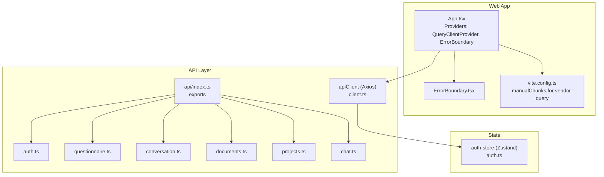
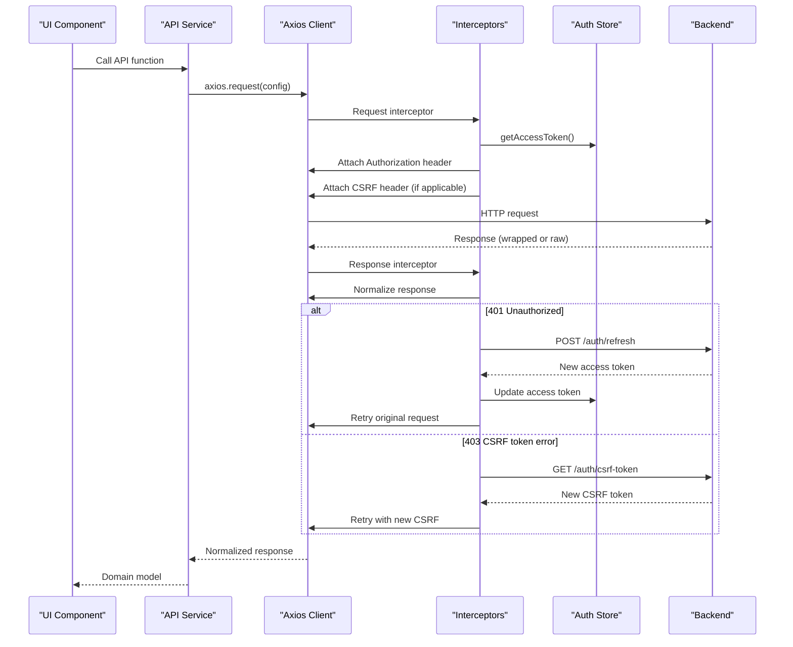
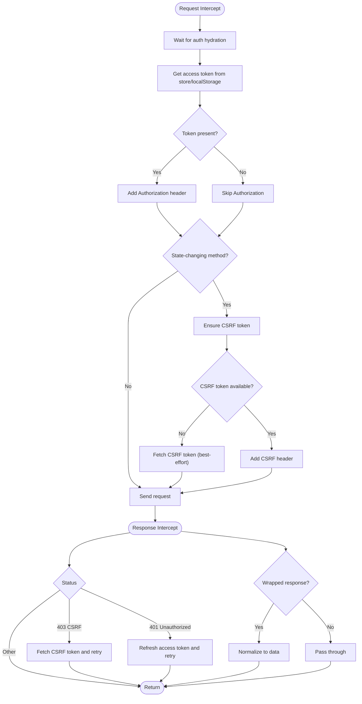
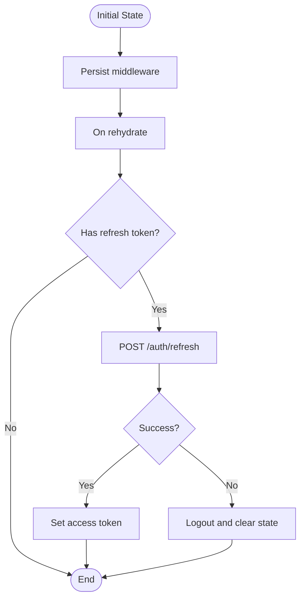
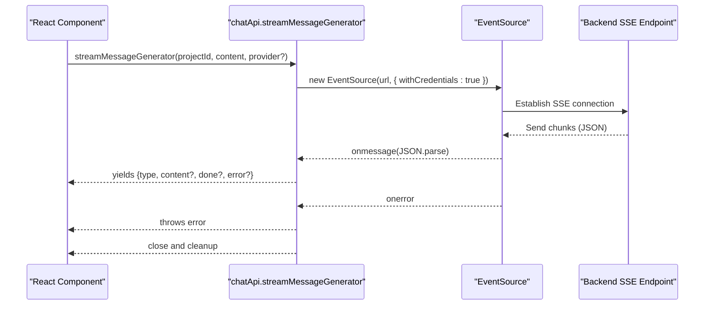
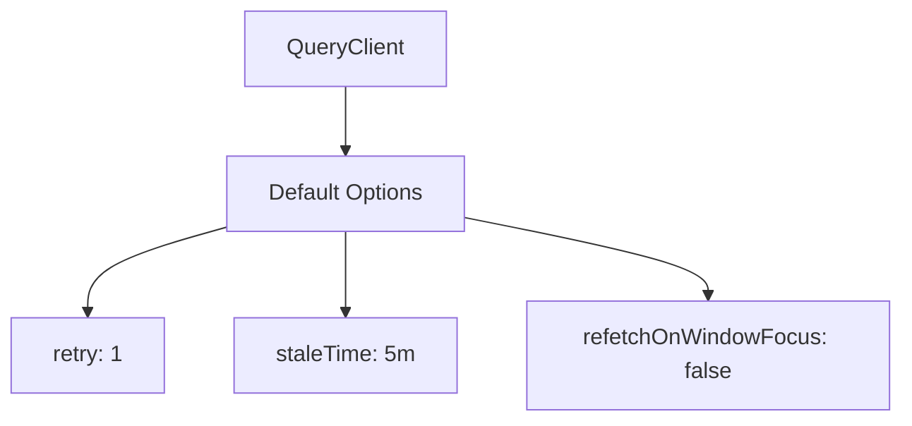
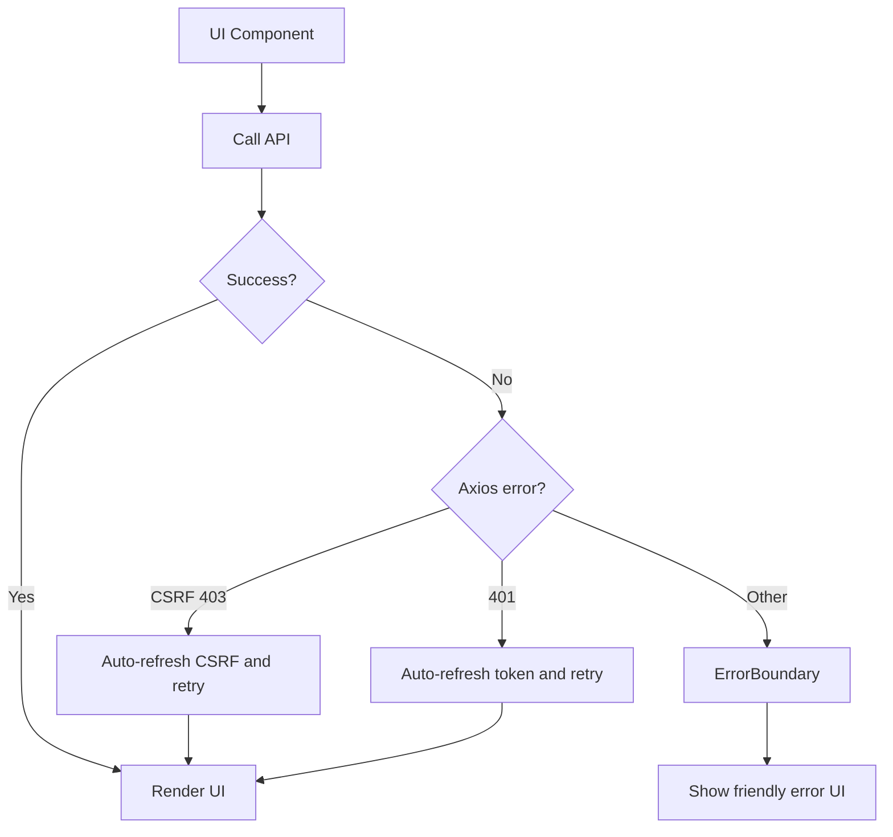
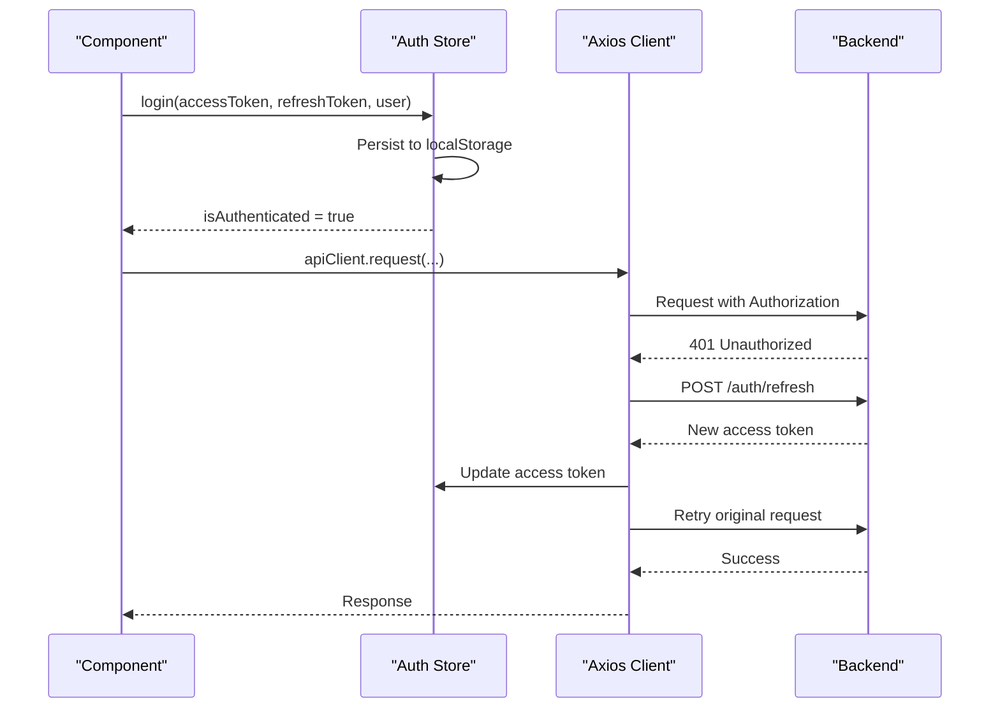
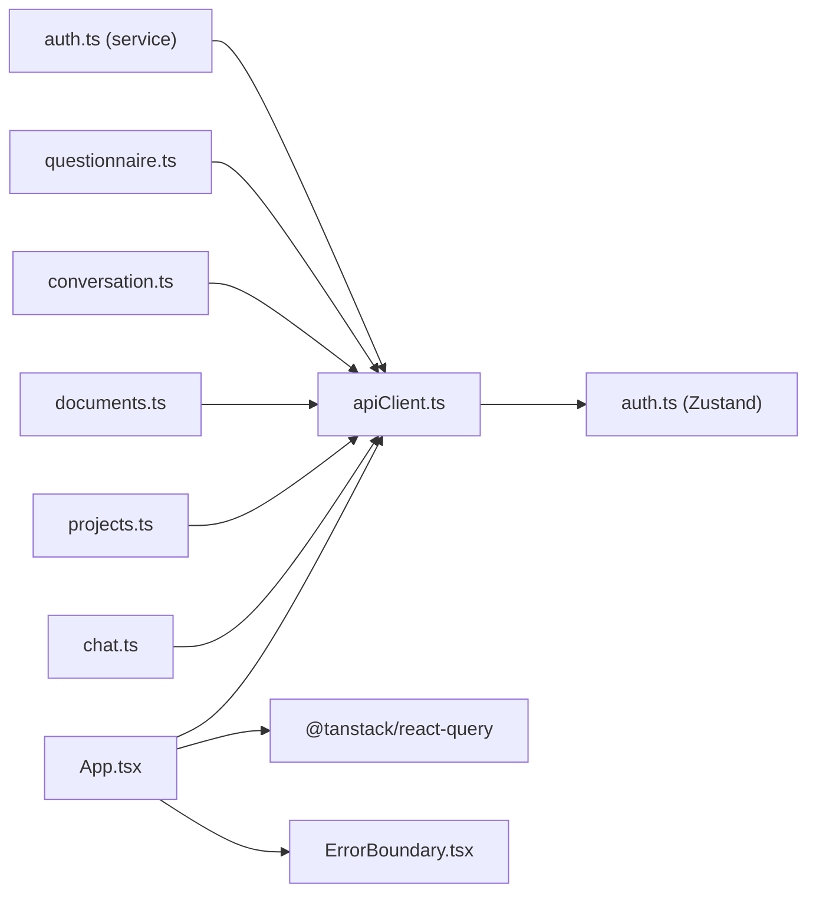

# API Integration

<cite>
**Referenced Files in This Document**
- [client.ts](file://apps/web/src/api/client.ts)
- [index.ts](file://apps/web/src/api/index.ts)
- [auth.ts](file://apps/web/src/api/auth.ts)
- [questionnaire.ts](file://apps/web/src/api/questionnaire.ts)
- [conversation.ts](file://apps/web/src/api/conversation.ts)
- [documents.ts](file://apps/web/src/api/documents.ts)
- [projects.ts](file://apps/web/src/api/projects.ts)
- [chat.ts](file://apps/web/src/api/chat.ts)
- [auth.ts](file://apps/web/src/stores/auth.ts)
- [App.tsx](file://apps/web/src/App.tsx)
- [ErrorBoundary.tsx](file://apps/web/src/components/ErrorBoundary.tsx)
- [vite.config.ts](file://apps/web/vite.config.ts)
</cite>

## Table of Contents
1. [Introduction](#introduction)
2. [Project Structure](#project-structure)
3. [Core Components](#core-components)
4. [Architecture Overview](#architecture-overview)
5. [Detailed Component Analysis](#detailed-component-analysis)
6. [Dependency Analysis](#dependency-analysis)
7. [Performance Considerations](#performance-considerations)
8. [Troubleshooting Guide](#troubleshooting-guide)
9. [Conclusion](#conclusion)
10. [Appendices](#appendices)

## Introduction
This document describes the frontend API integration for the Quiz-to-Build web application. It covers the Axios client configuration, request/response interceptors, JWT-based authentication with automatic token refresh, CSRF protection, and protected endpoint handling. It also documents the API service modules for authentication, questionnaires, conversations, documents, projects, and chat. Real-time streaming via Server-Sent Events (SSE) is included, along with error handling patterns, retry mechanisms, and network failure recovery. Finally, it explains caching strategies using React Query, optimistic updates, and data synchronization patterns, including base URL management and environment-specific settings.

## Project Structure
The API layer is organized around a central Axios client with dedicated service modules grouped by domain. Providers in the main application wrap the app with React Query and an error boundary. Environment-specific base URL resolution is centralized in the API client and auth store.

**Diagram sources**
- [App.tsx:138-147](file://apps/web/src/App.tsx#L138-L147)
- [client.ts:95-102](file://apps/web/src/api/client.ts#L95-L102)
- [index.ts:1-14](file://apps/web/src/api/index.ts#L1-L14)
- [auth.ts:15-101](file://apps/web/src/api/auth.ts#L15-L101)
- [questionnaire.ts:175-476](file://apps/web/src/api/questionnaire.ts#L175-L476)
- [conversation.ts:31-85](file://apps/web/src/api/conversation.ts#L31-L85)
- [documents.ts:48-135](file://apps/web/src/api/documents.ts#L48-L135)
- [projects.ts:43-93](file://apps/web/src/api/projects.ts#L43-L93)
- [chat.ts:47-167](file://apps/web/src/api/chat.ts#L47-L167)
- [auth.ts:37-173](file://apps/web/src/stores/auth.ts#L37-L173)

**Section sources**
- [client.ts:10-31](file://apps/web/src/api/client.ts#L10-L31)
- [auth.ts:23-35](file://apps/web/src/stores/auth.ts#L23-L35)
- [index.ts:1-14](file://apps/web/src/api/index.ts#L1-L14)
- [App.tsx:138-147](file://apps/web/src/App.tsx#L138-L147)
- [vite.config.ts:1-19](file://apps/web/vite.config.ts#L1-L19)

## Core Components
- Central Axios client with environment-aware base URL resolution, request/response interceptors, CSRF token handling, and automatic JWT refresh.
- Auth store using Zustand with localStorage persistence and hydration logic.
- API service modules for authentication, questionnaires, conversations, documents, projects, and chat.
- React Query provider configured with retry and staleness behavior.
- Application-wide error boundary for graceful error handling.

Key responsibilities:
- apiClient: Base URL selection, auth token injection, CSRF token injection, response normalization, 401/403 handling, and token refresh.
- Auth store: Persist tokens, synchronize state, and refresh access tokens on hydration.
- API services: Encapsulate endpoints per domain with normalized responses.
- React Query: Centralized caching, retries, and invalidation.
- Error Boundary: Top-level error capture and user-friendly fallback.

**Section sources**
- [client.ts:95-326](file://apps/web/src/api/client.ts#L95-L326)
- [auth.ts:37-173](file://apps/web/src/stores/auth.ts#L37-L173)
- [App.tsx:138-147](file://apps/web/src/App.tsx#L138-L147)
- [ErrorBoundary.tsx:13-71](file://apps/web/src/components/ErrorBoundary.tsx#L13-L71)

## Architecture Overview
The frontend integrates with a backend via a single Axios client. Requests are intercepted to attach JWT and CSRF tokens. Responses are normalized, and failures trigger automatic token refresh or CSRF refresh. Protected routes and services enforce authentication. SSE streams chat responses. React Query manages caching and retries.

**Diagram sources**
- [client.ts:160-323](file://apps/web/src/api/client.ts#L160-L323)
- [auth.ts:154-167](file://apps/web/src/stores/auth.ts#L154-L167)
- [auth.ts:71-123](file://apps/web/src/stores/auth.ts#L71-L123)

## Detailed Component Analysis

### Axios Client and Interceptors
- Base URL resolution:
  - Uses explicit VITE_API_URL if set.
  - In production, uses empty string for relative URLs handled by nginx.
  - In development, falls back to localhost:3000.
- Request interceptor:
  - Waits for auth hydration to avoid race conditions.
  - Injects Authorization: Bearer <access token>.
  - Adds CSRF token for state-changing methods.
  - Fetches CSRF token if missing (with warnings on failure).
- Response interceptor:
  - Normalizes wrapped responses { success, data } -> data.
  - Handles CSRF token errors (403 with CSRF_TOKEN_* codes) by fetching a new CSRF token and retrying.
  - Handles 401 Unauthorized by attempting token refresh with refreshToken, broadcasting to queued subscribers, and retrying the original request. On failure, logs out and redirects to login.
- Token refresh concurrency:
  - Prevents multiple simultaneous refreshes using a flag and subscriber queue.

**Diagram sources**
- [client.ts:160-323](file://apps/web/src/api/client.ts#L160-L323)

**Section sources**
- [client.ts:20-31](file://apps/web/src/api/client.ts#L20-L31)
- [client.ts:160-198](file://apps/web/src/api/client.ts#L160-L198)
- [client.ts:200-323](file://apps/web/src/api/client.ts#L200-L323)

### Authentication Store (Zustand + localStorage)
- Persists user, access token, and refresh token to localStorage with Zustand persist middleware.
- Ensures immediate in-memory state synchronization and validates persistence with retries.
- On hydration, proactively refreshes access token if refresh token exists and access token is missing.
- Provides actions to set tokens, login (with persistence), and logout.

**Diagram sources**
- [auth.ts:154-167](file://apps/web/src/stores/auth.ts#L154-L167)

**Section sources**
- [auth.ts:37-173](file://apps/web/src/stores/auth.ts#L37-L173)

### API Services

#### Authentication API
- Endpoints: register, login, logout, verify email, resend verification, forgot password, reset password, get current user.
- Returns normalized token responses and message responses.

Usage example paths:
- [authApi.register:21-27](file://apps/web/src/api/auth.ts#L21-L27)
- [authApi.login:32-38](file://apps/web/src/api/auth.ts#L32-L38)
- [authApi.logout:43-48](file://apps/web/src/api/auth.ts#L43-L48)
- [authApi.verifyEmail:53-58](file://apps/web/src/api/auth.ts#L53-L58)
- [authApi.resendVerification:63-68](file://apps/web/src/api/auth.ts#L63-L68)
- [authApi.forgotPassword:73-78](file://apps/web/src/api/auth.ts#L73-L78)
- [authApi.resetPassword:83-89](file://apps/web/src/api/auth.ts#L83-L89)
- [authApi.getMe:94-97](file://apps/web/src/api/auth.ts#L94-L97)

**Section sources**
- [auth.ts:15-101](file://apps/web/src/api/auth.ts#L15-L101)

#### Questionnaire API
- Sessions: create, get, list, continue, submit response, complete.
- Scoring: readiness score, next questions, score history, benchmarks.
- Heatmap: data, summary, drilldown, CSV export.
- Evidence and decisions: list, create, update status.
- QPG and policy pack generation.

Usage example paths:
- [questionnaireApi.listQuestionnaires:178-185](file://apps/web/src/api/questionnaire.ts#L178-L185)
- [questionnaireApi.createSession:188-191](file://apps/web/src/api/questionnaire.ts#L188-L191)
- [questionnaireApi.continueSession:211-216](file://apps/web/src/api/questionnaire.ts#L211-L216)
- [questionnaireApi.submitResponse:219-225](file://apps/web/src/api/questionnaire.ts#L219-L225)
- [questionnaireApi.completeSession:228-231](file://apps/web/src/api/questionnaire.ts#L228-L231)
- [questionnaireApi.getScore:234-237](file://apps/web/src/api/questionnaire.ts#L234-L237)
- [questionnaireApi.getHeatmap:267-270](file://apps/web/src/api/questionnaire.ts#L267-L270)
- [questionnaireApi.listEvidence:368-382](file://apps/web/src/api/questionnaire.ts#L368-L382)
- [questionnaireApi.listDecisions:396-409](file://apps/web/src/api/questionnaire.ts#L396-L409)
- [questionnaireApi.generatePolicyPack:462-472](file://apps/web/src/api/questionnaire.ts#L462-L472)

**Section sources**
- [questionnaire.ts:175-476](file://apps/web/src/api/questionnaire.ts#L175-L476)

#### Conversation API
- Submit answers with AI follow-up evaluation.
- Submit follow-up answers.
- Retrieve conversation history for a session or a specific question.

Usage example paths:
- [submitAnswerWithAi:34-48](file://apps/web/src/api/conversation.ts#L34-L48)
- [submitFollowUp:53-63](file://apps/web/src/api/conversation.ts#L53-L63)
- [getSessionConversation:68-71](file://apps/web/src/api/conversation.ts#L68-L71)
- [getQuestionConversation:76-84](file://apps/web/src/api/conversation.ts#L76-L84)

**Section sources**
- [conversation.ts:31-85](file://apps/web/src/api/conversation.ts#L31-L85)

#### Documents API
- List document types, session-specific types.
- Request generation, get session documents, download single/bulk, get versions, download specific version.

Usage example paths:
- [listDocumentTypes:48-51](file://apps/web/src/api/documents.ts#L48-L51)
- [getSessionDocumentTypes:53-56](file://apps/web/src/api/documents.ts#L53-L56)
- [requestDocumentGeneration:58-69](file://apps/web/src/api/documents.ts#L58-L69)
- [getSessionDocuments:71-74](file://apps/web/src/api/documents.ts#L71-L74)
- [downloadDocument:76-82](file://apps/web/src/api/documents.ts#L76-L82)
- [bulkDownloadSession:84-93](file://apps/web/src/api/documents.ts#L84-L93)
- [bulkDownloadSelected:95-102](file://apps/web/src/api/documents.ts#L95-L102)
- [getDocumentVersions:123-126](file://apps/web/src/api/documents.ts#L123-L126)
- [downloadDocumentVersion:128-134](file://apps/web/src/api/documents.ts#L128-L134)

**Section sources**
- [documents.ts:48-135](file://apps/web/src/api/documents.ts#L48-L135)

#### Projects API
- List projects, get project, create project, get quality score, archive project.

Usage example paths:
- [getProjects:46-51](file://apps/web/src/api/projects.ts#L46-L51)
- [getProject:56-59](file://apps/web/src/api/projects.ts#L56-L59)
- [createProject:64-67](file://apps/web/src/api/projects.ts#L64-L67)
- [getProjectQualityScore:72-75](file://apps/web/src/api/projects.ts#L72-L75)
- [archiveProject:80-82](file://apps/web/src/api/projects.ts#L80-L82)

**Section sources**
- [projects.ts:43-93](file://apps/web/src/api/projects.ts#L43-L93)

#### Chat API (SSE Streaming)
- Get chat status and history.
- Send non-streaming message.
- Stream messages via SSE with EventSource and an async generator wrapper.

Usage example paths:
- [getChatStatus:49-52](file://apps/web/src/api/chat.ts#L49-L52)
- [getChatHistory:57-60](file://apps/web/src/api/chat.ts#L57-L60)
- [sendMessage:65-74](file://apps/web/src/api/chat.ts#L65-L74)
- [streamMessage:80-94](file://apps/web/src/api/chat.ts#L80-L94)
- [streamMessageGenerator:100-156](file://apps/web/src/api/chat.ts#L100-L156)

**Section sources**
- [chat.ts:47-167](file://apps/web/src/api/chat.ts#L47-L167)

### Real-Time WebSocket Integration (SSE)
- The chat API exposes an SSE endpoint that streams tokens as they are generated.
- An async generator helper simplifies consumption in React components.
- EventSource is created with credentials to support cookie-based auth.

**Diagram sources**
- [chat.ts:80-156](file://apps/web/src/api/chat.ts#L80-L156)

**Section sources**
- [chat.ts:80-156](file://apps/web/src/api/chat.ts#L80-L156)

### React Query Integration
- A single QueryClient is created with default options:
  - retry: 1
  - staleTime: 5 minutes
  - refetchOnWindowFocus: false
- This enables caching and retry for queries across the app.

**Diagram sources**
- [App.tsx:138-147](file://apps/web/src/App.tsx#L138-L147)

**Section sources**
- [App.tsx:138-147](file://apps/web/src/App.tsx#L138-L147)
- [vite.config.ts:11-13](file://apps/web/vite.config.ts#L11-L13)

### Error Handling Patterns and Boundaries
- Axios interceptors handle CSRF and token refresh automatically for most failures.
- Application-level ErrorBoundary captures unhandled errors and renders a friendly message with a navigation button.
- ProtectedRoute enforces authentication and prevents rendering protected content until hydration completes.

**Diagram sources**
- [client.ts:222-323](file://apps/web/src/api/client.ts#L222-L323)
- [ErrorBoundary.tsx:19-25](file://apps/web/src/components/ErrorBoundary.tsx#L19-L25)

**Section sources**
- [client.ts:222-323](file://apps/web/src/api/client.ts#L222-L323)
- [ErrorBoundary.tsx:13-71](file://apps/web/src/components/ErrorBoundary.tsx#L13-L71)
- [App.tsx:149-172](file://apps/web/src/App.tsx#L149-L172)

### Authentication Integration: JWT Tokens, Refresh, and Protected Endpoints
- Access tokens are stored in Zustand and persisted to localStorage for reliability.
- Refresh tokens are used to obtain new access tokens without re-authentication.
- The client injects Authorization headers automatically and handles refresh race conditions.
- Protected routes rely on the auth store’s isAuthenticated flag.

**Diagram sources**
- [auth.ts:71-123](file://apps/web/src/stores/auth.ts#L71-L123)
- [client.ts:262-319](file://apps/web/src/api/client.ts#L262-L319)

**Section sources**
- [auth.ts:71-123](file://apps/web/src/stores/auth.ts#L71-L123)
- [client.ts:262-319](file://apps/web/src/api/client.ts#L262-L319)

### Caching Strategies, Optimistic Updates, and Data Synchronization
- React Query caches responses with configurable staleness and retry behavior.
- For optimistic UI patterns, components can locally update data and invalidate queries on failure to rollback.
- Data synchronization relies on Zustand for auth state and localStorage for persistence, with retry checks to ensure consistency.

Recommendations:
- Use query keys that reflect the resource identity to enable efficient cache invalidation.
- For mutations, optimistically update the UI and invalidate affected queries; on error, rollback and show a toast.

**Section sources**
- [App.tsx:138-147](file://apps/web/src/App.tsx#L138-L147)
- [auth.ts:98-123](file://apps/web/src/stores/auth.ts#L98-L123)

### Base URL Management and Environment-Specific Settings
- The API base URL is resolved in two places:
  - apiClient.ts: Used for Axios baseURL and CSRF/token endpoints.
  - auth.ts: Reused for the same logic in the auth store to ensure consistency.
- Environment variables:
  - VITE_API_URL overrides all other settings.
  - Production defaults to relative URLs handled by nginx.
  - Development defaults to http://localhost:3000.

**Section sources**
- [client.ts:20-31](file://apps/web/src/api/client.ts#L20-L31)
- [auth.ts:27-35](file://apps/web/src/stores/auth.ts#L27-L35)

## Dependency Analysis
The API layer depends on:
- Axios for HTTP requests and interceptors.
- Zustand for authentication state and persistence.
- React Query for caching and retries.
- React Router for protected routes.

**Diagram sources**
- [client.ts:10-12](file://apps/web/src/api/client.ts#L10-L12)
- [auth.ts:10-21](file://apps/web/src/stores/auth.ts#L10-L21)
- [index.ts:1-14](file://apps/web/src/api/index.ts#L1-L14)
- [App.tsx:7-11](file://apps/web/src/App.tsx#L7-L11)

**Section sources**
- [index.ts:1-14](file://apps/web/src/api/index.ts#L1-L14)
- [App.tsx:7-11](file://apps/web/src/App.tsx#L7-L11)

## Performance Considerations
- Long-running operations (document generation, policy pack generation) use extended timeouts to accommodate backend processing.
- React Query default retry reduces thrash while allowing transient failures to recover.
- Chunking vendor libraries improves bundle splitting and caching.

Recommendations:
- Use query prefetching for frequently visited pages.
- Configure queryKey granularity to minimize unnecessary refetches.
- Consider background refetching for real-time-like updates in chat.

**Section sources**
- [documents.ts:10-11](file://apps/web/src/api/documents.ts#L10-L11)
- [questionnaire.ts:460-472](file://apps/web/src/api/questionnaire.ts#L460-L472)
- [App.tsx:140-146](file://apps/web/src/App.tsx#L140-L146)
- [vite.config.ts:11-13](file://apps/web/vite.config.ts#L11-L13)

## Troubleshooting Guide
Common issues and resolutions:
- 403 CSRF token errors:
  - The client auto-fetches a new CSRF token and retries. If it fails, inspect network tab and server-side CSRF configuration.
- 401 Unauthorized:
  - The client attempts token refresh using the refresh token. If refresh fails, the user is logged out. Verify refresh token validity and backend refresh endpoint.
- Missing Authorization header:
  - Ensure auth hydration completes before making requests. The client waits for hydration, but components should guard protected routes.
- SSE streaming errors:
  - EventSource.onerror is handled; ensure backend SSE endpoint is reachable and credentials are supported.
- Persistent state desync:
  - The auth store writes to localStorage and retries synchronization. If state remains inconsistent, clear browser storage and re-login.

**Section sources**
- [client.ts:222-323](file://apps/web/src/api/client.ts#L222-L323)
- [auth.ts:98-123](file://apps/web/src/stores/auth.ts#L98-L123)
- [chat.ts:131-141](file://apps/web/src/api/chat.ts#L131-L141)

## Conclusion
The frontend API integration leverages a robust Axios client with automatic CSRF and JWT handling, a resilient auth store with persistence, and domain-specific API services. React Query provides caching and retry behavior, while SSE enables real-time chat streaming. Together, these components deliver a reliable, maintainable, and user-friendly API layer.

## Appendices

### Example Usage References
- Authentication:
  - [authApi.login:32-38](file://apps/web/src/api/auth.ts#L32-L38)
  - [authApi.register:21-27](file://apps/web/src/api/auth.ts#L21-L27)
- Questionnaire:
  - [questionnaireApi.createSession:188-191](file://apps/web/src/api/questionnaire.ts#L188-L191)
  - [questionnaireApi.submitResponse:219-225](file://apps/web/src/api/questionnaire.ts#L219-L225)
- Documents:
  - [documentsApi.requestDocumentGeneration:58-69](file://apps/web/src/api/documents.ts#L58-L69)
- Projects:
  - [projectsApi.getProject:56-59](file://apps/web/src/api/projects.ts#L56-L59)
- Chat:
  - [chatApi.sendMessage:65-74](file://apps/web/src/api/chat.ts#L65-L74)
  - [chatApi.streamMessageGenerator:100-156](file://apps/web/src/api/chat.ts#L100-L156)