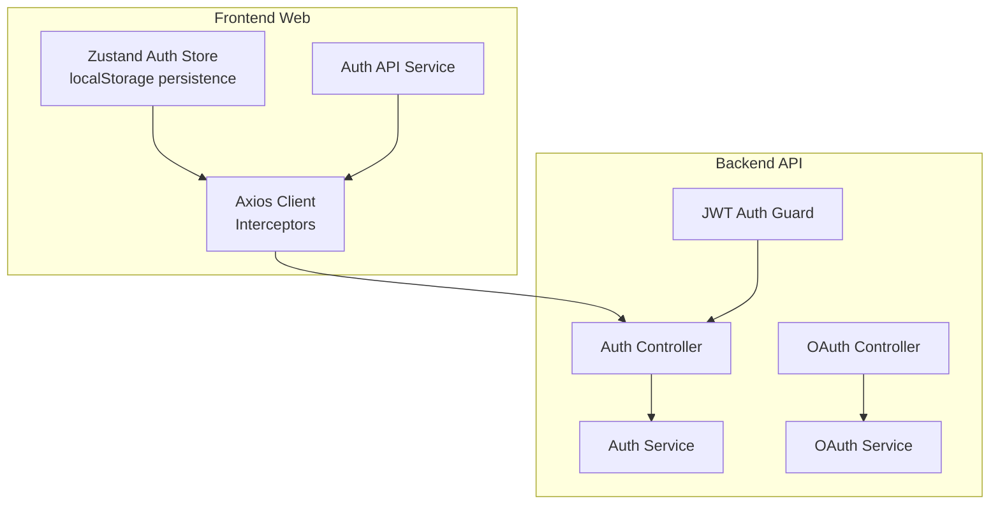
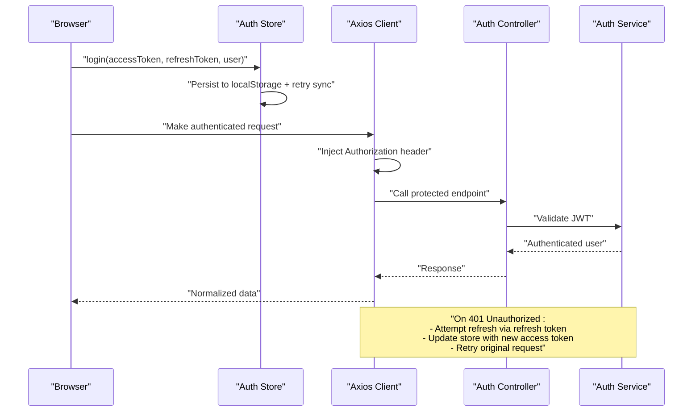
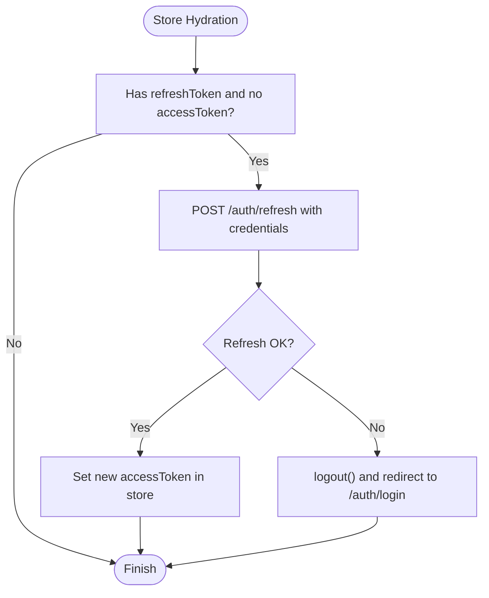
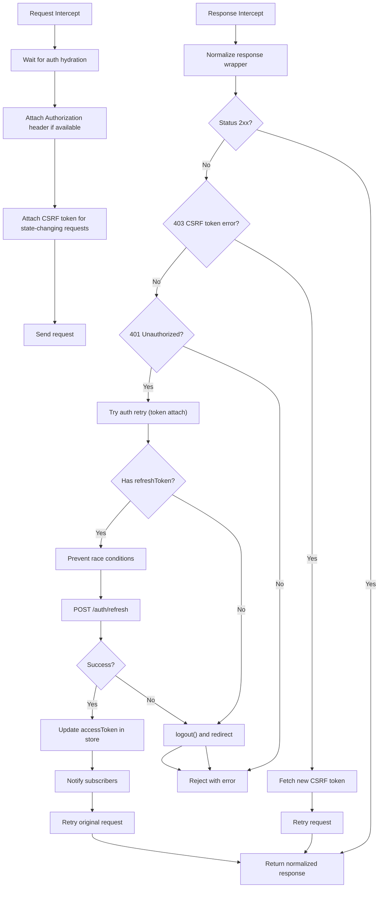
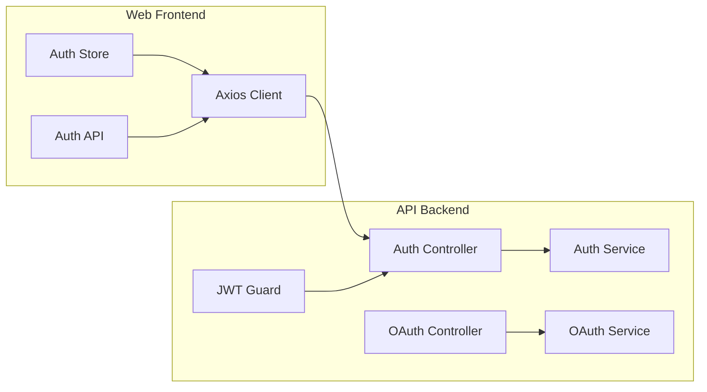

# Authentication Integration

<cite>
**Referenced Files in This Document**
- [auth.ts](file://apps/web/src/stores/auth.ts)
- [auth.ts](file://apps/web/src/api/auth.ts)
- [client.ts](file://apps/web/src/api/client.ts)
- [auth.ts](file://apps/api/src/modules/auth/auth.service.ts)
- [auth.controller.ts](file://apps/api/src/modules/auth/auth.controller.ts)
- [jwt-auth.guard.ts](file://apps/api/src/modules/auth/guards/jwt-auth.guard.ts)
- [oauth.controller.ts](file://apps/api/src/modules/auth/oauth/oauth.controller.ts)
- [oauth.service.ts](file://apps/api/src/modules/auth/oauth/oauth.service.ts)
- [auth.ts](file://apps/web/src/types/auth.ts)
- [auth.test.ts](file://apps/web/src/stores/auth.test.ts)
</cite>

## Table of Contents
1. [Introduction](#introduction)
2. [Project Structure](#project-structure)
3. [Core Components](#core-components)
4. [Architecture Overview](#architecture-overview)
5. [Detailed Component Analysis](#detailed-component-analysis)
6. [Dependency Analysis](#dependency-analysis)
7. [Performance Considerations](#performance-considerations)
8. [Troubleshooting Guide](#troubleshooting-guide)
9. [Conclusion](#conclusion)

## Introduction
This document details the authentication integration module covering JWT token management, automatic token refresh, protected endpoint handling, authentication state management with React stores, token persistence strategies, logout procedures, OAuth provider integrations, login flow, session validation, and error handling. It also explains how the frontend authentication services integrate with backend API modules.

## Project Structure
The authentication integration spans three primary areas:
- Frontend SPA (React + Zustand):
  - Auth store with localStorage persistence and hydration logic
  - Axios client with request/response interceptors for token injection and refresh
  - Auth API service wrappers for login/register/logout and related flows
- Backend NestJS API:
  - Auth controller exposing endpoints for registration, login, refresh, logout, profile, email verification, and password reset
  - Auth service implementing token generation, refresh validation, user validation, and security helpers
  - JWT guard enforcing protected routes and handling token expiration/invalid token scenarios
  - OAuth controller and service supporting Google and Microsoft authentication and linking/unlinking

**Diagram sources**
- [auth.ts:1-173](file://apps/web/src/stores/auth.ts#L1-L173)
- [client.ts:1-326](file://apps/web/src/api/client.ts#L1-L326)
- [auth.ts:1-101](file://apps/web/src/api/auth.ts#L1-L101)
- [auth.controller.ts:1-171](file://apps/api/src/modules/auth/auth.controller.ts#L1-L171)
- [auth.service.ts:1-507](file://apps/api/src/modules/auth/auth.service.ts#L1-L507)
- [jwt-auth.guard.ts:1-64](file://apps/api/src/modules/auth/guards/jwt-auth.guard.ts#L1-L64)
- [oauth.controller.ts:1-144](file://apps/api/src/modules/auth/oauth/oauth.controller.ts#L1-L144)
- [oauth.service.ts:1-357](file://apps/api/src/modules/auth/oauth/oauth.service.ts#L1-L357)

**Section sources**
- [auth.ts:1-173](file://apps/web/src/stores/auth.ts#L1-L173)
- [client.ts:1-326](file://apps/web/src/api/client.ts#L1-L326)
- [auth.ts:1-101](file://apps/web/src/api/auth.ts#L1-L101)
- [auth.controller.ts:1-171](file://apps/api/src/modules/auth/auth.controller.ts#L1-L171)
- [auth.service.ts:1-507](file://apps/api/src/modules/auth/auth.service.ts#L1-L507)
- [jwt-auth.guard.ts:1-64](file://apps/api/src/modules/auth/guards/jwt-auth.guard.ts#L1-L64)
- [oauth.controller.ts:1-144](file://apps/api/src/modules/auth/oauth/oauth.controller.ts#L1-L144)
- [oauth.service.ts:1-357](file://apps/api/src/modules/auth/oauth/oauth.service.ts#L1-L357)

## Core Components
- Frontend Auth Store (Zustand)
  - Manages user, access token, refresh token, authentication status, and loading state
  - Persists to localStorage with manual write and retry synchronization
  - Proactively refreshes access token on hydration when refresh token is present
- Frontend Axios Client
  - Injects Authorization header with Bearer token
  - Adds CSRF token for state-changing requests
  - Implements automatic token refresh on 401 with concurrency control
  - Normalizes backend response wrapper to simplified data
- Frontend Auth API Service
  - Wraps backend auth endpoints for registration, login, logout, email verification, password reset, and profile retrieval
- Backend Auth Controller
  - Exposes endpoints for register, login, refresh, logout, profile, email verification, resend verification, forgot password, reset password, and CSRF token
- Backend Auth Service
  - Implements token generation, refresh validation against Redis, user validation, email verification, password reset, and refresh token invalidation
- JWT Auth Guard
  - Enforces protected routes, respects @Public decorator, logs authentication failures, and returns specific error messages for expired/invalid tokens
- OAuth Controller and Service
  - Supports Google and Microsoft OAuth authentication, linking/unlinking OAuth accounts, and retrieving linked accounts

**Section sources**
- [auth.ts:37-173](file://apps/web/src/stores/auth.ts#L37-L173)
- [client.ts:95-326](file://apps/web/src/api/client.ts#L95-L326)
- [auth.ts:17-101](file://apps/web/src/api/auth.ts#L17-L101)
- [auth.controller.ts:38-171](file://apps/api/src/modules/auth/auth.controller.ts#L38-L171)
- [auth.service.ts:104-247](file://apps/api/src/modules/auth/auth.service.ts#L104-L247)
- [jwt-auth.guard.ts:22-63](file://apps/api/src/modules/auth/guards/jwt-auth.guard.ts#L22-L63)
- [oauth.controller.ts:51-144](file://apps/api/src/modules/auth/oauth/oauth.controller.ts#L51-L144)
- [oauth.service.ts:76-242](file://apps/api/src/modules/auth/oauth/oauth.service.ts#L76-L242)

## Architecture Overview
The authentication architecture follows a standard SPA with short-lived access tokens and long-lived refresh tokens stored securely on the server-side. The frontend manages access tokens in memory and localStorage while relying on the backend for refresh token validation and issuance.

**Diagram sources**
- [auth.ts:71-123](file://apps/web/src/stores/auth.ts#L71-L123)
- [client.ts:161-323](file://apps/web/src/api/client.ts#L161-L323)
- [auth.controller.ts:59-91](file://apps/api/src/modules/auth/auth.controller.ts#L59-L91)
- [auth.service.ts:147-177](file://apps/api/src/modules/auth/auth.service.ts#L147-L177)

## Detailed Component Analysis

### Frontend Auth Store (Zustand)
- Responsibilities
  - Maintain in-memory state for user, tokens, authentication status, and loading state
  - Persist to localStorage with manual write and retry synchronization to mitigate module boundary issues
  - On hydration, proactively refresh access token if refresh token exists and no access token is present
- Token Persistence Strategy
  - Zustand persist middleware serializes selected state fields
  - Manual localStorage write ensures availability even if Zustand hydration is delayed
  - Retry loop validates synchronization and falls back to forced reload from localStorage
- Hydration and Refresh Logic
  - onRehydrateStorage triggers refresh endpoint with credentials when refresh token is available
  - Clears state and redirects to login on refresh failure

**Diagram sources**
- [auth.ts:145-169](file://apps/web/src/stores/auth.ts#L145-L169)

**Section sources**
- [auth.ts:37-173](file://apps/web/src/stores/auth.ts#L37-L173)

### Frontend Axios Client Interceptors
- Request Interceptor
  - Waits for auth hydration to avoid race conditions
  - Injects Authorization header with Bearer token if available
  - Adds CSRF token for state-changing requests (POST/PUT/DELETE/PATCH)
- Response Interceptor
  - Normalizes backend wrapper responses
  - Handles CSRF token errors (403) by fetching a new CSRF token and retrying
  - Handles 401 Unauthorized by attempting token refresh with concurrency control
  - On refresh success, retries original request; on failure, clears auth state and redirects to login

**Diagram sources**
- [client.ts:161-323](file://apps/web/src/api/client.ts#L161-L323)

**Section sources**
- [client.ts:95-326](file://apps/web/src/api/client.ts#L95-L326)

### Frontend Auth API Service
- Wraps backend endpoints for:
  - Registration, login, logout
  - Email verification and resend verification
  - Forgot password and reset password
  - Get current user profile
- Returns typed responses aligned with frontend types

**Section sources**
- [auth.ts:17-101](file://apps/web/src/api/auth.ts#L17-L101)
- [auth.ts:12-48](file://apps/web/src/types/auth.ts#L12-L48)

### Backend Auth Controller
- Endpoints
  - POST /auth/register, POST /auth/login
  - POST /auth/refresh, POST /auth/logout
  - GET /auth/me
  - POST /auth/verify-email, POST /auth/resend-verification
  - POST /auth/forgot-password, POST /auth/reset-password
  - GET /auth/csrf-token
- Security
  - Throttling for sensitive endpoints
  - CSRF protection via dedicated endpoint and cookie
  - JWT guard for protected endpoints

**Section sources**
- [auth.controller.ts:38-171](file://apps/api/src/modules/auth/auth.controller.ts#L38-L171)

### Backend Auth Service
- Token Management
  - Generates access token (15 min expiry) and refresh token (7-day expiry)
  - Stores refresh tokens in Redis and database for audit
- Session Validation
  - Validates refresh tokens by checking Redis presence
  - Generates new access tokens on refresh
- User Operations
  - Registration with email verification workflow
  - Login with failed attempt tracking and locking
  - Email verification and resend verification
  - Password reset with token validation and refresh token invalidation
- Security Helpers
  - Cryptographically secure token generation
  - Configurable expiry parsing

**Section sources**
- [auth.service.ts:104-247](file://apps/api/src/modules/auth/auth.service.ts#L104-L247)
- [auth.service.ts:293-498](file://apps/api/src/modules/auth/auth.service.ts#L293-L498)

### JWT Auth Guard
- Behavior
  - Respects @Public decorator for public endpoints
  - Logs authentication failures with request context
  - Returns specific messages for expired vs invalid tokens
- Integration
  - Applied to protected endpoints to enforce JWT validation

**Section sources**
- [jwt-auth.guard.ts:22-63](file://apps/api/src/modules/auth/guards/jwt-auth.guard.ts#L22-L63)

### OAuth Integration
- Controllers
  - POST /auth/oauth/google and /auth/oauth/microsoft for initial OAuth login
  - GET /auth/oauth/accounts, POST /auth/oauth/link, DELETE /auth/oauth/unlink for managing linked accounts
- Services
  - Google OAuth: verifies ID token and maps profile
  - Microsoft OAuth: fetches profile from Graph API
  - Links OAuth accounts to existing users or creates new users
  - Enforces constraints preventing unlinking the only authentication method

**Section sources**
- [oauth.controller.ts:51-144](file://apps/api/src/modules/auth/oauth/oauth.controller.ts#L51-L144)
- [oauth.service.ts:76-330](file://apps/api/src/modules/auth/oauth/oauth.service.ts#L76-L330)

## Dependency Analysis
- Frontend
  - Auth store depends on Zustand and localStorage
  - Axios client depends on auth store for tokens and CSRF token management
  - Auth API service depends on axios client
- Backend
  - Auth controller depends on Auth service and JWT guard
  - OAuth controller depends on OAuth service
  - Auth service depends on Prisma, Redis, JWT service, and notification service

**Diagram sources**
- [auth.ts:1-173](file://apps/web/src/stores/auth.ts#L1-L173)
- [client.ts:1-326](file://apps/web/src/api/client.ts#L1-L326)
- [auth.ts:1-101](file://apps/web/src/api/auth.ts#L1-L101)
- [auth.controller.ts:1-171](file://apps/api/src/modules/auth/auth.controller.ts#L1-L171)
- [auth.service.ts:1-507](file://apps/api/src/modules/auth/auth.service.ts#L1-L507)
- [jwt-auth.guard.ts:1-64](file://apps/api/src/modules/auth/guards/jwt-auth.guard.ts#L1-L64)
- [oauth.controller.ts:1-144](file://apps/api/src/modules/auth/oauth/oauth.controller.ts#L1-L144)
- [oauth.service.ts:1-357](file://apps/api/src/modules/auth/oauth/oauth.service.ts#L1-L357)

**Section sources**
- [auth.ts:1-173](file://apps/web/src/stores/auth.ts#L1-L173)
- [client.ts:1-326](file://apps/web/src/api/client.ts#L1-L326)
- [auth.ts:1-101](file://apps/web/src/api/auth.ts#L1-L101)
- [auth.controller.ts:1-171](file://apps/api/src/modules/auth/auth.controller.ts#L1-L171)
- [auth.service.ts:1-507](file://apps/api/src/modules/auth/auth.service.ts#L1-L507)
- [jwt-auth.guard.ts:1-64](file://apps/api/src/modules/auth/guards/jwt-auth.guard.ts#L1-L64)
- [oauth.controller.ts:1-144](file://apps/api/src/modules/auth/oauth/oauth.controller.ts#L1-L144)
- [oauth.service.ts:1-357](file://apps/api/src/modules/auth/oauth/oauth.service.ts#L1-L357)

## Performance Considerations
- Token Expiry and Refresh
  - Access tokens are short-lived (15 minutes) to minimize exposure; refresh tokens are long-lived and validated server-side
  - Automatic refresh prevents frequent user interruptions and reduces repeated login prompts
- Concurrency Control
  - Frontend interceptor prevents multiple simultaneous refresh requests and queues pending requests until a new token is available
- Storage Strategy
  - Zustand with localStorage persistence ensures state survives navigation and browser reloads
  - Retry synchronization mitigates module boundary issues and race conditions
- Network Efficiency
  - Axios interceptors normalize responses and handle CSRF token refresh transparently
  - Backend throttling protects sensitive endpoints from abuse

[No sources needed since this section provides general guidance]

## Troubleshooting Guide
- Authentication Failures
  - 401 Unauthorized: The interceptor attempts a token refresh; if unsuccessful, the store clears state and redirects to the login page
  - 403 CSRF token error: The client fetches a fresh CSRF token and retries the request
- Token Expiration Scenarios
  - Access token expired: Triggered by 401; interceptor refreshes token automatically
  - Refresh token invalid/expired: Store clears state and redirects to login
- Network Issues During Auth Requests
  - CSRF token fetch failures: The client falls back to cookie-based CSRF token
  - Hydration race conditions: The client waits for auth hydration before attaching tokens
- Logout Procedures
  - Frontend: Clears store state and removes persisted data
  - Backend: Invalidates refresh token in Redis and database
- OAuth Integration
  - Provider verification failures: Specific error messages are returned for Google/Microsoft authentication failures
  - Account linking constraints: Prevents unlinking the only authentication method

**Section sources**
- [client.ts:215-323](file://apps/web/src/api/client.ts#L215-L323)
- [auth.ts:150-169](file://apps/web/src/stores/auth.ts#L150-L169)
- [auth.service.ts:179-183](file://apps/api/src/modules/auth/auth.service.ts#L179-L183)
- [oauth.service.ts:104-151](file://apps/api/src/modules/auth/oauth/oauth.service.ts#L104-L151)

## Conclusion
The authentication integration combines a robust frontend state management system with secure backend token handling. The frontend manages short-lived access tokens and CSRF protection while leveraging automatic refresh to maintain seamless user sessions. The backend enforces JWT-based protection, validates refresh tokens server-side, and supports OAuth providers with flexible account linking. Together, these components deliver a secure, resilient, and user-friendly authentication experience.