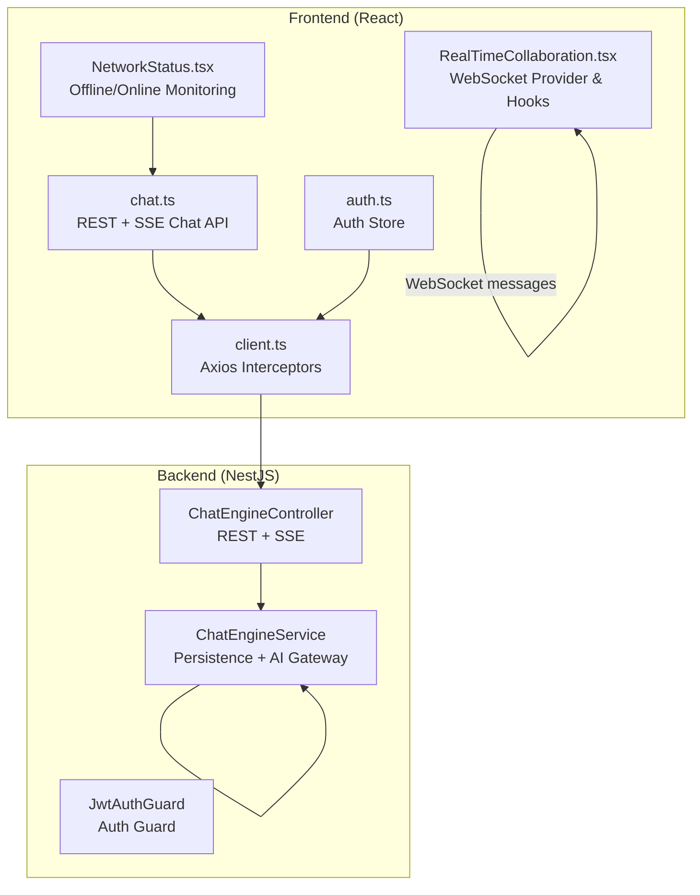
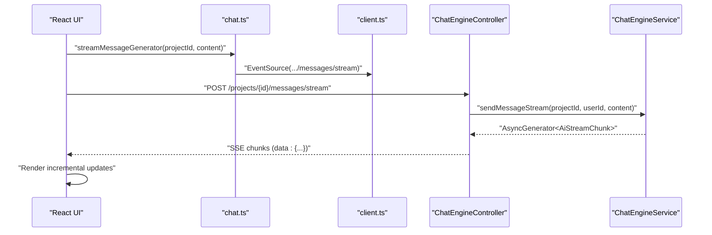
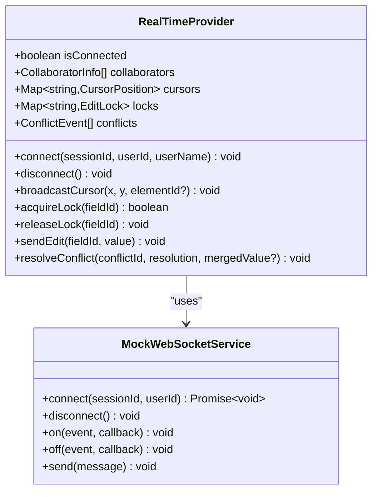
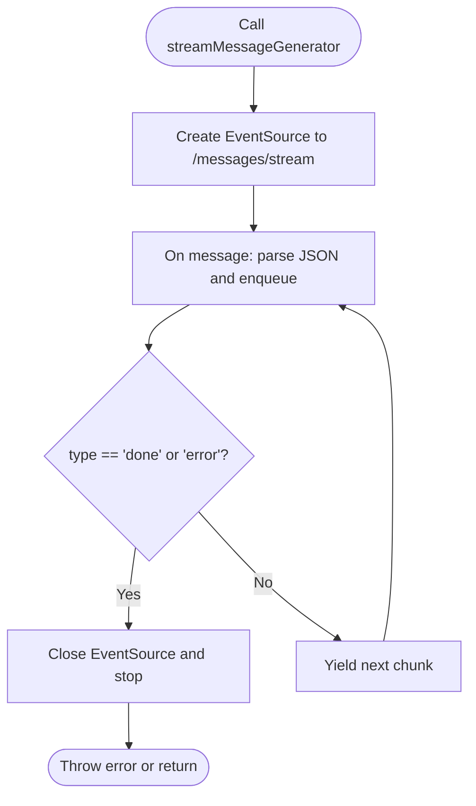
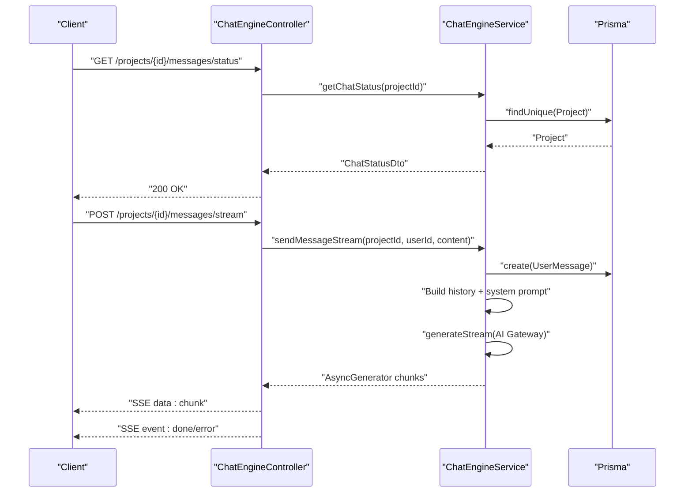
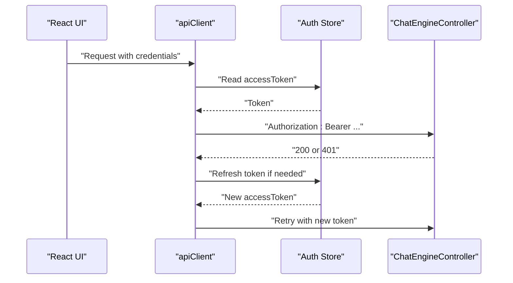
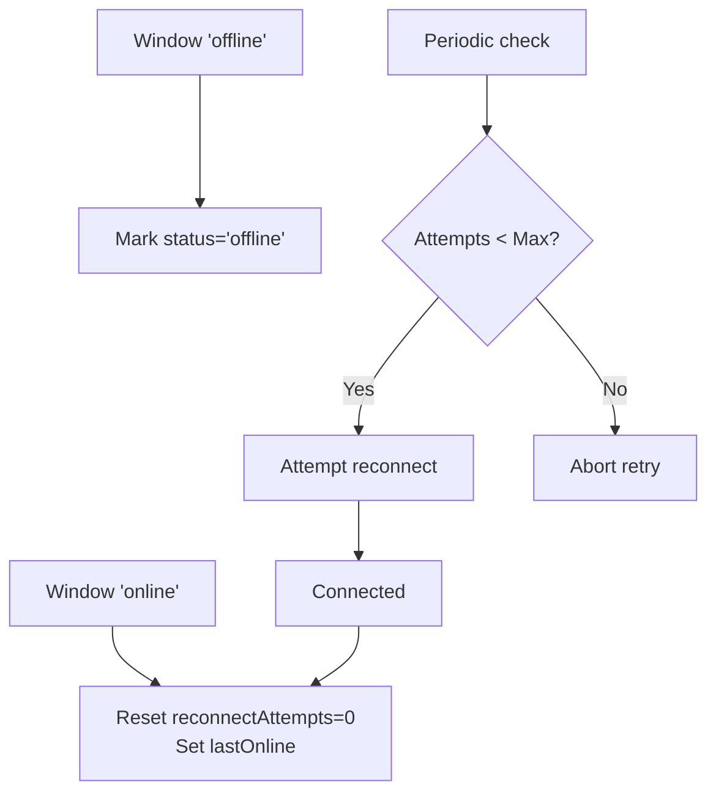
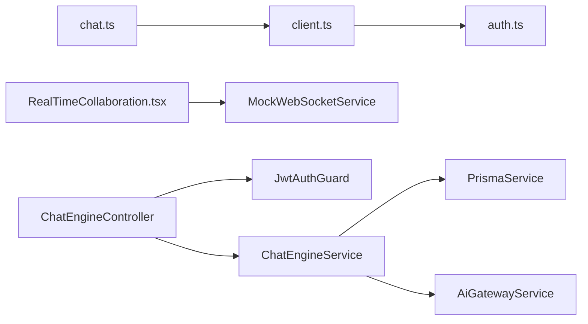

# Real-time Integration

<cite>
**Referenced Files in This Document**
- [chat-engine.controller.ts](file://apps/api/src/modules/chat-engine/chat-engine.controller.ts)
- [chat-engine.service.ts](file://apps/api/src/modules/chat-engine/chat-engine.service.ts)
- [chat.ts](file://apps/web/src/api/chat.ts)
- [client.ts](file://apps/web/src/api/client.ts)
- [RealTimeCollaboration.tsx](file://apps/web/src/components/collaboration/RealTimeCollaboration.tsx)
- [auth.ts](file://apps/web/src/stores/auth.ts)
- [jwt-auth.guard.ts](file://apps/api/src/modules/auth/guards/jwt-auth.guard.ts)
- [conversation.ts](file://apps/web/src/api/conversation.ts)
- [NetworkStatus.tsx](file://apps/web/src/components/ux/NetworkStatus.tsx)
</cite>

## Table of Contents
1. [Introduction](#introduction)
2. [Project Structure](#project-structure)
3. [Core Components](#core-components)
4. [Architecture Overview](#architecture-overview)
5. [Detailed Component Analysis](#detailed-component-analysis)
6. [Dependency Analysis](#dependency-analysis)
7. [Performance Considerations](#performance-considerations)
8. [Troubleshooting Guide](#troubleshooting-guide)
9. [Conclusion](#conclusion)

## Introduction
This document explains the real-time communication integration for the Quiz-to-Build platform, focusing on WebSocket-based collaboration and REST/SSE-based chat. It covers the WebSocket client implementation, connection management, message handling patterns, conversation service integration, real-time updates for chat functionality, collaborative features, connection retry logic, error recovery mechanisms, connection state management, integration with React hooks for real-time data synchronization, examples of WebSocket event handling, message queuing, offline reconnection strategies, and the relationship with authentication and authorization for secure real-time communication.

## Project Structure
The real-time integration spans the frontend React application and the NestJS backend:
- Frontend (React):
  - WebSocket collaboration provider and hooks
  - Chat API client with SSE streaming
  - Authentication store and API client with interceptors
  - Network status monitoring for offline reconnection
- Backend (NestJS):
  - Chat engine controller exposing REST and SSE endpoints
  - Chat engine service implementing message persistence, AI gateway integration, and streaming logic
  - JWT guard for authentication and authorization

**Diagram sources**
- [RealTimeCollaboration.tsx:172-434](file://apps/web/src/components/collaboration/RealTimeCollaboration.tsx#L172-L434)
- [chat.ts:158-167](file://apps/web/src/api/chat.ts#L158-L167)
- [client.ts:95-326](file://apps/web/src/api/client.ts#L95-L326)
- [chat-engine.controller.ts:20-130](file://apps/api/src/modules/chat-engine/chat-engine.controller.ts#L20-L130)
- [chat-engine.service.ts:20-349](file://apps/api/src/modules/chat-engine/chat-engine.service.ts#L20-L349)
- [jwt-auth.guard.ts:14-64](file://apps/api/src/modules/auth/guards/jwt-auth.guard.ts#L14-L64)
- [auth.ts:54-173](file://apps/web/src/stores/auth.ts#L54-L173)
- [NetworkStatus.tsx:145-173](file://apps/web/src/components/ux/NetworkStatus.tsx#L145-L173)

**Section sources**
- [RealTimeCollaboration.tsx:1-809](file://apps/web/src/components/collaboration/RealTimeCollaboration.tsx#L1-L809)
- [chat.ts:1-167](file://apps/web/src/api/chat.ts#L1-L167)
- [client.ts:1-326](file://apps/web/src/api/client.ts#L1-L326)
- [chat-engine.controller.ts:1-130](file://apps/api/src/modules/chat-engine/chat-engine.controller.ts#L1-L130)
- [chat-engine.service.ts:1-349](file://apps/api/src/modules/chat-engine/chat-engine.service.ts#L1-L349)
- [jwt-auth.guard.ts:1-64](file://apps/api/src/modules/auth/guards/jwt-auth.guard.ts#L1-L64)
- [auth.ts:1-173](file://apps/web/src/stores/auth.ts#L1-L173)
- [NetworkStatus.tsx:145-173](file://apps/web/src/components/ux/NetworkStatus.tsx#L145-L173)

## Core Components
- WebSocket Collaboration Provider (React)
  - Manages connection lifecycle, presence, cursors, locks, and conflicts
  - Emits typed collaboration messages and applies incoming updates to React state
- Chat API Client (React)
  - REST endpoints for chat status and history
  - SSE streaming with EventSource and async generator helpers
- Backend Chat Engine (NestJS)
  - REST endpoints guarded by JWT
  - SSE streaming endpoint emitting AI response chunks
  - Persistence and AI gateway integration with usage/cost tracking
- Authentication and Authorization
  - JWT guard for protected routes
  - Auth store with token refresh and CSRF handling

**Section sources**
- [RealTimeCollaboration.tsx:172-434](file://apps/web/src/components/collaboration/RealTimeCollaboration.tsx#L172-L434)
- [chat.ts:49-167](file://apps/web/src/api/chat.ts#L49-L167)
- [chat-engine.controller.ts:20-130](file://apps/api/src/modules/chat-engine/chat-engine.controller.ts#L20-L130)
- [chat-engine.service.ts:20-349](file://apps/api/src/modules/chat-engine/chat-engine.service.ts#L20-L349)
- [jwt-auth.guard.ts:14-64](file://apps/api/src/modules/auth/guards/jwt-auth.guard.ts#L14-L64)
- [auth.ts:54-173](file://apps/web/src/stores/auth.ts#L54-L173)

## Architecture Overview
The system integrates two complementary real-time mechanisms:
- REST + SSE for chat conversations
- WebSocket for collaborative editing (presence, cursors, locks, conflicts)

**Diagram sources**
- [chat.ts:80-167](file://apps/web/src/api/chat.ts#L80-L167)
- [client.ts:95-326](file://apps/web/src/api/client.ts#L95-L326)
- [chat-engine.controller.ts:72-115](file://apps/api/src/modules/chat-engine/chat-engine.controller.ts#L72-L115)
- [chat-engine.service.ts:187-303](file://apps/api/src/modules/chat-engine/chat-engine.service.ts#L187-L303)

## Detailed Component Analysis

### WebSocket Client Implementation and Collaboration Provider
The collaboration provider encapsulates:
- Connection management: connect/disconnect, presence broadcasting
- Real-time updates: join/leave, cursor movement, locks, edits
- Conflict resolution: modal-driven resolution with local/remote/merge options
- React hooks: useRealTime, PresenceBar, RemoteCursors, FieldLockIndicator, ConflictResolver, TypingIndicator, useCollaborativeInput

**Diagram sources**
- [RealTimeCollaboration.tsx:172-434](file://apps/web/src/components/collaboration/RealTimeCollaboration.tsx#L172-L434)
- [RealTimeCollaboration.tsx:101-145](file://apps/web/src/components/collaboration/RealTimeCollaboration.tsx#L101-L145)

Key behaviors:
- Presence and cursors are throttled and cleaned up periodically
- Locks expire after a fixed interval and are released on disconnect
- Conflict resolution persists resolution state locally

**Section sources**
- [RealTimeCollaboration.tsx:172-434](file://apps/web/src/components/collaboration/RealTimeCollaboration.tsx#L172-L434)
- [RealTimeCollaboration.tsx:101-145](file://apps/web/src/components/collaboration/RealTimeCollaboration.tsx#L101-L145)

### Chat API Client and SSE Streaming
The chat API exposes:
- Status and history retrieval
- Non-streaming send
- Streaming send via SSE with EventSource and async generator

**Diagram sources**
- [chat.ts:100-167](file://apps/web/src/api/chat.ts#L100-L167)

**Section sources**
- [chat.ts:49-167](file://apps/web/src/api/chat.ts#L49-L167)

### Backend Chat Engine Controller and Service
The backend enforces:
- JWT-protected endpoints
- Chat status checks and message limits
- Streaming responses with SSE
- Persistence of user and assistant messages
- AI gateway integration with usage/cost metadata

**Diagram sources**
- [chat-engine.controller.ts:28-115](file://apps/api/src/modules/chat-engine/chat-engine.controller.ts#L28-L115)
- [chat-engine.service.ts:87-303](file://apps/api/src/modules/chat-engine/chat-engine.service.ts#L87-L303)

**Section sources**
- [chat-engine.controller.ts:20-130](file://apps/api/src/modules/chat-engine/chat-engine.controller.ts#L20-L130)
- [chat-engine.service.ts:20-349](file://apps/api/src/modules/chat-engine/chat-engine.service.ts#L20-L349)

### Authentication and Authorization for Real-time
- JWT guard protects chat endpoints
- Axios interceptors attach Bearer tokens and CSRF tokens
- Auth store manages tokens, refreshes, and hydration
- CSRF token initialization and refresh on 403 errors

**Diagram sources**
- [client.ts:160-326](file://apps/web/src/api/client.ts#L160-L326)
- [auth.ts:54-173](file://apps/web/src/stores/auth.ts#L54-L173)
- [jwt-auth.guard.ts:14-64](file://apps/api/src/modules/auth/guards/jwt-auth.guard.ts#L14-L64)

**Section sources**
- [client.ts:95-326](file://apps/web/src/api/client.ts#L95-L326)
- [auth.ts:54-173](file://apps/web/src/stores/auth.ts#L54-L173)
- [jwt-auth.guard.ts:14-64](file://apps/api/src/modules/auth/guards/jwt-auth.guard.ts#L14-L64)

### Conversation Service Integration
The conversation API complements chat by enabling follow-ups and retrieving conversation history for sessions. While not WebSocket-based, it integrates with the same authentication and API client patterns.

**Section sources**
- [conversation.ts:1-85](file://apps/web/src/api/conversation.ts#L1-L85)

### Connection Retry Logic and Offline Reconnection
- Network status monitoring detects online/offline transitions
- Reconnection attempts are reset on online events
- Pending requests tracking supports retry strategies
- SSE streaming closes on errors and relies on application-level retry

**Diagram sources**
- [NetworkStatus.tsx:145-173](file://apps/web/src/components/ux/NetworkStatus.tsx#L145-L173)

**Section sources**
- [NetworkStatus.tsx:145-173](file://apps/web/src/components/ux/NetworkStatus.tsx#L145-L173)

### Message Queuing and Event Handling Patterns
- SSE message queue uses an internal buffer and promise-based consumer
- WebSocket mock service uses listener sets for event routing
- Collaboration messages are typed and handled via a central effect hook

**Section sources**
- [chat.ts:100-167](file://apps/web/src/api/chat.ts#L100-L167)
- [RealTimeCollaboration.tsx:101-145](file://apps/web/src/components/collaboration/RealTimeCollaboration.tsx#L101-L145)
- [RealTimeCollaboration.tsx:320-398](file://apps/web/src/components/collaboration/RealTimeCollaboration.tsx#L320-L398)

## Dependency Analysis
- Frontend depends on:
  - Axios client for authenticated requests and CSRF handling
  - Auth store for token lifecycle and hydration
  - React hooks for state synchronization
- Backend depends on:
  - JWT guard for route protection
  - Prisma for persistence
  - AI gateway service for streaming responses

**Diagram sources**
- [chat.ts:158-167](file://apps/web/src/api/chat.ts#L158-L167)
- [client.ts:95-326](file://apps/web/src/api/client.ts#L95-L326)
- [auth.ts:54-173](file://apps/web/src/stores/auth.ts#L54-L173)
- [RealTimeCollaboration.tsx:101-145](file://apps/web/src/components/collaboration/RealTimeCollaboration.tsx#L101-L145)
- [chat-engine.controller.ts:20-130](file://apps/api/src/modules/chat-engine/chat-engine.controller.ts#L20-L130)
- [chat-engine.service.ts:20-349](file://apps/api/src/modules/chat-engine/chat-engine.service.ts#L20-L349)
- [jwt-auth.guard.ts:14-64](file://apps/api/src/modules/auth/guards/jwt-auth.guard.ts#L14-L64)

**Section sources**
- [chat.ts:158-167](file://apps/web/src/api/chat.ts#L158-L167)
- [client.ts:95-326](file://apps/web/src/api/client.ts#L95-L326)
- [auth.ts:54-173](file://apps/web/src/stores/auth.ts#L54-L173)
- [RealTimeCollaboration.tsx:101-145](file://apps/web/src/components/collaboration/RealTimeCollaboration.tsx#L101-L145)
- [chat-engine.controller.ts:20-130](file://apps/api/src/modules/chat-engine/chat-engine.controller.ts#L20-L130)
- [chat-engine.service.ts:20-349](file://apps/api/src/modules/chat-engine/chat-engine.service.ts#L20-L349)
- [jwt-auth.guard.ts:14-64](file://apps/api/src/modules/auth/guards/jwt-auth.guard.ts#L14-L64)

## Performance Considerations
- SSE streaming minimizes latency by sending incremental chunks
- WebSocket collaboration throttles cursor broadcasts to reduce traffic
- Presence cleanup removes stale cursors to control memory growth
- Backend limits message counts and approaches limit with contextual prompts

## Troubleshooting Guide
Common issues and resolutions:
- 401 Unauthorized on chat requests
  - Ensure access token is present and refreshed
  - Verify JWT guard activation on protected routes
- 403 CSRF token errors
  - Initialize CSRF token on startup and retry on 403
- SSE connection errors
  - Close EventSource on error and implement application-level retry
- WebSocket connection not established
  - Confirm provider is mounted and connect invoked with valid session/user identifiers
- Offline reconnection loops
  - Limit retry attempts and reset on online events

**Section sources**
- [client.ts:200-326](file://apps/web/src/api/client.ts#L200-L326)
- [chat-engine.controller.ts:72-115](file://apps/api/src/modules/chat-engine/chat-engine.controller.ts#L72-L115)
- [RealTimeCollaboration.tsx:172-229](file://apps/web/src/components/collaboration/RealTimeCollaboration.tsx#L172-L229)
- [NetworkStatus.tsx:145-173](file://apps/web/src/components/ux/NetworkStatus.tsx#L145-L173)

## Conclusion
The real-time integration combines REST/SSE for chat and WebSocket for collaboration, secured by JWT and CSRF protections. The frontend provides robust connection management, message queuing, and React hooks for seamless UI updates. The backend enforces limits, persists messages, and streams AI responses with usage/cost metadata. Together, these patterns deliver responsive, collaborative, and secure real-time experiences.