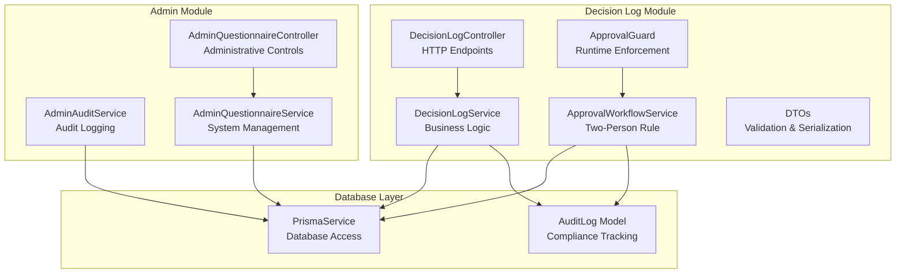
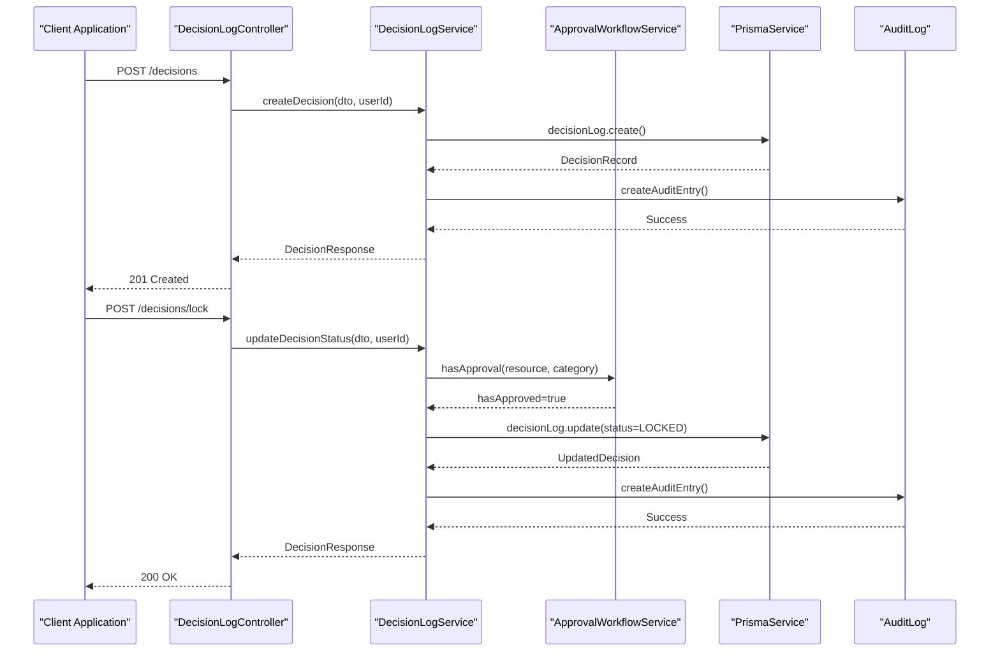
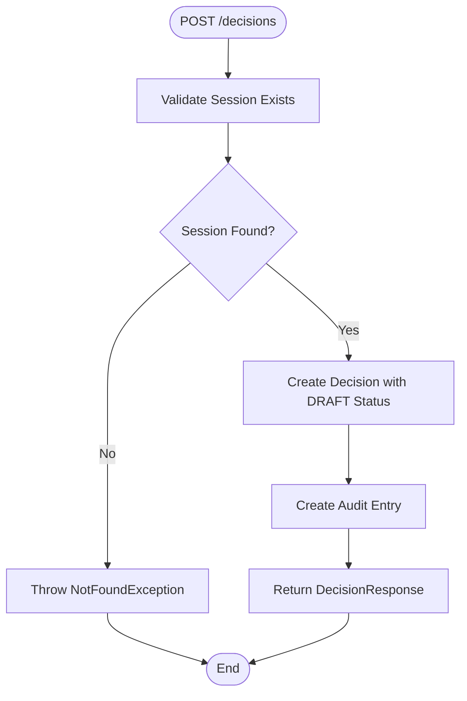
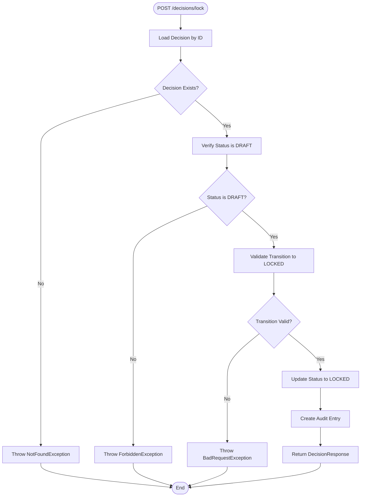
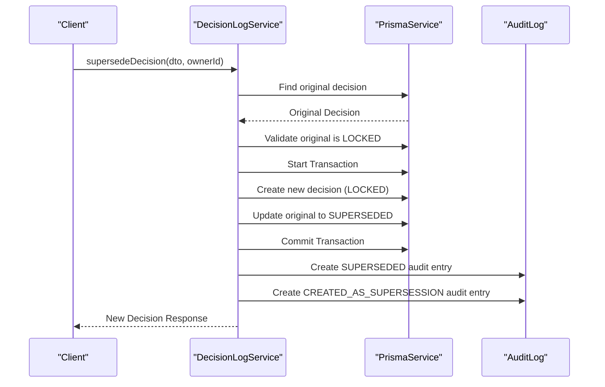
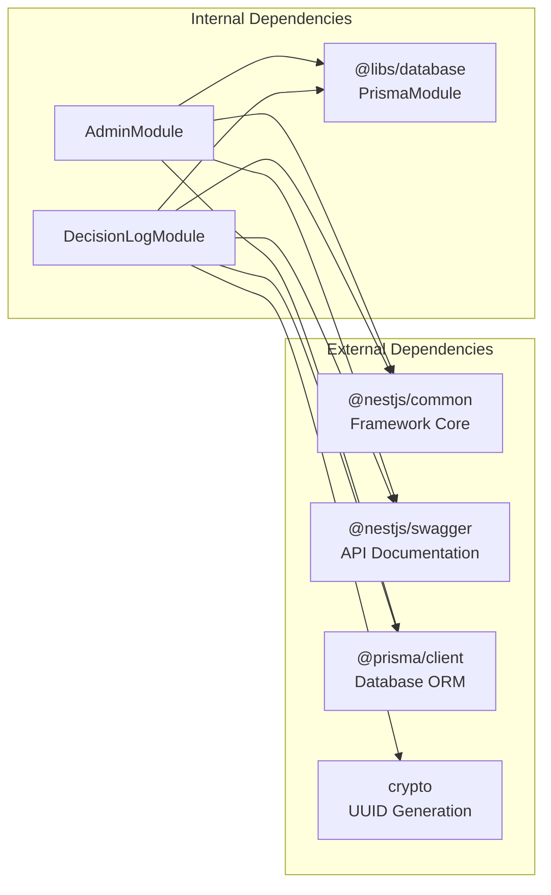

# Decisions Service

<cite>
**Referenced Files in This Document**
- [decision-log.module.ts](file://apps/api/src/modules/decision-log/decision-log.module.ts)
- [decision-log.controller.ts](file://apps/api/src/modules/decision-log/decision-log.controller.ts)
- [decision-log.service.ts](file://apps/api/src/modules/decision-log/decision-log.service.ts)
- [approval-workflow.service.ts](file://apps/api/src/modules/decision-log/approval-workflow.service.ts)
- [decision.dto.ts](file://apps/api/src/modules/decision-log/dto/decision.dto.ts)
- [require-approval.decorator.ts](file://apps/api/src/modules/decision-log/decorators/require-approval.decorator.ts)
- [admin.module.ts](file://apps/api/src/modules/admin/admin.module.ts)
- [admin-questionnaire.controller.ts](file://apps/api/src/modules/admin/controllers/admin-questionnaire.controller.ts)
- [admin-audit.service.ts](file://apps/api/src/modules/admin/services/admin-audit.service.ts)
- [admin-questionnaire.service.ts](file://apps/api/src/modules/admin/services/admin-questionnaire.service.ts)
</cite>

## Table of Contents
1. [Introduction](#introduction)
2. [Project Structure](#project-structure)
3. [Core Components](#core-components)
4. [Architecture Overview](#architecture-overview)
5. [Detailed Component Analysis](#detailed-component-analysis)
6. [Dependency Analysis](#dependency-analysis)
7. [Performance Considerations](#performance-considerations)
8. [Troubleshooting Guide](#troubleshooting-guide)
9. [Conclusion](#conclusion)

## Introduction
The Decisions Service implements Quiz2Biz's append-only forensic decision record system with integrated two-person approval workflows. It provides a complete lifecycle for managing decisions: creation, locking, supersession, and audit export. The service enforces strict append-only semantics where decisions become immutable once locked, with supersession as the only permitted amendment mechanism. Approval workflows enforce mandatory peer review for high-risk operations through configurable categories and role-based permissions.

## Project Structure
The Decisions Service is organized as a NestJS module with clear separation of concerns:



**Diagram sources**
- [decision-log.module.ts:18-24](file://apps/api/src/modules/decision-log/decision-log.module.ts#L18-L24)
- [decision-log.controller.ts:36-40](file://apps/api/src/modules/decision-log/decision-log.controller.ts#L36-L40)
- [approval-workflow.service.ts:89-99](file://apps/api/src/modules/decision-log/approval-workflow.service.ts#L89-L99)

**Section sources**
- [decision-log.module.ts:1-25](file://apps/api/src/modules/decision-log/decision-log.module.ts#L1-L25)
- [decision-log.controller.ts:27-40](file://apps/api/src/modules/decision-log/decision-log.controller.ts#L27-L40)

## Core Components
The Decisions Service consists of three primary components working in concert:

### DecisionLogService
Implements the append-only decision lifecycle with strict state transitions:
- **DRAFT**: Initial state, fully editable until locking
- **LOCKED**: Immutable state, cannot be modified or deleted
- **SUPERSEDED**: Replaced by newer decisions, marked as superseded
- **AMENDED**: Content was amended via supersession process

### ApprovalWorkflowService  
Enforces two-person rule through configurable approval categories:
- **POLICY_LOCK**: Policy document locks requiring ADMIN/SUPER_ADMIN approval
- **ADR_APPROVAL**: Architectural Decision Records requiring developer/manager approval
- **HIGH_RISK_DECISION**: High-impact decisions requiring peer review
- **SECURITY_EXCEPTION**: Security exceptions requiring explicit approval
- **DATA_ACCESS**: Data access requests requiring administrative approval

### DecisionLogController
Provides RESTful endpoints for decision management with comprehensive validation and error handling.

**Section sources**
- [decision-log.service.ts:19-36](file://apps/api/src/modules/decision-log/decision-log.service.ts#L19-L36)
- [approval-workflow.service.ts:12-31](file://apps/api/src/modules/decision-log/approval-workflow.service.ts#L12-L31)
- [decision-log.controller.ts:27-40](file://apps/api/src/modules/decision-log/decision-log.controller.ts#L27-L40)

## Architecture Overview
The Decisions Service follows a layered architecture with clear separation between presentation, business logic, and persistence layers:



**Diagram sources**
- [decision-log.controller.ts:61-66](file://apps/api/src/modules/decision-log/decision-log.controller.ts#L61-L66)
- [decision-log.service.ts:49-74](file://apps/api/src/modules/decision-log/decision-log.service.ts#L49-L74)
- [approval-workflow.service.ts:307-331](file://apps/api/src/modules/decision-log/approval-workflow.service.ts#L307-L331)

The architecture enforces several key principles:
- **Append-only enforcement**: Once locked, decisions cannot be modified
- **Supersession pattern**: Only way to amend locked decisions
- **Two-person rule**: Mandatory peer review for high-risk operations
- **Full audit trail**: Complete compliance tracking for all operations

## Detailed Component Analysis

### Decision Management Endpoints
The DecisionLogController exposes comprehensive endpoints for decision lifecycle management:

#### Creation Endpoint


**Diagram sources**
- [decision-log.controller.ts:61-66](file://apps/api/src/modules/decision-log/decision-log.controller.ts#L61-L66)
- [decision-log.service.ts:49-74](file://apps/api/src/modules/decision-log/decision-log.service.ts#L49-L74)

#### Status Update Endpoint


**Diagram sources**
- [decision-log.controller.ts:93-98](file://apps/api/src/modules/decision-log/decision-log.controller.ts#L93-L98)
- [decision-log.service.ts:87-123](file://apps/api/src/modules/decision-log/decision-log.service.ts#L87-L123)

#### Supersession Process
The supersession mechanism handles decision amendments through a controlled process:



**Diagram sources**
- [decision-log.service.ts:135-188](file://apps/api/src/modules/decision-log/decision-log.service.ts#L135-L188)
- [decision-log.service.ts:151-173](file://apps/api/src/modules/decision-log/decision-log.service.ts#L151-L173)

**Section sources**
- [decision-log.controller.ts:43-98](file://apps/api/src/modules/decision-log/decision-log.controller.ts#L43-L98)
- [decision-log.controller.ts:124-156](file://apps/api/src/modules/decision-log/decision-log.controller.ts#L124-L156)
- [decision-log.controller.ts:158-277](file://apps/api/src/modules/decision-log/decision-log.controller.ts#L158-L277)

### Approval Workflow Integration
The two-person rule enforcement integrates seamlessly with decision operations:

#### Approval Categories and Permissions
| Category | Purpose | Required Roles | Automatic Action |
|----------|---------|----------------|------------------|
| POLICY_LOCK | Policy document locks | ADMIN, SUPER_ADMIN | None |
| ADR_APPROVAL | Architectural decisions | DEVELOPER, ADMIN, SUPER_ADMIN | None |
| HIGH_RISK_DECISION | High-impact decisions | DEVELOPER, ADMIN, SUPER_ADMIN | Lock decision |
| SECURITY_EXCEPTION | Security exceptions | ADMIN, SUPER_ADMIN | None |
| DATA_ACCESS | Data access requests | ADMIN, SUPER_ADMIN | None |

#### Approval Lifecycle
```mermaid
stateDiagram-v2
[*] --> PENDING
PENDING --> APPROVED : Peer Approves
PENDING --> REJECTED : Peer Rejects
PENDING --> EXPIRED : Timeout
APPROVED --> [*]
REJECTED --> [*]
EXPIRED --> [*]
note right of PENDING : Expiration : 72 hours default
note right of APPROVED : May trigger automatic action
note right of REJECTED : Requires new approval request
```

**Diagram sources**
- [approval-workflow.service.ts:26-31](file://apps/api/src/modules/decision-log/approval-workflow.service.ts#L26-L31)
- [approval-workflow.service.ts:93-94](file://apps/api/src/modules/decision-log/approval-workflow.service.ts#L93-L94)

**Section sources**
- [approval-workflow.service.ts:15-31](file://apps/api/src/modules/decision-log/approval-workflow.service.ts#L15-L31)
- [approval-workflow.service.ts:172-243](file://apps/api/src/modules/decision-log/approval-workflow.service.ts#L172-L243)

### Administrative Controls
The Admin Module provides oversight capabilities for decision management:

#### Administrative Endpoints
- **List Questionnaires**: Paginated retrieval of all questionnaires
- **Create/Update/Delete Questionnaires**: Full CRUD operations with soft deletion
- **Section Management**: Create, update, reorder, and delete sections
- **Question Management**: Comprehensive question CRUD with validation
- **Visibility Rules**: Dynamic form logic management

#### Audit and Compliance
The Admin Audit Service maintains comprehensive logs of all administrative actions with request metadata capture for full traceability.

**Section sources**
- [admin-questionnaire.controller.ts:46-107](file://apps/api/src/modules/admin/controllers/admin-questionnaire.controller.ts#L46-L107)
- [admin-audit.service.ts:21-44](file://apps/api/src/modules/admin/services/admin-audit.service.ts#L21-L44)

## Dependency Analysis
The Decisions Service exhibits clean architectural boundaries with minimal coupling:



**Diagram sources**
- [decision-log.module.ts:6](file://apps/api/src/modules/decision-log/decision-log.module.ts#L6)
- [admin.module.ts:2](file://apps/api/src/modules/admin/admin.module.ts#L2)

Key dependency characteristics:
- **Low coupling**: Services depend only on PrismaService interface
- **High cohesion**: Related functionality grouped within modules
- **Clear boundaries**: Decision and admin concerns separated
- **Testability**: Services designed for easy unit testing

**Section sources**
- [decision-log.module.ts:18-24](file://apps/api/src/modules/decision-log/decision-log.module.ts#L18-L24)
- [admin.module.ts:7-13](file://apps/api/src/modules/admin/admin.module.ts#L7-L13)

## Performance Considerations
The Decisions Service is optimized for compliance-first operations:

### Database Design Optimizations
- **Indexing Strategy**: Primary keys on decisionLog, auditLog tables
- **Query Patterns**: Optimized for common operations (by sessionId, status)
- **Transaction Usage**: Critical operations wrapped in atomic transactions
- **Pagination**: Built-in limits (1000 records per query) prevent memory issues

### Caching Strategy
- **In-memory approvals**: Temporary approval requests stored in memory
- **Database persistence**: Audit trails and decision records persisted
- **Expiration handling**: Automatic cleanup of expired approval requests

### Scalability Considerations
- **Horizontal scaling**: Stateless services support load balancing
- **Database connections**: Prisma connection pooling
- **Audit overhead**: Minimal impact on decision operations

## Troubleshooting Guide

### Common Error Scenarios

#### Decision State Validation Errors
| Error Type | Cause | Solution |
|------------|-------|----------|
| **ForbiddenException (DRAFT required)** | Attempting to lock non-DRAFT decision | Verify decision status before lock operation |
| **BadRequestException (invalid transition)** | Using invalid status value | Use only LOCKED for status updates |
| **ForbiddenException (non-DRAFT delete)** | Attempting to delete non-DRAFT decision | Use supersession instead of deletion |

#### Approval Workflow Errors
| Error Type | Cause | Solution |
|------------|-------|----------|
| **ForbiddenException (two-person rule)** | No approved approval found | Submit approval request before operation |
| **BadRequestException (already processed)** | Approval already approved/rejected | Check approval status before responding |
| **ForbiddenException (insufficient permissions)** | Approver lacks required role | Assign approver with proper role |
| **BadRequestException (expired)** | Approval timeout exceeded | Resubmit approval request |

#### Database Integrity Errors
| Error Type | Cause | Solution |
|------------|-------|----------|
| **NotFoundException (decision/session)** | Resource not found | Verify IDs exist before operations |
| **BadRequestException (validation)** | DTO validation failed | Check input against DTO constraints |

### Debugging Strategies
1. **Enable audit logging**: All operations create audit entries
2. **Check approval status**: Use `hasApproval()` method to verify workflow state
3. **Validate resource existence**: Ensure dependent resources exist before operations
4. **Monitor transaction rollbacks**: Check for constraint violations

**Section sources**
- [decision-log.service.ts:95-110](file://apps/api/src/modules/decision-log/decision-log.service.ts#L95-L110)
- [approval-workflow.service.ts:172-243](file://apps/api/src/modules/decision-log/approval-workflow.service.ts#L172-L243)
- [require-approval.decorator.ts:112-123](file://apps/api/src/modules/decision-log/decorators/require-approval.decorator.ts#L112-L123)

## Conclusion
The Decisions Service provides a robust, compliance-focused solution for managing organizational decision-making processes. Its append-only design ensures immutable records, while the two-person approval workflow guarantees proper governance for high-risk operations. The modular architecture supports future enhancements while maintaining clear separation of concerns. The comprehensive audit trail and administrative controls enable full compliance monitoring and operational oversight.

Key strengths include:
- **Legal compliance**: Append-only records with full audit trail
- **Governance enforcement**: Mandatory peer review for high-risk decisions
- **Operational flexibility**: Supersession mechanism for controlled amendments
- **Administrative oversight**: Comprehensive management capabilities
- **Scalable design**: Modular architecture supporting growth

The service successfully balances operational efficiency with regulatory compliance, making it suitable for organizations requiring rigorous decision governance and audit capabilities.