# Projects Service

<cite>
**Referenced Files in This Document**
- [projects.ts](file://apps/web/src/api/projects.ts)
- [client.ts](file://apps/web/src/api/client.ts)
- [WorkspacePage.tsx](file://apps/web/src/pages/workspace/WorkspacePage.tsx)
- [projects.controller.ts](file://apps/api/src/modules/projects/projects.controller.ts)
- [projects.service.ts](file://apps/api/src/modules/projects/projects.service.ts)
- [project-response.dto.ts](file://apps/api/src/modules/projects/dto/project-response.dto.ts)
- [list-projects-query.dto.ts](file://apps/api/src/modules/projects/dto/list-projects-query.dto.ts)
- [api.ts](file://apps/web/src/types/api.ts)
- [api-types.ts](file://apps/web/src/types/api-types.ts)
- [vite.config.ts](file://apps/web/vite.config.ts)
- [ErrorBoundary.tsx](file://apps/web/src/components/ErrorBoundary.tsx)
</cite>

## Table of Contents
1. [Introduction](#introduction)
2. [Project Structure](#project-structure)
3. [Core Components](#core-components)
4. [Architecture Overview](#architecture-overview)
5. [Detailed Component Analysis](#detailed-component-analysis)
6. [Dependency Analysis](#dependency-analysis)
7. [Performance Considerations](#performance-considerations)
8. [Troubleshooting Guide](#troubleshooting-guide)
9. [Conclusion](#conclusion)

## Introduction
This document provides comprehensive documentation for the Projects Service module, covering the project management API endpoints, data models, pagination handling, and integration patterns. It explains how the frontend interacts with the backend via typed APIs, how error handling and optimistic updates are implemented, and how data flows between components. The focus areas include:
- Project management endpoints: getProjects, getProject, createProject, and archiveProject
- Project interface, request/response types, and pagination
- Integration with the API client and error handling patterns
- Optimistic updates and loading states
- Examples of CRUD operations, quality score retrieval, and project status management
- Relationship with project stores and component data flow

## Project Structure
The Projects Service spans both the frontend and backend:

- Frontend (Web Application):
  - API client and typed endpoints for project management
  - UI components that consume the API and manage state
  - Error boundaries and resilience utilities
- Backend (NestJS API):
  - Projects controller exposing REST endpoints
  - Projects service implementing business logic
  - DTOs for request/response typing and pagination

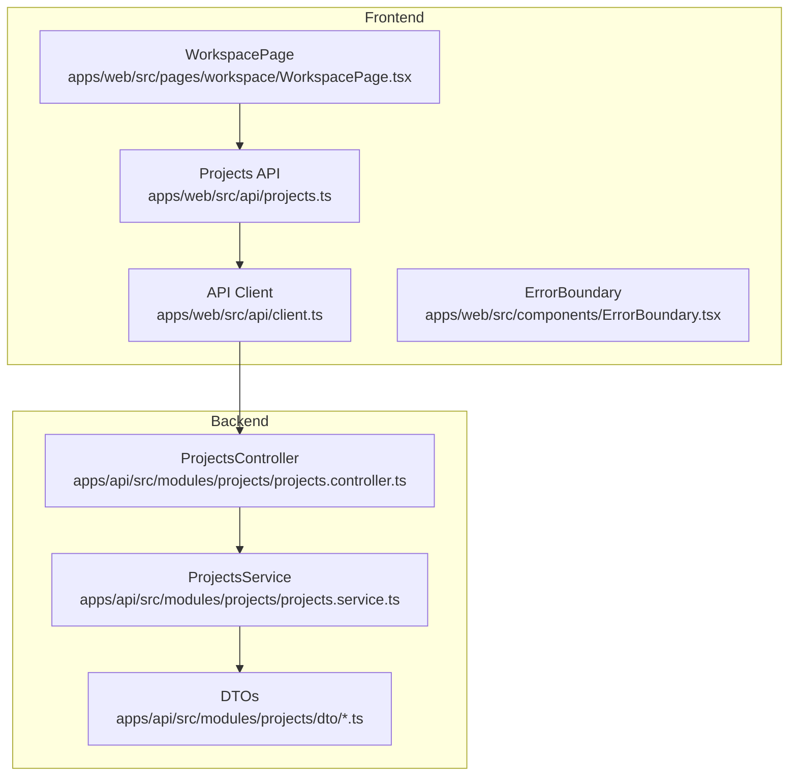

**Diagram sources**
- [client.ts:1-326](file://apps/web/src/api/client.ts#L1-L326)
- [projects.ts:1-93](file://apps/web/src/api/projects.ts#L1-L93)
- [WorkspacePage.tsx:1-376](file://apps/web/src/pages/workspace/WorkspacePage.tsx#L1-L376)
- [projects.controller.ts:1-147](file://apps/api/src/modules/projects/projects.controller.ts#L1-L147)
- [projects.service.ts:1-200](file://apps/api/src/modules/projects/projects.service.ts#L1-L200)
- [project-response.dto.ts:1-51](file://apps/api/src/modules/projects/dto/project-response.dto.ts#L1-L51)
- [list-projects-query.dto.ts:1-23](file://apps/api/src/modules/projects/dto/list-projects-query.dto.ts#L1-L23)

**Section sources**
- [projects.ts:1-93](file://apps/web/src/api/projects.ts#L1-L93)
- [client.ts:1-326](file://apps/web/src/api/client.ts#L1-L326)
- [WorkspacePage.tsx:1-376](file://apps/web/src/pages/workspace/WorkspacePage.tsx#L1-L376)
- [projects.controller.ts:1-147](file://apps/api/src/modules/projects/projects.controller.ts#L1-L147)
- [projects.service.ts:1-200](file://apps/api/src/modules/projects/projects.service.ts#L1-L200)
- [project-response.dto.ts:1-51](file://apps/api/src/modules/projects/dto/project-response.dto.ts#L1-L51)
- [list-projects-query.dto.ts:1-23](file://apps/api/src/modules/projects/dto/list-projects-query.dto.ts#L1-L23)

## Core Components
This section outlines the primary components involved in project management and their roles.

- Frontend API Layer
  - Typed project endpoints: getProjects, getProject, createProject, getProjectQualityScore, archiveProject
  - Project interface and request/response types
  - Pagination support via query parameters
- Backend API Layer
  - ProjectsController: exposes REST endpoints for listing, retrieving, creating, and updating projects
  - ProjectsService: implements business logic, validation, and mapping to DTOs
  - DTOs: strongly typed request/response models and pagination query DTO

Key responsibilities:
- Enforce organization scoping and access control
- Validate inputs and handle errors consistently
- Provide paginated project lists and individual project details
- Support project status updates and archival

**Section sources**
- [projects.ts:8-92](file://apps/web/src/api/projects.ts#L8-L92)
- [projects.controller.ts:68-145](file://apps/api/src/modules/projects/projects.controller.ts#L68-L145)
- [projects.service.ts:96-187](file://apps/api/src/modules/projects/projects.service.ts#L96-L187)
- [project-response.dto.ts:7-51](file://apps/api/src/modules/projects/dto/project-response.dto.ts#L7-L51)
- [list-projects-query.dto.ts:8-23](file://apps/api/src/modules/projects/dto/list-projects-query.dto.ts#L8-L23)

## Architecture Overview
The Projects Service follows a clean separation of concerns:
- Frontend constructs typed requests and manages UI state
- API client handles authentication, CSRF protection, and response normalization
- Backend validates and authorizes requests, performs business operations, and returns structured DTOs

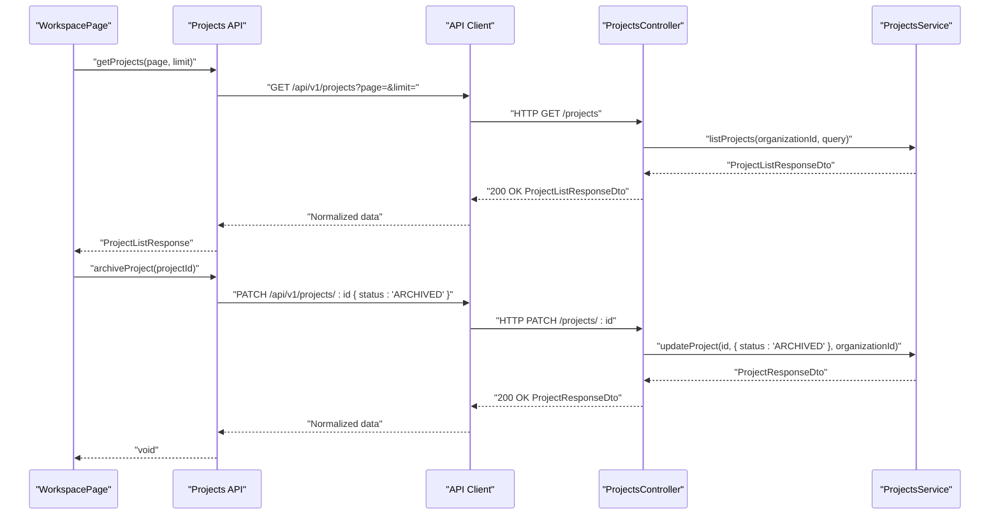

**Diagram sources**
- [WorkspacePage.tsx:195-223](file://apps/web/src/pages/workspace/WorkspacePage.tsx#L195-L223)
- [projects.ts:46-82](file://apps/web/src/api/projects.ts#L46-L82)
- [client.ts:161-198](file://apps/web/src/api/client.ts#L161-L198)
- [projects.controller.ts:68-145](file://apps/api/src/modules/projects/projects.controller.ts#L68-L145)
- [projects.service.ts:121-153](file://apps/api/src/modules/projects/projects.service.ts#L121-L153)

## Detailed Component Analysis

### Frontend API Client and Endpoints
The frontend defines typed endpoints for project management and integrates with an Axios-based API client that handles authentication and CSRF protection.

- Project types and interfaces
  - Project: core project entity with status, counts, timestamps, and optional quality score
  - ProjectListResponse: paginated list with items and total count
  - CreateProjectRequest: request payload for creation
  - ProjectQualityScore: quality metrics for a project
- Endpoints
  - getProjects(page, limit): retrieves paginated projects
  - getProject(projectId): retrieves a single project
  - createProject(request): creates a new project
  - getProjectQualityScore(projectId): retrieves quality metrics
  - archiveProject(projectId): updates project status to ARCHIVED

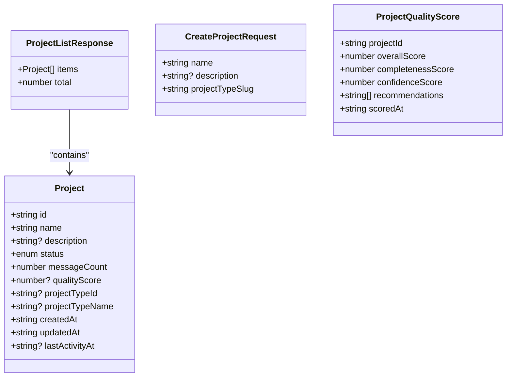

**Diagram sources**
- [projects.ts:9-41](file://apps/web/src/api/projects.ts#L9-L41)

**Section sources**
- [projects.ts:8-92](file://apps/web/src/api/projects.ts#L8-L92)
- [api.ts:11-21](file://apps/web/src/types/api.ts#L11-L21)
- [api-types.ts:137-145](file://apps/web/src/types/api-types.ts#L137-L145)

### Backend Controller and Service
The backend enforces organization scoping and access control, validates inputs, and maps domain entities to DTOs.

- ProjectsController
  - listProjects: paginated listing with query DTO validation
  - getProject: single project retrieval with organization scoping
  - createProject: project creation with organization and user context
  - updateProject: partial updates (name, description, status) with validation
- ProjectsService
  - Implements business logic for listing, retrieving, creating, and updating
  - Maps Prisma entities to response DTOs
  - Handles not-found and forbidden scenarios

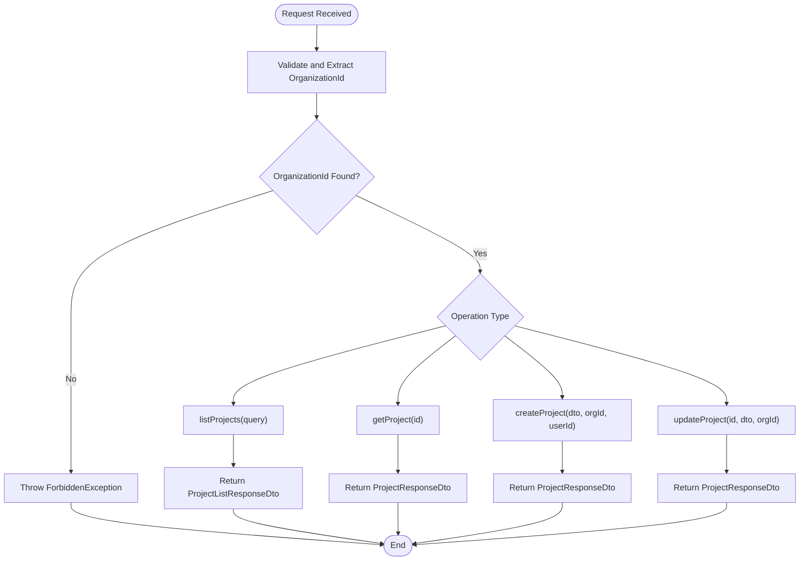

**Diagram sources**
- [projects.controller.ts:53-145](file://apps/api/src/modules/projects/projects.controller.ts#L53-L145)
- [projects.service.ts:96-187](file://apps/api/src/modules/projects/projects.service.ts#L96-L187)
- [project-response.dto.ts:7-51](file://apps/api/src/modules/projects/dto/project-response.dto.ts#L7-L51)
- [list-projects-query.dto.ts:8-23](file://apps/api/src/modules/projects/dto/list-projects-query.dto.ts#L8-L23)

**Section sources**
- [projects.controller.ts:68-145](file://apps/api/src/modules/projects/projects.controller.ts#L68-L145)
- [projects.service.ts:96-187](file://apps/api/src/modules/projects/projects.service.ts#L96-L187)
- [project-response.dto.ts:7-51](file://apps/api/src/modules/projects/dto/project-response.dto.ts#L7-L51)
- [list-projects-query.dto.ts:8-23](file://apps/api/src/modules/projects/dto/list-projects-query.dto.ts#L8-L23)

### Pagination Handling
- Frontend
  - getProjects(page, limit) accepts pagination parameters and returns a ProjectListResponse
  - WorkspacePage demonstrates fetching a larger page size (100) to minimize subsequent loads
- Backend
  - ListProjectsQueryDto validates page and limit with minimum and maximum bounds
  - ProjectsController delegates pagination to ProjectsService

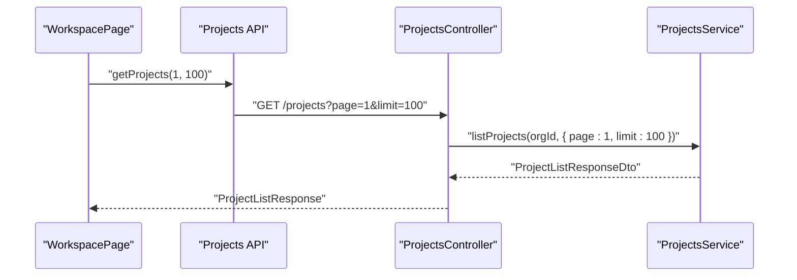

**Diagram sources**
- [WorkspacePage.tsx:199-200](file://apps/web/src/pages/workspace/WorkspacePage.tsx#L199-L200)
- [projects.ts:46-51](file://apps/web/src/api/projects.ts#L46-L51)
- [list-projects-query.dto.ts:8-23](file://apps/api/src/modules/projects/dto/list-projects-query.dto.ts#L8-L23)
- [projects.controller.ts:77-83](file://apps/api/src/modules/projects/projects.controller.ts#L77-L83)

**Section sources**
- [projects.ts:46-51](file://apps/web/src/api/projects.ts#L46-L51)
- [WorkspacePage.tsx:199-200](file://apps/web/src/pages/workspace/WorkspacePage.tsx#L199-L200)
- [list-projects-query.dto.ts:8-23](file://apps/api/src/modules/projects/dto/list-projects-query.dto.ts#L8-L23)
- [projects.controller.ts:77-83](file://apps/api/src/modules/projects/projects.controller.ts#L77-L83)

### Optimistic Updates and Loading States
- Optimistic Archival
  - WorkspacePage removes the project from the UI immediately upon archive action
  - On error, reverts the UI state to the previous list
- Loading and Error States
  - WorkspacePage tracks isLoading and error state during project loading
  - ErrorBoundary provides a fallback UI for unhandled errors

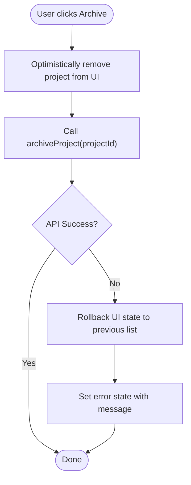

**Diagram sources**
- [WorkspacePage.tsx:212-223](file://apps/web/src/pages/workspace/WorkspacePage.tsx#L212-L223)

**Section sources**
- [WorkspacePage.tsx:195-223](file://apps/web/src/pages/workspace/WorkspacePage.tsx#L195-L223)
- [ErrorBoundary.tsx:13-71](file://apps/web/src/components/ErrorBoundary.tsx#L13-L71)

### API Contracts and Data Models
- Project entity fields include identifiers, metadata, counts, timestamps, and optional quality score
- ProjectListResponse wraps items and total count for pagination
- CreateProjectRequest requires name, optional description, and projectTypeSlug
- ProjectQualityScore includes overall, completeness, and confidence scores along with recommendations and timestamp

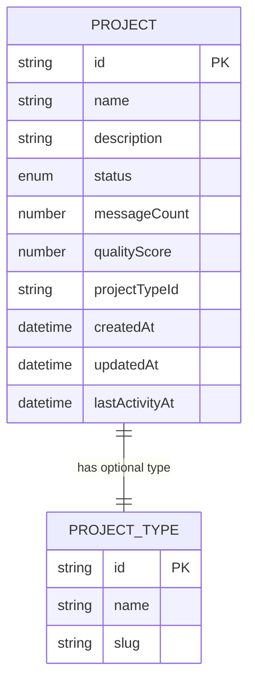

**Diagram sources**
- [projects.ts:9-21](file://apps/web/src/api/projects.ts#L9-L21)
- [project-response.dto.ts:7-39](file://apps/api/src/modules/projects/dto/project-response.dto.ts#L7-L39)

**Section sources**
- [projects.ts:9-41](file://apps/web/src/api/projects.ts#L9-L41)
- [project-response.dto.ts:7-51](file://apps/api/src/modules/projects/dto/project-response.dto.ts#L7-L51)

### Integration with API Client
- Authentication and CSRF
  - API client injects Authorization header and CSRF token for state-changing requests
  - Handles token refresh and CSRF token refresh on demand
- Response Normalization
  - Unwraps backend response wrapper to expose data directly
- Environment-aware Base URL
  - Resolves API base URL based on environment and explicit override

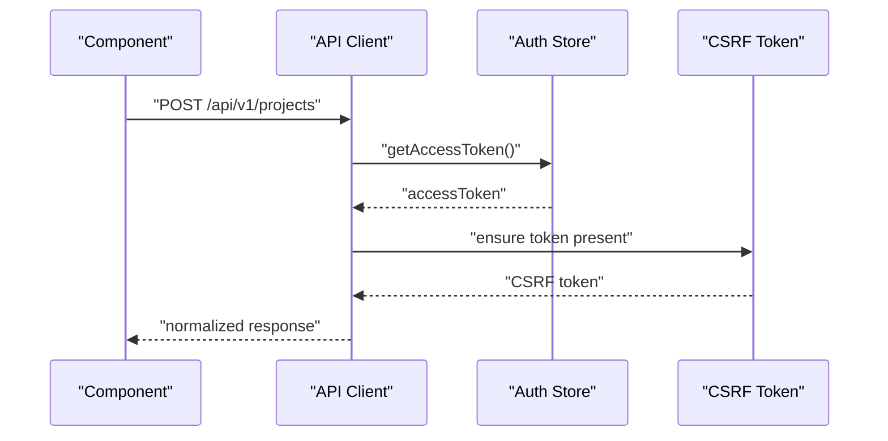

**Diagram sources**
- [client.ts:161-198](file://apps/web/src/api/client.ts#L161-L198)
- [client.ts:201-214](file://apps/web/src/api/client.ts#L201-L214)

**Section sources**
- [client.ts:1-326](file://apps/web/src/api/client.ts#L1-L326)

### Example Workflows

#### Create a New Project
- Endpoint: POST /api/v1/projects
- Request: CreateProjectRequest (name, description, projectTypeSlug)
- Response: Project (created project with initial status)

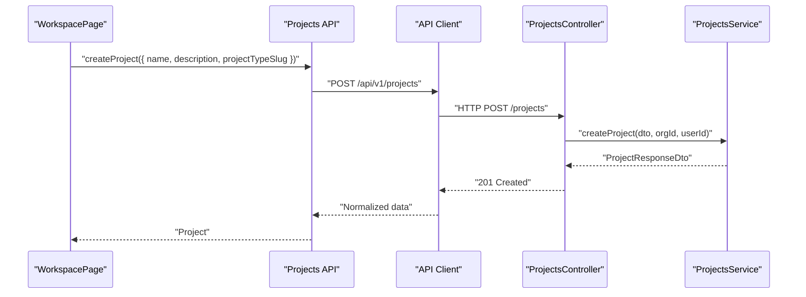

**Diagram sources**
- [projects.ts:64-67](file://apps/web/src/api/projects.ts#L64-L67)
- [projects.controller.ts:110-120](file://apps/api/src/modules/projects/projects.controller.ts#L110-L120)
- [projects.service.ts:96-116](file://apps/api/src/modules/projects/projects.service.ts#L96-L116)

#### Retrieve Project Quality Score
- Endpoint: GET /api/v1/quality/{projectId}/score
- Response: ProjectQualityScore (overall, completeness, confidence, recommendations)

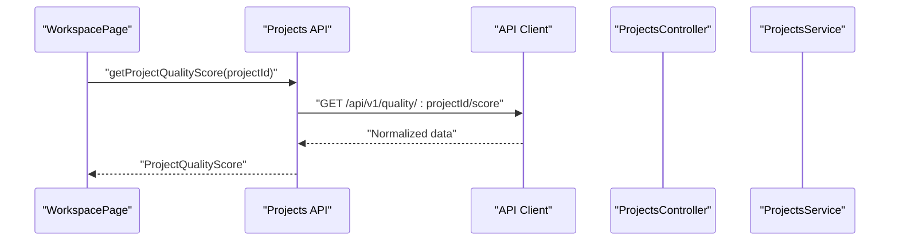

**Diagram sources**
- [projects.ts:72-75](file://apps/web/src/api/projects.ts#L72-L75)

#### Archive a Project (Optimistic Update)
- Endpoint: PATCH /api/v1/projects/{id} with { status: 'ARCHIVED' }
- UI behavior: Remove item optimistically, rollback on error

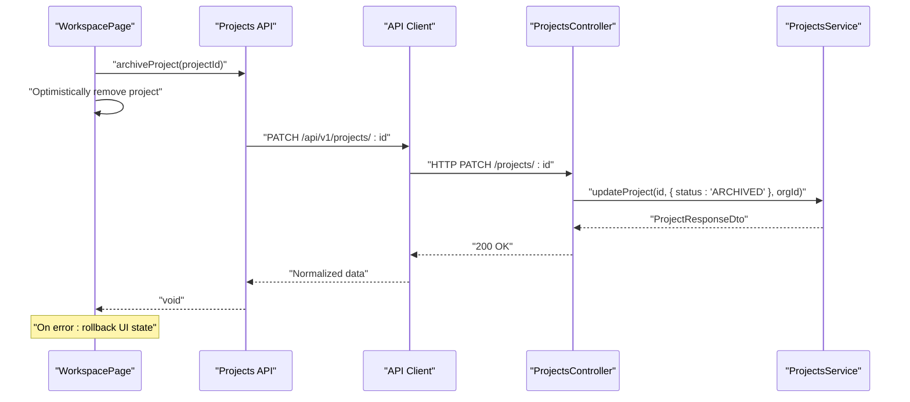

**Diagram sources**
- [WorkspacePage.tsx:212-223](file://apps/web/src/pages/workspace/WorkspacePage.tsx#L212-L223)
- [projects.ts:80-82](file://apps/web/src/api/projects.ts#L80-L82)
- [projects.controller.ts:134-145](file://apps/api/src/modules/projects/projects.controller.ts#L134-L145)
- [projects.service.ts:121-153](file://apps/api/src/modules/projects/projects.service.ts#L121-L153)

## Dependency Analysis
- Frontend dependencies
  - Projects API depends on the API client for HTTP communication and authentication
  - WorkspacePage consumes Projects API and manages UI state
- Backend dependencies
  - ProjectsController depends on ProjectsService and DTOs
  - ProjectsService interacts with Prisma for persistence and mapping

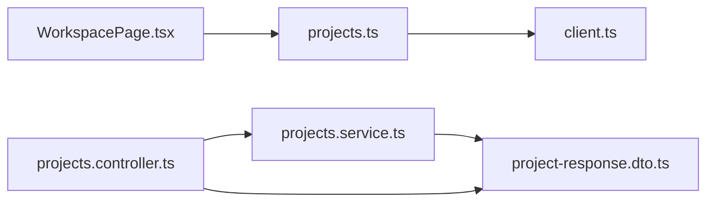

**Diagram sources**
- [WorkspacePage.tsx:1-376](file://apps/web/src/pages/workspace/WorkspacePage.tsx#L1-L376)
- [projects.ts:1-93](file://apps/web/src/api/projects.ts#L1-L93)
- [client.ts:1-326](file://apps/web/src/api/client.ts#L1-L326)
- [projects.controller.ts:1-147](file://apps/api/src/modules/projects/projects.controller.ts#L1-L147)
- [projects.service.ts:1-200](file://apps/api/src/modules/projects/projects.service.ts#L1-L200)
- [project-response.dto.ts:1-51](file://apps/api/src/modules/projects/dto/project-response.dto.ts#L1-L51)

**Section sources**
- [WorkspacePage.tsx:1-376](file://apps/web/src/pages/workspace/WorkspacePage.tsx#L1-L376)
- [projects.ts:1-93](file://apps/web/src/api/projects.ts#L1-L93)
- [client.ts:1-326](file://apps/web/src/api/client.ts#L1-L326)
- [projects.controller.ts:1-147](file://apps/api/src/modules/projects/projects.controller.ts#L1-L147)
- [projects.service.ts:1-200](file://apps/api/src/modules/projects/projects.service.ts#L1-L200)
- [project-response.dto.ts:1-51](file://apps/api/src/modules/projects/dto/project-response.dto.ts#L1-L51)

## Performance Considerations
- Pagination defaults and limits
  - Backend enforces minimum and maximum limits for safety
  - Frontend can request larger page sizes to reduce round trips
- Caching and retries
  - Consider integrating a caching layer or CDN for repeated reads of project lists
  - Implement retry strategies for transient failures
- Token and CSRF handling
  - API client minimizes overhead by reusing tokens and fetching CSRF tokens proactively
- Bundle splitting
  - Vite configuration splits vendor bundles including React Query to optimize loading

**Section sources**
- [list-projects-query.dto.ts:16-22](file://apps/api/src/modules/projects/dto/list-projects-query.dto.ts#L16-L22)
- [vite.config.ts:11-14](file://apps/web/vite.config.ts#L11-L14)

## Troubleshooting Guide
Common issues and resolutions:
- Authentication failures (401)
  - Ensure access token is present and up to date
  - Verify token refresh flow and retry logic
- CSRF token errors (403)
  - Confirm CSRF token is attached for state-changing requests
  - Trigger token refresh and retry on CSRF-related errors
- Access denied (403)
  - Verify user belongs to an organization and has access to the requested project
- Not found (404)
  - Validate project ID format and existence
- UI state inconsistencies
  - Use optimistic updates with rollback on error
  - Implement ErrorBoundary to gracefully handle rendering errors

**Section sources**
- [client.ts:215-323](file://apps/web/src/api/client.ts#L215-L323)
- [projects.controller.ts:53-66](file://apps/api/src/modules/projects/projects.controller.ts#L53-L66)
- [ErrorBoundary.tsx:19-25](file://apps/web/src/components/ErrorBoundary.tsx#L19-L25)

## Conclusion
The Projects Service provides a robust, typed interface for project management across the frontend and backend. It emphasizes strong typing, pagination, access control, and resilient error handling. The frontend leverages an API client with authentication and CSRF safeguards, while the backend enforces organization scoping and returns structured DTOs. Optimistic updates and comprehensive error handling improve user experience, and the modular design supports maintainability and scalability.