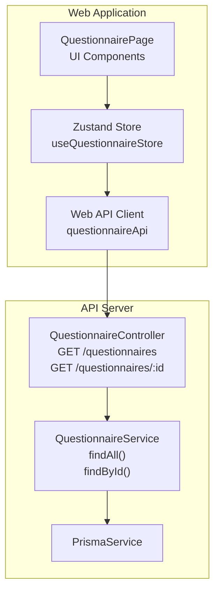
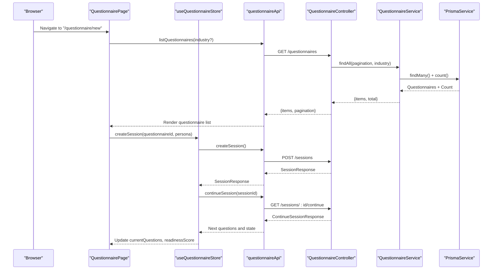
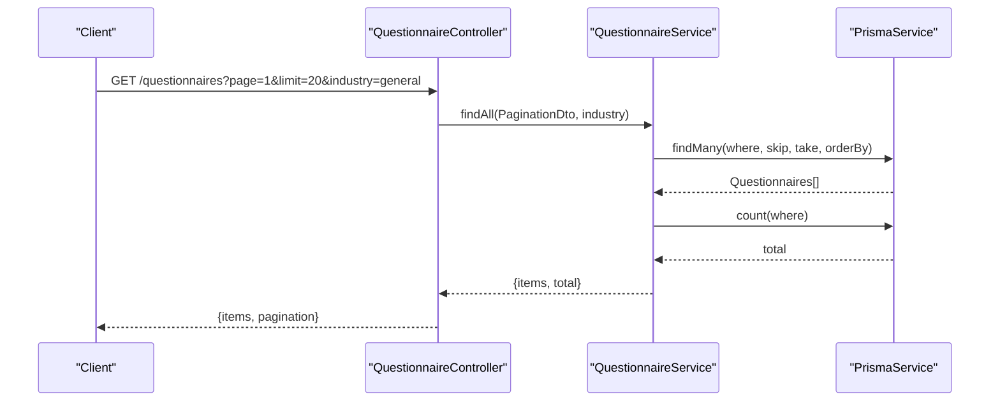
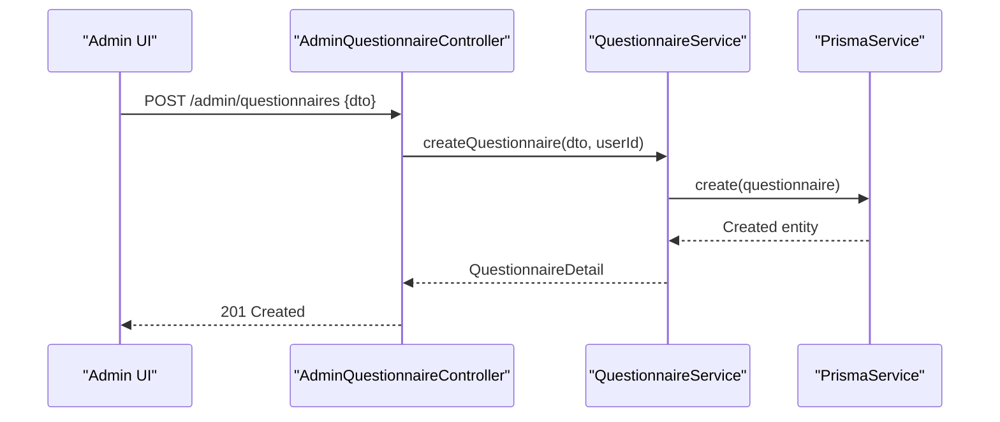
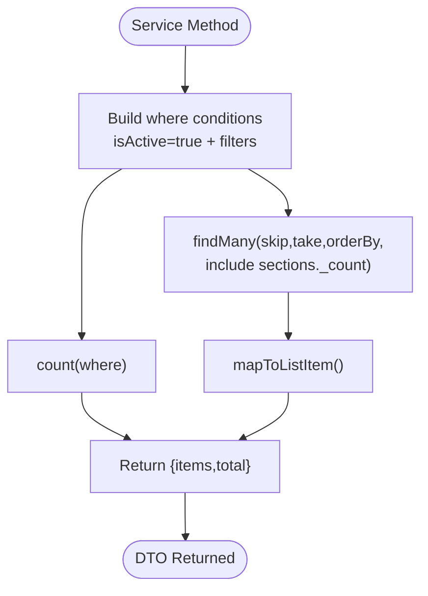
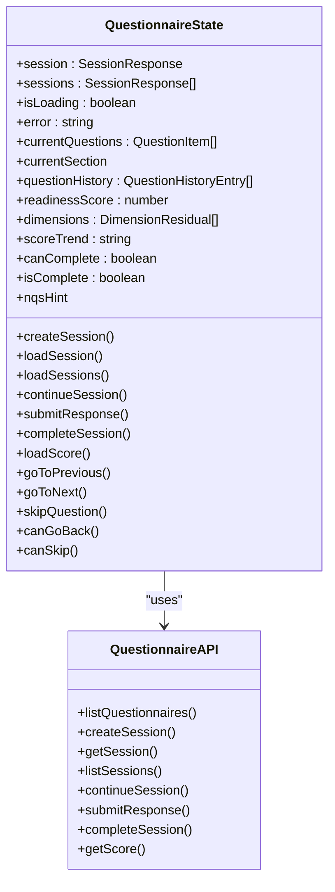
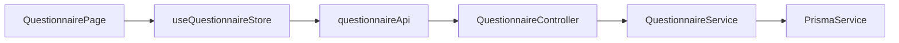

# Questionnaires Service

<cite>
**Referenced Files in This Document**
- [questionnaire.controller.ts](file://apps/api/src/modules/questionnaire/questionnaire.controller.ts)
- [questionnaire.service.ts](file://apps/api/src/modules/questionnaire/questionnaire.service.ts)
- [questionnaire.module.ts](file://apps/api/src/modules/questionnaire/questionnaire.module.ts)
- [admin-questionnaire.controller.ts](file://apps/api/src/modules/admin/controllers/admin-questionnaire.controller.ts)
- [questionnaire.ts](file://apps/web/src/stores/questionnaire.ts)
- [questionnaire.ts](file://apps/web/src/api/questionnaire.ts)
- [QuestionnairePage.tsx](file://apps/web/src/pages/questionnaire/QuestionnairePage.tsx)
- [questionnaire.ts](file://apps/web/src/types/questionnaire.ts)
- [04-api-documentation.md](file://docs/cto/04-api-documentation.md)
</cite>

## Table of Contents
1. [Introduction](#introduction)
2. [Project Structure](#project-structure)
3. [Core Components](#core-components)
4. [Architecture Overview](#architecture-overview)
5. [Detailed Component Analysis](#detailed-component-analysis)
6. [Dependency Analysis](#dependency-analysis)
7. [Performance Considerations](#performance-considerations)
8. [Troubleshooting Guide](#troubleshooting-guide)
9. [Conclusion](#conclusion)

## Introduction
This document describes the Questionnaires Service module, which provides APIs for retrieving questionnaires, managing questionnaire metadata, and handling questionnaire-related operations. It explains the integration with questionnaire stores for state management and caching, details request/response patterns for questionnaire data fetching, filtering, and sorting, and covers error handling strategies and loading state management. It also includes examples of questionnaire retrieval, data transformation, and integration with the questionnaire UI components.

## Project Structure
The Questionnaires Service spans both the API server and the web application:
- API server exposes REST endpoints for listing and retrieving questionnaires, with JWT authentication and pagination support.
- Web application integrates with the API via a dedicated questionnaire API client and a Zustand store for session state, current questions, scoring, and adaptive flow.
- Admin endpoints manage questionnaire creation, updates, and soft deletion.

**Diagram sources**
- [questionnaire.controller.ts:18-47](file://apps/api/src/modules/questionnaire/questionnaire.controller.ts#L18-L47)
- [questionnaire.service.ts:70-128](file://apps/api/src/modules/questionnaire/questionnaire.service.ts#L70-L128)
- [questionnaire.ts:94-356](file://apps/web/src/stores/questionnaire.ts#L94-L356)
- [questionnaire.ts:177-473](file://apps/web/src/api/questionnaire.ts#L177-L473)

**Section sources**
- [questionnaire.controller.ts:1-49](file://apps/api/src/modules/questionnaire/questionnaire.controller.ts#L1-L49)
- [questionnaire.service.ts:1-321](file://apps/api/src/modules/questionnaire/questionnaire.service.ts#L1-L321)
- [questionnaire.module.ts:1-11](file://apps/api/src/modules/questionnaire/questionnaire.module.ts#L1-L11)
- [questionnaire.ts:1-357](file://apps/web/src/stores/questionnaire.ts#L1-L357)
- [questionnaire.ts:1-476](file://apps/web/src/api/questionnaire.ts#L1-L476)

## Core Components
- QuestionnaireController: Exposes endpoints for listing available questionnaires and retrieving detailed questionnaire data with pagination and filtering.
- QuestionnaireService: Implements data access and transformation logic, including mapping to list and detail DTOs, counting questions, and retrieving questionnaire by project type slug.
- Web API Client (questionnaireApi): Provides typed functions for questionnaire and session operations, normalizing backend responses for the UI.
- Zustand Store (useQuestionnaireStore): Manages session state, current questions, navigation history, scoring, and adaptive hints, with robust error handling and loading states.
- Admin Questionnaire Controller: Provides administrative endpoints for listing, retrieving, creating, updating, and soft-deleting questionnaires.

**Section sources**
- [questionnaire.controller.ts:18-47](file://apps/api/src/modules/questionnaire/questionnaire.controller.ts#L18-L47)
- [questionnaire.service.ts:70-321](file://apps/api/src/modules/questionnaire/questionnaire.service.ts#L70-L321)
- [questionnaire.ts:177-473](file://apps/web/src/api/questionnaire.ts#L177-L473)
- [questionnaire.ts:94-356](file://apps/web/src/stores/questionnaire.ts#L94-L356)
- [admin-questionnaire.controller.ts:46-107](file://apps/api/src/modules/admin/controllers/admin-questionnaire.controller.ts#L46-L107)

## Architecture Overview
The Questionnaires Service follows a layered architecture:
- Presentation Layer: Controllers expose REST endpoints with Swagger annotations and JWT authentication.
- Domain Layer: Services encapsulate business logic, including data transformation and filtering.
- Data Access Layer: PrismaService handles database queries and relationships.
- Frontend Integration: Web API client abstracts HTTP requests, and the Zustand store manages UI state and user interactions.

**Diagram sources**
- [QuestionnairePage.tsx:128-143](file://apps/web/src/pages/questionnaire/QuestionnairePage.tsx#L128-L143)
- [questionnaire.ts:97-114](file://apps/web/src/stores/questionnaire.ts#L97-L114)
- [questionnaire.ts:179-185](file://apps/web/src/api/questionnaire.ts#L179-L185)
- [questionnaire.controller.ts:18-39](file://apps/api/src/modules/questionnaire/questionnaire.controller.ts#L18-L39)
- [questionnaire.service.ts:70-103](file://apps/api/src/modules/questionnaire/questionnaire.service.ts#L70-L103)

## Detailed Component Analysis

### Questionnaire API Endpoints
- GET /questionnaires
  - Purpose: List available questionnaires with pagination and optional industry filter.
  - Query Parameters: industry (optional), page (default 1), limit (default 20, max 100).
  - Response: items (array of QuestionnaireListItem), pagination (page, limit, totalItems, totalPages).
- GET /questionnaires/:id
  - Purpose: Retrieve detailed questionnaire structure with sections and questions.
  - Response: QuestionnaireDetail with sections and question metadata.

**Diagram sources**
- [questionnaire.controller.ts:18-39](file://apps/api/src/modules/questionnaire/questionnaire.controller.ts#L18-L39)
- [questionnaire.service.ts:70-103](file://apps/api/src/modules/questionnaire/questionnaire.service.ts#L70-L103)

**Section sources**
- [questionnaire.controller.ts:18-47](file://apps/api/src/modules/questionnaire/questionnaire.controller.ts#L18-L47)
- [04-api-documentation.md:150-192](file://docs/cto/04-api-documentation.md#L150-L192)

### Questionnaire Metadata Management (Admin)
Administrative endpoints enable managing questionnaire metadata:
- GET /admin/questionnaires: Paginated list for admin panel.
- GET /admin/questionnaires/:id: Retrieve full details.
- POST /admin/questionnaires: Create new questionnaire.
- PATCH /admin/questionnaires/:id: Update metadata.
- DELETE /admin/questionnaires/:id: Soft-delete (SUPER_ADMIN only).

**Diagram sources**
- [admin-questionnaire.controller.ts:72-94](file://apps/api/src/modules/admin/controllers/admin-questionnaire.controller.ts#L72-L94)
- [questionnaire.service.ts:105-128](file://apps/api/src/modules/questionnaire/questionnaire.service.ts#L105-L128)

**Section sources**
- [admin-questionnaire.controller.ts:46-107](file://apps/api/src/modules/admin/controllers/admin-questionnaire.controller.ts#L46-L107)

### Data Transformation and DTOs
- QuestionnaireListItem: Lightweight representation for listing (sections include question counts).
- QuestionnaireDetail: Full structure with sections and questions, including visibility rules and metadata.
- QuestionResponse: Normalized question model for UI consumption.

**Diagram sources**
- [questionnaire.service.ts:70-103](file://apps/api/src/modules/questionnaire/questionnaire.service.ts#L70-L103)
- [questionnaire.service.ts:244-269](file://apps/api/src/modules/questionnaire/questionnaire.service.ts#L244-L269)

**Section sources**
- [questionnaire.service.ts:40-64](file://apps/api/src/modules/questionnaire/questionnaire.service.ts#L40-L64)
- [questionnaire.service.ts:244-319](file://apps/api/src/modules/questionnaire/questionnaire.service.ts#L244-L319)

### Web Integration and State Management
- Web API Client (questionnaireApi):
  - listQuestionnaires(industry?): Returns QuestionnaireListItem[].
  - createSession(), getSession(), listSessions(), continueSession(), submitResponse(), completeSession(), getScore().
  - Normalizes backend responses (e.g., extracting items from paginated structures).
- Zustand Store (useQuestionnaireStore):
  - Manages session, current questions, navigation history, readiness score, and adaptive hints.
  - Handles loading states, error propagation, and optimistic updates.
  - Integrates with QuestionnairePage for rendering and user interactions.

**Diagram sources**
- [questionnaire.ts:26-74](file://apps/web/src/stores/questionnaire.ts#L26-L74)
- [questionnaire.ts:177-473](file://apps/web/src/api/questionnaire.ts#L177-L473)

**Section sources**
- [questionnaire.ts:177-473](file://apps/web/src/api/questionnaire.ts#L177-L473)
- [questionnaire.ts:94-356](file://apps/web/src/stores/questionnaire.ts#L94-L356)
- [QuestionnairePage.tsx:48-77](file://apps/web/src/pages/questionnaire/QuestionnairePage.tsx#L48-L77)

### Request/Response Patterns and Filtering
- Filtering:
  - GET /questionnaires supports industry filter and pagination.
  - Service applies isActive=true and optional filters for industry and project type.
- Sorting:
  - Default sort by createdAt desc; sections and questions sorted by orderIndex asc.
- Pagination:
  - Uses skip/take derived from page and limit; total computed separately.

**Section sources**
- [questionnaire.controller.ts:22-39](file://apps/api/src/modules/questionnaire/questionnaire.controller.ts#L22-L39)
- [questionnaire.service.ts:70-103](file://apps/api/src/modules/questionnaire/questionnaire.service.ts#L70-L103)

### Error Handling Strategies
- API Layer:
  - NotFoundException thrown when questionnaire not found by ID.
  - Controllers return appropriate HTTP status codes and structured responses.
- Web Layer:
  - Store catches errors during API calls, sets isLoading=false, and populates error state.
  - UI displays error messages and allows dismissal.

**Section sources**
- [questionnaire.service.ts:123-125](file://apps/api/src/modules/questionnaire/questionnaire.service.ts#L123-L125)
- [questionnaire.ts:104-113](file://apps/web/src/stores/questionnaire.ts#L104-L113)
- [questionnaire.ts:121-130](file://apps/web/src/stores/questionnaire.ts#L121-L130)
- [questionnaire.ts:222-232](file://apps/web/src/stores/questionnaire.ts#L222-L232)

### Loading State Management
- Web store toggles isLoading=true during async operations and resets on success or error.
- UI reflects loading states with spinners and disabled controls.
- Auto-refresh continues session after response submission to keep UI synchronized.

**Section sources**
- [questionnaire.ts:97-114](file://apps/web/src/stores/questionnaire.ts#L97-L114)
- [questionnaire.ts:150-173](file://apps/web/src/stores/questionnaire.ts#L150-L173)
- [questionnaire.ts:175-233](file://apps/web/src/stores/questionnaire.ts#L175-L233)
- [QuestionnairePage.tsx:324-341](file://apps/web/src/pages/questionnaire/QuestionnairePage.tsx#L324-L341)

### Examples

#### Example: Retrieving Available Questionnaires
- Web: Call questionnaireApi.listQuestionnaires(industry?) to populate the questionnaire list.
- API: GET /questionnaires with pagination and optional industry filter.

**Section sources**
- [questionnaire.ts:179-185](file://apps/web/src/api/questionnaire.ts#L179-L185)
- [questionnaire.controller.ts:18-39](file://apps/api/src/modules/questionnaire/questionnaire.controller.ts#L18-L39)

#### Example: Data Transformation
- Service maps raw DB entities to QuestionnaireListItem and QuestionnaireDetail, computing total questions and ordering sections/questions.

**Section sources**
- [questionnaire.service.ts:244-319](file://apps/api/src/modules/questionnaire/questionnaire.service.ts#L244-L319)

#### Example: Integration with UI Components
- QuestionnairePage uses useQuestionnaireStore to drive the interactive questionnaire flow, displaying progress, readiness score, and handling navigation and submission.

**Section sources**
- [QuestionnairePage.tsx:48-77](file://apps/web/src/pages/questionnaire/QuestionnairePage.tsx#L48-L77)
- [questionnaire.ts:94-356](file://apps/web/src/stores/questionnaire.ts#L94-L356)

## Dependency Analysis
- QuestionnaireController depends on QuestionnaireService for business logic.
- QuestionnaireService depends on PrismaService for database operations.
- Web API client depends on axios-like apiClient for HTTP requests.
- Zustand store depends on questionnaireApi for data access and on logger for diagnostics.

**Diagram sources**
- [questionnaire.controller.ts:15-16](file://apps/api/src/modules/questionnaire/questionnaire.controller.ts#L15-L16)
- [questionnaire.service.ts](file://apps/api/src/modules/questionnaire/questionnaire.service.ts#L68)
- [questionnaire.ts](file://apps/web/src/stores/questionnaire.ts#L6)
- [questionnaire.ts](file://apps/web/src/api/questionnaire.ts#L6)

**Section sources**
- [questionnaire.controller.ts:1-49](file://apps/api/src/modules/questionnaire/questionnaire.controller.ts#L1-L49)
- [questionnaire.service.ts:1-321](file://apps/api/src/modules/questionnaire/questionnaire.service.ts#L1-L321)
- [questionnaire.ts:1-357](file://apps/web/src/stores/questionnaire.ts#L1-L357)
- [questionnaire.ts:1-476](file://apps/web/src/api/questionnaire.ts#L1-L476)

## Performance Considerations
- Efficient pagination: Use skip/take with indexed orderBy to avoid scanning entire datasets.
- Selective includes: Limit nested includes to sections._count for listings and sections.questions for details.
- Parallel queries: Use Promise.all for findMany and count to reduce round trips.
- Client-side caching: Consider memoizing questionnaire lists and session state to minimize redundant network calls.

## Troubleshooting Guide
- 404 Not Found when retrieving questionnaire by ID:
  - Ensure the questionnaire exists and isActive=true.
- Unexpected empty lists:
  - Verify industry filter and pagination parameters.
- UI stuck in loading state:
  - Check store error handling and ensure isLoading is reset on success/error.
- Score or NQS hint not updating:
  - Confirm continueSession is called after submitResponse and that the backend returns updated fields.

**Section sources**
- [questionnaire.service.ts:123-125](file://apps/api/src/modules/questionnaire/questionnaire.service.ts#L123-L125)
- [questionnaire.ts:150-173](file://apps/web/src/stores/questionnaire.ts#L150-L173)
- [questionnaire.ts:222-232](file://apps/web/src/stores/questionnaire.ts#L222-L232)

## Conclusion
The Questionnaires Service provides a robust foundation for questionnaire discovery, metadata management, and interactive assessment workflows. Its clean separation of concerns, strong typing, and integrated state management enable scalable and maintainable questionnaire experiences across the platform.