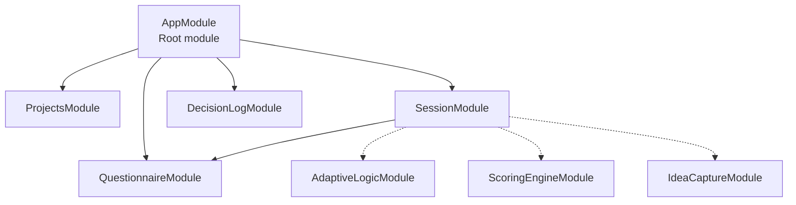
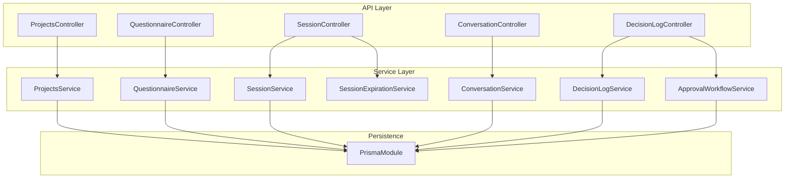
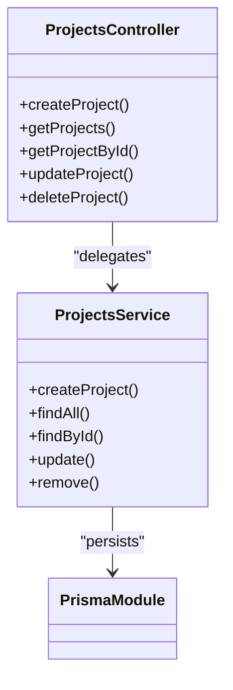
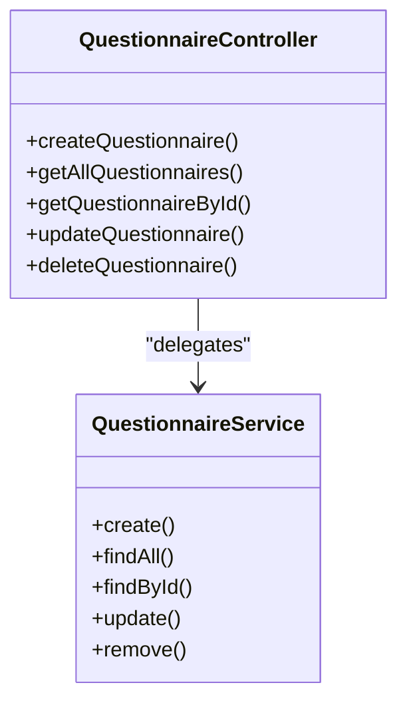
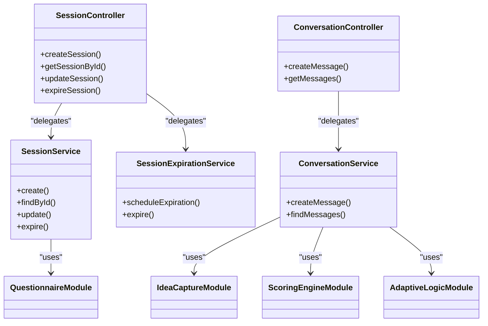
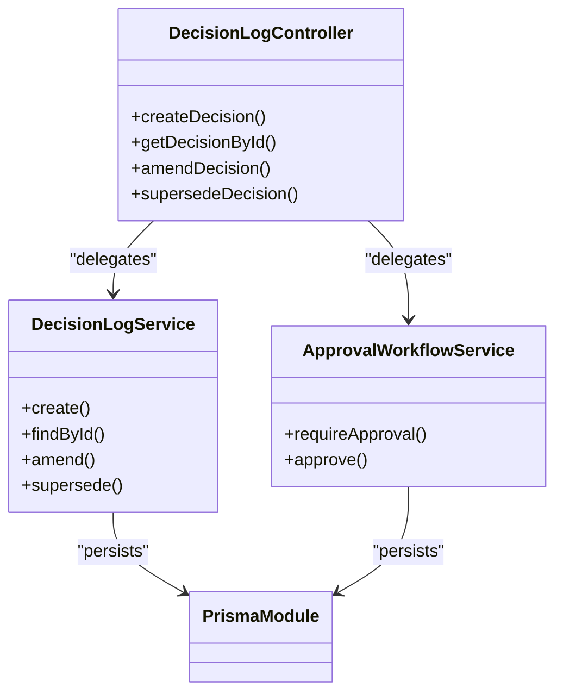
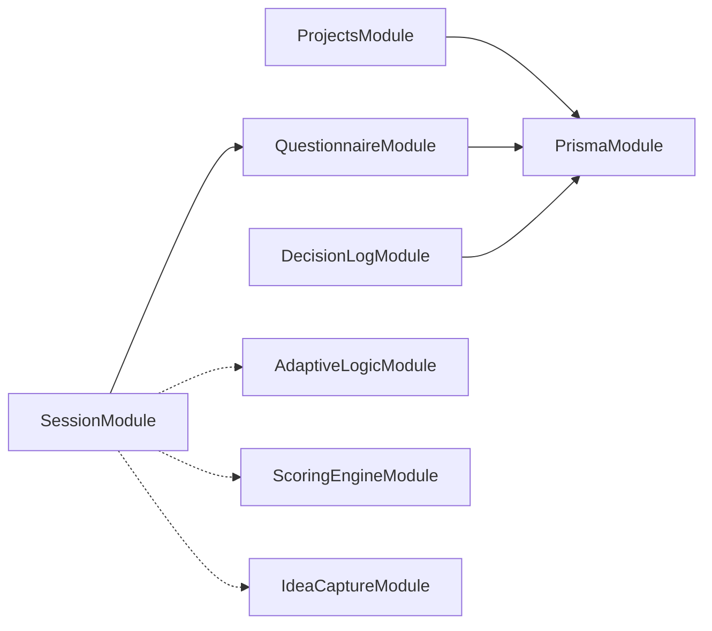

# Service Modules

<cite>
**Referenced Files in This Document**
- [app.module.ts](file://apps/api/src/app.module.ts)
- [projects.module.ts](file://apps/api/src/modules/projects/projects.module.ts)
- [questionnaire.module.ts](file://apps/api/src/modules/questionnaire/questionnaire.module.ts)
- [session.module.ts](file://apps/api/src/modules/session/session.module.ts)
- [decision-log.module.ts](file://apps/api/src/modules/decision-log/decision-log.module.ts)
</cite>

## Table of Contents
1. [Introduction](#introduction)
2. [Project Structure](#project-structure)
3. [Core Components](#core-components)
4. [Architecture Overview](#architecture-overview)
5. [Detailed Component Analysis](#detailed-component-analysis)
6. [Dependency Analysis](#dependency-analysis)
7. [Performance Considerations](#performance-considerations)
8. [Troubleshooting Guide](#troubleshooting-guide)
9. [Conclusion](#conclusion)

## Introduction
This document describes the API service modules focused on projects, questionnaires, sessions, and decisions management. It explains the service layer architecture, module composition, controller-service relationships, and integration patterns with the frontend’s caching and state management. It also covers parameter handling, response transformation, error handling strategies, optimistic update considerations, and practical usage patterns for data fetching and mutations.

## Project Structure
The API application is organized as a NestJS monolith with modularized feature domains. The relevant modules for this document are:
- Projects: multi-project workspace management
- Questionnaire: questionnaire lifecycle and administration
- Session: interactive quiz sessions, conversations, and related orchestration
- Decision Log: append-only decision records with workflow and approvals

**Diagram sources**
- [app.module.ts:53-129](file://apps/api/src/app.module.ts#L53-L129)
- [projects.module.ts:12-18](file://apps/api/src/modules/projects/projects.module.ts#L12-L18)
- [questionnaire.module.ts:5-10](file://apps/api/src/modules/questionnaire/questionnaire.module.ts#L5-L10)
- [session.module.ts:12-23](file://apps/api/src/modules/session/session.module.ts#L12-L23)
- [decision-log.module.ts:18-24](file://apps/api/src/modules/decision-log/decision-log.module.ts#L18-L24)

**Section sources**
- [app.module.ts:10-28](file://apps/api/src/app.module.ts#L10-L28)
- [projects.module.ts:1-19](file://apps/api/src/modules/projects/projects.module.ts#L1-L19)
- [questionnaire.module.ts:1-11](file://apps/api/src/modules/questionnaire/questionnaire.module.ts#L1-L11)
- [session.module.ts:1-24](file://apps/api/src/modules/session/session.module.ts#L1-L24)
- [decision-log.module.ts:1-25](file://apps/api/src/modules/decision-log/decision-log.module.ts#L1-L25)

## Core Components
- ProjectsModule: Exposes a controller and service for multi-project workspace operations. It imports PrismaModule for persistence.
- QuestionnaireModule: Provides questionnaire-related controllers and services.
- SessionModule: Coordinates session orchestration, integrates with questionnaire, adaptive logic, scoring engine, and idea capture modules, and exposes session and conversation endpoints.
- DecisionLogModule: Manages append-only decision records, workflow transitions, and approval gating.

Each module follows a standard NestJS pattern:
- A controller defines HTTP endpoints and delegates to a service.
- A service encapsulates business logic and interacts with repositories/data sources.
- Optional DTOs and guards define input validation and access control.

**Section sources**
- [projects.module.ts:12-18](file://apps/api/src/modules/projects/projects.module.ts#L12-L18)
- [questionnaire.module.ts:5-10](file://apps/api/src/modules/questionnaire/questionnaire.module.ts#L5-L10)
- [session.module.ts:12-23](file://apps/api/src/modules/session/session.module.ts#L12-L23)
- [decision-log.module.ts:18-24](file://apps/api/src/modules/decision-log/decision-log.module.ts#L18-L24)

## Architecture Overview
The service layer architecture centers around controllers and services per domain. Cross-module dependencies are explicit:
- SessionModule depends on QuestionnaireModule and integrates with AdaptiveLogicModule, ScoringEngineModule, and IdeaCaptureModule.
- DecisionLogModule relies on PrismaModule for persistence and provides approval workflow services.

**Diagram sources**
- [projects.module.ts:12-18](file://apps/api/src/modules/projects/projects.module.ts#L12-L18)
- [questionnaire.module.ts:5-10](file://apps/api/src/modules/questionnaire/questionnaire.module.ts#L5-L10)
- [session.module.ts:12-23](file://apps/api/src/modules/session/session.module.ts#L12-L23)
- [decision-log.module.ts:18-24](file://apps/api/src/modules/decision-log/decision-log.module.ts#L18-L24)

## Detailed Component Analysis

### Projects Module
- Purpose: Manage multi-project workspace operations.
- Composition:
  - Controller: ProjectsController
  - Service: ProjectsService
  - Persistence: PrismaModule
- Responsibilities:
  - CRUD operations for projects
  - Workspace-level queries and mutations
  - Integration with database via Prisma
- Parameter handling:
  - Uses route parameters and request bodies validated by NestJS pipes and DTOs
- Response transformation:
  - Returns standardized DTOs or entities from the service layer
- Error handling:
  - Leverages centralized exception filtering and NestJS guards
- Integration patterns:
  - No external module dependencies; relies on PrismaModule

**Diagram sources**
- [projects.module.ts:12-18](file://apps/api/src/modules/projects/projects.module.ts#L12-L18)

**Section sources**
- [projects.module.ts:12-18](file://apps/api/src/modules/projects/projects.module.ts#L12-L18)

### Questionnaire Module
- Purpose: Manage questionnaire lifecycle and administration.
- Composition:
  - Controller: QuestionnaireController
  - Service: QuestionnaireService
- Responsibilities:
  - Questionnaire creation, updates, retrieval, and administrative actions
  - Potential integration with standards and adaptive logic
- Parameter handling:
  - Route parameters and request bodies validated by NestJS pipes and DTOs
- Response transformation:
  - Returns standardized DTOs or entities from the service layer
- Error handling:
  - Centralized exception filtering and guards apply
- Integration patterns:
  - Used by SessionModule for session orchestration

**Diagram sources**
- [questionnaire.module.ts:5-10](file://apps/api/src/modules/questionnaire/questionnaire.module.ts#L5-L10)

**Section sources**
- [questionnaire.module.ts:5-10](file://apps/api/src/modules/questionnaire/questionnaire.module.ts#L5-L10)

### Session Module
- Purpose: Orchestrate interactive quiz sessions, manage conversation flows, and coordinate with related engines.
- Composition:
  - Controllers: SessionController, ConversationController
  - Services: SessionService, SessionExpirationService, ConversationService
  - Dependencies: QuestionnaireModule, AdaptiveLogicModule, ScoringEngineModule, IdeaCaptureModule
- Responsibilities:
  - Session lifecycle management
  - Conversation handling and AI-driven interactions
  - Coordination with scoring and adaptive logic
- Parameter handling:
  - Route parameters and request bodies validated by NestJS pipes and DTOs
- Response transformation:
  - Returns standardized DTOs or entities from the service layer
- Error handling:
  - Centralized exception filtering and guards apply
- Integration patterns:
  - Depends on QuestionnaireModule for questionnaire context
  - Integrates with AdaptiveLogicModule, ScoringEngineModule, and IdeaCaptureModule

**Diagram sources**
- [session.module.ts:12-23](file://apps/api/src/modules/session/session.module.ts#L12-L23)

**Section sources**
- [session.module.ts:12-23](file://apps/api/src/modules/session/session.module.ts#L12-L23)

### Decision Log Module
- Purpose: Maintain an append-only, auditable decision record with workflow enforcement and approval gating.
- Composition:
  - Controller: DecisionLogController
  - Services: DecisionLogService, ApprovalWorkflowService
  - Guards: ApprovalGuard
  - Persistence: PrismaModule
- Responsibilities:
  - Enforce status workflow (DRAFT → LOCKED → AMENDED/SUPERSEDED)
  - Append-only enforcement at the service layer
  - Track supersession and maintain audit trail
  - Two-person rule via ApprovalWorkflowService
- Parameter handling:
  - Route parameters and request bodies validated by NestJS pipes and DTOs
- Response transformation:
  - Returns standardized DTOs or entities from the service layer
- Error handling:
  - Centralized exception filtering and guards apply
- Integration patterns:
  - Uses PrismaModule for persistence and ApprovalWorkflowService for access control

**Diagram sources**
- [decision-log.module.ts:18-24](file://apps/api/src/modules/decision-log/decision-log.module.ts#L18-L24)

**Section sources**
- [decision-log.module.ts:18-24](file://apps/api/src/modules/decision-log/decision-log.module.ts#L18-L24)

## Dependency Analysis
- ProjectsModule is self-contained and depends on PrismaModule for persistence.
- QuestionnaireModule is independent but consumed by SessionModule.
- SessionModule depends on QuestionnaireModule and integrates with AdaptiveLogicModule, ScoringEngineModule, and IdeaCaptureModule.
- DecisionLogModule depends on PrismaModule and provides ApprovalWorkflowService for access control.

**Diagram sources**
- [projects.module.ts:12-18](file://apps/api/src/modules/projects/projects.module.ts#L12-L18)
- [questionnaire.module.ts:5-10](file://apps/api/src/modules/questionnaire/questionnaire.module.ts#L5-L10)
- [session.module.ts:12-23](file://apps/api/src/modules/session/session.module.ts#L12-L23)
- [decision-log.module.ts:18-24](file://apps/api/src/modules/decision-log/decision-log.module.ts#L18-L24)

**Section sources**
- [app.module.ts:94-112](file://apps/api/src/app.module.ts#L94-L112)
- [session.module.ts:7,14-17](file://apps/api/src/modules/session/session.module.ts#L7,L14-L17)

## Performance Considerations
- Use pagination and filtering for list endpoints to reduce payload sizes.
- Apply selective field projections in services to minimize database roundtrips.
- Implement caching strategies at the service level for frequently accessed metadata.
- Batch operations where appropriate to reduce network overhead.
- Monitor and tune database indexes for high-traffic endpoints.

## Troubleshooting Guide
- Validation errors: Ensure DTOs and pipes are configured correctly; review centralized exception filtering for consistent error responses.
- Access control failures: Verify guards and guards’ configurations for protected endpoints.
- Database connectivity: Confirm PrismaModule initialization and connection pool settings.
- Cross-module dependencies: Validate module imports and forward references to prevent circular dependencies.

## Conclusion
The API service modules for projects, questionnaires, sessions, and decisions management are structured around clear separation of concerns. Controllers expose endpoints, services encapsulate business logic, and modules integrate with persistence and cross-cutting concerns. The SessionModule orchestrates multiple engines and integrates tightly with QuestionnaireModule. DecisionLogModule enforces strict workflow and auditability. Together, these modules form a cohesive foundation for building robust, maintainable features aligned with frontend caching and state management patterns.