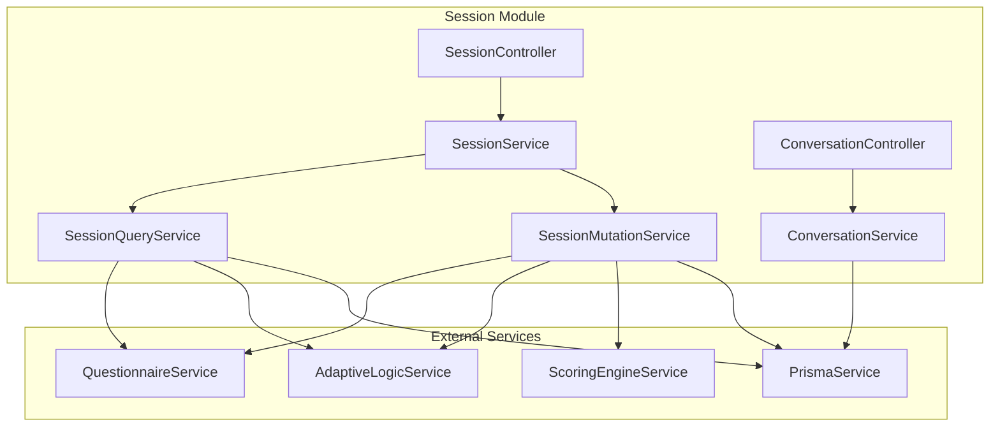
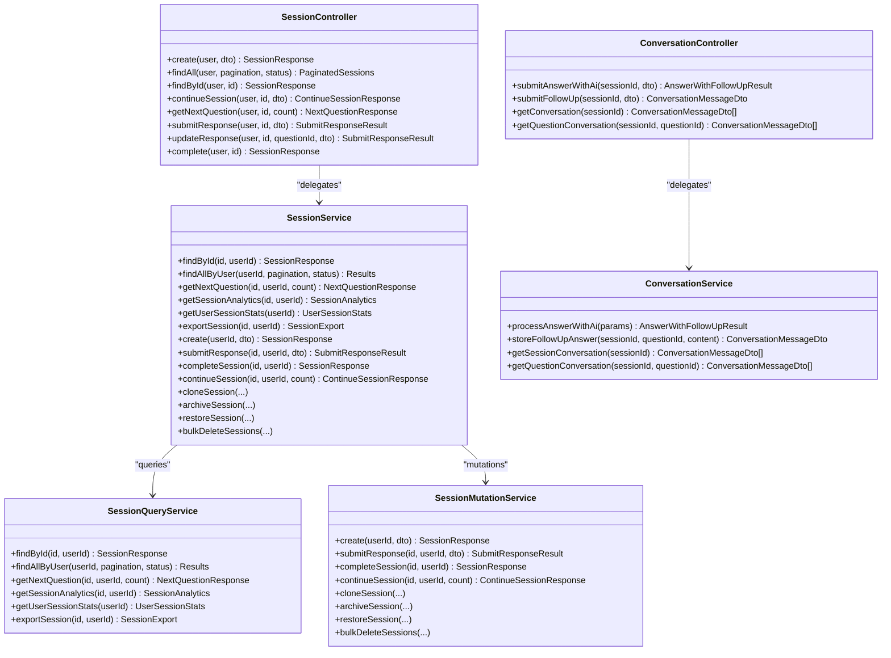
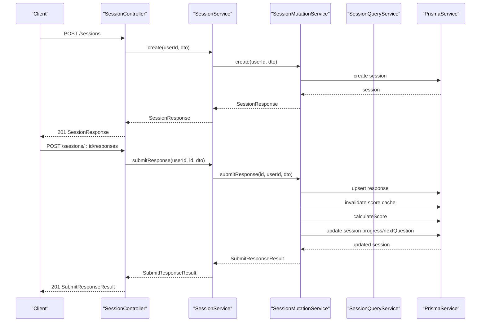
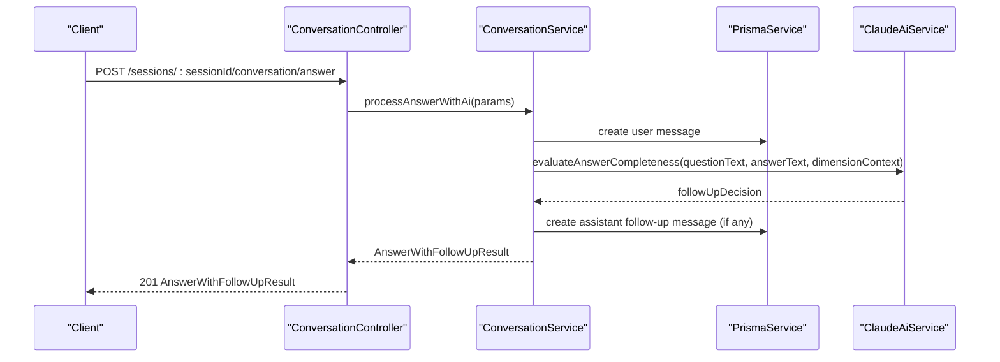
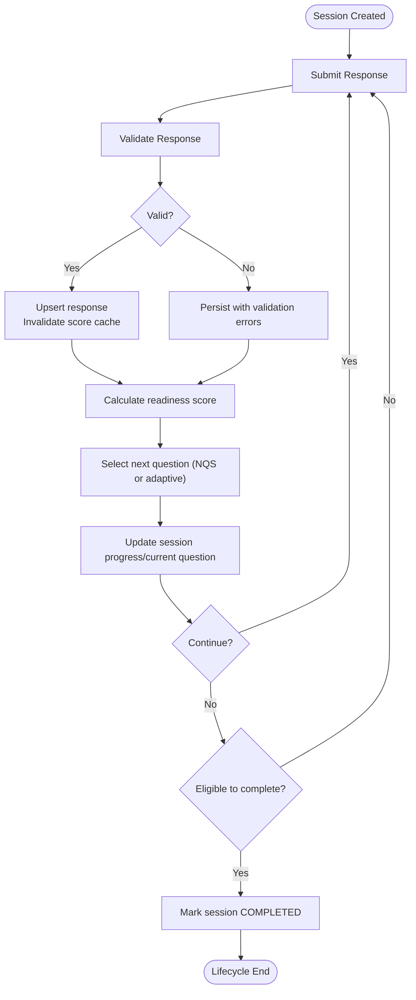
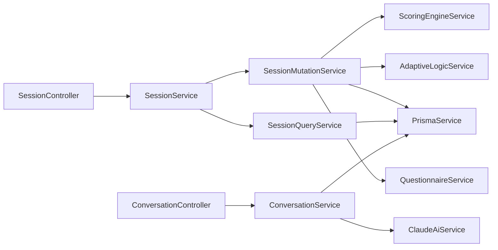

# Sessions Service

<cite>
**Referenced Files in This Document**
- [session.controller.ts](file://apps/api/src/modules/session/session.controller.ts)
- [session.service.ts](file://apps/api/src/modules/session/session.service.ts)
- [session.module.ts](file://apps/api/src/modules/session/session.module.ts)
- [create-session.dto.ts](file://apps/api/src/modules/session/dto/create-session.dto.ts)
- [submit-response.dto.ts](file://apps/api/src/modules/session/dto/submit-response.dto.ts)
- [continue-session.dto.ts](file://apps/api/src/modules/session/dto/continue-session.dto.ts)
- [session-query.service.ts](file://apps/api/src/modules/session/services/session-query.service.ts)
- [session-mutation.service.ts](file://apps/api/src/modules/session/services/session-mutation.service.ts)
- [conversation.controller.ts](file://apps/api/src/modules/session/controllers/conversation.controller.ts)
- [conversation.service.ts](file://apps/api/src/modules/session/services/conversation.service.ts)
- [session-helpers.ts](file://apps/api/src/modules/session/session-helpers.ts)
- [session-types.ts](file://apps/api/src/modules/session/session-types.ts)
</cite>

## Table of Contents
1. [Introduction](#introduction)
2. [Project Structure](#project-structure)
3. [Core Components](#core-components)
4. [Architecture Overview](#architecture-overview)
5. [Detailed Component Analysis](#detailed-component-analysis)
6. [Dependency Analysis](#dependency-analysis)
7. [Performance Considerations](#performance-considerations)
8. [Troubleshooting Guide](#troubleshooting-guide)
9. [Conclusion](#conclusion)
10. [Appendices](#appendices)

## Introduction
This document describes the Sessions Service module responsible for managing questionnaire sessions, including creation, continuation, response submission, and conversation handling. It explains the session lifecycle, real-time-like behavior via optimistic updates, and persistence of session state. It also covers integration points with the Questionnaire, Adaptive Logic, and Scoring Engine services, and outlines error handling for timeouts, network interruptions, and validation failures.

## Project Structure
The Sessions Service is organized around a controller that exposes REST endpoints, a service facade delegating to query and mutation services, DTOs for request validation, and supporting services for conversation handling and helper utilities.

**Diagram sources**
- [session.controller.ts:36-165](file://apps/api/src/modules/session/session.controller.ts#L36-L165)
- [session.service.ts:30-115](file://apps/api/src/modules/session/session.service.ts#L30-L115)
- [session-query.service.ts:25-326](file://apps/api/src/modules/session/services/session-query.service.ts#L25-L326)
- [session-mutation.service.ts:31-552](file://apps/api/src/modules/session/services/session-mutation.service.ts#L31-L552)
- [conversation.controller.ts:26-80](file://apps/api/src/modules/session/controllers/conversation.controller.ts#L26-L80)
- [conversation.service.ts:30-147](file://apps/api/src/modules/session/services/conversation.service.ts#L30-L147)

**Section sources**
- [session.module.ts:12-22](file://apps/api/src/modules/session/session.module.ts#L12-L22)

## Core Components
- SessionController: Exposes REST endpoints for session management and conversation handling.
- SessionService: Facade that delegates read operations to SessionQueryService and write operations to SessionMutationService.
- SessionQueryService: Read-only operations including listing sessions, fetching session details, retrieving next questions, analytics, stats, and exports.
- SessionMutationService: Write operations including creating sessions, submitting/updating responses, continuing sessions, completing sessions, cloning/archiving/restoring sessions, and bulk deletion.
- ConversationController and ConversationService: Real-time-like conversation handling with AI evaluation and follow-up prompts.
- DTOs: Strongly typed request validation for create, submit response, and continue session requests.
- Helpers and Types: Shared helpers for validation, mapping, progress calculation, and type definitions.

**Section sources**
- [session.controller.ts:36-165](file://apps/api/src/modules/session/session.controller.ts#L36-L165)
- [session.service.ts:30-115](file://apps/api/src/modules/session/session.service.ts#L30-L115)
- [session-query.service.ts:25-326](file://apps/api/src/modules/session/services/session-query.service.ts#L25-L326)
- [session-mutation.service.ts:31-552](file://apps/api/src/modules/session/services/session-mutation.service.ts#L31-L552)
- [conversation.controller.ts:26-80](file://apps/api/src/modules/session/controllers/conversation.controller.ts#L26-L80)
- [conversation.service.ts:30-147](file://apps/api/src/modules/session/services/conversation.service.ts#L30-L147)
- [create-session.dto.ts:5-39](file://apps/api/src/modules/session/dto/create-session.dto.ts#L5-L39)
- [submit-response.dto.ts:4-21](file://apps/api/src/modules/session/dto/submit-response.dto.ts#L4-L21)
- [continue-session.dto.ts:5-13](file://apps/api/src/modules/session/dto/continue-session.dto.ts#L5-L13)
- [session-helpers.ts:15-224](file://apps/api/src/modules/session/session-helpers.ts#L15-L224)
- [session-types.ts:10-141](file://apps/api/src/modules/session/session-types.ts#L10-L141)

## Architecture Overview
The Sessions Service follows a layered architecture:
- Controller layer validates inputs and orchestrates calls.
- Service layer delegates to specialized query/mutation services.
- Helper functions encapsulate pure logic and shared validations.
- Persistence is handled via PrismaService.
- Integration with Questionnaire, Adaptive Logic, and Scoring Engine services enables dynamic question selection and scoring.

**Diagram sources**
- [session.controller.ts:36-165](file://apps/api/src/modules/session/session.controller.ts#L36-L165)
- [session.service.ts:30-115](file://apps/api/src/modules/session/session.service.ts#L30-L115)
- [session-query.service.ts:25-326](file://apps/api/src/modules/session/services/session-query.service.ts#L25-L326)
- [session-mutation.service.ts:31-552](file://apps/api/src/modules/session/services/session-mutation.service.ts#L31-L552)
- [conversation.controller.ts:26-80](file://apps/api/src/modules/session/controllers/conversation.controller.ts#L26-L80)
- [conversation.service.ts:30-147](file://apps/api/src/modules/session/services/conversation.service.ts#L30-L147)

## Detailed Component Analysis

### Session Management Endpoints
- POST /sessions: Creates a new session based on a questionnaire and optional persona/industry filters. Initializes progress, current section/question, and adaptive state.
- GET /sessions: Lists user sessions with optional status filtering and pagination.
- GET /sessions/:id: Retrieves a specific session’s details.
- GET /sessions/:id/continue: Continues a session, applying adaptive logic and returning next questions, progress, readiness score, and completion eligibility.
- GET /sessions/:id/questions/next: Fetches the next question(s) based on adaptive visibility and unanswer status.
- POST /sessions/:id/responses: Submits a response to a question; validates input, persists response, recalculates score, selects next question (via NQS or adaptive), and updates progress.
- PUT /sessions/:id/responses/:questionId: Updates an existing response.
- POST /sessions/:id/complete: Marks a session as complete if readiness criteria and requirements are met.

**Diagram sources**
- [session.controller.ts:39-142](file://apps/api/src/modules/session/session.controller.ts#L39-L142)
- [session.service.ts:80-90](file://apps/api/src/modules/session/session.service.ts#L80-L90)
- [session-mutation.service.ts:46-181](file://apps/api/src/modules/session/services/session-mutation.service.ts#L46-L181)

**Section sources**
- [session.controller.ts:39-164](file://apps/api/src/modules/session/session.controller.ts#L39-L164)
- [session.service.ts:52-94](file://apps/api/src/modules/session/session.service.ts#L52-L94)

### Conversation Handling Endpoints
- POST /sessions/:sessionId/conversation/answer: Stores a user answer and triggers AI evaluation; returns follow-up suggestion and conversation messages for the question.
- POST /sessions/:sessionId/conversation/follow-up: Records a follow-up answer from the user.
- GET /sessions/:sessionId/conversation: Retrieves full conversation history for a session.
- GET /sessions/:sessionId/conversation/question/:questionId: Retrieves conversation messages for a specific question.

**Diagram sources**
- [conversation.controller.ts:29-47](file://apps/api/src/modules/session/controllers/conversation.controller.ts#L29-L47)
- [conversation.service.ts:40-80](file://apps/api/src/modules/session/services/conversation.service.ts#L40-L80)

**Section sources**
- [conversation.controller.ts:29-79](file://apps/api/src/modules/session/controllers/conversation.controller.ts#L29-L79)
- [conversation.service.ts:40-128](file://apps/api/src/modules/session/services/conversation.service.ts#L40-L128)

### Session Lifecycle Management
- Creation: Initializes a session with persona/industry filters, sets status to in-progress, and sets initial current question/section and adaptive state.
- Response Submission: Validates response against question rules, persists response, recalculates readiness score, selects next question (NQS or adaptive), and updates progress.
- Continuation: Applies adaptive logic to compute visible questions, determines next unanswered batch, computes section and overall progress, readiness score, and completion eligibility.
- Completion: Requires no outstanding required questions, presence of responses, and meeting readiness threshold if gated by project type.
- Cloning/Archiving/Restoration/Bulk Deletion: Supports copying sessions (with or without responses), archiving abandoned sessions, restoring, and bulk deletion.

**Diagram sources**
- [session-mutation.service.ts:88-207](file://apps/api/src/modules/session/services/session-mutation.service.ts#L88-L207)
- [session-helpers.ts:144-202](file://apps/api/src/modules/session/session-helpers.ts#L144-L202)

**Section sources**
- [session-mutation.service.ts:46-207](file://apps/api/src/modules/session/services/session-mutation.service.ts#L46-L207)
- [session-helpers.ts:144-224](file://apps/api/src/modules/session/session-helpers.ts#L144-L224)

### Real-Time Conversation Handling and Optimistic Concurrency
- Conversation handling is modeled as a sequence of discrete operations with immediate persistence of user answers and AI-generated follow-ups. While not true WebSocket streaming, the controller returns the latest conversation messages after each operation, enabling a near real-time UX.
- Optimistic concurrency is supported by:
  - Returning updated session state and progress immediately after response submission.
  - Using revision counters on responses to detect concurrent edits.
  - Updating lastActivityAt on continue and response operations to reflect activity.

**Section sources**
- [conversation.controller.ts:29-79](file://apps/api/src/modules/session/controllers/conversation.controller.ts#L29-L79)
- [conversation.service.ts:40-128](file://apps/api/src/modules/session/services/conversation.service.ts#L40-L128)
- [session-mutation.service.ts:104-121](file://apps/api/src/modules/session/services/session-mutation.service.ts#L104-L121)
- [session-mutation.service.ts:291-295](file://apps/api/src/modules/session/services/session-mutation.service.ts#L291-L295)

### Session State Persistence
- Sessions and responses are persisted via PrismaService. Responses include value, validity, validation errors, revision count, and timing metadata.
- Progress is maintained as a structured object with percentage, counts, and derived estimates.
- Adaptive state tracks visible/skipped questions and branch history for reproducible adaptive logic.

**Section sources**
- [session-mutation.service.ts:104-121](file://apps/api/src/modules/session/services/session-mutation.service.ts#L104-L121)
- [session-mutation.service.ts:157-169](file://apps/api/src/modules/session/services/session-mutation.service.ts#L157-L169)
- [session-helpers.ts:50-102](file://apps/api/src/modules/session/session-helpers.ts#L50-L102)

### Integration with React Query for Real-Time Updates and Optimistic Concurrency
- The API endpoints return updated session state and progress, enabling clients to optimistically render changes while awaiting server responses.
- Clients can subscribe to session identifiers and invalidate queries on mutation to keep views synchronized.
- Revision counters on responses support optimistic updates with conflict detection.

[No sources needed since this section provides general guidance]

## Dependency Analysis
- SessionController depends on SessionService for orchestration.
- SessionService delegates to SessionQueryService (reads) and SessionMutationService (writes).
- SessionMutationService integrates with QuestionnaireService, AdaptiveLogicService, and ScoringEngineService.
- ConversationController depends on ConversationService, which integrates with ClaudeAiService for AI evaluation.
- All services rely on PrismaService for persistence.

**Diagram sources**
- [session.controller.ts:36-165](file://apps/api/src/modules/session/session.controller.ts#L36-L165)
- [session.service.ts:30-115](file://apps/api/src/modules/session/session.service.ts#L30-L115)
- [session-query.service.ts:25-30](file://apps/api/src/modules/session/services/session-query.service.ts#L25-L30)
- [session-mutation.service.ts:34-39](file://apps/api/src/modules/session/services/session-mutation.service.ts#L34-L39)
- [conversation.controller.ts:26-27](file://apps/api/src/modules/session/controllers/conversation.controller.ts#L26-L27)
- [conversation.service.ts:32-35](file://apps/api/src/modules/session/services/conversation.service.ts#L32-L35)

**Section sources**
- [session.module.ts:12-22](file://apps/api/src/modules/session/session.module.ts#L12-L22)

## Performance Considerations
- Adaptive logic visibility computation and scoring recalculation occur per response; consider caching and batched updates for high-volume scenarios.
- Pagination is supported for listing sessions; use appropriate limits and page sizes to avoid large payloads.
- Progress calculations and section completion computations are lightweight but should be cached where feasible.
- Conversation retrieval sorts by creation time; ensure indexing on sessionId and questionId for efficient queries.

[No sources needed since this section provides general guidance]

## Troubleshooting Guide
Common issues and resolutions:
- Session not found or access denied: Ensure the session exists and belongs to the authenticated user.
- Attempting to submit response to a completed session: Prevent further submissions once status is COMPLETED.
- Validation errors on response submission: Review question validation rules and provide required values.
- Session completion blocked by readiness gate: Improve score by answering more questions or meet domain-specific thresholds.
- Network interruption during response submission: Retry with idempotent upsert semantics and observe revision increments.

**Section sources**
- [session-query.service.ts:32-51](file://apps/api/src/modules/session/services/session-query.service.ts#L32-L51)
- [session-mutation.service.ts:88-101](file://apps/api/src/modules/session/services/session-mutation.service.ts#L88-L101)
- [session-mutation.service.ts:183-207](file://apps/api/src/modules/session/services/session-mutation.service.ts#L183-L207)
- [session-helpers.ts:144-202](file://apps/api/src/modules/session/session-helpers.ts#L144-L202)

## Conclusion
The Sessions Service provides a robust, modular foundation for questionnaire session management with clear separation of concerns between queries and mutations. It integrates adaptive logic and scoring to drive intelligent question selection and readiness assessments, while conversation endpoints enable contextual AI-driven feedback. The design supports optimistic UI updates and strong validation, facilitating resilient user experiences.

## Appendices

### API Endpoint Reference
- POST /sessions: Create session
- GET /sessions: List sessions (supports status filter and pagination)
- GET /sessions/:id: Get session details
- GET /sessions/:id/continue: Continue session and return next questions and progress
- GET /sessions/:id/questions/next: Get next question(s)
- POST /sessions/:id/responses: Submit response
- PUT /sessions/:id/responses/:questionId: Update response
- POST /sessions/:id/complete: Complete session
- POST /sessions/:sessionId/conversation/answer: Submit answer with AI evaluation
- POST /sessions/:sessionId/conversation/follow-up: Submit follow-up answer
- GET /sessions/:sessionId/conversation: Get full conversation
- GET /sessions/:sessionId/conversation/question/:questionId: Get question conversation

**Section sources**
- [session.controller.ts:39-164](file://apps/api/src/modules/session/session.controller.ts#L39-L164)
- [conversation.controller.ts:29-79](file://apps/api/src/modules/session/controllers/conversation.controller.ts#L29-L79)

### Example Scenarios
- Creating a session:
  - Request body includes questionnaireId, optional projectTypeId, ideaCaptureId, persona, and industry.
  - Response includes initialized progress, current section/question, and adaptive state.
  - See [CreateSessionDto:5-39](file://apps/api/src/modules/session/dto/create-session.dto.ts#L5-L39) and [SessionResponse:22-36](file://apps/api/src/modules/session/session-types.ts#L22-L36).

- Submitting a response:
  - Request body includes questionId, value, and optional timeSpentSeconds.
  - Response includes validation result, readiness score, next question suggestion, and updated progress.
  - See [SubmitResponseDto:4-21](file://apps/api/src/modules/session/dto/submit-response.dto.ts#L4-L21) and [SubmitResponseResult:44-63](file://apps/api/src/modules/session/session-types.ts#L44-L63).

- Continuing a session:
  - Optional query parameter questionCount controls how many next questions to return.
  - Response includes session snapshot, next questions, current section info, overall progress, readiness score, and completion eligibility.
  - See [ContinueSessionDto:5-13](file://apps/api/src/modules/session/dto/continue-session.dto.ts#L5-L13) and [ContinueSessionResponse:65-85](file://apps/api/src/modules/session/session-types.ts#L65-L85).

- Resuming a session:
  - Call GET /sessions/:id/continue to refresh state and receive actionable next questions.
  - Use returned progress and readiness score to inform UX.

[No sources needed since this section aggregates previously cited references]