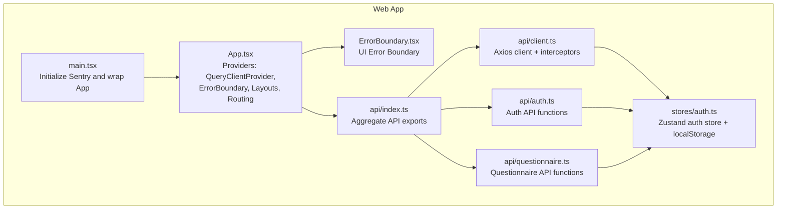
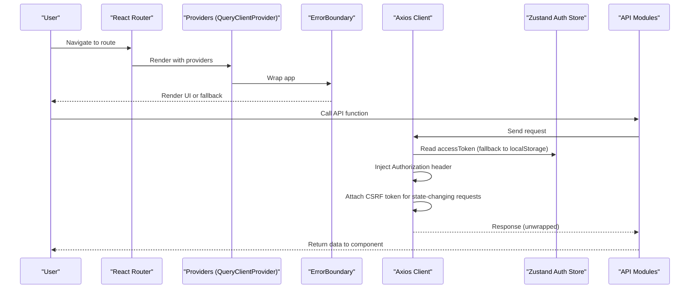
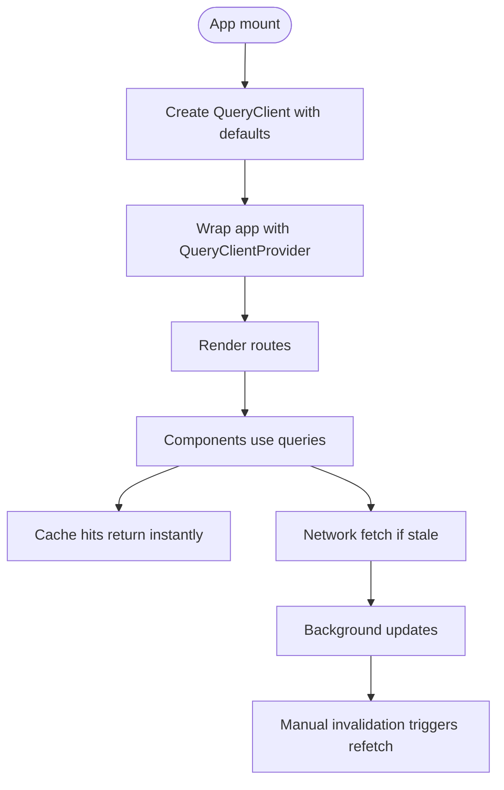
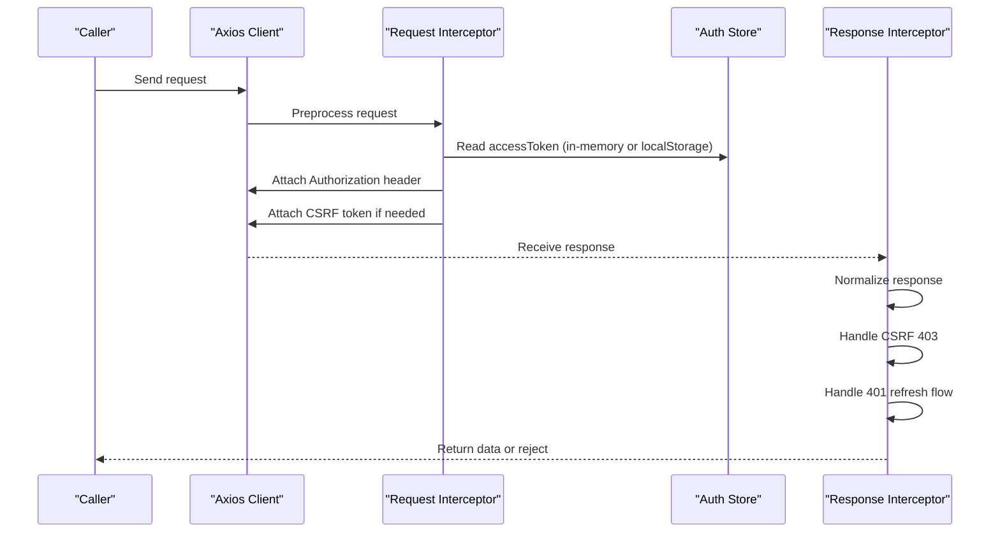
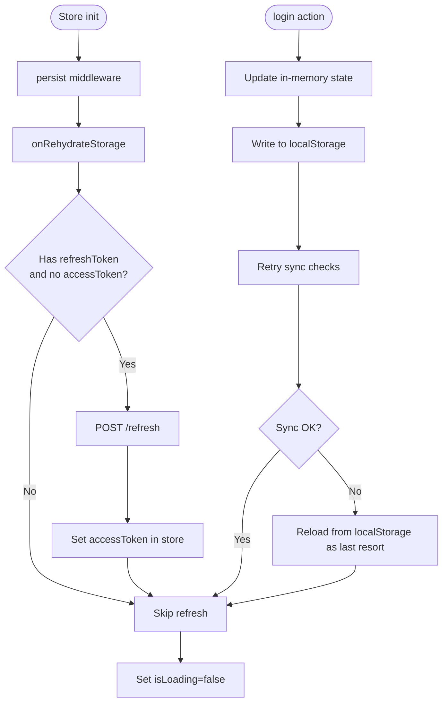
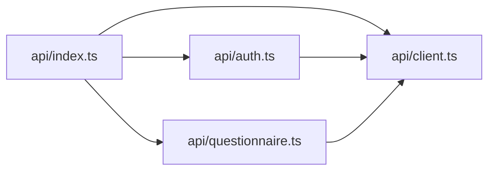
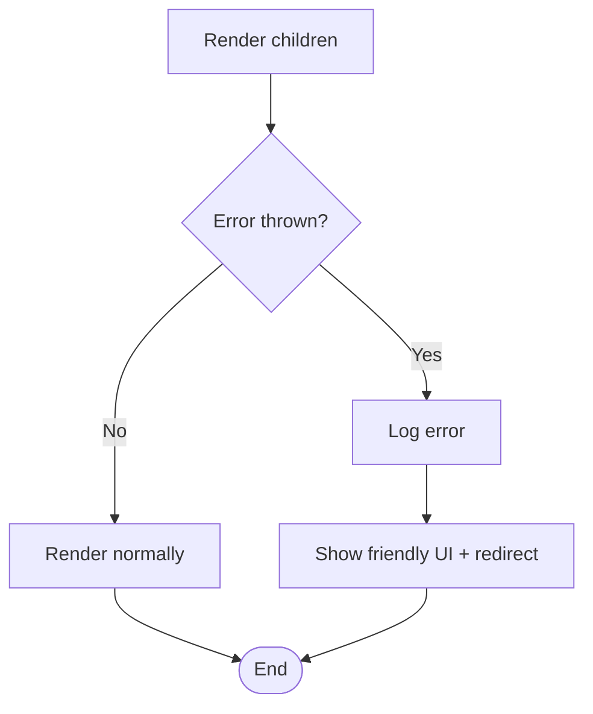
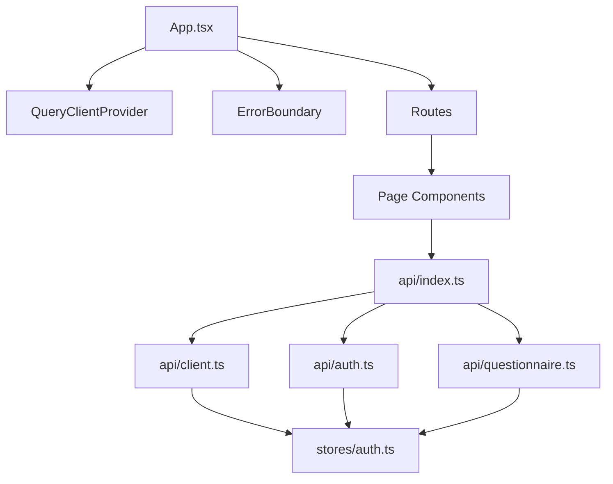

# State Management Integration

<cite>
**Referenced Files in This Document**
- [App.tsx](file://apps/web/src/App.tsx)
- [main.tsx](file://apps/web/src/main.tsx)
- [ErrorBoundary.tsx](file://apps/web/src/components/ErrorBoundary.tsx)
- [client.ts](file://apps/web/src/api/client.ts)
- [auth.ts](file://apps/web/src/api/auth.ts)
- [questionnaire.ts](file://apps/web/src/api/questionnaire.ts)
- [auth.ts](file://apps/web/src/stores/auth.ts)
- [index.ts](file://apps/web/src/api/index.ts)
</cite>

## Table of Contents
1. [Introduction](#introduction)
2. [Project Structure](#project-structure)
3. [Core Components](#core-components)
4. [Architecture Overview](#architecture-overview)
5. [Detailed Component Analysis](#detailed-component-analysis)
6. [Dependency Analysis](#dependency-analysis)
7. [Performance Considerations](#performance-considerations)
8. [Troubleshooting Guide](#troubleshooting-guide)
9. [Conclusion](#conclusion)

## Introduction
This document explains how state management integrates with API services in the web application. It covers:
- React Query integration for caching, background updates, and data synchronization
- Cache management strategies, invalidation patterns, and optimistic update implementations
- Integration between API services and React stores, including state hydration and persistence
- Error boundary integration, loading state management, and optimistic UI patterns
- Examples of cache configuration, query invalidation, and state synchronization across components
- Relationship with local storage and session storage for data persistence

## Project Structure
The web application initializes React Query globally and wraps the routing tree with providers. Authentication state is persisted in localStorage via a Zustand store, while Axios interceptors manage tokens and CSRF protection. API modules encapsulate service functions for different domains (auth, questionnaire, etc.).

**Diagram sources**
- [main.tsx:1-23](file://apps/web/src/main.tsx#L1-L23)
- [App.tsx:1-284](file://apps/web/src/App.tsx#L1-L284)
- [ErrorBoundary.tsx:1-71](file://apps/web/src/components/ErrorBoundary.tsx#L1-L71)
- [index.ts:1-14](file://apps/web/src/api/index.ts#L1-L14)
- [client.ts:1-326](file://apps/web/src/api/client.ts#L1-L326)
- [auth.ts:1-101](file://apps/web/src/api/auth.ts#L1-L101)
- [questionnaire.ts:1-476](file://apps/web/src/api/questionnaire.ts#L1-L476)
- [auth.ts:1-173](file://apps/web/src/stores/auth.ts#L1-L173)

**Section sources**
- [App.tsx:138-147](file://apps/web/src/App.tsx#L138-L147)
- [main.tsx:16-22](file://apps/web/src/main.tsx#L16-L22)
- [index.ts:1-14](file://apps/web/src/api/index.ts#L1-L14)

## Core Components
- React Query client configured with default query options (retry, staleTime, refetchOnWindowFocus).
- Axios client with request/response interceptors for auth token injection, CSRF handling, and automatic token refresh.
- Zustand auth store with localStorage persistence and hydration logic.
- API modules exporting typed functions for domain-specific operations.
- Error boundary for graceful error handling and user redirection.

**Section sources**
- [App.tsx:138-147](file://apps/web/src/App.tsx#L138-L147)
- [client.ts:95-102](file://apps/web/src/api/client.ts#L95-L102)
- [client.ts:160-198](file://apps/web/src/api/client.ts#L160-L198)
- [client.ts:200-323](file://apps/web/src/api/client.ts#L200-L323)
- [auth.ts:54-172](file://apps/web/src/stores/auth.ts#L54-L172)
- [auth.ts:150-169](file://apps/web/src/stores/auth.ts#L150-L169)
- [auth.ts:108-123](file://apps/web/src/stores/auth.ts#L108-L123)
- [auth.ts:27-35](file://apps/web/src/stores/auth.ts#L27-L35)
- [client.ts:20-31](file://apps/web/src/api/client.ts#L20-L31)
- [auth.ts:1-101](file://apps/web/src/api/auth.ts#L1-L101)
- [questionnaire.ts:1-476](file://apps/web/src/api/questionnaire.ts#L1-L476)

## Architecture Overview
The application composes providers and routes, enabling React Query caching and background updates, while Axios manages authentication and CSRF. The auth store persists tokens and hydrates state on startup, ensuring requests are authorized and CSRF tokens are present.

**Diagram sources**
- [App.tsx:194](file://apps/web/src/App.tsx#L194)
- [client.ts:160-198](file://apps/web/src/api/client.ts#L160-L198)
- [client.ts:200-323](file://apps/web/src/api/client.ts#L200-L323)
- [auth.ts:108-133](file://apps/web/src/stores/auth.ts#L108-L133)
- [auth.ts:150-169](file://apps/web/src/stores/auth.ts#L150-L169)

## Detailed Component Analysis

### React Query Integration
- Global client creation with defaultOptions configuring retry behavior, staleTime, and window focus refetch behavior.
- Provider wrapping the routing tree to enable caching and background updates across the app.

**Diagram sources**
- [App.tsx:138-147](file://apps/web/src/App.tsx#L138-L147)
- [App.tsx:194](file://apps/web/src/App.tsx#L194)

**Section sources**
- [App.tsx:138-147](file://apps/web/src/App.tsx#L138-L147)
- [App.tsx:194](file://apps/web/src/App.tsx#L194)

### Axios Client and Interceptors
- Axios client configured with baseURL resolution, credentials, and timeout.
- Request interceptor:
  - Waits for auth hydration to avoid 401 on initial load.
  - Injects Authorization header using in-memory store or localStorage fallback.
  - Adds CSRF token for state-changing requests, fetching from cookie or server.
- Response interceptor:
  - Normalizes wrapped responses to data-only.
  - Handles CSRF token errors by refetching and retrying.
  - Handles 401 by attempting token refresh with concurrency guard and subscriber queue.
  - On refresh failure, clears auth state and redirects to login.

**Diagram sources**
- [client.ts:160-198](file://apps/web/src/api/client.ts#L160-L198)
- [client.ts:200-323](file://apps/web/src/api/client.ts#L200-L323)
- [auth.ts:108-133](file://apps/web/src/stores/auth.ts#L108-L133)

**Section sources**
- [client.ts:95-102](file://apps/web/src/api/client.ts#L95-L102)
- [client.ts:160-198](file://apps/web/src/api/client.ts#L160-L198)
- [client.ts:200-323](file://apps/web/src/api/client.ts#L200-L323)
- [auth.ts:108-133](file://apps/web/src/stores/auth.ts#L108-L133)

### Auth Store and Persistence
- Zustand store with localStorage persistence and selective partialization.
- Hydration logic:
  - Logs rehydration errors.
  - Proactively refreshes access token if refresh token exists but access token is missing.
  - Sets loading state to false after hydration.
- Login action:
  - Updates in-memory state immediately.
  - Forces localStorage write for synchronization.
  - Validates synchronization with retries and falls back to localStorage reload if needed.

**Diagram sources**
- [auth.ts:54-172](file://apps/web/src/stores/auth.ts#L54-L172)
- [auth.ts:150-169](file://apps/web/src/stores/auth.ts#L150-L169)
- [auth.ts:108-123](file://apps/web/src/stores/auth.ts#L108-L123)

**Section sources**
- [auth.ts:54-172](file://apps/web/src/stores/auth.ts#L54-L172)
- [auth.ts:150-169](file://apps/web/src/stores/auth.ts#L150-L169)
- [auth.ts:108-123](file://apps/web/src/stores/auth.ts#L108-L123)

### API Modules and Domain Services
- Centralized exports for API modules to simplify imports across the app.
- Example modules:
  - Auth API: registration, login, logout, profile, password reset.
  - Questionnaire API: sessions, scoring, heatmaps, decisions, evidence, QPG prompts, policy pack generation.

**Diagram sources**
- [index.ts:1-14](file://apps/web/src/api/index.ts#L1-L14)
- [client.ts:1-326](file://apps/web/src/api/client.ts#L1-L326)
- [auth.ts:1-101](file://apps/web/src/api/auth.ts#L1-L101)
- [questionnaire.ts:1-476](file://apps/web/src/api/questionnaire.ts#L1-L476)

**Section sources**
- [index.ts:1-14](file://apps/web/src/api/index.ts#L1-L14)
- [auth.ts:1-101](file://apps/web/src/api/auth.ts#L1-L101)
- [questionnaire.ts:1-476](file://apps/web/src/api/questionnaire.ts#L1-L476)

### Error Boundary Integration
- UI-level error boundary logs caught errors and renders a friendly message with a navigation button.
- Application bootstrapped with Sentry error boundary to capture runtime errors globally.

**Diagram sources**
- [ErrorBoundary.tsx:13-71](file://apps/web/src/components/ErrorBoundary.tsx#L13-L71)
- [main.tsx:16-22](file://apps/web/src/main.tsx#L16-L22)

**Section sources**
- [ErrorBoundary.tsx:13-71](file://apps/web/src/components/ErrorBoundary.tsx#L13-L71)
- [main.tsx:16-22](file://apps/web/src/main.tsx#L16-L22)

## Dependency Analysis
The following diagram shows how providers, interceptors, stores, and API modules depend on each other.

**Diagram sources**
- [App.tsx:194](file://apps/web/src/App.tsx#L194)
- [index.ts:1-14](file://apps/web/src/api/index.ts#L1-L14)
- [client.ts:1-326](file://apps/web/src/api/client.ts#L1-L326)
- [auth.ts:1-101](file://apps/web/src/api/auth.ts#L1-L101)
- [questionnaire.ts:1-476](file://apps/web/src/api/questionnaire.ts#L1-L476)
- [auth.ts:1-173](file://apps/web/src/stores/auth.ts#L1-L173)

**Section sources**
- [App.tsx:194](file://apps/web/src/App.tsx#L194)
- [index.ts:1-14](file://apps/web/src/api/index.ts#L1-L14)
- [client.ts:1-326](file://apps/web/src/api/client.ts#L1-L326)
- [auth.ts:1-173](file://apps/web/src/stores/auth.ts#L1-L173)

## Performance Considerations
- Stale-time tuning: Queries are configured with a 5-minute stale threshold to balance freshness and network usage.
- Retry strategy: Limited retries reduce redundant network calls under transient failures.
- Background updates: React Query’s default behavior keeps data fresh without manual polling.
- Interceptor efficiency: Token and CSRF retrieval are cached per process lifetime to minimize overhead.
- Hydration gating: Requests wait for auth hydration to avoid unnecessary 401 retries.

[No sources needed since this section provides general guidance]

## Troubleshooting Guide
Common issues and resolutions:
- 401 Unauthorized on initial load:
  - Cause: Request fires before auth hydration completes.
  - Resolution: The request interceptor waits for hydration; ensure the auth store is initialized before making requests.
- CSRF token errors:
  - Cause: Missing or expired CSRF token for state-changing requests.
  - Resolution: The interceptor fetches a new CSRF token and retries; verify cookie presence or server endpoint availability.
- Token refresh race conditions:
  - Cause: Multiple concurrent requests after token expiration.
  - Resolution: The interceptor uses a refresh guard and subscriber queue to serialize refresh and replay requests.
- Auth state desync:
  - Cause: In-memory state not reflecting localStorage.
  - Resolution: The login action writes to localStorage and validates synchronization with retries; if needed, the store reloads from localStorage.

**Section sources**
- [client.ts:139-158](file://apps/web/src/api/client.ts#L139-L158)
- [client.ts:222-242](file://apps/web/src/api/client.ts#L222-L242)
- [client.ts:244-319](file://apps/web/src/api/client.ts#L244-L319)
- [auth.ts:108-123](file://apps/web/src/stores/auth.ts#L108-L123)
- [auth.ts:150-169](file://apps/web/src/stores/auth.ts#L150-L169)

## Conclusion
The application integrates React Query for robust caching and background updates, Axios interceptors for secure and resilient API communication, and a Zustand store with localStorage persistence for reliable authentication state. Together, these components provide a solid foundation for state hydration, error handling, and optimistic UI patterns across the application.

[No sources needed since this section summarizes without analyzing specific files]