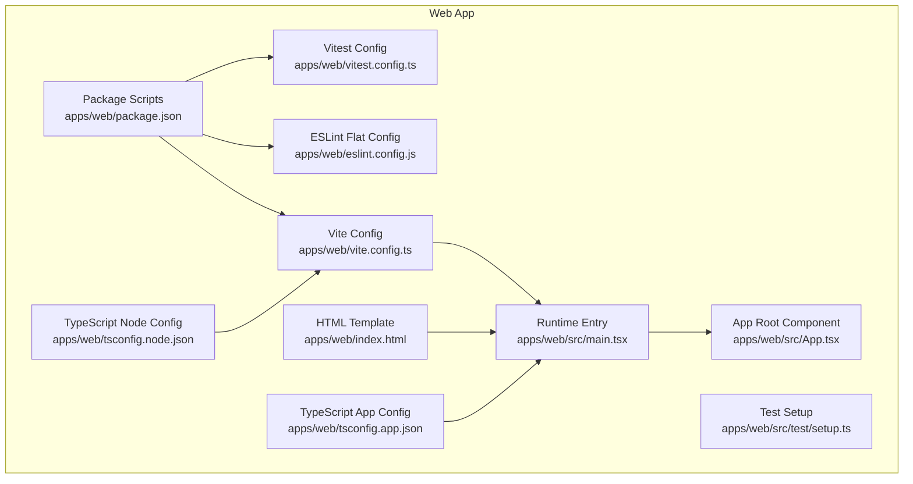
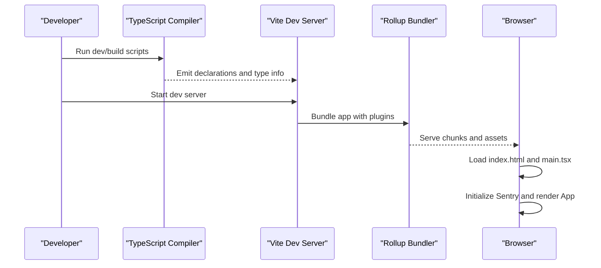
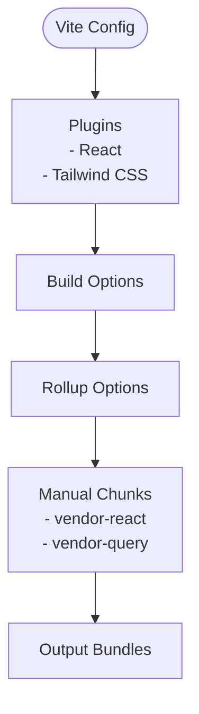
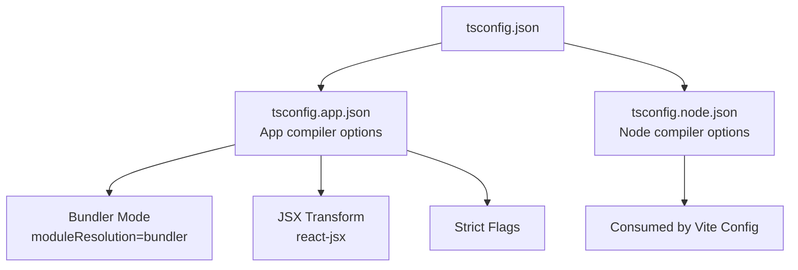
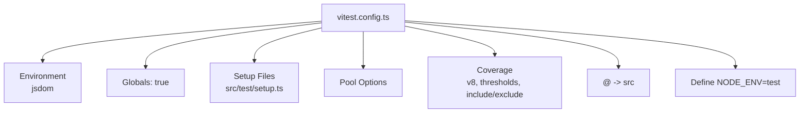
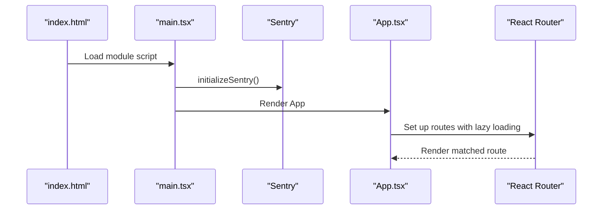
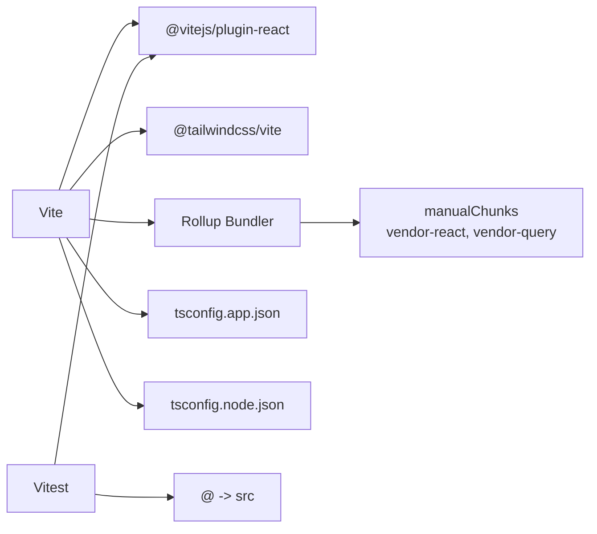

# Build Configuration

<cite>
**Referenced Files in This Document**
- [vite.config.ts](file://apps/web/vite.config.ts)
- [package.json](file://apps/web/package.json)
- [tsconfig.json](file://apps/web/tsconfig.json)
- [tsconfig.app.json](file://apps/web/tsconfig.app.json)
- [tsconfig.node.json](file://apps/web/tsconfig.node.json)
- [index.html](file://apps/web/index.html)
- [vitest.config.ts](file://apps/web/vitest.config.ts)
- [eslint.config.js](file://apps/web/eslint.config.js)
- [main.tsx](file://apps/web/src/main.tsx)
- [App.tsx](file://apps/web/src/App.tsx)
- [setup.ts](file://apps/web/src/test/setup.ts)
</cite>

## Table of Contents
1. [Introduction](#introduction)
2. [Project Structure](#project-structure)
3. [Core Components](#core-components)
4. [Architecture Overview](#architecture-overview)
5. [Detailed Component Analysis](#detailed-component-analysis)
6. [Dependency Analysis](#dependency-analysis)
7. [Performance Considerations](#performance-considerations)
8. [Troubleshooting Guide](#troubleshooting-guide)
9. [Conclusion](#conclusion)
10. [Appendices](#appendices)

## Introduction
This document describes the build configuration for the Vite 7-based React application in the web app. It covers the Vite configuration, plugins, build optimization, development server setup, TypeScript configuration, path aliases, compilation settings, code splitting, tree shaking, bundle analysis, development workflow (hot module replacement, environment variables), production build process, asset optimization, deployment preparation, HTML template configuration, meta tags, manifest settings, testing integration with Vite, and guidance for build performance optimization and troubleshooting.

## Project Structure
The web application build configuration centers around the Vite configuration file, TypeScript configurations, ESLint flat config, and Vitest configuration. The HTML template defines the runtime entry and meta tags. The package scripts orchestrate development, building, previewing, linting, and testing.

**Diagram sources**
- [vite.config.ts](file://apps/web/vite.config.ts)
- [package.json](file://apps/web/package.json)
- [tsconfig.app.json](file://apps/web/tsconfig.app.json)
- [tsconfig.node.json](file://apps/web/tsconfig.node.json)
- [index.html](file://apps/web/index.html)
- [eslint.config.js](file://apps/web/eslint.config.js)
- [vitest.config.ts](file://apps/web/vitest.config.ts)
- [main.tsx](file://apps/web/src/main.tsx)
- [App.tsx](file://apps/web/src/App.tsx)
- [setup.ts](file://apps/web/src/test/setup.ts)

**Section sources**
- [vite.config.ts:1-19](file://apps/web/vite.config.ts#L1-L19)
- [package.json:1-75](file://apps/web/package.json#L1-L75)
- [tsconfig.json:1-8](file://apps/web/tsconfig.json#L1-L8)
- [tsconfig.app.json:1-42](file://apps/web/tsconfig.app.json#L1-L42)
- [tsconfig.node.json:1-27](file://apps/web/tsconfig.node.json#L1-L27)
- [index.html:1-20](file://apps/web/index.html#L1-L20)
- [eslint.config.js:1-44](file://apps/web/eslint.config.js#L1-L44)
- [vitest.config.ts:1-45](file://apps/web/vitest.config.ts#L1-L45)
- [main.tsx:1-23](file://apps/web/src/main.tsx#L1-L23)
- [App.tsx:1-284](file://apps/web/src/App.tsx#L1-L284)
- [setup.ts:1-72](file://apps/web/src/test/setup.ts#L1-L72)

## Core Components
- Vite configuration: Defines plugins, build optimization via Rollup manual chunks, and development server defaults.
- TypeScript configuration: Two configs for app and node contexts, with bundler mode and strictness settings.
- ESLint flat config: Shared linting rules for TypeScript and React Refresh.
- Vitest configuration: Test environment, coverage, path alias, and setup files.
- HTML template: Base HTML with meta tags, preconnect links, and script entry.

Key responsibilities:
- Vite: Plugin pipeline (React and Tailwind), build chunking, dev server defaults.
- TypeScript: Module resolution, JSX transform, strictness, and bundler mode.
- ESLint: Consistent linting across the codebase.
- Vitest: Unit/integration testing with jsdom, coverage, and path aliasing.
- HTML: Runtime bootstrap and meta configuration.

**Section sources**
- [vite.config.ts:1-19](file://apps/web/vite.config.ts#L1-L19)
- [tsconfig.app.json:1-42](file://apps/web/tsconfig.app.json#L1-L42)
- [tsconfig.node.json:1-27](file://apps/web/tsconfig.node.json#L1-L27)
- [eslint.config.js:1-44](file://apps/web/eslint.config.js#L1-L44)
- [vitest.config.ts:1-45](file://apps/web/vitest.config.ts#L1-L45)
- [index.html:1-20](file://apps/web/index.html#L1-L20)

## Architecture Overview
The build pipeline integrates TypeScript compilation, Vite’s dev server and bundler, and testing. The React application initializes Sentry early, then mounts the root component. Routing leverages lazy loading for code splitting.

**Diagram sources**
- [package.json:6-16](file://apps/web/package.json#L6-L16)
- [vite.config.ts:6-18](file://apps/web/vite.config.ts#L6-L18)
- [main.tsx:8-22](file://apps/web/src/main.tsx#L8-L22)
- [index.html:15-17](file://apps/web/index.html#L15-L17)

## Detailed Component Analysis

### Vite Configuration
- Plugins:
  - React plugin for Fast Refresh and JSX transform.
  - Tailwind CSS plugin for styling.
- Build optimization:
  - Manual chunks separate vendor libraries into named bundles for caching and load performance.
- Development server:
  - Defaults configured by Vite; no explicit overrides present.

**Diagram sources**
- [vite.config.ts:6-18](file://apps/web/vite.config.ts#L6-L18)

**Section sources**
- [vite.config.ts:1-19](file://apps/web/vite.config.ts#L1-L19)

### TypeScript Configuration
- tsconfig.json:
  - References app and node configs for a dual-target setup.
- tsconfig.app.json:
  - Targets modern JS environments, uses bundler module resolution, JSX transform for React, strictness flags, and excludes test files from emit.
- tsconfig.node.json:
  - Targets Node-side config file consumption by Vite.

**Diagram sources**
- [tsconfig.json:1-8](file://apps/web/tsconfig.json#L1-L8)
- [tsconfig.app.json:1-42](file://apps/web/tsconfig.app.json#L1-L42)
- [tsconfig.node.json:1-27](file://apps/web/tsconfig.node.json#L1-L27)

**Section sources**
- [tsconfig.json:1-8](file://apps/web/tsconfig.json#L1-L8)
- [tsconfig.app.json:1-42](file://apps/web/tsconfig.app.json#L1-L42)
- [tsconfig.node.json:1-27](file://apps/web/tsconfig.node.json#L1-L27)

### ESLint Configuration
- Uses ESLint flat config with recommended sets for TypeScript, React Hooks, React Refresh, and Vite-specific rules.
- Custom rules adjust warnings for compatibility and maintainability.

**Section sources**
- [eslint.config.js:1-44](file://apps/web/eslint.config.js#L1-L44)

### Vitest Configuration
- Test environment:
  - Global setup, jsdom environment, extended matchers for accessibility and DOM assertions.
- Coverage:
  - Provider v8, reporters, thresholds, and inclusion/exclusion patterns.
- Path alias:
  - Alias @ mapped to src for concise imports.
- Environment definition:
  - NODE_ENV forced to test for deterministic behavior.

**Diagram sources**
- [vitest.config.ts:5-44](file://apps/web/vitest.config.ts#L5-L44)
- [setup.ts:1-72](file://apps/web/src/test/setup.ts#L1-L72)

**Section sources**
- [vitest.config.ts:1-45](file://apps/web/vitest.config.ts#L1-L45)
- [setup.ts:1-72](file://apps/web/src/test/setup.ts#L1-L72)

### HTML Template and Meta Tags
- Base HTML includes:
  - Charset, viewport, preconnect for fonts, Inter font stylesheet, and favicon.
  - Root div for mounting and module script pointing to the main entry.
- No manifest is defined in the template.

**Section sources**
- [index.html:1-20](file://apps/web/index.html#L1-L20)

### Application Entry and Routing
- main.tsx:
  - Initializes Sentry before rendering.
  - Creates root and renders the App inside StrictMode with SentryErrorBoundary.
- App.tsx:
  - Sets up React Query client with retry and stale timing.
  - Implements lazy-loaded route components for code splitting.
  - Provides protected/public route wrappers and navigation guards.

**Diagram sources**
- [index.html:15-17](file://apps/web/index.html#L15-L17)
- [main.tsx:8-22](file://apps/web/src/main.tsx#L8-L22)
- [App.tsx:138-187](file://apps/web/src/App.tsx#L138-L187)

**Section sources**
- [main.tsx:1-23](file://apps/web/src/main.tsx#L1-L23)
- [App.tsx:1-284](file://apps/web/src/App.tsx#L1-L284)

## Dependency Analysis
- Vite depends on:
  - React plugin for JSX and Fast Refresh.
  - Tailwind CSS plugin for styling.
- Build output is controlled via Rollup manualChunks to split vendor libraries.
- TypeScript configs are consumed by Vite and the CLI for type checking and bundling.
- Vitest consumes the React plugin and aliases to align with the app’s imports.

**Diagram sources**
- [vite.config.ts:6-18](file://apps/web/vite.config.ts#L6-L18)
- [tsconfig.app.json:1-42](file://apps/web/tsconfig.app.json#L1-L42)
- [tsconfig.node.json:1-27](file://apps/web/tsconfig.node.json#L1-L27)
- [vitest.config.ts:36-40](file://apps/web/vitest.config.ts#L36-L40)

**Section sources**
- [vite.config.ts:1-19](file://apps/web/vite.config.ts#L1-L19)
- [tsconfig.app.json:1-42](file://apps/web/tsconfig.app.json#L1-L42)
- [tsconfig.node.json:1-27](file://apps/web/tsconfig.node.json#L1-L27)
- [vitest.config.ts:1-45](file://apps/web/vitest.config.ts#L1-L45)

## Performance Considerations
- Code splitting:
  - Lazy-loaded route components reduce initial bundle size.
- Manual chunks:
  - Vendor libraries grouped under dedicated chunk names improve caching and parallel loading.
- Tree shaking:
  - Enabled by default in Vite with ES modules and bundler module resolution.
- Asset optimization:
  - Tailwind CSS plugin is included; ensure Purge/Tree Shake settings are aligned with production builds.
- Build performance:
  - Use incremental builds and keep plugins minimal.
  - Prefer externalizing large dependencies if network allows.
- Bundle analysis:
  - Integrate a Rollup plugin for bundle visualization during development or CI.

[No sources needed since this section provides general guidance]

## Troubleshooting Guide
- Vite dev server not starting:
  - Verify port availability and plugin compatibility.
- React Fast Refresh issues:
  - Confirm React plugin is enabled and component boundaries are correct.
- TypeScript errors in Vite:
  - Ensure tsconfig references are correct and bundler mode is used.
- Vitest test failures:
  - Check jsdom environment, setup files, and path alias alignment.
- Sentry initialization:
  - Confirm Sentry DSN and initialization order in main entry.

**Section sources**
- [package.json:6-16](file://apps/web/package.json#L6-L16)
- [vite.config.ts:6-18](file://apps/web/vite.config.ts#L6-L18)
- [tsconfig.app.json:17-23](file://apps/web/tsconfig.app.json#L17-L23)
- [vitest.config.ts:8-18](file://apps/web/vitest.config.ts#L8-L18)
- [main.tsx:8-9](file://apps/web/src/main.tsx#L8-L9)

## Conclusion
The Vite 7-based React application employs a clean, modular build configuration with deliberate code splitting, vendor chunking, and strong TypeScript integration. The setup supports a robust development workflow with Fast Refresh, comprehensive testing via Vitest, and a streamlined production build. Aligning Tailwind CSS and ensuring production-ready asset optimization will further enhance performance and maintainability.

[No sources needed since this section summarizes without analyzing specific files]

## Appendices

### Development Workflow
- Scripts:
  - dev, build, preview, lint, test, test:watch, test:ui, test:cov.
- Environment variables:
  - Not explicitly configured in Vite; use .env files or define in build scripts as needed.
- Proxy configuration:
  - Not configured in Vite; add server.proxy if API requests require forwarding.

**Section sources**
- [package.json:6-16](file://apps/web/package.json#L6-L16)
- [vite.config.ts:6-18](file://apps/web/vite.config.ts#L6-L18)

### Production Build and Deployment Preparation
- Build command:
  - TypeScript build followed by Vite build ensures type-checked assets.
- Output:
  - Vite emits optimized static assets; ensure CDN and cache headers are configured.
- Manifest and PWA:
  - No manifest is defined in the template; add if Progressive Web App support is desired.

**Section sources**
- [package.json:8](file://apps/web/package.json#L8)
- [index.html:12](file://apps/web/index.html#L12)

### Testing Integration with Vite
- Test environment:
  - jsdom, globals enabled, setup files for DOM and accessibility assertions.
- Coverage:
  - v8 provider with thresholds and selective inclusion/exclusion.
- Aliasing:
  - @ alias resolves to src for consistent imports.

**Section sources**
- [vitest.config.ts:7-35](file://apps/web/vitest.config.ts#L7-L35)
- [vitest.config.ts:36-40](file://apps/web/vitest.config.ts#L36-L40)
- [setup.ts:1-72](file://apps/web/src/test/setup.ts#L1-L72)