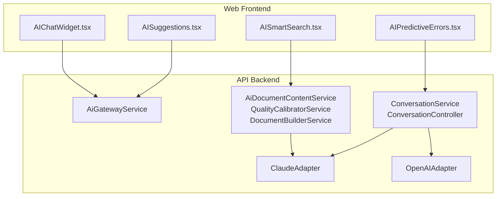
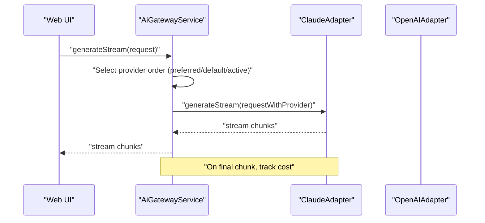
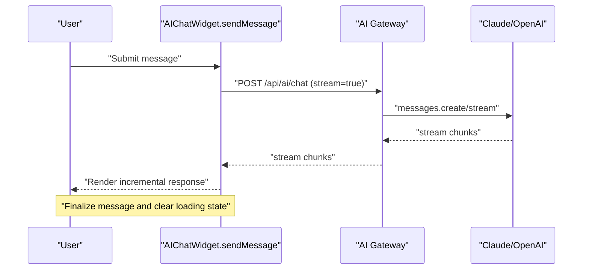
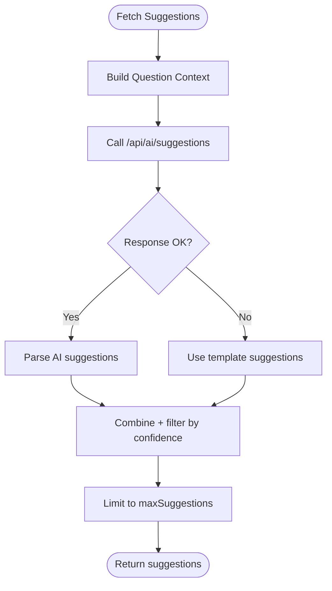
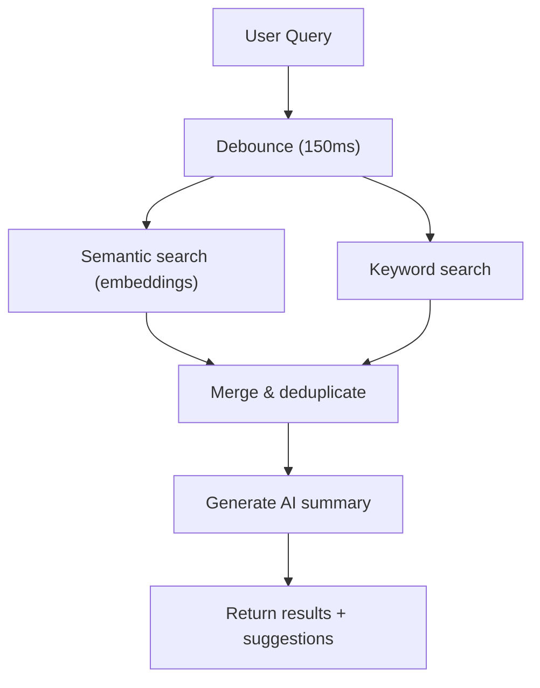
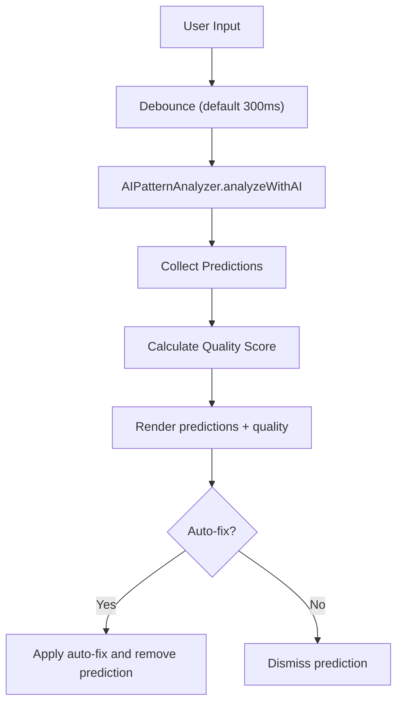
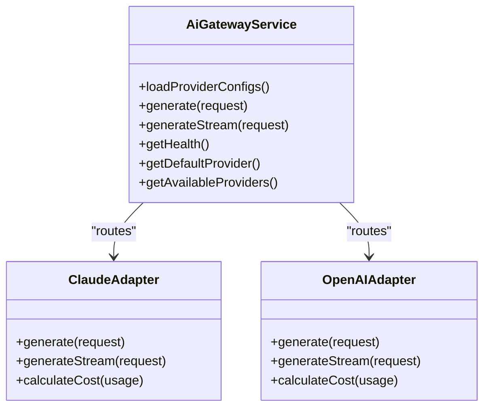
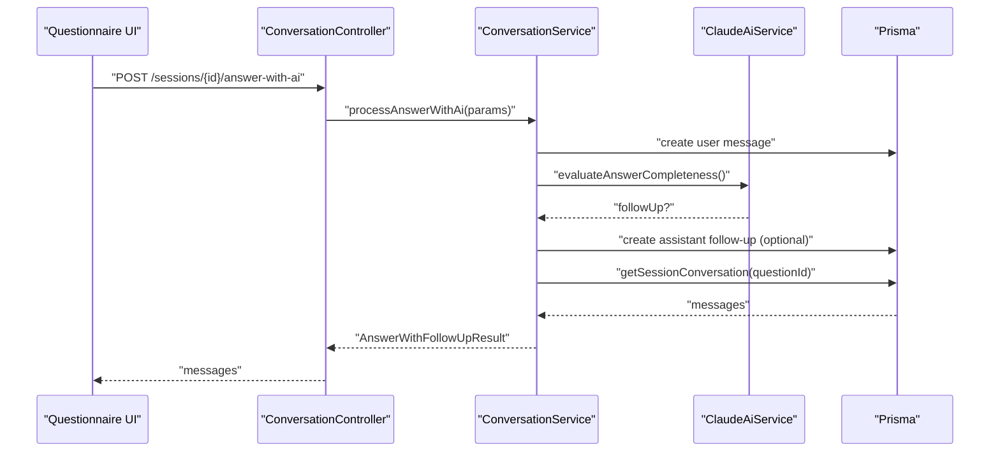
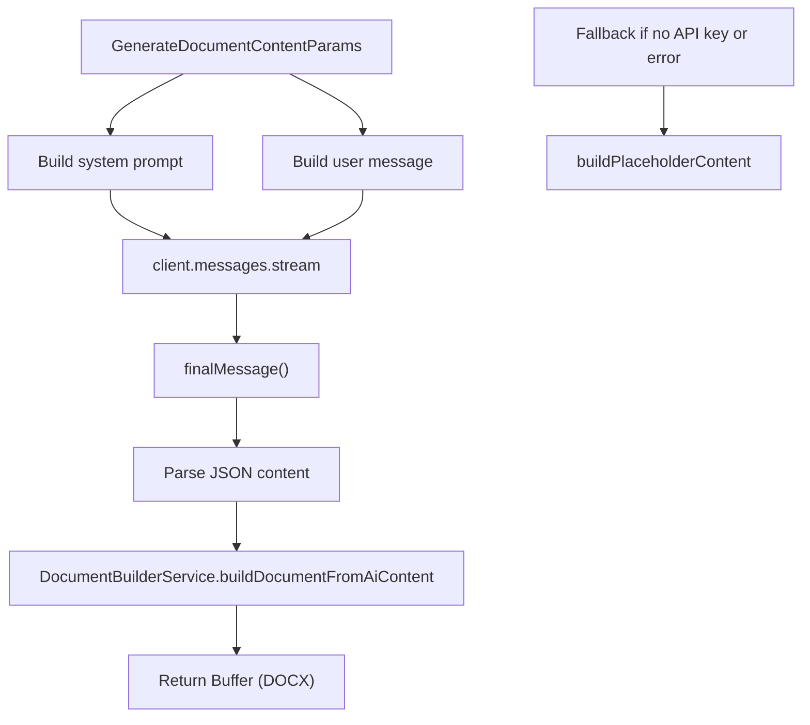
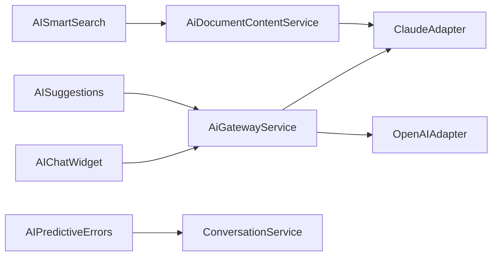

# AI Integration Components

<cite>
**Referenced Files in This Document**
- [AIChatWidget.tsx](file://apps/web/src/components/ai/AIChatWidget.tsx)
- [AISuggestions.tsx](file://apps/web/src/components/ai/AISuggestions.tsx)
- [AISmartSearch.tsx](file://apps/web/src/components/ai/AISmartSearch.tsx)
- [AIPredictiveErrors.tsx](file://apps/web/src/components/ai/AIPredictiveErrors.tsx)
- [index.ts](file://apps/web/src/components/ai/index.ts)
- [ai-gateway.module.ts](file://apps/api/src/modules/ai-gateway/ai-gateway.module.ts)
- [ai-gateway.service.ts](file://apps/api/src/modules/ai-gateway/ai-gateway.service.ts)
- [claude.adapter.ts](file://apps/api/src/modules/ai-gateway/adapters/claude.adapter.ts)
- [openai.adapter.ts](file://apps/api/src/modules/ai-gateway/adapters/openai.adapter.ts)
- [conversation.controller.ts](file://apps/api/src/modules/session/controllers/conversation.controller.ts)
- [conversation.service.ts](file://apps/api/src/modules/session/services/conversation.service.ts)
- [ai-document-content.service.ts](file://apps/api/src/modules/document-generator/services/ai-document-content.service.ts)
- [quality-calibrator.service.ts](file://apps/api/src/modules/document-generator/services/quality-calibrator.service.ts)
- [document-builder.service.ts](file://apps/api/src/modules/document-generator/services/document-builder.service.ts)
- [PHASE-03-ai-gateway.md](file://docs/phase-kits/PHASE-03-ai-gateway.md)
</cite>

## Table of Contents
1. [Introduction](#introduction)
2. [Project Structure](#project-structure)
3. [Core Components](#core-components)
4. [Architecture Overview](#architecture-overview)
5. [Detailed Component Analysis](#detailed-component-analysis)
6. [Dependency Analysis](#dependency-analysis)
7. [Performance Considerations](#performance-considerations)
8. [Troubleshooting Guide](#troubleshooting-guide)
9. [Conclusion](#conclusion)

## Introduction
This document explains the AI integration components powering intelligent assistance in the Quiz-to-Build platform. It covers four primary UI components—AIChatWidget, AISuggestions, AISmartSearch, and AIPredictiveErrors—and the backend AI Gateway that orchestrates provider-agnostic AI interactions. It also documents real-time streaming, response processing, provider configuration, prompt engineering, content filtering, error handling, fallback mechanisms, user control, privacy considerations, and practical AI-assisted workflows.

## Project Structure
The AI integration spans the frontend React components and the NestJS backend modules:
- Frontend AI components under apps/web/src/components/ai
- Backend AI Gateway under apps/api/src/modules/ai-gateway
- Session-based AI chat under apps/api/src/modules/session
- Document generation AI under apps/api/src/modules/document-generator

**Diagram sources**
- [AIChatWidget.tsx:1-905](file://apps/web/src/components/ai/AIChatWidget.tsx#L1-L905)
- [AISuggestions.tsx:1-564](file://apps/web/src/components/ai/AISuggestions.tsx#L1-L564)
- [AISmartSearch.tsx:1-823](file://apps/web/src/components/ai/AISmartSearch.tsx#L1-L823)
- [AIPredictiveErrors.tsx:1-982](file://apps/web/src/components/ai/AIPredictiveErrors.tsx#L1-L982)
- [ai-gateway.service.ts:1-332](file://apps/api/src/modules/ai-gateway/ai-gateway.service.ts#L1-L332)
- [claude.adapter.ts:1-283](file://apps/api/src/modules/ai-gateway/adapters/claude.adapter.ts#L1-L283)
- [openai.adapter.ts:1-310](file://apps/api/src/modules/ai-gateway/adapters/openai.adapter.ts#L1-L310)
- [conversation.service.ts:1-101](file://apps/api/src/modules/session/services/conversation.service.ts#L1-L101)
- [ai-document-content.service.ts:1-359](file://apps/api/src/modules/document-generator/services/ai-document-content.service.ts#L1-L359)

**Section sources**
- [index.ts:1-8](file://apps/web/src/components/ai/index.ts#L1-L8)
- [ai-gateway.module.ts:1-26](file://apps/api/src/modules/ai-gateway/ai-gateway.module.ts#L1-L26)

## Core Components
- AIChatWidget: Real-time chat assistant with streaming responses, context-aware prompts, and quick actions.
- AISuggestions: AI-powered answer suggestions with confidence, reasoning, and standard references.
- AISmartSearch: Semantic search with embeddings, AI summaries, and related topics.
- AIPredictiveErrors: Predictive input validation with AI pattern analysis and auto-fix suggestions.

Each component exposes a React Context Provider and UI components, enabling user-driven AI features with granular configuration and user control.

**Section sources**
- [AIChatWidget.tsx:1-905](file://apps/web/src/components/ai/AIChatWidget.tsx#L1-L905)
- [AISuggestions.tsx:1-564](file://apps/web/src/components/ai/AISuggestions.tsx#L1-L564)
- [AISmartSearch.tsx:1-823](file://apps/web/src/components/ai/AISmartSearch.tsx#L1-L823)
- [AIPredictiveErrors.tsx:1-982](file://apps/web/src/components/ai/AIPredictiveErrors.tsx#L1-L982)

## Architecture Overview
The AI Gateway provides a provider-agnostic layer routing requests to Claude or OpenAI. It supports streaming, JSON mode, cost tracking, and automatic fallback. The session chat integrates AI for follow-up evaluation, while document generation uses Claude with structured prompts and quality calibration.

**Diagram sources**
- [ai-gateway.service.ts:190-258](file://apps/api/src/modules/ai-gateway/ai-gateway.service.ts#L190-L258)
- [claude.adapter.ts:177-252](file://apps/api/src/modules/ai-gateway/adapters/claude.adapter.ts#L177-L252)
- [openai.adapter.ts:204-279](file://apps/api/src/modules/ai-gateway/adapters/openai.adapter.ts#L204-L279)

## Detailed Component Analysis

### AIChatWidget
- Purpose: Context-aware chat assistant with streaming responses and quick actions.
- Real-time interaction: Streams tokens via fetch with text/event-stream parsing, updates assistant message incrementally.
- Configuration: Accepts endpoint, model, max tokens, temperature, and system prompt; merges with defaults.
- Context building: Builds a contextual system message from page context (page, section, dimension, progress, score).
- Error handling: Displays user-friendly error messages and marks messages as errored; clears on retry.

**Diagram sources**
- [AIChatWidget.tsx:165-302](file://apps/web/src/components/ai/AIChatWidget.tsx#L165-L302)
- [ai-gateway.service.ts:190-258](file://apps/api/src/modules/ai-gateway/ai-gateway.service.ts#L190-L258)

**Section sources**
- [AIChatWidget.tsx:1-905](file://apps/web/src/components/ai/AIChatWidget.tsx#L1-L905)

### AISuggestions
- Purpose: Provide AI answer suggestions with confidence, reasoning, and standard references.
- Fallback: On API failure, falls back to template-based suggestions.
- Configuration: Endpoint, API key, max suggestions, min confidence, and toggles for templates/history.
- Composition: Combines AI suggestions with templates, filters by confidence, and deduplicates.

**Diagram sources**
- [AISuggestions.tsx:186-248](file://apps/web/src/components/ai/AISuggestions.tsx#L186-L248)

**Section sources**
- [AISuggestions.tsx:1-564](file://apps/web/src/components/ai/AISuggestions.tsx#L1-L564)

### AISmartSearch
- Purpose: Semantic search with embeddings, keyword search, AI summaries, and related topics.
- Embeddings: Mock embedding service simulates vectors; in production, call embeddings API.
- Search pipeline: Debounced search, semantic similarity, keyword matching, merging, deduplication.
- AI summary: Generates a concise summary with key points and related topics.

**Diagram sources**
- [AISmartSearch.tsx:246-303](file://apps/web/src/components/ai/AISmartSearch.tsx#L246-L303)

**Section sources**
- [AISmartSearch.tsx:1-823](file://apps/web/src/components/ai/AISmartSearch.tsx#L1-L823)

### AIPredictiveErrors
- Purpose: Predictive error prevention with AI pattern analysis and auto-fix suggestions.
- Analysis: Runs default validation rules plus AI pattern detection (hidden chars, placeholders, incomplete URLs).
- Quality calculation: Computes a quality score based on prediction severities.
- Auto-fix: Applies safe fixes and removes dismissed predictions.

**Diagram sources**
- [AIPredictiveErrors.tsx:499-547](file://apps/web/src/components/ai/AIPredictiveErrors.tsx#L499-L547)

**Section sources**
- [AIPredictiveErrors.tsx:1-982](file://apps/web/src/components/ai/AIPredictiveErrors.tsx#L1-L982)

### AI Gateway Integration Patterns
- Provider abstraction: AiGatewayService loads provider configs, selects adapters, and manages fallback order.
- Streaming: generateStream yields chunks from the first available provider; tracks cost on final chunk.
- JSON mode: OpenAI adapter supports JSON mode for structured outputs.
- Health checks: Reports availability per provider and overall gateway status.

**Diagram sources**
- [ai-gateway.service.ts:1-332](file://apps/api/src/modules/ai-gateway/ai-gateway.service.ts#L1-L332)
- [claude.adapter.ts:1-283](file://apps/api/src/modules/ai-gateway/adapters/claude.adapter.ts#L1-L283)
- [openai.adapter.ts:1-310](file://apps/api/src/modules/ai-gateway/adapters/openai.adapter.ts#L1-L310)

**Section sources**
- [ai-gateway.service.ts:1-332](file://apps/api/src/modules/ai-gateway/ai-gateway.service.ts#L1-L332)
- [claude.adapter.ts:1-283](file://apps/api/src/modules/ai-gateway/adapters/claude.adapter.ts#L1-L283)
- [openai.adapter.ts:1-310](file://apps/api/src/modules/ai-gateway/adapters/openai.adapter.ts#L1-L310)

### Session-Based AI Chat (Follow-ups)
- Workflow: Stores user answer, evaluates completeness with AI, optionally creates a follow-up assistant message, and returns conversation history.
- Integration: ConversationService delegates to Claude AI service for evaluation and persists messages.

**Diagram sources**
- [conversation.controller.ts:39-80](file://apps/api/src/modules/session/controllers/conversation.controller.ts#L39-L80)
- [conversation.service.ts:40-80](file://apps/api/src/modules/session/services/conversation.service.ts#L40-L80)

**Section sources**
- [conversation.controller.ts:1-80](file://apps/api/src/modules/session/controllers/conversation.controller.ts#L1-L80)
- [conversation.service.ts:1-101](file://apps/api/src/modules/session/services/conversation.service.ts#L1-L101)

### AI Document Generation Patterns
- Content generation: AiDocumentContentService builds system and user prompts, streams Claude responses, parses structured JSON, and falls back to placeholder content when API key is missing.
- Quality calibration: QualityCalibratorService adjusts generation parameters (tokens, temperature, sections, features) per quality level.
- Document building: DocumentBuilderService converts structured content into DOCX with headers, footers, and formatting.

**Diagram sources**
- [ai-document-content.service.ts:94-153](file://apps/api/src/modules/document-generator/services/ai-document-content.service.ts#L94-L153)
- [quality-calibrator.service.ts:199-255](file://apps/api/src/modules/document-generator/services/quality-calibrator.service.ts#L199-L255)
- [document-builder.service.ts:75-124](file://apps/api/src/modules/document-generator/services/document-builder.service.ts#L75-L124)

**Section sources**
- [ai-document-content.service.ts:1-359](file://apps/api/src/modules/document-generator/services/ai-document-content.service.ts#L1-L359)
- [quality-calibrator.service.ts:1-356](file://apps/api/src/modules/document-generator/services/quality-calibrator.service.ts#L1-L356)
- [document-builder.service.ts:1-539](file://apps/api/src/modules/document-generator/services/document-builder.service.ts#L1-L539)

## Dependency Analysis
- Frontend AI components depend on:
  - AIChatWidget: fetch to AI Gateway endpoints for streaming chat.
  - AISuggestions: fetch to suggestions endpoint with optional API key.
  - AISmartSearch: local embedding service and mock APIs; can integrate with external embedding endpoints.
  - AIPredictiveErrors: runs locally with debounced analysis and optional dismissal.
- Backend depends on:
  - AiGatewayService orchestrates ClaudeAdapter and OpenAIAdapter.
  - ConversationService integrates AI for follow-ups and persists messages.
  - Document generation services depend on Claude client and configuration.

**Diagram sources**
- [AIChatWidget.tsx:204-217](file://apps/web/src/components/ai/AIChatWidget.tsx#L204-L217)
- [AISuggestions.tsx:197-212](file://apps/web/src/components/ai/AISuggestions.tsx#L197-L212)
- [ai-gateway.service.ts:1-332](file://apps/api/src/modules/ai-gateway/ai-gateway.service.ts#L1-L332)
- [conversation.service.ts:1-101](file://apps/api/src/modules/session/services/conversation.service.ts#L1-L101)
- [ai-document-content.service.ts:1-359](file://apps/api/src/modules/document-generator/services/ai-document-content.service.ts#L1-L359)

**Section sources**
- [index.ts:1-8](file://apps/web/src/components/ai/index.ts#L1-L8)
- [ai-gateway.module.ts:1-26](file://apps/api/src/modules/ai-gateway/ai-gateway.module.ts#L1-L26)

## Performance Considerations
- Streaming: Prefer streaming responses for chat and document generation to reduce latency and avoid timeouts.
- Debouncing: Use debounced search and predictive error analysis to limit API calls and computation.
- Model selection: Choose appropriate models and max tokens per task type to balance quality and cost.
- Fallback: Automatic provider fallback ensures resilience; monitor gateway health for degraded performance.
- Cost tracking: Enable cost tracking to monitor usage and optimize provider selection.

[No sources needed since this section provides general guidance]

## Troubleshooting Guide
- Chat streaming failures:
  - Verify API endpoint and API key configuration in AIChatWidget.
  - Check server-side streaming route and provider availability.
- Suggestions retrieval errors:
  - Confirm endpoint and API key; component falls back to templates on failure.
- Predictive errors not appearing:
  - Ensure debounce timing and input events are firing; check dismissed predictions set.
- Document generation placeholder content:
  - Confirm ANTHROPIC_API_KEY is configured; otherwise, placeholder content is returned.
- Gateway health:
  - Use gateway health endpoint to inspect provider availability and status.

**Section sources**
- [AIChatWidget.tsx:283-299](file://apps/web/src/components/ai/AIChatWidget.tsx#L283-L299)
- [AISuggestions.tsx:238-247](file://apps/web/src/components/ai/AISuggestions.tsx#L238-L247)
- [AIPredictiveErrors.tsx:535-540](file://apps/web/src/components/ai/AIPredictiveErrors.tsx#L535-L540)
- [ai-document-content.service.ts:72-81](file://apps/api/src/modules/document-generator/services/ai-document-content.service.ts#L72-L81)
- [ai-gateway.service.ts:287-314](file://apps/api/src/modules/ai-gateway/ai-gateway.service.ts#L287-L314)

## Conclusion
The AI integration delivers a cohesive, resilient, and user-centric experience across chat, suggestions, search, and predictive validation. The AI Gateway abstracts provider complexity, supports streaming and structured outputs, and provides robust fallback and cost tracking. Frontend components offer granular configuration and user control, while backend services enforce prompt engineering, content filtering, and quality calibration for reliable AI-assisted workflows.