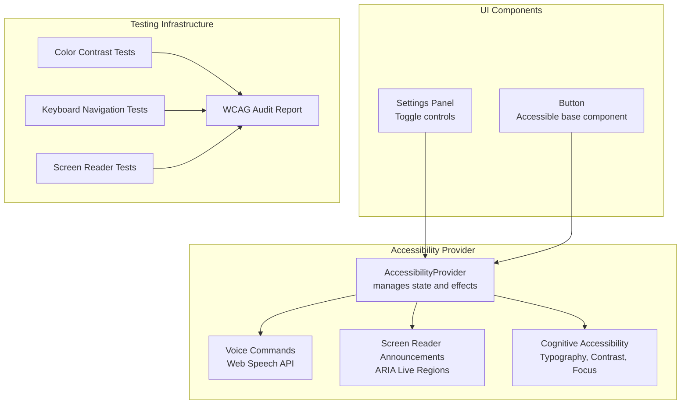
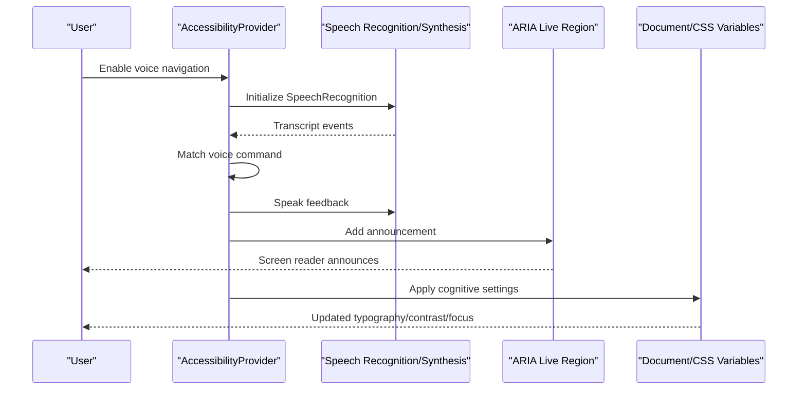
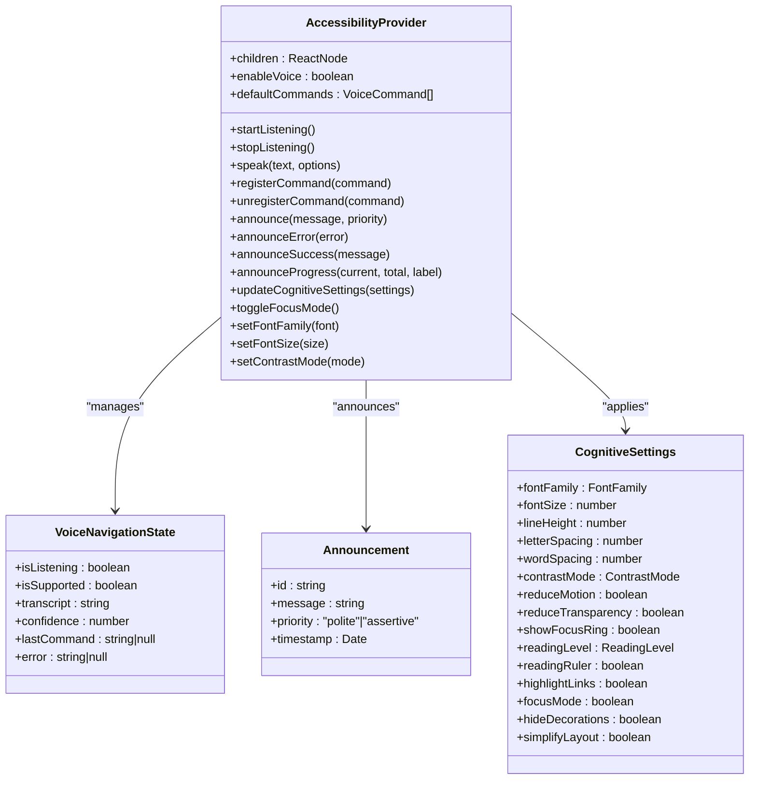
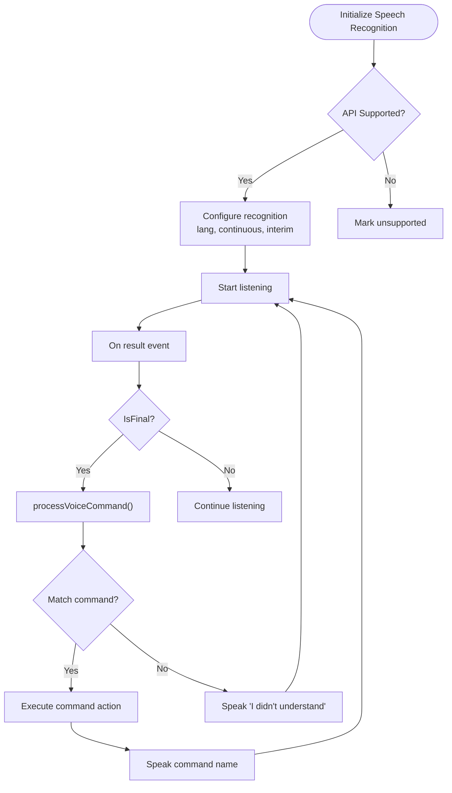
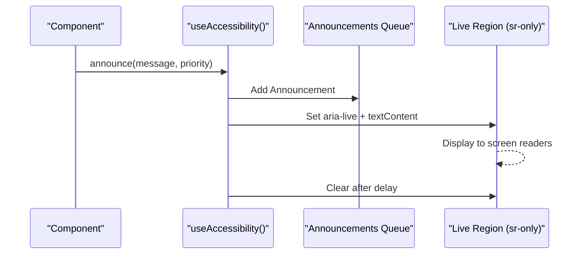
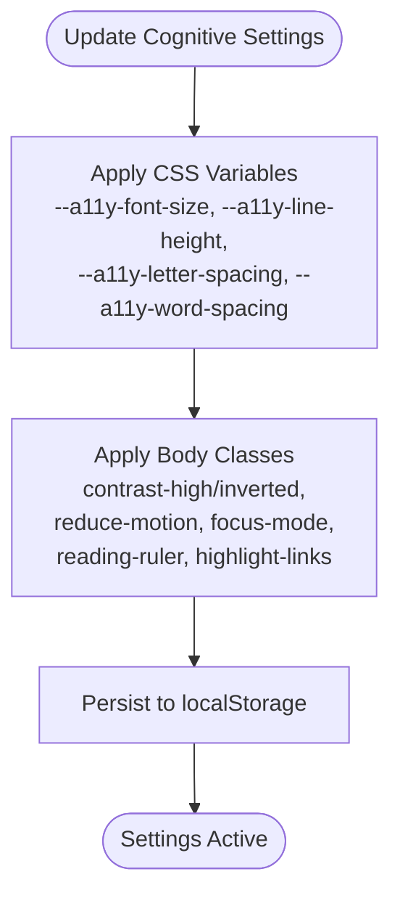
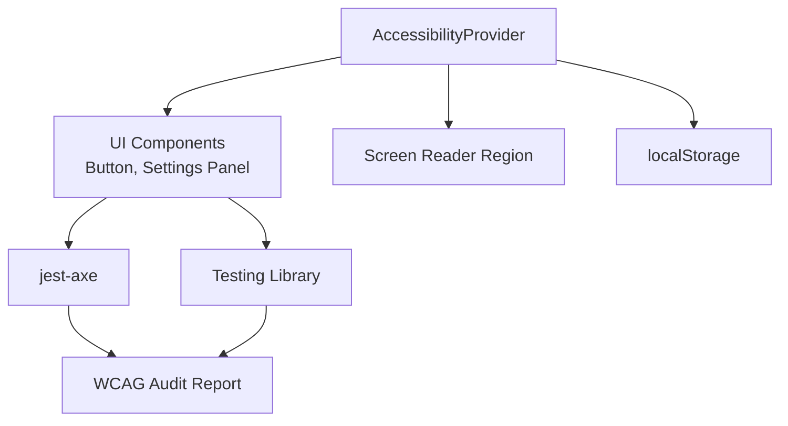

# Accessibility Components

<cite>
**Referenced Files in This Document**
- [Accessibility.tsx](file://apps/web/src/components/accessibility/Accessibility.tsx)
- [index.ts](file://apps/web/src/components/accessibility/index.ts)
- [accessibility-audit-report.ts](file://apps/web/src/test/a11y/accessibility-audit-report.ts)
- [color-contrast-forms.a11y.test.tsx](file://apps/web/src/test/a11y/color-contrast-forms.a11y.test.tsx)
- [keyboard-navigation.a11y.test.tsx](file://apps/web/src/test/a11y/keyboard-navigation.a11y.test.tsx)
- [screen-reader.a11y.test.tsx](file://apps/web/src/test/a11y/screen-reader.a11y.test.tsx)
- [MainLayout.a11y.test.tsx](file://apps/web/src/test/a11y/MainLayout.a11y.test.tsx)
- [QuestionRenderer.a11y.test.tsx](file://apps/web/src/test/a11y/QuestionRenderer.a11y.test.tsx)
- [Button.tsx](file://apps/web/src/components/ui/Button.tsx)
</cite>

## Table of Contents
1. [Introduction](#introduction)
2. [Project Structure](#project-structure)
3. [Core Components](#core-components)
4. [Architecture Overview](#architecture-overview)
5. [Detailed Component Analysis](#detailed-component-analysis)
6. [Dependency Analysis](#dependency-analysis)
7. [Performance Considerations](#performance-considerations)
8. [Troubleshooting Guide](#troubleshooting-guide)
9. [Conclusion](#conclusion)
10. [Appendices](#appendices)

## Introduction
This document provides comprehensive guidance for accessibility components and features in the Quiz2Biz web application. It explains the advanced accessibility system, ARIA patterns, assistive technology support, keyboard navigation, focus management, screen reader compatibility, color contrast compliance, semantic HTML usage, and dynamic content announcements. It also covers WCAG 2.2 Level AA compliance, testing methodologies, and integration with external accessibility testing tools.

## Project Structure
The accessibility implementation is centered around a provider-based system that manages voice navigation, screen reader announcements, and cognitive accessibility preferences. Complementary test suites validate compliance across color contrast, keyboard navigation, screen reader compatibility, and component-specific accessibility.

**Diagram sources**
- [Accessibility.tsx:332-698](file://apps/web/src/components/accessibility/Accessibility.tsx#L332-L698)
- [Button.tsx:38-99](file://apps/web/src/components/ui/Button.tsx#L38-L99)
- [accessibility-audit-report.ts:394-720](file://apps/web/src/test/a11y/accessibility-audit-report.ts#L394-L720)

**Section sources**
- [Accessibility.tsx:1-1067](file://apps/web/src/components/accessibility/Accessibility.tsx#L1-L1067)
- [index.ts:1-6](file://apps/web/src/components/accessibility/index.ts#L1-L6)

## Core Components
The accessibility system is built around a central provider that encapsulates:
- Voice navigation: speech recognition and synthesis, command registration, and feedback
- Screen reader announcements: ARIA live regions and announcement queues
- Cognitive accessibility: typography adjustments, contrast modes, motion preferences, focus mode, reading aids

Key capabilities:
- Voice command recognition with Web Speech API
- Customizable speech synthesis settings
- Dynamic ARIA live regions for announcements
- Persistent cognitive settings stored in local storage
- Accessible UI toggles and settings panel

Implementation highlights:
- Provider exposes typed actions and selectors for voice, announcements, and cognitive settings
- Effects apply cognitive preferences to the document and body classes
- Live region managed via a hidden status element for screen reader announcements

**Section sources**
- [Accessibility.tsx:332-698](file://apps/web/src/components/accessibility/Accessibility.tsx#L332-L698)
- [Accessibility.tsx:146-172](file://apps/web/src/components/accessibility/Accessibility.tsx#L146-L172)
- [Accessibility.tsx:229-320](file://apps/web/src/components/accessibility/Accessibility.tsx#L229-L320)

## Architecture Overview
The accessibility architecture combines a centralized provider with reusable UI components and robust testing:

**Diagram sources**
- [Accessibility.tsx:392-441](file://apps/web/src/components/accessibility/Accessibility.tsx#L392-L441)
- [Accessibility.tsx:574-596](file://apps/web/src/components/accessibility/Accessibility.tsx#L574-L596)
- [Accessibility.tsx:478-538](file://apps/web/src/components/accessibility/Accessibility.tsx#L478-L538)

## Detailed Component Analysis

### Accessibility Provider
The provider manages three primary subsystems: voice navigation, screen reader announcements, and cognitive accessibility. It maintains a reducer-driven state and applies settings to the DOM.

**Diagram sources**
- [Accessibility.tsx:332-698](file://apps/web/src/components/accessibility/Accessibility.tsx#L332-L698)
- [Accessibility.tsx:97-117](file://apps/web/src/components/accessibility/Accessibility.tsx#L97-L117)

**Section sources**
- [Accessibility.tsx:332-698](file://apps/web/src/components/accessibility/Accessibility.tsx#L332-L698)
- [Accessibility.tsx:178-194](file://apps/web/src/components/accessibility/Accessibility.tsx#L178-L194)

### Voice Navigation
Voice navigation integrates Web Speech Recognition and Speech Synthesis APIs. It registers voice commands, processes transcripts, and provides audible feedback.

Key features:
- Continuous speech recognition with interim results
- Command matching with aliases
- Speech synthesis with customizable rate, pitch, and volume
- Error handling and user feedback

**Diagram sources**
- [Accessibility.tsx:392-441](file://apps/web/src/components/accessibility/Accessibility.tsx#L392-L441)
- [Accessibility.tsx:371-390](file://apps/web/src/components/accessibility/Accessibility.tsx#L371-L390)
- [Accessibility.tsx:541-560](file://apps/web/src/components/accessibility/Accessibility.tsx#L541-L560)

**Section sources**
- [Accessibility.tsx:392-441](file://apps/web/src/components/accessibility/Accessibility.tsx#L392-L441)
- [Accessibility.tsx:371-390](file://apps/web/src/components/accessibility/Accessibility.tsx#L371-L390)
- [Accessibility.tsx:541-560](file://apps/web/src/components/accessibility/Accessibility.tsx#L541-L560)

### Screen Reader Announcements
The system provides structured announcements using ARIA live regions. Announcements are queued and displayed in a hidden status region for screen readers.

Capabilities:
- Polite and assertive announcements
- Navigation, error, success, and progress announcements
- Automatic clearing of announcements after display
- Integration with the provider's announcement queue

**Diagram sources**
- [Accessibility.tsx:574-596](file://apps/web/src/components/accessibility/Accessibility.tsx#L574-L596)
- [Accessibility.tsx:689-695](file://apps/web/src/components/accessibility/Accessibility.tsx#L689-L695)

**Section sources**
- [Accessibility.tsx:574-596](file://apps/web/src/components/accessibility/Accessibility.tsx#L574-L596)
- [Accessibility.tsx:689-695](file://apps/web/src/components/accessibility/Accessibility.tsx#L689-L695)

### Cognitive Accessibility
Cognitive accessibility settings adjust typography, contrast, motion, and focus presentation. Changes are applied via CSS variables and body classes.

Features:
- Font family selection (default, dyslexia-friendly, serif, monospace)
- Font size scaling and line height adjustments
- Letter and word spacing controls
- Contrast modes (normal, high, inverted)
- Motion reduction and transparency reduction
- Focus mode and reading ruler
- Link highlighting and layout simplification

**Diagram sources**
- [Accessibility.tsx:478-538](file://apps/web/src/components/accessibility/Accessibility.tsx#L478-L538)
- [Accessibility.tsx:464-475](file://apps/web/src/components/accessibility/Accessibility.tsx#L464-L475)

**Section sources**
- [Accessibility.tsx:478-538](file://apps/web/src/components/accessibility/Accessibility.tsx#L478-L538)
- [Accessibility.tsx:178-194](file://apps/web/src/components/accessibility/Accessibility.tsx#L178-L194)

### Accessibility Settings Panel
The settings panel provides a user interface for cognitive accessibility controls. It uses accessible toggles and selects with proper ARIA attributes.

Implementation details:
- Toggle component with role="switch" and aria-checked
- Select elements with proper labeling
- Command list display for registered voice commands
- Visual feedback for active settings

**Section sources**
- [Accessibility.tsx:757-800](file://apps/web/src/components/accessibility/Accessibility.tsx#L757-L800)
- [Accessibility.tsx:739-754](file://apps/web/src/components/accessibility/Accessibility.tsx#L739-L754)

### Button Component Accessibility
The Button component ensures accessible interactions:
- Proper disabled state handling
- Focus-visible rings for keyboard navigation
- Loading state with aria-hidden spinner
- Consistent sizing and variant styling

**Section sources**
- [Button.tsx:38-99](file://apps/web/src/components/ui/Button.tsx#L38-L99)

### Testing Infrastructure

#### Color Contrast and Form Accessibility
Tests validate:
- WCAG 2.2 AA color contrast ratios (4.5:1 for normal text, 3:1 for large/UI)
- Form accessibility: labels, required fields, error messages, hints
- Inline validation feedback with ARIA attributes
- Disabled form elements with proper aria-disabled

**Section sources**
- [color-contrast-forms.a11y.test.tsx:518-602](file://apps/web/src/test/a11y/color-contrast-forms.a11y.test.tsx#L518-L602)
- [color-contrast-forms.a11y.test.tsx:604-796](file://apps/web/src/test/a11y/color-contrast-forms.a11y.test.tsx#L604-L796)

#### Keyboard Navigation
Tests verify:
- Logical tab order in forms and layouts
- Skip links for bypassing navigation
- No keyboard traps in interactive regions
- Focus visibility and programmatically focusable elements
- Modal focus management and Escape handling
- Dropdown keyboard navigation (Arrow keys, Enter, Space)

**Section sources**
- [keyboard-navigation.a11y.test.tsx:289-754](file://apps/web/src/test/a11y/keyboard-navigation.a11y.test.tsx#L289-L754)

#### Screen Reader Compatibility
Tests confirm:
- Landmark roles and labeling (banner, main, navigation, complementary, contentinfo)
- Form accessibility with labels, roles, and ARIA attributes
- Image alt text and decorative image handling
- Live regions (status, alert, log, timer, progressbar)
- Expanded/collapsed states and ARIA attributes
- Table accessibility with proper headers

**Section sources**
- [screen-reader.a11y.test.tsx:394-785](file://apps/web/src/test/a11y/screen-reader.a11y.test.tsx#L394-L785)

#### Component-Specific Accessibility
- MainLayout: Skip link, landmarks, navigation labeling, mobile sidebar controls, user profile section
- QuestionRenderer: All question types (text, textarea, number, single/multiple choice, scale), best practice and explainer panels, standard references

**Section sources**
- [MainLayout.a11y.test.tsx:187-456](file://apps/web/src/test/a11y/MainLayout.a11y.test.tsx#L187-L456)
- [QuestionRenderer.a11y.test.tsx:273-457](file://apps/web/src/test/a11y/QuestionRenderer.a11y.test.tsx#L273-L457)

#### WCAG 2.2 Level AA Audit Report
The audit report consolidates:
- Comprehensive checklist across Perceivable, Operable, Understandable, and Robust
- Component-specific compliance results
- Screen reader and keyboard testing checklists
- Zoom and high contrast testing results
- Tools used for accessibility testing

**Section sources**
- [accessibility-audit-report.ts:394-720](file://apps/web/src/test/a11y/accessibility-audit-report.ts#L394-L720)

## Dependency Analysis
The accessibility system integrates with UI components and testing utilities:

**Diagram sources**
- [Accessibility.tsx:464-475](file://apps/web/src/components/accessibility/Accessibility.tsx#L464-L475)
- [accessibility-audit-report.ts:639-651](file://apps/web/src/test/a11y/accessibility-audit-report.ts#L639-L651)

**Section sources**
- [Accessibility.tsx:464-475](file://apps/web/src/components/accessibility/Accessibility.tsx#L464-L475)
- [accessibility-audit-report.ts:639-651](file://apps/web/src/test/a11y/accessibility-audit-report.ts#L639-L651)

## Performance Considerations
- Voice recognition and synthesis are CPU-intensive; disable when not needed via provider props
- Live region updates are throttled by queue limits; avoid excessive announcements
- Cognitive settings apply CSS variables and body classes; batch updates when possible
- Local storage persistence occurs on state changes; consider debouncing for frequent updates

## Troubleshooting Guide
Common issues and resolutions:
- Voice commands not recognized: Verify browser support for SpeechRecognition and grant microphone permissions
- Screen reader announcements not heard: Ensure the live region element exists and aria-live is set correctly
- Cognitive settings not applying: Check that CSS variables are being set on document.documentElement and body classes are toggled
- Keyboard traps in modals: Confirm focus is trapped within the modal and Escape key closes it
- Color contrast failures: Adjust color combinations to meet WCAG 2.2 AA ratios or modify color palette

**Section sources**
- [Accessibility.tsx:392-441](file://apps/web/src/components/accessibility/Accessibility.tsx#L392-L441)
- [Accessibility.tsx:574-596](file://apps/web/src/components/accessibility/Accessibility.tsx#L574-L596)
- [Accessibility.tsx:478-538](file://apps/web/src/components/accessibility/Accessibility.tsx#L478-L538)
- [keyboard-navigation.a11y.test.tsx:510-548](file://apps/web/src/test/a11y/keyboard-navigation.a11y.test.tsx#L510-L548)
- [color-contrast-forms.a11y.test.tsx:518-602](file://apps/web/src/test/a11y/color-contrast-forms.a11y.test.tsx#L518-L602)

## Conclusion
The Quiz2Biz accessibility system provides a comprehensive foundation for inclusive design, combining voice navigation, screen reader announcements, and cognitive accessibility with robust testing and WCAG 2.2 Level AA compliance. The provider-based architecture enables consistent behavior across components while offering granular control for customization and maintenance.

## Appendices

### WCAG 2.2 Conformance Details
- Conformance Level: AA
- Tested Criteria: 100% pass rate excluding not applicable items
- Tools: axe-core, jest-axe, pa11y, @axe-core/playwright, ESLint jsx-a11y, NVDA, JAWS, VoiceOver, Chrome DevTools, WAVE
- Next Audit Due: 2026-07-28

**Section sources**
- [accessibility-audit-report.ts:612-623](file://apps/web/src/test/a11y/accessibility-audit-report.ts#L612-L623)
- [accessibility-audit-report.ts:639-651](file://apps/web/src/test/a11y/accessibility-audit-report.ts#L639-L651)