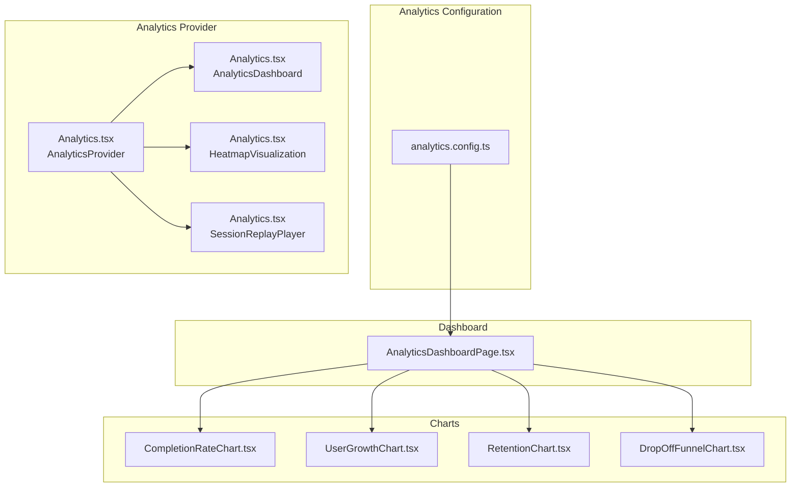
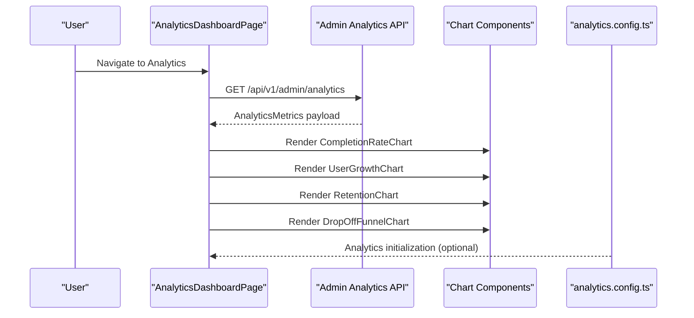
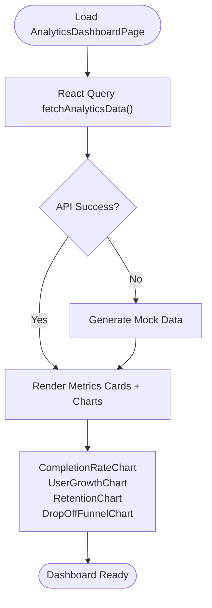
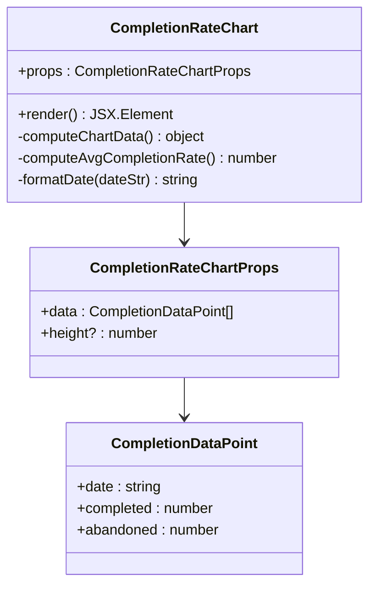
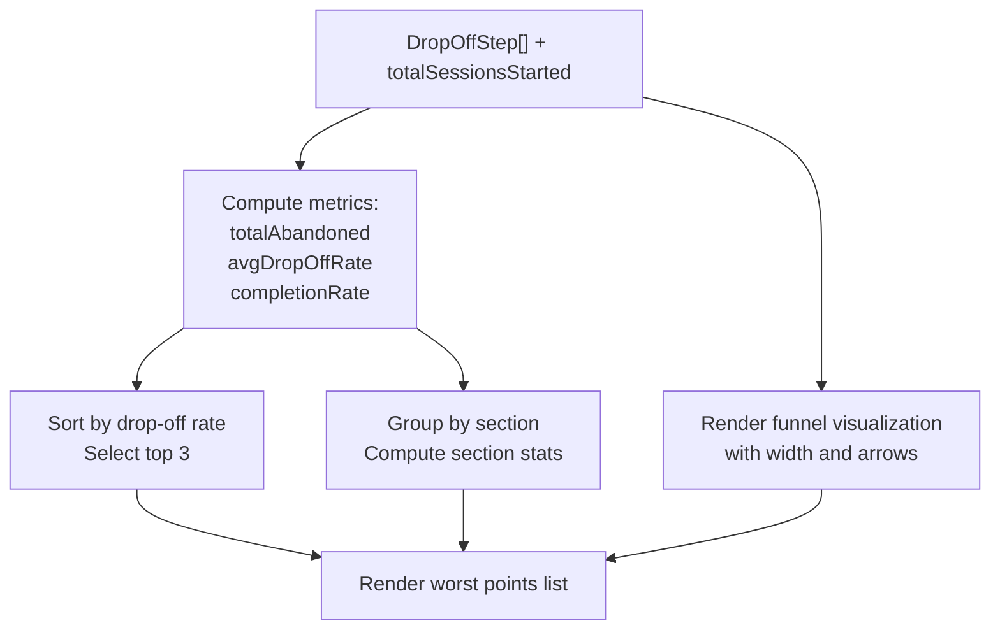
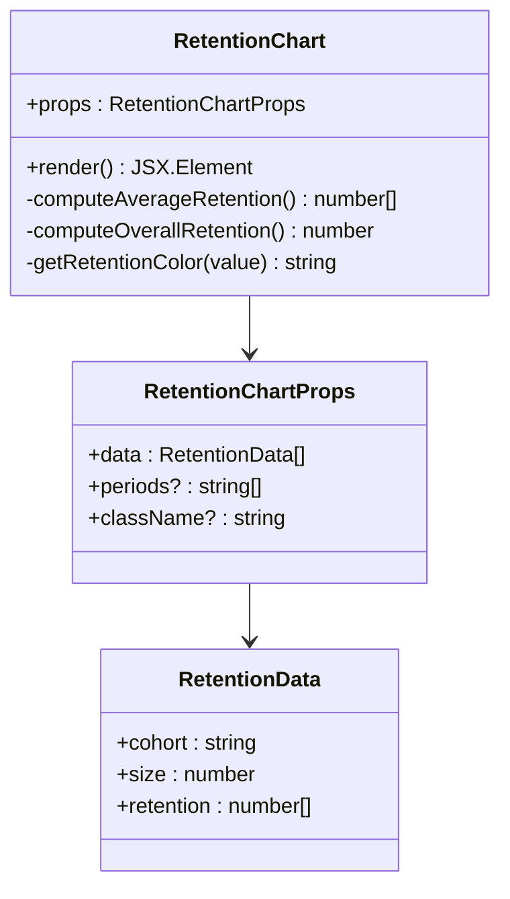
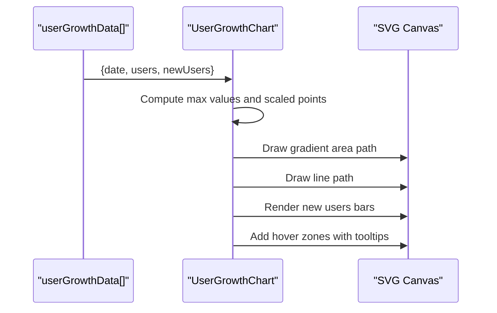
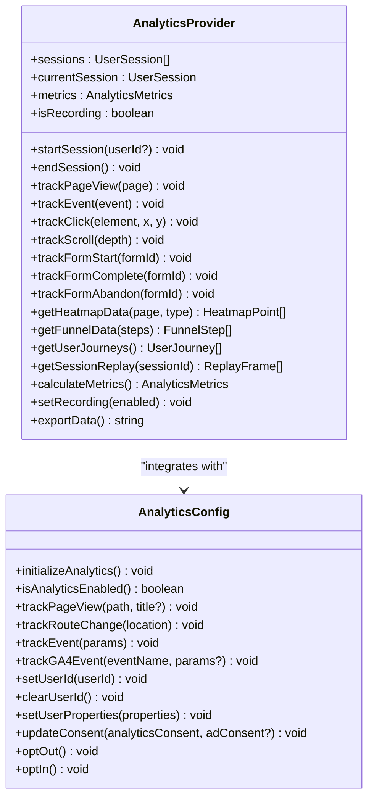
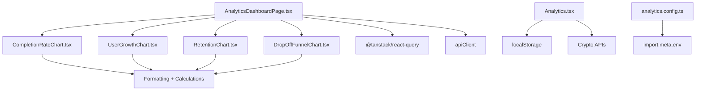

# Analytics Components

<cite>
**Referenced Files in This Document**
- [analytics.config.ts](file://apps/web/src/config/analytics.config.ts)
- [Analytics.tsx](file://apps/web/src/components/analytics/Analytics.tsx)
- [CompletionRateChart.tsx](file://apps/web/src/components/analytics/CompletionRateChart.tsx)
- [DropOffFunnelChart.tsx](file://apps/web/src/components/analytics/DropOffFunnelChart.tsx)
- [RetentionChart.tsx](file://apps/web/src/components/analytics/RetentionChart.tsx)
- [UserGrowthChart.tsx](file://apps/web/src/components/analytics/UserGrowthChart.tsx)
- [AnalyticsDashboardPage.tsx](file://apps/web/src/pages/analytics/AnalyticsDashboardPage.tsx)
- [index.ts](file://apps/web/src/components/analytics/index.ts)
</cite>

## Table of Contents
1. [Introduction](#introduction)
2. [Project Structure](#project-structure)
3. [Core Components](#core-components)
4. [Architecture Overview](#architecture-overview)
5. [Detailed Component Analysis](#detailed-component-analysis)
6. [Dependency Analysis](#dependency-analysis)
7. [Performance Considerations](#performance-considerations)
8. [Troubleshooting Guide](#troubleshooting-guide)
9. [Conclusion](#conclusion)

## Introduction
This document provides comprehensive documentation for the analytics visualization components used in the Quiz-to-Build application. It covers the Analytics dashboard, CompletionRateChart, DropOffFunnelChart, RetentionChart, and UserGrowthChart. The guide explains chart configuration options, data formatting, interactive features, integration with analytics APIs, real-time data updates, performance optimization, customization of chart themes, responsive behavior, and accessibility features. It also includes examples of data visualization patterns, trend analysis, and user engagement metrics display.

## Project Structure
The analytics visualization system is organized around reusable chart components and a centralized analytics provider. The key files include:
- Analytics configuration module for Google Analytics integration
- Analytics provider and dashboard components for usage heatmaps, session replay, and advanced analytics
- Individual chart components for completion rates, user growth, retention, and drop-off funnels
- A dashboard page that integrates charts and displays analytics metrics

**Diagram sources**
- [analytics.config.ts:1-567](file://apps/web/src/config/analytics.config.ts#L1-L567)
- [Analytics.tsx:1-1270](file://apps/web/src/components/analytics/Analytics.tsx#L1-L1270)
- [CompletionRateChart.tsx:1-158](file://apps/web/src/components/analytics/CompletionRateChart.tsx#L1-L158)
- [UserGrowthChart.tsx:1-205](file://apps/web/src/components/analytics/UserGrowthChart.tsx#L1-L205)
- [RetentionChart.tsx:1-216](file://apps/web/src/components/analytics/RetentionChart.tsx#L1-L216)
- [DropOffFunnelChart.tsx:1-262](file://apps/web/src/components/analytics/DropOffFunnelChart.tsx#L1-L262)
- [AnalyticsDashboardPage.tsx:1-483](file://apps/web/src/pages/analytics/AnalyticsDashboardPage.tsx#L1-L483)

**Section sources**
- [analytics.config.ts:1-567](file://apps/web/src/config/analytics.config.ts#L1-L567)
- [Analytics.tsx:1-1270](file://apps/web/src/components/analytics/Analytics.tsx#L1-L1270)
- [CompletionRateChart.tsx:1-158](file://apps/web/src/components/analytics/CompletionRateChart.tsx#L1-L158)
- [UserGrowthChart.tsx:1-205](file://apps/web/src/components/analytics/UserGrowthChart.tsx#L1-L205)
- [RetentionChart.tsx:1-216](file://apps/web/src/components/analytics/RetentionChart.tsx#L1-L216)
- [DropOffFunnelChart.tsx:1-262](file://apps/web/src/components/analytics/DropOffFunnelChart.tsx#L1-L262)
- [AnalyticsDashboardPage.tsx:1-483](file://apps/web/src/pages/analytics/AnalyticsDashboardPage.tsx#L1-L483)

## Core Components
This section outlines the primary analytics visualization components and their responsibilities:
- Analytics dashboard: Provides an overview of key metrics and integrates charts for deeper insights
- CompletionRateChart: Visualizes session completion versus abandonment over time
- DropOffFunnelChart: Identifies drop-off points in questionnaire flows
- RetentionChart: Displays cohort-based retention rates over time
- UserGrowthChart: Shows cumulative users and new user signups over time

Each component accepts structured data arrays and renders interactive visualizations with tooltips, legends, and responsive layouts.

**Section sources**
- [AnalyticsDashboardPage.tsx:299-483](file://apps/web/src/pages/analytics/AnalyticsDashboardPage.tsx#L299-L483)
- [CompletionRateChart.tsx:8-15](file://apps/web/src/components/analytics/CompletionRateChart.tsx#L8-L15)
- [DropOffFunnelChart.tsx:21-25](file://apps/web/src/components/analytics/DropOffFunnelChart.tsx#L21-L25)
- [RetentionChart.tsx:17-21](file://apps/web/src/components/analytics/RetentionChart.tsx#L17-L21)
- [UserGrowthChart.tsx:8-15](file://apps/web/src/components/analytics/UserGrowthChart.tsx#L8-L15)

## Architecture Overview
The analytics architecture combines a configuration layer for external analytics services with internal chart components and a provider for session tracking, heatmaps, and session replay. The dashboard page orchestrates data fetching and rendering of charts.

**Diagram sources**
- [AnalyticsDashboardPage.tsx:67-75](file://apps/web/src/pages/analytics/AnalyticsDashboardPage.tsx#L67-L75)
- [analytics.config.ts:44-73](file://apps/web/src/config/analytics.config.ts#L44-L73)

**Section sources**
- [AnalyticsDashboardPage.tsx:299-483](file://apps/web/src/pages/analytics/AnalyticsDashboardPage.tsx#L299-L483)
- [analytics.config.ts:1-567](file://apps/web/src/config/analytics.config.ts#L1-L567)

## Detailed Component Analysis

### Analytics Dashboard
The Analytics dashboard page integrates multiple charts and metrics cards to present a comprehensive view of user engagement and business performance. It fetches analytics data via a React Query hook and falls back to mock data when the API is unavailable. The dashboard supports time range selection and displays key metrics such as total users, session completion rate, average session duration, and documents generated.

**Diagram sources**
- [AnalyticsDashboardPage.tsx:299-483](file://apps/web/src/pages/analytics/AnalyticsDashboardPage.tsx#L299-L483)

**Section sources**
- [AnalyticsDashboardPage.tsx:67-128](file://apps/web/src/pages/analytics/AnalyticsDashboardPage.tsx#L67-L128)
- [AnalyticsDashboardPage.tsx:299-483](file://apps/web/src/pages/analytics/AnalyticsDashboardPage.tsx#L299-L483)

### CompletionRateChart
The CompletionRateChart component visualizes session completion versus abandonment over time. It computes stacked bars, average completion rates, and tooltip information for each data point. The chart includes:
- Configuration options: data array with date, completed, and abandoned counts; optional height
- Interactive features: hover tooltips, responsive x-axis labels, and y-axis grid lines
- Data formatting: calculates completion percentage per day and overall average

**Diagram sources**
- [CompletionRateChart.tsx:8-41](file://apps/web/src/components/analytics/CompletionRateChart.tsx#L8-L41)

**Section sources**
- [CompletionRateChart.tsx:17-158](file://apps/web/src/components/analytics/CompletionRateChart.tsx#L17-L158)

### DropOffFunnelChart
The DropOffFunnelChart identifies drop-off points in questionnaire flows and presents:
- Summary statistics: total sessions started, total abandoned, average drop-off rate, overall completion rate
- Worst drop-off points: top-ranked questions by drop-off rate
- Funnel visualization: horizontal bars representing user progression with drop-off indicators
- Section-wise drop-off breakdown: aggregated statistics by questionnaire section

**Diagram sources**
- [DropOffFunnelChart.tsx:40-70](file://apps/web/src/components/analytics/DropOffFunnelChart.tsx#L40-L70)

**Section sources**
- [DropOffFunnelChart.tsx:35-220](file://apps/web/src/components/analytics/DropOffFunnelChart.tsx#L35-L220)

### RetentionChart
The RetentionChart displays cohort-based retention rates over multiple periods (e.g., weeks). It computes:
- Average retention per period across cohorts
- Overall retention percentage
- Color-coded retention cells with legend categories
- Optional custom period labels

**Diagram sources**
- [RetentionChart.tsx:17-58](file://apps/web/src/components/analytics/RetentionChart.tsx#L17-L58)

**Section sources**
- [RetentionChart.tsx:33-186](file://apps/web/src/components/analytics/RetentionChart.tsx#L33-L186)

### UserGrowthChart
The UserGrowthChart visualizes cumulative users and new user signups over time using:
- SVG-based line chart with gradient fill for cumulative users
- Overlaid bars for new users
- Interactive hover tooltips and responsive x-axis labels
- Computed totals and latest user counts

**Diagram sources**
- [UserGrowthChart.tsx:17-64](file://apps/web/src/components/analytics/UserGrowthChart.tsx#L17-L64)

**Section sources**
- [UserGrowthChart.tsx:17-205](file://apps/web/src/components/analytics/UserGrowthChart.tsx#L17-L205)

### Analytics Provider and Configuration
The Analytics provider manages session tracking, event recording, and data export. It offers hooks for page tracking and form tracking, and exposes functions for generating heatmaps, funnel data, user journeys, and session replays. The analytics configuration module initializes Google Analytics with environment-specific settings and provides helpers for page views, events, user identity, and consent management.

**Diagram sources**
- [Analytics.tsx:218-817](file://apps/web/src/components/analytics/Analytics.tsx#L218-L817)
- [analytics.config.ts:44-520](file://apps/web/src/config/analytics.config.ts#L44-L520)

**Section sources**
- [Analytics.tsx:218-817](file://apps/web/src/components/analytics/Analytics.tsx#L218-L817)
- [analytics.config.ts:44-520](file://apps/web/src/config/analytics.config.ts#L44-L520)

## Dependency Analysis
The analytics components depend on:
- React Query for data fetching and caching
- Local storage for persisting sessions and current session
- Environment variables for analytics configuration
- UI primitives (Card, Badge, Skeleton) for consistent presentation

**Diagram sources**
- [AnalyticsDashboardPage.tsx:1-483](file://apps/web/src/pages/analytics/AnalyticsDashboardPage.tsx#L1-L483)
- [CompletionRateChart.tsx:1-158](file://apps/web/src/components/analytics/CompletionRateChart.tsx#L1-L158)
- [UserGrowthChart.tsx:1-205](file://apps/web/src/components/analytics/UserGrowthChart.tsx#L1-L205)
- [RetentionChart.tsx:1-216](file://apps/web/src/components/analytics/RetentionChart.tsx#L1-L216)
- [DropOffFunnelChart.tsx:1-262](file://apps/web/src/components/analytics/DropOffFunnelChart.tsx#L1-L262)
- [Analytics.tsx:290-327](file://apps/web/src/components/analytics/Analytics.tsx#L290-L327)
- [analytics.config.ts:21-31](file://apps/web/src/config/analytics.config.ts#L21-L31)

**Section sources**
- [AnalyticsDashboardPage.tsx:1-483](file://apps/web/src/pages/analytics/AnalyticsDashboardPage.tsx#L1-L483)
- [Analytics.tsx:290-327](file://apps/web/src/components/analytics/Analytics.tsx#L290-L327)
- [analytics.config.ts:21-31](file://apps/web/src/config/analytics.config.ts#L21-L31)

## Performance Considerations
- Memoization: Components use useMemo to avoid unnecessary recalculations of chart data and metrics
- Lazy loading: Charts render empty states when data is unavailable, preventing heavy computations
- Efficient rendering: SVG-based charts minimize DOM overhead; hover interactions use pointer-events for precise control
- Data fetching: React Query handles caching and refetching; mock data ensures smooth development experience
- Storage persistence: Local storage persists sessions with limits to prevent excessive memory usage

[No sources needed since this section provides general guidance]

## Troubleshooting Guide
Common issues and resolutions:
- Analytics not initializing: Verify environment variables for measurement ID and debug mode; check initialization logs
- No chart data: Confirm API endpoint availability or rely on mock data generation during development
- Performance issues: Ensure data arrays are not excessively large; consider pagination or downsampling for long time series
- Privacy compliance: Use consent management functions to update analytics storage consent and support opt-out/opt-in flows

**Section sources**
- [analytics.config.ts:44-73](file://apps/web/src/config/analytics.config.ts#L44-L73)
- [AnalyticsDashboardPage.tsx:67-75](file://apps/web/src/pages/analytics/AnalyticsDashboardPage.tsx#L67-L75)
- [Analytics.tsx:290-327](file://apps/web/src/components/analytics/Analytics.tsx#L290-L327)

## Conclusion
The analytics visualization system provides a robust foundation for displaying user engagement metrics, session completion trends, retention patterns, and drop-off analysis. The modular design allows easy integration with external analytics services and internal tracking capabilities. By leveraging memoization, efficient rendering, and React Query, the components deliver responsive and accessible visualizations suitable for production dashboards.