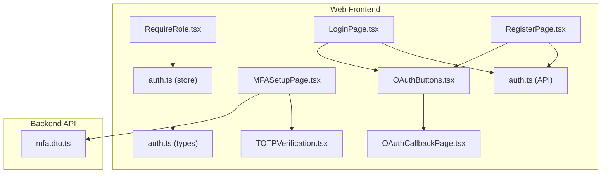
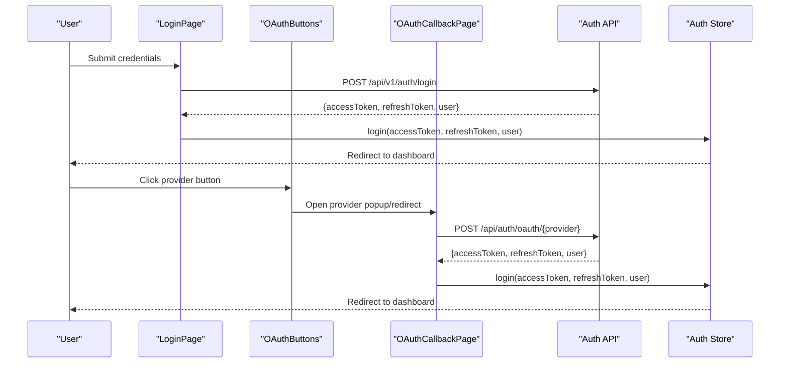
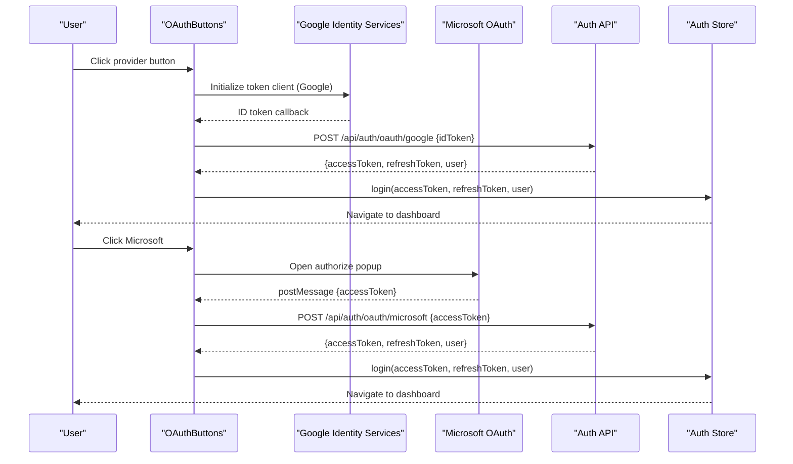
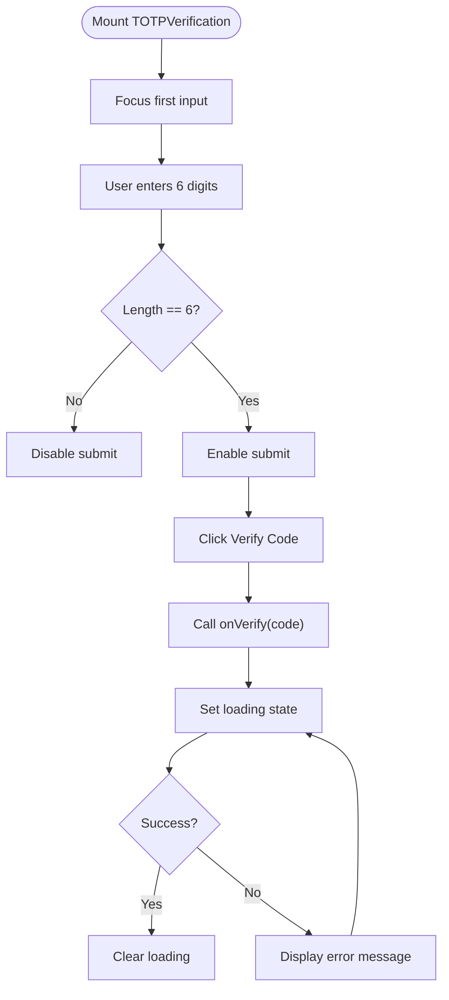
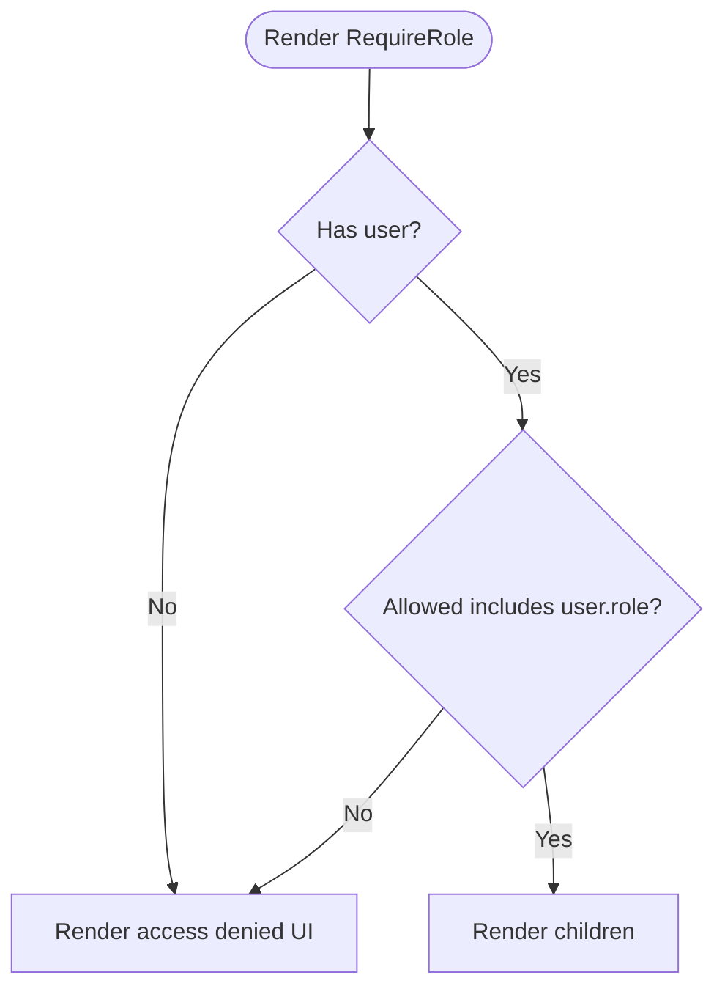
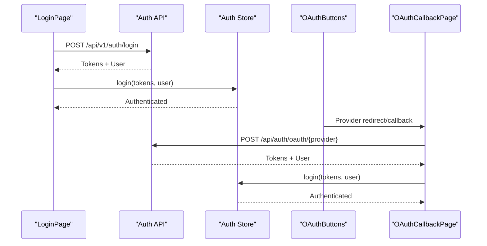
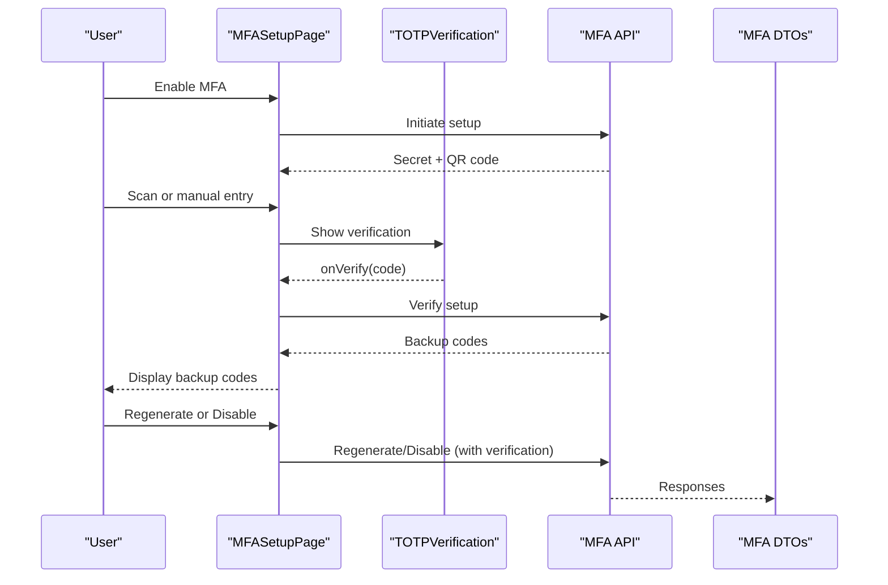
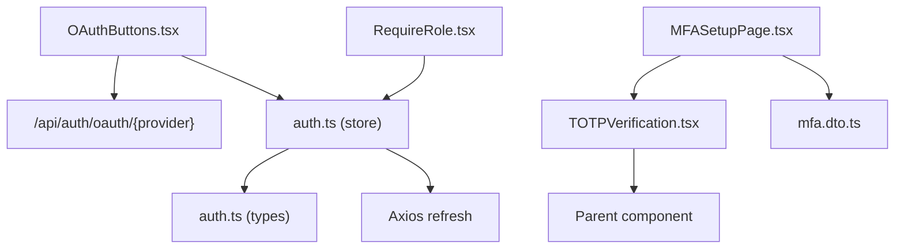

# Authentication Components

<cite>
**Referenced Files in This Document**
- [OAuthButtons.tsx](file://apps/web/src/components/auth/OAuthButtons.tsx)
- [TOTPVerification.tsx](file://apps/web/src/components/auth/TOTPVerification.tsx)
- [RequireRole.tsx](file://apps/web/src/components/auth/RequireRole.tsx)
- [auth.ts](file://apps/web/src/stores/auth.ts)
- [auth.ts](file://apps/web/src/types/auth.ts)
- [auth.ts](file://apps/web/src/api/auth.ts)
- [LoginPage.tsx](file://apps/web/src/pages/auth/LoginPage.tsx)
- [RegisterPage.tsx](file://apps/web/src/pages/auth/RegisterPage.tsx)
- [OAuthCallbackPage.tsx](file://apps/web/src/pages/auth/OAuthCallbackPage.tsx)
- [MFASetupPage.tsx](file://apps/web/src/pages/settings/MFASetupPage.tsx)
- [mfa.dto.ts](file://apps/api/src/modules/auth/mfa/mfa.dto.ts)
</cite>

## Table of Contents
1. [Introduction](#introduction)
2. [Project Structure](#project-structure)
3. [Core Components](#core-components)
4. [Architecture Overview](#architecture-overview)
5. [Detailed Component Analysis](#detailed-component-analysis)
6. [Dependency Analysis](#dependency-analysis)
7. [Performance Considerations](#performance-considerations)
8. [Troubleshooting Guide](#troubleshooting-guide)
9. [Conclusion](#conclusion)

## Introduction
This document provides comprehensive documentation for the authentication-related components in the web application, focusing on OAuthButtons, TOTPVerification, and RequireRole. It explains authentication flow integration, role-based rendering, and MFA implementation. The guide covers component props for authentication state management, error handling, and user feedback, along with OAuth provider integration patterns, token management, and session handling. It also includes examples of conditional rendering based on authentication status and role requirements, and addresses security considerations and best practices for authentication UI components.

## Project Structure
Authentication components are organized under the web application’s frontend, with supporting API services, stores, and types. OAuth callbacks are handled in dedicated pages, while MFA setup integrates with the TOTPVerification component.

**Diagram sources**
- [OAuthButtons.tsx:1-259](file://apps/web/src/components/auth/OAuthButtons.tsx#L1-L259)
- [TOTPVerification.tsx:1-209](file://apps/web/src/components/auth/TOTPVerification.tsx#L1-L209)
- [RequireRole.tsx:1-60](file://apps/web/src/components/auth/RequireRole.tsx#L1-L60)
- [auth.ts:1-173](file://apps/web/src/stores/auth.ts#L1-L173)
- [auth.ts:1-49](file://apps/web/src/types/auth.ts#L1-L49)
- [auth.ts:1-101](file://apps/web/src/api/auth.ts#L1-L101)
- [LoginPage.tsx:1-190](file://apps/web/src/pages/auth/LoginPage.tsx#L1-L190)
- [RegisterPage.tsx:1-372](file://apps/web/src/pages/auth/RegisterPage.tsx#L1-L372)
- [OAuthCallbackPage.tsx:1-35](file://apps/web/src/pages/auth/OAuthCallbackPage.tsx#L1-L35)
- [MFASetupPage.tsx:1-394](file://apps/web/src/pages/settings/MFASetupPage.tsx#L1-L394)
- [mfa.dto.ts:1-56](file://apps/api/src/modules/auth/mfa/mfa.dto.ts#L1-L56)

**Section sources**
- [OAuthButtons.tsx:1-259](file://apps/web/src/components/auth/OAuthButtons.tsx#L1-L259)
- [TOTPVerification.tsx:1-209](file://apps/web/src/components/auth/TOTPVerification.tsx#L1-L209)
- [RequireRole.tsx:1-60](file://apps/web/src/components/auth/RequireRole.tsx#L1-L60)
- [auth.ts:1-173](file://apps/web/src/stores/auth.ts#L1-L173)
- [auth.ts:1-49](file://apps/web/src/types/auth.ts#L1-L49)
- [auth.ts:1-101](file://apps/web/src/api/auth.ts#L1-L101)
- [LoginPage.tsx:1-190](file://apps/web/src/pages/auth/LoginPage.tsx#L1-L190)
- [RegisterPage.tsx:1-372](file://apps/web/src/pages/auth/RegisterPage.tsx#L1-L372)
- [OAuthCallbackPage.tsx:1-35](file://apps/web/src/pages/auth/OAuthCallbackPage.tsx#L1-L35)
- [MFASetupPage.tsx:1-394](file://apps/web/src/pages/settings/MFASetupPage.tsx#L1-L394)
- [mfa.dto.ts:1-56](file://apps/api/src/modules/auth/mfa/mfa.dto.ts#L1-L56)

## Core Components
- OAuthButtons: Provides social login buttons for Google and Microsoft, handling OAuth initialization, token exchange, and navigation upon successful authentication.
- TOTPVerification: Accepts a 6-digit TOTP code input, supports backup code usage, and exposes props for loading states and error messaging.
- RequireRole: Enforces role-based access control by checking the current user’s role against allowed roles and rendering either children or an access denied UI.

**Section sources**
- [OAuthButtons.tsx:60-63](file://apps/web/src/components/auth/OAuthButtons.tsx#L60-L63)
- [TOTPVerification.tsx:11-28](file://apps/web/src/components/auth/TOTPVerification.tsx#L11-L28)
- [RequireRole.tsx:18-22](file://apps/web/src/components/auth/RequireRole.tsx#L18-L22)

## Architecture Overview
The authentication architecture integrates UI components with a centralized store for state management, an API service for server communication, and backend DTOs for MFA operations. OAuth flows leverage provider-specific endpoints and popup/promise-based flows, while local state persists tokens with a robust synchronization strategy.

**Diagram sources**
- [LoginPage.tsx:39-50](file://apps/web/src/pages/auth/LoginPage.tsx#L39-L50)
- [auth.ts:32-38](file://apps/web/src/api/auth.ts#L32-L38)
- [OAuthButtons.tsx:70-129](file://apps/web/src/components/auth/OAuthButtons.tsx#L70-L129)
- [OAuthCallbackPage.tsx:27-35](file://apps/web/src/pages/auth/OAuthCallbackPage.tsx#L27-L35)
- [auth.ts:71-123](file://apps/web/src/stores/auth.ts#L71-L123)

## Detailed Component Analysis

### OAuthButtons
OAuthButtons enables social login with Google and Microsoft. It dynamically loads provider SDKs when needed, constructs authorization URLs for Microsoft, and manages token exchange with the backend. It exposes an onError prop for error reporting and disables buttons during loading.

Key props:
- mode: Determines whether to render “login” or “register” messaging.
- onError: Callback invoked with error messages from OAuth flows.

Integration highlights:
- Google OAuth uses the Google Identity Services client to obtain an ID token, which is exchanged with the backend for access/refresh tokens.
- Microsoft OAuth opens a popup with an authorization URL configured for implicit flow and listens for a postMessage callback containing the access token.

**Diagram sources**
- [OAuthButtons.tsx:70-129](file://apps/web/src/components/auth/OAuthButtons.tsx#L70-L129)
- [OAuthButtons.tsx:131-207](file://apps/web/src/components/auth/OAuthButtons.tsx#L131-L207)
- [auth.ts:15-18](file://apps/web/src/api/auth.ts#L15-L18)
- [auth.ts:71-123](file://apps/web/src/stores/auth.ts#L71-L123)

**Section sources**
- [OAuthButtons.tsx:60-63](file://apps/web/src/components/auth/OAuthButtons.tsx#L60-L63)
- [OAuthButtons.tsx:70-129](file://apps/web/src/components/auth/OAuthButtons.tsx#L70-L129)
- [OAuthButtons.tsx:131-207](file://apps/web/src/components/auth/OAuthButtons.tsx#L131-L207)

### TOTPVerification
TOTPVerification renders a 6-digit input field for MFA verification, supports optional backup code usage, and exposes props for loading and error states. It focuses the first input on mount and disables submission until a complete code is entered.

Key props:
- onVerify: Function called with the 6-digit code when the user submits.
- title/description: Customize header and instruction text.
- showBackupCodeOption/onUseBackupCode: Toggle and handler for backup code usage.
- isLoading/error: Control loading state and display error messaging.
- className: Optional wrapper class.

**Diagram sources**
- [TOTPVerification.tsx:44-47](file://apps/web/src/components/auth/TOTPVerification.tsx#L44-L47)
- [TOTPVerification.tsx:182-190](file://apps/web/src/components/auth/TOTPVerification.tsx#L182-L190)
- [TOTPVerification.tsx:174-179](file://apps/web/src/components/auth/TOTPVerification.tsx#L174-L179)

**Section sources**
- [TOTPVerification.tsx:11-28](file://apps/web/src/components/auth/TOTPVerification.tsx#L11-L28)
- [TOTPVerification.tsx:30-39](file://apps/web/src/components/auth/TOTPVerification.tsx#L30-L39)
- [TOTPVerification.tsx:182-190](file://apps/web/src/components/auth/TOTPVerification.tsx#L182-L190)

### RequireRole
RequireRole enforces role-based access control by checking the current user’s role against an allowed list. If the user is not authenticated or lacks permission, it renders an access denied UI with a navigation action; otherwise, it renders the protected children.

Key props:
- allowed: Array of roles permitted to access the content.
- children: Content to render if access is granted.

**Diagram sources**
- [RequireRole.tsx:34-58](file://apps/web/src/components/auth/RequireRole.tsx#L34-L58)

**Section sources**
- [RequireRole.tsx:18-22](file://apps/web/src/components/auth/RequireRole.tsx#L18-L22)
- [RequireRole.tsx:34-58](file://apps/web/src/components/auth/RequireRole.tsx#L34-L58)

### Authentication Flow Integration
- Username/password login: LoginPage validates inputs, calls the Auth API login endpoint, and persists tokens via the store before navigating to the dashboard.
- OAuth login: OAuthButtons initiates provider-specific flows and exchanges tokens with the backend, then persists state and navigates.
- OAuth callback: OAuthCallbackPage handles implicit flow callbacks, extracts tokens, exchanges them with the backend, and completes login.

**Diagram sources**
- [LoginPage.tsx:39-50](file://apps/web/src/pages/auth/LoginPage.tsx#L39-L50)
- [auth.ts:32-38](file://apps/web/src/api/auth.ts#L32-L38)
- [OAuthButtons.tsx:102-121](file://apps/web/src/components/auth/OAuthButtons.tsx#L102-L121)
- [OAuthCallbackPage.tsx:27-35](file://apps/web/src/pages/auth/OAuthCallbackPage.tsx#L27-L35)
- [auth.ts:71-123](file://apps/web/src/stores/auth.ts#L71-L123)

**Section sources**
- [LoginPage.tsx:39-50](file://apps/web/src/pages/auth/LoginPage.tsx#L39-L50)
- [RegisterPage.tsx:92-107](file://apps/web/src/pages/auth/RegisterPage.tsx#L92-L107)
- [OAuthButtons.tsx:102-121](file://apps/web/src/components/auth/OAuthButtons.tsx#L102-L121)
- [OAuthCallbackPage.tsx:27-35](file://apps/web/src/pages/auth/OAuthCallbackPage.tsx#L27-L35)

### MFA Implementation
MFASetupPage orchestrates TOTP setup, verification, backup code management, and disabling. It uses TOTPVerification for user input and integrates with backend DTOs for MFA operations.

Key steps:
- Initiate setup to receive secret and QR code data.
- Scan QR code or enter secret manually.
- Verify the generated code.
- Receive and display backup codes.
- Optionally regenerate backup codes or disable MFA after verification.

**Diagram sources**
- [MFASetupPage.tsx:56-106](file://apps/web/src/pages/settings/MFASetupPage.tsx#L56-L106)
- [TOTPVerification.tsx:30-39](file://apps/web/src/components/auth/TOTPVerification.tsx#L30-L39)
- [mfa.dto.ts:9-20](file://apps/api/src/modules/auth/mfa/mfa.dto.ts#L9-L20)
- [mfa.dto.ts:33-40](file://apps/api/src/modules/auth/mfa/mfa.dto.ts#L33-L40)

**Section sources**
- [MFASetupPage.tsx:56-106](file://apps/web/src/pages/settings/MFASetupPage.tsx#L56-L106)
- [TOTPVerification.tsx:30-39](file://apps/web/src/components/auth/TOTPVerification.tsx#L30-L39)
- [mfa.dto.ts:9-20](file://apps/api/src/modules/auth/mfa/mfa.dto.ts#L9-L20)
- [mfa.dto.ts:33-40](file://apps/api/src/modules/auth/mfa/mfa.dto.ts#L33-L40)

## Dependency Analysis
- OAuthButtons depends on:
  - Environment variables for provider client IDs.
  - Auth API endpoints for OAuth exchange.
  - Auth store for persisting tokens and navigating.
- TOTPVerification depends on:
  - UI primitives for layout and feedback.
  - Parent components to supply onVerify and error/loading props.
- RequireRole depends on:
  - Auth store for user and role information.
- Auth store depends on:
  - Types for user and token shapes.
  - Axios for token refresh on hydration.
- MFASetupPage depends on:
  - TOTPVerification for user input.
  - MFA API and DTOs for backend operations.

**Diagram sources**
- [OAuthButtons.tsx:10-14](file://apps/web/src/components/auth/OAuthButtons.tsx#L10-L14)
- [auth.ts:17-21](file://apps/web/src/stores/auth.ts#L17-L21)
- [RequireRole.tsx:11-13](file://apps/web/src/components/auth/RequireRole.tsx#L11-L13)
- [MFASetupPage.tsx:24-32](file://apps/web/src/pages/settings/MFASetupPage.tsx#L24-L32)
- [mfa.dto.ts:1-56](file://apps/api/src/modules/auth/mfa/mfa.dto.ts#L1-L56)

**Section sources**
- [OAuthButtons.tsx:10-14](file://apps/web/src/components/auth/OAuthButtons.tsx#L10-L14)
- [auth.ts:17-21](file://apps/web/src/stores/auth.ts#L17-L21)
- [RequireRole.tsx:11-13](file://apps/web/src/components/auth/RequireRole.tsx#L11-L13)
- [MFASetupPage.tsx:24-32](file://apps/web/src/pages/settings/MFASetupPage.tsx#L24-L32)
- [mfa.dto.ts:1-56](file://apps/api/src/modules/auth/mfa/mfa.dto.ts#L1-L56)

## Performance Considerations
- Minimize re-renders by keeping OAuth and MFA flows in dedicated pages and components with focused responsibilities.
- Debounce or throttle input in TOTPVerification to avoid excessive re-renders during rapid keystrokes.
- Use React Query’s caching and background refetching to efficiently manage MFA status and setup steps.
- Persist tokens locally with the store’s synchronization strategy to reduce network round trips on page reload.

## Troubleshooting Guide
Common issues and resolutions:
- OAuth popup blocked: Ensure popups are enabled and handle the popup creation error gracefully in Microsoft OAuth.
- Token exchange failures: Catch and surface errors from OAuth endpoints and allow users to retry.
- MFA verification errors: Display clear error messages from the backend and allow users to retry verification.
- Role-based access denials: Provide navigational actions in RequireRole to guide users to appropriate pages.

**Section sources**
- [OAuthButtons.tsx:150-154](file://apps/web/src/components/auth/OAuthButtons.tsx#L150-L154)
- [OAuthButtons.tsx:162-169](file://apps/web/src/components/auth/OAuthButtons.tsx#L162-L169)
- [TOTPVerification.tsx:174-179](file://apps/web/src/components/auth/TOTPVerification.tsx#L174-L179)
- [RequireRole.tsx:44-54](file://apps/web/src/components/auth/RequireRole.tsx#L44-L54)

## Conclusion
The authentication system combines robust UI components with a centralized store and API service to deliver secure and user-friendly login experiences. OAuthButtons supports major providers, TOTPVerification provides MFA input, and RequireRole enforces role-based access. The architecture emphasizes clear separation of concerns, resilient token management, and accessible error handling, enabling scalable enhancements for future authentication needs.