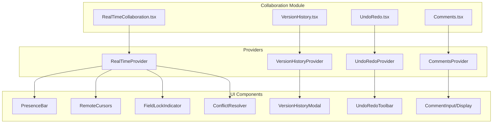
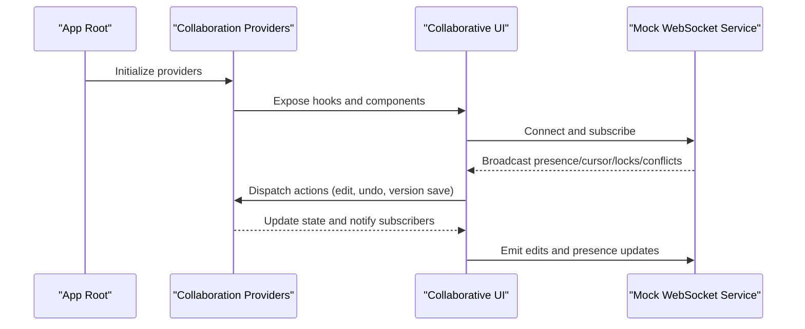
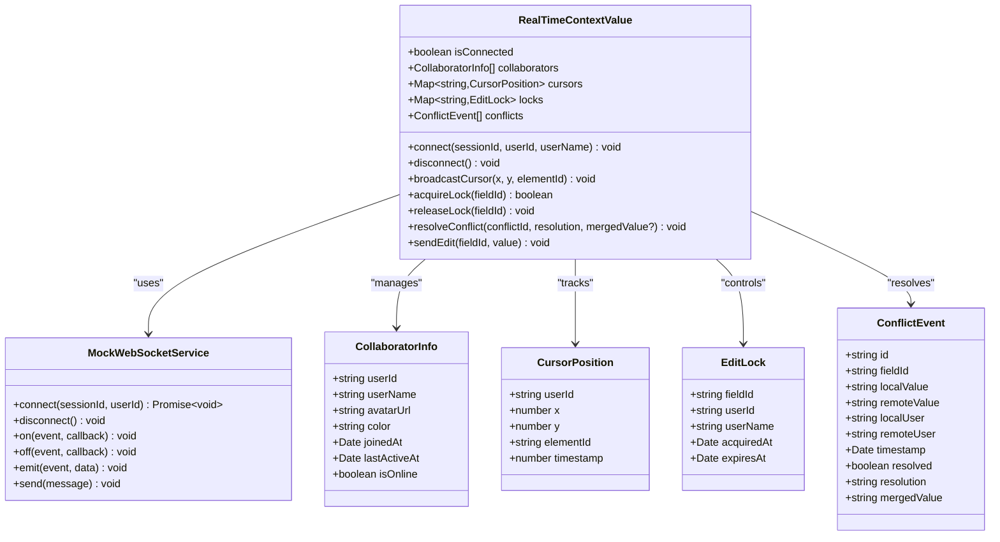
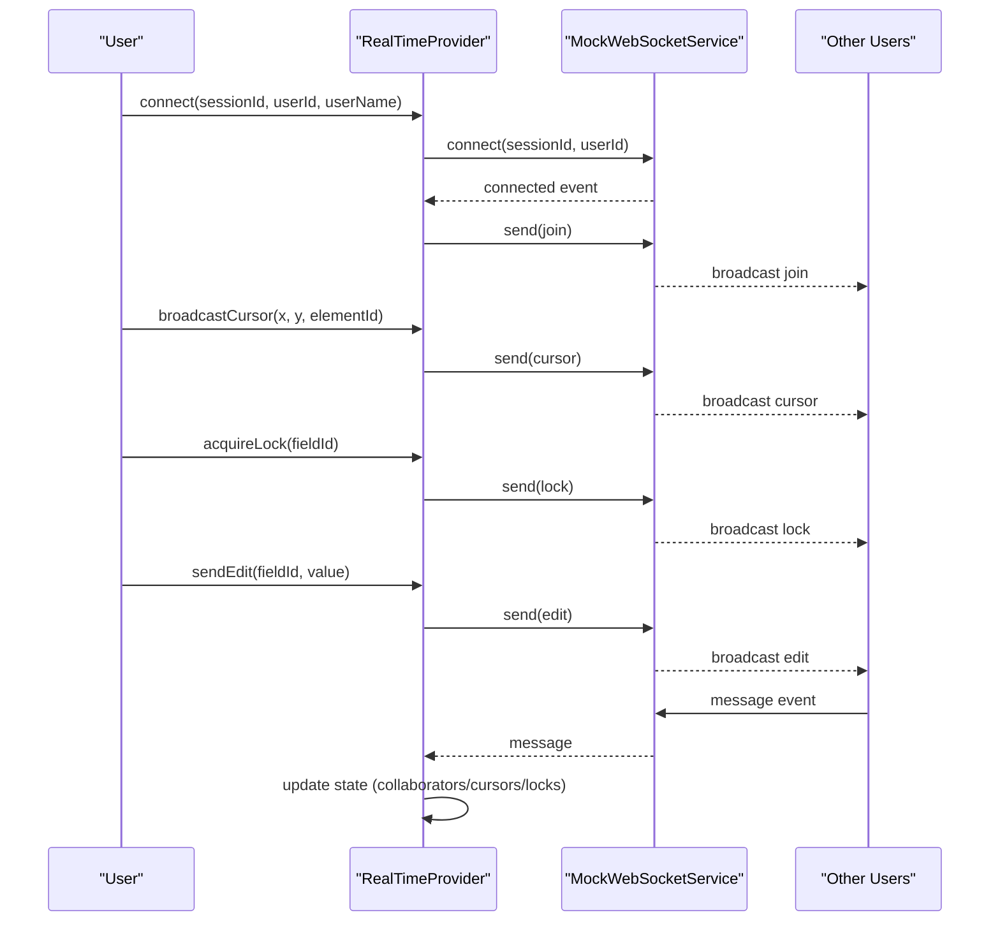
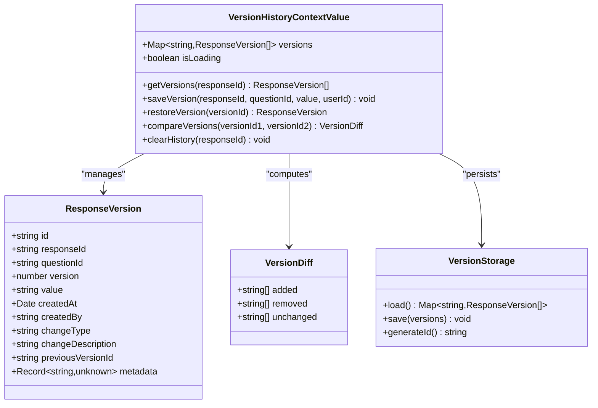
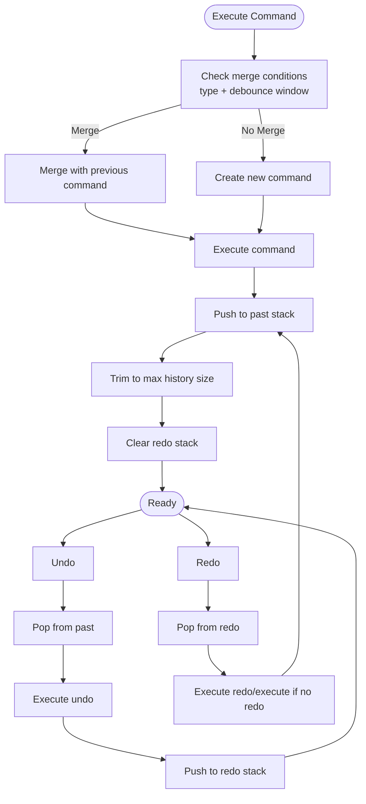
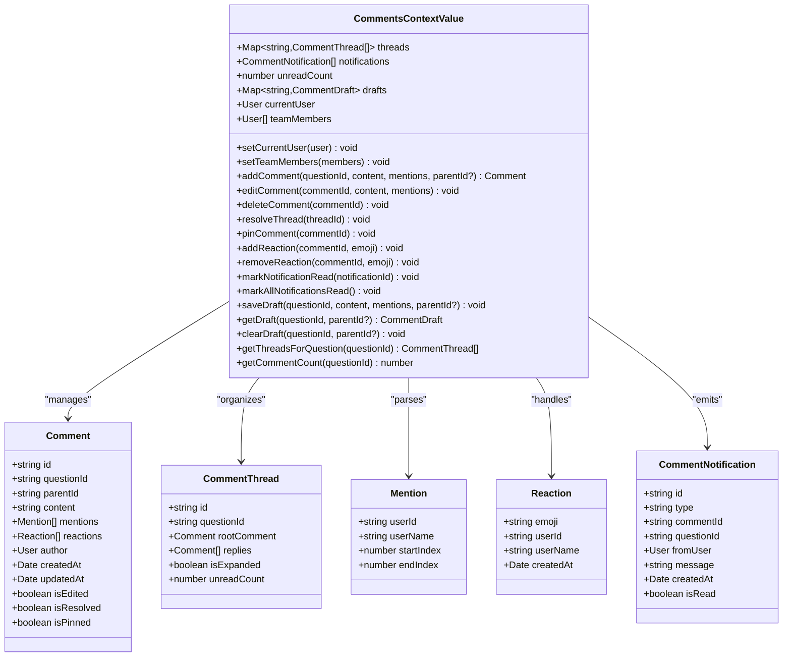
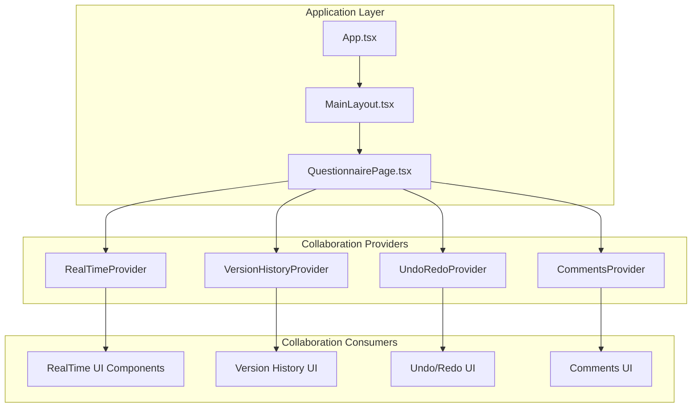

# Collaboration Components

<cite>
**Referenced Files in This Document**
- [RealTimeCollaboration.tsx](file://apps/web/src/components/collaboration/RealTimeCollaboration.tsx)
- [Comments.tsx](file://apps/web/src/components/collaboration/Comments.tsx)
- [UndoRedo.tsx](file://apps/web/src/components/collaboration/UndoRedo.tsx)
- [VersionHistory.tsx](file://apps/web/src/components/collaboration/VersionHistory.tsx)
- [index.ts](file://apps/web/src/components/collaboration/index.ts)
- [App.tsx](file://apps/web/src/App.tsx)
- [MainLayout.tsx](file://apps/web/src/components/layout/MainLayout.tsx)
- [QuestionnairePage.tsx](file://apps/web/src/pages/questionnaire/QuestionnairePage.tsx)
</cite>

## Table of Contents
1. [Introduction](#introduction)
2. [Project Structure](#project-structure)
3. [Core Components](#core-components)
4. [Architecture Overview](#architecture-overview)
5. [Detailed Component Analysis](#detailed-component-analysis)
6. [Dependency Analysis](#dependency-analysis)
7. [Performance Considerations](#performance-considerations)
8. [Troubleshooting Guide](#troubleshooting-guide)
9. [Conclusion](#conclusion)

## Introduction
This document provides comprehensive documentation for the collaboration components that enable real-time collaborative editing, version control, undo/redo functionality, and threaded commenting. The components are designed to support concurrent editing scenarios, conflict resolution, user presence awareness, activity tracking, and historical revision management. They integrate with frontend state management patterns and provide reusable hooks and UI components for building collaborative experiences.

## Project Structure
The collaboration module is organized as a barrel export that exposes four primary components:
- RealTimeCollaboration: Real-time presence, cursors, locks, and conflict resolution
- VersionHistory: Local-first version persistence with restore and comparison
- UndoRedo: Command pattern-based undo/redo stacks with keyboard shortcuts
- Comments: Threaded comment system with mentions, reactions, and notifications

**Diagram sources**
- [index.ts:1-9](file://apps/web/src/components/collaboration/index.ts#L1-L9)
- [RealTimeCollaboration.tsx:153-434](file://apps/web/src/components/collaboration/RealTimeCollaboration.tsx#L153-L434)
- [VersionHistory.tsx:118-259](file://apps/web/src/components/collaboration/VersionHistory.tsx#L118-L259)
- [UndoRedo.tsx:107-293](file://apps/web/src/components/collaboration/UndoRedo.tsx#L107-L293)
- [Comments.tsx:157-632](file://apps/web/src/components/collaboration/Comments.tsx#L157-L632)

**Section sources**
- [index.ts:1-9](file://apps/web/src/components/collaboration/index.ts#L1-L9)

## Core Components
This section introduces each collaboration component and its primary responsibilities.

- RealTimeCollaboration: Provides real-time presence, cursor tracking, edit locking, conflict detection, and broadcasting via a mock WebSocket service. It manages collaborator lists, cursor positions, edit locks, and conflict events.
- VersionHistory: Manages local-first version snapshots of responses, enabling restore and comparison operations. It persists data to localStorage and maintains version metadata.
- UndoRedo: Implements a command pattern with undo/redo stacks, supports merging of similar commands, and provides keyboard shortcuts for user control.
- Comments: Offers a threaded comment system with mentions, reactions, notifications, and draft persistence. It supports hierarchical replies and visibility controls.

**Section sources**
- [RealTimeCollaboration.tsx:13-76](file://apps/web/src/components/collaboration/RealTimeCollaboration.tsx#L13-L76)
- [VersionHistory.tsx:13-41](file://apps/web/src/components/collaboration/VersionHistory.tsx#L13-L41)
- [UndoRedo.tsx:13-50](file://apps/web/src/components/collaboration/UndoRedo.tsx#L13-L50)
- [Comments.tsx:48-121](file://apps/web/src/components/collaboration/Comments.tsx#L48-L121)

## Architecture Overview
The collaboration components follow a provider-pattern architecture with React Context for state sharing across components. Each component exposes a provider and associated hooks for consumption.

**Diagram sources**
- [RealTimeCollaboration.tsx:186-228](file://apps/web/src/components/collaboration/RealTimeCollaboration.tsx#L186-L228)
- [RealTimeCollaboration.tsx:320-398](file://apps/web/src/components/collaboration/RealTimeCollaboration.tsx#L320-L398)
- [UndoRedo.tsx:120-170](file://apps/web/src/components/collaboration/UndoRedo.tsx#L120-L170)
- [VersionHistory.tsx:139-168](file://apps/web/src/components/collaboration/VersionHistory.tsx#L139-L168)

## Detailed Component Analysis

### RealTimeCollaboration
Real-time collaboration enables multiple users to edit content concurrently with visual indicators for presence, cursor positions, and edit locks. The component includes conflict detection and resolution capabilities.

**Diagram sources**
- [RealTimeCollaboration.tsx:59-76](file://apps/web/src/components/collaboration/RealTimeCollaboration.tsx#L59-L76)
- [RealTimeCollaboration.tsx:101-147](file://apps/web/src/components/collaboration/RealTimeCollaboration.tsx#L101-L147)
- [RealTimeCollaboration.tsx:13-50](file://apps/web/src/components/collaboration/RealTimeCollaboration.tsx#L13-L50)

**Diagram sources**
- [RealTimeCollaboration.tsx:186-228](file://apps/web/src/components/collaboration/RealTimeCollaboration.tsx#L186-L228)
- [RealTimeCollaboration.tsx:230-306](file://apps/web/src/components/collaboration/RealTimeCollaboration.tsx#L230-L306)
- [RealTimeCollaboration.tsx:320-398](file://apps/web/src/components/collaboration/RealTimeCollaboration.tsx#L320-L398)

Key collaboration patterns:
- Presence and cursors: Users see each other's avatars and cursor positions with automatic cleanup of stale cursors.
- Edit locks: Field-level locking prevents simultaneous edits; locks expire automatically.
- Conflict resolution: Detects conflicting edits and presents resolution options (keep mine, use theirs, merge).
- Activity tracking: Tracks join/leave events and user activity timestamps.

Integration with backend services:
- The component currently uses a mock WebSocket service for demonstration. To integrate with a real backend, replace the mock service with a production-ready WebSocket client (e.g., Socket.IO) and implement server-side presence management and message broadcasting.

User presence indicators:
- Presence bar displays online collaborators with color-coded avatars and hover tooltips.
- Remote cursors render as colored pointers with user labels.
- Typing indicators show who is currently editing a field.

**Section sources**
- [RealTimeCollaboration.tsx:13-76](file://apps/web/src/components/collaboration/RealTimeCollaboration.tsx#L13-L76)
- [RealTimeCollaboration.tsx:186-398](file://apps/web/src/components/collaboration/RealTimeCollaboration.tsx#L186-L398)
- [RealTimeCollaboration.tsx:482-733](file://apps/web/src/components/collaboration/RealTimeCollaboration.tsx#L482-L733)

### VersionHistory
Version history captures snapshots of response content with metadata, enabling restoration and comparison between versions. It persists data locally and provides a modal interface for browsing versions.

**Diagram sources**
- [VersionHistory.tsx:33-41](file://apps/web/src/components/collaboration/VersionHistory.tsx#L33-L41)
- [VersionHistory.tsx:13-25](file://apps/web/src/components/collaboration/VersionHistory.tsx#L13-L25)
- [VersionHistory.tsx:27-31](file://apps/web/src/components/collaboration/VersionHistory.tsx#L27-L31)
- [VersionHistory.tsx:47-93](file://apps/web/src/components/collaboration/VersionHistory.tsx#L47-L93)

Version control patterns:
- Automatic snapshotting: Saves versions when content changes, deduplicating identical values.
- Restoration: Creates a new version representing a restore operation with metadata.
- Comparison: Computes word-level differences between two versions for visual diff display.
- Persistence: Uses localStorage with capped history per response to manage storage limits.

Integration with backend services:
- The component uses localStorage for persistence. For production, integrate with backend APIs to store and retrieve versions, enabling cross-device and cross-session version history.

**Section sources**
- [VersionHistory.tsx:132-246](file://apps/web/src/components/collaboration/VersionHistory.tsx#L132-L246)
- [VersionHistory.tsx:315-534](file://apps/web/src/components/collaboration/VersionHistory.tsx#L315-L534)
- [VersionHistory.tsx:598-628](file://apps/web/src/components/collaboration/VersionHistory.tsx#L598-L628)

### UndoRedo
The undo/redo system implements a command pattern with configurable history size and intelligent merging for text input. It provides keyboard shortcuts and a history panel for manual navigation.

**Diagram sources**
- [UndoRedo.tsx:120-170](file://apps/web/src/components/collaboration/UndoRedo.tsx#L120-L170)
- [UndoRedo.tsx:172-204](file://apps/web/src/components/collaboration/UndoRedo.tsx#L172-L204)

Undo/redo patterns:
- Command pattern: Each action encapsulates execute/undo operations with optional redo.
- History management: Maintains separate past and future stacks with configurable limits.
- Intelligent merging: Merges rapid successive text changes into a single command for cleaner history.
- Keyboard shortcuts: Supports platform-appropriate undo/redo shortcuts.

Integration with backend services:
- The component operates locally. For collaborative scenarios, synchronize command execution across users and persist command logs for audit trails.

**Section sources**
- [UndoRedo.tsx:120-246](file://apps/web/src/components/collaboration/UndoRedo.tsx#L120-L246)
- [UndoRedo.tsx:470-759](file://apps/web/src/components/collaboration/UndoRedo.tsx#L470-L759)

### Comments
The comments system provides threaded discussions with mentions, reactions, and notifications. It supports draft persistence and integrates with team member data.

**Diagram sources**
- [Comments.tsx:91-121](file://apps/web/src/components/collaboration/Comments.tsx#L91-L121)
- [Comments.tsx:48-81](file://apps/web/src/components/collaboration/Comments.tsx#L48-L81)
- [Comments.tsx:268-343](file://apps/web/src/components/collaboration/Comments.tsx#L268-L343)

Commenting patterns:
- Threaded replies: Hierarchical comment structure with expandable reply sections.
- Mentions: Support for @mentions with autocomplete and highlighting.
- Reactions: Emoji-based reactions with user tracking.
- Notifications: Real-time notifications for mentions, replies, and resolutions.
- Drafts: Automatic saving of comment drafts with persistence.

Integration with backend services:
- The component uses localStorage for persistence. Integrate with backend APIs to synchronize comments across users, manage permissions, and deliver real-time notifications.

**Section sources**
- [Comments.tsx:268-408](file://apps/web/src/components/collaboration/Comments.tsx#L268-L408)
- [Comments.tsx:738-932](file://apps/web/src/components/collaboration/Comments.tsx#L738-L932)
- [Comments.tsx:1273-1343](file://apps/web/src/components/collaboration/Comments.tsx#L1273-L1343)

## Dependency Analysis
The collaboration components are designed as independent modules that can be composed together. Each provider manages its own state and exposes hooks for consumption.

**Diagram sources**
- [App.tsx:189-283](file://apps/web/src/App.tsx#L189-L283)
- [MainLayout.tsx:72-366](file://apps/web/src/components/layout/MainLayout.tsx#L72-L366)
- [QuestionnairePage.tsx:48-200](file://apps/web/src/pages/questionnaire/QuestionnairePage.tsx#L48-L200)

Provider composition:
- The providers are independent and can be combined as needed. There is no direct coupling between RealTimeCollaboration and VersionHistory; they can be used together or separately.
- Comments integrates with team member data and mentions, while UndoRedo focuses on local command history.

External dependencies:
- Real-time collaboration relies on a WebSocket service for message broadcasting. The current implementation uses a mock service suitable for development and testing.
- VersionHistory uses localStorage for persistence. For production, integrate with backend storage for cross-device and cross-session availability.
- Comments uses localStorage for drafts and notifications. Backend integration would enable real-time synchronization and richer notification systems.

**Section sources**
- [RealTimeCollaboration.tsx:101-147](file://apps/web/src/components/collaboration/RealTimeCollaboration.tsx#L101-L147)
- [VersionHistory.tsx:47-93](file://apps/web/src/components/collaboration/VersionHistory.tsx#L47-L93)
- [Comments.tsx:168-221](file://apps/web/src/components/collaboration/Comments.tsx#L168-L221)

## Performance Considerations
- Real-time collaboration:
  - Cursor broadcasting is throttled to reduce network overhead. Consider adjusting throttle intervals based on application needs.
  - Stale cursor cleanup runs periodically to prevent memory leaks from inactive users.
  - Presence updates are batched to minimize re-renders.

- Version history:
  - History is trimmed to a maximum size to prevent excessive memory usage.
  - Version comparisons use word-level splitting; consider optimizing for large documents.

- Undo/redo:
  - Command merging reduces history size for frequent text input.
  - Keyboard shortcuts avoid unnecessary DOM updates by preventing default browser behavior.

- Comments:
  - Mention autocomplete filters team members efficiently.
  - Draft autosave uses debounced writes to minimize storage operations.

[No sources needed since this section provides general guidance]

## Troubleshooting Guide
Common issues and resolutions:

- Real-time collaboration:
  - No cursor updates: Verify WebSocket connection and message handling. Check that the mock service is properly initialized and that message events are being emitted.
  - Conflicts not detected: Ensure edit broadcasts are being sent and received. Confirm that conflict resolution handlers are invoked for conflicting edits.
  - Presence indicators incorrect: Validate collaborator data updates and timestamp handling.

- Version history:
  - Versions not saving: Check localStorage availability and permissions. Verify that content changes are detected and that duplicate versions are properly deduplicated.
  - Restore not working: Confirm version IDs and restore logic. Ensure that restored versions create new entries with appropriate metadata.

- Undo/redo:
  - Commands not merging: Verify debounce timing and command types. Ensure that consecutive commands meet merge criteria.
  - Shortcuts not working: Check keyboard event listeners and focus states. Ensure that inputs are excluded from global shortcuts.

- Comments:
  - Mentions not appearing: Validate mention parsing and autocomplete filtering. Ensure that team members are loaded and searchable.
  - Notifications not updating: Confirm notification state updates and read/unread tracking. Check localStorage persistence for notifications.

**Section sources**
- [RealTimeCollaboration.tsx:320-398](file://apps/web/src/components/collaboration/RealTimeCollaboration.tsx#L320-L398)
- [VersionHistory.tsx:139-168](file://apps/web/src/components/collaboration/VersionHistory.tsx#L139-L168)
- [UndoRedo.tsx:249-275](file://apps/web/src/components/collaboration/UndoRedo.tsx#L249-L275)
- [Comments.tsx:784-834](file://apps/web/src/components/collaboration/Comments.tsx#L784-L834)

## Conclusion
The collaboration components provide a robust foundation for building real-time collaborative experiences. They offer presence and cursor tracking, conflict resolution, version control with restore and comparison, undo/redo functionality, and a threaded commenting system with mentions and reactions. While the current implementation uses mock services and localStorage for persistence, the architecture supports integration with backend services for production deployments. By combining these components thoughtfully, applications can deliver rich collaborative workflows with clear user feedback and comprehensive activity tracking.