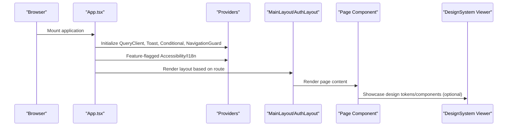
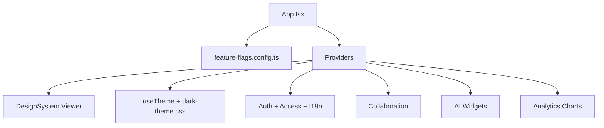

# Component Library

<cite>
**Referenced Files in This Document**
- [App.tsx](file://apps/web/src/App.tsx)
- [DesignSystem.tsx](file://apps/web/src/components/ux/DesignSystem.tsx)
- [AIChatWidget.tsx](file://apps/web/src/components/ai/AIChatWidget.tsx)
- [AISuggestions.tsx](file://apps/web/src/components/ai/AISuggestions.tsx)
- [AIPredictiveErrors.tsx](file://apps/web/src/components/ai/AIPredictiveErrors.tsx)
- [AISmartSearch.tsx](file://apps/web/src/components/ai/AISmartSearch.tsx)
- [CompletionRateChart.tsx](file://apps/web/src/components/analytics/CompletionRateChart.tsx)
- [DropOffFunnelChart.tsx](file://apps/web/src/components/analytics/DropOffFunnelChart.tsx)
- [RetentionChart.tsx](file://apps/web/src/components/analytics/RetentionChart.tsx)
- [UserGrowthChart.tsx](file://apps/web/src/components/analytics/UserGrowthChart.tsx)
- [Comments.tsx](file://apps/web/src/components/collaboration/Comments.tsx)
- [RealTimeCollaboration.tsx](file://apps/web/src/components/collaboration/RealTimeCollaboration.tsx)
- [OAuthButtons.tsx](file://apps/web/src/components/auth/OAuthButtons.tsx)
- [RequireRole.tsx](file://apps/web/src/components/auth/RequireRole.tsx)
- [ToastProvider](file://apps/web/src/components/ui)
- [ConditionalProvider.tsx](file://apps/web/src/components/ConditionalProvider.tsx)
- [ErrorBoundary.tsx](file://apps/web/src/components/ErrorBoundary.tsx)
- [Accessibility.tsx](file://apps/web/src/components/accessibility/Accessibility.tsx)
- [Internationalization.tsx](file://apps/web/src/components/i18n/Internationalization.tsx)
- [feature-flags.config.ts](file://apps/web/src/config/feature-flags.config.ts)
- [useTheme.ts](file://apps/web/src/hooks/useTheme.ts)
- [dark-theme.css](file://apps/web/src/styles/dark-theme.css)
</cite>

## Table of Contents
1. [Introduction](#introduction)
2. [Project Structure](#project-structure)
3. [Core Components](#core-components)
4. [Architecture Overview](#architecture-overview)
5. [Detailed Component Analysis](#detailed-component-analysis)
6. [Dependency Analysis](#dependency-analysis)
7. [Performance Considerations](#performance-considerations)
8. [Troubleshooting Guide](#troubleshooting-guide)
9. [Conclusion](#conclusion)
10. [Appendices](#appendices)

## Introduction
This document describes the React 19 component library powering the application’s UI system. It covers the design system foundation, component hierarchy, reusable patterns, and specialized components for AI, analytics, collaboration, authentication, and more. It also documents layout components, accessibility and internationalization features, responsive design, and integration guidelines.

## Project Structure
The UI system is organized around:
- Application shell and routing in the main App component
- Feature-specific component groups under components/<category>
- A design system viewer for tokens and component showcases
- Providers for theme, accessibility, i18n, and conditional features
- Theme and hooks supporting responsive and accessible UI

```mermaid
graph TB
App["App.tsx<br/>Routing + Providers"] --> Layouts["Layouts<br/>MainLayout, AuthLayout"]
App --> Providers["Providers<br/>QueryClient, Toast, Conditional, NavigationGuard"]
Providers --> FeatureFlags["Feature Flags Config"]
App --> Pages["Pages<br/>Lazy-loaded routes"]
Pages --> Components["Components<br/>ui, ai, analytics, collaboration, auth, i18n, accessibility"]
Components --> DS["DesignSystem Viewer"]
Components --> Hooks["Hooks<br/>useTheme"]
Components --> Styles["Styles<br/>dark-theme.css"]
```

**Diagram sources**
- [App.tsx:189-284](file://apps/web/src/App.tsx#L189-L284)
- [DesignSystem.tsx:718-734](file://apps/web/src/components/ux/DesignSystem.tsx#L718-L734)

**Section sources**
- [App.tsx:189-284](file://apps/web/src/App.tsx#L189-L284)

## Core Components
- Providers and wrappers:
  - QueryClientProvider for caching and data fetching
  - ToastProvider for notifications
  - ConditionalProvider for feature-flagged providers
  - NavigationGuardProvider for navigation safety
  - AccessibilityProvider and I18nProvider for inclusive experiences
- Layouts:
  - MainLayout for authenticated routes
  - AuthLayout for public authentication routes
- Utility providers:
  - ErrorBoundary for error handling
  - ConditionalProvider for conditional provider injection

These components orchestrate routing, state, and cross-cutting concerns while keeping UI components focused and reusable.

**Section sources**
- [App.tsx:10-22](file://apps/web/src/App.tsx#L10-L22)
- [App.tsx:194-201](file://apps/web/src/App.tsx#L194-L201)
- [App.tsx:202-279](file://apps/web/src/App.tsx#L202-L279)

## Architecture Overview
The runtime architecture composes providers, layouts, and pages with lazy-loading and conditional feature toggles. The design system viewer demonstrates tokens and component usage.

**Diagram sources**
- [App.tsx:189-284](file://apps/web/src/App.tsx#L189-L284)
- [DesignSystem.tsx:718-734](file://apps/web/src/components/ux/DesignSystem.tsx#L718-L734)

## Detailed Component Analysis

### Design System and Tokens
The design system defines spacing scales, color palettes, typography, and component showcases. It includes a viewer component to navigate sections and render examples.

Key capabilities:
- Centralized design tokens (spacing, colors, typography)
- Component showcase for alerts and other UI elements
- Section-based viewer with navigation

Usage pattern:
- Import tokens and viewer in pages or documentation surfaces
- Use tokens consistently across components for visual coherence

**Section sources**
- [DesignSystem.tsx:18-69](file://apps/web/src/components/ux/DesignSystem.tsx#L18-L69)
- [DesignSystem.tsx:694-712](file://apps/web/src/components/ux/DesignSystem.tsx#L694-L712)
- [DesignSystem.tsx:718-734](file://apps/web/src/components/ux/DesignSystem.tsx#L718-L734)

### Layout Components
- MainLayout: Wraps authenticated application routes and provides navigation scaffolding.
- AuthLayout: Wraps public authentication routes with minimal layout framing.

Configuration options:
- Route protection via ProtectedRoute/PublicRoute wrappers
- Conditional rendering based on authentication state
- Feature-flag gating for legacy modules

Integration:
- Both layouts are used as route elements with lazy-loaded page components.

**Section sources**
- [App.tsx:222-261](file://apps/web/src/App.tsx#L222-L261)
- [App.tsx:149-187](file://apps/web/src/App.tsx#L149-L187)

### AI Widgets and Features
- AIChatWidget: Interactive chat widget for conversational AI.
- AISuggestions: Provides contextual suggestions based on content or context.
- AIPredictiveErrors: Predictive error handling and guidance.
- AISmartSearch: Intelligent search with AI assistance.

Common patterns:
- Context-aware suggestions
- Predictive UX improvements
- Search and retrieval enhancements

Customization:
- Props for model selection, input modes, and suggestion thresholds
- Event handlers for submit, change, and error states
- Theming and sizing via design tokens

**Section sources**
- [AIChatWidget.tsx](file://apps/web/src/components/ai/AIChatWidget.tsx)
- [AISuggestions.tsx](file://apps/web/src/components/ai/AISuggestions.tsx)
- [AIPredictiveErrors.tsx](file://apps/web/src/components/ai/AIPredictiveErrors.tsx)
- [AISmartSearch.tsx](file://apps/web/src/components/ai/AISmartSearch.tsx)

### Analytics Charts
- CompletionRateChart: Visualizes completion metrics over time.
- DropOffFunnelChart: Shows drop-off progression across steps.
- RetentionChart: Tracks retention trends.
- UserGrowthChart: Displays user acquisition and growth.

Implementation notes:
- Data-driven chart components with configurable series and axes
- Responsive sizing and theme-aware rendering
- Accessibility-compliant labeling and legends

**Section sources**
- [CompletionRateChart.tsx](file://apps/web/src/components/analytics/CompletionRateChart.tsx)
- [DropOffFunnelChart.tsx](file://apps/web/src/components/analytics/DropOffFunnelChart.tsx)
- [RetentionChart.tsx](file://apps/web/src/components/analytics/RetentionChart.tsx)
- [UserGrowthChart.tsx](file://apps/web/src/components/analytics/UserGrowthChart.tsx)

### Collaboration Tools
- Comments: Threaded comment system for collaborative review.
- RealTimeCollaboration: Live collaboration indicators and presence.

Patterns:
- Real-time updates and optimistic UI
- Conflict-free updates and conflict resolution
- User presence and activity indicators

**Section sources**
- [Comments.tsx](file://apps/web/src/components/collaboration/Comments.tsx)
- [RealTimeCollaboration.tsx](file://apps/web/src/components/collaboration/RealTimeCollaboration.tsx)

### Authentication Components
- OAuthButtons: Social login buttons with provider-specific styling.
- RequireRole: Authorization guard for role-based access.

Patterns:
- Provider-agnostic OAuth flows
- Role-based route protection
- Redirect handling for login/logout

**Section sources**
- [OAuthButtons.tsx](file://apps/web/src/components/auth/OAuthButtons.tsx)
- [RequireRole.tsx](file://apps/web/src/components/auth/RequireRole.tsx)

### UI Utilities and Providers
- ToastProvider: Notification system for user feedback.
- ConditionalProvider: Injects providers conditionally based on feature flags.
- ErrorBoundary: Graceful error handling with fallback UI.

Patterns:
- Global state for notifications
- Feature-flag driven capability activation
- Boundary-based error recovery

**Section sources**
- [App.tsx:10](file://apps/web/src/App.tsx#L10)
- [ConditionalProvider.tsx](file://apps/web/src/components/ConditionalProvider.tsx)
- [ErrorBoundary.tsx](file://apps/web/src/components/ErrorBoundary.tsx)

### Accessibility and Internationalization
- AccessibilityProvider: Enables accessibility features based on user preferences.
- Internationalization: I18nProvider supports localization and regionalization.

Patterns:
- Conditional feature activation
- Theme-aware and locale-aware rendering
- Keyboard navigation and screen-reader support

**Section sources**
- [App.tsx:17-18](file://apps/web/src/App.tsx#L17-L18)
- [Accessibility.tsx](file://apps/web/src/components/accessibility/Accessibility.tsx)
- [Internationalization.tsx](file://apps/web/src/components/i18n/Internationalization.tsx)

### Theming and Responsive Design
- useTheme hook: Manages theme state and applies dark/light themes.
- dark-theme.css: Defines dark mode tokens and overrides.

Patterns:
- CSS custom properties for theme tokens
- Runtime theme switching
- Breakpoint-based responsive layouts

**Section sources**
- [useTheme.ts](file://apps/web/src/hooks/useTheme.ts)
- [dark-theme.css](file://apps/web/src/styles/dark-theme.css)

## Dependency Analysis
The component library relies on:
- Routing and lazy loading for performance
- Feature flags to gate advanced capabilities
- Providers for state, notifications, and navigation safety
- Design tokens for consistent visuals

**Diagram sources**
- [App.tsx:189-284](file://apps/web/src/App.tsx#L189-L284)
- [feature-flags.config.ts](file://apps/web/src/config/feature-flags.config.ts)

**Section sources**
- [App.tsx:13-21](file://apps/web/src/App.tsx#L13-L21)
- [feature-flags.config.ts](file://apps/web/src/config/feature-flags.config.ts)

## Performance Considerations
- Lazy loading: Routes are lazy-loaded to reduce initial bundle size.
- Caching: React Query client configured with retry and staleTime to balance freshness and performance.
- Conditional providers: Feature flags prevent unnecessary provider initialization.
- Suspense: Fallback UI during route transitions.

Recommendations:
- Keep component trees shallow for frequently rendered views.
- Use selective re-renders and memoization for heavy charts and lists.
- Monitor hydration and initial load metrics.

**Section sources**
- [App.tsx:124-136](file://apps/web/src/App.tsx#L124-L136)
- [App.tsx:139-147](file://apps/web/src/App.tsx#L139-L147)
- [App.tsx:194-201](file://apps/web/src/App.tsx#L194-L201)

## Troubleshooting Guide
- Error boundaries: Wrap top-level routes to catch rendering errors and show fallback UI.
- Feature flags: Verify flags in configuration to ensure providers are initialized as expected.
- Theme issues: Confirm theme hooks and CSS custom properties are applied correctly.
- Navigation: Use ProtectedRoute/PublicRoute wrappers to avoid redirect loops.

**Section sources**
- [ErrorBoundary.tsx](file://apps/web/src/components/ErrorBoundary.tsx)
- [feature-flags.config.ts](file://apps/web/src/config/feature-flags.config.ts)
- [useTheme.ts](file://apps/web/src/hooks/useTheme.ts)

## Conclusion
The component library establishes a cohesive, extensible UI system built on design tokens, feature-flagged capabilities, and robust providers. It supports modern UX patterns including AI-assisted workflows, real-time collaboration, analytics visualization, and inclusive design. By following the documented patterns and integration guidelines, teams can maintain consistency, performance, and accessibility across the application.

## Appendices

### Component Catalog Index
- Layouts: MainLayout, AuthLayout
- Providers: QueryClientProvider, ToastProvider, ConditionalProvider, NavigationGuardProvider
- Accessibility and i18n: AccessibilityProvider, I18nProvider
- AI: AIChatWidget, AISuggestions, AIPredictiveErrors, AISmartSearch
- Analytics: CompletionRateChart, DropOffFunnelChart, RetentionChart, UserGrowthChart
- Collaboration: Comments, RealTimeCollaboration
- Authentication: OAuthButtons, RequireRole
- Design System: DesignSystem Viewer and tokens

[No sources needed since this section indexes previously analyzed components]