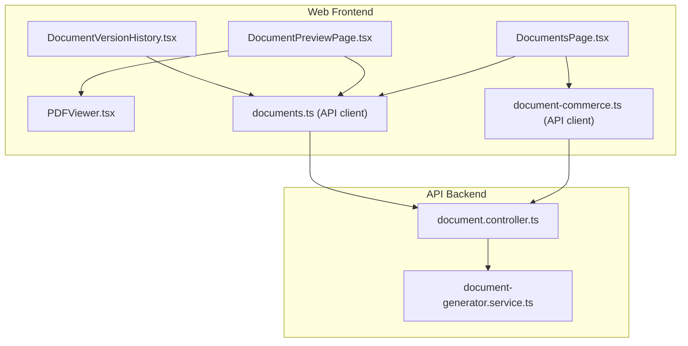
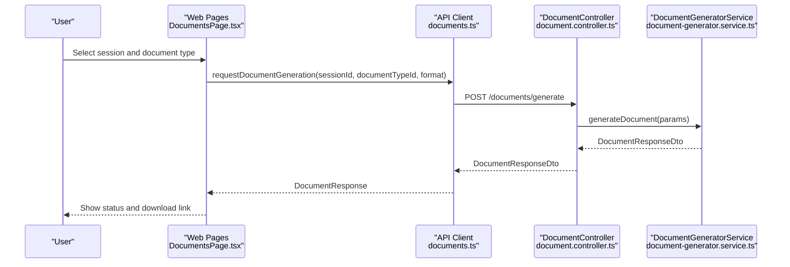
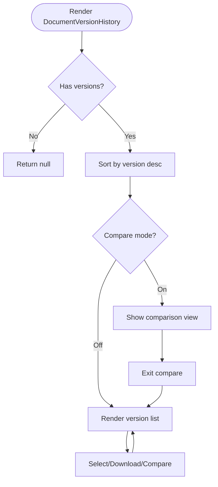
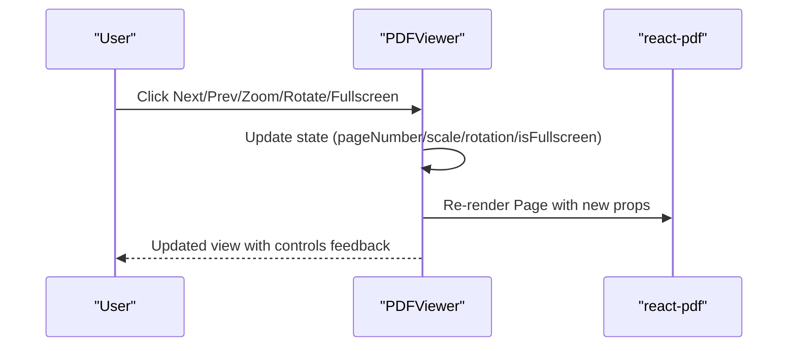
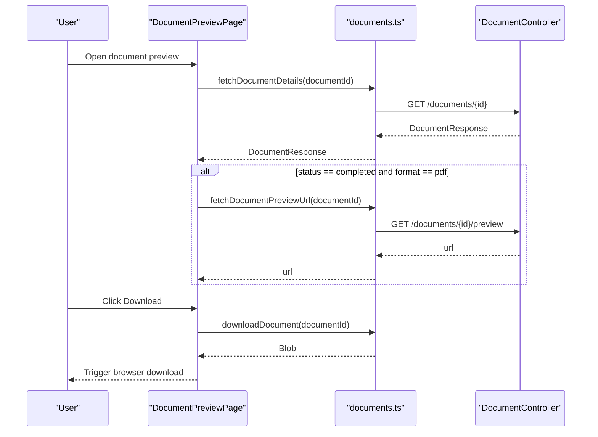
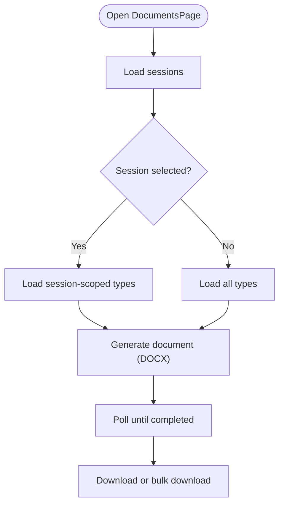
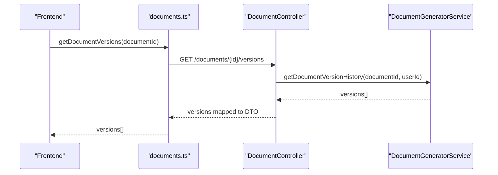
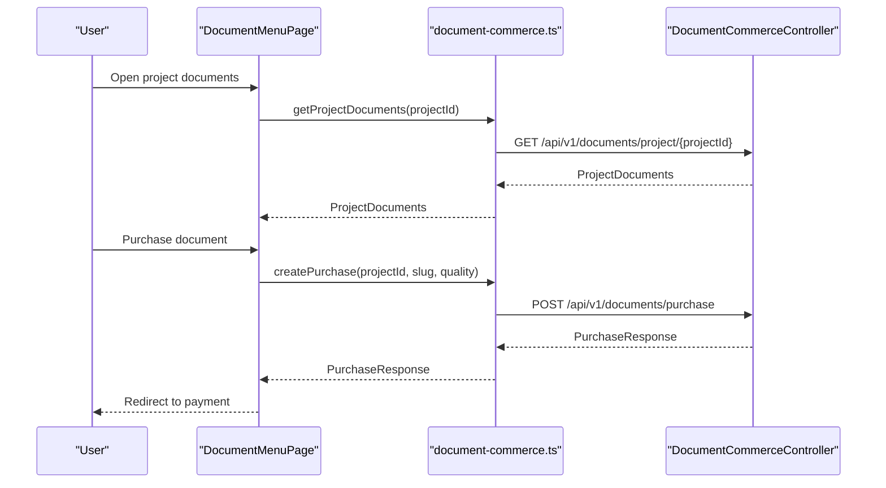
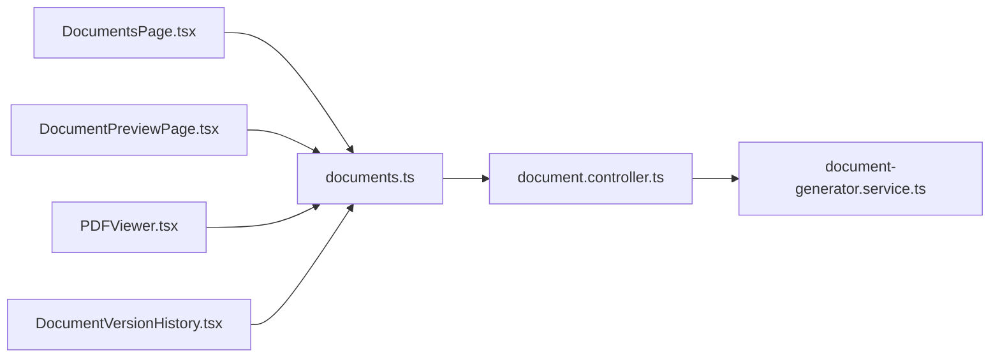

# Document Components

<cite>
**Referenced Files in This Document**
- [DocumentVersionHistory.tsx](file://apps/web/src/components/documents/DocumentVersionHistory.tsx)
- [PDFViewer.tsx](file://apps/web/src/components/documents/PDFViewer.tsx)
- [DocumentPreviewPage.tsx](file://apps/web/src/pages/documents/DocumentPreviewPage.tsx)
- [DocumentsPage.tsx](file://apps/web/src/pages/documents/DocumentsPage.tsx)
- [documents.ts](file://apps/web/src/api/documents.ts)
- [document.controller.ts](file://apps/api/src/modules/document-generator/controllers/document.controller.ts)
- [document-generator.service.ts](file://apps/api/src/modules/document-generator/services/document-generator.service.ts)
- [document-commerce.ts](file://apps/web/src/api/documentCommerce.ts)
- [DocumentMenuPage.tsx](file://apps/web/src/pages/document-menu/DocumentMenuPage.tsx)
- [PDFViewer.tsx](file://apps/web/src/components/documents/PDFViewer.tsx)
</cite>

## Table of Contents
1. [Introduction](#introduction)
2. [Project Structure](#project-structure)
3. [Core Components](#core-components)
4. [Architecture Overview](#architecture-overview)
5. [Detailed Component Analysis](#detailed-component-analysis)
6. [Dependency Analysis](#dependency-analysis)
7. [Performance Considerations](#performance-considerations)
8. [Troubleshooting Guide](#troubleshooting-guide)
9. [Conclusion](#conclusion)
10. [Appendices](#appendices)

## Introduction
This document explains the document-related components focused on DocumentVersionHistory and PDFViewer, along with supporting pages and APIs. It covers document rendering patterns, version management, viewer integration, configuration for different formats, annotation support, export functionality, performance optimization for large documents, lazy loading strategies, accessibility features, and practical examples of document workflow integration and user interaction patterns.

## Project Structure
The document system spans frontend components and pages, a dedicated API module for document generation and retrieval, and commerce-related flows for paid document purchases.

**Diagram sources**
- [DocumentsPage.tsx:1-378](file://apps/web/src/pages/documents/DocumentsPage.tsx#L1-L378)
- [DocumentPreviewPage.tsx:1-370](file://apps/web/src/pages/documents/DocumentPreviewPage.tsx#L1-L370)
- [PDFViewer.tsx:1-335](file://apps/web/src/components/documents/PDFViewer.tsx#L1-L335)
- [DocumentVersionHistory.tsx:1-517](file://apps/web/src/components/documents/DocumentVersionHistory.tsx#L1-L517)
- [documents.ts:1-135](file://apps/web/src/api/documents.ts#L1-L135)
- [document-commerce.ts:1-145](file://apps/web/src/api/documentCommerce.ts#L1-L145)
- [document.controller.ts:1-278](file://apps/api/src/modules/document-generator/controllers/document.controller.ts#L1-L278)
- [document-generator.service.ts:1-372](file://apps/api/src/modules/document-generator/services/document-generator.service.ts#L1-L372)

**Section sources**
- [DocumentsPage.tsx:1-378](file://apps/web/src/pages/documents/DocumentsPage.tsx#L1-L378)
- [DocumentPreviewPage.tsx:1-370](file://apps/web/src/pages/documents/DocumentPreviewPage.tsx#L1-L370)
- [PDFViewer.tsx:1-335](file://apps/web/src/components/documents/PDFViewer.tsx#L1-L335)
- [DocumentVersionHistory.tsx:1-517](file://apps/web/src/components/documents/DocumentVersionHistory.tsx#L1-L517)
- [documents.ts:1-135](file://apps/web/src/api/documents.ts#L1-L135)
- [document.controller.ts:1-278](file://apps/api/src/modules/document-generator/controllers/document.controller.ts#L1-L278)
- [document-generator.service.ts:1-372](file://apps/api/src/modules/document-generator/services/document-generator.service.ts#L1-L372)
- [document-commerce.ts:1-145](file://apps/web/src/api/documentCommerce.ts#L1-L145)

## Core Components
- DocumentVersionHistory: Renders a timeline of document versions, supports selection, comparison, and download actions. It computes differences between versions and displays status badges and metadata.
- PDFViewer: A React-based PDF viewer integrating react-pdf with controls for navigation, zoom, rotation, fullscreen, and download. It handles loading states, errors, and keyboard shortcuts.

Key responsibilities:
- DocumentVersionHistory
  - Accepts a list of versions and current version
  - Supports expand/collapse, compare two versions, and download actions
  - Computes time delta and file size change between versions
- PDFViewer
  - Manages page navigation, zoom, rotation, fullscreen
  - Configures PDF.js worker and disables text/annotation layers by default
  - Provides a toolbar with controls and keyboard hints

**Section sources**
- [DocumentVersionHistory.tsx:28-109](file://apps/web/src/components/documents/DocumentVersionHistory.tsx#L28-L109)
- [DocumentVersionHistory.tsx:336-515](file://apps/web/src/components/documents/DocumentVersionHistory.tsx#L336-L515)
- [PDFViewer.tsx:30-73](file://apps/web/src/components/documents/PDFViewer.tsx#L30-L73)
- [PDFViewer.tsx:62-333](file://apps/web/src/components/documents/PDFViewer.tsx#L62-L333)

## Architecture Overview
The document workflow integrates frontend pages and components with backend controllers and services. Users generate documents from questionnaire sessions, then preview and manage versions. Paid document purchases integrate with commerce APIs.

**Diagram sources**
- [DocumentsPage.tsx:110-132](file://apps/web/src/pages/documents/DocumentsPage.tsx#L110-L132)
- [documents.ts:58-69](file://apps/web/src/api/documents.ts#L58-L69)
- [document.controller.ts:54-65](file://apps/api/src/modules/document-generator/controllers/document.controller.ts#L54-L65)
- [document-generator.service.ts:22-136](file://apps/api/src/modules/document-generator/services/document-generator.service.ts#L22-L136)

## Detailed Component Analysis

### DocumentVersionHistory
- Purpose: Display version timeline, compare versions, and trigger download/restore actions.
- Data model: DocumentVersion with status, format, timestamps, optional metadata, and change description.
- Behavior:
  - Expand/collapse to show more versions
  - Compare two versions and compute time delta and file size change
  - Download individual versions via callback
  - Status badges reflect completion, pending, processing, failed, approved/rejected states

**Diagram sources**
- [DocumentVersionHistory.tsx:336-515](file://apps/web/src/components/documents/DocumentVersionHistory.tsx#L336-L515)

**Section sources**
- [DocumentVersionHistory.tsx:28-109](file://apps/web/src/components/documents/DocumentVersionHistory.tsx#L28-L109)
- [DocumentVersionHistory.tsx:241-330](file://apps/web/src/components/documents/DocumentVersionHistory.tsx#L241-L330)
- [DocumentVersionHistory.tsx:336-515](file://apps/web/src/components/documents/DocumentVersionHistory.tsx#L336-L515)

### PDFViewer
- Purpose: Provide a robust PDF preview with navigation, zoom, rotation, fullscreen, and download.
- Controls: Previous/Next page, first/last page, zoom in/out/reset, rotate, fullscreen toggle, download.
- Rendering: Uses react-pdf Document and Page components; text and annotation layers are disabled by default to optimize performance.
- Accessibility: Keyboard hints for navigation and zoom; fullscreen mode for immersive viewing.

**Diagram sources**
- [PDFViewer.tsx:62-333](file://apps/web/src/components/documents/PDFViewer.tsx#L62-L333)

**Section sources**
- [PDFViewer.tsx:30-73](file://apps/web/src/components/documents/PDFViewer.tsx#L30-L73)
- [PDFViewer.tsx:62-123](file://apps/web/src/components/documents/PDFViewer.tsx#L62-L123)
- [PDFViewer.tsx:315-333](file://apps/web/src/components/documents/PDFViewer.tsx#L315-L333)

### Document Preview Page
- Purpose: Centralized preview experience for a single document, handling statuses (pending, processing, completed, failed), polling, and fallbacks.
- Features:
  - Polls for completion when status is processing
  - Fetches preview URL for PDFs; falls back to download URL if preview fails
  - Downloads documents via API client
  - Displays metadata (format, pages, size, created date)

**Diagram sources**
- [DocumentPreviewPage.tsx:52-122](file://apps/web/src/pages/documents/DocumentPreviewPage.tsx#L52-L122)
- [documents.ts:41-50](file://apps/web/src/api/documents.ts#L41-L50)
- [documents.ts:46-50](file://apps/web/src/api/documents.ts#L46-L50)
- [documents.ts:76-82](file://apps/web/src/api/documents.ts#L76-L82)
- [document.controller.ts:107-117](file://apps/api/src/modules/document-generator/controllers/document.controller.ts#L107-L117)
- [document.controller.ts:199-209](file://apps/api/src/modules/document-generator/controllers/document.controller.ts#L199-L209)

**Section sources**
- [DocumentPreviewPage.tsx:52-122](file://apps/web/src/pages/documents/DocumentPreviewPage.tsx#L52-L122)
- [DocumentPreviewPage.tsx:327-364](file://apps/web/src/pages/documents/DocumentPreviewPage.tsx#L327-L364)
- [documents.ts:41-50](file://apps/web/src/api/documents.ts#L41-L50)
- [documents.ts:46-50](file://apps/web/src/api/documents.ts#L46-L50)
- [documents.ts:76-82](file://apps/web/src/api/documents.ts#L76-L82)
- [document.controller.ts:107-117](file://apps/api/src/modules/document-generator/controllers/document.controller.ts#L107-L117)
- [document.controller.ts:199-209](file://apps/api/src/modules/document-generator/controllers/document.controller.ts#L199-L209)

### Documents Page (Generation)
- Purpose: Allow users to select a completed session, choose document types, and generate documents (DOCX currently; PDF export is noted as upcoming).
- Features:
  - Session selection with completed sessions
  - Document type listing scoped to session when selected
  - Generation request with progress indication
  - Bulk download ZIP for session documents

**Diagram sources**
- [DocumentsPage.tsx:47-99](file://apps/web/src/pages/documents/DocumentsPage.tsx#L47-L99)
- [DocumentsPage.tsx:110-132](file://apps/web/src/pages/documents/DocumentsPage.tsx#L110-L132)
- [DocumentsPage.tsx:136-160](file://apps/web/src/pages/documents/DocumentsPage.tsx#L136-L160)

**Section sources**
- [DocumentsPage.tsx:47-99](file://apps/web/src/pages/documents/DocumentsPage.tsx#L47-L99)
- [DocumentsPage.tsx:110-132](file://apps/web/src/pages/documents/DocumentsPage.tsx#L110-L132)
- [DocumentsPage.tsx:136-160](file://apps/web/src/pages/documents/DocumentsPage.tsx#L136-L160)

### Document Version Management (Backend)
- Version history retrieval: Controller endpoint returns all versions for a document’s session and type, ordered by version descending.
- Version download URLs: Secure pre-signed URLs are generated for specific versions with status checks and availability validation.

**Diagram sources**
- [documents.ts:123-126](file://apps/web/src/api/documents.ts#L123-L126)
- [document.controller.ts:199-209](file://apps/api/src/modules/document-generator/controllers/document.controller.ts#L199-L209)
- [document-generator.service.ts:311-325](file://apps/api/src/modules/document-generator/services/document-generator.service.ts#L311-L325)

**Section sources**
- [document.controller.ts:199-209](file://apps/api/src/modules/document-generator/controllers/document.controller.ts#L199-L209)
- [document-generator.service.ts:311-325](file://apps/api/src/modules/document-generator/services/document-generator.service.ts#L311-L325)
- [document-generator.service.ts:330-366](file://apps/api/src/modules/document-generator/services/document-generator.service.ts#L330-L366)

### Document Commerce Integration
- Project-level document catalog and purchase flow:
  - Retrieve available documents per project
  - Calculate price and quality level
  - Create purchase and redirect to payment
- The DocumentMenuPage coordinates project documents and purchases.

**Diagram sources**
- [DocumentMenuPage.tsx:331-376](file://apps/web/src/pages/document-menu/DocumentMenuPage.tsx#L331-L376)
- [document-commerce.ts:97-116](file://apps/web/src/api/documentCommerce.ts#L97-L116)
- [document-commerce.ts:136-143](file://apps/web/src/api/documentCommerce.ts#L136-L143)

**Section sources**
- [DocumentMenuPage.tsx:331-376](file://apps/web/src/pages/document-menu/DocumentMenuPage.tsx#L331-L376)
- [document-commerce.ts:97-116](file://apps/web/src/api/documentCommerce.ts#L97-L116)
- [document-commerce.ts:136-143](file://apps/web/src/api/documentCommerce.ts#L136-L143)

## Dependency Analysis
- Frontend pages depend on the documents API client for fetching types, initiating generation, downloading, and retrieving versions.
- The API controller delegates to the document generator service, which orchestrates template assembly, AI content generation, building, storage, and metadata updates.
- Version history and download URL generation enforce access control and status validation.

**Diagram sources**
- [DocumentsPage.tsx:1-378](file://apps/web/src/pages/documents/DocumentsPage.tsx#L1-L378)
- [DocumentPreviewPage.tsx:1-370](file://apps/web/src/pages/documents/DocumentPreviewPage.tsx#L1-L370)
- [PDFViewer.tsx:1-335](file://apps/web/src/components/documents/PDFViewer.tsx#L1-L335)
- [DocumentVersionHistory.tsx:1-517](file://apps/web/src/components/documents/DocumentVersionHistory.tsx#L1-L517)
- [documents.ts:1-135](file://apps/web/src/api/documents.ts#L1-L135)
- [document.controller.ts:1-278](file://apps/api/src/modules/document-generator/controllers/document.controller.ts#L1-L278)
- [document-generator.service.ts:1-372](file://apps/api/src/modules/document-generator/services/document-generator.service.ts#L1-L372)

**Section sources**
- [documents.ts:1-135](file://apps/web/src/api/documents.ts#L1-L135)
- [document.controller.ts:1-278](file://apps/api/src/modules/document-generator/controllers/document.controller.ts#L1-L278)
- [document-generator.service.ts:1-372](file://apps/api/src/modules/document-generator/services/document-generator.service.ts#L1-L372)

## Performance Considerations
- Large document rendering
  - Disable text and annotation layers by default in PDFViewer to reduce DOM and layout overhead.
  - Use controlled zoom and page navigation to avoid unnecessary re-renders.
- Lazy loading
  - Defer preview URL fetch until document reaches completed status.
  - Use pagination-style rendering for version lists (expand/collapse) to limit DOM nodes.
- Memory optimization
  - Avoid storing large blobs in component state; use temporary object URLs for downloads.
  - Clean up object URLs after triggering downloads.
- Network efficiency
  - Polling interval adapts to status (e.g., every few seconds while processing).
  - Bulk download ZIP reduces multiple requests for session documents.
- Accessibility
  - Provide keyboard hints for navigation and zoom.
  - Offer fullscreen mode for improved readability.

[No sources needed since this section provides general guidance]

## Troubleshooting Guide
- PDF fails to load
  - Check error handling in PDFViewer and log messages; ensure PDF.js worker is configured correctly.
  - Verify src prop is a valid URL or base64 data.
- Preview URL unavailable
  - DocumentPreviewPage falls back to download URL if preview URL fetch fails.
  - Confirm document status is completed and format is PDF.
- Version download not available
  - Ensure version status is generated/approved and storage URL exists.
  - Validate access permissions via user ID.
- Generation stuck on processing
  - Use refresh button to poll status; confirm backend processing pipeline is healthy.

**Section sources**
- [PDFViewer.tsx:89-94](file://apps/web/src/components/documents/PDFViewer.tsx#L89-L94)
- [PDFViewer.tsx:27-28](file://apps/web/src/components/documents/PDFViewer.tsx#L27-L28)
- [DocumentPreviewPage.tsx:80-92](file://apps/web/src/pages/documents/DocumentPreviewPage.tsx#L80-L92)
- [document-generator.service.ts:352-366](file://apps/api/src/modules/document-generator/services/document-generator.service.ts#L352-L366)

## Conclusion
The document system combines reusable frontend components (PDFViewer and DocumentVersionHistory) with a robust backend pipeline for document generation, versioning, and secure downloads. The design emphasizes performance, accessibility, and a smooth user experience across generation, preview, and version management workflows.

[No sources needed since this section summarizes without analyzing specific files]

## Appendices

### Component Configuration Reference
- PDFViewer props
  - src: URL or base64 data of the PDF
  - title: Title to display in the toolbar
  - onDownload: Callback when download is clicked
  - showDownload: Toggle download button visibility
  - initialScale, minScale, maxScale: Zoom configuration
  - enableFullscreen: Toggle fullscreen mode
  - height: Viewer height
- DocumentVersionHistory props
  - documentId: Base document identifier
  - currentVersion: Active version number
  - versions: Array of DocumentVersion entries
  - onDownload/onCompare/onRestore: Action callbacks

**Section sources**
- [PDFViewer.tsx:30-51](file://apps/web/src/components/documents/PDFViewer.tsx#L30-L51)
- [DocumentVersionHistory.tsx:47-56](file://apps/web/src/components/documents/DocumentVersionHistory.tsx#L47-L56)

### Export Functionality
- Download single document: documents.ts downloadDocument
- Bulk download session: documents.ts bulkDownloadSession
- Version-specific download: documents.ts downloadDocumentVersion
- PDF export: marked as upcoming in DocumentsPage UI

**Section sources**
- [documents.ts:76-102](file://apps/web/src/api/documents.ts#L76-L102)
- [documents.ts:128-134](file://apps/web/src/api/documents.ts#L128-L134)
- [DocumentsPage.tsx:358-366](file://apps/web/src/pages/documents/DocumentsPage.tsx#L358-L366)