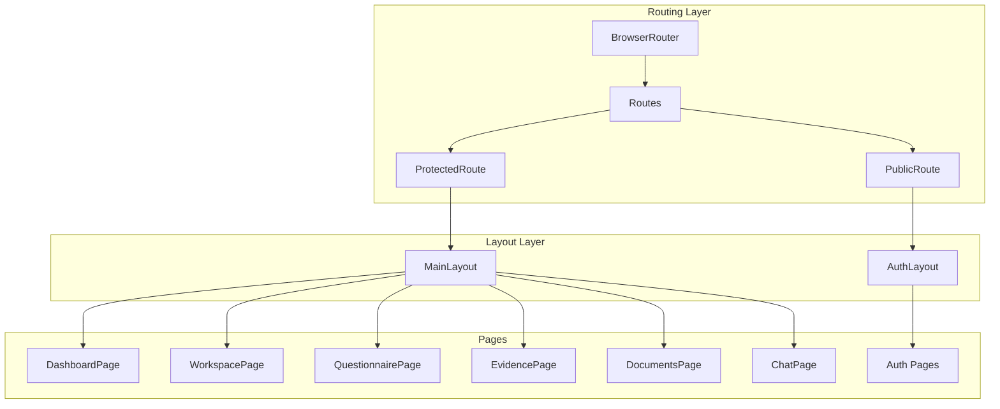
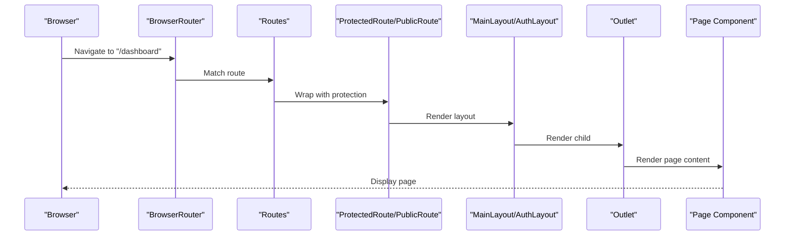
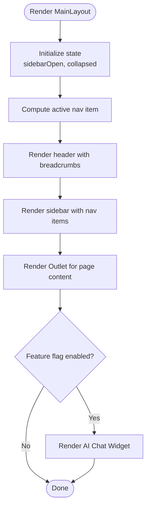
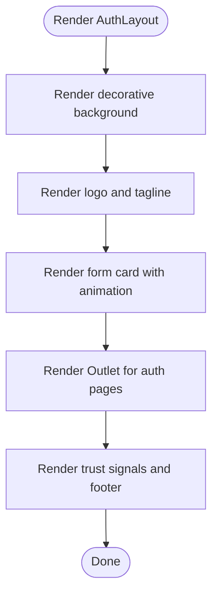
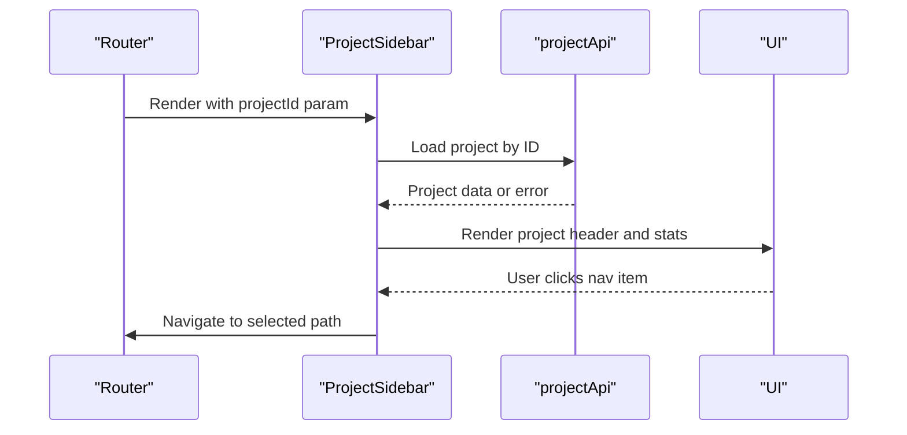
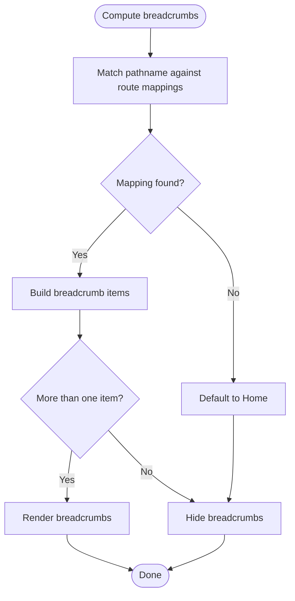
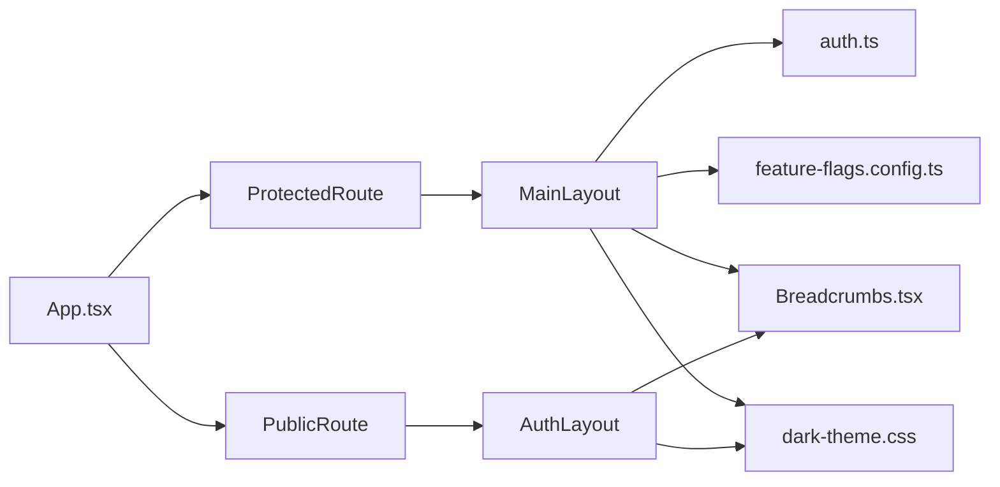

# Layout Components

<cite>
**Referenced Files in This Document**
- [App.tsx](file://apps/web/src/App.tsx)
- [MainLayout.tsx](file://apps/web/src/components/layout/MainLayout.tsx)
- [AuthLayout.tsx](file://apps/web/src/components/layout/AuthLayout.tsx)
- [ProjectSidebar.tsx](file://apps/web/src/components/layout/ProjectSidebar.tsx)
- [Breadcrumbs.tsx](file://apps/web/src/components/ux/Breadcrumbs.tsx)
- [auth.ts](file://apps/web/src/stores/auth.ts)
- [feature-flags.config.ts](file://apps/web/src/config/feature-flags.config.ts)
- [dark-theme.css](file://apps/web/src/styles/dark-theme.css)
</cite>

## Table of Contents
1. [Introduction](#introduction)
2. [Project Structure](#project-structure)
3. [Core Components](#core-components)
4. [Architecture Overview](#architecture-overview)
5. [Detailed Component Analysis](#detailed-component-analysis)
6. [Dependency Analysis](#dependency-analysis)
7. [Performance Considerations](#performance-considerations)
8. [Troubleshooting Guide](#troubleshooting-guide)
9. [Conclusion](#conclusion)

## Introduction
This document explains the layout system used by the web application, focusing on three primary layout components: MainLayout, AuthLayout, and ProjectSidebar. It covers the layout architecture, navigation patterns, responsive behavior, routing integration, authentication gating, and customization options for branding and navigation structure. It also provides examples of layout composition and integration with the routing system.

## Project Structure
The layout system is centered around two layout components integrated into the routing configuration:
- MainLayout: Used for authenticated, protected routes inside the main application shell.
- AuthLayout: Used for public authentication routes (login, register, forgot password, etc.).

Routing is configured in the main application entry point, which wraps protected routes with a ProtectedRoute wrapper and public routes with a PublicRoute wrapper. Both wrappers rely on the authentication store to determine whether to render the layout with the requested page or redirect appropriately.

**Diagram sources**
- [App.tsx:202-270](file://apps/web/src/App.tsx#L202-L270)
- [MainLayout.tsx:72-366](file://apps/web/src/components/layout/MainLayout.tsx#L72-L366)
- [AuthLayout.tsx:9-90](file://apps/web/src/components/layout/AuthLayout.tsx#L9-L90)

**Section sources**
- [App.tsx:189-284](file://apps/web/src/App.tsx#L189-L284)

## Core Components
- MainLayout: Provides the primary application shell with a collapsible sidebar, top header, breadcrumbs, and footer. Integrates with the authentication store for user info and logout, and conditionally renders an AI chat widget based on feature flags.
- AuthLayout: Provides a clean, branded authentication shell with trust signals and a prominent logo. Intended for login, registration, and password reset flows.
- ProjectSidebar: Renders project-scoped navigation when viewing a project route. Loads project metadata, displays progress stats, and provides quick navigation to chat, facts, and documents.

Key responsibilities:
- Navigation: MainLayout defines primary navigation items; ProjectSidebar defines project-level navigation items.
- Routing integration: Layouts are mounted under routes defined in App.tsx and receive the current location via React Router.
- Authentication gating: ProtectedRoute and PublicRoute wrappers control access to layouts and pages.
- Responsive behavior: Uses Tailwind classes and CSS custom properties to adapt to different screen sizes.

**Section sources**
- [MainLayout.tsx:72-366](file://apps/web/src/components/layout/MainLayout.tsx#L72-L366)
- [AuthLayout.tsx:9-90](file://apps/web/src/components/layout/AuthLayout.tsx#L9-L90)
- [ProjectSidebar.tsx:27-219](file://apps/web/src/components/layout/ProjectSidebar.tsx#L27-L219)

## Architecture Overview
The layout architecture follows a layered approach:
- Routing layer: Declares routes and wraps them with authentication guards.
- Layout layer: Provides reusable shells for authenticated and unauthenticated flows.
- Page layer: Individual pages rendered inside the layout’s Outlet.
- Utility layer: Stores (auth), breadcrumbs, and feature flags inform behavior.

**Diagram sources**
- [App.tsx:202-270](file://apps/web/src/App.tsx#L202-L270)
- [MainLayout.tsx:340-344](file://apps/web/src/components/layout/MainLayout.tsx#L340-L344)
- [AuthLayout.tsx:61-63](file://apps/web/src/components/layout/AuthLayout.tsx#L61-L63)

## Detailed Component Analysis

### MainLayout
MainLayout is the primary application shell for authenticated users. It manages:
- Collapsible sidebar with navigation items and a user section.
- Top header with breadcrumbs, notifications, theme toggle, and user avatar.
- Footer and optional AI chat widget based on feature flags.
- Active state computation for navigation items.

Responsive behavior:
- Sidebar transforms with translate transitions and collapses to a compact width on larger screens.
- Mobile menu toggles a backdrop and opens the sidebar.
- Header adapts with a skip link and responsive spacing.

Integration with routing:
- Uses React Router’s Outlet to render nested pages.
- Computes active navigation state based on current location.

Authentication integration:
- Reads user info from the auth store and computes initials for display.
- Calls logout and navigates to the login route.

Customization options:
- Branding: Logo and brand accents are defined directly in the component.
- Navigation: The navigation array defines top-level items; bottomNav defines secondary items.
- Features: AI chat widget is gated by a feature flag.

**Diagram sources**
- [MainLayout.tsx:72-366](file://apps/web/src/components/layout/MainLayout.tsx#L72-L366)
- [feature-flags.config.ts:20-21](file://apps/web/src/config/feature-flags.config.ts#L20-L21)

**Section sources**
- [MainLayout.tsx:32-45](file://apps/web/src/components/layout/MainLayout.tsx#L32-L45)
- [MainLayout.tsx:84-88](file://apps/web/src/components/layout/MainLayout.tsx#L84-L88)
- [MainLayout.tsx:124-300](file://apps/web/src/components/layout/MainLayout.tsx#L124-L300)
- [MainLayout.tsx:340-362](file://apps/web/src/components/layout/MainLayout.tsx#L340-L362)

### AuthLayout
AuthLayout provides a dedicated shell for authentication pages:
- Gradient background with decorative blurred circles.
- Centered card with animated fade-in.
- Trust signals (SSL, privacy, terms).
- Skip link for accessibility.

Routing integration:
- Mounted under the public auth route group and renders the Outlet for child auth pages.

Customization options:
- Branding: Logo and tagline are defined directly in the component.
- Trust signals: Links to privacy and terms pages.

**Diagram sources**
- [AuthLayout.tsx:9-90](file://apps/web/src/components/layout/AuthLayout.tsx#L9-L90)

**Section sources**
- [AuthLayout.tsx:27-80](file://apps/web/src/components/layout/AuthLayout.tsx#L27-L80)

### ProjectSidebar
ProjectSidebar renders project-scoped navigation when a project route is active:
- Loads project metadata via an API client and displays a skeleton while loading.
- Shows project header with back navigation and project details.
- Displays progress stats (chat messages toward a goal and quality score).
- Renders project navigation items (Chat, Facts, Documents) with active state and optional badges.

Integration with routing:
- Uses React Router’s useParams, useLocation, and useNavigate to derive active state and navigate between project pages.

**Diagram sources**
- [ProjectSidebar.tsx:27-219](file://apps/web/src/components/layout/ProjectSidebar.tsx#L27-L219)

**Section sources**
- [ProjectSidebar.tsx:34-50](file://apps/web/src/components/layout/ProjectSidebar.tsx#L34-L50)
- [ProjectSidebar.tsx:54-71](file://apps/web/src/components/layout/ProjectSidebar.tsx#L54-L71)
- [ProjectSidebar.tsx:174-202](file://apps/web/src/components/layout/ProjectSidebar.tsx#L174-L202)

### Breadcrumb Integration
MainLayout integrates breadcrumbs via a small helper that computes breadcrumb items from the current pathname using predefined route mappings. The helper returns items only when multiple are needed, otherwise it hides breadcrumbs.

**Diagram sources**
- [MainLayout.tsx:48-70](file://apps/web/src/components/layout/MainLayout.tsx#L48-L70)
- [Breadcrumbs.tsx:55-160](file://apps/web/src/components/ux/Breadcrumbs.tsx#L55-L160)

**Section sources**
- [MainLayout.tsx:48-70](file://apps/web/src/components/layout/MainLayout.tsx#L48-L70)
- [Breadcrumbs.tsx:55-160](file://apps/web/src/components/ux/Breadcrumbs.tsx#L55-L160)

## Dependency Analysis
The layout system depends on several cross-cutting concerns:
- Routing: ProtectedRoute and PublicRoute wrappers control access and redirect behavior.
- Authentication store: Provides user state and logout actions.
- Feature flags: Gate optional features like the AI chat widget.
- Theming: Dark theme CSS variables adjust colors for dark mode.

**Diagram sources**
- [App.tsx:149-187](file://apps/web/src/App.tsx#L149-L187)
- [MainLayout.tsx:72-366](file://apps/web/src/components/layout/MainLayout.tsx#L72-L366)
- [AuthLayout.tsx:9-90](file://apps/web/src/components/layout/AuthLayout.tsx#L9-L90)
- [auth.ts:54-173](file://apps/web/src/stores/auth.ts#L54-L173)
- [feature-flags.config.ts:13-36](file://apps/web/src/config/feature-flags.config.ts#L13-L36)
- [dark-theme.css:6-65](file://apps/web/src/styles/dark-theme.css#L6-L65)

**Section sources**
- [App.tsx:149-187](file://apps/web/src/App.tsx#L149-L187)
- [auth.ts:54-173](file://apps/web/src/stores/auth.ts#L54-L173)
- [feature-flags.config.ts:13-36](file://apps/web/src/config/feature-flags.config.ts#L13-L36)
- [dark-theme.css:6-65](file://apps/web/src/styles/dark-theme.css#L6-L65)

## Performance Considerations
- Code splitting: Pages are lazy-loaded to reduce initial bundle size.
- Suspense: A shared loader is used during route transitions.
- Conditional rendering: Feature flags prevent unnecessary DOM nodes and network requests.
- Minimal re-renders: MainLayout uses memoized computations for active navigation and breadcrumbs.

[No sources needed since this section provides general guidance]

## Troubleshooting Guide
Common issues and resolutions:
- Authentication redirects: ProtectedRoute redirects unauthenticated users to the login page. If users are stuck on a loading state, verify the auth store hydration and token refresh logic.
- Sidebar not opening on mobile: Ensure the mobile menu button is visible and the sidebar backdrop is present. Check for CSS conflicts affecting z-index or transforms.
- Breadcrumbs missing: Confirm that the current route matches a mapping in the route-to-breadcrumb configuration. The helper hides breadcrumbs when only the home item is present.
- AI chat widget not appearing: Verify the feature flag for the AI chat widget is enabled.

**Section sources**
- [App.tsx:149-187](file://apps/web/src/App.tsx#L149-L187)
- [MainLayout.tsx:110-121](file://apps/web/src/components/layout/MainLayout.tsx#L110-L121)
- [MainLayout.tsx:48-70](file://apps/web/src/components/layout/MainLayout.tsx#L48-L70)
- [feature-flags.config.ts:20-21](file://apps/web/src/config/feature-flags.config.ts#L20-L21)

## Conclusion
The layout system combines reusable, accessible, and responsive shells with robust routing and authentication integration. MainLayout provides a modern SaaS-style application shell with collapsible navigation and breadcrumbs, AuthLayout offers a focused authentication experience, and ProjectSidebar delivers contextual navigation within project contexts. Feature flags enable safe experimentation, while the auth store and breadcrumbs enhance usability and maintainability.