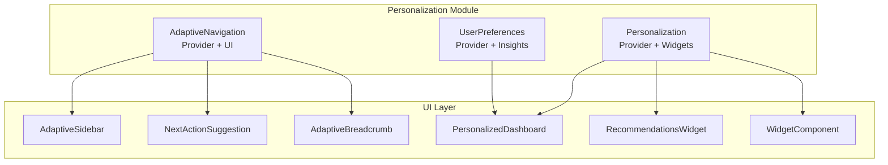
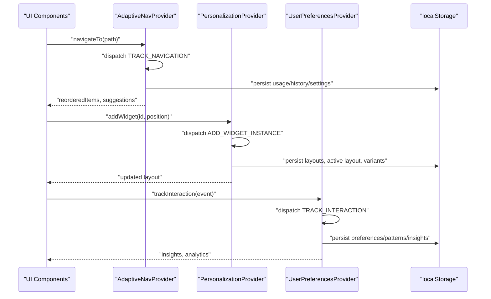
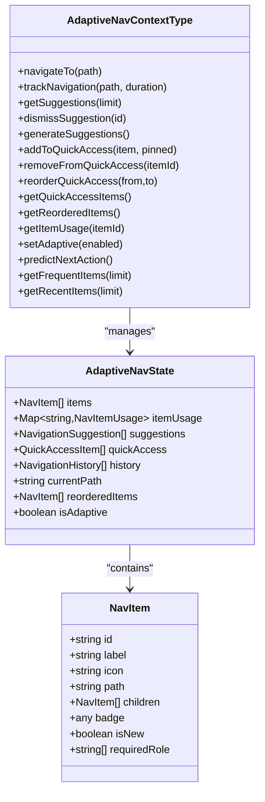
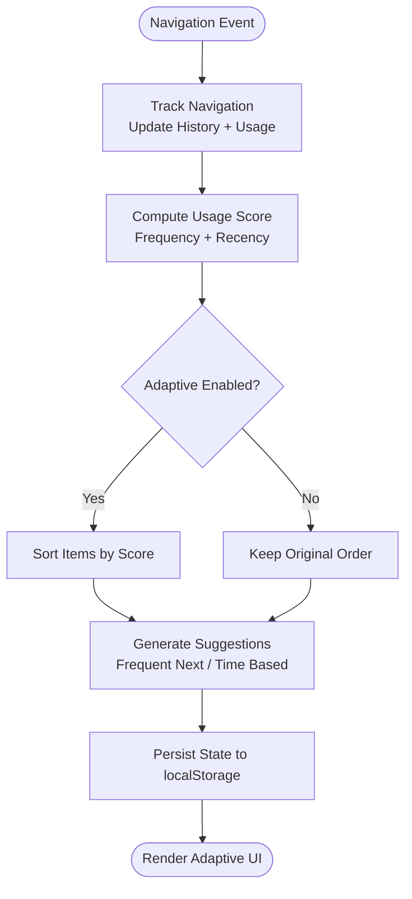
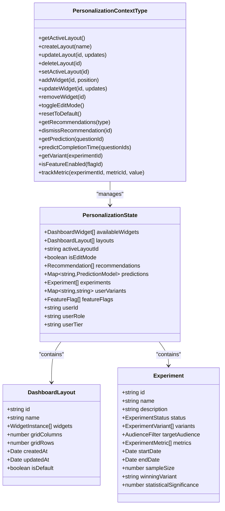
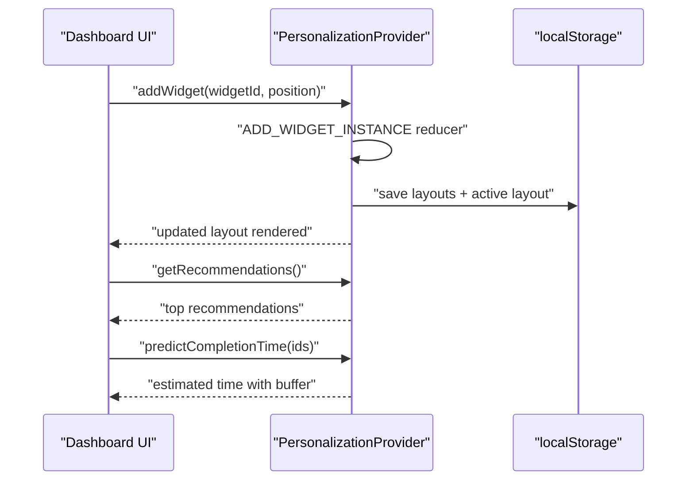
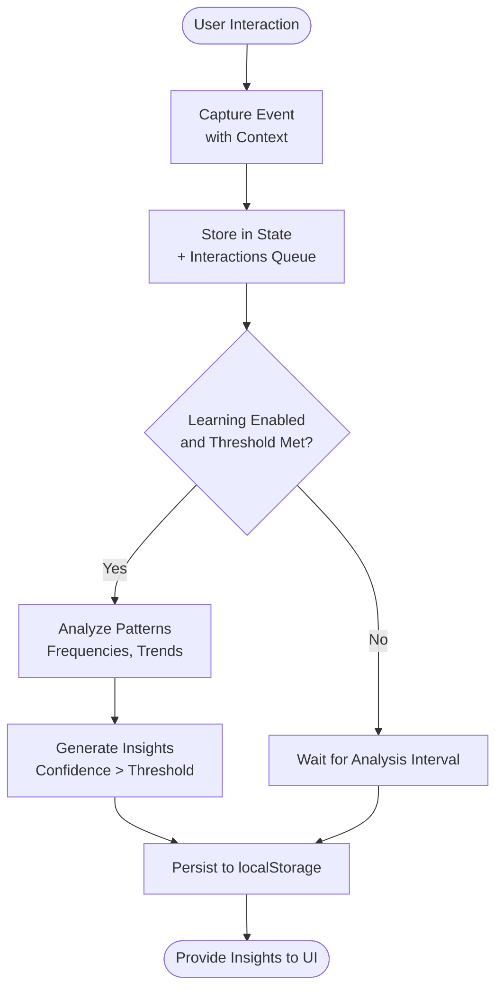
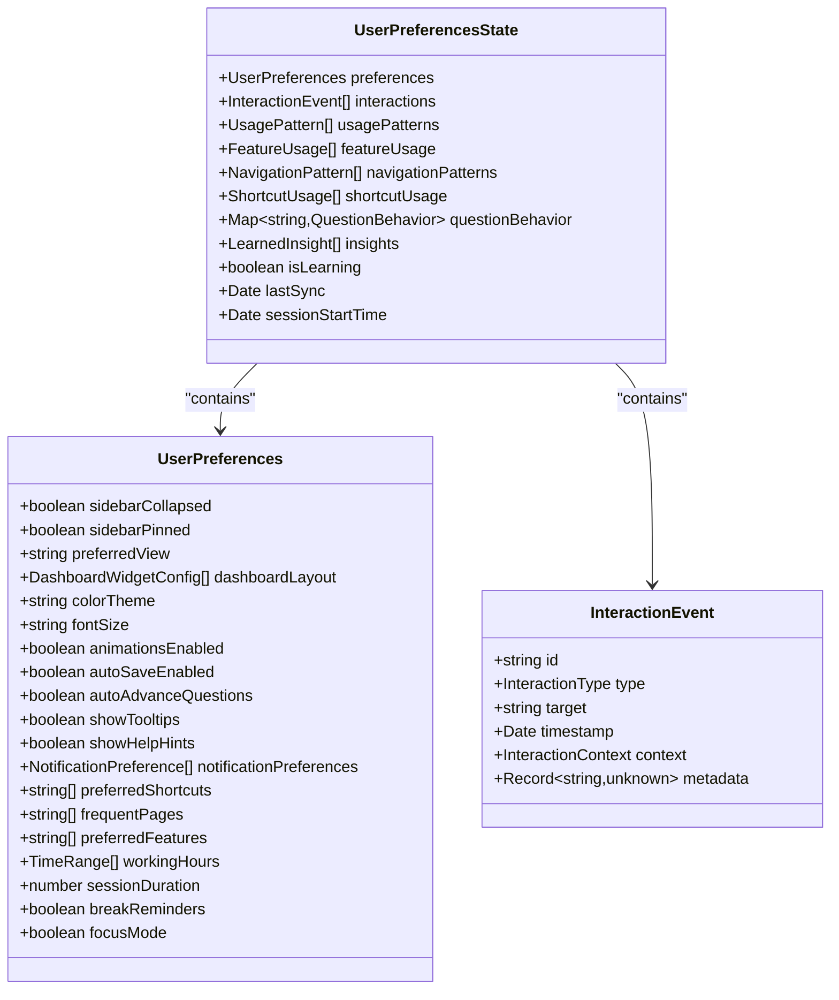
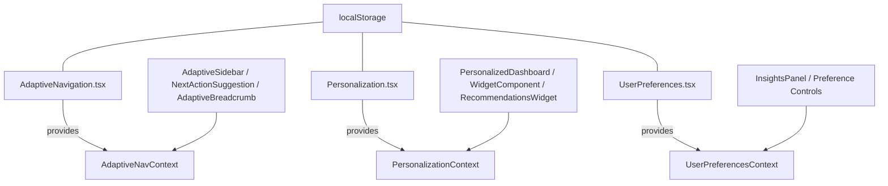

# Personalization Components

<cite>
**Referenced Files in This Document**
- [AdaptiveNavigation.tsx](file://apps/web/src/components/personalization/AdaptiveNavigation.tsx)
- [Personalization.tsx](file://apps/web/src/components/personalization/Personalization.tsx)
- [UserPreferences.tsx](file://apps/web/src/components/personalization/UserPreferences.tsx)
- [index.ts](file://apps/web/src/components/personalization/index.ts)
</cite>

## Table of Contents
1. [Introduction](#introduction)
2. [Project Structure](#project-structure)
3. [Core Components](#core-components)
4. [Architecture Overview](#architecture-overview)
5. [Detailed Component Analysis](#detailed-component-analysis)
6. [Dependency Analysis](#dependency-analysis)
7. [Performance Considerations](#performance-considerations)
8. [Troubleshooting Guide](#troubleshooting-guide)
9. [Conclusion](#conclusion)

## Introduction
This document provides comprehensive technical documentation for the personalization subsystem, focusing on three core components: AdaptiveNavigation, Personalization, and UserPreferences. These components work together to deliver adaptive content rendering, dynamic navigation patterns, and intelligent user preference management. The system emphasizes local-first persistence using browser storage, privacy-conscious data handling, and extensible personalization workflows suitable for cross-device scenarios.

## Project Structure
The personalization module is organized as a barrel-exported set of React components and contexts designed to be consumed by the web application. The module exposes three primary providers and supporting UI components:

- AdaptiveNavigation: Provides adaptive navigation, usage-driven reordering, quick-access favorites, and predictive suggestions.
- Personalization: Manages customizable dashboards, ML-inspired recommendations, completion time predictions, and A/B testing/feature flag integration.
- UserPreferences: Tracks user interaction patterns, learns preferences, and persists them locally with privacy controls.

**Diagram sources**
- [AdaptiveNavigation.tsx:350-684](file://apps/web/src/components/personalization/AdaptiveNavigation.tsx#L350-L684)
- [Personalization.tsx:658-968](file://apps/web/src/components/personalization/Personalization.tsx#L658-L968)
- [UserPreferences.tsx:411-780](file://apps/web/src/components/personalization/UserPreferences.tsx#L411-L780)

**Section sources**
- [index.ts:1-8](file://apps/web/src/components/personalization/index.ts#L1-L8)

## Core Components
This section introduces each component's responsibilities and key capabilities.

- AdaptiveNavigation
  - Dynamically reorders navigation items based on usage frequency and recency.
  - Generates contextual suggestions and predicts next actions.
  - Maintains quick-access favorites and persistent settings via localStorage.
  - Exposes hooks for navigation tracking, suggestions, and adaptive toggling.

- Personalization
  - Provides customizable dashboard widgets with drag-and-drop editing.
  - Offers recommendation management and completion time predictions.
  - Integrates A/B testing and feature flags with deterministic variant assignment and rule evaluation.
  - Persists layouts, active layout, and variant assignments locally.

- UserPreferences
  - Tracks interaction events (clicks, navigation, shortcuts, form interactions).
  - Learns usage patterns and generates actionable insights.
  - Stores preferences, patterns, and insights locally with privacy controls.
  - Supports session-aware context and periodic pattern analysis.

**Section sources**
- [AdaptiveNavigation.tsx:1-120](file://apps/web/src/components/personalization/AdaptiveNavigation.tsx#L1-L120)
- [Personalization.tsx:1-120](file://apps/web/src/components/personalization/Personalization.tsx#L1-L120)
- [UserPreferences.tsx:1-120](file://apps/web/src/components/personalization/UserPreferences.tsx#L1-L120)

## Architecture Overview
The personalization architecture follows a provider-context pattern with local-first persistence and optional integration points for server-side synchronization.

**Diagram sources**
- [AdaptiveNavigation.tsx:444-455](file://apps/web/src/components/personalization/AdaptiveNavigation.tsx#L444-L455)
- [Personalization.tsx:776-804](file://apps/web/src/components/personalization/Personalization.tsx#L776-L804)
- [UserPreferences.tsx:547-563](file://apps/web/src/components/personalization/UserPreferences.tsx#L547-L563)

## Detailed Component Analysis

### AdaptiveNavigation Analysis
AdaptiveNavigation implements a sophisticated navigation system that adapts to user behavior through usage tracking, suggestion generation, and dynamic reordering.

Key capabilities:
- Usage tracking and scoring: Tracks navigation frequency, recency, and context to compute usage scores.
- Suggestion engine: Generates frequent-next, time-based, and workflow continuation suggestions.
- Quick access management: Allows pinning and reordering of frequently used items.
- Adaptive reordering: Sorts menu items based on computed usage scores.
- Persistent state: Loads and saves usage, history, quick access, and settings to localStorage.

**Diagram sources**
- [AdaptiveNavigation.tsx:74-123](file://apps/web/src/components/personalization/AdaptiveNavigation.tsx#L74-L123)
- [AdaptiveNavigation.tsx:22-40](file://apps/web/src/components/personalization/AdaptiveNavigation.tsx#L22-L40)

**Diagram sources**
- [AdaptiveNavigation.tsx:167-315](file://apps/web/src/components/personalization/AdaptiveNavigation.tsx#L167-L315)
- [AdaptiveNavigation.tsx:471-542](file://apps/web/src/components/personalization/AdaptiveNavigation.tsx#L471-L542)

**Section sources**
- [AdaptiveNavigation.tsx:1-1010](file://apps/web/src/components/personalization/AdaptiveNavigation.tsx#L1-L1010)

### Personalization Analysis
Personalization focuses on customizable dashboards, intelligent recommendations, and A/B testing/feature flag integration.

Key capabilities:
- Dashboard customization: Drag-and-drop widget placement, layout management, and edit mode.
- Recommendations: Priority-based recommendation management with dismissal and expiration.
- Predictions: Completion time estimation based on historical predictions with fallbacks.
- A/B testing: Deterministic variant assignment and rule-based feature flag evaluation.
- Local persistence: Saves layouts, active layout, user variants, and recommendations.

**Diagram sources**
- [Personalization.tsx:215-236](file://apps/web/src/components/personalization/Personalization.tsx#L215-L236)
- [Personalization.tsx:80-190](file://apps/web/src/components/personalization/Personalization.tsx#L80-L190)

**Diagram sources**
- [Personalization.tsx:776-804](file://apps/web/src/components/personalization/Personalization.tsx#L776-L804)
- [Personalization.tsx:844-885](file://apps/web/src/components/personalization/Personalization.tsx#L844-L885)

**Section sources**
- [Personalization.tsx:1-1369](file://apps/web/src/components/personalization/Personalization.tsx#L1-L1369)

### UserPreferences Analysis
UserPreferences implements a learning system that tracks interactions, builds usage patterns, and generates insights while maintaining privacy controls.

Key capabilities:
- Interaction tracking: Captures clicks, navigation, shortcuts, feature usage, and question behaviors with session-aware context.
- Pattern learning: Aggregates usage patterns, navigation frequencies, shortcut success rates, and question behavior analytics.
- Insight generation: Produces actionable insights with confidence thresholds and suggested actions.
- Privacy controls: Uses secure ID generation and supports disabling persistence/learning.
- Local persistence: Saves preferences, patterns, and insights to localStorage with periodic sync timestamps.

**Diagram sources**
- [UserPreferences.tsx:547-563](file://apps/web/src/components/personalization/UserPreferences.tsx#L547-L563)
- [UserPreferences.tsx:782-807](file://apps/web/src/components/personalization/UserPreferences.tsx#L782-L807)

**Diagram sources**
- [UserPreferences.tsx:191-203](file://apps/web/src/components/personalization/UserPreferences.tsx#L191-L203)
- [UserPreferences.tsx:123-150](file://apps/web/src/components/personalization/UserPreferences.tsx#L123-L150)
- [UserPreferences.tsx:51-71](file://apps/web/src/components/personalization/UserPreferences.tsx#L51-L71)

**Section sources**
- [UserPreferences.tsx:1-1254](file://apps/web/src/components/personalization/UserPreferences.tsx#L1-L1254)

## Dependency Analysis
The personalization components are loosely coupled and primarily communicate through React contexts. They share common patterns for state management, persistence, and UI composition.

**Diagram sources**
- [AdaptiveNavigation.tsx:344-344](file://apps/web/src/components/personalization/AdaptiveNavigation.tsx#L344-L344)
- [Personalization.tsx:652-652](file://apps/web/src/components/personalization/Personalization.tsx#L652-L652)
- [UserPreferences.tsx:398-398](file://apps/web/src/components/personalization/UserPreferences.tsx#L398-L398)

**Section sources**
- [AdaptiveNavigation.tsx:350-684](file://apps/web/src/components/personalization/AdaptiveNavigation.tsx#L350-L684)
- [Personalization.tsx:658-968](file://apps/web/src/components/personalization/Personalization.tsx#L658-L968)
- [UserPreferences.tsx:411-780](file://apps/web/src/components/personalization/UserPreferences.tsx#L411-L780)

## Performance Considerations
- Debounced persistence: All providers debounce localStorage writes to reduce write thrash during rapid state changes.
- Efficient recomputation: Adaptive navigation reorders items only when usage or adaptive setting changes, minimizing render overhead.
- Limited suggestion sets: Suggestion lists are capped to small sizes to keep UI responsive.
- Pattern analysis intervals: UserPreferences performs periodic analysis to balance learning accuracy with performance.
- Local-first design: Reduces network latency and improves reliability by avoiding server round trips for personalization data.

## Troubleshooting Guide
Common issues and resolutions:
- State not persisting
  - Verify localStorage availability and quota limits.
  - Check for errors thrown during JSON serialization/deserialization.
  - Confirm that persistence is enabled in providers.

- Adaptive navigation not updating
  - Ensure navigation events are being tracked via the provided tracking functions.
  - Verify that the adaptive mode toggle is enabled.

- Recommendations not appearing
  - Confirm that recommendations are being added to state and not dismissed/expired.
  - Check that the recommendation list is not filtered by type unintentionally.

- Insights panel empty
  - Ensure sufficient interaction data has been collected.
  - Verify that learning is enabled and analysis intervals are firing.

**Section sources**
- [AdaptiveNavigation.tsx:368-403](file://apps/web/src/components/personalization/AdaptiveNavigation.tsx#L368-L403)
- [Personalization.tsx:679-708](file://apps/web/src/components/personalization/Personalization.tsx#L679-L708)
- [UserPreferences.tsx:425-457](file://apps/web/src/components/personalization/UserPreferences.tsx#L425-L457)

## Conclusion
The personalization subsystem delivers a robust, local-first solution for adaptive navigation, customizable dashboards, and intelligent user preference management. By combining usage-driven reordering, pattern learning, and A/B testing integration, the system enables tailored user experiences while respecting privacy and performance constraints. The modular provider-context architecture ensures maintainability and extensibility for future enhancements.