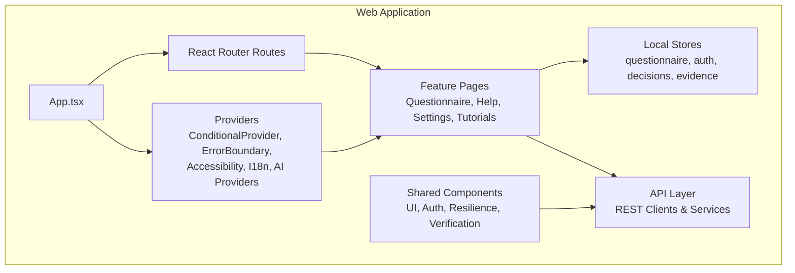
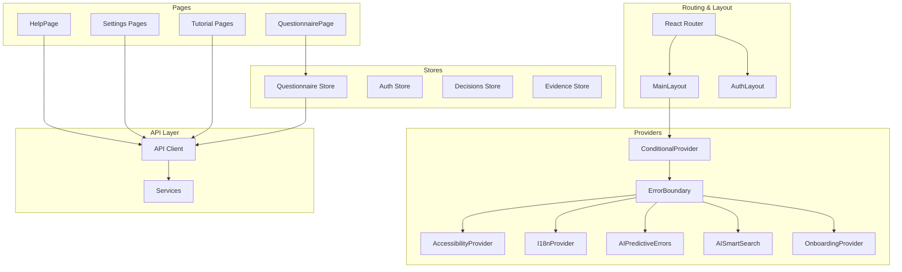
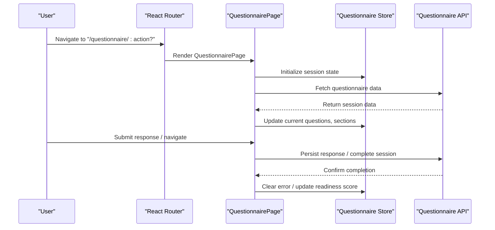
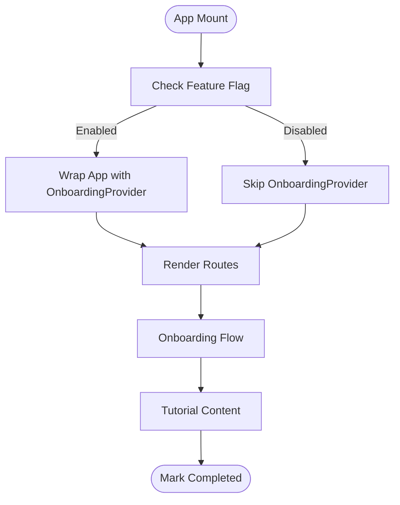
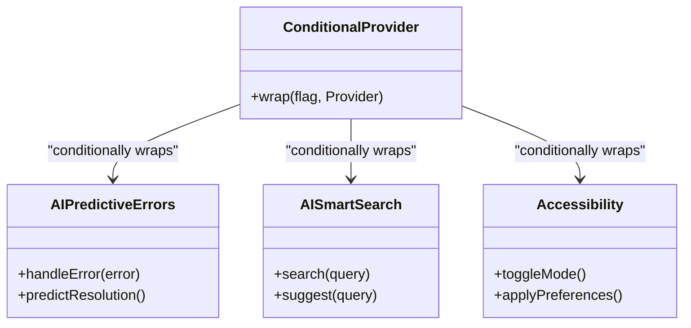
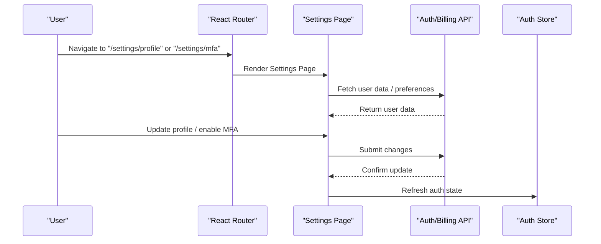
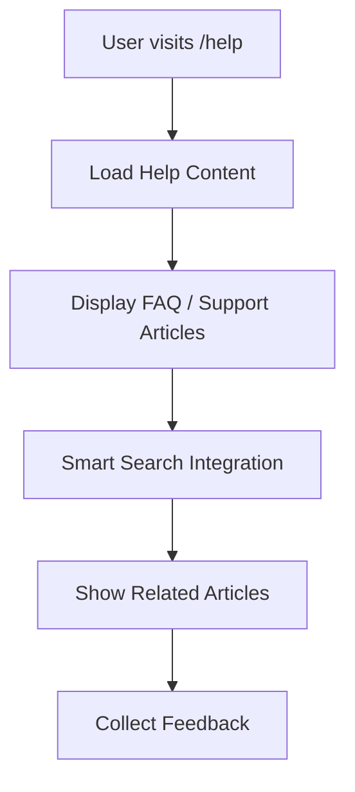
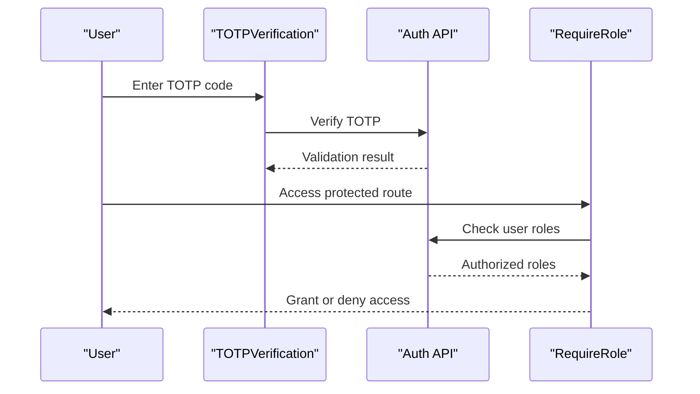
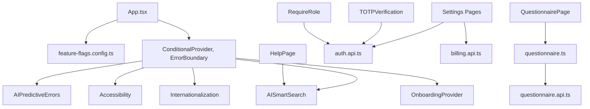

# Specialized Feature Components

<cite>
**Referenced Files in This Document**
- [App.tsx](file://apps/web/src/App.tsx)
- [QuestionnairePage.tsx](file://apps/web/src/pages/questionnaire/QuestionnairePage.tsx)
- [useQuestionnaireStore.ts](file://apps/web/src/stores/questionnaire.ts)
- [HelpPage.tsx](file://apps/web/src/pages/help/HelpPage.tsx)
- [ProfilePage.tsx](file://apps/web/src/pages/settings/ProfilePage.tsx)
- [MFASetupPage.tsx](file://apps/web/src/pages/settings/MFASetupPage.tsx)
- [TOTPVerification.tsx](file://apps/web/src/components/auth/TOTPVerification.tsx)
- [RequireRole.tsx](file://apps/web/src/components/auth/RequireRole.tsx)
- [ConditionalProvider.tsx](file://apps/web/src/components/ConditionalProvider.tsx)
- [ErrorBoundary.tsx](file://apps/web/src/components/ErrorBoundary.tsx)
- [AIPredictiveErrors.tsx](file://apps/web/src/components/ai/AIPredictiveErrors.tsx)
- [AISmartSearch.tsx](file://apps/web/src/components/ai/AISmartSearch.tsx)
- [Accessibility.tsx](file://apps/web/src/components/accessibility/Accessibility.tsx)
- [Internationalization.tsx](file://apps/web/src/components/i18n/Internationalization.tsx)
- [OnboardingProvider.tsx](file://apps/web/src/components/ux/Onboarding.tsx)
- [feature-flags.config.ts](file://apps/web/src/config/feature-flags.config.ts)
- [api-client.ts](file://apps/web/src/api/client.ts)
- [questionnaire.api.ts](file://apps/web/src/api/questionnaire.ts)
- [auth.api.ts](file://apps/web/src/api/auth.ts)
- [billing.api.ts](file://apps/web/src/api/billing.ts)
- [documents.api.ts](file://apps/web/src/api/documents.ts)
- [chat.api.ts](file://apps/web/src/api/chat.ts)
- [fact-extraction.api.ts](file://apps/web/src/api/fact-extraction.ts)
- [notification.api.ts](file://apps/web/src/api/notifications.ts)
- [payment.api.ts](file://apps/web/src/api/payment.ts)
- [policy-pack.api.ts](file://apps/web/src/api/policy-pack.ts)
- [projects.api.ts](file://apps/web/src/api/projects.ts)
- [scoring-engine.api.ts](file://apps/web/src/api/scoring-engine.ts)
- [session.api.ts](file://apps/web/src/api/session.ts)
- [standards.api.ts](file://apps/web/src/api/standards.ts)
- [users.api.ts](file://apps/web/src/api/users.ts)
- [decisions.api.ts](file://apps/web/src/api/decision-log.ts)
- [evidence.api.ts](file://apps/web/src/api/evidence-registry.ts)
- [heatmap.api.ts](file://apps/web/src/api/heatmap.ts)
- [idea-capture.api.ts](file://apps/web/src/api/idea-capture.ts)
- [document-generator.api.ts](file://apps/web/src/api/document-generator.ts)
- [adaptive-logic.api.ts](file://apps/web/src/api/adaptive-logic.ts)
- [ai-gateway.api.ts](file://apps/web/src/api/ai-gateway.ts)
- [adapter.api.ts](file://apps/web/src/api/adapters.ts)
- [notification.service.ts](file://apps/web/src/lib/api/notification.service.ts)
- [logger.ts](file://apps/web/src/lib/logger.ts)
</cite>

## Table of Contents
1. [Introduction](#introduction)
2. [Project Structure](#project-structure)
3. [Core Components](#core-components)
4. [Architecture Overview](#architecture-overview)
5. [Detailed Component Analysis](#detailed-component-analysis)
6. [Dependency Analysis](#dependency-analysis)
7. [Performance Considerations](#performance-considerations)
8. [Troubleshooting Guide](#troubleshooting-guide)
9. [Conclusion](#conclusion)

## Introduction
This document provides comprehensive documentation for specialized feature components within the Quiz-to-Build platform. It focuses on questionnaire components, tutorial systems, resilience tools, settings panels, help center, and verification components. The documentation explains feature-specific patterns, workflow integration, and user interaction models. It also covers component configuration for different feature contexts, data binding patterns, state management, integration with backend services, real-time updates, and user preference handling. Examples of feature composition and customization for different use cases are included to guide implementation and extension.

## Project Structure
The web application is organized around a React-based frontend with TypeScript, routing via React Router, and state management through local stores. Feature components are grouped under dedicated directories such as questionnaire, tutorials, resilience, settings, help, and verification. Backend integration is handled through API clients and services, while feature flags enable conditional rendering and provider wrapping.

**Diagram sources**
- [App.tsx:189-284](file://apps/web/src/App.tsx#L189-L284)
- [QuestionnairePage.tsx:48-120](file://apps/web/src/pages/questionnaire/QuestionnairePage.tsx#L48-L120)

**Section sources**
- [App.tsx:1-284](file://apps/web/src/App.tsx#L1-L284)

## Core Components
This section outlines the primary specialized components and their roles:

- Questionnaire Components: Manage quiz sessions, adaptive logic, scoring, and progress tracking.
- Tutorial Systems: Provide guided onboarding and contextual learning experiences.
- Resilience Tools: Offer predictive error handling, smart search, and accessibility support.
- Settings Panels: Handle profile management, MFA setup, and user preferences.
- Help Center: Deliver centralized support resources and FAQs.
- Verification Components: Secure authentication flows including TOTP verification and role-based access.

Key implementation patterns include:
- Feature flag gating for conditional providers and routes.
- Store-driven state management for questionnaire sessions.
- API client abstraction for backend integration.
- Route protection for authenticated and role-based access.

**Section sources**
- [App.tsx:189-284](file://apps/web/src/App.tsx#L189-L284)
- [useQuestionnaireStore.ts](file://apps/web/src/stores/questionnaire.ts)
- [feature-flags.config.ts](file://apps/web/src/config/feature-flags.config.ts)

## Architecture Overview
The architecture integrates frontend routing, provider-based feature flags, and store-driven state management. Providers conditionally wrap the application based on feature flags, enabling modular feature activation. The questionnaire workflow leverages a dedicated store for session state, while other features integrate through API clients and page components.

**Diagram sources**
- [App.tsx:189-284](file://apps/web/src/App.tsx#L189-L284)
- [QuestionnairePage.tsx:48-120](file://apps/web/src/pages/questionnaire/QuestionnairePage.tsx#L48-L120)

## Detailed Component Analysis

### Questionnaire Components
The questionnaire system manages quiz sessions, adaptive logic, scoring, and progress tracking. It integrates with the questionnaire store for state management and uses API clients for backend operations.

**Diagram sources**
- [QuestionnairePage.tsx:48-120](file://apps/web/src/pages/questionnaire/QuestionnairePage.tsx#L48-L120)
- [useQuestionnaireStore.ts](file://apps/web/src/stores/questionnaire.ts)
- [questionnaire.api.ts](file://apps/web/src/api/questionnaire.ts)

Key configuration patterns:
- Action-based routing supports new sessions and continuation.
- Session parameters passed via URL search params enable deep linking and sharing.
- Adaptive logic and scoring engine integration handled through API clients.

Data binding and state management:
- Store exposes reactive properties for current questions, sections, readiness scores, and completion status.
- Error handling and clearing mechanisms ensure robust user experience.

Integration with backend services:
- API clients encapsulate HTTP requests for questionnaire retrieval, response submission, and session completion.
- Real-time updates are managed through polling or event-driven mechanisms as configured.

Customization examples:
- Different questionnaire templates can be selected via route parameters.
- Scoring and adaptive logic can be toggled via feature flags.

**Section sources**
- [QuestionnairePage.tsx:48-120](file://apps/web/src/pages/questionnaire/QuestionnairePage.tsx#L48-L120)
- [useQuestionnaireStore.ts](file://apps/web/src/stores/questionnaire.ts)
- [questionnaire.api.ts](file://apps/web/src/api/questionnaire.ts)

### Tutorial Systems
The tutorial system provides guided onboarding and contextual learning experiences. It is conditionally enabled through feature flags and integrated with the main layout.

**Diagram sources**
- [App.tsx:189-284](file://apps/web/src/App.tsx#L189-L284)
- [OnboardingProvider.tsx](file://apps/web/src/components/ux/Onboarding.tsx)
- [feature-flags.config.ts](file://apps/web/src/config/feature-flags.config.ts)

User interaction model:
- Progressive disclosure of tutorial steps aligned with user actions.
- Contextual help integrated within feature pages.

**Section sources**
- [App.tsx:189-284](file://apps/web/src/App.tsx#L189-L284)
- [OnboardingProvider.tsx](file://apps/web/src/components/ux/Onboarding.tsx)

### Resilience Tools
Resilience tools enhance user experience through predictive error handling, smart search, and accessibility support. These are conditionally wrapped around the application based on feature flags.

**Diagram sources**
- [AIPredictiveErrors.tsx](file://apps/web/src/components/ai/AIPredictiveErrors.tsx)
- [AISmartSearch.tsx](file://apps/web/src/components/ai/AISmartSearch.tsx)
- [Accessibility.tsx](file://apps/web/src/components/accessibility/Accessibility.tsx)
- [ConditionalProvider.tsx](file://apps/web/src/components/ConditionalProvider.tsx)

Integration patterns:
- Providers are wrapped around the main application based on feature flags.
- Error boundaries capture and handle runtime errors gracefully.

**Section sources**
- [App.tsx:189-284](file://apps/web/src/App.tsx#L189-L284)
- [AIPredictiveErrors.tsx](file://apps/web/src/components/ai/AIPredictiveErrors.tsx)
- [AISmartSearch.tsx](file://apps/web/src/components/ai/AISmartSearch.tsx)
- [Accessibility.tsx](file://apps/web/src/components/accessibility/Accessibility.tsx)

### Settings Panels
Settings panels manage user preferences, profile updates, and security configurations such as MFA setup. They are protected routes requiring authentication.

**Diagram sources**
- [ProfilePage.tsx](file://apps/web/src/pages/settings/ProfilePage.tsx)
- [MFASetupPage.tsx](file://apps/web/src/pages/settings/MFASetupPage.tsx)
- [auth.api.ts](file://apps/web/src/api/auth.ts)
- [billing.api.ts](file://apps/web/src/api/billing.ts)

User preference handling:
- Settings pages expose forms for updating profile information and security settings.
- Changes are persisted via API clients and reflected in the auth store.

**Section sources**
- [ProfilePage.tsx](file://apps/web/src/pages/settings/ProfilePage.tsx)
- [MFASetupPage.tsx](file://apps/web/src/pages/settings/MFASetupPage.tsx)
- [auth.api.ts](file://apps/web/src/api/auth.ts)

### Help Center
The help center provides centralized support resources and is accessible as a public route.

**Diagram sources**
- [HelpPage.tsx](file://apps/web/src/pages/help/HelpPage.tsx)
- [AISmartSearch.tsx](file://apps/web/src/components/ai/AISmartSearch.tsx)

**Section sources**
- [HelpPage.tsx](file://apps/web/src/pages/help/HelpPage.tsx)

### Verification Components
Verification components secure authentication flows, including TOTP verification and role-based access control.

**Diagram sources**
- [TOTPVerification.tsx](file://apps/web/src/components/auth/TOTPVerification.tsx)
- [RequireRole.tsx](file://apps/web/src/components/auth/RequireRole.tsx)
- [auth.api.ts](file://apps/web/src/api/auth.ts)

**Section sources**
- [TOTPVerification.tsx](file://apps/web/src/components/auth/TOTPVerification.tsx)
- [RequireRole.tsx](file://apps/web/src/components/auth/RequireRole.tsx)

## Dependency Analysis
The application exhibits layered dependencies with clear separation between routing, providers, stores, pages, and API clients. Feature flags drive conditional inclusion of providers, ensuring modularity and controlled rollout.

**Diagram sources**
- [App.tsx:189-284](file://apps/web/src/App.tsx#L189-L284)
- [feature-flags.config.ts](file://apps/web/src/config/feature-flags.config.ts)
- [QuestionnairePage.tsx:48-120](file://apps/web/src/pages/questionnaire/QuestionnairePage.tsx#L48-L120)
- [useQuestionnaireStore.ts](file://apps/web/src/stores/questionnaire.ts)
- [questionnaire.api.ts](file://apps/web/src/api/questionnaire.ts)
- [auth.api.ts](file://apps/web/src/api/auth.ts)
- [billing.api.ts](file://apps/web/src/api/billing.ts)
- [HelpPage.tsx](file://apps/web/src/pages/help/HelpPage.tsx)

**Section sources**
- [App.tsx:189-284](file://apps/web/src/App.tsx#L189-L284)
- [feature-flags.config.ts](file://apps/web/src/config/feature-flags.config.ts)

## Performance Considerations
- Lazy loading routes reduce initial bundle size and improve startup performance.
- React Query client configuration includes retry and caching strategies to optimize network requests.
- Feature flags prevent unnecessary provider overhead when features are disabled.
- Conditional providers ensure resilience tools are only active when needed.

## Troubleshooting Guide
Common issues and resolutions:
- Authentication failures: Verify TOTP verification and role checks before accessing protected routes.
- Feature not rendering: Check feature flags and ensure providers are properly wrapped.
- Network errors: Inspect API client responses and implement retry logic where appropriate.
- Accessibility and internationalization: Confirm provider configuration and user preferences.

Supporting components:
- Error boundary captures and logs errors for debugging.
- Logger utility provides structured logging for diagnostics.
- Notification service centralizes user feedback and alerts.

**Section sources**
- [ErrorBoundary.tsx](file://apps/web/src/components/ErrorBoundary.tsx)
- [logger.ts](file://apps/web/src/lib/logger.ts)
- [notification.service.ts](file://apps/web/src/lib/api/notification.service.ts)

## Conclusion
The specialized feature components in Quiz-to-Build are designed with modularity, resilience, and user-centric workflows in mind. The questionnaire system integrates adaptive logic and scoring, while tutorial, resilience, settings, help, and verification components provide comprehensive user support. Feature flags enable controlled rollouts, and the API layer ensures clean integration with backend services. By following the documented patterns and leveraging the provided examples, teams can compose and customize features for diverse use cases effectively.