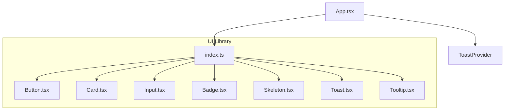
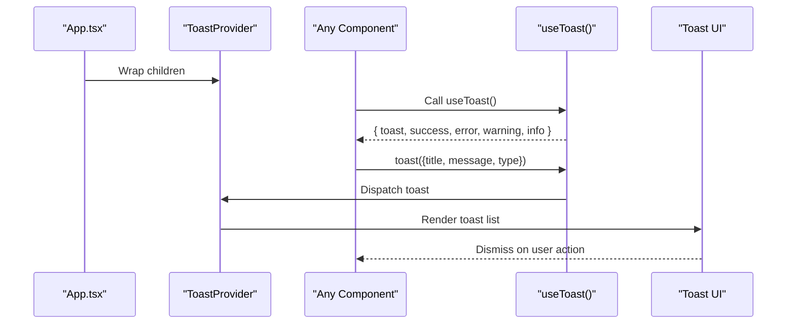
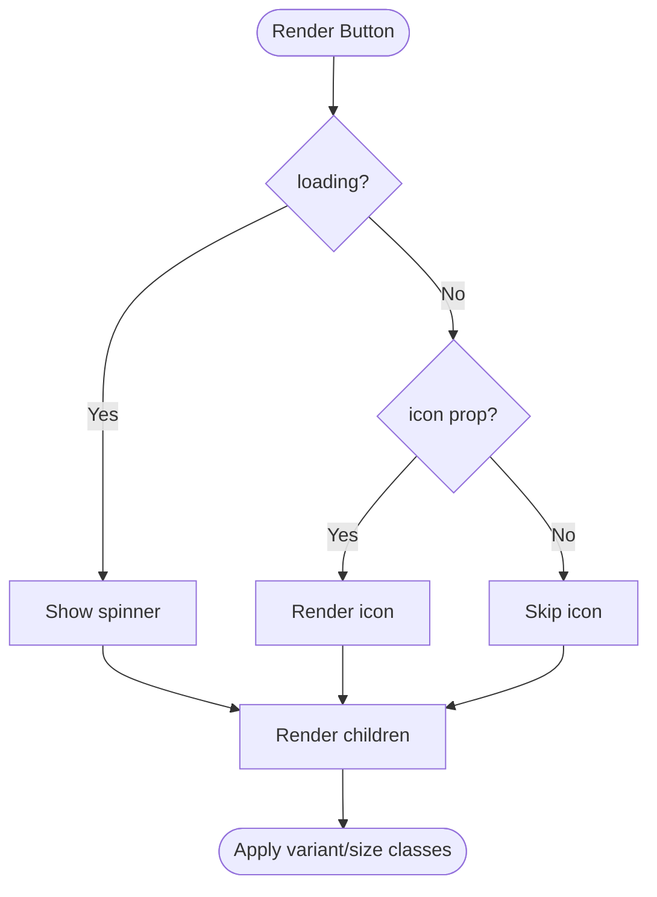
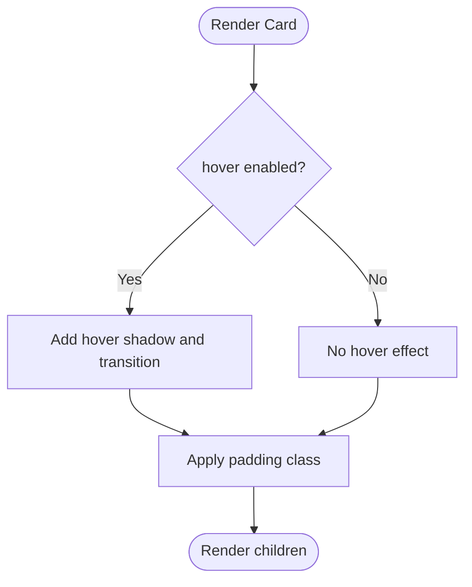
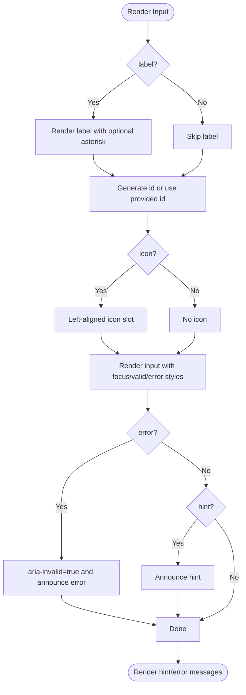
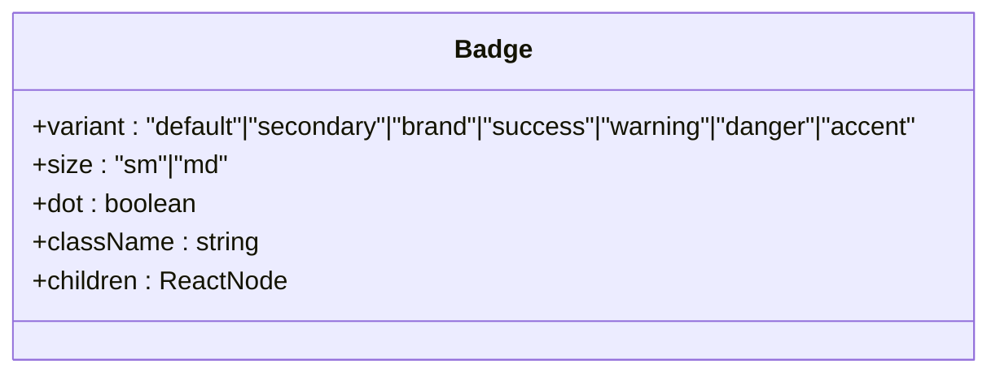
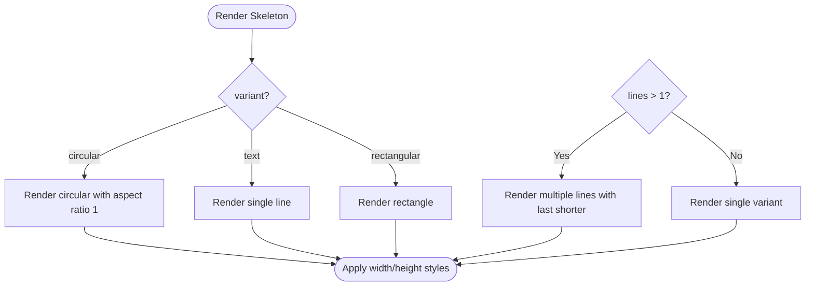
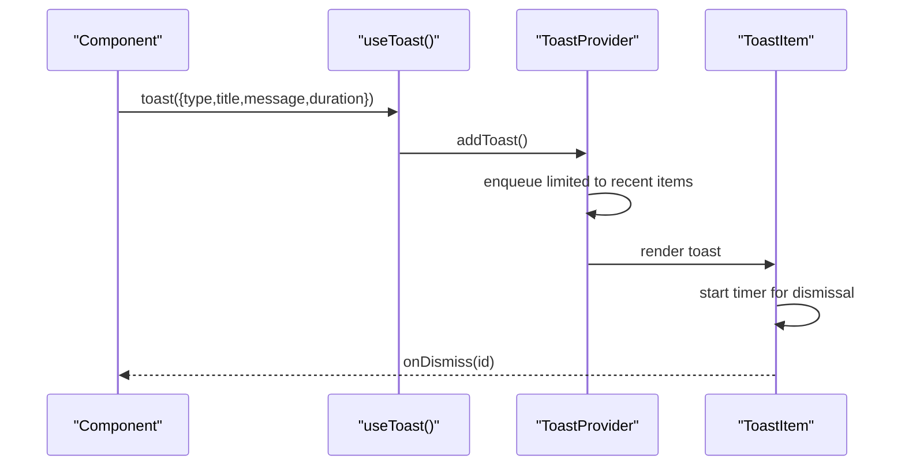
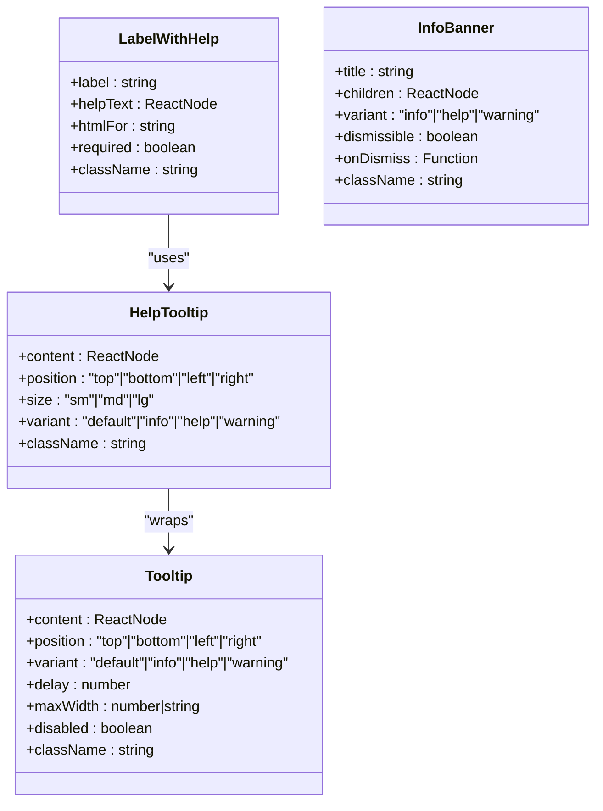
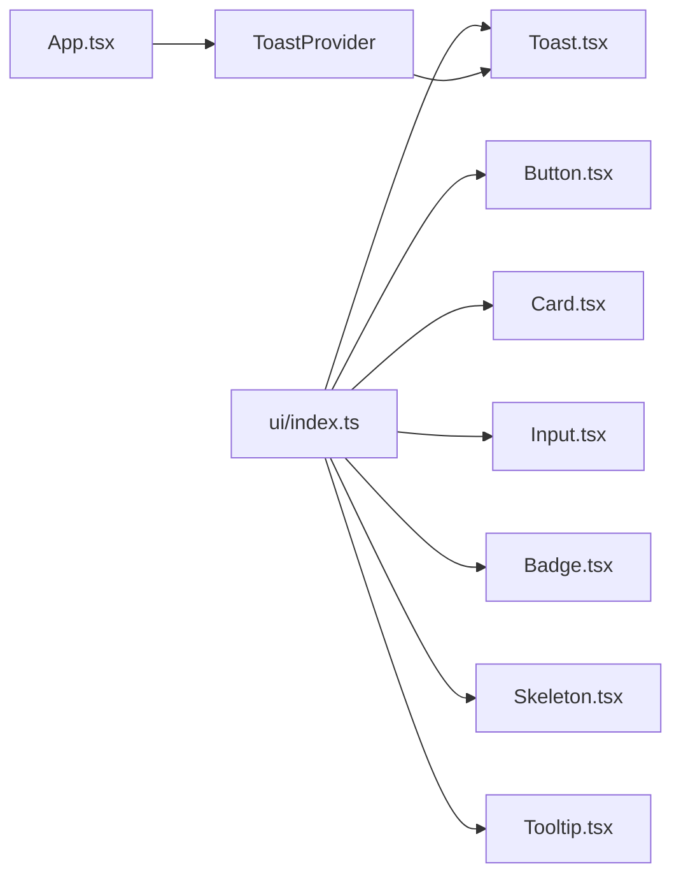

# UI Components

<cite>
**Referenced Files in This Document**
- [Button.tsx](file://apps/web/src/components/ui/Button.tsx)
- [Card.tsx](file://apps/web/src/components/ui/Card.tsx)
- [Input.tsx](file://apps/web/src/components/ui/Input.tsx)
- [Badge.tsx](file://apps/web/src/components/ui/Badge.tsx)
- [Skeleton.tsx](file://apps/web/src/components/ui/Skeleton.tsx)
- [Toast.tsx](file://apps/web/src/components/ui/Toast.tsx)
- [Tooltip.tsx](file://apps/web/src/components/ui/Tooltip.tsx)
- [index.ts](file://apps/web/src/components/ui/index.ts)
- [App.tsx](file://apps/web/src/App.tsx)
- [DesignSystem.tsx](file://apps/web/src/components/ux/DesignSystem.tsx)
</cite>

## Table of Contents
1. [Introduction](#introduction)
2. [Project Structure](#project-structure)
3. [Core Components](#core-components)
4. [Architecture Overview](#architecture-overview)
5. [Detailed Component Analysis](#detailed-component-analysis)
6. [Dependency Analysis](#dependency-analysis)
7. [Performance Considerations](#performance-considerations)
8. [Troubleshooting Guide](#troubleshooting-guide)
9. [Conclusion](#conclusion)

## Introduction
This document describes the UI primitive components used across the web application: Button, Card, Input, Badge, Skeleton, Toast, and Tooltip. It explains component props, attributes, events, styling patterns, theme integration, responsive behavior, accessibility features, keyboard navigation, screen reader support, composition patterns, integration with form validation, cross-browser compatibility, and performance optimization techniques.

## Project Structure
The UI primitives live under the web application’s component library and are exported via a barrel export for easy consumption across the app.

**Diagram sources**
- [index.ts:1-19](file://apps/web/src/components/ui/index.ts#L1-L19)
- [App.tsx:10-10](file://apps/web/src/App.tsx#L10-L10)
- [Button.tsx:1-100](file://apps/web/src/components/ui/Button.tsx#L1-L100)
- [Card.tsx:1-62](file://apps/web/src/components/ui/Card.tsx#L1-L62)
- [Input.tsx:1-69](file://apps/web/src/components/ui/Input.tsx#L1-L69)
- [Badge.tsx:1-66](file://apps/web/src/components/ui/Badge.tsx#L1-L66)
- [Skeleton.tsx:1-87](file://apps/web/src/components/ui/Skeleton.tsx#L1-L87)
- [Toast.tsx:1-123](file://apps/web/src/components/ui/Toast.tsx#L1-L123)
- [Tooltip.tsx:1-267](file://apps/web/src/components/ui/Tooltip.tsx#L1-L267)

**Section sources**
- [index.ts:1-19](file://apps/web/src/components/ui/index.ts#L1-L19)
- [App.tsx:10-10](file://apps/web/src/App.tsx#L10-L10)

## Core Components
This section summarizes each primitive’s purpose, key props, and typical usage patterns.

- Button
  - Variants: primary, secondary, ghost, danger, outline
  - Sizes: sm, md, lg
  - States: loading, disabled, fullWidth, icon
  - Accessibility: inherits native button semantics; supports focus-visible ring
  - Composition: integrates with form actions and navigation

- Card
  - Padding: none, sm, md, lg
  - Effects: hover shadow elevation
  - Composition: pairs with CardHeader for structured content

- Input
  - Label, hint, error, icon
  - Accessibility: aria-invalid, aria-describedby, required asterisk
  - Validation: integrates with form libraries via standard attributes

- Badge
  - Variants: default, secondary, brand, success, warning, danger, accent
  - Sizes: sm, md
  - Options: dot indicator
  - Composition: lightweight status or metadata

- Skeleton
  - Variants: text, circular, rectangular
  - Options: lines count, width/height
  - Pre-built skeletons: StatCardSkeleton, ListItemSkeleton

- Toast
  - Types: success, error, warning, info
  - API: useToast hook exposes toast, success, error, warning, info
  - Behavior: auto-dismiss with configurable duration, capped queue

- Tooltip
  - Positions: top, bottom, left, right
  - Variants: default, info, help, warning
  - Composition: HelpTooltip, LabelWithHelp, InfoBanner

**Section sources**
- [Button.tsx:9-36](file://apps/web/src/components/ui/Button.tsx#L9-L36)
- [Card.tsx:9-21](file://apps/web/src/components/ui/Card.tsx#L9-L21)
- [Input.tsx:9-14](file://apps/web/src/components/ui/Input.tsx#L9-L14)
- [Badge.tsx:9-18](file://apps/web/src/components/ui/Badge.tsx#L9-L18)
- [Skeleton.tsx:8-14](file://apps/web/src/components/ui/Skeleton.tsx#L8-L14)
- [Toast.tsx:10-26](file://apps/web/src/components/ui/Toast.tsx#L10-L26)
- [Tooltip.tsx:11-23](file://apps/web/src/components/ui/Tooltip.tsx#L11-L23)

## Architecture Overview
The UI components are consumed through a central barrel export and integrated into the application via providers. The Toast system is globally available via a provider mounted at the root.

**Diagram sources**
- [App.tsx:195-195](file://apps/web/src/App.tsx#L195-L195)
- [Toast.tsx:89-122](file://apps/web/src/components/ui/Toast.tsx#L89-L122)
- [Toast.tsx:30-34](file://apps/web/src/components/ui/Toast.tsx#L30-L34)

**Section sources**
- [App.tsx:195-195](file://apps/web/src/App.tsx#L195-L195)
- [Toast.tsx:89-122](file://apps/web/src/components/ui/Toast.tsx#L89-L122)

## Detailed Component Analysis

### Button
- Props
  - variant: primary | secondary | ghost | danger | outline
  - size: sm | md | lg
  - loading: boolean
  - fullWidth: boolean
  - icon: ReactNode
  - Native button attributes (disabled, className, etc.)
- Events
  - Inherits onClick, onKeyDown, onFocus, onBlur from native button
- Styling
  - Variant-specific background, text, and ring styles
  - Size-specific padding, text size, and gap
  - Disabled state reduces opacity and prevents interaction
  - Full-width option sets width to 100%
- Accessibility
  - Focus-visible ring for keyboard navigation
  - Loading state renders spinner and disables interaction
- Composition
  - Use with icons for compact actions
  - Combine with form submission handlers

**Diagram sources**
- [Button.tsx:38-97](file://apps/web/src/components/ui/Button.tsx#L38-L97)

**Section sources**
- [Button.tsx:12-36](file://apps/web/src/components/ui/Button.tsx#L12-L36)
- [Button.tsx:53-66](file://apps/web/src/components/ui/Button.tsx#L53-L66)

### Card
- Props
  - padding: none | sm | md | lg
  - hover: boolean (adds elevated shadow and transition)
  - Native div attributes (className, children, etc.)
- Composition
  - Use CardHeader for title/subtitle/action layouts
- Styling
  - Light/dark compatible border and background
  - Rounded corners and subtle borders
- Accessibility
  - No special semantics; rely on contained content for roles

**Diagram sources**
- [Card.tsx:21-35](file://apps/web/src/components/ui/Card.tsx#L21-L35)

**Section sources**
- [Card.tsx:9-19](file://apps/web/src/components/ui/Card.tsx#L9-L19)
- [Card.tsx:44-61](file://apps/web/src/components/ui/Card.tsx#L44-L61)

### Input
- Props
  - label: string
  - error: string
  - hint: string
  - icon: ReactNode
  - Native input attributes (required, disabled, placeholder, etc.)
- Accessibility
  - Associates label with input via htmlFor
  - Sets aria-invalid when error is present
  - Announces hint/error via aria-describedby
  - Required fields render an asterisk
- Styling
  - Focus ring with brand color for primary focus
  - Error state overrides border and ring with danger color
  - Optional left/right icon padding
- Composition
  - Pair with form libraries using standard onChange/onBlur handlers
  - Use error/hint to reflect validation feedback

**Diagram sources**
- [Input.tsx:16-66](file://apps/web/src/components/ui/Input.tsx#L16-L66)

**Section sources**
- [Input.tsx:9-14](file://apps/web/src/components/ui/Input.tsx#L9-L14)
- [Input.tsx:22-26](file://apps/web/src/components/ui/Input.tsx#L22-L26)
- [Input.tsx:34-50](file://apps/web/src/components/ui/Input.tsx#L34-L50)
- [Input.tsx:53-62](file://apps/web/src/components/ui/Input.tsx#L53-L62)

### Badge
- Props
  - variant: default | secondary | brand | success | warning | danger | accent
  - size: sm | md
  - dot: boolean (renders colored dot)
  - className: string
  - children: ReactNode
- Styling
  - Color variants mapped to background/text pairs
  - Dot indicator uses variant-specific color
  - Responsive sizing classes

**Diagram sources**
- [Badge.tsx:12-18](file://apps/web/src/components/ui/Badge.tsx#L12-L18)

**Section sources**
- [Badge.tsx:9-18](file://apps/web/src/components/ui/Badge.tsx#L9-L18)
- [Badge.tsx:51-64](file://apps/web/src/components/ui/Badge.tsx#L51-L64)

### Skeleton
- Props
  - variant: text | circular | rectangular
  - width: number|string
  - height: number|string
  - lines: number (multi-line text skeleton)
  - className: string
- Pre-built skeletons
  - StatCardSkeleton: small avatar + title + subtitle
  - ListItemSkeleton: avatar + two lines + action
- Styling
  - Animated shimmer gradient
  - Aspect ratio enforced for circular variant

**Diagram sources**
- [Skeleton.tsx:28-57](file://apps/web/src/components/ui/Skeleton.tsx#L28-L57)

**Section sources**
- [Skeleton.tsx:8-14](file://apps/web/src/components/ui/Skeleton.tsx#L8-L14)
- [Skeleton.tsx:60-72](file://apps/web/src/components/ui/Skeleton.tsx#L60-L72)
- [Skeleton.tsx:75-86](file://apps/web/src/components/ui/Skeleton.tsx#L75-L86)

### Toast
- API
  - useToast(): { toast, success, error, warning, info }
  - ToastProvider wraps the app to enable toasts
- Behavior
  - Auto-dismiss after duration (default ~4s)
  - Queue capped to recent entries
  - Dismissible via close button
- Accessibility
  - Role="alert" for toast container
  - Close button with accessible label
- Styling
  - Variant-specific background, border, and text colors
  - Slide-up animation on appear

**Diagram sources**
- [Toast.tsx:96-107](file://apps/web/src/components/ui/Toast.tsx#L96-L107)
- [Toast.tsx:57-87](file://apps/web/src/components/ui/Toast.tsx#L57-L87)
- [Toast.tsx:113-119](file://apps/web/src/components/ui/Toast.tsx#L113-L119)

**Section sources**
- [Toast.tsx:10-26](file://apps/web/src/components/ui/Toast.tsx#L10-L26)
- [Toast.tsx:89-122](file://apps/web/src/components/ui/Toast.tsx#L89-L122)

### Tooltip
- Props
  - content: ReactNode (required)
  - position: top | bottom | left | right
  - variant: default | info | help | warning
  - delay: number (ms)
  - maxWidth: number|string
  - disabled: boolean
  - className: string
- Composition
  - Tooltip: base tooltip container
  - HelpTooltip: convenience button with icon and focus ring
  - LabelWithHelp: label with embedded help tooltip
  - InfoBanner: contextual banner with optional dismiss
- Accessibility
  - Tooltip container has role="tooltip"
  - Focus and blur events trigger visibility
  - HelpTooltip provides aria-label for assistive tech

**Diagram sources**
- [Tooltip.tsx:14-23](file://apps/web/src/components/ui/Tooltip.tsx#L14-L23)
- [Tooltip.tsx:132-157](file://apps/web/src/components/ui/Tooltip.tsx#L132-L157)
- [Tooltip.tsx:168-184](file://apps/web/src/components/ui/Tooltip.tsx#L168-L184)
- [Tooltip.tsx:189-264](file://apps/web/src/components/ui/Tooltip.tsx#L189-L264)

**Section sources**
- [Tooltip.tsx:41-101](file://apps/web/src/components/ui/Tooltip.tsx#L41-L101)
- [Tooltip.tsx:132-157](file://apps/web/src/components/ui/Tooltip.tsx#L132-L157)
- [Tooltip.tsx:168-184](file://apps/web/src/components/ui/Tooltip.tsx#L168-L184)
- [Tooltip.tsx:189-264](file://apps/web/src/components/ui/Tooltip.tsx#L189-L264)

## Dependency Analysis
- Barrel export centralizes imports for consumers
- Toast requires global provider at the root
- Components rely on Tailwind utility classes and design tokens

**Diagram sources**
- [index.ts:1-19](file://apps/web/src/components/ui/index.ts#L1-L19)
- [App.tsx:10-10](file://apps/web/src/App.tsx#L10-L10)

**Section sources**
- [index.ts:1-19](file://apps/web/src/components/ui/index.ts#L1-L19)
- [App.tsx:10-10](file://apps/web/src/App.tsx#L10-L10)

## Performance Considerations
- Prefer forwardRef for interactive primitives to avoid unnecessary re-renders
- Use minimal DOM nodes per component (e.g., Button renders a single button)
- Avoid heavy inline styles; leverage utility classes for fast rendering
- Limit concurrent toasts to reduce DOM thrash
- Defer heavy content inside tooltips until visible to minimize initial layout cost
- Use Skeleton to defer expensive content rendering while preserving layout

## Troubleshooting Guide
- Button disabled state
  - Ensure loading prop is cleared when operation completes
  - Verify focus-visible ring appears on keyboard focus
- Input accessibility
  - Confirm aria-invalid updates when error is set
  - Ensure aria-describedby matches generated ids
  - Verify required asterisk displays when required is true
- Toast not appearing
  - Confirm ToastProvider wraps the application root
  - Check that useToast is called within provider scope
- Tooltip flicker
  - Increase delay slightly if tooltips disappear too quickly
  - Ensure parent container does not re-render during hover
- Badge contrast
  - Choose variant with sufficient contrast against background
  - Use dot variant for subtle indicators

**Section sources**
- [Button.tsx:53-66](file://apps/web/src/components/ui/Button.tsx#L53-L66)
- [Input.tsx:37-38](file://apps/web/src/components/ui/Input.tsx#L37-L38)
- [Input.tsx:54-56](file://apps/web/src/components/ui/Input.tsx#L54-L56)
- [Toast.tsx:30-34](file://apps/web/src/components/ui/Toast.tsx#L30-L34)
- [Tooltip.tsx:54-64](file://apps/web/src/components/ui/Tooltip.tsx#L54-L64)
- [Badge.tsx:51-64](file://apps/web/src/components/ui/Badge.tsx#L51-L64)

## Conclusion
These UI primitives provide a consistent, accessible, and theme-aware foundation for building forms, cards, and interactive surfaces. They integrate seamlessly with React patterns, form libraries, and accessibility tooling, while remaining performant and responsive across browsers.