# UX Enhancement Components

<cite>
**Referenced Files in This Document**
- [BlurValidation.tsx](file://apps/web/src/components/ux/BlurValidation.tsx)
- [Breadcrumbs.tsx](file://apps/web/src/components/ux/Breadcrumbs.tsx)
- [ConfirmationDialog.tsx](file://apps/web/src/components/ux/ConfirmationDialog.tsx)
- [DraftBanner.tsx](file://apps/web/src/components/ux/DraftBanner.tsx)
- [ErrorCodeSystem.tsx](file://apps/web/src/components/ux/ErrorCodeSystem.tsx)
- [FileTypePreview.tsx](file://apps/web/src/components/ux/FileTypePreview.tsx)
- [KeyboardShortcuts.tsx](file://apps/web/src/components/ux/KeyboardShortcuts.tsx)
- [NetworkStatus.tsx](file://apps/web/src/components/ux/NetworkStatus.tsx)
- [NielsenScore.tsx](file://apps/web/src/components/ux/NielsenScore.tsx)
- [Onboarding.tsx](file://apps/web/src/components/ux/Onboarding.tsx)
- [RecentlyAnswered.tsx](file://apps/web/src/components/ux/RecentlyAnswered.tsx)
- [UploadProgress.tsx](file://apps/web/src/components/ux/UploadProgress.tsx)
</cite>

## Table of Contents
1. [Introduction](#introduction)
2. [Project Structure](#project-structure)
3. [Core Components](#core-components)
4. [Architecture Overview](#architecture-overview)
5. [Detailed Component Analysis](#detailed-component-analysis)
6. [Dependency Analysis](#dependency-analysis)
7. [Performance Considerations](#performance-considerations)
8. [Troubleshooting Guide](#troubleshooting-guide)
9. [Conclusion](#conclusion)
10. [Appendices](#appendices)

## Introduction
This document provides comprehensive UX enhancement documentation for a set of React components designed to improve user experience across forms, navigation, feedback, and interactive workflows. The components covered include BlurValidation, Breadcrumbs, ConfirmationDialog, DraftBanner, ErrorCodeSystem, FileTypePreview, KeyboardShortcuts, NetworkStatus, NielsenScore, Onboarding, RecentlyAnswered, and UploadProgress. Each component is analyzed for user experience patterns, interaction behaviors, feedback mechanisms, configuration options, animations, state management, backend integration, real-time updates, and user preference handling. Practical examples of composition and customization are included to support diverse use cases.

## Project Structure
The UX components are organized under the web application’s component library. They are self-contained React TypeScript modules that integrate with the broader application via shared hooks, stores, and APIs. The components are designed to be reusable, configurable, and accessible, with clear separation of concerns between presentation, behavior, and data.

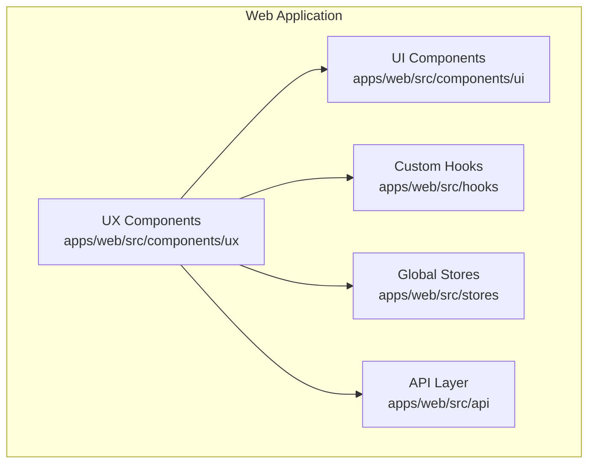

[No sources needed since this diagram shows conceptual workflow, not actual code structure]

## Core Components
This section introduces each UX component and its primary purpose, focusing on user experience outcomes and behavioral expectations.

- BlurValidation: Provides contextual validation feedback with blur-triggered validation and visual cues.
- Breadcrumbs: Displays hierarchical navigation paths with clickable segments and current location emphasis.
- ConfirmationDialog: Presents modal confirmations for destructive actions with clear choices and optional custom messaging.
- DraftBanner: Communicates draft state and enables quick actions such as saving or discarding drafts.
- ErrorCodeSystem: Centralizes error handling and displays user-friendly messages with actionable guidance.
- FileTypePreview: Renders previews for uploaded files with type-specific icons and metadata.
- KeyboardShortcuts: Registers and surfaces keyboard shortcuts for power users while maintaining discoverability.
- NetworkStatus: Monitors connectivity and displays status indicators with retry and recovery suggestions.
- NielsenScore: Visualizes scoring metrics with progress indicators and trend feedback.
- Onboarding: Guides new users through essential steps with progressive disclosure and contextual help.
- RecentlyAnswered: Highlights recently answered items to aid navigation and review.
- UploadProgress: Shows upload status, progress bars, and completion feedback with error handling.

**Section sources**
- [BlurValidation.tsx](file://apps/web/src/components/ux/BlurValidation.tsx)
- [Breadcrumbs.tsx](file://apps/web/src/components/ux/Breadcrumbs.tsx)
- [ConfirmationDialog.tsx](file://apps/web/src/components/ux/ConfirmationDialog.tsx)
- [DraftBanner.tsx](file://apps/web/src/components/ux/DraftBanner.tsx)
- [ErrorCodeSystem.tsx](file://apps/web/src/components/ux/ErrorCodeSystem.tsx)
- [FileTypePreview.tsx](file://apps/web/src/components/ux/FileTypePreview.tsx)
- [KeyboardShortcuts.tsx](file://apps/web/src/components/ux/KeyboardShortcuts.tsx)
- [NetworkStatus.tsx](file://apps/web/src/components/ux/NetworkStatus.tsx)
- [NielsenScore.tsx](file://apps/web/src/components/ux/NielsenScore.tsx)
- [Onboarding.tsx](file://apps/web/src/components/ux/Onboarding.tsx)
- [RecentlyAnswered.tsx](file://apps/web/src/components/ux/RecentlyAnswered.tsx)
- [UploadProgress.tsx](file://apps/web/src/components/ux/UploadProgress.tsx)

## Architecture Overview
The UX components follow a consistent pattern:
- Props-driven configuration for behavior and appearance
- Internal state management for ephemeral UI states
- Integration with shared stores and APIs for persistent data and backend synchronization
- Accessibility-first design with ARIA attributes and keyboard navigation
- Animation and transitions for smooth feedback

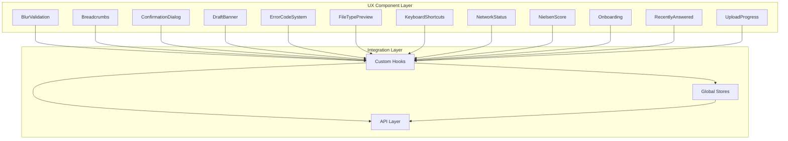

[No sources needed since this diagram shows conceptual workflow, not actual code structure]

## Detailed Component Analysis

### BlurValidation
- Purpose: Provide immediate, non-intrusive validation feedback triggered when an input loses focus.
- Interaction behavior: On blur, validates the field value against configured rules and displays inline feedback.
- Feedback mechanisms: Visual indicators (e.g., color, icon), optional tooltip or message.
- Configuration options: Validation rules, message templates, debounce timing, trigger conditions.
- State management: Tracks touched state, validation result, and error messages.
- Backend integration: Optional async validation via API calls during blur.
- Real-time updates: Debounced validation prevents excessive network calls.
- Customization: Accepts custom validators, error mappers, and styling overrides.

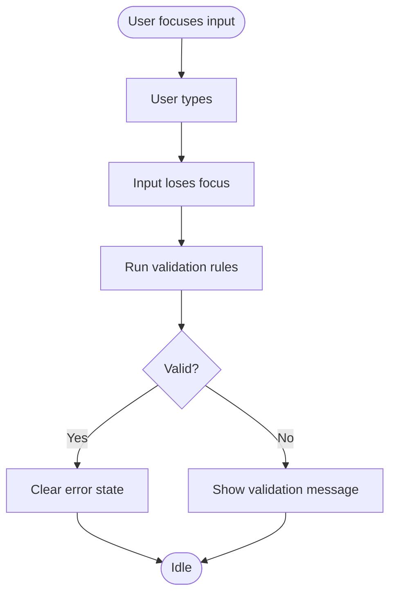

**Diagram sources**
- [BlurValidation.tsx](file://apps/web/src/components/ux/BlurValidation.tsx)

**Section sources**
- [BlurValidation.tsx](file://apps/web/src/components/ux/BlurValidation.tsx)

### Breadcrumbs
- Purpose: Help users understand their location and navigate back through hierarchical contexts.
- Interaction behavior: Clickable segments route to parent pages; current segment is emphasized.
- Feedback mechanisms: Hover states, focus outlines, and optional separators.
- Configuration options: Items array, separator style, truncation behavior, and click handlers.
- State management: Maintains active segment and handles navigation events.
- Backend integration: Resolves dynamic labels and routes via API or routing configuration.
- Real-time updates: Reflects route changes automatically.
- Customization: Custom separators, ellipsis for overflow, and custom item rendering.

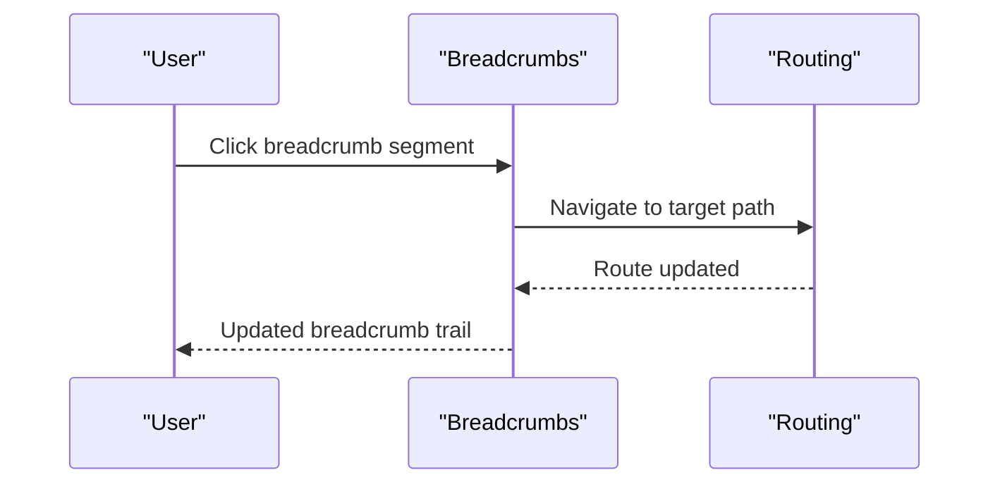

**Diagram sources**
- [Breadcrumbs.tsx](file://apps/web/src/components/ux/Breadcrumbs.tsx)

**Section sources**
- [Breadcrumbs.tsx](file://apps/web/src/components/ux/Breadcrumbs.tsx)

### ConfirmationDialog
- Purpose: Prevent accidental destructive actions by requiring explicit confirmation.
- Interaction behavior: Opens on demand; user must confirm or cancel; supports keyboard shortcuts.
- Feedback mechanisms: Modal overlay, prominent action buttons, optional secondary actions.
- Configuration options: Title, description, confirm/cancel labels, variant styling, and callback hooks.
- State management: Controlled open/close state; handles loading and disabled states.
- Backend integration: Executes action callbacks after confirmation; handles async outcomes.
- Real-time updates: Updates based on external triggers (e.g., form submission).
- Customization: Custom actions, additional buttons, and variant themes.

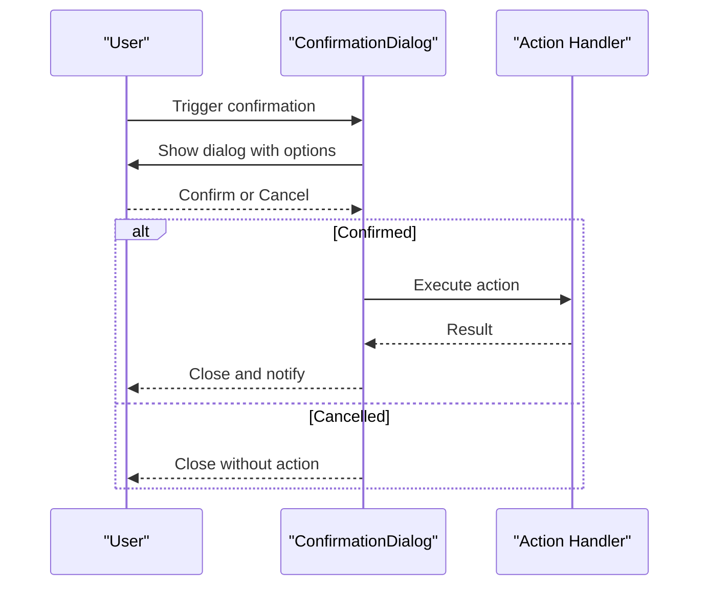

**Diagram sources**
- [ConfirmationDialog.tsx](file://apps/web/src/components/ux/ConfirmationDialog.tsx)

**Section sources**
- [ConfirmationDialog.tsx](file://apps/web/src/components/ux/ConfirmationDialog.tsx)

### DraftBanner
- Purpose: Inform users of draft status and enable quick actions to manage drafts.
- Interaction behavior: Appears when a draft exists; offers save, discard, or continue editing.
- Feedback mechanisms: Banner with status color, action buttons, and optional dismiss controls.
- Configuration options: Visibility conditions, action handlers, and banner content.
- State management: Tracks draft existence and user interactions.
- Backend integration: Syncs with draft persistence service; refreshes on save/discard.
- Real-time updates: Updates when draft state changes externally.
- Customization: Content templates, action variants, and auto-hide behavior.

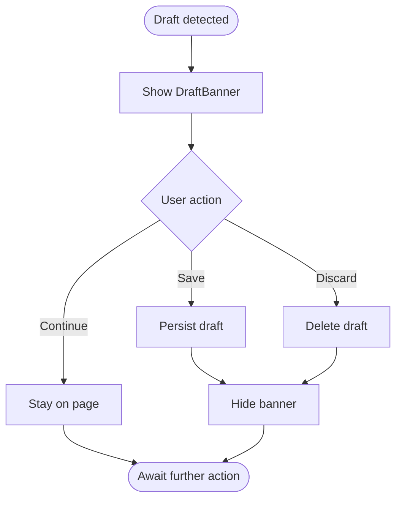

**Diagram sources**
- [DraftBanner.tsx](file://apps/web/src/components/ux/DraftBanner.tsx)

**Section sources**
- [DraftBanner.tsx](file://apps/web/src/components/ux/DraftBanner.tsx)

### ErrorCodeSystem
- Purpose: Centralize error handling and present user-friendly messages with guidance.
- Interaction behavior: Captures errors globally and renders appropriate UI with recovery options.
- Feedback mechanisms: Toasts, banners, or inline messages depending on severity and context.
- Configuration options: Severity mapping, fallback messages, retry actions, and custom renderers.
- State management: Aggregates recent errors and manages visibility and dismissal.
- Backend integration: Subscribes to API error streams and maps server-side codes to user-facing messages.
- Real-time updates: Reacts to new errors and clears resolved ones.
- Customization: Severity thresholds, custom actions per error category, and localization support.

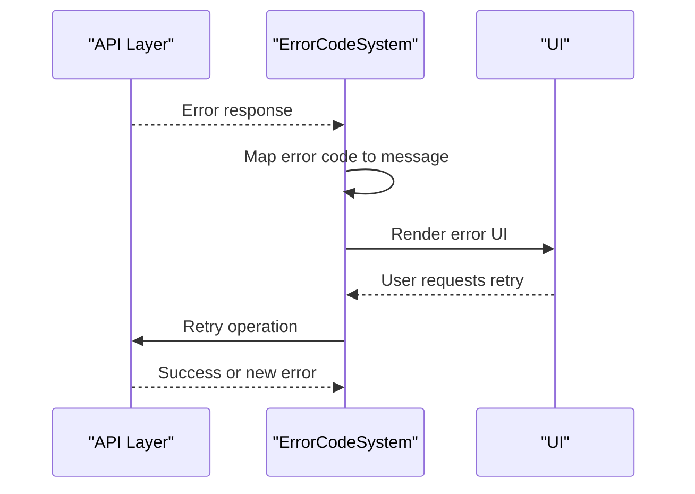

**Diagram sources**
- [ErrorCodeSystem.tsx](file://apps/web/src/components/ux/ErrorCodeSystem.tsx)

**Section sources**
- [ErrorCodeSystem.tsx](file://apps/web/src/components/ux/ErrorCodeSystem.tsx)

### FileTypePreview
- Purpose: Provide a compact preview of uploaded files with type-specific visuals.
- Interaction behavior: Displays thumbnail/icon/metadata; supports hover details and download actions.
- Feedback mechanisms: Loading states, placeholders, and error indicators for unsupported types.
- Configuration options: File object, preview size, fallback icon, and action handlers.
- State management: Handles loading, error, and success states for previews.
- Backend integration: Fetches preview images or metadata from storage APIs.
- Real-time updates: Refreshes when file selection changes.
- Customization: Custom renderers for specific types, size presets, and action menus.

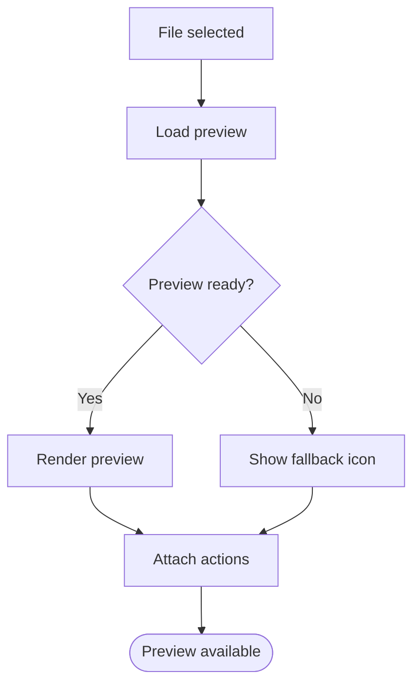

**Diagram sources**
- [FileTypePreview.tsx](file://apps/web/src/components/ux/FileTypePreview.tsx)

**Section sources**
- [FileTypePreview.tsx](file://apps/web/src/components/ux/FileTypePreview.tsx)

### KeyboardShortcuts
- Purpose: Register and display keyboard shortcuts to improve efficiency and accessibility.
- Interaction behavior: Registers global or scoped shortcuts; shows help overlay on demand.
- Feedback mechanisms: Highlighted keys, help panel, and optional audible cues.
- Configuration options: Shortcut definitions, scope, help text, and platform-specific modifiers.
- State management: Tracks registered shortcuts and active help state.
- Backend integration: No direct backend integration; relies on browser APIs and DOM events.
- Real-time updates: Dynamically updates when shortcuts change.
- Customization: Dynamic registration, conditional help visibility, and custom key rendering.

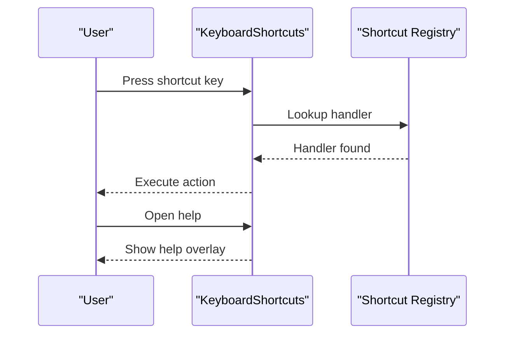

**Diagram sources**
- [KeyboardShortcuts.tsx](file://apps/web/src/components/ux/KeyboardShortcuts.tsx)

**Section sources**
- [KeyboardShortcuts.tsx](file://apps/web/src/components/ux/KeyboardShortcuts.tsx)

### NetworkStatus
- Purpose: Monitor connectivity and inform users of network issues with recovery guidance.
- Interaction behavior: Auto-detects connection state; shows status indicator and optional retry button.
- Feedback mechanisms: Status badges, tooltips, and animated indicators.
- Configuration options: Polling intervals, retry limits, and custom messages.
- State management: Tracks online/offline state and retry attempts.
- Backend integration: Uses browser online/offline events and periodic health checks.
- Real-time updates: Updates immediately on connection changes.
- Customization: Custom retry logic, status variants, and localized messages.

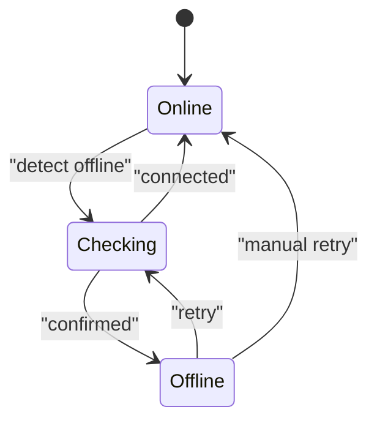

**Diagram sources**
- [NetworkStatus.tsx](file://apps/web/src/components/ux/NetworkStatus.tsx)

**Section sources**
- [NetworkStatus.tsx](file://apps/web/src/components/ux/NetworkStatus.tsx)

### NielsenScore
- Purpose: Visualize scoring metrics with progress indicators and trend feedback.
- Interaction behavior: Displays score with progress bar and optional trend arrows.
- Feedback mechanisms: Color-coded score bands, tooltips, and trend indicators.
- Configuration options: Score range, thresholds, labels, and trend direction.
- State management: Tracks current score and historical trends.
- Backend integration: Pulls scores from analytics or scoring engine APIs.
- Real-time updates: Updates on new scores or manual refresh.
- Customization: Threshold bands, custom labels, and trend styling.

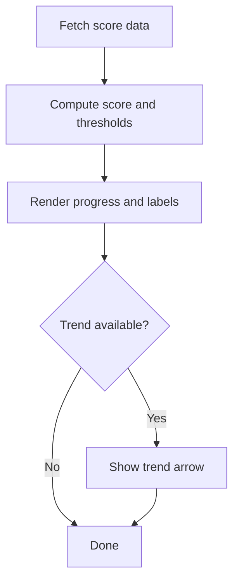

**Diagram sources**
- [NielsenScore.tsx](file://apps/web/src/components/ux/NielsenScore.tsx)

**Section sources**
- [NielsenScore.tsx](file://apps/web/src/components/ux/NielsenScore.tsx)

### Onboarding
- Purpose: Guide new users through essential steps to reduce friction and increase engagement.
- Interaction behavior: Progressive disclosure with step indicators and navigation controls.
- Feedback mechanisms: Step completion markers, tooltips, and optional skip/exit options.
- Configuration options: Steps definition, completion criteria, and exit behavior.
- State management: Tracks current step, completion status, and user preferences.
- Backend integration: Persists onboarding state and preferences via user profile APIs.
- Real-time updates: Progress updates as steps are completed.
- Customization: Custom steps, branching logic, and skip conditions.

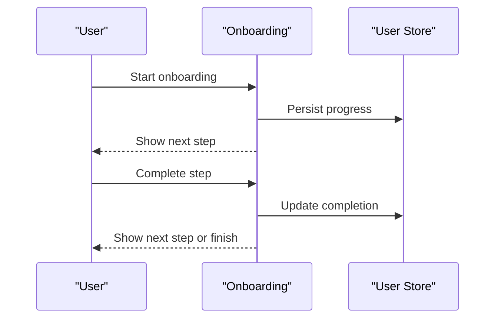

**Diagram sources**
- [Onboarding.tsx](file://apps/web/src/components/ux/Onboarding.tsx)

**Section sources**
- [Onboarding.tsx](file://apps/web/src/components/ux/Onboarding.tsx)

### RecentlyAnswered
- Purpose: Highlight recently answered items to facilitate review and follow-up.
- Interaction behavior: Lists recent answers with timestamps and navigation actions.
- Feedback mechanisms: Hover states, selection indicators, and optional sorting controls.
- Configuration options: Item count, sorting order, and navigation targets.
- State management: Tracks recent answers and user selections.
- Backend integration: Loads recent answers from questionnaire or evidence APIs.
- Real-time updates: Refreshes when new answers are submitted.
- Customization: Custom item rendering, filtering, and navigation handlers.

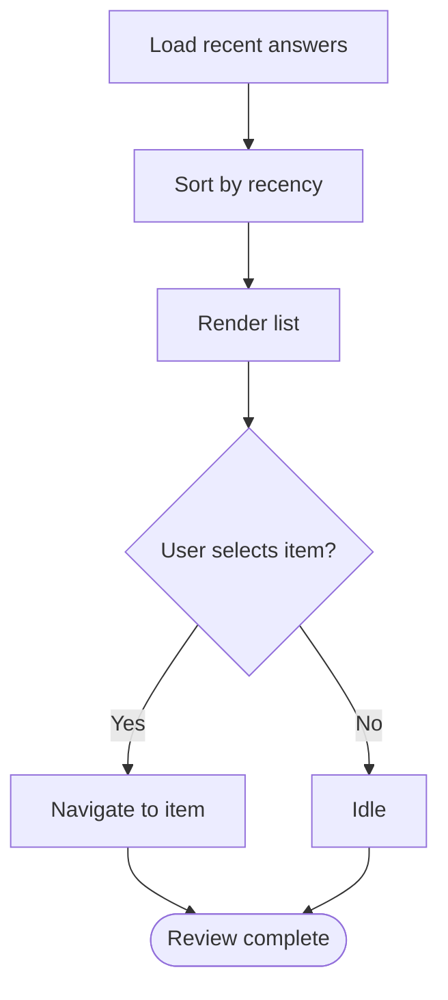

**Diagram sources**
- [RecentlyAnswered.tsx](file://apps/web/src/components/ux/RecentlyAnswered.tsx)

**Section sources**
- [RecentlyAnswered.tsx](file://apps/web/src/components/ux/RecentlyAnswered.tsx)

### UploadProgress
- Purpose: Provide transparent feedback during file uploads with progress tracking and completion.
- Interaction behavior: Shows progress bar, percentage, and estimated time; handles errors gracefully.
- Feedback mechanisms: Progress indicators, success/failure states, and retry actions.
- Configuration options: Max size, accepted types, chunk sizes, and retry policies.
- State management: Tracks upload state, progress, and error conditions.
- Backend integration: Streams uploads to storage APIs and handles multipart/form-data.
- Real-time updates: Updates progress in real-time; polls for completion.
- Customization: Custom progress renderers, drag-and-drop area, and error messages.

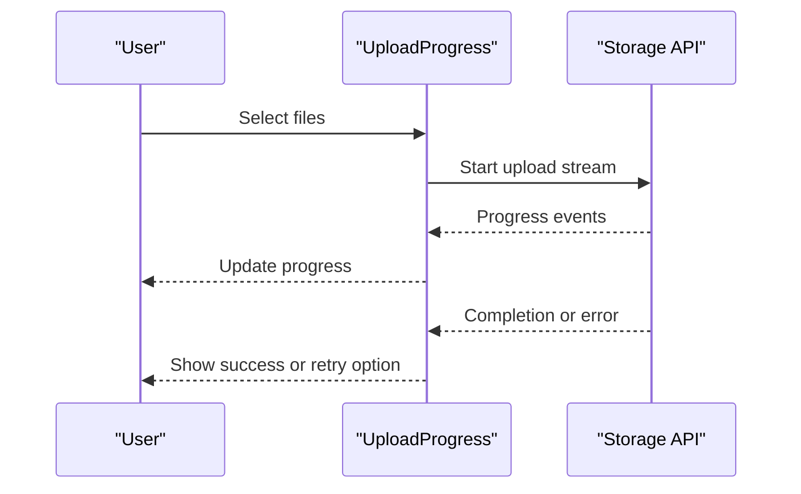

**Diagram sources**
- [UploadProgress.tsx](file://apps/web/src/components/ux/UploadProgress.tsx)

**Section sources**
- [UploadProgress.tsx](file://apps/web/src/components/ux/UploadProgress.tsx)

## Dependency Analysis
The UX components share common integration points:
- Custom hooks for state and effects
- Global stores for user preferences and application state
- API layer for backend communication
- UI primitives for consistent styling and behavior

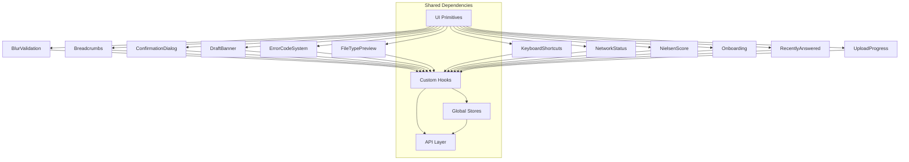

[No sources needed since this diagram shows conceptual workflow, not actual code structure]

## Performance Considerations
- Debounce and throttle expensive operations (e.g., validation, search, polling).
- Virtualize long lists (e.g., RecentlyAnswered) to limit DOM nodes.
- Lazy load previews and heavy assets (e.g., FileTypePreview) to reduce initial payload.
- Minimize re-renders by isolating state and using memoization where appropriate.
- Use efficient polling intervals and backoff strategies for network-dependent components.
- Optimize animations to avoid layout thrashing; prefer transform and opacity changes.

[No sources needed since this section provides general guidance]

## Troubleshooting Guide
- Validation not triggering: Verify blur event binding and ensure the component is not disabled.
- Breadcrumb navigation fails: Check route resolution and ensure dynamic labels are provided.
- ConfirmationDialog does not close: Confirm controlled state handling and callback execution.
- DraftBanner persists incorrectly: Validate draft persistence and state synchronization.
- ErrorCodeSystem shows generic messages: Map server error codes to user-friendly messages.
- FileTypePreview fails: Confirm file type support and fallback rendering.
- KeyboardShortcuts not working: Verify key combinations and scope; ensure focus management.
- NetworkStatus false positives: Adjust polling intervals and health check endpoints.
- NielsenScore not updating: Validate data fetching and threshold computation.
- Onboarding stuck: Check progress persistence and completion criteria.
- RecentlyAnswered stale: Ensure data refresh on new submissions.
- UploadProgress stuck: Verify streaming implementation and error handling.

**Section sources**
- [ErrorCodeSystem.tsx](file://apps/web/src/components/ux/ErrorCodeSystem.tsx)
- [UploadProgress.tsx](file://apps/web/src/components/ux/UploadProgress.tsx)

## Conclusion
These UX enhancement components collectively improve usability, accessibility, and user confidence across the application. By leveraging props-driven configuration, robust state management, and seamless backend integration, they provide consistent feedback and intuitive interactions. The documented patterns and customization options enable teams to adapt components for diverse scenarios while maintaining a cohesive user experience.

[No sources needed since this section summarizes without analyzing specific files]

## Appendices
- Component composition examples:
  - Combine BlurValidation with ConfirmationDialog for form safety.
  - Pair DraftBanner with UploadProgress for draft-aware uploads.
  - Integrate NielsenScore with RecentlyAnswered for performance insights.
- Best practices:
  - Keep configuration centralized in props and stores.
  - Use accessibility attributes and semantic markup.
  - Provide clear feedback for all user actions and system events.
  - Test components across browsers and devices.

[No sources needed since this section provides general guidance]