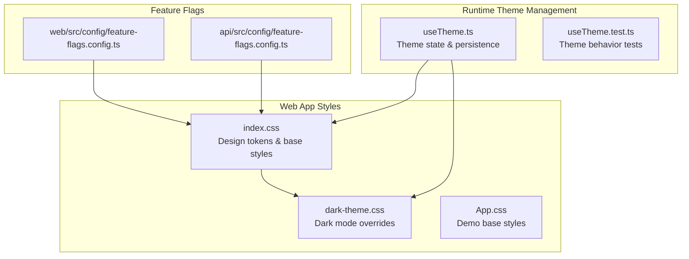
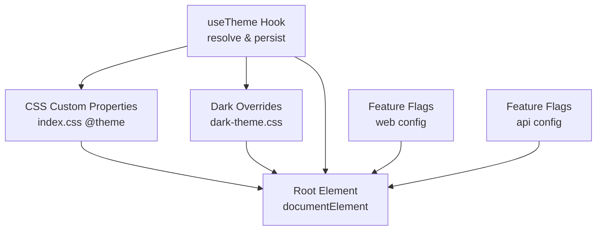
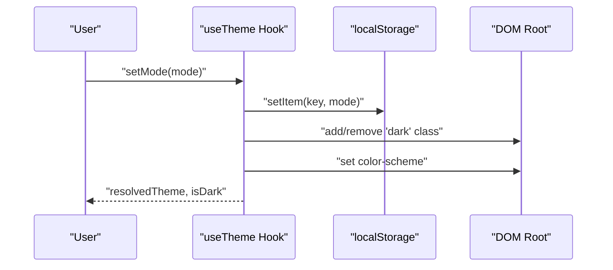
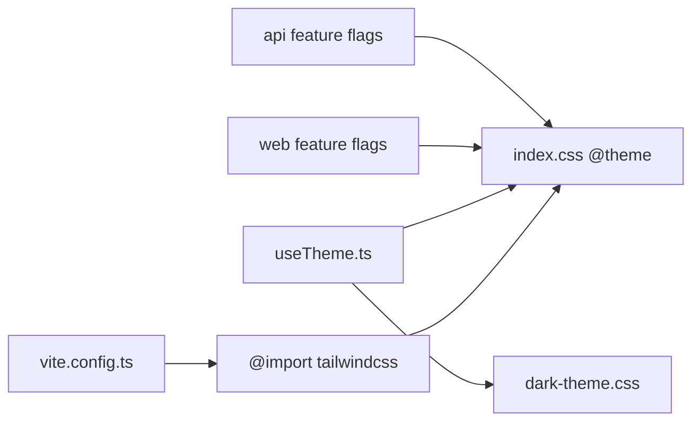

# Design System

<cite>
**Referenced Files in This Document**
- [index.css](file://apps/web/src/index.css)
- [dark-theme.css](file://apps/web/src/styles/dark-theme.css)
- [App.css](file://apps/web/src/App.css)
- [useTheme.ts](file://apps/web/src/hooks/useTheme.ts)
- [useTheme.test.ts](file://apps/web/src/hooks/useTheme.test.ts)
- [vite.config.ts](file://apps/web/vite.config.ts)
- [feature-flags.config.ts](file://apps/web/src/config/feature-flags.config.ts)
- [feature-flags.config.ts](file://apps/api/src/config/feature-flags.config.ts)
</cite>

## Table of Contents
1. [Introduction](#introduction)
2. [Project Structure](#project-structure)
3. [Core Components](#core-components)
4. [Architecture Overview](#architecture-overview)
5. [Detailed Component Analysis](#detailed-component-analysis)
6. [Dependency Analysis](#dependency-analysis)
7. [Performance Considerations](#performance-considerations)
8. [Accessibility Considerations](#accessibility-considerations)
9. [Extensibility and Guidelines](#extensibility-and-guidelines)
10. [Troubleshooting Guide](#troubleshooting-guide)
11. [Conclusion](#conclusion)

## Introduction
This document describes the design system and styling architecture for the web application. It covers the Tailwind CSS 4 implementation, theme configuration, design tokens, dark/light theme toggle, theme switching mechanism, component styling patterns, CSS custom properties usage, responsive design, design tokens (color palette, typography, spacing, shadows), feature flags for progressive enhancement, accessibility, and guidelines for extending the system.

## Project Structure
The design system is primarily implemented in the web application under apps/web/src. Key files include:
- Global design tokens and base styles
- Dark theme overrides
- Theme hook for runtime switching
- Feature flags configuration for progressive enhancement

**Diagram sources**
- [index.css:1-159](file://apps/web/src/index.css#L1-L159)
- [dark-theme.css:1-265](file://apps/web/src/styles/dark-theme.css#L1-L265)
- [App.css:1-43](file://apps/web/src/App.css#L1-L43)
- [useTheme.ts:1-129](file://apps/web/src/hooks/useTheme.ts#L1-L129)
- [useTheme.test.ts:1-294](file://apps/web/src/hooks/useTheme.test.ts#L1-L294)
- [feature-flags.config.ts](file://apps/web/src/config/feature-flags.config.ts)
- [feature-flags.config.ts](file://apps/api/src/config/feature-flags.config.ts)

**Section sources**
- [index.css:1-159](file://apps/web/src/index.css#L1-L159)
- [dark-theme.css:1-265](file://apps/web/src/styles/dark-theme.css#L1-L265)
- [App.css:1-43](file://apps/web/src/App.css#L1-L43)
- [useTheme.ts:1-129](file://apps/web/src/hooks/useTheme.ts#L1-L129)
- [useTheme.test.ts:1-294](file://apps/web/src/hooks/useTheme.test.ts#L1-L294)
- [feature-flags.config.ts](file://apps/web/src/config/feature-flags.config.ts)
- [feature-flags.config.ts](file://apps/api/src/config/feature-flags.config.ts)

## Core Components
- Design tokens: Centralized CSS custom properties define brand colors, accents, statuses, typography, radius, shadows, animations, and focus styles.
- Dark theme: A dedicated stylesheet overrides tokens for dark mode and includes component-specific adjustments.
- Theme hook: Provides theme mode selection (light, dark, system), resolves effective theme, persists preferences, and toggles the root class for CSS variable updates.
- Base styles: Minimal global resets and focus ring utilities complement the token-driven design.

Key token categories:
- Color palette: Brand, accent, success, warning, danger, and neutral surface tones.
- Typography: Sans-serif font stack with Inter as the primary font.
- Spacing and radius: Consistent scale for paddings, margins, and border radii.
- Shadows: Multiple elevation levels for cards, floating panels, overlays, and xs.
- Animations: Reusable animation definitions for fade-in, slide-up, slide-in-right, scale-in, and shimmer.

**Section sources**
- [index.css:8-85](file://apps/web/src/index.css#L8-L85)
- [dark-theme.css:6-65](file://apps/web/src/styles/dark-theme.css#L6-L65)
- [useTheme.ts:31-103](file://apps/web/src/hooks/useTheme.ts#L31-L103)

## Architecture Overview
The design system architecture centers on CSS custom properties for theme tokens and a React hook for runtime theme resolution and persistence. The dark theme stylesheet overrides tokens and adjusts component styles. Feature flags enable progressive enhancement across the web and API layers.

**Diagram sources**
- [index.css:8-85](file://apps/web/src/index.css#L8-L85)
- [dark-theme.css:6-65](file://apps/web/src/styles/dark-theme.css#L6-L65)
- [useTheme.ts:71-81](file://apps/web/src/hooks/useTheme.ts#L71-L81)
- [feature-flags.config.ts](file://apps/web/src/config/feature-flags.config.ts)
- [feature-flags.config.ts](file://apps/api/src/config/feature-flags.config.ts)

## Detailed Component Analysis

### Theme Token System and Base Styles
- Tokens are defined inside a Tailwind @theme block and consumed via var() in base styles and utilities.
- Focus ring is standardized globally for keyboard navigation.
- Smooth scrolling is enabled at the root.

Implementation highlights:
- Tokens include brand/accent/status palettes, neutral surfaces, typography, radius, shadows, and animation definitions.
- Base body uses surface tokens for background and text color.
- Focus ring uses brand color with offset and small radius.

**Section sources**
- [index.css:8-85](file://apps/web/src/index.css#L8-L85)
- [index.css:144-159](file://apps/web/src/index.css#L144-L159)

### Dark Theme Implementation
- The .dark class overrides tokens to invert surface colors and adjust brand/accent/status hues for readability.
- Component-level overrides address inputs, buttons, borders, tables, and scrollbars.
- Transition effects smooth theme switching.
- color-scheme is set on the root element for native OS integrations.

Key behaviors:
- Surface tokens are inverted (e.g., 50 becomes 900).
- Brand/accent tokens are remapped for contrast.
- Inputs, selects, and textareas receive dark-specific backgrounds, borders, and placeholder colors.
- Tables and hover states are adjusted for readability.
- Scrollbar colors adapt to dark backgrounds.

**Section sources**
- [dark-theme.css:6-65](file://apps/web/src/styles/dark-theme.css#L6-L65)
- [dark-theme.css:138-155](file://apps/web/src/styles/dark-theme.css#L138-L155)
- [dark-theme.css:227-237](file://apps/web/src/styles/dark-theme.css#L227-L237)
- [dark-theme.css:240-256](file://apps/web/src/styles/dark-theme.css#L240-L256)
- [dark-theme.css:259-265](file://apps/web/src/styles/dark-theme.css#L259-L265)

### Theme Switching Mechanism
The useTheme hook manages:
- Mode storage: light, dark, system.
- Persistence: localStorage key for user preference.
- Resolution: resolves to light or dark based on mode and system preference.
- DOM application: adds/removes .dark class and sets color-scheme on the root element.
- Toggling: switches between light and dark modes when not in system mode.

**Diagram sources**
- [useTheme.ts:84-103](file://apps/web/src/hooks/useTheme.ts#L84-L103)
- [useTheme.ts:71-81](file://apps/web/src/hooks/useTheme.ts#L71-L81)

Behavioral guarantees verified by tests:
- Defaults to system mode when no stored preference.
- Resolves to light when system prefers light and vice versa.
- Persists mode changes to localStorage.
- Adds/removes .dark class and color-scheme appropriately.
- Ignores system preference changes when mode is explicit.

**Section sources**
- [useTheme.ts:31-103](file://apps/web/src/hooks/useTheme.ts#L31-L103)
- [useTheme.test.ts:57-244](file://apps/web/src/hooks/useTheme.test.ts#L57-L244)

### Component Styling Patterns and CSS Custom Properties
- Utilities consume tokens via var(--token-name) for colors, shadows, radius, and animations.
- Component-level overrides in dark-theme.css target common Tailwind utility classes to maintain consistency.
- Focus rings are standardized globally to avoid duplication.

Patterns:
- Use tokens for consistent spacing, color, and elevation.
- Prefer utility-first classes that map to tokens.
- Override utilities in dark-theme.css when necessary for readability.

**Section sources**
- [index.css:144-159](file://apps/web/src/index.css#L144-L159)
- [dark-theme.css:79-237](file://apps/web/src/styles/dark-theme.css#L79-L237)

### Responsive Design and Breakpoints
- The codebase does not define custom Tailwind breakpoints.
- Responsive utilities rely on Tailwind’s default breakpoint scale.
- No custom @media rules are present in the design system styles.

Guidance:
- Use Tailwind’s default breakpoints (sm, md, lg, xl, 2xl) for responsive layouts.
- Avoid introducing custom breakpoints to maintain consistency.

**Section sources**
- [index.css:1-6](file://apps/web/src/index.css#L1-L6)
- [App.css:30-34](file://apps/web/src/App.css#L30-L34)

### Feature Flags for Progressive Enhancement
- Web application feature flags are configured in the web app’s feature flags config.
- API feature flags are configured in the API’s feature flags config.
- These flags can gate experimental styling features or new design variants.

Recommendations:
- Use feature flags to incrementally roll out new tokens, components, or variants.
- Keep flags namespaced and documented alongside the features they control.

**Section sources**
- [feature-flags.config.ts](file://apps/web/src/config/feature-flags.config.ts)
- [feature-flags.config.ts](file://apps/api/src/config/feature-flags.config.ts)

## Dependency Analysis
The design system depends on:
- Tailwind CSS 4 via @import and @theme directives.
- CSS custom properties for tokenization.
- React hook for runtime theme management.
- Optional feature flags for progressive rollout.

**Diagram sources**
- [vite.config.ts](file://apps/web/vite.config.ts)
- [index.css:1-1](file://apps/web/src/index.css#L1-L1)
- [useTheme.ts:1-103](file://apps/web/src/hooks/useTheme.ts#L1-L103)
- [dark-theme.css:1-265](file://apps/web/src/styles/dark-theme.css#L1-L265)
- [feature-flags.config.ts](file://apps/web/src/config/feature-flags.config.ts)
- [feature-flags.config.ts](file://apps/api/src/config/feature-flags.config.ts)

**Section sources**
- [vite.config.ts](file://apps/web/vite.config.ts)
- [index.css:1-1](file://apps/web/src/index.css#L1-L1)
- [useTheme.ts:1-103](file://apps/web/src/hooks/useTheme.ts#L1-L103)
- [dark-theme.css:1-265](file://apps/web/src/styles/dark-theme.css#L1-L265)
- [feature-flags.config.ts](file://apps/web/src/config/feature-flags.config.ts)
- [feature-flags.config.ts](file://apps/api/src/config/feature-flags.config.ts)

## Performance Considerations
- CSS custom properties reduce duplication and enable efficient theme switching.
- Minimal JavaScript for theming reduces overhead.
- Avoid excessive custom @media rules; rely on Tailwind defaults to keep CSS compact.
- Keep dark-theme overrides scoped to necessary selectors to minimize cascade complexity.

## Accessibility Considerations
- Focus visibility: A visible focus ring is defined globally for keyboard navigation.
- Contrast: Dark theme remaps tokens to improve readability; ensure sufficient contrast for text and interactive elements.
- Color scheme: The root color-scheme is set to align with the active theme for OS-level support.
- WCAG alignment: Use tokens to maintain consistent contrast ratios; validate with automated and manual checks.

Recommendations:
- Validate color combinations against WCAG AA/AAA guidelines.
- Test with reduced motion preferences.
- Ensure interactive elements remain clearly distinguishable in both themes.

**Section sources**
- [index.css:155-159](file://apps/web/src/index.css#L155-L159)
- [dark-theme.css:259-265](file://apps/web/src/styles/dark-theme.css#L259-L265)

## Extensibility and Guidelines
How to extend the design system:
- Add new tokens in index.css @theme for colors, typography, spacing, shadows, and animations.
- Provide dark overrides in dark-theme.css for new tokens and component states.
- Use the useTheme hook to manage persistence and resolution; update tests in useTheme.test.ts if behavior changes.
- Gate experimental features with feature flags in both web and API configs.
- Maintain consistency by using tokens in component styles and avoiding ad-hoc hard-coded values.

Guidelines:
- Prefer tokens over hardcoded values.
- Keep dark and light variants balanced; test readability.
- Keep feature flags scoped and temporary until stabilization.
- Document new tokens and their intended use cases.

**Section sources**
- [index.css:8-85](file://apps/web/src/index.css#L8-L85)
- [dark-theme.css:6-65](file://apps/web/src/styles/dark-theme.css#L6-L65)
- [useTheme.ts:31-103](file://apps/web/src/hooks/useTheme.ts#L31-L103)
- [useTheme.test.ts:57-244](file://apps/web/src/hooks/useTheme.test.ts#L57-L244)
- [feature-flags.config.ts](file://apps/web/src/config/feature-flags.config.ts)
- [feature-flags.config.ts](file://apps/api/src/config/feature-flags.config.ts)

## Troubleshooting Guide
Common issues and resolutions:
- Theme not persisting: Verify localStorage key and that setMode writes to storage.
- Theme not applying: Confirm the .dark class is added/removed on the root element and color-scheme is set.
- System preference changes ignored: Ensure mode is not locked to a specific theme.
- Dark mode readability problems: Review dark-theme.css overrides for inputs, borders, and text colors.
- Tests failing: Use the provided test suite as a reference for expected behavior.

**Section sources**
- [useTheme.ts:71-103](file://apps/web/src/hooks/useTheme.ts#L71-L103)
- [useTheme.test.ts:179-244](file://apps/web/src/hooks/useTheme.test.ts#L179-L244)
- [dark-theme.css:138-155](file://apps/web/src/styles/dark-theme.css#L138-L155)

## Conclusion
The design system leverages Tailwind CSS 4 and a robust token-based architecture to deliver a consistent, accessible, and extensible visual language. The theme hook enables flexible light/dark/system switching with persistence, while dark-theme.css ensures readable and coherent component styling. Feature flags support progressive enhancement, and the token-first approach simplifies maintenance and extension across the application.