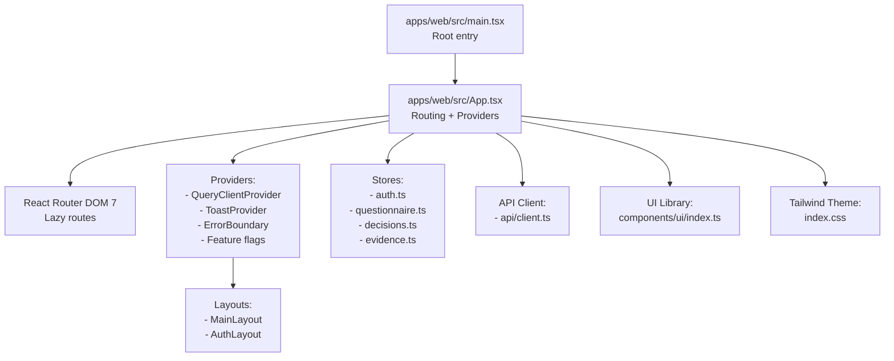
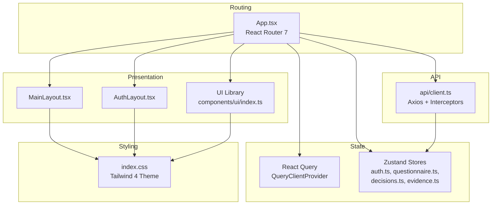
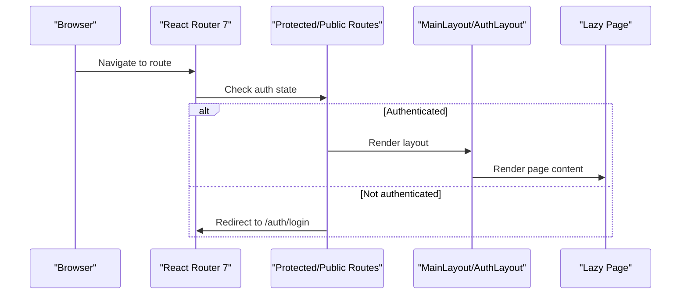
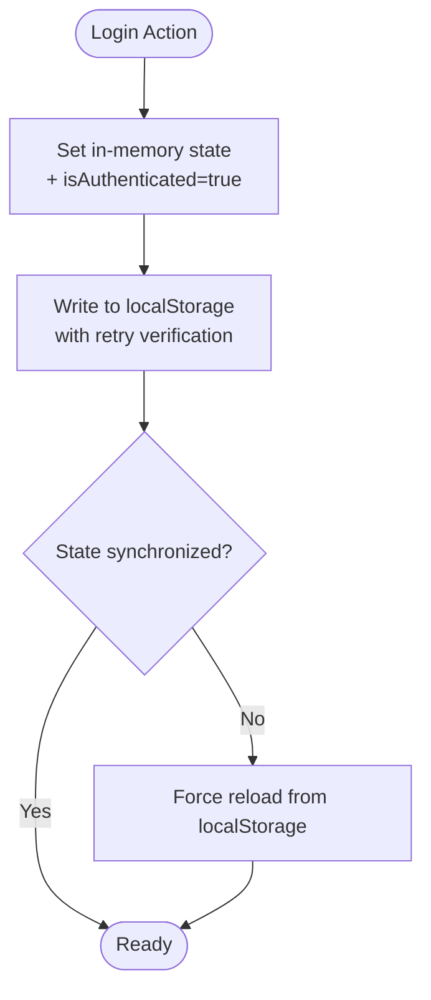
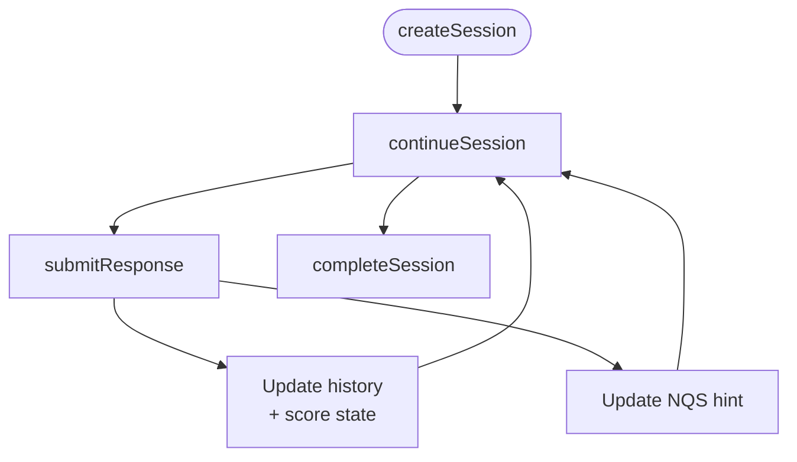
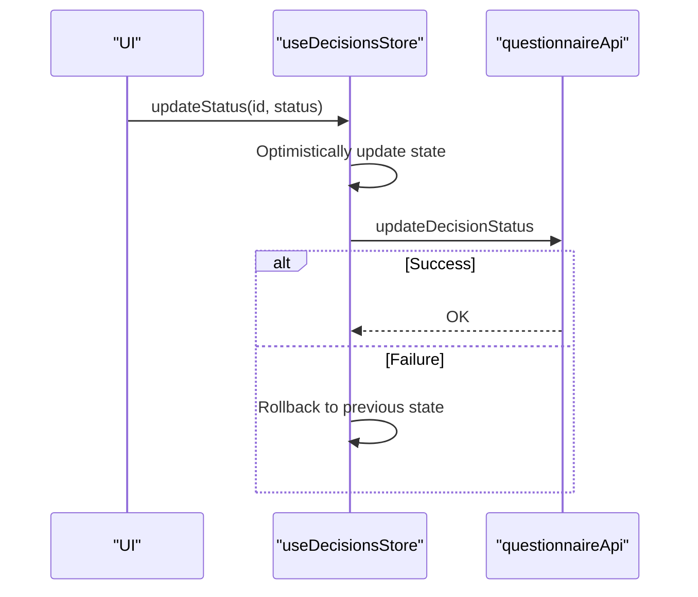
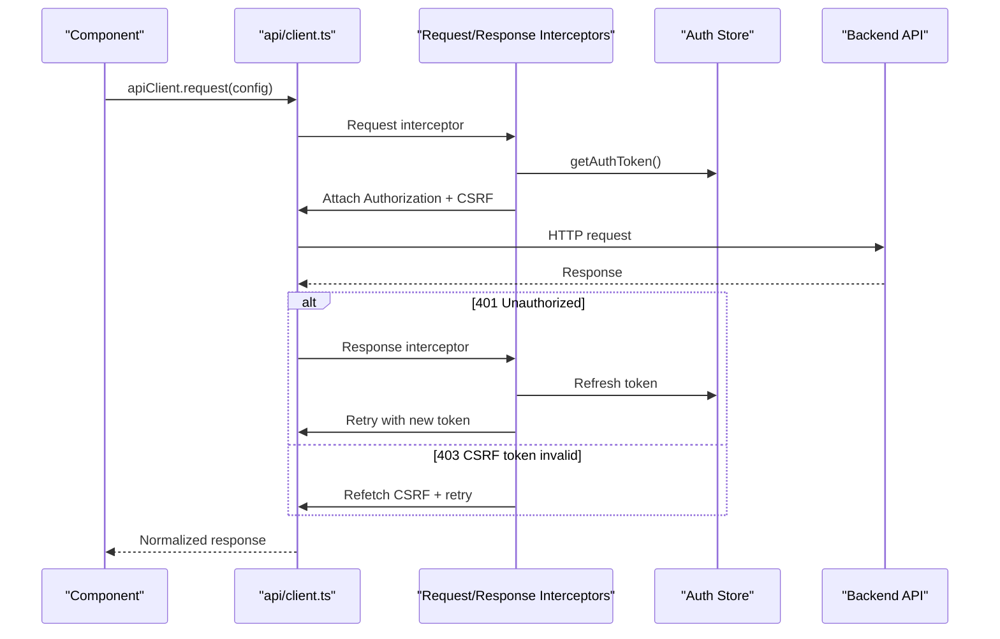
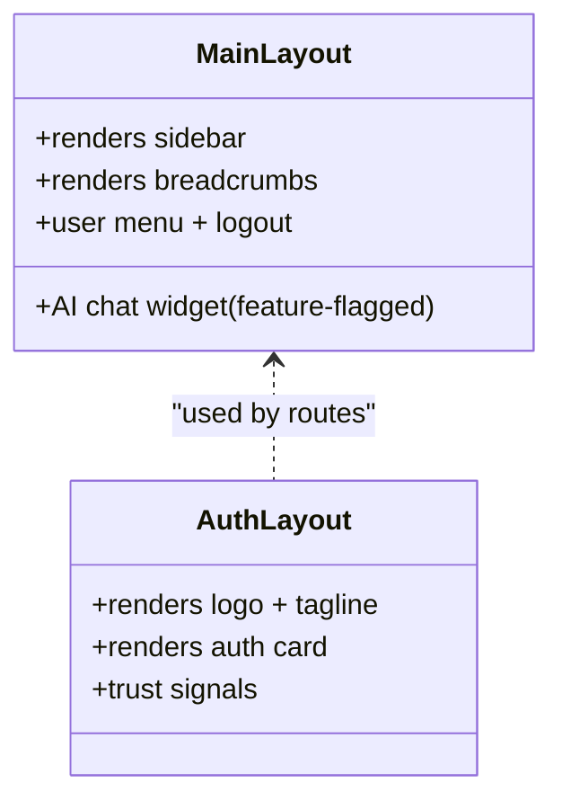
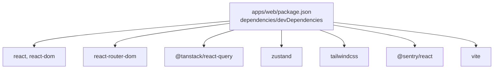

# Frontend Architecture

<cite>
**Referenced Files in This Document**
- [package.json](file://apps/web/package.json)
- [vite.config.ts](file://apps/web/vite.config.ts)
- [main.tsx](file://apps/web/src/main.tsx)
- [App.tsx](file://apps/web/src/App.tsx)
- [index.css](file://apps/web/src/index.css)
- [auth.ts](file://apps/web/src/stores/auth.ts)
- [questionnaire.ts](file://apps/web/src/stores/questionnaire.ts)
- [decisions.ts](file://apps/web/src/stores/decisions.ts)
- [evidence.ts](file://apps/web/src/stores/evidence.ts)
- [client.ts](file://apps/web/src/api/client.ts)
- [MainLayout.tsx](file://apps/web/src/components/layout/MainLayout.tsx)
- [AuthLayout.tsx](file://apps/web/src/components/layout/AuthLayout.tsx)
- [index.ts](file://apps/web/src/components/ui/index.ts)
- [index.ts](file://apps/web/src/types/index.ts)
- [feature-flags.config.ts](file://apps/web/src/config/feature-flags.config.ts)
</cite>

## Table of Contents
1. [Introduction](#introduction)
2. [Project Structure](#project-structure)
3. [Core Components](#core-components)
4. [Architecture Overview](#architecture-overview)
5. [Detailed Component Analysis](#detailed-component-analysis)
6. [Dependency Analysis](#dependency-analysis)
7. [Performance Considerations](#performance-considerations)
8. [Troubleshooting Guide](#troubleshooting-guide)
9. [Conclusion](#conclusion)
10. [Appendices](#appendices)

## Introduction
This document describes the frontend architecture of the React 19 application powering the web client. It covers component hierarchy, state management using React Query and custom stores, routing and navigation patterns, styling architecture with Tailwind CSS 4, the design system and UI component library, store management for authentication, questionnaire responses, decisions, and evidence tracking, the API integration layer with interceptors and caching, build configuration with Vite 7, development workflow, and production optimization. It also addresses accessibility, responsive design, cross-browser compatibility, performance optimization, code splitting, bundle analysis, component composition patterns, and state synchronization between frontend and backend.

## Project Structure
The frontend is organized around a modern React 19 application with TypeScript, Vite 7, and Tailwind CSS 4. Key areas:
- Application bootstrap and providers in the root entry
- Routing with React Router DOM 7 and lazy-loaded pages
- Global providers for state management, error boundaries, and UI
- Stores for authentication, questionnaire, decisions, and evidence
- API client with interceptors for auth and CSRF handling
- Layout components and a UI component library barrel export
- Tailwind theme and design system tokens

**Diagram sources**
- [main.tsx:1-23](file://apps/web/src/main.tsx#L1-L23)
- [App.tsx:189-282](file://apps/web/src/App.tsx#L189-L282)
- [vite.config.ts:1-19](file://apps/web/vite.config.ts#L1-L19)
- [index.css:8-85](file://apps/web/src/index.css#L8-L85)

**Section sources**
- [main.tsx:1-23](file://apps/web/src/main.tsx#L1-L23)
- [App.tsx:189-282](file://apps/web/src/App.tsx#L189-L282)
- [vite.config.ts:1-19](file://apps/web/vite.config.ts#L1-L19)
- [index.css:8-85](file://apps/web/src/index.css#L8-L85)

## Core Components
- Root entry initializes Sentry, creates the root, and wraps the app in an error boundary.
- App sets up providers, feature flags, React Query client, and routes with lazy loading and guards.
- Layouts provide consistent navigation and responsive behavior.
- Stores encapsulate domain-specific state and actions.
- API client centralizes HTTP requests, auth tokens, CSRF protection, and error handling.
- UI library exports reusable components.

Key implementation references:
- Root initialization and Sentry integration
- App providers, routing, and guards
- Tailwind theme tokens and animations
- Store definitions and actions
- API client interceptors and token refresh logic

**Section sources**
- [main.tsx:1-23](file://apps/web/src/main.tsx#L1-L23)
- [App.tsx:189-282](file://apps/web/src/App.tsx#L189-L282)
- [index.css:8-85](file://apps/web/src/index.css#L8-L85)
- [auth.ts:54-172](file://apps/web/src/stores/auth.ts#L54-L172)
- [questionnaire.ts:94-356](file://apps/web/src/stores/questionnaire.ts#L94-L356)
- [decisions.ts:26-90](file://apps/web/src/stores/decisions.ts#L26-L90)
- [evidence.ts:34-67](file://apps/web/src/stores/evidence.ts#L34-L67)
- [client.ts:95-325](file://apps/web/src/api/client.ts#L95-L325)

## Architecture Overview
The frontend follows a layered architecture:
- Presentation Layer: React components, layouts, and UI library
- Routing Layer: React Router with protected/public routes and lazy loading
- State Management Layer: React Query for server state caching and Zustand for client-side stores
- API Integration Layer: Axios client with request/response interceptors
- Styling Layer: Tailwind CSS 4 with a custom design system

**Diagram sources**
- [App.tsx:189-282](file://apps/web/src/App.tsx#L189-L282)
- [MainLayout.tsx:72-365](file://apps/web/src/components/layout/MainLayout.tsx#L72-L365)
- [AuthLayout.tsx:9-89](file://apps/web/src/components/layout/AuthLayout.tsx#L9-L89)
- [index.ts:5-20](file://apps/web/src/components/ui/index.ts#L5-L20)
- [index.css:8-85](file://apps/web/src/index.css#L8-L85)
- [client.ts:95-325](file://apps/web/src/api/client.ts#L95-L325)

## Detailed Component Analysis

### Routing and Navigation Patterns
- ProtectedRoute and PublicRoute wrappers enforce authentication and redirect behavior.
- Lazy-loaded routes improve initial load performance.
- Feature flags gate legacy modules and experimental features.
- NavigationGuardProvider and ConditionalProvider enable guarded and conditional feature activation.

**Diagram sources**
- [App.tsx:149-187](file://apps/web/src/App.tsx#L149-L187)
- [App.tsx:202-270](file://apps/web/src/App.tsx#L202-L270)

**Section sources**
- [App.tsx:149-187](file://apps/web/src/App.tsx#L149-L187)
- [App.tsx:202-270](file://apps/web/src/App.tsx#L202-L270)

### Authentication Store and Token Synchronization
The auth store uses Zustand with localStorage persistence and a robust synchronization strategy:
- Immediate in-memory updates
- Forced localStorage writes
- Retry-based verification to ensure state consistency
- Proactive refresh on hydration when a refresh token is present
- Security note: access tokens stored in localStorage with short expiry; refresh tokens use httpOnly cookies

**Diagram sources**
- [auth.ts:71-123](file://apps/web/src/stores/auth.ts#L71-L123)

**Section sources**
- [auth.ts:54-172](file://apps/web/src/stores/auth.ts#L54-L172)

### Questionnaire Store and Adaptive Flow
The questionnaire store manages session lifecycle, current questions, scoring, and navigation:
- Create/load/list sessions
- Continue session to fetch next questions
- Submit responses with optional time tracking
- Track question history for review/back navigation
- Load scores and dimension residuals
- Navigation helpers for previous, next, and skip

**Diagram sources**
- [questionnaire.ts:97-250](file://apps/web/src/stores/questionnaire.ts#L97-L250)

**Section sources**
- [questionnaire.ts:94-356](file://apps/web/src/stores/questionnaire.ts#L94-L356)

### Decisions Store and Optimistic Updates
The decisions store supports listing, creation, and status updates with optimistic UI:
- Optimistic update immediately reflects new status
- Automatic rollback on failure
- Centralized error handling

**Diagram sources**
- [decisions.ts:65-87](file://apps/web/src/stores/decisions.ts#L65-L87)

**Section sources**
- [decisions.ts:26-90](file://apps/web/src/stores/decisions.ts#L26-L90)

### Evidence Store and Statistics
The evidence store loads artifacts and statistics:
- List evidence items per session
- Compute and cache statistics
- Graceful error handling for stats fetching

**Section sources**
- [evidence.ts:34-67](file://apps/web/src/stores/evidence.ts#L34-L67)

### API Integration Layer and Interceptors
The API client centralizes HTTP interactions:
- Environment-aware base URL resolution
- Auth token injection from Zustand/localStorage
- CSRF token management with cookie fallback and retry
- Token refresh on 401 with subscriber queue to avoid race conditions
- Response unwrapping of standardized API envelope

**Diagram sources**
- [client.ts:161-198](file://apps/web/src/api/client.ts#L161-L198)
- [client.ts:200-323](file://apps/web/src/api/client.ts#L200-L323)

**Section sources**
- [client.ts:95-325](file://apps/web/src/api/client.ts#L95-L325)

### Layouts and Navigation
- MainLayout provides a responsive sidebar, breadcrumbs, user menu, and footer with optional AI chat widget.
- AuthLayout offers a clean, branded authentication card with trust signals.

**Diagram sources**
- [MainLayout.tsx:72-365](file://apps/web/src/components/layout/MainLayout.tsx#L72-L365)
- [AuthLayout.tsx:9-89](file://apps/web/src/components/layout/AuthLayout.tsx#L9-L89)

**Section sources**
- [MainLayout.tsx:72-365](file://apps/web/src/components/layout/MainLayout.tsx#L72-L365)
- [AuthLayout.tsx:9-89](file://apps/web/src/components/layout/AuthLayout.tsx#L9-L89)

### UI Component Library and Design System
- UI library barrel export aggregates reusable components.
- Tailwind theme defines brand colors, typography, shadows, radius, and animations.
- Focus-visible outlines and smooth scrolling enhance accessibility.

**Section sources**
- [index.ts:5-20](file://apps/web/src/components/ui/index.ts#L5-L20)
- [index.css:8-85](file://apps/web/src/index.css#L8-L85)

### Feature Flags and Conditional Providers
Feature flags control visibility of legacy/experimental features and are resolved from environment variables. ConditionalProvider wraps providers based on flags.

**Section sources**
- [feature-flags.config.ts:6-36](file://apps/web/src/config/feature-flags.config.ts#L6-L36)
- [App.tsx:189-282](file://apps/web/src/App.tsx#L189-L282)

## Dependency Analysis
External dependencies include React 19, React Router DOM 7, React Query 5, Zustand 5, Tailwind CSS 4, and Sentry. Build-time dependencies include Vite 7, SWC, and TypeScript.

**Diagram sources**
- [package.json:18-63](file://apps/web/package.json#L18-L63)

**Section sources**
- [package.json:18-63](file://apps/web/package.json#L18-L63)

## Performance Considerations
- Code splitting: Vite’s manualChunks splits vendor bundles for React and React Query to improve caching.
- Lazy loading: Routes are lazy-loaded to reduce initial bundle size.
- React Query caching: Stale time and retries configured to balance freshness and performance.
- Tailwind 4: Lightning CSS optimized builds for minimal CSS footprint.
- Bundle analysis: Use Vite’s built-in analyzer plugin or rollup-plugin-visualizer to inspect bundle composition.

Recommendations:
- Monitor LCP/FID/LH metrics with Web Vitals.
- Keep feature flags enabled only when needed to avoid unnecessary code inclusion.
- Use React Profiler to identify heavy components.

**Section sources**
- [vite.config.ts:8-17](file://apps/web/vite.config.ts#L8-L17)
- [App.tsx:139-147](file://apps/web/src/App.tsx#L139-L147)
- [package.json:59-62](file://apps/web/package.json#L59-L62)

## Troubleshooting Guide
Common issues and resolutions:
- 401 Unauthorized on initial load: The API client waits for auth hydration and retries with tokens from localStorage if needed.
- CSRF token errors: The client refetches CSRF tokens and retries requests.
- Token refresh race conditions: Subscriber queue ensures concurrent requests share the refreshed token.
- Auth state desync: Forced localStorage writes and retry verification keep in-memory and persisted state aligned.
- Feature flag visibility: Confirm environment variables for feature flags are set correctly.

**Section sources**
- [client.ts:139-158](file://apps/web/src/api/client.ts#L139-L158)
- [client.ts:244-319](file://apps/web/src/api/client.ts#L244-L319)
- [auth.ts:81-123](file://apps/web/src/stores/auth.ts#L81-L123)
- [feature-flags.config.ts:6-36](file://apps/web/src/config/feature-flags.config.ts#L6-L36)

## Conclusion
The frontend employs a modular, layered architecture leveraging React 19, React Router 7, React Query, and Zustand. It integrates a robust API client with interceptors for auth and CSRF, implements a comprehensive design system with Tailwind CSS 4, and applies performance best practices through code splitting and caching. Feature flags enable controlled rollout of new capabilities, while stores encapsulate domain logic for authentication, questionnaire flows, decisions, and evidence.

## Appendices

### Build Configuration and Development Workflow
- Scripts: dev, build, preview, test, lint, and coverage.
- Plugins: @vitejs/plugin-react, @tailwindcss/vite, TypeScript.
- Build optimization: manualChunks for vendor separation.

**Section sources**
- [package.json:6-16](file://apps/web/package.json#L6-L16)
- [vite.config.ts:1-19](file://apps/web/vite.config.ts#L1-L19)

### Accessibility and Responsive Design
- Focus-visible outlines and skip links for keyboard navigation.
- Responsive layout with collapsible sidebar and mobile-friendly navigation.
- Semantic markup and ARIA attributes in layouts and components.

**Section sources**
- [index.css:155-159](file://apps/web/src/index.css#L155-L159)
- [MainLayout.tsx:101-121](file://apps/web/src/components/layout/MainLayout.tsx#L101-L121)
- [MainLayout.tsx:305-337](file://apps/web/src/components/layout/MainLayout.tsx#L305-L337)

### Cross-Browser Compatibility
- Tailwind 4 with Lightning CSS for efficient CSS processing.
- PostCSS and autoprefixer included in devDependencies.
- Test suites and E2E tests to validate behavior across browsers.

**Section sources**
- [package.json:52-58](file://apps/web/package.json#L52-L58)